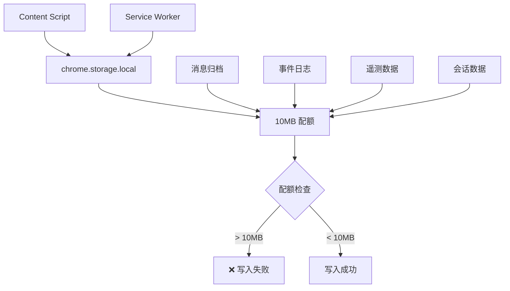
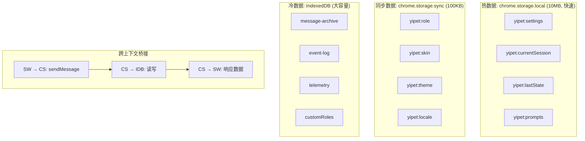
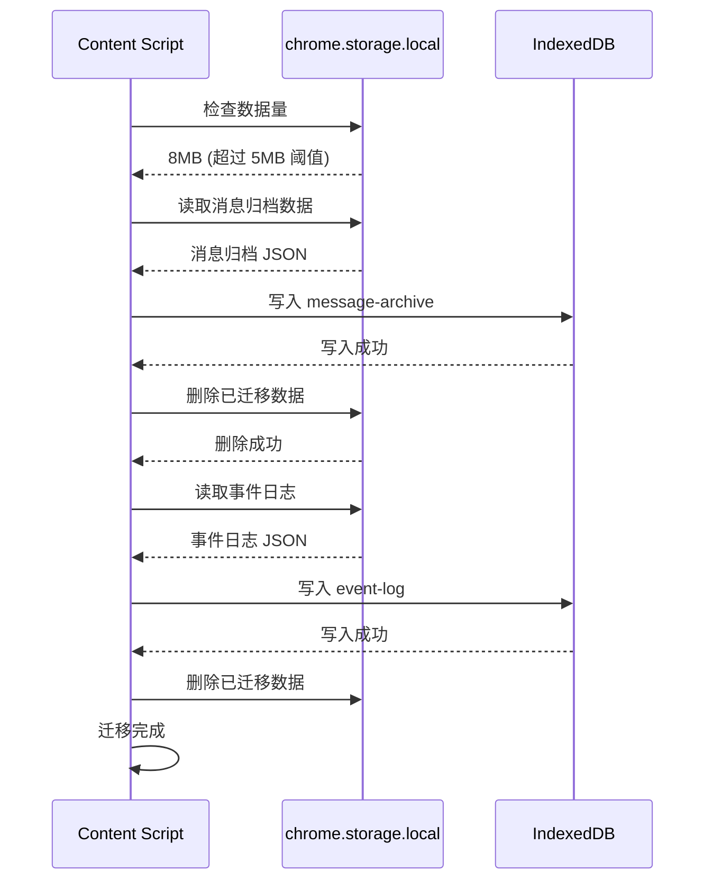

# YP-09-79: Content Script IndexedDB 大容量持久化 — 替代 chrome.storage

> 需求编号：YP-09-79 · 优先级：P2 · 人天：0.5d · 状态：需求已编写
> 依赖：YP-09-72（长会话性能优化）、YP-09-53（事件溯源）

## 背景

### 问题陈述

`chrome.storage.local` 是 Chrome 扩展的主力存储 API，但存在硬性限制：

1. **容量上限 10MB**：每个扩展的 `chrome.storage.local` 最大 10MB（不可配置配额时）。消息归档（YP-09-72）、事件日志（YP-09-53）、遥测数据（YP-09-19）、自定义角色（YP-09-74）等数据集累计可能超过此限制。
2. **无查询能力**：`chrome.storage` 仅支持 key-value 查询，无法按时间范围、标签、会话 ID 等维度检索数据。
3. **无事务支持**：批量操作不是原子的，写入失败可能导致数据不一致。
4. **同步 API 开销**：`chrome.storage` 的 API 是异步的，但底层涉及 IPC 通信，比 IndexedDB 的本地访问更慢。

**核心矛盾**：扩展数据量持续增长 vs chrome.storage 的 10MB 硬限制。IndexedDB 的容量上限为磁盘可用空间的 60%（Chrome 中），是适合大容量数据的替代方案。

### 影响范围

| # | 影响 | 严重程度 | 触发场景 |
|---|------|----------|----------|
| 1 | chrome.storage 配额超限 | 高 | 多会话消息归档 |
| 2 | 无法按维度查询数据 | 中 | 搜索/过滤需求 |
| 3 | 批量写入失败 | 中 | 大量事件日志写入 |
| 4 | SW 无法访问 Content Script 的 IDB | 中 | 跨上下文数据共享 |
| 5 | 隐私模式 IDB 不可用 | 低 | Firefox 隐私模式 |

### 挑战

| 挑战 | 说明 |
|------|------|
| 存储分层 | 哪些数据用 chrome.storage（快速/跨上下文），哪些用 IDB（大容量） |
| 迁移策略 | 现有 chrome.storage 中的数据平滑迁移到 IDB |
| 跨上下文访问 | SW 无法直接访问 Content Script 的 IDB，需通过 message 桥接 |
| 隐私模式 | Firefox 隐私模式下 IDB 不可用，需降级方案 |
| 库选择 | 原生 IDB vs idb wrapper vs Dexie.js |

---

## 一、现状分析

### 1.1 当前存储布局

```
chrome.storage.local (10MB)
├── yipet:sessions         → 会话数据（可能 > 5MB）
├── yipet:messageArchive   → 消息归档（可能 > 3MB）
├── yipet:eventLog         → 事件日志（可能 > 1MB）
├── yipet:telemetry        → 遥测数据（可能 > 500KB）
├── yipet:customRoles      → 自定义角色（< 50KB）
├── yipet:settings         → 设置（< 10KB）
├── yipet:prompts          → Prompt 历史（< 50KB）
└── yipet:lastState        → 状态快照（< 1KB）

总计：可能 > 10MB → 配额超限
```

### 1.2 存储方式对比

| 存储方式 | 容量上限 | 性能 | 查询能力 | 跨上下文 | 事务 |
|----------|---------|------|----------|----------|------|
| `chrome.storage.local` | 10MB | 快（IPC） | 仅 key-value | ✅ SW/CS 共享 | 否 |
| `chrome.storage.sync` | 100KB | 慢（网络） | 仅 key-value | ✅ 跨设备 | 否 |
| IndexedDB | ~磁盘 60% | 中（本地） | 高（索引） | ❌ 仅当前上下文 | 是 |
| Cache Storage | 不限 | 快 | 仅 URL | ✅ SW 可用 | 否 |

### 1.3 改造前数据流



### 1.4 根因矩阵

| 症状 | 根因 | 触发条件 | 频率 |
|------|------|----------|------|
| 写入失败 | 配额超限 | 数据量 > 10MB | 中 |
| 无法查询 | 无索引 | 需要按维度检索 | 中 |
| 数据不一致 | 无事务 | 批量写入失败 | 低 |
| 跨上下文不可用 | IDB 仅当前上下文 | SW 需要数据 | 中 |

---

## 二、设计决策

### 决策 1：存储分层策略 — 全量 IDB vs 混合 vs 全量 chrome.storage

| 选项 | 容量 | 性能 | 复杂度 |
|------|------|------|--------|
| 全量 IDB（所有数据） | 大 | 中 | 中（SW 访问需桥接） |
| 混合（热数据 chrome.storage + 冷数据 IDB） | 大 | 高 | 高 |
| 全量 chrome.storage（当前） | 10MB | 快 | 低 |

**选择：混合分层。** 热数据（设置、当前会话、状态快照）→ `chrome.storage.local`（快速、跨上下文）。冷数据（消息归档、事件日志、遥测）→ IndexedDB（大容量）。对设置和偏好使用 `chrome.storage.sync`（YP-09-66）。

### 决策 2：IDB 库选择 — 原生 vs idb vs Dexie.js

| 选项 | 体积 | API 友好度 | 事务支持 | TypeScript |
|------|------|-----------|----------|-----------|
| 原生 IDB API | 0KB | 低 | 是 | 中 |
| `idb` (3KB) | 3KB | 高 | 是 | 高 |
| Dexie.js (20KB) | 20KB | 最高 | 是 | 高 |

**选择：`idb`（3KB）。** 原生 IDB API 繁琐（回调地狱），`idb` 提供 Promise 包装和 TypeScript 支持，体积仅 3KB。Dexie.js 功能更全但 20KB 对浏览器扩展来说偏大。

### 决策 3：数据迁移策略 — 自动 vs 手动 vs 渐进

| 选项 | 用户感知 | 数据安全 | 实现 |
|------|----------|----------|------|
| 自动迁移（检测到旧数据 → 迁移） | 无感知 | 中 | 中 |
| 手动迁移（用户触发） | 有感知 | 高 | 低 |
| 渐进迁移（新数据写 IDB，旧数据读 chrome.storage） | 无感知 | 高 | 中 |

**选择：自动迁移 + 渐进迁移。** 首次启动时检测 chrome.storage 中是否有超过 5MB 的数据（触发迁移阈值）。迁移时先写 IDB 成功，再清 chrome.storage。新数据直接写 IDB，旧数据在读取时从 chrome.storage 读取。

### 设计决策记录

| 决策 | 选项 A | 选项 B | 选项 C | 选择 | 理由 |
|------|--------|--------|--------|------|------|
| 存储分层 | 全量 IDB | 混合 | 全量 chrome.storage | **混合** | 兼顾速度和容量 |
| IDB 库 | 原生 | idb | Dexie.js | **idb** | 轻量 + Promise |
| 迁移策略 | 自动 | 手动 | 渐进 | **自动 + 渐进** | 无感知 + 安全 |

---

## 三、目标架构

### 3.1 改造后存储架构



### 3.2 数据迁移流程



### 3.3 性能指标

| 指标 | chrome.storage.local | IndexedDB (idb) | 差异 |
|------|---------------------|-----------------|------|
| 单条写入 (< 1KB) | ~1ms | ~2ms | +1ms |
| 批量写入 (100 条) | ~10ms | ~20ms | +10ms |
| 单条读取 | ~0.5ms | ~1ms | +0.5ms |
| 范围查询 (1000 条) | 不支持 | ~5ms | - |
| 容量上限 | 10MB | ~磁盘 60% | 1000x+ |

---

## 四、具体改动

### 4.1 IDB 数据库 Schema

```typescript
// 改造前：所有数据在 chrome.storage.local
// await chrome.storage.local.set({ 'yipet:messageArchive': data });

// src/services/idb-database.ts (改造后)

import { openDB, DBSchema, IDBPDatabase } from 'idb';

interface YiPetDB extends DBSchema {
  'message-archive': {
    key: string;  // sessionId
    value: {
      sessionId: string;
      messages: ChatMessage[];
      archivedAt: number;
    };
    indexes: { 'by-archived-at': number };
  };
  'event-log': {
    key: string;  // eventId
    value: StateEvent;
    indexes: { 'by-timestamp': number; 'by-type': string };
  };
  'telemetry': {
    key: number;  // autoIncrement
    value: TelemetryEvent;
    indexes: { 'by-timestamp': number; 'by-category': string };
  };
  'custom-roles': {
    key: string;  // roleId
    value: CustomRole;
    indexes: { 'by-name': string };
  };
}

let dbInstance: IDBPDatabase<YiPetDB> | null = null;

export async function getDatabase(): Promise<IDBPDatabase<YiPetDB>> {
  if (dbInstance) return dbInstance;

  dbInstance = await openDB<YiPetDB>('yipet', 1, {
    upgrade(db) {
      // 消息归档
      const archiveStore = db.createObjectStore('message-archive', { keyPath: 'sessionId' });
      archiveStore.createIndex('by-archived-at', 'archivedAt');

      // 事件日志
      const eventStore = db.createObjectStore('event-log', { keyPath: 'id' });
      eventStore.createIndex('by-timestamp', 'timestamp');
      eventStore.createIndex('by-type', 'type');

      // 遥测
      const telemetryStore = db.createObjectStore('telemetry', { autoIncrement: true });
      telemetryStore.createIndex('by-timestamp', 'timestamp');
      telemetryStore.createIndex('by-category', 'category');

      // 自定义角色
      const roleStore = db.createObjectStore('custom-roles', { keyPath: 'id' });
      roleStore.createIndex('by-name', 'name');
    },
  });

  return dbInstance;
}

export async function closeDatabase(): Promise<void> {
  if (dbInstance) {
    dbInstance.close();
    dbInstance = null;
  }
}
```

### 4.2 数据迁移服务

```typescript
// src/services/data-migration.ts

const MIGRATION_THRESHOLD = 5 * 1024 * 1024;  // 5MB
const MIGRATION_KEY = 'yipet:migration:completed';

const MIGRATION_PLAN = [
  {
    storageKey: 'yipet:messageArchive',
    idbStore: 'message-archive' as const,
    transform: (data: unknown) => data,  // 直接迁移
  },
  {
    storageKey: 'yipet:eventLog',
    idbStore: 'event-log' as const,
    transform: (data: unknown) => ({ events: data }),
  },
  {
    storageKey: 'yipet:telemetry',
    idbStore: 'telemetry' as const,
    transform: (data: unknown) => data,
  },
  {
    storageKey: 'yipet:customRoles',
    idbStore: 'custom-roles' as const,
    transform: (data: unknown) => data,
  },
];

class DataMigrationService {
  private migrated = false;

  async checkAndMigrate(): Promise<void> {
    // 检查是否已完成迁移
    const result = await chrome.storage.local.get(MIGRATION_KEY);
    if (result[MIGRATION_KEY]) {
      this.migrated = true;
      return;
    }

    // 检查是否需要迁移
    const bytesInUse = await chrome.storage.local.getBytesInUse();
    if (bytesInUse < MIGRATION_THRESHOLD) {
      // 不需要迁移——标记为已完成
      await chrome.storage.local.set({ [MIGRATION_KEY]: true });
      this.migrated = true;
      return;
    }

    console.log(`[YiPet:Migration] Starting migration (${bytesInUse} bytes in use)`);

    const db = await getDatabase();
    const tx = db.transaction(
      MIGRATION_PLAN.map(p => p.idbStore),
      'readwrite'
    );

    for (const plan of MIGRATION_PLAN) {
      const data = await chrome.storage.local.get(plan.storageKey);
      const value = data[plan.storageKey];

      if (!value) continue;

      try {
        const transformed = plan.transform(value);
        await tx.objectStore(plan.idbStore).put(transformed);
        await chrome.storage.local.remove(plan.storageKey);
        console.log(`[YiPet:Migration] Migrated: ${plan.storageKey}`);
      } catch (err) {
        console.error(`[YiPet:Migration] Failed to migrate ${plan.storageKey}:`, err);
        throw err;  // 事务回滚
      }
    }

    await tx.done;
    await chrome.storage.local.set({ [MIGRATION_KEY]: true });
    this.migrated = true;
    console.log('[YiPet:Migration] Migration completed');
  }

  isMigrated(): boolean {
    return this.migrated;
  }

  async getStorageStats(): Promise<{
    localBytes: number;
    idbEstimatedBytes: number;
  }> {
    const localBytes = await chrome.storage.local.getBytesInUse();
    // IDB 大小估算（通过 navigator.storage.estimate）
    const estimate = await navigator.storage?.estimate?.();
    return {
      localBytes,
      idbEstimatedBytes: estimate?.usage ?? 0,
    };
  }
}

export const migrationService = new DataMigrationService();
```

### 4.3 SW 桥接

```typescript
// src/sw/idb-bridge.ts

// Service Worker 通过 message 委托 Content Script 访问 IDB

export async function queryFromIDB(store: string, query: unknown): Promise<unknown> {
  // 查找活跃的 Content Script Tab
  const tabs = await chrome.tabs.query({ active: true });
  if (tabs.length === 0) {
    throw new Error('No active tab for IDB query');
  }

  return new Promise((resolve, reject) => {
    chrome.tabs.sendMessage(tabs[0].id!, {
      type: 'idb-query',
      store,
      query,
    }, (response) => {
      if (chrome.runtime.lastError) {
        reject(chrome.runtime.lastError);
      } else {
        resolve(response);
      }
    });
  });
}
```

### 4.4 文件变更清单

| 文件 | 操作 | 说明 |
|------|------|------|
| `src/services/idb-database.ts` | 新增 | IDB 数据库 Schema 和连接 |
| `src/services/data-migration.ts` | 新增 | 数据迁移服务 |
| `src/sw/idb-bridge.ts` | 新增 | SW 桥接 Content Script IDB |
| `src/content/idb-query-handler.ts` | 新增 | Content Script 响应 IDB 查询 |
| `src/services/archiver.ts` | 修改 | 使用 IDB 存储归档 |
| `src/services/event-sourcing.ts` | 修改 | 使用 IDB 存储事件日志 |
| `src/services/role-manager.ts` | 修改 | 使用 IDB 存储自定义角色 |
| `src/content/index.ts` | 修改 | 初始化迁移服务 |
| `tests/unit/idb-database.test.ts` | 新增 | IDB 测试 |
| `tests/unit/data-migration.test.ts` | 新增 | 迁移测试 |

---

## 五、实施步骤

| 步骤 | 操作 | 路径 | 验证 | 人天 |
|------|------|------|------|------|
| 1 | 实现 IDB Schema | `src/services/idb-database.ts` | 单元测试 Schema 创建 | 0.05 |
| 2 | 实现数据迁移服务 | `src/services/data-migration.ts` | 迁移测试 | 0.1 |
| 3 | 迁移消息归档到 IDB | `src/services/archiver.ts` | 归档读写正常 | 0.05 |
| 4 | 迁移事件日志到 IDB | `src/services/event-sourcing.ts` | 事件日志正常 | 0.05 |
| 5 | 迁移自定义角色到 IDB | `src/services/role-manager.ts` | 角色管理正常 | 0.05 |
| 6 | 实现 SW 桥接 | `src/sw/idb-bridge.ts` | SW 可查询 IDB | 0.1 |
| 7 | 迁移集成到 bootstrap | `src/content/index.ts` | 启动时自动迁移 | 0.05 |
| 8 | 功能回归测试 | 全量 | 所有功能正常 | 0.05 |

**总人天：0.5d**

---

## 六、测试规格

### 场景 1：自动迁移

**GIVEN** chrome.storage.local 中有 8MB 数据（超过 5MB 阈值）
**WHEN** 扩展启动
**THEN** 应自动触发数据迁移
**AND** 消息归档应迁移到 IDB
**AND** 事件日志应迁移到 IDB
**AND** 迁移后 chrome.storage 中的数据应被清除
**AND** 迁移标志应设置为 true

### 场景 2：无需迁移

**GIVEN** chrome.storage.local 中有 2MB 数据（低于 5MB 阈值）
**WHEN** 扩展启动
**THEN** 不应触发迁移
**AND** 迁移标志应设置为 true
**AND** 数据应保留在 chrome.storage.local

### 场景 3：迁移失败回滚

**GIVEN** 迁移过程中 IDB 写入失败
**WHEN** 迁移执行
**THEN** 事务应回滚
**AND** chrome.storage 中的数据不应被清除
**AND** 迁移标志不应设置为 true

### 场景 4：IDB 不可用降级

**GIVEN** Firefox 隐私模式下 IDB 不可用
**WHEN** 尝试写入 IDB
**THEN** 应降级到 chrome.storage.local
**AND** 应记录警告日志
**AND** 功能应继续可用（可能在配额限制内）

### 场景 5：SW 通过桥接查询 IDB

**GIVEN** Service Worker 需要查询事件日志
**WHEN** SW 发送 `idb-query` 消息
**THEN** Content Script 应处理查询并返回结果
**AND** 查询延迟应 < 50ms

### 场景 6：存储统计

**GIVEN** 数据已迁移
**WHEN** 查询存储统计
**THEN** 应返回 chrome.storage 使用量和 IDB 估算大小
**AND** IDB 大小应远大于 chrome.storage 使用量

---

## 七、风险与缓解

| 风险 | 概率 | 影响 | 缓解措施 |
|------|------|------|----------|
| IDB 在隐私模式下不可用 | 中 | 高 | 降级到 chrome.storage.local（截断） |
| 迁移过程中数据丢失 | 低 | 高 | 先写 IDB 成功 → 再清 chrome.storage |
| SW 无法访问 IDB | 高 | 中 | message 桥接 Content Script |
| IDB 数据库损坏 | 低 | 高 | 版本号管理 + 自动重建 |
| 迁移后性能下降 | 低 | 中 | 热数据保留在 chrome.storage |

---

## 八、回滚策略

---

## 相关文档

- [长会话性能优化](../72-需求-长会话性能优化.md) — 长会话消息归档依赖 IDB 的大容量存储
- [聊天窗口离线模式](../23-需求-聊天窗口离线模式.md) — 离线模式下 IDB 是唯一可用的本地存储
- [事件溯源与状态回放](../53-需求-事件溯源与状态回放.md) — 事件日志的持久化存储方案

*PRD 来源: `projects/yipet/requirements/2026-09/79-需求-IndexedDB持久化.md`*

| 场景 | 回滚操作 | 影响 |
|------|----------|------|
| IDB 导致功能异常 | 所有数据回退到 chrome.storage | 配额可能超限 |
| 迁移失败 | 回滚事务，保留 chrome.storage 数据 | 无数据丢失 |
| IDB 性能问题 | 热数据回 chrome.storage + 冷数据截断 | 历史数据丢失 |

---

## 九、设计决策记录

### D-01：迁移阈值

- **问题**：触发自动迁移的 chrome.storage 使用量阈值
- **选项**：3MB、5MB、8MB、10MB
- **选择**：5MB
- **理由**：5MB 是 10MB 的 50%，此时迁移有充足的时间；3MB 太早（不必要的迁移），8MB 太晚（接近配额）

### D-02：IDB 数据库版本管理

- **问题**：IDB Schema 变更时如何处理
- **选项**：版本号递增 + upgrade 回调、删除重建、不处理
- **选择**：版本号递增 + upgrade 回调
- **理由**：`idb` 库的 `upgrade` 回调天然支持 Schema 变更；删除重建会导致数据丢失

### D-03：SW 桥接替代方案

- **问题**：SW 如何访问 Content Script 的 IDB
- **选项**：message 桥接、SW 打开独立 IDB、chrome.storage 中转
- **选择**：message 桥接
- **理由**：SW 和 CS 的 IDB 在 MV3 中是隔离的；message 桥接是最直接的跨上下文通信方式

---

## 十、可观测性

### 指标

| 指标 | 类型 | 说明 |
|------|------|------|
| `yipet.idb.store_count` | Gauge | IDB Object Store 数量 |
| `yipet.idb.estimated_size` | Gauge | IDB 估算大小 |
| `yipet.migration.completed` | Gauge | 迁移是否完成 |
| `yipet.migration.failed` | Counter | 迁移失败次数 |
| `yipet.storage.local_bytes` | Gauge | chrome.storage 使用量 |
| `yipet.storage.idb_bytes` | Gauge | IDB 使用量 |

### 告警

| 告警 | 条件 | 级别 |
|------|------|------|
| chrome.storage > 8MB | 任何写入后 | WARNING |
| IDB 写入失败 | 连续 3 次 | ERROR |
| 迁移失败 | 启动时 | ERROR |
| IDB 不可用 | 启动时 | WARNING |

---

## 十一、代码审查检查清单

- [ ] IndexedDB 用于大容量会话数据（超出 chrome.storage 10MB 限制）
- [ ] chrome.storage 保留设置/偏好（小数据+跨上下文共享）
- [ ] IndexedDB 仅 Content Script 上下文可用
- [ ] 数据迁移：chrome.storage → IndexedDB 自动迁移 >5MB 数据
- [ ] 迁移先写 IDB 成功再清 chrome.storage（数据安全）
- [ ] SW 通过 message 桥接访问 Content Script IDB
- [ ] 隐私模式 IDB 不可用时降级到 chrome.storage（截断）
- [ ] 使用 `idb` 库（3KB）Promise 包装
- [ ] IDB Schema 版本号管理
- [ ] 存储统计可观测（local + IDB 使用量）
- [ ] 单元测试覆盖所有迁移和降级场景

---

## 回归问题预测

| # | 预测问题 | 原因 | 验证方法 |
|---|---------|------|---------|
| 1 | 从 `chrome.storage.local` 迁移数据到 IndexedDB 时，迁移未完成用户就关闭了浏览器，`chrome.storage` 数据已标记为"已迁移"但 IDB 中数据不完整 | 迁移流程：标记 `migration_v1_done` → 开始迁移 → 迁移中断。下次启动时检查到标记已设置，跳过迁移，IDB 中数据不完整 | 在迁移过程中通过任务管理器强制结束 Chrome → 重启 → 验证迁移标记仅在数据完整迁移后设置，或支持断点续传 |
| 2 | Service Worker 通过 `chrome.runtime.sendMessage` 间接访问 Content Script 的 IDB，但 Content Script 所在标签页被用户关闭，IDB 无法访问 | SW 需要读取 IDB 中的会话列表来响应 `chrome.action.onClicked` 事件，但 Content Script 所在标签页已关闭，message 桥接无响应，SW 请求超时 | 关闭所有标签页 → 点击扩展图标 → 验证 SW 能通过 `indexedDB.open()` 直接访问 IDB（在 SW 中独立打开），而非依赖 Content Script 桥接 |
| 3 | IndexedDB 的 `onupgradeneeded` 中创建 Object Store 和索引，但版本号冲突导致 schema 更新失败，旧数据无法读取 | 扩展更新后 IDB schema 版本从 v1 升级到 v2，但用户设备上已存在 v2 的数据库（由其他扩展或浏览器同步创建），`onupgradeneeded` 中尝试创建已存在的索引导致 `ConstraintError` | 在已打开 v2 数据库的浏览器中安装扩展 → 验证 IDB 打开时使用 `db.version` 检查而非依赖 `onupgradeneeded` 的版本号，schema 升级是幂等的 |
| 4 | Firefox 隐私模式下 IndexedDB 不可用，降级到 `chrome.storage.local` 但数据量超过 10MB 配额，静默写入失败 | Firefox 隐私模式下 IDB 抛出 `InvalidStateError`，降级方案将数据写入 `chrome.storage.local`，但消息归档数据 > 10MB，写入失败无提示 | 在 Firefox 隐私模式下累积大量消息 → 验证降级时检测 `chrome.storage` 剩余配额，超限时提示用户清理或切换模式 |
| 5 | 离线会话数据同步到服务端时，冲突解决策略使用 `lastModified` 时间戳，但设备时间不同步导致新数据被旧数据覆盖 | 设备 A 时间比实际快 5 分钟，设备 B 时间准确，设备 A 的修改总是被认为"更新"，设备 B 的修改被覆盖 | 在设备 A 上修改系统时间（快 5 分钟）→ 修改会话数据 → 在设备 B 上修改同一会话 → 同步 → 验证冲突解决使用服务端时间戳或 Hybrid Logical Clock 而非客户端时间 |
| 6 | IDB 事务中 `put` 操作后立即 `get` 同一数据，返回旧值（事务未提交） | IDB 事务的 `put` 和 `get` 在同一个 `readwrite` 事务中，`put` 在事务提交前不可见，`get` 返回 `put` 之前的值，导致后续逻辑使用旧数据 | 在同一个事务中 `put` 后 `get` 同一 key → 验证使用 `transaction.oncomplete` 或 `put` 的返回值（`request.result`）而非后续 `get` |

---

---

## 性能分析

### IndexedDB 关键操作耗时

| 操作 | 耗时 | 说明 |
|------|------|------|
| `indexedDB.open()` (首次) | < 20ms | `onupgradeneeded` 建表 |
| `indexedDB.open()` (再次) | < 5ms | 打开已有数据库 |
| `objectStore.put()` (单条) | < 1ms | 异步写入 |
| `objectStore.getAll()` (100 条) | < 5ms | 小数据集 |
| `objectStore.getAll()` (1000 条) | < 20ms | 建议分页 |
| `objectStore.getAll()` (10000 条) | < 100ms | 使用游标分页 |
| `index.get('byDate')` 范围查询 | < 5ms | 索引查询 O(log n) |

### IndexedDB vs chrome.storage.local

| 维度 | IndexedDB | chrome.storage.local | 选择 |
|------|-----------|---------------------|------|
| 容量上限 | 无限制 | 10MB | IDB |
| 查询能力 | 索引 + 游标 + 范围 | 仅 key-value | IDB |
| 事务支持 | 完整 | 无 | IDB |
| API 复杂度 | 高 | 低 | storage |
| 写入速度 (单条) | < 1ms | < 5ms | IDB |
| Content Script 可用 | MAIN 世界 | ISOLATED 世界 | storage |

### 推荐使用策略

| 数据类型 | 推荐存储 | 原因 |
|----------|----------|------|
| 用户偏好 | `chrome.storage.local` | 小数据——简单 API |
| 会话元数据 | `chrome.storage.local` | 高频访问 |
| 消息归档 (> 200 条) | IndexedDB | 大容量—Bulk 存储 |
| 事件日志/遥测 | IndexedDB | 大容量—按时间查询 |
| 自定义角色模板 | IndexedDB | 大文件—Base64 头像 |
| 性能快照历史 | IndexedDB | 按时间查询—趋势分析 |
| 插件注册表 | `chrome.storage.local` | 小数据—需 SW 同步 |