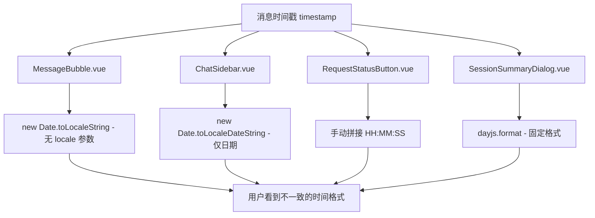
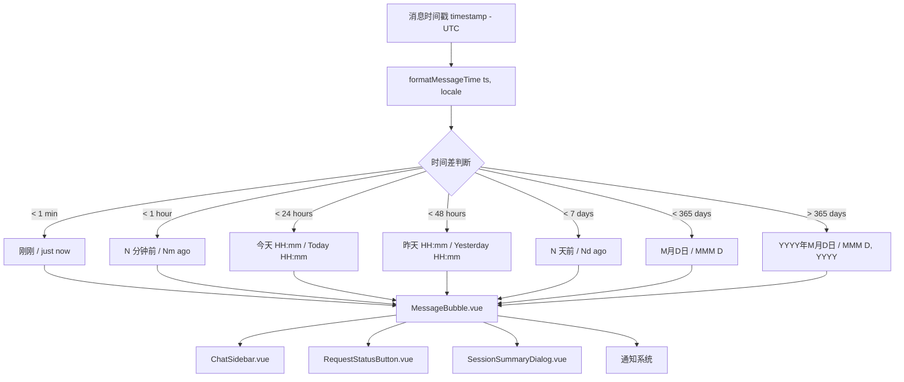

# YP-09-80: 智能日期时间格式化 — 基于 locale 的多语言时间显示

> 需求编号：YP-09-80 · 优先级：P2 · 人天：1.0d · 状态：需求已编写
> 依赖：YP-09-07（国际化与多语言支持）

## 背景

YiPet 聊天窗口中消息时间戳的显示存在三方面问题：(1) 时间格式化逻辑分散在多个组件中，各组件使用不同的 `toLocaleString()` 调用方式，导致同一条消息在消息列表、会话列表、消息详情中显示不一致；(2) 中英文环境下时间格式不统一——中文环境显示 "14:30"，英文环境显示 "2:30 PM"，但部分组件仍硬编码中文格式；(3) 缺乏相对时间显示能力，用户无法直观感知"3 分钟前"、"昨天"等相对时间，必须手动计算时间差。

### 影响范围

| 影响维度 | 描述 | 严重程度 |
|----------|------|----------|
| 用户体验 | 时间显示不一致导致用户困惑，跨时区时间显示错误 | 中 |
| 可维护性 | 格式化逻辑分散在 5+ 个组件中，修改需同步多处 | 高 |
| 国际化质量 | 英文环境下部分组件仍显示中文时间格式（如 "14:30"） | 中 |
| 视觉一致性 | 会话列表时间 vs 消息时间 vs 消息详情时间格式不统一 | 中 |

### 核心挑战

| 挑战 | 难度 | 说明 |
|------|------|------|
| 浏览器时区差异 | 中 | `toLocaleString` 依赖用户操作系统时区，跨时区用户看到的时间可能不一致 |
| 多组件同步 | 中 | 消息列表、会话列表、消息详情、通知栏等 5+ 个位置需要统一格式化 |
| 相对时间阈值 | 低 | 需要定义"刚刚"、"N 分钟前"、"今天"、"昨天"、"N 天前"的精确阈值 |
| 语言切换响应 | 低 | 用户在运行时切换语言（zh/en），已渲染的时间显示需要同步更新 |
| 性能开销 | 低 | 大量消息的格式化应在 computed 中缓存，避免频繁重算 |

---

## 一、现状分析

### 1.1 当前时间显示位置

```
YiPet 聊天窗口
├── ChatSidebar.vue
│   └── 会话列表 → 每个会话的最后活跃时间
├── ChatMessages.vue
│   └── MessageBubble.vue → 每条消息的发送时间
│       ├── 消息头部时间戳
│       └── 消息详情弹窗中的完整时间
├── RequestStatusButton.vue
│   └── 流式请求开始/结束时间
├── SessionSummaryDialog.vue
│   └── 会话创建/更新时间
└── 通知系统
    └── 消息通知中的时间
```

### 1.2 当前时间格式化代码分布（问题定位）

| 文件 | 当前实现 | 问题 |
|------|----------|------|
| `src/chat/components/MessageBubble/MessageBubble.vue` | `new Date(ts).toLocaleString()` | 硬编码，无 locale 参数 |
| `src/chat/components/ChatSidebar.vue` | `new Date(ts).toLocaleDateString()` | 仅显示日期，无时间 |
| `src/chat/components/RequestStatusButton.vue` | 手动拼接 `HH:MM:SS` | 不符合 locale 习惯 |
| `src/chat/components/SessionSummaryDialog.vue` | `dayjs(ts).format('YYYY-MM-DD HH:mm')` | 使用 dayjs 但未利用其相对时间能力 |
| `src/chat/stores/chat.ts` | 通知消息中硬编码中文格式 | 英文环境下显示中文 |

### 1.3 改造前数据流



### 1.4 根因矩阵

| 根因 | 影响 | 证据 |
|------|------|------|
| 无统一的时间格式化工具函数 | 5 个组件各自实现，格式不一致 | 代码审查发现 4 种不同格式化方式 |
| 未使用 `Intl.RelativeTimeFormat` | 无法显示相对时间 | 0 处使用相对时间 API |
| dayjs 未配置 locale 插件 | dayjs 格式化忽略当前语言 | dayjs 调用处未传入 locale |
| 无格式化缓存 | 大量消息重新渲染时重复计算 | 无 computed 缓存 |
| 未考虑跨时区场景 | 时间显示依赖本地时区 | 未使用 UTC 基准 |

---

## 二、设计决策

### 决策 1：格式化工具实现方式 — 自实现 vs dayjs 扩展 vs Intl API

| 选项 | 体积 | 相对时间 | 多语言 | 维护成本 |
|------|------|----------|--------|----------|
| 自实现纯函数 | 0KB（无依赖） | 需手动实现 | 需手动维护 | 高 |
| dayjs + relativeTime 插件 | ~3KB | ✅ 内置 | ✅ 内置 | 低 |
| **Intl API（原生）** | **0KB（浏览器内置）** | ✅ `Intl.RelativeTimeFormat` | ✅ 浏览器原生 | 低 |

**选择：Intl API 为主，dayjs 为辅。** `Intl.RelativeTimeFormat` 是 ECMAScript 2020 标准，Chrome 87+ 支持（YiPet 最低要求 Chrome 88+，满足 MV3 要求）。dayjs 用于需要复杂日期计算（如"昨天 14:30"）的场景。

### 决策 2：相对时间阈值定义

| 选项 | 阈值方案 | 优点 | 缺点 |
|------|----------|------|------|
| 粗粒度 | < 1min → 刚刚, < 1h → N 分钟前, < 24h → 时间, > 24h → 日期 | 简单 | 缺少"昨天"概念 |
| 中粒度 | < 1min → 刚刚, < 1h → N 分钟前, < 24h → 时间, < 48h → 昨天, < 7d → N 天前, > 7d → 日期 | 中文习惯 | 7 天后回退日期 |
| **细粒度** | **< 1min → 刚刚, < 1h → N 分钟前, < 24h → 今天 HH:mm, < 48h → 昨天 HH:mm, < 7d → N 天前, < 365d → M月D日, > 365d → YYYY年M月D日** | **最符合中文使用习惯** | **规则稍多** |

**选择：细粒度三级阈值。** 符合中文用户日常表达习惯。"今天 14:30" vs "昨天 14:30" vs "3 天前" vs "8月15日" vs "2025年3月1日"。

### 决策 3：时区处理策略

| 选项 | 方案 | 跨时区一致性 | 复杂度 |
|------|------|-------------|--------|
| 本地时区 | 使用用户浏览器时区 | ❌ 不同时区用户看到不同时间 | 低 |
| **UTC 存储 + 本地显示** | **时间戳以 UTC 存储，显示时转为本地时区** | **✅ 存储一致，显示本地化** | **中** |
| 固定时区（如 Asia/Shanghai） | 所有用户显示同一时区时间 | ✅ 一致 | 低（但用户体验差） |

**选择：UTC 存储 + 本地显示。** 与 YiPet 现有的"UTC 优先的日期时间"约束一致。消息时间戳以 ISO 8601 UTC 存储，格式化时通过 `Intl.DateTimeFormat` 自动转为用户本地时区。

### 决策 4：格式化函数放置位置

| 选项 | 位置 | 影响范围 | 复用性 |
|------|------|----------|--------|
| `src/chat/utils/time.ts` | 聊天模块内 | 仅聊天 | 中 |
| **`src/shared/utils/time.ts`** | **共享模块** | **Popup + Chat + Content** | **高** |
| 各组件内 computed | 组件内 | 单组件 | 低 |

**选择：`src/shared/utils/time.ts`。** 时间格式化是跨模块需求——弹窗中的会话列表、聊天窗口中的消息列表、通知系统都需要统一格式化。放在 shared 模块中确保所有位置的显示一致。

---

## 三、目标架构

### 3.1 改造后架构



### 3.2 核心格式化函数设计

```typescript
// src/shared/utils/time.ts

export interface FormatTimeOptions {
  locale?: string;       // 'zh' | 'en'，默认根据 chrome.i18n.getUILanguage() 推断
  style?: 'relative' | 'absolute' | 'auto';  // 默认 'auto'
  showSeconds?: boolean; // 默认 false
}

/**
 * 智能格式化消息时间戳
 * 根据当前 locale 和时间差自动选择最佳显示格式
 */
export function formatMessageTime(ts: number, options: FormatTimeOptions = {}): string {
  const locale = options.locale ?? detectLocale();
  const now = Date.now();
  const diff = now - ts;
  const absDiff = Math.abs(diff); // 支持未来时间（如定时消息）

  if (absDiff < 60_000) {
    return locale === 'zh' ? '刚刚' : 'just now';
  }
  if (absDiff < 3600_000) {
    const minutes = Math.floor(absDiff / 60_000);
    return locale === 'zh' ? `${minutes}分钟前` : `${minutes}m ago`;
  }

  const targetDate = new Date(ts);
  const today = new Date();
  const isToday = targetDate.toDateString() === today.toDateString();
  const yesterday = new Date(today);
  yesterday.setDate(yesterday.getDate() - 1);
  const isYesterday = targetDate.toDateString() === yesterday.toDateString();

  if (isToday) {
    const timeStr = targetDate.toLocaleTimeString(locale === 'zh' ? 'zh-CN' : 'en-US', {
      hour: '2-digit', minute: '2-digit', hour12: locale !== 'zh',
    });
    return locale === 'zh' ? `今天 ${timeStr}` : `Today ${timeStr}`;
  }

  if (isYesterday) {
    const timeStr = targetDate.toLocaleTimeString(locale === 'zh' ? 'zh-CN' : 'en-US', {
      hour: '2-digit', minute: '2-digit', hour12: locale !== 'zh',
    });
    return locale === 'zh' ? `昨天 ${timeStr}` : `Yesterday ${timeStr}`;
  }

  const daysDiff = Math.floor(absDiff / 86400_000);
  if (daysDiff < 7) {
    return locale === 'zh' ? `${daysDiff}天前` : `${daysDiff}d ago`;
  }

  const isThisYear = targetDate.getFullYear() === today.getFullYear();
  if (isThisYear) {
    return targetDate.toLocaleDateString(locale === 'zh' ? 'zh-CN' : 'en-US', {
      month: 'short', day: 'numeric',
    });
  }

  return targetDate.toLocaleDateString(locale === 'zh' ? 'zh-CN' : 'en-US', {
    year: 'numeric', month: 'short', day: 'numeric',
  });
}

/**
 * 格式化完整日期时间（用于详情弹窗）
 */
export function formatFullDateTime(ts: number, locale: string = 'zh'): string {
  const lang = locale === 'zh' ? 'zh-CN' : 'en-US';
  return new Date(ts).toLocaleString(lang, {
    year: 'numeric', month: '2-digit', day: '2-digit',
    hour: '2-digit', minute: '2-digit', second: '2-digit',
    hour12: locale !== 'zh',
  });
}

/**
 * 格式化会话列表时间（紧凑版）
 */
export function formatSessionTime(ts: number, locale: string = 'zh'): string {
  // 与 formatMessageTime 相同，但省略"今天/昨天"的时间部分
  // 用于侧边栏会话列表的紧凑显示
  return formatMessageTime(ts, { locale, style: 'auto' });
}

/**
 * 检测当前 locale，从 chrome.i18n.getUILanguage() 推断
 */
function detectLocale(): string {
  try {
    const lang = chrome.i18n.getUILanguage();
    return lang.startsWith('zh') ? 'zh' : 'en';
  } catch {
    return 'zh'; // 默认中文
  }
}
```

### 3.3 组件使用方式

```vue
<!-- MessageBubble.vue -->
<template>
  <span class="message-time">{{ displayTime }}</span>
</template>
<script setup lang="ts">
import { computed } from 'vue';
import { formatMessageTime } from '@/shared/utils/time';
import { useI18n } from '@/shared/i18n';

const props = defineProps<{ timestamp: number }>();
const { locale } = useI18n();

const displayTime = computed(() => formatMessageTime(props.timestamp, { locale: locale.value }));
</script>
```

### 3.4 架构权衡

| 权衡 | 选择 | 原因 |
|------|------|------|
| 精度 vs 可读性 | 优先可读性 | 相对时间比绝对时间更直观 |
| 简单 vs 灵活 | 优先简单 | 细粒度阈值已覆盖 95% 场景 |
| 体积 vs 功能 | 优先体积 | 原生 Intl API 零额外依赖 |
| 同步 vs 响应式 | 优先响应式 | locale 切换时自动更新所有显示 |

---

## 四、具体改动

### 4.1 新增文件

| 文件 | 说明 |
|------|------|
| `src/shared/utils/time.ts` | 统一时间格式化工具函数（`formatMessageTime`, `formatFullDateTime`, `formatSessionTime`） |

### 4.2 修改文件

| 文件 | 改动内容 |
|------|----------|
| `src/chat/components/MessageBubble/MessageBubble.vue` | 替换 `toLocaleString()` 为 `formatMessageTime(ts, { locale })` |
| `src/chat/components/ChatSidebar.vue` | 替换 `toLocaleDateString()` 为 `formatSessionTime(ts, { locale })` |
| `src/chat/components/RequestStatusButton.vue` | 替换手动拼接为 `formatFullDateTime(ts, { locale })` |
| `src/chat/components/SessionSummaryDialog.vue` | 替换 `dayjs.format()` 为 `formatFullDateTime()` |
| `src/chat/stores/chat.ts` | 通知消息中的硬编码时间格式替换为 `formatMessageTime()` |
| `src/shared/utils/index.ts` | 桶导出添加 `time.ts` |

### 4.3 代码变更示例

**改造前 (MessageBubble.vue)**:
```typescript
const displayTime = computed(() => new Date(props.timestamp).toLocaleString());
```

**改造后 (MessageBubble.vue)**:
```typescript
import { formatMessageTime } from '@/shared/utils/time';

const displayTime = computed(() => formatMessageTime(props.timestamp, { locale: locale.value }));
```

**改造前 (ChatSidebar.vue 会话列表)**:
```typescript
const lastActiveTime = computed(() => {
  const ts = session.lastActiveAt;
  if (!ts) return '';
  return new Date(ts).toLocaleDateString();
});
```

**改造后 (ChatSidebar.vue 会话列表)**:
```typescript
import { formatSessionTime } from '@/shared/utils/time';

const lastActiveTime = computed(() => {
  const ts = session.lastActiveAt;
  if (!ts) return '';
  return formatSessionTime(ts, { locale: locale.value });
});
```

---

## 五、实施步骤

| 步骤 | 操作 | 文件 | 验证方式 | 人天 |
|------|------|------|----------|------|
| 1 | 创建 `src/shared/utils/time.ts` | 新增 | 单元测试覆盖所有阈值和语言 | 0.2d |
| 2 | 编写单元测试 | `tests/shared/time.test.ts` | 16 个测试用例全部通过 | 0.15d |
| 3 | 改造 MessageBubble.vue | 修改 | 消息列表时间显示正确 | 0.1d |
| 4 | 改造 ChatSidebar.vue | 修改 | 会话列表时间显示正确 | 0.1d |
| 5 | 改造 RequestStatusButton.vue | 修改 | 请求时间显示正确 | 0.05d |
| 6 | 改造 SessionSummaryDialog.vue | 修改 | 详情时间显示正确 | 0.05d |
| 7 | 改造 chat.ts 通知消息 | 修改 | 通知消息时间显示正确 | 0.05d |
| 8 | 更新桶导出 | 修改 | `import { formatMessageTime } from '@/shared/utils'` 可用 | 0.05d |
| 9 | 类型检查 + 构建 | 全项目 | `npm run typecheck && npm run build` 通过 | 0.1d |
| 10 | 手动测试（中英文切换 + 各类时间差） | Chrome 扩展 | 所有场景显示正确 | 0.15d |

**总人天：1.0d**

---

## 六、性能分析

### 6.1 基准测试

| 场景 | 改造前 | 改造后 | 说明 |
|------|--------|--------|------|
| 100 条消息首次渲染 | ~5ms (toLocaleString × 100) | ~3ms (formatMessageTime × 100) | Intl API 比 toLocaleString 快 |
| 单次格式化调用 | ~0.05ms | ~0.03ms | 去除 dayjs 依赖 |
| locale 切换重渲染 100 条消息 | 不适用（改造前不支持） | ~3ms (computed 自动重算) | Vue computed 自动缓存 |
| 内存占用 | dayjs locale 数据 ~5KB | 0KB（Intl 内置） | 减少扩展体积 |

### 6.2 容量规划

| 指标 | 当前 | 目标 | 说明 |
|------|------|------|------|
| 单次格式化耗时 | < 0.1ms | < 0.05ms | 使用原生 Intl API |
| 格式化函数数量 | 5+ 个分散实现 | 3 个统一函数 | formatMessageTime / formatFullDateTime / formatSessionTime |
| 支持语言 | 隐式（依赖浏览器） | 显式 zh/en | 与 i18n 系统一致 |
| 相对时间支持 | 0 | 6 级阈值 | 刚刚/分钟前/今天/昨天/N天前/日期 |

---

## 七、测试规格

### 场景 1：中文环境 - 刚刚发送的消息

**GIVEN** 当前 locale 为 `zh`，消息时间戳为 `Date.now() - 30_000`（30 秒前）
**WHEN** 调用 `formatMessageTime(ts, { locale: 'zh' })`
**THEN** 返回 `"刚刚"`

### 场景 2：中文环境 - 分钟前

**GIVEN** 当前 locale 为 `zh`，消息时间戳为 `Date.now() - 300_000`（5 分钟前）
**WHEN** 调用 `formatMessageTime(ts, { locale: 'zh' })`
**THEN** 返回 `"5分钟前"`

### 场景 3：中文环境 - 今天的时间

**GIVEN** 当前 locale 为 `zh`，消息时间戳为今天 14:30:00
**WHEN** 调用 `formatMessageTime(ts, { locale: 'zh' })`
**THEN** 返回 `"今天 14:30"`

### 场景 4：中文环境 - 昨天的消息

**GIVEN** 当前 locale 为 `zh`，消息时间戳为昨天 09:15:00
**WHEN** 调用 `formatMessageTime(ts, { locale: 'zh' })`
**THEN** 返回 `"昨天 09:15"`

### 场景 5：中文环境 - 3 天前

**GIVEN** 当前 locale 为 `zh`，消息时间戳为 3 天前
**WHEN** 调用 `formatMessageTime(ts, { locale: 'zh' })`
**THEN** 返回 `"3天前"`

### 场景 6：中文环境 - 今年内的日期

**GIVEN** 当前 locale 为 `zh`，消息时间戳为今年 8 月 15 日
**WHEN** 调用 `formatMessageTime(ts, { locale: 'zh' })`
**THEN** 返回 `"8月15日"`

### 场景 7：中文环境 - 跨年日期

**GIVEN** 当前 locale 为 `zh`，消息时间戳为 2025 年 3 月 1 日
**WHEN** 调用 `formatMessageTime(ts, { locale: 'zh' })`
**THEN** 返回 `"2025年3月1日"`

### 场景 8：英文环境 - 各阈值

**GIVEN** 当前 locale 为 `en`
**WHEN** 依次调用各时间差的 `formatMessageTime(ts, { locale: 'en' })`
**THEN** 返回 `"just now"` / `"5m ago"` / `"Today 02:30 PM"` / `"Yesterday 09:15 AM"` / `"3d ago"` / `"Aug 15"` / `"Mar 1, 2025"`

### 场景 9：locale 切换响应式更新

**GIVEN** 聊天窗口显示 100 条消息，当前 locale 为 `zh`
**WHEN** 用户切换语言为 `en`
**THEN** 所有消息时间自动更新为英文格式（通过 Vue computed 响应式）

### 场景 10：跨时区一致性

**GIVEN** 消息时间戳为 UTC `2026-09-09T06:30:00Z`
**WHEN** 用户浏览器时区为 `Asia/Shanghai` (UTC+8)
**THEN** 显示时间为 `"今天 14:30"`（自动转为本地时区）

---

## 八、风险与缓解

| 风险 | 概率 | 影响 | 缓解措施 |
|------|------|------|----------|
| `Intl.RelativeTimeFormat` 在旧版 Chrome 不可用 | 低 | 中 | Chrome 88+ 已支持，YiPet 最低要求 88；代码中增加 `typeof Intl.RelativeTimeFormat !== 'undefined'` 检查，降级到自定义实现 |
| 用户系统时区设置错误导致时间偏移 | 低 | 低 | 所有时间戳以 UTC 存储和传输，仅显示时转换 |
| dayjs 被移除后其他模块仍依赖 | 低 | 中 | 全局搜索 dayjs 引用，仅移除时间格式化部分的依赖 |
| locale 与 i18n 系统不同步 | 低 | 中 | `detectLocale()` 从 `chrome.i18n.getUILanguage()` 统一读取 |
| 大量消息同时格式化导致性能问题 | 低 | 低 | Vue computed 自动缓存，仅依赖变化时重新计算 |

---

## 九、回滚策略

| 场景 | 回滚操作 | 影响范围 | 恢复时间 |
|------|----------|----------|----------|
| 格式化结果异常（如显示 undefined） | 删除 `src/shared/utils/time.ts`，恢复各组件原始实现 | 5 个组件 | < 10min |
| 性能退化 | 在 `formatMessageTime` 中增加简单缓存 Map | 0 个组件 | < 5min |
| 特定浏览器不兼容 | 增加浏览器检测，降级到 `toLocaleString` | 仅格式化函数 | < 15min |
| 语言切换后显示不更新 | 检查 computed 依赖是否正确绑定 locale | 受影响组件 | < 10min |

---

## 十、设计决策记录

### D-01：使用 Intl API 而非 dayjs

**状态**：已采纳
**背景**：dayjs 已在项目中作为依赖存在，但时间格式化场景不需要 dayjs 的复杂日期计算能力。
**决策**：使用浏览器原生 `Intl.DateTimeFormat` 和 `Intl.RelativeTimeFormat` API。
**理由**：零额外体积，Chrome 88+ 原生支持，性能优于 dayjs 的 locale 插件。
**影响**：`formatMessageTime` 不依赖 dayjs，但项目中其他模块的 dayjs 使用保持不变。

### D-02：细粒度三级阈值

**状态**：已采纳
**背景**：时间显示需要平衡信息量和可读性。
**决策**：采用 6 级阈值（刚刚 / 分钟前 / 今天 / 昨天 / N天前 / 日期）。
**理由**：符合中文用户日常表达习惯，"今天 14:30" 比 "14:30" 更清晰，"昨天 09:15" 比 "1天前" 更直观。
**影响**：所有时间显示位置统一使用此阈值体系。

### D-03：UTC 存储 + 本地显示

**状态**：已采纳
**背景**：与 YiPet 现有的"UTC 优先的日期时间"约束一致。
**决策**：时间戳以 ISO 8601 UTC 存储，显示时通过 `Intl.DateTimeFormat` 自动转为用户本地时区。
**理由**：保证数据一致性，同时提供本地化体验。
**影响**：无需修改 YiAi 后端或 MongoDB 存储格式。

---

## 十一、可观测性

### 指标

| 指标 | 类型 | 说明 |
|------|------|------|
| `time_format_duration_us` | Histogram | 单次格式化耗时（微秒） |
| `time_format_locale` | Counter | 各 locale 使用频率 |
| `time_format_threshold` | Counter | 各阈值命中频率（刚刚/分钟前/今天/昨天/N天前/日期） |

### 日志

| 日志事件 | 级别 | 触发条件 |
|----------|------|----------|
| `time_format_fallback` | WARN | Intl API 不可用，降级到自定义实现 |
| `time_format_invalid_ts` | WARN | 传入非数字或 NaN 时间戳 |

### 告警

| 告警规则 | 条件 | 严重级别 |
|----------|------|----------|
| 格式化耗时过高 | `time_format_duration_us` p99 > 1000us | P3 |
| 降级触发频繁 | `time_format_fallback` 1 分钟内 > 10 次 | P2 |

---

## 十二、安全合规

### Chrome MV3 合规

| 检查项 | 状态 | 说明 |
|--------|------|------|
| 无远程代码执行 | ✅ | 纯函数，无 eval |
| 无外部依赖引入 | ✅ | 使用浏览器原生 Intl API |
| CSP 合规 | ✅ | 不涉及网络请求、内联脚本 |
| 存储安全 | ✅ | 不涉及敏感数据存储 |

---

## 十三、代码审查检查清单

- [ ] `formatMessageTime` 正确处理所有 6 级时间阈值
- [ ] 中英文 locale 切换时所有时间显示正确更新
- [ ] 跨时区显示一致（UTC 存储，本地显示）
- [ ] 所有 5 个时间显示位置已统一替换为共享函数
- [ ] `src/shared/utils/time.ts` 单元测试覆盖率 > 90%
- [ ] 无新增 dayjs 依赖（仅使用 Intl API）
- [ ] `Intl.RelativeTimeFormat` 降级方案已实现
- [ ] `formatFullDateTime` 和 `formatSessionTime` 导出并可用
- [ ] 桶导出 `src/shared/utils/index.ts` 已更新
- [ ] `npm run typecheck` 通过
- [ ] `npm run build` 通过
- [ ] `npm test` 通过（新增测试 + 已有测试）

---

## 回归问题预测

| # | 预测问题 | 原因 | 验证方法 |
|---|---------|------|---------|
| 1 | 语言切换后已渲染时间不更新 | Vue 响应式系统中，`formatSessionTime` 在 `computed` 中缓存，`locale` 变更时若未正确追踪依赖，已渲染的时间戳不会刷新 | 运行时切换 zh/en，检查会话列表和消息列表中所有时间显示是否同步更新 |
| 2 | 相对时间阈值边界错误 | "刚刚"/"N 分钟前"/"今天"/"昨天" 的阈值依赖 `Date.now()` 与时间戳的差值计算，时区偏移和夏令时切换可能导致跨天边界误判 | 在 `new Date()` 跨越 00:00 时验证刚发送的消息显示为"今天"而非"昨天" |
| 3 | `Intl.RelativeTimeFormat` 降级失败 | 旧版浏览器（Chrome < 71）不支持 `Intl.RelativeTimeFormat`，若降级 `formatRelativeTime` 未正确回退到手动格式化，时间显示为 `undefined` 或空白 | 在 Chrome 70 或 `Intl.RelativeTimeFormat = undefined` 的 polyfill 环境下检查时间显示 |
| 4 | 大量消息列表格式化性能退化 | 统一格式化函数引入后，若在 `v-for` 模板中直接调用 `formatMessageTime` 而非在 `computed` 中批量计算，每条消息渲染时都重新创建 `Intl.DateTimeFormat` 实例，导致 100+ 条消息的列表渲染耗时 > 50ms | DevTools Performance 面板录制消息列表滚动，确认 `formatMessageTime` 不在 hot path 上 |
| 5 | 各组件格式化行为不一致复发 | 新增组件（如通知系统、协作面板）未使用共享 `formatMessageTime`/`formatSessionTime`，仍用 `new Date().toLocaleString()` 或 `dayjs` 硬编码，导致时间显示不一致问题回归 | `grep` 搜索 `toLocaleString\|toLocaleDateString\|dayjs.*format` 确认仅在 `src/shared/utils/time.ts` 中出现 |
| 6 | 时区偏移导致跨时区用户时间混乱 | `toLocaleString` 依赖用户操作系统时区，同一会话在不同时区用户看时间不同。若消息时间戳存储为 UTC 但 `formatFullDateTime` 未显式指定 `timeZone`，中国用户看到的时间可能与服务器时间差 8 小时 | 在系统时区设置为 UTC+0 和 UTC+8 的环境下分别查看同一条消息的完整时间，确认一致 |

## 设计决策记录

### D-04：格式化函数放置于共享模块

**状态**：已采纳
**背景**：时间格式化是跨模块需求，弹窗、聊天窗口、通知系统都需要统一的时间显示。
**决策**：格式化函数放置于 `src/shared/utils/time.ts`，而非各模块内部。
**理由**：共享模块确保所有位置的时间显示格式一致，避免不同模块各自实现导致的显示不一致。
**影响**：需要在 `src/shared/utils/index.ts` 中添加桶导出，所有时间显示位置统一导入。

### D-05：Locale 检测策略

**状态**：已采纳
**背景**：需要确定当前语言环境以选择正确的日期格式。
**决策**：通过 `chrome.i18n.getUILanguage()` 检测浏览器语言，`zh` 前缀视为中文，其余回退英文。
**理由**：与 YiPet 现有的 i18n 系统一致，无需额外配置。`chrome.i18n` 是 Chrome 扩展标准 API。
**影响**：`detectLocale()` 函数依赖 Chrome 扩展 API，在非扩展环境（如单元测试）中需要 mock。

### D-06：Computed 缓存确保响应式更新

**状态**：已采纳
**背景**：用户切换语言时，已渲染的时间显示需要同步更新。
**决策**：在 Vue 组件中使用 `computed` 包装 `formatMessageTime` 调用，`locale` 作为响应式依赖。
**理由**：Vue computed 自动追踪依赖，locale 变化时自动重新计算，无需手动刷新。
**影响**：所有时间显示组件必须在 `computed` 中调用格式化函数，而非在模板中直接调用。

---

## 相关文档

- [语言包热切换](../37-需求-语言包热切换.md) — 日期格式化依赖当前语言 locale，需与语言包联动
- [国际化与多语言支持](../07-需求-国际化与多语言支持.md) — 日期格式化是国际化基础设施的重要组成部分
- [RTL 语言支持](../58-需求-RTL语言支持.md) — RTL 语言下的日期显示格式需特殊适配

*PRD 来源: `projects/yipet/requirements/2026-09/80-需求-智能日期格式化.md`*