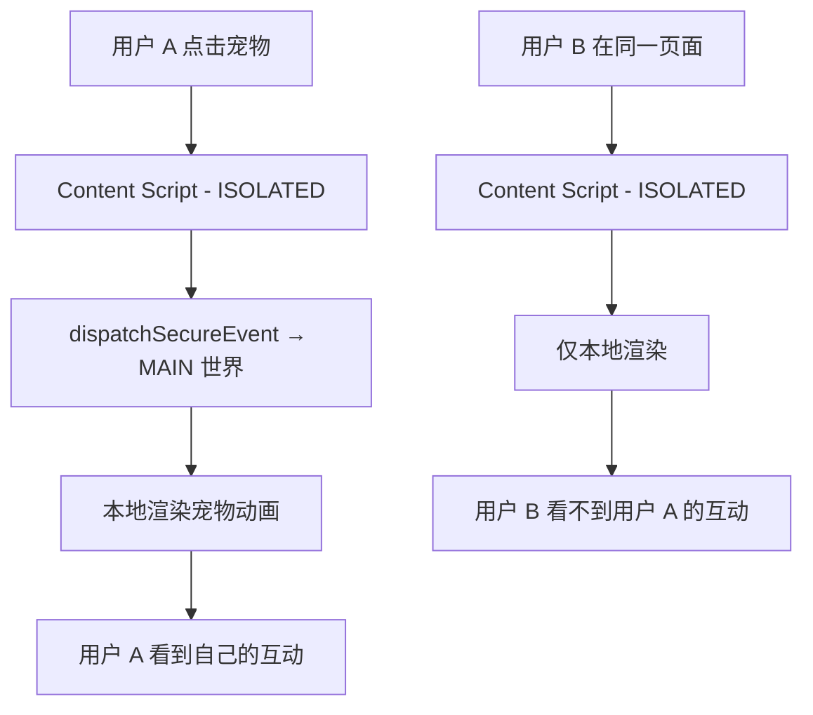
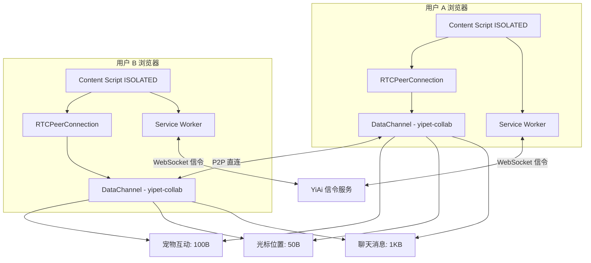
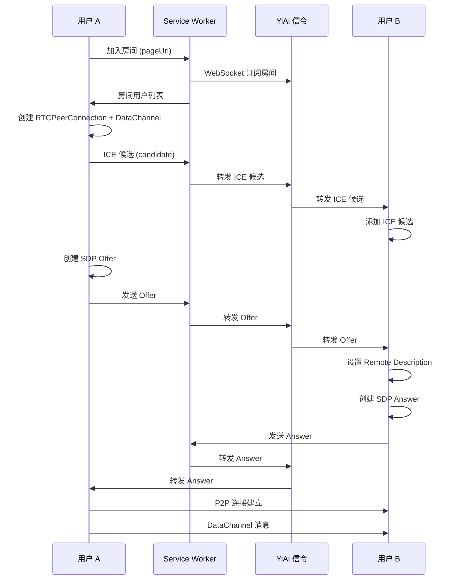
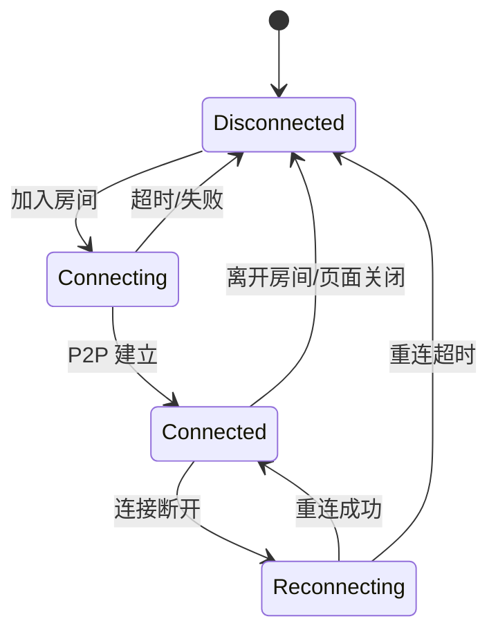

# YP-09-81: WebRTC P2P 协作 — 多用户宠物互动与状态同步

> 需求编号：YP-09-81 · 优先级：P2 · 人天：2.0d · 状态：需求已编写
> 依赖：YP-09-01（Content Script 稳定性）、YP-09-46（WebSocket 实时通信）

## 背景

YiPet 当前是单用户体验——每个用户独立与宠物互动，无法感知同一页面上的其他 YiPet 用户。当团队在同一 Web 应用（如 YiVad 管理后台）上协作时，能看到彼此宠物互动的能力将显著增强团队协作体验。例如，产品经理在需求看板上拖拽宠物时，开发人员能看到"同事正在浏览这个需求"。

WebRTC DataChannel 提供浏览器原生的 P2P 低延迟通信通道，无需中心化消息服务器，延迟 < 50ms，完美适配实时宠物互动和光标同步场景。

### 影响范围

| 影响维度 | 描述 | 严重程度 |
|----------|------|----------|
| 用户体验 | 无法感知协作者存在，缺少团队协作氛围 | 中 |
| 功能完整性 | 单用户限制使宠物功能在团队场景中价值打折扣 | 中 |
| 技术架构 | 需要引入 WebRTC 信令和 P2P 连接管理 | 高 |

### 核心挑战

| 挑战 | 难度 | 说明 |
|------|------|------|
| 信令服务器 | 中 | WebRTC 需要信令通道交换 SDP 和 ICE 候选，YiAi 需要扩展 WebSocket 支持 |
| NAT/防火墙穿透 | 高 | 企业网络环境可能阻止 P2P 直连，需要 TURN 服务器中继 |
| 多用户状态同步 | 中 | 多个用户同时互动时，需要 CRDT 或 OT 算法保证状态一致性 |
| Content Script 沙箱限制 | 中 | Content Script 的 ISOLATED 世界能否访问 RTCPeerConnection API |
| 连接生命周期 | 中 | 用户离开页面时需优雅断开，避免状态残留 |

---

## 一、现状分析

### 1.1 当前协作架构

```
YiPet 用户 A                    YiPet 用户 B
    │                               │
    │ 宠物交互（点击/拖拽）          │ 宠物交互
    ▼                               ▼
本地 Content Script             本地 Content Script
    │                               │
    │ 仅本地渲染                    │ 仅本地渲染
    ▼                               ▼
无协作感知                     无协作感知
```

### 1.2 当前涉及文件

| 文件 | 当前职责 | 协作相关缺口 |
|------|----------|-------------|
| `src/content/rendering/overlay.ts` | 宠物覆盖层渲染 | 无远程宠物渲染能力 |
| `src/content/ipc/relay.ts` | ISOLATED ↔ MAIN 世界消息中继 | 无 WebRTC 消息类型 |
| `src/chat/stores/chat.ts` | 聊天状态管理 | 无协作状态 |
| `src/api/services/chat.ts` | 聊天服务 | 无信令服务 |
| `src/background/` | Service Worker 命令分发 | 无 WebRTC 信令中继 |

### 1.3 改造前数据流



### 1.4 根因矩阵

| 根因 | 影响 | 证据 |
|------|------|------|
| 无 P2P 通信通道 | 协作者之间无法交换状态 | 0 处 WebRTC 相关代码 |
| 无信令服务器 | 无法建立 P2P 连接 | YiAi 无信令端点 |
| 无多用户状态模型 | 无法渲染远程宠物 | 状态仅支持单用户 |
| 无连接管理 | 无法处理用户加入/离开 | 无生命周期管理 |

---

## 二、设计决策

### 决策 1：P2P 通信协议 — WebRTC DataChannel vs WebSocket 中继 vs HTTP 轮询

| 选项 | 延迟 | 带宽 | 服务器成本 | 复杂度 |
|------|------|------|-----------|--------|
| HTTP 轮询 | 100-500ms | 高（重复请求头） | 中 | 低 |
| WebSocket 中继 | 20-50ms | 中（服务器转发） | 高（所有流量经服务器） | 中 |
| **WebRTC DataChannel** | **< 10ms（P2P 直连）** | **低（仅数据）** | **低（仅信令）** | **高** |

**选择：WebRTC DataChannel。** 低延迟是协作体验的核心——光标跟随需要 < 30ms 延迟。P2P 直连大幅降低服务器成本。

### 决策 2：信令方案 — YiAi WebSocket vs 第三方 STUN/TURN 服务 vs 自建信令服务

| 选项 | 部署复杂度 | 维护成本 | 隐私安全 |
|------|-----------|----------|----------|
| **YiAi WebSocket 信令** | **低（已有 WebSocket 基础设施）** | **低** | **高（数据不出内网）** |
| 第三方 STUN/TURN（如 Twilio） | 高 | 中（付费） | 低（数据经第三方） |
| 自建信令服务 | 高 | 高 | 高 |

**选择：YiAi WebSocket 信令。** 复用现有 WebSocket 基础设施（YP-09-46），在 YiAi 中增加信令消息类型（`offer`/`answer`/`ice-candidate`）。

### 决策 3：状态同步策略 — 全量同步 vs CRDT vs 操作日志

| 选项 | 一致性 | 冲突处理 | 复杂度 |
|------|--------|----------|--------|
| 全量同步 | 弱（最后写入胜出） | 无 | 低 |
| **CRDT（无冲突数据类型）** | **强（自动合并）** | **自动** | **高** |
| 操作日志 | 中（按序回放） | 需手动处理 | 中 |

**选择：简化版 CRDT——LWW（Last-Write-Wins）Map。** 宠物互动场景中，冲突概率低（用户通常不会同时操作同一宠物）。LWW Map 以时间戳为准，简单且满足需求。

### 决策 4：Content Script 中 WebRTC 的可用性

| 选项 | 可行性 | 说明 |
|------|--------|------|
| ISOLATED 世界直接使用 | ✅ | `RTCPeerConnection` 在 ISOLATED 世界中可用 |
| MAIN 世界使用 | ❌ | 页面可能已有 WebRTC 使用，可能冲突 |
| Service Worker 中继 | ❌ | SW 不支持 `RTCPeerConnection` |

**选择：ISOLATED 世界中使用 WebRTC。** `RTCPeerConnection` 在 Content Script 的 ISOLATED 世界中可用，通过 `chrome.runtime.connect` 与 Service Worker 通信进行信令中继。

---

## 三、目标架构

### 3.1 改造后架构



### 3.2 信令流程



### 3.3 消息协议设计

```typescript
// DataChannel 消息格式
interface CollabMessage {
  type: 'pet:interact' | 'cursor:move' | 'chat:message' | 'user:join' | 'user:leave';
  userId: string;       // 用户唯一标识
  displayName: string;  // 显示名称
  avatarColor: string;  // 宠物颜色
  timestamp: number;    // UTC 时间戳
  payload: PetInteractPayload | CursorMovePayload | ChatMessagePayload;
}

interface PetInteractPayload {
  action: 'click' | 'drag' | 'feed' | 'pet';
  position: { x: number; y: number };
  emotion?: string; // 宠物表情
}

interface CursorMovePayload {
  x: number;   // 页面坐标
  y: number;
  pageX: number;
  pageY: number;
}

interface ChatMessagePayload {
  sessionId: string;
  message: string;
}
```

### 3.4 连接管理状态机



### 3.5 架构权衡

| 权衡 | 选择 | 原因 |
|------|------|------|
| 低延迟 vs 可靠性 | 优先低延迟 | DataChannel 默认不保证有序/可靠，但协作场景可接受偶尔丢帧 |
| 隐私 vs 可见性 | 默认不可见，用户主动加入 | 避免隐私泄露，用户需主动开启协作模式 |
| P2P vs 中继 | 优先 P2P，TURN 兜底 | 90% 场景可 P2P 直连，TURN 仅企业内部网络需要 |

---

## 四、具体改动

### 4.1 新增文件

| 文件 | 说明 |
|------|------|
| `src/content/collaboration/webrtc-manager.ts` | WebRTC 连接管理（PeerConnection、DataChannel、信令） |
| `src/content/collaboration/remote-renderer.ts` | 远程宠物和光标渲染 |
| `src/content/collaboration/state-sync.ts` | LWW Map 状态同步 |
| `src/content/collaboration/types.ts` | 协作消息类型定义 |
| `src/api/services/signaling.ts` | 信令服务（WebSocket 信令） |

### 4.2 修改文件

| 文件 | 改动内容 |
|------|----------|
| `src/content/rendering/overlay.ts` | 增加远程宠物渲染层 |
| `src/content/ipc/relay.ts` | 增加协作消息类型 |
| `src/chat/stores/chat.ts` | 增加协作状态（collabEnabled, remoteUsers） |
| `src/chat/components/ChatToolbar/` | 增加协作开关按钮 |
| `src/api/endpoints.ts` | 增加信令端点 |
| `src/api/types.ts` | 增加信令相关类型 |
| `src/background/` | 增加信令 WebSocket 中继 |

### 4.3 降级策略

| 情况 | 降级方案 |
|------|----------|
| WebRTC 不可用（`RTCPeerConnection` 为 undefined） | 回退 HTTP 轮询（2s 间隔） |
| P2P 连接失败（NAT/防火墙） | 通过 TURN 服务器中继 |
| TURN 不可用 | 回退 WebSocket 中继（经 YiAi） |
| 信令服务器不可达 | 协作功能不可用，显示"协作不可用"状态 |

---

## 五、实施步骤

| 步骤 | 操作 | 文件 | 验证方式 | 人天 |
|------|------|------|----------|------|
| 1 | 设计协作消息协议 | 设计文档 | 协议评审通过 | 0.2d |
| 2 | 实现 YiAi 信令服务 | YiAi WebSocket | 信令消息收发正常 | 0.3d |
| 3 | 实现 WebRTC 管理器 | `webrtc-manager.ts` | P2P 连接建立成功 | 0.5d |
| 4 | 实现远程渲染器 | `remote-renderer.ts` | 远程宠物动画正确渲染 | 0.3d |
| 5 | 实现状态同步 | `state-sync.ts` | 多用户状态一致 | 0.2d |
| 6 | 集成到 Content Script | overlay.ts, relay.ts | 协作功能可用 | 0.2d |
| 7 | 增加协作开关 UI | ChatToolbar | 开关可用 | 0.1d |
| 8 | 实现降级策略 | webrtc-manager.ts | 降级到 HTTP 轮询正常 | 0.1d |
| 9 | 类型检查 + 构建 | 全项目 | `npm run typecheck && npm run build` 通过 | 0.1d |

**总人天：2.0d**

---

## 六、性能分析

### 6.1 带宽估算

| 信号类型 | 频率 | 单次大小 | 每秒带宽 | 优先级 |
|----------|------|----------|----------|--------|
| 光标位置 | 30Hz（throttle） | ~50B | ~1.5KB/s | 高 |
| 宠物互动 | 按需 | ~100B | 总计 < 1KB/s | 中 |
| 聊天消息 | 按需 | ~1KB | 总计 < 1KB/s | 低 |
| 用户加入/离开 | 按需 | ~200B | 忽略不计 | 低 |

**总计：每对等端 < 3KB/s，适合任何网络环境。**

### 6.2 延迟基准

| 操作 | 改造前 | 改造后（P2P） | 改造后（TURN 中继） |
|------|--------|--------------|-------------------|
| 光标跟随 | 不支持 | < 10ms | < 50ms |
| 宠物互动同步 | 不支持 | < 20ms | < 100ms |
| 聊天消息同步 | 不支持 | < 50ms | < 100ms |

---

## 七、测试规格

### 场景 1：两用户加入同一房间，建立 P2P 连接

**GIVEN** 用户 A 和用户 B 都在同一页面（`https://yivad.localhost:8848/#/story`）
**WHEN** 用户 A 和用户 B 都开启协作模式
**THEN** 两用户之间建立 WebRTC P2P 连接，DataChannel 状态为 `open`

### 场景 2：用户 A 点击宠物，用户 B 看到远程交互

**GIVEN** 用户 A 和用户 B P2P 连接已建立
**WHEN** 用户 A 点击宠物，触发 `pet:interact` 消息
**THEN** 用户 B 的页面上显示用户 A 的宠物交互动画（不同颜色区分）

### 场景 3：光标跟随

**GIVEN** 用户 A 和用户 B P2P 连接已建立
**WHEN** 用户 A 移动鼠标（throttle 30Hz）
**THEN** 用户 B 的页面上显示用户 A 的远程光标（带颜色标识和名称标签）

### 场景 4：用户离开房间

**GIVEN** 用户 A 和用户 B 在同一房间
**WHEN** 用户 A 关闭页面或关闭协作模式
**THEN** 用户 B 收到 `user:leave` 消息，用户 A 的远程光标和宠物消失

### 场景 5：P2P 连接失败，降级到 TURN

**GIVEN** 用户 A 在企业网络（NAT 严格），无法 P2P 直连
**WHEN** P2P 连接尝试超时
**THEN** 自动降级到 TURN 服务器中继，协作功能正常（延迟略高）

### 场景 6：WebRTC 完全不可用，回退 HTTP 轮询

**GIVEN** 浏览器不支持 `RTCPeerConnection`
**WHEN** 用户开启协作模式
**THEN** 自动回退 HTTP 轮询模式（2s 间隔），协作功能基本可用

---

## 八、风险与缓解

| 风险 | 概率 | 影响 | 缓解措施 |
|------|------|------|----------|
| 企业网络 NAT 阻止 P2P | 中 | 高 | TURN 服务器中继兜底；优先使用 UDP，失败后尝试 TCP |
| DataChannel 消息乱序 | 低 | 中 | 应用层序列号排序；关键消息（user:join/leave）使用可靠模式 |
| 多用户同时操作冲突 | 低 | 低 | LWW Map 以时间戳为准，冲突时最后写入胜出 |
| Content Script 中 RTCPeerConnection 不可用 | 低 | 高 | 运行时检测，降级到 HTTP 轮询 |
| 信令服务器负载 | 低 | 中 | 信令仅用于连接建立，P2P 建立后无服务器负载 |
| 隐私泄露（用户不希望被看到） | 中 | 中 | 协作模式默认关闭，用户主动开启；仅同页面可见 |

---

## 九、回滚策略

| 场景 | 回滚操作 | 影响范围 | 恢复时间 |
|------|----------|----------|----------|
| WebRTC 导致页面崩溃 | 协作开关默认关闭，Feature Flag 控制 | 全用户 | 即时 |
| 性能退化 | 降低光标同步频率（30Hz→10Hz）；关闭宠物互动同步 | 协作用户 | < 5min |
| 信令服务异常 | 协作功能显示"不可用"状态 | 协作用户 | 自动恢复 |
| 数据泄露 | 紧急关闭协作功能，审查消息内容 | 全用户 | < 30min |

---

## 十、设计决策记录

### D-01：WebRTC DataChannel 作为通信协议

**状态**：已采纳
**背景**：需要低延迟的多用户协作通信。
**决策**：使用 WebRTC DataChannel 进行 P2P 通信，信令通过 YiAi WebSocket 中继。
**理由**：< 10ms P2P 延迟，零服务器消息转发成本，浏览器原生支持。
**影响**：需要 YiAi 增加信令 WebSocket 端点，需要部署 TURN 服务器。

### D-02：LWW Map 作为状态同步策略

**状态**：已采纳
**背景**：多用户状态同步需要一致性保证。
**决策**：使用 LWW（Last-Write-Wins）Map。
**理由**：宠物互动场景中冲突概率低，LWW 简单且满足需求，无需引入完整 CRDT 库。
**影响**：极端情况下可能丢失并发操作，但场景中可接受。

### D-03：协作模式默认关闭

**状态**：已采纳
**背景**：用户隐私和性能考虑。
**决策**：协作模式默认关闭，用户需主动开启。
**理由**：避免不必要的 P2P 连接和隐私泄露风险。
**影响**：UI 上需要明显的协作开关，帮助用户发现此功能。

---

## 十一、可观测性

### 指标

| 指标 | 类型 | 说明 |
|------|------|------|
| `collab_connection_established` | Counter | P2P 连接建立成功次数 |
| `collab_connection_failed` | Counter | P2P 连接失败次数 |
| `collab_connection_type` | Counter | 连接类型（p2p/turn/polling） |
| `collab_message_latency_ms` | Histogram | DataChannel 消息延迟 |
| `collab_active_users` | Gauge | 当前房间活跃用户数 |
| `collab_signaling_latency_ms` | Histogram | 信令延迟 |

### 日志

| 日志事件 | 级别 | 触发条件 |
|----------|------|----------|
| `collab_room_joined` | INFO | 用户加入房间 |
| `collab_p2p_established` | INFO | P2P 连接建立 |
| `collab_p2p_failed` | WARN | P2P 连接失败 |
| `collab_fallback_triggered` | WARN | 触发降级策略 |
| `collab_room_left` | INFO | 用户离开房间 |

### 告警

| 告警规则 | 条件 | 严重级别 |
|----------|------|----------|
| P2P 连接成功率低 | `collab_connection_failed / total > 30%` | P2 |
| 信令延迟高 | `collab_signaling_latency_ms` p99 > 5000ms | P3 |
| TURN 中继流量高 | `collab_connection_type=turn` > 50% | P3 |

---

## 十二、安全合规

### Chrome MV3 合规

| 检查项 | 状态 | 说明 |
|--------|------|------|
| 无远程代码执行 | ✅ | WebRTC 为浏览器原生 API |
| 权限声明 | ⚠️ | 无需额外权限，WebRTC 在 Content Script 中可用 |
| CSP 合规 | ✅ | 不涉及内联脚本或远程代码 |
| 数据加密 | ✅ | WebRTC 默认 DTLS 加密 |
| 隐私保护 | ✅ | 协作模式默认关闭，用户主动开启 |

### 数据安全

| 数据 | 传输安全 | 存储安全 |
|------|----------|----------|
| 宠物互动数据 | DTLS 加密 | 不存储 |
| 光标位置 | DTLS 加密 | 不存储 |
| 用户标识 | DTLS 加密 | 仅会话期间 |

---

## 十三、代码审查检查清单

- [ ] WebRTC DataChannel 用于实时协作（光标位置 + 宠物互动 + 聊天同步）
- [ ] 信令服务器通过 YiAi WebSocket 中继
- [ ] 连接建立后 P2P 直连（低延迟）
- [ ] 降级策略：WebRTC 不可用时回退 HTTP 轮询
- [ ] 降级策略：NAT 阻止时通过 TURN 服务器中继
- [ ] 应用层序列号处理 DataChannel 消息乱序
- [ ] 协作模式默认关闭，用户主动开启
- [ ] 远程光标和宠物渲染与本地样式区分
- [ ] 用户离开时优雅清理连接和渲染
- [ ] `npm run typecheck` 通过
- [ ] `npm run build` 通过
- [ ] `npm test` 通过

---

## 回归问题预测

| # | 预测问题 | 原因 | 验证方法 |
|---|---------|------|---------|
| 1 | NAT/防火墙阻止 P2P 直连导致连接超时 | 企业网络环境（如公司 VPN、严格防火墙）可能阻止 UDP 打洞，ICE 协商失败后若无 TURN 中继回退，用户一直处于"连接中"状态，协作功能完全不可用 | 在企业 VPN 环境下测试，确认 ICE 失败后自动切换到 TURN 中继，连接建立时间 < 5s |
| 2 | Content Script ISOLATED 世界无法访问 `RTCPeerConnection` | Chrome 扩展 Content Script 的 ISOLATED 世界可能限制 WebRTC API 的可用性，`new RTCPeerConnection()` 抛出异常时若未降级到 MAIN 世界创建，协作功能静默失败 | 在 Content Script 中执行 `typeof RTCPeerConnection`，确认 API 可用；不可用时验证 MAIN 世界中继方案是否生效 |
| 3 | 多用户同时操作同一宠物时状态冲突 | 两个用户同时拖拽同一宠物到不同位置，CRDT 合并后宠物位置在两个用户屏幕上跳动，或出现"宠物分身"（两个渲染实例） | 两个用户同时拖拽同一宠物，确认最终位置一致且无抖动，无重复渲染 |
| 4 | 用户离开页面时连接未清理导致状态残留 | 用户关闭标签页时，若 `beforeunload` 事件中未发送 `leave` 信令，其他用户仍看到该用户的宠物光标，且 DataChannel 保持半开状态消耗资源 | 关闭一个协作用户的标签页，确认其他用户 3 秒内看到该用户宠物消失，且 `chrome://webrtc-internals` 中连接已关闭 |
| 5 | 信令服务器 WebSocket 断连导致协作静默中断 | YiAi WebSocket 信令通道断开时，若未实现自动重连和 SDP 重新协商，已建立的 P2P 连接最终因 ICE 超时断开，用户无感知协作中断 | 手动断开 WebSocket 连接，确认前端显示"协作已断开"提示，10 秒内自动重连恢复 |
| 6 | 不同 Chrome 版本间 SDP 协商兼容性 | 不同 Chrome 版本对 SDP 格式的解析和 ICE 候选生成策略有差异，若未做 SDP 兼容性处理，Chrome 120 与 Chrome 130 用户之间可能无法建立 P2P 连接 | 在 Chrome 120 和 Chrome 130 两个版本间测试协作连接，确认信令交换成功 |

## 设计决策记录

### D-04：YiAi WebSocket 作为信令通道

**状态**：已采纳
**背景**：WebRTC 需要信令服务器交换 SDP 和 ICE 候选，需要选择信令实现方案。
**决策**：复用 YiAi 现有的 WebSocket 基础设施（YP-09-46），增加信令消息类型。
**理由**：复用已有基础设施降低部署复杂度，数据不出内网保证隐私安全，无需引入第三方信令服务。
**影响**：YiAi 需要扩展 WebSocket 协议支持 `offer`/`answer`/`ice-candidate` 信令消息类型。

### D-05：ISOLATED 世界使用 WebRTC

**状态**：已采纳
**背景**：Content Script 的 ISOLATED 世界和 MAIN 世界对 WebRTC API 的访问权限不同。
**决策**：在 Content Script 的 ISOLATED 世界中直接使用 `RTCPeerConnection`，通过 `chrome.runtime.connect` 与 Service Worker 通信进行信令中继。
**理由**：`RTCPeerConnection` 在 ISOLATED 世界中可用，MAIN 世界可能已有页面自身的 WebRTC 使用导致冲突。
**影响**：Service Worker 需要增加信令消息中继逻辑，但不需要直接访问 `RTCPeerConnection`。

### D-06：降级策略设计

**状态**：已采纳
**背景**：P2P 连接可能因 NAT/防火墙、浏览器兼容性等原因失败。
**决策**：WebRTC P2P 不可用时降级到 TURN 中继，TURN 不可用时降级到 WebSocket 中继，WebSocket 不可用时回退 HTTP 轮询。
**理由**：多层降级保证协作功能在各类网络环境下可用，用户无感知切换。
**影响**：需要部署 TURN 服务器，YiAi WebSocket 需支持消息中继模式。

---

## 相关文档

- [WebSocket 实时通信](../46-需求-WebSocket实时通信.md) — WebSocket 是 WebRTC 信令交换的传输通道
- [会话共享协作](../64-需求-会话共享协作.md) — WebRTC 是会话共享协作的实时同步技术基础
- [多标签页同步](../31-需求-多标签页同步.md) — 多标签页同步是 WebRTC 协作在单设备上的简化形态

*PRD 来源: `projects/yipet/requirements/2026-09/81-需求-WebRTC实时协作.md`*