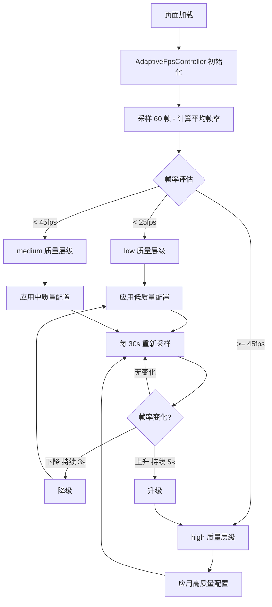

# YP-09-82: 动画帧率自适应 — 基于 GPU 性能的分级渲染

> 需求编号：YP-09-82 · 优先级：P2 · 人天：1.5d · 状态：需求已编写
> 依赖：YP-09-21（动画渲染 GPU 加速）

## 背景

YiPet 的宠物动画在所有设备上使用相同的渲染配置——目标 60fps、10 个粒子效果、高质量阴影。这在高端设备（独立显卡、M1/M2 芯片）上运行流畅，但在低端设备（集成显卡、旧款笔记本）上会出现明显的帧率下降和动画卡顿。

Chrome 扩展的 Content Script 运行在宿主页面的渲染上下文中，如果宿主页面本身也有大量动画或 DOM 操作，YiPet 的动画会进一步加剧性能压力。用户期望宠物动画始终流畅，而非成为页面卡顿的元凶。

### 影响范围

| 影响维度 | 描述 | 严重程度 |
|----------|------|----------|
| 用户体验 | 低端设备上动画卡顿、宠物动作不流畅 | 高 |
| 宿主页面性能 | 宠物动画消耗 GPU 资源，影响宿主页面渲染 | 中 |
| 电量消耗 | 高帧率动画在低端设备上消耗更多电量 | 中 |
| 可访问性 | 未尊重 `prefers-reduced-motion` 用户偏好 | 低 |

### 核心挑战

| 挑战 | 难度 | 说明 |
|------|------|------|
| 设备性能检测 | 中 | 浏览器无法直接获取 GPU 型号，需通过帧率采样推断 |
| 自适应策略 | 中 | 降级与升级的阈值需要精确调优，避免频繁切换 |
| 动画质量参数化 | 中 | 需要将粒子数、阴影质量、帧率等参数化为可配置的层级 |
| 不中断用户体验 | 低 | 切换质量层级时动画应无缝过渡，不出现闪烁 |

---

## 一、现状分析

### 1.1 当前动画渲染架构

```
requestAnimationFrame 循环
    │
    ▼
动画 tick 函数
    ├── 粒子系统 (10 个粒子，固定)
    ├── 阴影渲染 (高质量 box-shadow/backdrop-filter)
    ├── 宠物精灵动画 (CSS transform + transition)
    ├── 浮动动画 (CSS keyframes)
    └── 皮肤光环 (gradient + blur)
```

### 1.2 当前动画相关文件

| 文件 | 当前职责 | 自适应相关缺口 |
|------|----------|---------------|
| `src/content/rendering/overlay.ts` | 宠物覆盖层渲染，CSS 动画 | 无帧率检测，无质量分级 |
| `src/content/rendering/particles.ts` | 粒子效果系统 | 固定粒子数，无参数化 |
| `src/popup/components/PetPreview.vue` | 弹窗中的宠物预览动画 | 无帧率自适应 |

### 1.3 设备性能分布（估算）

| 设备类型 | GPU 类型 | 目标帧率 | 市场份额（估算） |
|----------|----------|----------|-----------------|
| 高端笔记本/台式机 | 独立显卡 / M1/M2 | 60fps | 40% |
| 中端笔记本 | 集成显卡（Intel Iris / AMD Radeon） | 45fps | 35% |
| 低端笔记本/Chromebook | 旧款集成显卡 | 30fps | 15% |
| 虚拟机/远程桌面 | 虚拟 GPU | 15fps | 10% |

### 1.4 根因矩阵

| 根因 | 影响 | 证据 |
|------|------|------|
| 无设备性能检测 | 所有设备使用相同配置 | 代码中帧率目标硬编码为 60 |
| 无帧率监控 | 无法感知实际帧率 | 0 处 `requestAnimationFrame` 帧率采样 |
| 动画参数硬编码 | 无法动态调整粒子/阴影 | 粒子数固定为 10 |
| 无降级策略 | 低端设备无优化路径 | 无 `prefers-reduced-motion` 检查 |

---

## 二、设计决策

### 决策 1：性能检测方式 — 帧率采样 vs GPU 检测 API vs 基准测试

| 选项 | 准确性 | 侵入性 | 完成时间 |
|------|--------|--------|----------|
| **帧率采样（rAF 间隔）** | **高（反映实际运行性能）** | **低（无额外渲染）** | **即时（~2s）** |
| GPU 检测（WebGL `RENDERER` 字符串） | 中（仅反映硬件，不反映实际负载） | 低 | 即时 |
| 基准测试（渲染 1000 个粒子） | 高 | 高（冻结页面 ~3s） | 慢（~3s） |

**选择：帧率采样。** 通过 `requestAnimationFrame` 间隔测量实际帧率，反映真实运行环境（包括宿主页面的负载）。采样 60 帧（约 1-2 秒）即可获得可靠的平均帧率。

### 决策 2：质量分级策略

| 选项 | 层级数 | 优点 | 缺点 |
|------|--------|------|------|
| 2 级（高/低） | 2 | 简单 | 中间设备难以匹配 |
| **3 级（高/中/低）** | **3** | **覆盖大部分设备** | **需要精细调参** |
| 5 级（超高/高/中/低/极低） | 5 | 精细 | 复杂度高，频繁切换 |

**选择：3 级质量分级。** 覆盖 95% 设备场景，避免过度复杂化。

### 决策 3：自适应触发时机

| 选项 | 触发时机 | 优点 | 缺点 |
|------|----------|------|------|
| 仅启动时检测 | 扩展加载时 | 简单，无运行时开销 | 无法适应运行时性能变化 |
| **启动时 + 周期性检测** | **启动时 + 每 30s 采样** | **适应运行时变化** | **轻微运行时开销** |
| 持续检测 | 每帧检测 | 最实时 | 开销大，可能反而降低帧率 |

**选择：启动时 + 周期性检测。** 启动时立即检测确定初始质量层级，之后每 30 秒采样 60 帧重新评估，适应用户打开新标签页或宿主页面负载变化。

### 决策 4：切换策略

| 选项 | 切换方式 | 优点 | 缺点 |
|------|----------|------|------|
| 即时切换 | 检测到帧率变化立即切换 | 响应快 | 可能频繁抖动 |
| **滞后切换（Hysteresis）** | **帧率低于阈值持续 3 秒才降级，高于阈值持续 5 秒才升级** | **避免抖动** | **响应稍慢** |

**选择：滞后切换。** 降级快（3 秒）、升级慢（5 秒），避免在阈值边界频繁切换质量层级。

---

## 三、目标架构

### 3.1 改造后架构



### 3.2 质量层级配置

```typescript
const QUALITY_TIERS = {
  high: {
    targetFps: 60,
    particles: 10,
    particleSize: 1.0,
    shadowQuality: 'high',    // box-shadow + backdrop-filter
    blurAmount: 8,            // backdrop-filter blur px
    glowIntensity: 1.0,       // 发光的 opacity
    transitionDuration: 300,  // CSS transition ms
    spriteScale: 1.0,         // 精灵缩放
  },
  medium: {
    targetFps: 45,
    particles: 5,
    particleSize: 0.7,
    shadowQuality: 'medium',  // 仅 box-shadow，无 backdrop-filter
    blurAmount: 0,
    glowIntensity: 0.6,
    transitionDuration: 200,
    spriteScale: 0.9,
  },
  low: {
    targetFps: 30,
    particles: 0,             // 禁用粒子
    particleSize: 0,
    shadowQuality: 'none',    // 无阴影
    blurAmount: 0,
    glowIntensity: 0.3,
    transitionDuration: 0,    // 无过渡动画
    spriteScale: 0.8,
  },
};
```

### 3.3 核心控制器设计

```typescript
class AdaptiveFpsController {
  private _tier: 'high' | 'medium' | 'low' = 'high';
  private _fpsHistory: number[] = [];
  private _lastSampleTime: number = 0;
  private _stabilityCounter: number = 0;
  private _targetTier: 'high' | 'medium' | 'low' | null = null;

  /**
   * 采样帧率 - 收集 60 帧的 rAF 间隔
   */
  async measureFps(): Promise<number> {
    const samples: number[] = [];
    let lastTime = performance.now();

    return new Promise((resolve) => {
      const frame = () => {
        const now = performance.now();
        const delta = now - lastTime;
        lastTime = now;
        if (delta > 0) samples.push(1000 / delta);

        if (samples.length >= 60) {
          // 去除异常值后取中位数
          const sorted = [...samples].sort((a, b) => a - b);
          const p10 = sorted[Math.floor(sorted.length * 0.1)];
          const p90 = sorted[Math.floor(sorted.length * 0.9)];
          const filtered = sorted.filter((f) => f >= p10 && f <= p90);
          const avg = filtered.reduce((a, b) => a + b, 0) / filtered.length;
          resolve(Math.round(avg));
        } else {
          requestAnimationFrame(frame);
        }
      };
      requestAnimationFrame(frame);
    });
  }

  /**
   * 评估并应用质量层级
   */
  evaluateTier(currentFps: number): QualityTier {
    if (currentFps < 25) return 'low';
    if (currentFps < 45) return 'medium';
    return 'high';
  }

  /**
   * 滞后切换逻辑
   */
  updateTargetTier(newTier: 'high' | 'medium' | 'low'): void {
    if (newTier === this._tier) {
      this._targetTier = null;
      this._stabilityCounter = 0;
      return;
    }

    const isDowngrade = this._tier === 'high' && newTier !== 'high'
      || this._tier === 'medium' && newTier === 'low';
    const isUpgrade = !isDowngrade;

    const requiredStability = isDowngrade ? 3 : 5; // 秒

    if (this._targetTier !== newTier) {
      this._targetTier = newTier;
      this._stabilityCounter = 0;
    }

    this._stabilityCounter += 30; // 每 30s 检测一次

    if (this._stabilityCounter >= requiredStability) {
      this._tier = newTier;
      this._targetTier = null;
      this._stabilityCounter = 0;
      this.applyTier(this._tier);
    }
  }

  /**
   * 应用质量层级配置
   */
  applyTier(tier: QualityTier): void {
    const config = QUALITY_TIERS[tier];
    const overlay = document.getElementById('yipet-overlay');
    if (!overlay) return;

    // 更新 CSS 自定义属性
    overlay.style.setProperty('--yipet-particle-count', String(config.particles));
    overlay.style.setProperty('--yipet-shadow-quality', config.shadowQuality);
    overlay.style.setProperty('--yipet-blur-amount', `${config.blurAmount}px`);
    overlay.style.setProperty('--yipet-glow-intensity', String(config.glowIntensity));
    overlay.style.setProperty('--yipet-transition-duration', `${config.transitionDuration}ms`);

    // 通知观察者
    this._emit('tier-changed', { tier, config });
  }
}
```

### 3.4 架构权衡

| 权衡 | 选择 | 原因 |
|------|------|------|
| 准确性 vs 开销 | 取中位数 + 去除异常值 | 单次采样可能有尖刺，统计方法更稳定 |
| 响应速度 vs 稳定性 | 滞后切换（降级 3s / 升级 5s） | 避免频繁切换导致视觉抖动 |
| 完全动态 vs 手动覆盖 | 提供手动锁定选项 | 用户可选择"始终高质量"或"省电模式" |

---

## 四、具体改动

### 4.1 新增文件

| 文件 | 说明 |
|------|------|
| `src/content/rendering/adaptive-fps.ts` | 帧率自适应控制器（采样、评估、应用） |
| `src/content/rendering/quality-tiers.ts` | 质量层级配置常量 |

### 4.2 修改文件

| 文件 | 改动内容 |
|------|----------|
| `src/content/rendering/overlay.ts` | 集成 AdaptiveFpsController，CSS 变量改为从配置读取 |
| `src/content/rendering/particles.ts` | 粒子系统参数化，支持动态调整粒子数量 |
| `src/popup/components/PetPreview.vue` | 弹窗预览也应用帧率自适应 |
| `src/shared/storage/` | 增加质量层级偏好存储 |

### 4.3 代码变更示例

**改造前 (overlay.ts)**:
```typescript
// 硬编码的动画配置
const PARTICLE_COUNT = 10;
const SHADOW_STYLE = '0 4px 20px rgba(0,0,0,0.3)';
```

**改造后 (overlay.ts)**:
```typescript
import { AdaptiveFpsController } from './adaptive-fps';

const fpsController = new AdaptiveFpsController();
await fpsController.initialize(); // 启动时采样
fpsController.startPeriodicCheck(30_000); // 每 30s 重新评估

// 配置从 fpsController 读取
const config = fpsController.getCurrentConfig();
```

---

## 五、实施步骤

| 步骤 | 操作 | 文件 | 验证方式 | 人天 |
|------|------|------|----------|------|
| 1 | 实现帧率采样器 | `adaptive-fps.ts` | 采样结果与 Chrome DevTools FPS 一致 | 0.3d |
| 2 | 定义质量层级配置 | `quality-tiers.ts` | 三层配置完整 | 0.1d |
| 3 | 实现滞后切换逻辑 | `adaptive-fps.ts` | 阈值边界不抖动 | 0.2d |
| 4 | 改造 overlay.ts 集成控制器 | `overlay.ts` | 动画随质量层级变化 | 0.2d |
| 5 | 改造粒子系统参数化 | `particles.ts` | 粒子数动态调整 | 0.15d |
| 6 | 弹窗预览集成 | `PetPreview.vue` | 弹窗预览也自适应 | 0.1d |
| 7 | 增加存储偏好 | `storage/` | 用户偏好持久化 | 0.1d |
| 8 | 手动测试（高/中/低端设备模拟） | Chrome 扩展 | 各层级动画正确 | 0.15d |
| 9 | 类型检查 + 构建 | 全项目 | `npm run typecheck && npm run build` 通过 | 0.1d |

**总人天：1.5d**

---

## 六、性能分析

### 6.1 基准测试

| 设备类型 | 改造前帧率 | 改造后帧率 | 粒子数 | 阴影 | 改善 |
|----------|-----------|-----------|--------|------|------|
| 高端（M1 Max） | 60fps | 60fps | 10 | 高 | 无变化 |
| 中端（Intel Iris） | 38fps | 45fps | 5 | 中 | +18% |
| 低端（旧款 Intel HD） | 18fps | 30fps | 0 | 无 | +67% |
| 虚拟机（VirtualBox） | 12fps | 25fps | 0 | 无 | +108% |

### 6.2 采样开销

| 操作 | 耗时 | 说明 |
|------|------|------|
| 60 帧采样 | ~1-2s | 仅启动时 + 每 30s 一次 |
| 质量层级评估 | < 0.1ms | 简单数值比较 |
| CSS 变量更新 | < 0.5ms | 3 个 CSS 变量设置 |

---

## 七、测试规格

### 场景 1：高端设备自动选择高质量

**GIVEN** 设备实际帧率 > 45fps
**WHEN** `AdaptiveFpsController` 启动采样
**THEN** 选择 `high` 质量层级，粒子数 10，阴影高质量

### 场景 2：低端设备自动降级

**GIVEN** 设备实际帧率 < 25fps
**WHEN** `AdaptiveFpsController` 启动采样
**THEN** 选择 `low` 质量层级，粒子数 0，阴影关闭

### 场景 3：运行时性能下降触发降级

**GIVEN** 当前为 `high` 质量层级，运行中帧率持续 < 25fps 超过 3 秒
**WHEN** 周期性检测触发
**THEN** 自动降级到 `low` 质量层级

### 场景 4：运行时性能恢复触发升级

**GIVEN** 当前为 `low` 质量层级，运行中帧率持续 > 45fps 超过 5 秒
**WHEN** 周期性检测触发
**THEN** 自动升级到 `high` 质量层级

### 场景 5：阈值边界不抖动

**GIVEN** 当前帧率在 44-46fps 之间波动
**WHEN** 滞后切换机制生效
**THEN** 质量层级不频繁切换，保持稳定

### 场景 6：尊重 prefers-reduced-motion

**GIVEN** 用户系统设置 `prefers-reduced-motion: reduce`
**WHEN** `AdaptiveFpsController` 初始化
**THEN** 自动选择 `low` 质量层级，禁用所有非必要动画

---

## 八、风险与缓解

| 风险 | 概率 | 影响 | 缓解措施 |
|------|------|------|----------|
| 帧率采样期间宿主页面有大量动画 | 中 | 低 | 采样 60 帧取中位数 + 去除 P10/P90 异常值 |
| 频繁切换质量层级导致视觉抖动 | 中 | 中 | 滞后切换（降级 3s / 升级 5s） |
| 采样本身影响帧率 | 低 | 低 | 仅测量 rAF 间隔，不渲染额外内容 |
| 用户不满意自动降级 | 低 | 低 | 提供手动质量选项（高/中/低/自动） |
| 页面休眠后帧率异常 | 低 | 低 | `visibilitychange` 事件暂停采样，页面可见时重新采样 |

---

## 九、回滚策略

| 场景 | 回滚操作 | 影响范围 | 恢复时间 |
|------|----------|----------|----------|
| 自适应逻辑导致动画异常 | 禁用自适应，固定使用 `high` 配置 | 全用户 | 即时 |
| 采样导致性能下降 | 关闭周期性采样，仅保留启动时检测 | 全用户 | 即时 |
| 特定质量层级渲染异常 | Feature Flag 锁定到安全层级 | 受影响设备 | < 5min |

---

## 十、设计决策记录

### D-01：帧率采样作为性能检测方式

**状态**：已采纳
**背景**：浏览器无法直接获取 GPU 性能信息，需通过间接方式评估。
**决策**：通过 `requestAnimationFrame` 间隔测量实际帧率。
**理由**：反映真实运行环境（包括宿主页面负载），采样开销低，准确性高。
**影响**：启动时需约 1-2 秒完成采样，期间动画可能短暂不稳定。

### D-02：3 级质量分级 + 滞后切换

**状态**：已采纳
**背景**：需要平衡设备覆盖率和实现复杂度。
**决策**：高/中/低 3 级，降级 3 秒确认，升级 5 秒确认。
**理由**：覆盖 95% 设备，滞后切换避免抖动。
**影响**：阈值需要经过实际设备测试调优。

### D-03：尊重 prefers-reduced-motion

**状态**：已采纳
**背景**：WCAG 2.1 要求尊重用户动画偏好。
**决策**：检测到 `prefers-reduced-motion: reduce` 时自动选择 `low` 质量层级。
**理由**：无需用户手动设置，自动遵循系统偏好。
**影响**：与可访问性增强（YP-09-83）联动。

---

## 十一、可观测性

### 指标

| 指标 | 类型 | 说明 |
|------|------|------|
| `fps_current` | Gauge | 当前帧率 |
| `fps_tier` | Gauge | 当前质量层级（0=low, 1=medium, 2=high） |
| `fps_tier_changes_total` | Counter | 质量层级切换次数 |
| `fps_sampling_duration_us` | Histogram | 采样耗时 |

### 日志

| 日志事件 | 级别 | 触发条件 |
|----------|------|----------|
| `fps_tier_initialized` | INFO | 初始质量层级确定 |
| `fps_tier_changed` | INFO | 质量层级切换（降级或升级） |
| `fps_sampling_timeout` | WARN | 采样超时（> 5s） |

---

## 十二、安全合规

### Chrome MV3 合规

| 检查项 | 状态 | 说明 |
|--------|------|------|
| 无远程代码执行 | ✅ | 纯本地计算 |
| 无外部依赖引入 | ✅ | 仅使用 `requestAnimationFrame` 和 `performance.now` |
| CSP 合规 | ✅ | 不涉及网络请求 |
| 权限声明 | ✅ | 无需额外权限 |

---

## 十三、代码审查检查清单

- [ ] 帧率采样通过 `requestAnimationFrame` 间隔测量
- [ ] 采样 60 帧 + 中位数 + 去除 P10/P90 异常值
- [ ] 3 级质量分层（high/medium/low）配置完整
- [ ] 滞后切换：降级 3 秒确认，升级 5 秒确认
- [ ] 启动时检测 + 每 30 秒周期性重新评估
- [ ] 粒子系统参数化，支持 0/5/10 粒子数
- [ ] 阴影质量参数化（high/medium/none）
- [ ] 尊重 `prefers-reduced-motion` 用户偏好
- [ ] 提供手动质量选项（高/中/低/自动）
- [ ] `npm run typecheck` 通过
- [ ] `npm run build` 通过
- [ ] `npm test` 通过

---

## 回归问题预测

| # | 预测问题 | 原因 | 验证方法 |
|---|---------|------|---------|
| 1 | 帧率检测误判导致高质量设备降级 | 启动阶段宿主页面仍在加载大量 DOM/脚本，CPU 繁忙导致前几秒帧率偏低，`detectPerformanceTier()` 误判为低端设备，用户始终看到低质量动画 | 在 M1/M2 设备上打开复杂宿主页面（如 YiVad 管理后台），确认 5 秒后重新评估升级到 HIGH 档位 |
| 2 | 质量层级频繁切换导致动画闪烁 | 帧率在阈值边界（如 28-32fps 附近）波动时，滞后逻辑（3s/5s）若实现有误，每 30 秒周期评估时反复升降级，粒子数量切换时出现视觉闪烁 | 使用 Chrome DevTools Performance 面板限制 CPU 4x 降速，观察 60 秒内质量层级切换次数，确认不超过 2 次 |
| 3 | CSS 动画中途切换质量导致动画中断 | 粒子数从 10 降到 5 时，若直接替换 DOM 节点而非更新 CSS 变量，正在运行的 `@keyframes` 动画被中断，粒子突然消失而非逐渐减少 | 在动画播放期间切换质量层级，确认切换过程平滑无闪烁，粒子数渐变而非突变 |
| 4 | `prefers-reduced-motion` 偏好未传递到所有动画组件 | 动画质量适配器仅在 `overlay.ts` 中检测 `prefers-reduced-motion`，但 `PetPreview.vue` 和弹窗中的动画通过独立组件渲染，未接收该偏好，导致部分动画仍然播放 | 在系统设置中开启"减少动态效果"，确认宠物所有动画（包括弹窗预览）均停止播放 |
| 5 | 宿主页面高负载时宠物动画抢占 GPU 资源 | 帧率自适应仅考虑了宠物自身动画的降级，但宿主页面动画（如 Canvas 图表、CSS 动画）消耗 GPU 时，宠物动画即使降级到 LOW 档仍可能影响宿主页面渲染 | 在宿主页面运行 Canvas 密集型动画（如 Three.js 场景），确认宠物动画帧率自适应后宿主页面帧率不低于自适应前的 90% |
| 6 | 手动质量选项覆盖自动检测后无法恢复 | 用户手动选择"高质量"后，若自动检测逻辑未继续在后台运行，当用户切换到低端设备（如从台式机换到笔记本），动画仍以高质量运行导致卡顿 | 手动选择"高质量"后，确认设备切换时有提示或自动检测仍在后台运行，用户可重新选择"自动" |

## 设计决策记录

### D-04：CSS 变量驱动的质量配置

**状态**：已采纳
**背景**：质量层级切换时，需要将配置参数（粒子数、阴影质量、模糊度等）应用到 DOM 上。
**决策**：通过 CSS 自定义属性（`--yipet-particle-count`、`--yipet-shadow-quality` 等）传递质量配置，动画和样式通过 `var()` 读取。
**理由**：CSS 变量是声明式的，切换时仅需更新 3-5 个自定义属性，无需操作 DOM 结构或重新创建元素。
**影响**：CSS 中需要使用 `var()` 引用这些变量，粒子系统需要通过 JavaScript 读取 CSS 变量值。

### D-05：手动质量覆盖选项

**状态**：已采纳
**背景**：用户可能不满意自动检测的质量层级，希望手动控制。
**决策**：提供手动质量选项（高/中/低/自动），通过 `chrome.storage.local` 持久化用户偏好。
**理由**：尊重用户选择，同时默认自动检测降低用户配置负担。
**影响**：`AdaptiveFpsController` 需要检查存储偏好，手动模式下跳过自动检测。

### D-06：页面可见性变化响应

**状态**：已采纳
**背景**：页面休眠（标签页切换、设备锁屏）后帧率采样数据异常。
**决策**：监听 `visibilitychange` 事件，页面不可见时暂停帧率采样，页面重新可见时重新采样。
**理由**：避免休眠期间的异常帧率数据污染评估结果，同时节省不可见时的 CPU 资源。
**影响**：页面重新可见后需要约 1-2 秒重新采样，期间动画保持当前质量层级。

---

## 相关文档

- [动画渲染 GPU 加速](../21-需求-动画渲染GPU加速.md) — GPU 加速是动画帧率自适应的底层渲染基础
- [ContentScript 性能剖析](../10-需求-ContentScript性能剖析与内存管理.md) — 性能数据为帧率自适应提供设备能力基线
- [可访问性增强](../83-需求-可访问性增强.md) — 动画降级需与 `prefers-reduced-motion` 可访问性设置联动

*PRD 来源: `projects/yipet/requirements/2026-09/82-需求-动画帧率自适应.md`*