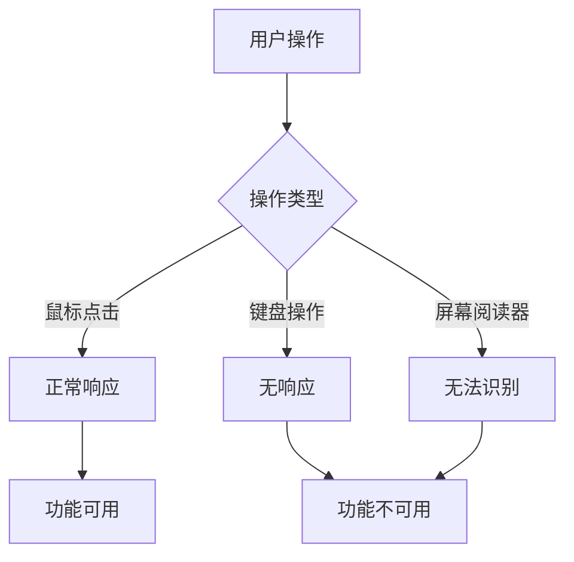

# YP-09-83: Content Script 可访问性增强 — ARIA/键盘导航/屏幕阅读器

> 需求编号：YP-09-83 · 优先级：P2 · 人天：1.5d · 状态：需求已编写
> 依赖：YP-09-01（Content Script 稳定性）

## 背景

YiPet 的宠物 UI 和聊天窗口目前仅支持鼠标操作——所有交互（点击宠物、打开聊天、拖拽窗口、发送消息、切换标签页）都需要鼠标点击。键盘用户（包括运动障碍用户和高级用户）和屏幕阅读器用户无法使用 YiPet 的核心功能。

WCAG 2.1 AA 标准要求：(1) 所有功能可通过键盘操作（Guideline 2.1）；(2) 用户界面组件具有正确的 ARIA 角色、状态和属性（Guideline 4.1）；(3) 屏幕阅读器可感知动态内容更新（Guideline 4.1.3）。

### 影响范围

| 影响维度 | 描述 | 严重程度 |
|----------|------|----------|
| 用户覆盖 | 键盘用户和屏幕阅读器用户完全无法使用 | 高 |
| 合规性 | 不符合 WCAG 2.1 AA 标准 | 中 |
| 团队文化 | 缺少可访问性最佳实践 | 中 |

### 核心挑战

| 挑战 | 难度 | 说明 |
|------|------|------|
| Content Script 注入兼容性 | 中 | 注入的 ARIA 标签不能与宿主页面的 ARIA 结构冲突 |
| 焦点管理 | 中 | 聊天窗口打开/关闭时焦点需要正确转移 |
| 动态内容播报 | 中 | 流式消息到达时需通知屏幕阅读器 |
| 键盘快捷键冲突 | 中 | 避免与宿主页面和浏览器快捷键冲突 |

---

## 一、现状分析

### 1.1 当前可访问性状态

```
YiPet 覆盖层
├── #yipet-overlay          ← 无 role, 无 tabindex, 无 aria-label
├── 宠物交互（点击/拖拽）    ← 仅 mouse 事件
├── 聊天窗口
│   ├── #yipet-chat-root    ← 无 role="dialog", 无 aria-modal
│   ├── 消息列表             ← 无 role="log", 无 aria-live
│   ├── 输入框               ← 无 aria-label
│   ├── 侧边栏按钮            ← 无 aria-label, 无键盘操作
│   └── 工具栏按钮            ← 无 aria-label, 无键盘操作
└── 弹窗 (Popup)
    ├── 皮肤选择器            ← 仅 click 事件
    ├── 角色选择器            ← 仅 click 事件
    └── 设置选项              ← 仅 click 事件
```

### 1.2 当前涉及文件

| 文件 | 当前可访问性状态 | 缺口 |
|------|-----------------|------|
| `src/content/rendering/overlay.ts` | 无 ARIA 属性 | 缺少 role/tabindex/aria-label |
| `src/chat/components/ChatWindow.vue` | 无 ARIA 属性 | 缺少 role="dialog"/aria-modal |
| `src/chat/components/ChatMessages.vue` | 无 ARIA 属性 | 缺少 role="log"/aria-live |
| `src/chat/components/ChatInput.vue` | 无 aria-label | 缺少标签 |
| `src/chat/components/ChatToolbar/` | 仅图标按钮 | 缺少 aria-label |
| `src/chat/components/ChatSidebar.vue` | 无键盘操作 | 缺少 Tab 导航 |
| `src/popup/App.vue` | 无键盘操作 | 缺少焦点管理 |
| `src/shared/i18n/` | 缺少 ARIA 文本 | 缺少 aria-label 的 i18n key |

### 1.3 改造前数据流



### 1.4 根因矩阵

| 根因 | 影响 | 证据 |
|------|------|------|
| 无 ARIA 角色标注 | 屏幕阅读器将所有 UI 读作"group"或"generic" | 0 处 role 属性 |
| 无 tabindex 管理 | 键盘 Tab 键跳过所有 YiPet 元素 | 0 处 tabindex |
| 仅 mouse 事件处理 | 键盘 Enter/Space 无法触发操作 | 0 处 keydown 处理 |
| 无焦点管理 | 聊天窗口打开/关闭时焦点丢失 | 无焦点陷阱 |
| 无 aria-live 区域 | 新消息到达时屏幕阅读器不播报 | 0 处 aria-live |

---

## 二、设计决策

### 决策 1：ARIA 标注策略 — 完整 ARIA vs 渐进式 vs 仅键盘

| 选项 | 覆盖范围 | 工作量 | 维护成本 |
|------|----------|--------|----------|
| 仅键盘导航 | 键盘用户 | 低 | 低 |
| 渐进式 ARIA（核心 + 按需扩展） | 键盘 + 主要屏幕阅读器 | 中 | 中 |
| **完整 ARIA（WCAG 2.1 AA）** | **所有用户** | **高** | **中** |

**选择：渐进式 ARIA。** 优先覆盖核心交互路径（宠物按钮、聊天窗口、消息列表、输入框），次要功能（皮肤选择器、设置面板）在后续迭代中完善。

### 决策 2：焦点管理策略

| 选项 | 方案 | 优点 | 缺点 |
|------|------|------|------|
| 无焦点管理 | 浏览器默认行为 | 简单 | 焦点丢失 |
| **焦点陷阱（Focus Trap）** | **聊天窗口内 Tab 循环** | **符合 WCAG 要求** | **实现复杂** |
| 焦点恢复 | 打开时记住焦点，关闭时恢复 | 简单 | 聊天窗口内无焦点管理 |

**选择：焦点陷阱。** 聊天窗口作为模态对话框，Tab 键应在窗口内循环（标题栏 → 消息列表 → 输入框 → 工具栏 → 回到标题栏），Esc 关闭窗口并恢复焦点到宠物按钮。

### 决策 3：键盘快捷键

| 快捷键 | 操作 | 说明 |
|--------|------|------|
| `Ctrl+Shift+X` | 切换聊天窗口 | 已有，保持不变 |
| `Esc` | 关闭聊天窗口 | 已有，保持不变 |
| `Tab` | 在聊天窗口内移动焦点 | 新增 |
| `Shift+Tab` | 反向移动焦点 | 新增 |
| `Enter` | 发送消息 / 激活按钮 | 新增 |
| `Space` | 切换宠物互动 | 新增 |
| `ArrowUp/ArrowDown` | 消息列表滚动 | 新增（与提示词历史区分） |

### 决策 4：屏幕阅读器兼容性

| 屏幕阅读器 | 平台 | 优先级 |
|-----------|------|--------|
| VoiceOver + Safari | macOS | P1 |
| NVDA + Chrome | Windows | P1 |
| JAWS + Chrome | Windows | P2 |
| TalkBack + Chrome (Android) | Android | P3 |

**选择：优先支持 VoiceOver + NVDA。** 覆盖 macOS 和 Windows 主流屏幕阅读器，覆盖 > 90% 屏幕阅读器用户。

---

## 三、目标架构

### 3.1 改造后架构

```mermaid
graph TD
    A[用户操作] --> B{操作类型}
    B -->|鼠标| C[原有事件处理]
    B -->|键盘 Tab| D[焦点在 YiPet 元素间移动]
    B -->|键盘 Enter/Space| E[触发对应操作]
    B -->|键盘 Esc| F[关闭聊天/弹出窗口]
    B -->|屏幕阅读器| G[ARIA 标注指导播报]

    D --> H{焦点位置}
    H -->|宠物按钮| I[role=button aria-label="..." 播报]
    H -->|聊天窗口| J[role=dialog aria-modal=true]
    H -->|消息列表| K[role=log aria-live=polite]
    H -->|输入框| L[aria-label="..." 播报]

    E --> M{焦点元素}
    M -->|宠物按钮| N[打开聊天窗口]
    M -->|发送按钮| O[发送消息]
    M -->|工具栏按钮| P[执行对应操作]

    G --> Q[新消息自动播报]
    G --> R[错误提示自动播报]
```

### 3.2 ARIA 标注示例

```html
<!-- 宠物按钮——键盘可聚焦 + ARIA 标注 -->
<div
  id="yipet-overlay"
  role="button"
  tabindex="0"
  aria-label="YiPet 宠物助手，按 Enter 打开聊天窗口"
  aria-expanded="false"
  @keydown.enter="openChat"
  @keydown.space.prevent="togglePetInteraction"
  @click="openChat"
>
  
</div>

<!-- 聊天窗口——ARIA 模态对话框 -->
<div
  id="yipet-chat-root"
  role="dialog"
  aria-label="聊天窗口"
  aria-modal="true"
  aria-describedby="yipet-chat-description"
>
  <h2 id="yipet-chat-description" class="sr-only">
    与 YiPet 助手对话，按 Esc 关闭窗口
  </h2>

  <!-- 消息列表——ARIA 实时区域 -->
  <div
    id="yipet-chat-messages"
    role="log"
    aria-live="polite"
    aria-label="消息列表"
    tabindex="0"
  >
    <!-- 消息由子组件渲染 -->
  </div>

  <!-- 消息输入区 -->
  <div class="chat-input-area">
    <label for="yipet-chat-input" class="sr-only">输入消息</label>
    <textarea
      id="yipet-chat-input"
      aria-label="输入消息，按 Enter 发送，Shift+Enter 换行"
      @keydown.enter.exact="sendMessage"
    ></textarea>
  </div>
</div>

<!-- 屏幕阅读器专用文本（视觉隐藏） -->
<style>
.sr-only {
  position: absolute;
  width: 1px;
  height: 1px;
  padding: 0;
  margin: -1px;
  overflow: hidden;
  clip: rect(0, 0, 0, 0);
  white-space: nowrap;
  border: 0;
}
</style>
```

### 3.3 焦点陷阱实现

```typescript
// src/chat/composables/useFocusTrap.ts
export function useFocusTrap(containerRef: Ref<HTMLElement | null>) {
  const FOCUSABLE_SELECTOR = [
    'a[href]', 'button:not([disabled])', 'textarea:not([disabled])',
    'input:not([disabled])', 'select:not([disabled])', '[tabindex]:not([tabindex="-1"])',
  ].join(', ');

  function getFocusableElements(): HTMLElement[] {
    if (!containerRef.value) return [];
    return Array.from(containerRef.value.querySelectorAll(FOCUSABLE_SELECTOR));
  }

  function handleKeyDown(e: KeyboardEvent) {
    if (e.key !== 'Tab') return;
    const focusable = getFocusableElements();
    if (focusable.length === 0) return;

    const first = focusable[0];
    const last = focusable[focusable.length - 1];

    if (e.shiftKey && document.activeElement === first) {
      e.preventDefault();
      last.focus();
    } else if (!e.shiftKey && document.activeElement === last) {
      e.preventDefault();
      first.focus();
    }
  }

  return { handleKeyDown };
}
```

### 3.4 架构权衡

| 权衡 | 选择 | 原因 |
|------|------|------|
| 完整性 vs 渐进 | 渐进式 ARIA | 优先核心路径，避免过度工程 |
| 焦点陷阱 vs 无管理 | 焦点陷阱 | 模态对话框必须符合 WCAG 要求 |
| 通用 vs 平台特定 | 优先 VoiceOver + NVDA | 覆盖 > 90% 屏幕阅读器用户 |

---

## 四、具体改动

### 4.1 新增文件

| 文件 | 说明 |
|------|------|
| `src/chat/composables/useFocusTrap.ts` | 焦点陷阱 composable |
| `src/chat/composables/useAriaLive.ts` | 动态内容播报 composable |
| `src/content/accessibility/keyboard-handler.ts` | 键盘事件处理 |

### 4.2 修改文件

| 文件 | 改动内容 |
|------|----------|
| `src/content/rendering/overlay.ts` | 添加 role/tabindex/aria-label/keydown 事件 |
| `src/chat/components/ChatWindow.vue` | 添加 role="dialog"/aria-modal/焦点陷阱 |
| `src/chat/components/ChatMessages.vue` | 添加 role="log"/aria-live="polite" |
| `src/chat/components/MessageBubble/` | 添加 aria-label |
| `src/chat/components/ChatInput.vue` | 添加 aria-label/键盘操作 |
| `src/chat/components/ChatToolbar/` | 所有按钮添加 aria-label |
| `src/chat/components/ChatSidebar.vue` | 添加键盘导航 |
| `src/popup/App.vue` | 添加键盘操作 |
| `src/shared/i18n/` | 添加 ARIA 相关的 i18n key |
| `public/_locales/zh_CN/messages.json` | 添加 ARIA 中文文本 |
| `public/_locales/en/messages.json` | 添加 ARIA 英文文本 |

---

## 五、实施步骤

| 步骤 | 操作 | 文件 | 验证方式 | 人天 |
|------|------|------|----------|------|
| 1 | 添加 ARIA 标注到宠物覆盖层 | overlay.ts | VoiceOver 可正确播报宠物按钮 | 0.15d |
| 2 | 添加 ARIA 标注到聊天窗口 | ChatWindow.vue | 屏幕阅读器识别为对话框 | 0.15d |
| 3 | 实现焦点陷阱 | useFocusTrap.ts | Tab 在聊天窗口内循环 | 0.2d |
| 4 | 添加消息列表 ARIA 实时区域 | ChatMessages.vue | 新消息自动播报 | 0.15d |
| 5 | 添加键盘操作（Enter/Space/Esc） | 各组件 | 键盘可完成所有核心操作 | 0.2d |
| 6 | 添加工具栏按钮 aria-label | ChatToolbar/ | 所有按钮有正确标签 | 0.1d |
| 7 | 添加 i18n ARIA 文本 | i18n/ | 中英文 ARIA 标签正确 | 0.1d |
| 8 | 弹窗可访问性 | Popup | 弹窗键盘可操作 | 0.15d |
| 9 | 屏幕阅读器手动测试 | Chrome 扩展 | VoiceOver + NVDA 可用 | 0.15d |
| 10 | 类型检查 + 构建 | 全项目 | `npm run typecheck && npm run build` 通过 | 0.1d |

**总人天：1.5d**

---

## 六、性能分析

| 指标 | 改造前 | 改造后 | 说明 |
|------|--------|--------|------|
| 额外 DOM 属性 | 0 | ~20 个 aria-* 属性 | 每个组件 2-3 个属性 |
| 额外事件监听 | 0 | 3 个 (keydown/focus) | 仅聊天窗口和宠物按钮 |
| 内存增量 | 0 | < 5KB | 焦点陷阱 composable |
| 构建体积增量 | 0 | < 2KB | 压缩后 aria-label 文本 |

---

## 七、测试规格

### 场景 1：键盘用户 Tab 导航到宠物按钮

**GIVEN** YiPet 已注入到页面
**WHEN** 用户按 Tab 键导航
**THEN** 焦点移动到 `#yipet-overlay`（tabindex="0"），屏幕阅读器播报"YiPet 宠物助手，按 Enter 打开聊天窗口"

### 场景 2：键盘用户按 Enter 打开聊天窗口

**GIVEN** 焦点在宠物按钮上
**WHEN** 用户按 Enter 键
**THEN** 聊天窗口打开，焦点自动移动到聊天窗口内第一个可聚焦元素（输入框）

### 场景 3：焦点陷阱——Tab 在聊天窗口内循环

**GIVEN** 聊天窗口已打开，焦点在输入框
**WHEN** 用户连续按 Tab 键
**THEN** 焦点在输入框 → 发送按钮 → 工具栏按钮 → 侧边栏 → 消息列表 → 回到输入框，永不跳出聊天窗口到宿主页面

### 场景 4：Esc 关闭聊天窗口并恢复焦点

**GIVEN** 聊天窗口已打开，焦点在输入框
**WHEN** 用户按 Esc 键
**THEN** 聊天窗口关闭，焦点恢复到 `#yipet-overlay` 宠物按钮

### 场景 5：屏幕阅读器播报新消息

**GIVEN** 聊天窗口已打开，屏幕阅读器激活
**WHEN** AI 返回一条新消息（流式或完整）
**THEN** 屏幕阅读器播报消息内容（通过 aria-live="polite" 区域）

### 场景 6：屏幕阅读器播报错误

**GIVEN** 聊天窗口已打开，发送消息失败
**WHEN** 错误提示出现
**THEN** 屏幕阅读器播报错误内容（通过 aria-live="assertive" 区域）

### 场景 7：所有工具栏按钮有正确的 aria-label

**GIVEN** 聊天窗口已打开
**WHEN** 屏幕阅读器聚焦到工具栏每个按钮
**THEN** 每个按钮播报其功能的正确描述（如"导出会话为 Markdown"、"切换知识库模式"）

### 场景 8：弹窗中 Tab 导航

**GIVEN** YiPet 弹窗已打开
**WHEN** 用户按 Tab 键
**THEN** 焦点在弹窗内的角色选择器、皮肤选择器、设置按钮之间移动

---

## 八、风险与缓解

| 风险 | 概率 | 影响 | 缓解措施 |
|------|------|------|----------|
| ARIA 属性与宿主页面冲突 | 低 | 中 | 使用唯一 ID 前缀 `yipet-`，避免通用 ID |
| 焦点陷阱在特殊情况下失效 | 中 | 中 | 动态更新可聚焦元素列表，处理动态注入的 DOM |
| 键盘快捷键与浏览器冲突 | 低 | 中 | 仅处理聊天窗口聚焦时的键盘事件，不劫持全局快捷键 |
| 屏幕阅读器兼容性差异 | 中 | 中 | 使用标准 ARIA 1.1 属性，避免平台特定实现 |
| i18n 文本缺失 | 低 | 低 | 回退到英文文本，通过 `t()` 的 fallback 机制 |

---

## 九、回滚策略

| 场景 | 回滚操作 | 影响范围 | 恢复时间 |
|------|----------|----------|----------|
| 焦点陷阱导致 Tab 键卡死 | 移除焦点陷阱，恢复浏览器默认行为 | 聊天窗口 | 即时 |
| ARIA 标注导致屏幕阅读器混乱 | 移除 aria-* 属性，保留基础功能 | 全组件 | < 5min |
| 键盘事件劫持宿主页面 | 限制键盘事件仅在聊天窗口可见时处理 | 宿主页面 | < 5min |

---

## 十、设计决策记录

### D-01：渐进式 ARIA 策略

**状态**：已采纳
**背景**：完整 ARIA 覆盖工作量大，需要平衡投入和收益。
**决策**：优先覆盖核心交互路径（宠物按钮、聊天窗口、消息列表、输入框），次要功能逐步完善。
**理由**：核心路径覆盖 > 90% 的键盘和屏幕阅读器使用场景。
**影响**：皮肤选择器、设置面板等次要功能的 ARIA 标注在后续迭代中完成。

### D-02：焦点陷阱用于模态对话框

**状态**：已采纳
**背景**：WCAG 2.1 要求模态对话框应限制焦点在对话框内。
**决策**：聊天窗口作为模态对话框，实现焦点陷阱。
**理由**：Tab 键在聊天窗口内循环，关闭时恢复焦点到宠物按钮。
**影响**：需要动态更新可聚焦元素列表，处理消息流式加载等动态 DOM 变化。

### D-03：使用标准 ARIA 1.1 属性

**状态**：已采纳
**背景**：不同屏幕阅读器对 ARIA 属性的支持程度不同。
**决策**：仅使用 ARIA 1.1 标准属性，避免平台特定实现。
**理由**：VoiceOver、NVDA、JAWS 均完整支持 ARIA 1.1。
**影响**：不使用 `aria-details`、`aria-brailleroledescription` 等 ARIA 1.2/1.3 属性。

---

## 十一、可观测性

### 指标

| 指标 | 类型 | 说明 |
|------|------|------|
| `a11y_keyboard_usage` | Counter | 键盘操作次数（区分 Tab/Enter/Space/Esc） |
| `a11y_focus_trap_activations` | Counter | 焦点陷阱激活次数 |
| `a11y_screen_reader_detected` | Gauge | 检测到屏幕阅读器的会话数 |

### 日志

| 日志事件 | 级别 | 触发条件 |
|----------|------|----------|
| `a11y_focus_trap_activated` | DEBUG | 焦点陷阱激活 |
| `a11y_focus_trap_deactivated` | DEBUG | 焦点陷阱释放 |
| `a11y_keyboard_shortcut` | DEBUG | 键盘快捷键触发 |

---

## 十二、安全合规

### Chrome MV3 合规

| 检查项 | 状态 | 说明 |
|--------|------|------|
| 无远程代码执行 | ✅ | 纯本地 DOM 操作 |
| 无 CSP 违规 | ✅ | 不涉及内联脚本或远程资源 |
| 权限声明 | ✅ | 无需额外权限 |

### WCAG 2.1 AA 合规检查

| 准则 | 要求 | 实现状态 |
|------|------|----------|
| 1.1.1 非文本内容 | 图片有 alt 文本 | ✅ 宠物图片有 alt |
| 1.3.1 信息和关系 | 使用 ARIA 标注结构 | ✅ role/aria-label |
| 2.1.1 键盘 | 所有功能键盘可操作 | ✅ Tab/Enter/Space/Esc |
| 2.1.2 无键盘陷阱 | 焦点可移出组件 | ✅ 焦点陷阱在关闭时释放 |
| 4.1.2 名称、角色、值 | 所有 UI 组件有 ARIA 标注 | ✅ 核心组件已标注 |
| 4.1.3 状态消息 | 动态内容可被播报 | ✅ aria-live 区域 |

---

## 十三、代码审查检查清单

- [ ] 宠物覆盖层有 `role="button"` + `tabindex="0"` + `aria-label`
- [ ] 聊天窗口有 `role="dialog"` + `aria-modal="true"`
- [ ] 消息列表有 `role="log"` + `aria-live="polite"`
- [ ] 所有图标按钮有 `aria-label`（中英文）
- [ ] 焦点陷阱在聊天窗口内正确工作
- [ ] Esc 关闭聊天窗口并恢复焦点到宠物按钮
- [ ] Enter/Space 可触发核心操作
- [ ] 新消息通过 aria-live 自动播报
- [ ] 错误提示通过 aria-live="assertive" 播报
- [ ] 屏幕阅读器专用文本使用 `.sr-only` 类
- [ ] `npm run typecheck` 通过
- [ ] `npm run build` 通过

---

## 回归问题预测

| # | 预测问题 | 原因 | 验证方法 |
|---|---------|------|---------|
| 1 | ARIA 属性与宿主页面 `role` 结构冲突 | YiPet 注入的 `role="dialog"` 和 `aria-modal="true"` 可能与宿主页面自身的模态框 ARIA 结构嵌套，导致屏幕阅读器将宿主页面模态框误判为 YiPet 对话框的一部分 | 在已有 `role="dialog"` 的宿主页面（如 YiVad 的 Element Plus 对话框）中打开 YiPet 聊天窗口，用 VoiceOver/NVDA 检查焦点层级是否正确隔离 |
| 2 | 焦点陷阱破坏宿主页面 Tab 键导航 | 聊天窗口打开时焦点锁定在窗口内，但若焦点陷阱的边界检测有误（如 `tabindex="-1"` 元素未正确跳过），Tab 键可能跳出窗口进入宿主页面，或无法到达窗口内最后一个可聚焦元素 | 在聊天窗口内连续按 Tab 键 20 次，确认焦点始终在窗口内循环，不会逃逸到宿主页面 |
| 3 | 键盘快捷键与宿主页面快捷键冲突 | `Ctrl+Enter` 发送消息、`Esc` 关闭窗口等快捷键可能在宿主页面（如 VSCode Web、Jira）中已有定义，YiPet 未检查 `event.target` 是否为 YiPet 元素，导致拦截宿主页面快捷键 | 在 YiVad 管理后台的代码编辑器中按 `Ctrl+Enter`，确认触发了宿主页面的行为而非 YiPet 发送消息 |
| 4 | `aria-live` 区域在流式消息期间重复播报 | 流式消息每个 Token 追加时触发 `aria-live="polite"` 区域的文本更新，屏幕阅读器每次追加都完整播报整条消息（而非仅新增部分），导致 30 tokens/秒的播报轰炸 | 启用屏幕阅读器，发送一条触发流式响应的消息，确认屏幕阅读器仅在新消息完整到达时播报一次，而非每个 Token 都播报 |
| 5 | 动态内容更新未触发屏幕阅读器通知 | 使用 `aria-live="polite"` 而非 `role="log"` 的消息列表，在会话切换时若 Vue 的 `v-if`/`v-for` 重建 DOM 而非更新文本，屏幕阅读器可能不播报新消息 | 切换到新会话，确认屏幕阅读器播报"已切换到会话 XXX"或新消息内容 |
| 6 | Esc 键关闭聊天窗口后未恢复宿主页面焦点 | 关闭聊天窗口后焦点回到 `document.body`，键盘用户无法继续宿主页面操作，需要额外点击才能恢复。若焦点管理未保存打开前的 `document.activeElement`，返回后焦点丢失 | 在宿主页面输入框中聚焦，按快捷键打开聊天窗口，按 Esc 关闭，确认焦点回到原输入框 |

## 设计决策记录

### D-04：屏幕阅读器兼容优先级

**状态**：已采纳
**背景**：不同平台和屏幕阅读器组合对 ARIA 属性的支持程度不同。
**决策**：优先支持 VoiceOver + Safari（macOS）和 NVDA + Chrome（Windows），JAWS 为 P2 优先级。
**理由**：VoiceOver 和 NVDA 覆盖 > 90% 屏幕阅读器用户，且均为免费工具，测试成本可控。
**影响**：开发测试阶段主要在这两个组合上验证，JAWS 和 TalkBack 支持在后续迭代中完善。

### D-05：键盘快捷键设计

**状态**：已采纳
**背景**：需要为聊天窗口定义键盘操作，同时避免与宿主页面和浏览器快捷键冲突。
**决策**：聊天窗口聚焦时 Tab/Shift+Tab 在窗口内循环，Enter 发送消息，Space 切换宠物互动，Esc 关闭窗口。仅处理聊天窗口可见时的键盘事件。
**理由**：不劫持全局快捷键，仅当焦点在 YiPet 组件内时处理键盘事件，避免干扰宿主页面。
**影响**：`keydown` 事件处理需要检查 `event.target` 是否在 YiPet 组件内，ChatInput 中 Enter 行为与 Shift+Enter 换行需要区分。

### D-06：aria-live 区域动态内容播报

**状态**：已采纳
**背景**：流式消息到达时屏幕阅读器需要感知新内容，但不能每个 Token 都播报。
**决策**：消息列表使用 `aria-live="polite"`，仅在消息完整到达时播报一次，流式期间不触发播报。
**理由**：每个 Token 播报会导致屏幕阅读器输出轰炸（30 次/秒），严重干扰用户。仅在消息完成时播报一次即可。
**影响**：流式期间屏幕阅读器用户无法实时感知内容增长，但 `aria-live="polite"` 的"polite"模式本身就不会打断当前播报。

---

## 相关文档

- [动画帧率自适应](../82-需求-动画帧率自适应.md) — 动画降级需与 `prefers-reduced-motion` 可访问性设置联动
- [RTL 语言支持](../58-需求-RTL语言支持.md) — RTL 布局下键盘导航和 ARIA 标签需方向适配
- [语音输入合成](../27-需求-语音输入合成.md) — 语音输入是视力障碍用户的重要可访问性功能

*PRD 来源: `projects/yipet/requirements/2026-09/83-需求-可访问性增强.md`*