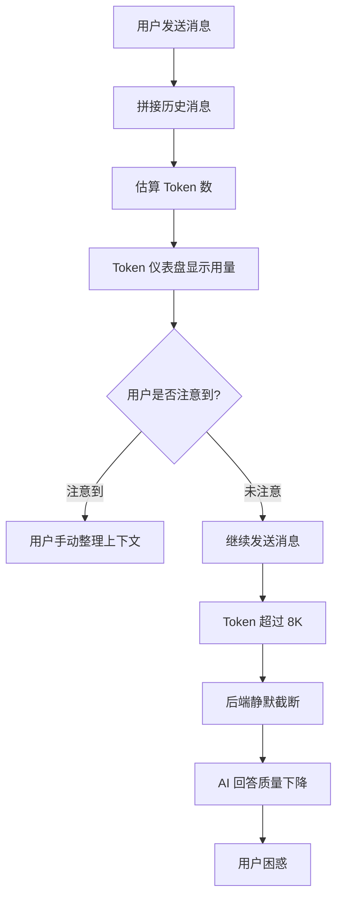
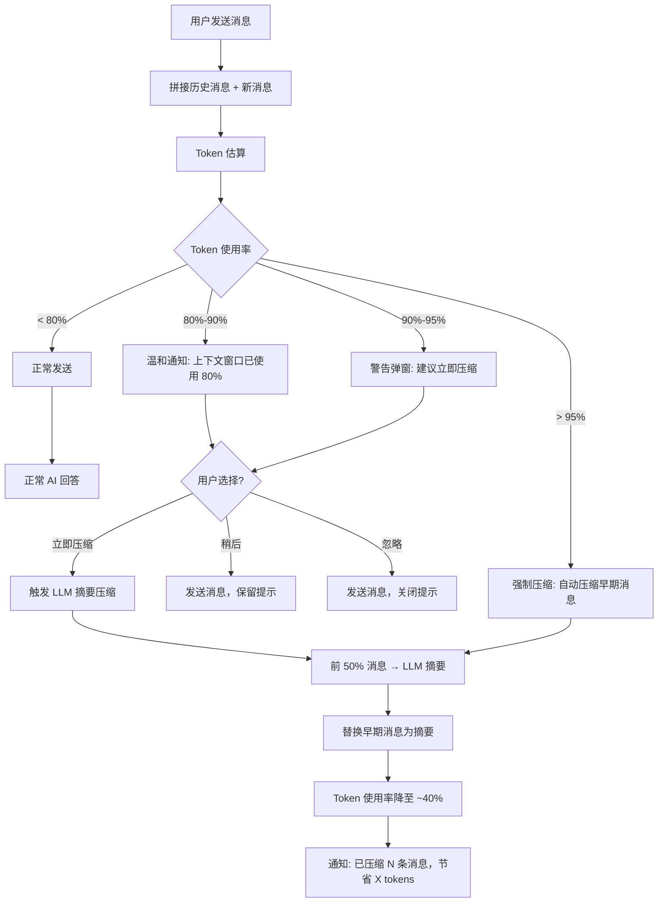

# YP-09-84: 聊天窗口上下文压缩提示 — Token 窗口警告与自动压缩

> 需求编号：YP-09-84 · 优先级：P2 · 人天：1.0d · 状态：需求已编写
> 依赖：YP-09-48（Token 可视化仪表盘）、YP-09-72（长会话性能优化）

## 背景

YiPet 聊天窗口基于 YiAi 后端提供的 qwen2.5 模型，其上下文窗口为 8K tokens（约 12000 中文汉字）。YP-09-48 已实现了 Token 用量仪表盘，以可视化方式展示当前上下文窗口的使用率。但仪表盘是被动的——用户可能忽略警告，当 Token 使用率达到 80% 以上时不会主动采取行动，导致以下问题：

1. **早期消息丢失**：当 Token 超过模型上限时，后端会截断最早的消息，用户可能丢失重要上下文
2. **回答质量下降**：上下文窗口紧张时，AI 只能基于最近的对话片段回答，质量显著下降
3. **用户无感知**：截断发生在后端，用户不知道哪些消息被截断了
4. **重复压缩**：用户可能多次手动触发压缩，造成不必要的 LLM 调用

### 影响范围

| 影响维度 | 描述 | 严重程度 |
|----------|------|----------|
| 用户体验 | 上下文截断导致 AI 回答质量下降，用户困惑 | 高 |
| 回答准确性 | 丢失早期上下文后 AI 回答偏离主题 | 高 |
| 资源浪费 | 用户无感知地发送超长上下文，浪费 Token 配额 | 中 |

### 核心挑战

| 挑战 | 难度 | 说明 |
|------|------|------|
| 提示时机 | 中 | 太早打扰用户，太晚失去效果 |
| 压缩策略 | 高 | 需要智能摘要而非简单截断，保留关键上下文 |
| 用户选择权 | 低 | 提供"立即压缩"、"稍后"、"不压缩"三种选择 |
| 与流式传输的交互 | 中 | 流式响应期间不应弹出压缩提示 |

---

## 一、现状分析

### 1.1 当前 Token 使用流程

```
用户发送消息
    │
    ▼
chatStore.sendMessage(text)
    │ 拼接所有历史消息 + 新消息
    │ 估算 Token 数（chars/4 粗略估算）
    ▼
fetch POST /  body: { module_name: "services.ai.chat_service", ... }
    │ 后端接收完整消息历史
    ▼
YiAi 后端
    │ 如果 Token 超过模型上限（8K）
    │ 截断最早的消息
    ▼
LLM 推理
    │ 仅基于截断后的上下文回答
    ▼
用户收到回答
    │ 不知道上下文已被截断
    │ 发现回答与早期对话脱节 → 困惑
```

### 1.2 当前涉及文件

| 文件 | 当前职责 | 压缩相关缺口 |
|------|----------|-------------|
| `src/chat/stores/chat.ts` | 消息管理、Token 估算 | 无压缩提示，无压缩操作 |
| `src/chat/components/RequestStatusButton.vue` | Token 用量显示 | 无警告交互 |
| `src/chat/components/ChatInput.vue` | 消息输入 | 无压缩相关 UI |
| `src/api/services/chat.ts` | 聊天 API 调用 | 无压缩 API |

### 1.3 改造前 Token 使用数据流



### 1.4 根因矩阵

| 根因 | 影响 | 证据 |
|------|------|------|
| 无主动压缩提示 | 用户忽略 Token 用量警告 | 0 处通知/弹窗相关代码 |
| 无自动压缩能力 | 用户需手动整理上下文 | 0 处压缩/摘要相关操作 |
| 无截断感知 | 用户不知道上下文被截断 | 后端未返回截断信息 |
| 无压缩后反馈 | 用户不知道压缩节省了多少 Token | 0 处压缩结果展示 |

---

## 二、设计决策

### 决策 1：提示触发策略 — 阈值 vs 预警 vs 手动

| 选项 | 触发条件 | 优点 | 缺点 |
|------|----------|------|------|
| 固定阈值 | 80% 时提示 | 简单 | 单次大消息可能从 50% 跳到 95% |
| **多级预警** | **80% 温和提示 + 90% 强提醒 + 95% 强制压缩** | **渐进式，用户有准备** | **实现稍复杂** |
| 仅手动 | 用户自行触发 | 不打扰 | 用户可能忘记 |

**选择：多级预警。** 80% 时温和通知（Element Plus Notification），90% 时警告弹窗（带操作按钮），95% 时强制压缩（自动执行，通知用户结果）。

### 决策 2：压缩策略 — 简单截断 vs LLM 摘要 vs 混合

| 选项 | 质量 | Token 消耗 | 延迟 |
|------|------|-----------|------|
| 简单截断（保留最近 N 条消息） | 低（丢失上下文） | 0 | 0ms |
| **LLM 摘要（压缩早期消息为摘要）** | **高（保留关键信息）** | **~500 tokens/次** | **~3s** |
| 混合（摘要 + 保留最近消息） | 高 | 中 | ~3s |

**选择：LLM 摘要——压缩早期消息为摘要。** 将前 50% 的消息压缩为 200-300 字的摘要，保留最近的消息不变。压缩后 Token 使用率降至 ~40%。

### 决策 3：压缩触发限制

| 选项 | 限制策略 | 优点 | 缺点 |
|------|----------|------|------|
| 无限制 | 每次超过阈值都提示 | 最安全 | 频繁打扰 |
| **单次提示** | **每个会话仅提示一次** | **不打扰** | **用户可能错过** |
| 时间间隔 | 每 5 分钟提示一次 | 平衡 | 可能仍频繁 |

**选择：单次提示 + 阈值变化跟踪。** 每个会话仅提示一次，但如果阈值从 80% 升至 90% 时再次提示。用户手动关闭提示后不再提示。

### 决策 4：压缩结果反馈

| 选项 | 反馈方式 | 优点 | 缺点 |
|------|----------|------|------|
| 无反馈 | 静默压缩 | 不打扰 | 用户不知道发生了什么 |
| **通知 + 仪表盘更新** | **Notification 通知 + Token 仪表盘变化** | **用户可感知效果** | **轻微打扰** |
| 详细摘要 | 展示压缩前后对比 | 最透明 | 信息过载 |

**选择：通知 + 仪表盘更新。** 压缩完成后显示"已压缩 N 条早期消息，节省 X tokens"，Token 仪表盘实时更新。

---

## 三、目标架构

### 3.1 改造后架构



### 3.2 核心压缩逻辑

```typescript
// src/chat/stores/chat.ts 中新增操作

interface CompactionResult {
  originalMessageCount: number;
  compactedMessageCount: number;
  savedTokens: number;
  summary: string;
}

/**
 * 压缩早期消息为 LLM 摘要
 */
async function compactContext(): Promise<CompactionResult> {
  const messages = state.messages;
  const halfIndex = Math.floor(messages.length / 2);

  // 取前 50% 的消息用于压缩
  const earlyMessages = messages.slice(0, halfIndex);
  const recentMessages = messages.slice(halfIndex);

  // 构建压缩提示词
  const compactionPrompt = buildCompactionPrompt(earlyMessages);

  // 调用 LLM 生成摘要
  const summary = await _chat.compact({
    messages: earlyMessages.map((m) => ({ role: m.role, content: m.content })),
    systemPrompt: COMPACTION_SYSTEM_PROMPT,
  });

  // 替换早期消息为一条摘要消息
  const summaryMessage: ChatMessage = {
    id: crypto.randomUUID(),
    role: 'system',
    content: `[上下文摘要] ${summary}`,
    timestamp: Date.now(),
    isCompacted: true,
  };

  state.messages = [summaryMessage, ...recentMessages];

  const savedTokens = estimateTokens(earlyMessages) - estimateTokens([summaryMessage]);

  return {
    originalMessageCount: earlyMessages.length,
    compactedMessageCount: 1,
    savedTokens,
    summary,
  };
}

const COMPACTION_SYSTEM_PROMPT = `你是一个对话摘要助手。请将以下对话压缩为简洁的摘要（200-300字），保留关键信息：
- 用户问过的主要问题
- AI 给出的重要回答
- 达成的结论和决定
- 未解决的问题
格式：使用中文，以要点形式呈现。`;
```

### 3.3 多级预警实现

```typescript
// 在 sendMessage 中增加 Token 使用率检查
watch(usagePercent, (pct) => {
  if (state.isStreaming) return; // 流式响应期间不提示
  if (state._compactionPrompted) return; // 已提示过

  if (pct > 95) {
    // 强制压缩
    forceCompact();
  } else if (pct > 90 && pct <= 95) {
    // 强提醒
    ElMessageBox.confirm(
      '上下文即将溢出 (90%)——早期消息将被截断，是否立即压缩？',
      '上下文窗口警告',
      {
        confirmButtonText: '立即压缩',
        cancelButtonText: '稍后',
        type: 'warning',
      }
    ).then(() => {
      compactContext();
    }).catch(() => {
      state._compactionPrompted = true; // 本次会话不再提示
    });
  } else if (pct > 80 && pct <= 90) {
    // 温和通知
    ElNotification.info({
      title: '上下文窗口提示',
      message: '上下文窗口已使用 80%——建议压缩以保留早期消息',
      duration: 5000,
      showClose: true,
    });
    state._compactionPrompted = true;
  }
});
```

### 3.4 架构权衡

| 权衡 | 选择 | 原因 |
|------|------|------|
| 压缩时机 | 发送前检查 | 确保消息发送前上下文已优化 |
| 压缩粒度 | 压缩前 50% 消息 | 平衡信息保留和 Token 节省 |
| 压缩开销 | 消耗 ~500 tokens | 相比节省的 tokens 是值得的 |
| 用户控制 | 提供三种选择 | 尊重用户意愿 |

---

## 四、具体改动

### 4.1 新增文件

| 文件 | 说明 |
|------|------|
| `src/chat/composables/useCompaction.ts` | 上下文压缩逻辑和提示管理 |

### 4.2 修改文件

| 文件 | 改动内容 |
|------|----------|
| `src/chat/stores/chat.ts` | 增加 `compactContext()` 操作、Token 使用率监控、多级预警逻辑 |
| `src/chat/types.ts` | 增加 `_compactionPrompted`、`compactionResult` 状态字段 |
| `src/chat/components/RequestStatusButton.vue` | Token 仪表盘增加压缩按钮，超过 80% 时高亮 |
| `src/api/services/chat.ts` | 增加 `compact()` 方法（调用压缩专用 LLM 请求） |
| `src/api/types.ts` | 增加 `CompactionRequest` / `CompactionResponse` 类型 |

### 4.3 代码变更示例

**改造前 (chat.ts sendMessage)**:
```typescript
async function sendMessage(text: string) {
  // 直接拼接消息并发送
  const messages = [...state.messages, newUserMessage];
  await _runStream(messages);
}
```

**改造后 (chat.ts sendMessage)**:
```typescript
async function sendMessage(text: string) {
  // 1. 估算新消息后的 Token 使用率
  const estimatedTokens = estimateTotalTokens([...state.messages, newUserMessage]);
  const usagePercent = (estimatedTokens / MAX_TOKENS) * 100;

  // 2. 多级预警检查
  if (usagePercent > 95) {
    await forceCompactAndNotify();
  } else if (usagePercent > 80) {
    await showCompactionPrompt(usagePercent);
  }

  // 3. 发送消息
  const messages = [...state.messages, newUserMessage];
  await _runStream(messages);
}
```

---

## 五、实施步骤

| 步骤 | 操作 | 文件 | 验证方式 | 人天 |
|------|------|------|----------|------|
| 1 | 定义压缩 API 类型 | api/types.ts | 类型定义完整 | 0.05d |
| 2 | 实现压缩 API 调用 | api/services/chat.ts | 压缩请求成功 | 0.1d |
| 3 | 实现压缩逻辑 | stores/chat.ts | 压缩后 Token 使用率下降 | 0.2d |
| 4 | 实现多级预警 | stores/chat.ts | 80%/90%/95% 分别触发不同提示 | 0.15d |
| 5 | 仪表盘增加压缩按钮 | RequestStatusButton.vue | 按钮可见，点击触发压缩 | 0.1d |
| 6 | 压缩结果通知 | stores/chat.ts | 通知显示节省的 Token 数量 | 0.1d |
| 7 | 边界情况处理 | stores/chat.ts | 流式期间不提示、短会话不提示 | 0.1d |
| 8 | 手动测试 | Chrome 扩展 | 长会话压缩功能正常 | 0.1d |
| 9 | 类型检查 + 构建 | 全项目 | `npm run typecheck && npm run build` 通过 | 0.1d |

**总人天：1.0d**

---

## 六、性能分析

### 6.1 Token 节省效果

| 场景 | 压缩前 Token | 压缩后 Token | 节省 |
|------|-------------|-------------|------|
| 20 条消息（~4000 tokens） | 4000（50%） | 无需压缩 | — |
| 40 条消息（~7000 tokens） | 7000（87.5%） | ~4000（50%） | 3000 tokens |
| 60 条消息（~10000 tokens） | 10000（>100%） | ~5000（62.5%） | 5000 tokens |

### 6.2 压缩耗时

| 操作 | 耗时 | 说明 |
|------|------|------|
| Token 估算 | < 1ms | 客户端 chars/4 估算 |
| LLM 摘要生成 | 2-5s | 取决于消息总量和模型响应速度 |
| 消息列表替换 | < 10ms | 数组操作 |

---

## 七、测试规格

### 场景 1：Token 使用率达到 80%，触发温和通知

**GIVEN** 当前会话有 35 条消息，Token 使用率约 80%
**WHEN** 用户发送一条新消息
**THEN** 显示 Element Plus Notification：`"上下文窗口已使用 80%——建议压缩以保留早期消息"`

### 场景 2：Token 使用率达到 90%，触发警告弹窗

**GIVEN** 当前会话有 45 条消息，Token 使用率约 90%
**WHEN** 用户发送一条新消息
**THEN** 显示警告弹窗：`"上下文即将溢出 (90%)——早期消息将被截断，是否立即压缩？"`，包含"立即压缩"和"稍后"按钮

### 场景 3：用户选择"立即压缩"

**GIVEN** 警告弹窗已显示
**WHEN** 用户点击"立即压缩"
**THEN** 触发 LLM 摘要压缩，压缩完成后显示通知：`"已压缩 20 条消息，节省 2840 tokens"`，Token 仪表盘更新

### 场景 4：Token 使用率超过 95%，强制压缩

**GIVEN** 当前会话 Token 使用率超过 95%
**WHEN** 用户发送消息
**THEN** 自动触发压缩，压缩完成后再发送消息，通知用户压缩结果

### 场景 5：流式响应期间不触发压缩提示

**GIVEN** 当前正在接收 AI 流式响应
**WHEN** Token 使用率超过 80%
**THEN** 不触发压缩提示，等待流式响应完成后再检查

### 场景 6：短会话不触发提示

**GIVEN** 当前会话仅有 5 条消息，Token 使用率 < 30%
**WHEN** 用户发送消息
**THEN** 不触发任何压缩提示

### 场景 7：用户选择"稍后"后再次提示

**GIVEN** 用户上次选择了"稍后"，Token 使用率从 80% 升至 90%
**WHEN** 用户再次发送消息
**THEN** 再次触发警告（因阈值从 80% 升至 90%）

### 场景 8：压缩失败错误处理

**GIVEN** 用户触发压缩
**WHEN** LLM 摘要请求失败（网络错误或超时）
**THEN** 显示错误通知，消息列表保持不变，用户可继续正常使用

---

## 八、风险与缓解

| 风险 | 概率 | 影响 | 缓解措施 |
|------|------|------|----------|
| 压缩 LLM 调用失败 | 中 | 中 | 错误处理 + 通知用户，消息列表不变 |
| 压缩摘要质量差 | 低 | 中 | 使用精心设计的系统提示词，用户可手动编辑摘要 |
| 压缩提示过于频繁 | 中 | 低 | 单次提示 + 阈值变化跟踪 |
| 短时尖刺触发不必要提示 | 中 | 低 | debounce 3s 后再检查 Token 使用率 |
| 压缩后用户希望恢复 | 低 | 低 | 压缩前保存原始消息到 `_compactedMessages` |

---

## 九、回滚策略

| 场景 | 回滚操作 | 影响范围 | 恢复时间 |
|------|----------|----------|----------|
| 压缩逻辑异常 | 禁用压缩功能，Feature Flag 控制 | 全用户 | 即时 |
| 压缩提示过于频繁 | 调整阈值或关闭提示 | 全用户 | < 5min |
| 压缩 API 异常 | 回退到简单截断 | 受影响的会话 | 即时 |

---

## 十、设计决策记录

### D-01：多级预警策略

**状态**：已采纳
**背景**：单一阈值提示要么太早打扰用户，要么太晚无法挽回。
**决策**：80% 温和通知 + 90% 警告弹窗 + 95% 强制压缩。
**理由**：渐进式预警，用户有充足时间做出选择。
**影响**：需要在 `sendMessage` 中增加 Token 使用率检查逻辑。

### D-02：LLM 摘要压缩

**状态**：已采纳
**背景**：简单截断会丢失早期上下文，LLM 摘要可保留关键信息。
**决策**：将前 50% 消息通过 LLM 压缩为 200-300 字摘要。
**理由**：消耗 ~500 tokens 进行压缩，节省数千 tokens，投入产出比高。
**影响**：压缩需要额外 LLM 调用（2-5s），但仅在高 Token 使用率时触发。

### D-03：单次提示 + 阈值变化跟踪

**状态**：已采纳
**背景**：频繁提示会打扰用户，但完全不提示可能错过关键时机。
**决策**：每个会话每个阈值级别仅提示一次，阈值变化时重新提示。
**理由**：平衡用户体验和功能有效性。
**影响**：需要跟踪 `_compactionPrompted` 和上次提示的阈值级别。

---

## 十一、可观测性

### 指标

| 指标 | 类型 | 说明 |
|------|------|------|
| `compaction_prompt_shown` | Counter | 压缩提示展示次数（按级别） |
| `compaction_accepted` | Counter | 用户接受压缩次数 |
| `compaction_declined` | Counter | 用户拒绝压缩次数 |
| `compaction_tokens_saved` | Histogram | 每次压缩节省的 Token 数 |
| `compaction_duration_ms` | Histogram | 压缩耗时 |
| `compaction_errors` | Counter | 压缩失败次数 |

### 日志

| 日志事件 | 级别 | 触发条件 |
|----------|------|----------|
| `compaction_prompt_80` | INFO | 80% 温和通知触发 |
| `compaction_prompt_90` | WARN | 90% 警告弹窗触发 |
| `compaction_forced` | WARN | 95% 强制压缩触发 |
| `compaction_completed` | INFO | 压缩成功完成 |
| `compaction_failed` | ERROR | 压缩失败 |

### 告警

| 告警规则 | 条件 | 严重级别 |
|----------|------|----------|
| 压缩失败率高 | `compaction_errors / total > 20%` | P2 |
| 压缩耗时长 | `compaction_duration_ms` p99 > 30000ms | P3 |

---

## 十二、安全合规

### Chrome MV3 合规

| 检查项 | 状态 | 说明 |
|--------|------|------|
| 无远程代码执行 | ✅ | 文本处理，无 eval |
| CSP 合规 | ✅ | 不涉及内联脚本或远程资源 |
| 数据安全 | ✅ | 压缩前后消息均在后端处理，前端不存储敏感中间态 |

---

## 十三、代码审查检查清单

- [ ] Token 使用率达到 80% 时弹出温和通知
- [ ] Token 使用率达到 90% 时弹出警告弹窗
- [ ] Token 使用率超过 95% 时自动强制压缩
- [ ] 用户可选择"立即压缩"或"稍后"
- [ ] 压缩后显示节省的 Token 数量
- [ ] 压缩提示在同级别阈值仅触发一次
- [ ] 流式响应期间不触发压缩提示
- [ ] 短会话（< 10 条消息）不触发压缩提示
- [ ] 压缩失败时消息列表保持不变
- [ ] 压缩前保存原始消息，支持恢复
- [ ] `npm run typecheck` 通过
- [ ] `npm run build` 通过

---

## 回归问题预测

| # | 预测问题 | 原因 | 验证方法 |
|---|---------|------|---------|
| 1 | Token 估算偏差导致提示阈值误触发 | 当前使用 `chars/4` 粗略估算 Token 数，中文 UTF-8 编码下实际 Token 数约为 `chars/1.5`，英文约为 `chars/4`。若中英文混用会话未按语言比例调整估算，中文会话在 2000 字时即超出 8K 上限但提示在 80% 阈值（6400 估算）后才触发 | 构造一条 3000 字的纯中文会话，通过 YiAi 后端 `/tokenize` 端点获取实际 Token 数，与前端估算值对比，偏差不超过 20% |
| 2 | 流式响应期间弹出压缩提示干扰用户 | 压缩提示的定时器或阈值检查在 SSE 流式期间未暂停，用户正在阅读流式生成的回答时突然弹出"建议压缩上下文"的提示，中断阅读体验 | 在流式响应进行中，确认压缩提示不弹出；流式结束后若满足阈值，3 秒内弹出提示 |
| 3 | LLM 压缩摘要质量不稳定导致关键信息丢失 | 自动压缩调用 LLM 生成摘要时，若 prompt 设计不当（如未指定保留决策、操作步骤、代码片段），压缩后的摘要丢失用户之前讨论的关键需求细节，后续对话质量下降 | 构造包含 3 个关键决策点（如"数据库选 MongoDB"、"端口定为 10086"、"使用 JWT 认证"）的会话，压缩后检查摘要是否包含所有 3 个决策点 |
| 4 | 压缩失败后恢复原始消息时消息顺序错乱 | 压缩操作为乐观更新（先替换消息列表为摘要，再发送压缩请求），若后端压缩失败，前端恢复原始消息时若 `splice` 索引计算错误，消息顺序被打乱或出现重复消息 | 模拟压缩请求返回 500 错误，确认消息列表恢复后与压缩前完全一致（消息数量、顺序、内容） |
| 5 | 同级别阈值提示重复触发 | "稍后"选项的冷却计时器若使用 `setTimeout` 而非持久化状态，页面刷新或组件重新挂载后计时器重置，用户在 5 分钟内被重复提示 | 选择"稍后"后刷新页面，确认 5 分钟内不再弹出同级别提示 |
| 6 | 短会话误触发压缩提示 | 判断"短会话"的阈值（< 10 条消息）若仅检查消息数量而非 Token 总量，10 条超长消息（每条 500+ 字）的 Token 总量可能超过 80% 阈值但被跳过，导致上下文截断无提示 | 构造 10 条超长消息（每条 500+ 字），确认 Token 使用率超过 80% 时仍触发压缩提示 |

## 设计决策记录

### D-04：压缩结果反馈方式

**状态**：已采纳
**背景**：压缩操作是透明的用户操作，用户需要知道压缩的效果。
**决策**：压缩完成后通过 Element Plus Notification 通知用户，同时 Token 仪表盘实时更新。通知内容包含压缩消息数量、节省的 Token 数。
**理由**：Notification 不阻塞用户操作，仪表盘更新提供视觉确认，信息量适中不造成信息过载。
**影响**：需要在 `compactionResult` 中记录压缩前后的消息数量和 Token 估算值。

### D-05：压缩前消息保存与恢复

**状态**：已采纳
**背景**：压缩操作不可逆，用户可能希望恢复被压缩的消息。
**决策**：压缩前将原始消息保存到 `_compactedMessages` 字段，提供"撤销压缩"操作。
**理由**：压缩摘要可能丢失用户认为重要的细节，撤销功能提供安全网。
**影响**：`_compactedMessages` 增加会话存储大小，撤销操作需要重建消息列表。

### D-06：流式响应期间不触发压缩

**状态**：已采纳
**背景**：压缩提示在流式响应期间弹出会打断用户阅读体验。
**决策**：`isStreaming` 为 `true` 时跳过所有压缩提示和强制压缩逻辑，流式结束后再检查 Token 使用率。
**理由**：流式响应期间用户关注的是正在生成的内容，不应被压缩提示打断。
**影响**：极端情况下流式响应本身导致 Token 超出上限，后端仍会截断，但前端不阻断流式传输。

---

## 相关文档

- [Token 可视化仪表盘](../48-需求-Token可视化仪表盘.md) — Token 消耗可视化是上下文压缩的触发判断依据
- [长会话性能优化](../72-需求-长会话性能优化.md) — 长会话到达阈值后触发压缩，与归档策略互补
- [聊天消息虚拟滚动](../11-需求-聊天消息虚拟滚动.md) — 压缩后的精简消息列表仍需虚拟滚动渲染

*PRD 来源: `projects/yipet/requirements/2026-09/84-需求-上下文压缩提示.md`*