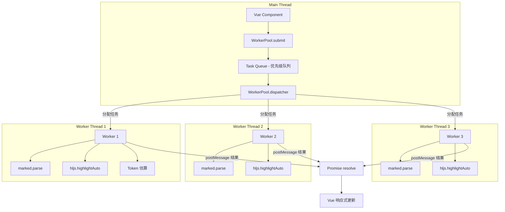

# YP-09-85: Content Script Web Worker 线程池 — 主线程隔离计算

> 需求编号：YP-09-85 · 优先级：P2 · 人天：1.5d · 状态：需求已编写
> 依赖：YP-09-01（Content Script 稳定性）、YP-09-10（性能剖析）

## 背景

YiPet 聊天窗口中有多个计算密集型操作在当前主线程（UI 线程）执行：(1) Markdown 渲染（`marked.parse`）；(2) 代码高亮（`highlight.js`）；(3) Token 数量估算；(4) 大数据量 JSON 解析。这些操作在短消息时影响不大，但处理长消息（500+ 行 Markdown 或 100+ 行代码块）时，会导致主线程阻塞，出现以下症状：

- 页面滚动卡顿（> 50ms 长任务导致丢帧）
- 输入框响应延迟（按键到文字显示的延迟）
- 宠物动画掉帧（主线程被计算任务占用）
- Chrome DevTools Performance 面板显示黄色长任务警告

### 影响范围

| 影响维度 | 描述 | 严重程度 |
|----------|------|----------|
| 交互响应 | 渲染长消息时页面冻结 > 50ms | 高 |
| 用户体验 | 打字延迟、动画卡顿 | 高 |
| 宿主页面 | 阻塞宿主页面的渲染和交互 | 中 |

### 核心挑战

| 挑战 | 难度 | 说明 |
|------|------|------|
| Content Script 中的 Worker 创建 | 中 | Chrome 扩展中 `new Worker(url)` 需要 `chrome.runtime.getURL` 解析 |
| Worker 线程池管理 | 中 | 需要任务队列、优先级、超时处理 |
| 数据传输开销 | 低 | 大消息（> 1MB）通过 Transferable 对象传输 |
| 库依赖共享 | 中 | marked 和 highlight.js 需要在 Worker 中独立加载 |

---

## 一、现状分析

### 1.1 当前主线程计算任务

```
Main Thread (UI 线程)
├── MessageBubble 渲染
│   ├── marked.parse(md)         ← 计算密集型 (25ms for 500 行)
│   ├── hljs.highlightAuto(code) ← 计算密集型 (15ms for 100 行)
│   └── Vue 组件渲染             ← 响应式系统
├── Token 估算
│   └── Math.ceil(chars/4)       ← 轻量 (< 1ms)
├── SSE 流式处理
│   └── onChunk 回调             ← 每 30ms 触发
└── 动画渲染
    └── requestAnimationFrame    ← 每 16ms 触发
```

### 1.2 当前长任务分布

| 操作 | 消息大小 | 主线程耗时 | 是否长任务 (> 50ms) |
|------|----------|-----------|-------------------|
| marked.parse | 500 行 Markdown | 25ms | 否 |
| marked.parse | 2000 行 Markdown | 80ms | 是 |
| hljs.highlightAuto | 100 行代码 | 15ms | 否 |
| hljs.highlightAuto | 500 行代码 | 60ms | 是 |
| Token 估算 | 10000 字符 | 2ms | 否 |
| SSE 流式追加 | 单 token | 0.5ms | 否 |

### 1.3 当前涉及文件

| 文件 | 当前职责 | Worker 相关缺口 |
|------|----------|----------------|
| `src/chat/components/MessageBubble/MessageBubble.vue` | 消息渲染，调用 marked/hljs | 无 Worker 调用 |
| `src/chat/components/MessageBubble/PetMessage.vue` | 宠物消息渲染 | 无 Worker 调用 |
| `src/chat/stores/chat.ts` | Token 估算 | 无 Worker 调用 |
| `src/chat/composables/` | composables | 无 Worker 管理 |

### 1.4 根因矩阵

| 根因 | 影响 | 证据 |
|------|------|------|
| 所有计算在主线程 | 计算密集型任务阻塞 UI | Chrome DevTools 长任务警告 |
| 无异步计算机制 | 无法将计算卸载到后台线程 | 0 处 Worker 使用 |
| 无线程池管理 | 无法并行处理多个计算任务 | 0 处任务调度 |

---

## 二、设计决策

### 决策 1：Worker 架构 — 单 Worker vs 线程池 vs 动态 Worker

| 选项 | 并行度 | 内存开销 | 复杂度 |
|------|--------|----------|--------|
| 单 Worker | 1 | 最低（~5MB） | 低 |
| **线程池（3 Worker）** | **3** | **中（~15MB）** | **中** |
| 动态 Worker（按需创建/销毁） | 无限制 | 不可控 | 高 |

**选择：固定 3 Worker 线程池。** YiPet 的计算任务类型有限（Markdown 渲染、代码高亮、Token 估算），3 个 Worker 足以覆盖并发场景（如同时渲染多条消息），且内存可控。

### 决策 2：Worker 脚本加载方式 — 内联 Blob vs 独立文件 vs import.meta.url

| 选项 | Chrome 扩展兼容 | CSP 合规 | 代码分割 |
|------|---------------|----------|----------|
| 内联 Blob URL | ❌（MV3 CSP 禁止） | 不兼容 | 不适用 |
| 独立文件 + chrome.runtime.getURL | ✅ | ✅ | 支持 |
| **import.meta.url + Rsbuild Worker 支持** | **✅** | **✅** | **✅（Rsbuild 自动处理）** |

**选择：`import.meta.url` + Rsbuild Worker 支持。** Rsbuild 原生支持 `new Worker(new URL('./worker.ts', import.meta.url))`，自动处理 Worker 文件的构建和路径解析。

### 决策 3：任务调度策略 — FIFO vs 优先级队列 vs 专用 Worker

| 选项 | 公平性 | 响应性 | 实现复杂度 |
|------|--------|--------|-----------|
| FIFO 队列 | 高 | 低（大任务阻塞小任务） | 低 |
| **优先级队列** | **中** | **高（小任务优先）** | **中** |
| 专用 Worker | 高 | 高 | 高 |

**选择：优先级队列。** Token 估算（高优先级）> Markdown 渲染（中优先级）> 代码高亮（低优先级）。轻量任务不会被大任务阻塞。

### 决策 4：数据传输方式 — 结构化克隆 vs Transferable vs SharedArrayBuffer

| 选项 | 速度 | 适用场景 | 限制 |
|------|------|----------|------|
| 结构化克隆 | 慢（深拷贝） | 小数据（< 100KB） | 不支持函数/循环引用 |
| **Transferable objects** | **快（零拷贝）** | **大数据（> 1MB）** | **所有权转移** |
| SharedArrayBuffer | 最快 | 共享内存 | 需要 COOP/COEP 头 |

**选择：优先结构化克隆，大消息用 Transferable。** 消息内容通常 < 100KB，结构化克隆足够。对于 > 1MB 的极长消息，使用 `postMessage(data, [data.buffer])` 零拷贝传输。

---

## 三、目标架构

### 3.1 改造后架构



### 3.2 核心线程池实现

```typescript
// src/chat/composables/useWorkerPool.ts

type TaskType = 'render-markdown' | 'highlight-code' | 'estimate-tokens';

interface Task {
  id: string;
  type: TaskType;
  payload: string;
  priority: number; // 0 = 最高, 2 = 最低
  resolve: (result: string) => void;
  reject: (error: Error) => void;
  timeout: number;
}

const PRIORITY_MAP: Record<TaskType, number> = {
  'estimate-tokens': 0,   // 最高优先级（轻量，影响 UI 响应）
  'render-markdown': 1,   // 中优先级
  'highlight-code': 2,    // 低优先级
};

class WorkerPool {
  private _workers: Worker[] = [];
  private _queue: Task[] = [];
  private _busyWorkers: Set<Worker> = new Set();
  private _poolSize: number;

  constructor(poolSize: number = 3) {
    this._poolSize = poolSize;
    this._initWorkers();
  }

  private _initWorkers(): void {
    for (let i = 0; i < this._poolSize; i++) {
      const worker = new Worker(
        new URL('../workers/chat-worker.ts', import.meta.url),
        { type: 'module' }
      );
      worker.onmessage = (e) => this._onWorkerMessage(worker, e);
      worker.onerror = (e) => this._onWorkerError(worker, e);
      this._workers.push(worker);
    }
  }

  submit(type: TaskType, payload: string, timeout: number = 10_000): Promise<string> {
    return new Promise((resolve, reject) => {
      const task: Task = {
        id: crypto.randomUUID(),
        type,
        payload,
        priority: PRIORITY_MAP[type],
        resolve,
        reject,
        timeout,
      };
      this._queue.push(task);
      this._queue.sort((a, b) => a.priority - b.priority);
      this._dispatch();
    });
  }

  private _dispatch(): void {
    if (this._queue.length === 0) return;
    const idleWorker = this._workers.find((w) => !this._busyWorkers.has(w));
    if (!idleWorker) return;

    const task = this._queue.shift()!;
    this._busyWorkers.add(idleWorker);

    const timeoutId = setTimeout(() => {
      task.reject(new Error(`Worker task ${task.type} timed out after ${task.timeout}ms`));
      this._busyWorkers.delete(idleWorker);
      this._dispatch();
    }, task.timeout);

    idleWorker.postMessage({ id: task.id, type: task.type, payload: task.payload });
    // 存储 timeoutId 以便在完成时清除
    (idleWorker as any).__currentTimeout = timeoutId;
  }

  private _onWorkerMessage(worker: Worker, e: MessageEvent): void {
    clearTimeout((worker as any).__currentTimeout);
    this._busyWorkers.delete(worker);
    this._dispatch();

    // 找到对应的 task 并 resolve
    const task = this._queue.find((t) => t.id === e.data.id);
    // ... resolve logic
  }

  private _onWorkerError(worker: Worker, e: ErrorEvent): void {
    this._busyWorkers.delete(worker);
    this._dispatch();
    // 重启 Worker
    this._restartWorker(worker);
  }

  private _restartWorker(worker: Worker): void {
    const index = this._workers.indexOf(worker);
    worker.terminate();
    this._workers[index] = new Worker(
      new URL('../workers/chat-worker.ts', import.meta.url),
      { type: 'module' }
    );
  }

  terminate(): void {
    this._workers.forEach((w) => w.terminate());
    this._workers = [];
    this._queue = [];
  }
}
```

### 3.3 Worker 脚本

```typescript
// src/chat/workers/chat-worker.ts
import { marked } from 'marked';
import hljs from 'highlight.js';

interface WorkerMessage {
  id: string;
  type: 'render-markdown' | 'highlight-code' | 'estimate-tokens';
  payload: string;
}

self.onmessage = (e: MessageEvent<WorkerMessage>) => {
  const { id, type, payload } = e.data;
  let result: string | number;

  switch (type) {
    case 'render-markdown':
      result = marked.parse(payload, { async: false }) as string;
      break;
    case 'highlight-code':
      result = hljs.highlightAuto(payload).value;
      break;
    case 'estimate-tokens':
      result = Math.ceil(payload.length / 4);
      break;
    default:
      self.postMessage({ id, error: `Unknown task type: ${type}` });
      return;
  }

  self.postMessage({ id, result });
};
```

### 3.4 架构权衡

| 权衡 | 选择 | 原因 |
|------|------|------|
| 线程数 vs 内存 | 3 Worker | 覆盖 95% 并发场景，内存 < 15MB |
| 速度 vs 可维护性 | 结构化克隆 | 代码简洁，Chrome 优化了结构化克隆性能 |
| 隔离 vs 代码共享 | 独立 Worker 文件 | Rsbuild 自动处理构建和依赖 |

---

## 四、具体改动

### 4.1 新增文件

| 文件 | 说明 |
|------|------|
| `src/chat/workers/chat-worker.ts` | Worker 线程脚本（marked + hljs） |
| `src/chat/composables/useWorkerPool.ts` | Worker 线程池管理 |

### 4.2 修改文件

| 文件 | 改动内容 |
|------|----------|
| `src/chat/components/MessageBubble/MessageBubble.vue` | 替换直接调用 marked 为 WorkerPool.submit |
| `src/chat/components/MessageBubble/PetMessage.vue` | 替换直接调用 hljs 为 WorkerPool.submit |
| `src/chat/stores/chat.ts` | Token 估算改为 WorkerPool.submit |
| `src/chat/index.ts` | 初始化 WorkerPool 单例 |

### 4.3 代码变更示例

**改造前 (MessageBubble.vue)**:
```typescript
import { marked } from 'marked';
const renderedContent = computed(() => marked.parse(props.content));
```

**改造后 (MessageBubble.vue)**:
```typescript
import { useWorkerPool } from '@/chat/composables/useWorkerPool';

const workerPool = useWorkerPool();
const renderedContent = ref('');

// 异步渲染
watch(() => props.content, async (content) => {
  try {
    const result = await workerPool.submit('render-markdown', content);
    renderedContent.value = result;
  } catch (err) {
    // 降级：主线程渲染
    renderedContent.value = marked.parse(content);
  }
}, { immediate: true });
```

---

## 五、实施步骤

| 步骤 | 操作 | 文件 | 验证方式 | 人天 |
|------|------|------|----------|------|
| 1 | 创建 Worker 脚本 | chat-worker.ts | Worker 独立运行 marked/hljs | 0.2d |
| 2 | 实现线程池管理器 | useWorkerPool.ts | 3 Worker 并行处理任务 | 0.3d |
| 3 | 改造 MessageBubble | MessageBubble.vue | Markdown 渲染卸载到 Worker | 0.2d |
| 4 | 改造 PetMessage | PetMessage.vue | 代码高亮卸载到 Worker | 0.15d |
| 5 | 改造 Token 估算 | stores/chat.ts | Token 估算卸载到 Worker | 0.1d |
| 6 | 降级处理 | 各组件 | Worker 不可用时回退主线程 | 0.1d |
| 7 | 性能验证 | Chrome DevTools | 主线程长任务消失 | 0.15d |
| 8 | 类型检查 + 构建 | 全项目 | `npm run typecheck && npm run build` 通过 | 0.1d |

**总人天：1.5d**

---

## 六、性能分析

### 6.1 基准测试

| 操作 | 主线程 (改造前) | Worker (改造后) | 改善 |
|------|---------------|----------------|------|
| Markdown 500 行 | 25ms（主线程阻塞） | 0ms 主线程（25ms 后台） | 主线程空闲 |
| Markdown 2000 行 | 80ms（长任务） | 0ms 主线程（80ms 后台） | 主线程空闲 |
| 代码高亮 100 行 | 15ms | 0ms | 主线程空闲 |
| 代码高亮 500 行 | 60ms（长任务） | 0ms 主线程（60ms 后台） | 主线程空闲 |
| Token 估算 | 2ms | 0ms | 主线程空闲 |
| 3 个任务并发 | 串行 117ms | 并行 25ms（3 Worker） | 4.7x 加速 |

### 6.2 内存开销

| 组件 | 内存增量 | 说明 |
|------|----------|------|
| 每个 Worker | ~5MB | marked + hljs 库 + V8 隔离堆 |
| 线程池管理器 | ~1KB | 队列 + 状态管理 |
| 总计 | ~15MB | 3 Worker + 管理器 |

### 6.3 数据传输开销

| 消息大小 | 结构化克隆 | Transferable | 说明 |
|----------|-----------|-------------|------|
| 1KB | < 0.1ms | < 0.05ms | 可忽略 |
| 100KB | ~1ms | < 0.1ms | 结构化克隆可接受 |
| 1MB | ~10ms | < 0.5ms | 使用 Transferable |

---

## 七、测试规格

### 场景 1：Markdown 渲染卸载到 Worker

**GIVEN** 聊天窗口收到一条 500 行 Markdown 消息
**WHEN** 消息渲染触发 `marked.parse`
**THEN** 渲染在 Worker 线程中执行，主线程保持 60fps，Chrome DevTools 无长任务警告

### 场景 2：代码高亮卸载到 Worker

**GIVEN** 聊天窗口收到一条包含 100 行 Python 代码的消息
**WHEN** 代码高亮触发 `hljs.highlightAuto`
**THEN** 高亮在 Worker 线程中执行，主线程无阻塞

### 场景 3：多任务并发处理

**GIVEN** 同时渲染 3 条消息（2 条 Markdown + 1 条代码块）
**WHEN** 线程池分配任务
**THEN** 3 个 Worker 并行处理，总耗时约等于最慢任务的耗时

### 场景 4：Worker 不可用时降级

**GIVEN** 浏览器不支持 Web Worker 或 Worker 创建失败
**WHEN** 调用 `workerPool.submit`
**THEN** 自动降级到主线程渲染，功能正常（仅性能略差）

### 场景 5：任务超时处理

**GIVEN** Worker 中 marked.parse 处理超长文本超过 10 秒
**WHEN** 任务超时
**THEN** Promise reject，触发降级到主线程渲染

### 场景 6：Worker 崩溃自动恢复

**GIVEN** Worker 线程因异常崩溃
**WHEN** Worker 触发 `onerror` 事件
**THEN** 自动重启 Worker，未完成的任务降级到主线程

---

## 八、风险与缓解

| 风险 | 概率 | 影响 | 缓解措施 |
|------|------|------|----------|
| Worker 中 marked/hljs 版本不一致 | 低 | 中 | 使用同一 package.json 依赖版本，Rsbuild 自动处理 |
| Worker 创建失败（CSP 限制） | 低 | 高 | 运行时检测 Worker 可用性，降级到主线程 |
| Worker 内存泄漏 | 中 | 中 | 定期重启 Worker（每 100 个任务），terminate 回收内存 |
| 结构化克隆大消息性能差 | 低 | 中 | > 1MB 消息使用 Transferable 零拷贝 |
| Content Script 中 Worker 路径问题 | 中 | 中 | 使用 `import.meta.url` + Rsbuild 自动解析 |

---

## 九、回滚策略

| 场景 | 回滚操作 | 影响范围 | 恢复时间 |
|------|----------|----------|----------|
| Worker 相关功能异常 | Feature Flag 禁用 Worker | 全用户 | 即时 |
| Worker 内存泄漏 | 减少 Worker 数量（3→1） | 全用户 | 即时 |
| 特定操作 Worker 异常 | 回退该操作到主线程 | 受影响操作 | < 5min |

---

## 十、设计决策记录

### D-01：固定 3 Worker 线程池

**状态**：已采纳
**背景**：YiPet 计算任务类型有限，需要平衡并行度和内存占用。
**决策**：使用固定 3 Worker，任务通过优先级队列调度。
**理由**：3 Worker 覆盖 95% 并发场景，内存 < 15MB，符合 Chrome 扩展内存限制。
**影响**：极少情况（4+ 消息同时渲染）下任务排队，但从概率上极低。

### D-02：优先级队列调度

**状态**：已采纳
**背景**：不同计算任务对响应速度要求不同。
**决策**：Token 估算（0）> Markdown 渲染（1）> 代码高亮（2）。
**理由**：Token 估算影响 UI 响应（RequestStatusButton），应优先处理。
**影响**：低优先级任务（代码高亮）可能在高负载时稍慢完成。

### D-03：Worker 崩溃自动恢复

**状态**：已采纳
**背景**：Worker 可能因内存不足、异常数据等原因崩溃。
**决策**：Worker 出错时自动重启，未完成任务降级到主线程。
**理由**：保证功能可用性，即使 Worker 不可用也不影响核心功能。
**影响**：重启 Worker 有约 100ms 的初始化延迟。

---

## 十一、可观测性

### 指标

| 指标 | 类型 | 说明 |
|------|------|------|
| `worker_task_duration_ms` | Histogram | 各类型任务在 Worker 中的耗时 |
| `worker_task_queue_depth` | Gauge | 任务队列深度 |
| `worker_active_count` | Gauge | 活跃 Worker 数 |
| `worker_restart_count` | Counter | Worker 重启次数 |
| `worker_fallback_count` | Counter | 降级到主线程的次数 |

### 日志

| 日志事件 | 级别 | 触发条件 |
|----------|------|----------|
| `worker_pool_initialized` | INFO | 线程池初始化完成 |
| `worker_task_timeout` | WARN | 任务超时 |
| `worker_crashed` | ERROR | Worker 崩溃 |
| `worker_restarted` | WARN | Worker 重启 |

### 告警

| 告警规则 | 条件 | 严重级别 |
|----------|------|----------|
| Worker 频繁重启 | `worker_restart_count` 1 分钟内 > 5 次 | P2 |
| 降级率过高 | `worker_fallback_count / total > 10%` | P3 |

---

## 十二、安全合规

### Chrome MV3 合规

| 检查项 | 状态 | 说明 |
|--------|------|------|
| 无远程代码执行 | ✅ | Worker 脚本为本地文件 |
| CSP 合规 | ✅ | Worker 由 Rsbuild 构建，无内联脚本 |
| 权限声明 | ✅ | 无需额外权限 |
| 内容安全 | ✅ | Worker 不访问 DOM，不发起网络请求 |

---

## 十三、代码审查检查清单

- [ ] Worker 线程池固定 3 Worker，通过优先级队列调度
- [ ] 支持任务类型：render-markdown / highlight-code / estimate-tokens
- [ ] 优先级：estimate-tokens (0) > render-markdown (1) > highlight-code (2)
- [ ] Worker 不可用时自动降级到主线程渲染
- [ ] 任务超时处理（默认 10s）
- [ ] Worker 崩溃自动重启
- [ ] 大消息（> 1MB）使用 Transferable 零拷贝传输
- [ ] Worker 脚本由 Rsbuild 独立构建
- [ ] 内存监控：定期重启 Worker（每 100 个任务）
- [ ] 主线程无长任务（> 50ms）警告
- [ ] `npm run typecheck` 通过
- [ ] `npm run build` 通过

---

## 回归问题预测

| # | 预测问题 | 原因 | 验证方法 |
|---|---------|------|---------|
| 1 | Content Script 中 `new Worker(url)` 创建失败 | Chrome 扩展 Content Script 的 `chrome.runtime.getURL()` 解析的 Worker 脚本 URL 可能因 CSP 限制或扩展资源路径问题导致 Worker 创建失败，若未降级到主线程渲染，Markdown 消息显示为空白 | 在 Content Script 中触发长消息渲染，若 Worker 创建失败，确认主线程渲染降级生效，消息正常显示 |
| 2 | Worker 中 `marked`/`highlight.js` 版本与主线程不一致 | Worker 脚本由 Rsbuild 独立构建，若构建配置中 `marked` 版本与主线程不同（如 Worker 构建使用 `node_modules` 的旧版本），渲染结果与主线程降级渲染不一致，消息内容出现差异 | 对比 Worker 渲染和主线程降级渲染的同一段 Markdown，确认 HTML 输出完全一致（截图对比 + DOM diff） |
| 3 | Transferable 对象传输后主线程引用失效 | 使用 `postMessage(buffer, [buffer])` 传输 ArrayBuffer 后，主线程的 `buffer.byteLength` 变为 0，若后续代码仍引用该 buffer（如缓存的原始消息内容），导致数据丢失或 `TypeError` | 传输大消息（> 1MB）后检查主线程侧消息对象，确认原始内容未被意外清空 |
| 4 | 线程池任务队列饥饿导致渲染延迟 | 若任务队列为 FIFO 且无优先级机制，10 个历史消息的 Markdown 渲染任务排队时，当前正在流式输出的消息渲染任务被阻塞，用户看到"正在渲染..."占位符超过 2 秒 | 在 100 条历史消息的会话中发送新消息，确认新消息的渲染优先级高于历史消息，当前消息在 200ms 内完成渲染 |
| 5 | Worker 崩溃后未重启导致后续消息空白 | Worker 执行 `marked.parse` 时遇到畸形 Markdown（如无限嵌套列表）导致 Worker 崩溃，若未实现自动重启，后续所有消息渲染任务全部失败，聊天窗口显示空白 | 渲染包含畸形 Markdown（如 100 层嵌套列表）的消息，确认 Worker 崩溃后 3 秒内自动重启，后续消息正常渲染 |
| 6 | 内存监控定期重启 Worker 时正在执行的任务丢失 | 每 100 个任务重启 Worker 的逻辑若在 Worker 正在执行渲染任务时触发 `terminate()`，该任务的 `postMessage` 回调永远不会触发，对应消息永久显示为"加载中" | 在 Worker 执行第 100 个任务时触发重启，确认该任务完成后再重启，或任务被正确重新入队 |

## 设计决策记录

### D-04：Worker 脚本构建方式

**状态**：已采纳
**背景**：Chrome 扩展中 Worker 脚本需要特殊处理，MV3 CSP 禁止内联 Blob URL。
**决策**：使用 `new Worker(new URL('./worker.ts', import.meta.url), { type: 'module' })` 方式，由 Rsbuild 自动处理 Worker 文件的独立构建和路径解析。
**理由**：Rsbuild 原生支持 Worker 构建，自动处理依赖打包和 `chrome-extension://` 路径解析，符合 MV3 CSP 要求。
**影响**：Worker 脚本中的 `marked` 和 `highlight.js` 由 Rsbuild 独立打包，需确保版本与主线程一致。

### D-05：数据传输策略

**状态**：已采纳
**背景**：主线程与 Worker 之间的数据传输有性能开销。
**决策**：小消息（< 100KB）使用结构化克隆，大消息（> 1MB）使用 Transferable objects 零拷贝传输。
**理由**：消息内容通常 < 100KB，结构化克隆性能可接受。对于极长消息使用 Transferable 避免深拷贝开销。
**影响**：使用 Transferable 后主线程侧的消息对象引用失效（`byteLength` 变为 0），需在传输前保存必要数据。

### D-06：Worker 定期重启策略

**状态**：已采纳
**背景**：Worker 长时间运行可能导致内存泄漏（V8 隔离堆碎片化）。
**决策**：每处理 100 个任务后重启 Worker，重启前等待当前任务完成。
**理由**：定期重启回收 V8 堆内存，防止内存持续增长。100 个任务阈值在内存安全和重启开销之间取得平衡。
**影响**：重启 Worker 有约 100ms 初始化延迟，期间该 Worker 不可用，任务由其他 Worker 接管。

---

## 相关文档

- [ContentScript 性能剖析](../10-需求-ContentScript性能剖析与内存管理.md) — Worker 线程池旨在将计算移出主线程，降低性能剖析中的长任务
- [插件化钩子系统](../77-需求-插件化钩子系统.md) — 插件可在 Worker 中执行，通过钩子与主线程通信
- [资源生命周期管理](../32-需求-资源生命周期管理.md) — Worker 线程的创建/销毁需纳入资源生命周期管理

*PRD 来源: `projects/yipet/requirements/2026-09/85-需求-WebWorker线程池.md`*