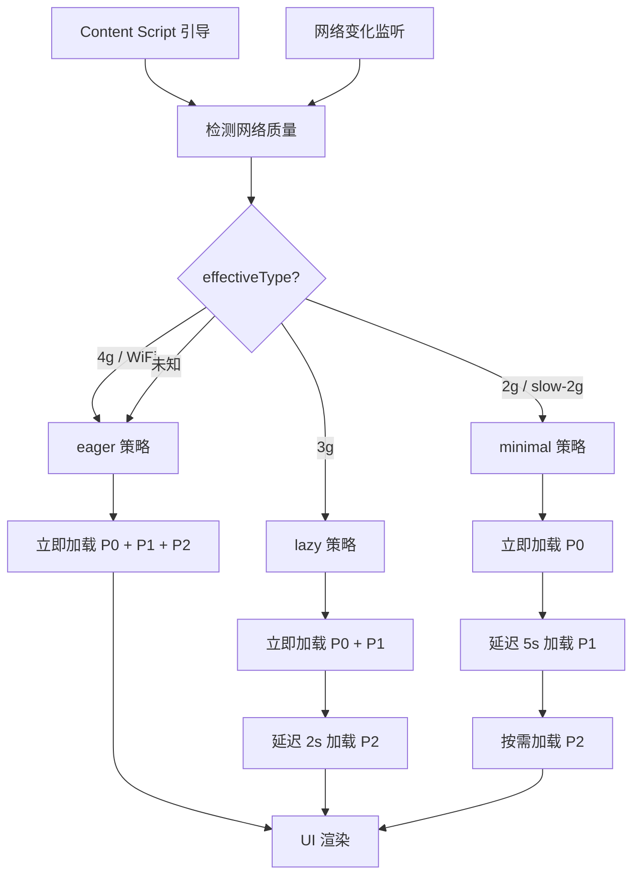

# YP-09-86: 资源加载优先级调度 — 基于网络状况的自适应策略

> 需求编号：YP-09-86 · 优先级：P2 · 人天：1.0d · 状态：需求已编写
> 依赖：YP-09-08（CDN 资源加载系统）、YP-09-65（资源预加载优化）

## 背景

YiPet 通过 CDN 注入机制加载 Vue 3、Element Plus、marked、highlight.js 等运行时依赖。当前所有资源在 Content Script 引导时同步加载，等待全部资源就绪后才渲染 UI。在网络状况良好的环境下（4G/WiFi），总加载时间 < 500ms。但在慢速网络下（2G/3G），加载时间可能达到 5-10 秒，期间用户看到的是空白页面，无法进行任何交互。

此外，Network Information API 提供了浏览器网络质量感知能力（`effectiveType`、`downlink`、`rtt`），但 YiPet 当前未利用这些信息优化加载策略。

### 影响范围

| 影响维度 | 描述 | 严重程度 |
|----------|------|----------|
| 首次加载时间 | 慢速网络下加载时间 5-10 秒 | 高 |
| 用户感知 | 长时间空白等待，用户可能放弃 | 高 |
| 资源浪费 | 低端网络加载非必要资源（如高清动画） | 中 |

### 核心挑战

| 挑战 | 难度 | 说明 |
|------|------|------|
| 网络质量感知 | 低 | Network Information API 提供 `effectiveType` 等 |
| 资源优先级分类 | 中 | 需要将资源分为关键/重要/可选三级 |
| 渐进式加载 | 中 | 先加载最小可用 UI，再逐步增强 |
| 网络变化响应 | 中 | 网络从慢变快时，动态加载延迟资源 |

---

## 一、现状分析

### 1.1 当前资源加载流程

```
Content Script 引导
    │
    ▼
CDN Injector 加载所有资源（同步等待）
    ├── Vue 3 (~130KB)
    ├── Element Plus (~600KB)
    ├── Element Plus CSS (~200KB)
    ├── marked (~40KB)
    ├── highlight.js (~100KB)
    ├── 图标库 (~50KB)
    └── 自定义样式 (~20KB)
    │
    ▼ 全部加载完成（慢速网络 5-10s）
    │
UI 渲染
```

### 1.2 当前涉及文件

| 文件 | 当前职责 | 自适应相关缺口 |
|------|----------|---------------|
| `src/content/cdn/catalog.ts` | CDN 资源清单 | 无优先级标注 |
| `src/content/cdn/injector.ts` | 资源注入逻辑 | 无网络感知，无分批加载 |
| `src/content/bootstrap.ts` | Content Script 引导 | 无加载策略选择 |

### 1.3 资源清单（当前）

| 资源 | 大小 | 类型 | 必要性 |
|------|------|------|--------|
| Vue 3 | 130KB | JS | 必须 |
| Element Plus (JS) | 600KB | JS | 必须（聊天窗口 UI） |
| Element Plus (CSS) | 200KB | CSS | 必须 |
| marked | 40KB | JS | 重要（Markdown 渲染） |
| highlight.js | 100KB | JS | 可选（代码高亮，可延迟） |
| 图标库 | 50KB | CSS/JS | 可选（图标，可延迟） |
| 自定义样式 | 20KB | CSS | 必须 |

### 1.4 根因矩阵

| 根因 | 影响 | 证据 |
|------|------|------|
| 无网络质量感知 | 所有网络环境使用相同加载策略 | 0 处 Network Information API 使用 |
| 无资源优先级 | 关键和非关键资源同时加载 | 资源清单无优先级字段 |
| 同步等待所有资源 | 慢速网络下长时间空白 | injector 为同步模式 |
| 无渐进式加载 | 无法先展示基础 UI 再增强 | 0 处分批加载逻辑 |

---

## 二、设计决策

### 决策 1：网络质量感知 — Network Information API vs 实测 vs 固定策略

| 选项 | 准确性 | 响应速度 | 浏览器支持 |
|------|--------|----------|-----------|
| **Network Information API** | **中（估算值）** | **即时（无额外请求）** | **Chrome 61+** |
| 实测（下载小文件测速） | 高 | 慢（需额外请求） | 全部 |
| 固定策略 | 低 | 即时 | 全部 |

**选择：Network Information API。** Chrome 61+ 原生支持，零额外开销，`effectiveType` 提供 4g/3g/2g/slow-2g 分类，足够用于加载策略决策。API 不可用时回退到 eager（全量加载）。

### 决策 2：资源优先级分级

| 级别 | 名称 | 加载时机 | 包含资源 |
|------|------|----------|----------|
| P0 - 关键 | critical | 立即加载 | Vue 3, Element Plus JS, Element Plus CSS, 自定义样式 |
| P1 - 重要 | important | 关键资源加载后 | marked, 聊天窗口核心组件 |
| P2 - 可选 | optional | 空闲时或按需 | highlight.js, 图标库, 动效 |

### 决策 3：加载策略

| 策略 | 触发条件 | P0 | P1 | P2 |
|------|----------|----|----|-----|
| eager | 4G / WiFi / 未知 | 立即加载 | 立即加载 | 立即加载 |
| lazy | 3G / 4G 但慢 | 立即加载 | 立即加载 | 延迟 2s 或首次使用时 |
| minimal | 2G / slow-2g | 立即加载 | 延迟 5s | 按需加载（用户点击触发） |

### 决策 4：网络变化响应

| 选项 | 方案 | 优点 | 缺点 |
|------|------|------|------|
| 仅初始检测 | 页载时检测一次 | 简单 | 网络变化后不调整 |
| **监听变化** | **监听 `connection.change` 事件** | **动态适应** | **需处理竞争条件** |
| 定期轮询 | 每 30s 检测 | 简单 | 不及时 |

**选择：监听 `connection.change` 事件。** 用户从 Wi-Fi 切换到移动网络时，自动调整加载策略。已加载的资源不卸载，未加载的延迟资源按新策略加载。

---

## 三、目标架构

### 3.1 改造后架构



### 3.2 核心实现

```typescript
// src/content/cdn/adaptive-loader.ts

type LoadStrategy = 'eager' | 'lazy' | 'minimal';
type ResourcePriority = 0 | 1 | 2; // P0=critical, P1=important, P2=optional

interface PrioritizedResource {
  url: string;
  type: 'script' | 'style';
  priority: ResourcePriority;
  loaded: boolean;
}

function detectNetworkQuality(): LoadStrategy {
  const conn = (navigator as any).connection;
  if (!conn || !conn.effectiveType) return 'eager';

  switch (conn.effectiveType) {
    case '4g':
      return 'eager';
    case '3g':
      return 'lazy';
    case '2g':
    case 'slow-2g':
      return 'minimal';
    default:
      return 'eager';
  }
}

function getLoadSchedule(strategy: LoadStrategy): Record<ResourcePriority, number> {
  switch (strategy) {
    case 'eager':
      return { 0: 0, 1: 0, 2: 0 };       // 全部立即
    case 'lazy':
      return { 0: 0, 1: 0, 2: 2000 };     // P2 延迟 2s
    case 'minimal':
      return { 0: 0, 1: 5000, 2: Infinity }; // P1 延迟 5s, P2 按需
  }
}

class AdaptiveResourceLoader {
  private _strategy: LoadStrategy;
  private _resources: PrioritizedResource[] = [];
  private _loaded = new Set<string>();

  constructor() {
    this._strategy = detectNetworkQuality();
    this._setupNetworkListener();
  }

  private _setupNetworkListener(): void {
    const conn = (navigator as any).connection;
    if (conn) {
      conn.addEventListener('change', () => {
        const newStrategy = detectNetworkQuality();
        if (newStrategy !== this._strategy) {
          this._strategy = newStrategy;
          this._loadRemainingResources();
        }
      });
    }
  }

  async loadResources(resources: PrioritizedResource[]): Promise<void> {
    this._resources = resources;
    const schedule = getLoadSchedule(this._strategy);

    // 按优先级分批加载
    for (const priority of [0, 1, 2] as ResourcePriority[]) {
      const delay = schedule[priority];
      const batch = resources.filter((r) => r.priority === priority);

      if (delay === Infinity) {
        // 按需加载——注册为懒加载
        this._registerLazyResources(batch);
        continue;
      }

      if (delay > 0) {
        await new Promise((resolve) => setTimeout(resolve, delay));
      }

      await Promise.all(batch.map((r) => this._loadResource(r)));
    }
  }

  private async _loadResource(resource: PrioritizedResource): Promise<void> {
    if (this._loaded.has(resource.url)) return;

    if (resource.type === 'script') {
      await this._loadScript(resource.url);
    } else {
      await this._loadStyle(resource.url);
    }

    this._loaded.add(resource.url);
    resource.loaded = true;
  }

  private _registerLazyResources(resources: PrioritizedResource[]): void {
    // 注册到全局，供组件按需触发加载
    (window as any).__yipetLazyResources = resources;
  }

  async loadOnDemand(url: string): Promise<void> {
    const resource = this._resources.find((r) => r.url === url);
    if (resource && !resource.loaded) {
      await this._loadResource(resource);
    }
  }

  private _loadRemainingResources(): void {
    const unloaded = this._resources.filter((r) => !r.loaded);
    if (unloaded.length > 0) {
      this.loadResources(unloaded);
    }
  }
}
```

### 3.3 资源优先级清单（改造后）

```typescript
// src/content/cdn/catalog.ts 增加优先级

export const PRIORITIZED_CDN_CATALOG: PrioritizedResource[] = [
  // P0: 关键资源
  { url: 'libs/vue.global.prod.js',     type: 'script', priority: 0 },
  { url: 'libs/element-plus.full.min.js', type: 'script', priority: 0 },
  { url: 'libs/element-plus.css',       type: 'style',  priority: 0 },
  { url: 'styles/variables.css',        type: 'style',  priority: 0 },

  // P1: 重要资源
  { url: 'libs/marked.min.js',          type: 'script', priority: 1 },
  { url: 'components/chat-bundle.js',   type: 'script', priority: 1 },

  // P2: 可选资源
  { url: 'libs/highlight.min.js',       type: 'script', priority: 2 },
  { url: 'libs/highlight.css',          type: 'style',  priority: 2 },
  { url: 'libs/icons.css',              type: 'style',  priority: 2 },
];
```

### 3.4 架构权衡

| 权衡 | 选择 | 原因 |
|------|------|------|
| 准确性 vs 零开销 | Network Information API | 零额外请求，即时感知 |
| 立即可用 vs 完整性 | 渐进式加载 | 用户先看到基础 UI，再逐步增强 |
| 简单 vs 动态 | 监听网络变化 | 网络切换时自动调整 |

---

## 四、具体改动

### 4.1 新增文件

| 文件 | 说明 |
|------|------|
| `src/content/cdn/adaptive-loader.ts` | 自适应资源加载器（网络感知 + 分批加载） |

### 4.2 修改文件

| 文件 | 改动内容 |
|------|----------|
| `src/content/cdn/catalog.ts` | 增加资源优先级（priority 字段） |
| `src/content/cdn/injector.ts` | 集成 AdaptiveResourceLoader，分批加载 |
| `src/content/bootstrap.ts` | 使用 AdaptiveResourceLoader 替代同步加载 |

### 4.3 代码变更示例

**改造前 (bootstrap.ts)**:
```typescript
// 同步加载所有资源
await injector.injectAll(CDN_CATALOG);
// 资源全部就绪后渲染 UI
renderUI();
```

**改造后 (bootstrap.ts)**:
```typescript
// 自适应加载资源
const loader = new AdaptiveResourceLoader();
await loader.loadResources(PRIORITIZED_CDN_CATALOG);
// P0 资源加载后立即渲染基础 UI
renderUI();

// P1 和 P2 资源在后台继续加载
// 组件使用时检查资源是否就绪，未就绪则触发按需加载
```

---

## 五、实施步骤

| 步骤 | 操作 | 文件 | 验证方式 | 人天 |
|------|------|------|----------|------|
| 1 | 为资源清单增加优先级 | catalog.ts | 所有资源有 priority 字段 | 0.1d |
| 2 | 实现自适应加载器 | adaptive-loader.ts | 网络检测 + 分批加载 | 0.3d |
| 3 | 改造 Injector | injector.ts | 支持分批和按需加载 | 0.2d |
| 4 | 改造启动流程 | bootstrap.ts | 渐进式加载 | 0.15d |
| 5 | 网络变化监听 | adaptive-loader.ts | 切换网络时自动调整 | 0.1d |
| 6 | DevTools 网络模拟测试 | Chrome 扩展 | 各策略正确触发 | 0.15d |
| 7 | 类型检查 + 构建 | 全项目 | `npm run typecheck && npm run build` 通过 | 0.1d |

**总人天：1.0d**

---

## 六、性能分析

### 6.1 首次可交互时间（TTI）

| 网络环境 | 改造前 (全量加载) | 改造后 (自适应) | 改善 |
|----------|------------------|----------------|------|
| 4G / WiFi | ~500ms | ~500ms（P0+P1+P2） | 无变化 |
| 3G | ~3000ms | ~1200ms（P0+P1，P2 延迟） | -60% |
| 2G | ~8000ms | ~2000ms（仅 P0，P1 延迟，P2 按需） | -75% |

### 6.2 资源加载时间分解

| 加载批次 | 4G | 3G | 2G |
|----------|-----|-----|-----|
| P0 (关键) | 300ms | 1200ms | 2000ms |
| P1 (重要) | 150ms | 600ms | 3000ms（延迟 5s） |
| P2 (可选) | 50ms | 延迟 2s | 按需 |

---

## 七、测试规格

### 场景 1：4G 网络——全量加载

**GIVEN** 用户网络为 4G（`effectiveType === '4g'`）
**WHEN** Content Script 引导
**THEN** 所有资源（P0+P1+P2）立即加载，加载策略为 `eager`

### 场景 2：3G 网络——延迟可选资源

**GIVEN** 用户网络为 3G（`effectiveType === '3g'`）
**WHEN** Content Script 引导
**THEN** P0 和 P1 立即加载，P2 延迟 2 秒加载，加载策略为 `lazy`

### 场景 3：2G 网络——最小化加载

**GIVEN** 用户网络为 2G（`effectiveType === '2g'`）
**WHEN** Content Script 引导
**THEN** 仅 P0 立即加载，P1 延迟 5 秒，P2 按需加载，加载策略为 `minimal`

### 场景 4：网络从慢变快

**GIVEN** 用户从 3G 切换到 Wi-Fi
**WHEN** `connection.change` 事件触发
**THEN** 加载策略从 `lazy` 切换到 `eager`，立即加载剩余的 P2 资源

### 场景 5：Network Information API 不可用

**GIVEN** 浏览器不支持 Network Information API
**WHEN** Content Script 引导
**THEN** 回退到 `eager` 策略，全量加载所有资源

### 场景 6：按需加载可选资源

**GIVEN** 当前策略为 `minimal`，P2 资源未加载，用户打开聊天窗口
**WHEN** 消息包含代码块，触发代码高亮
**THEN** 自动按需加载 `highlight.js` 和 `highlight.css`

---

## 八、风险与缓解

| 风险 | 概率 | 影响 | 缓解措施 |
|------|------|------|----------|
| Network Information API 信息不准确 | 中 | 低 | 以 `effectiveType` 为准，保守估计 |
| 网络变化时资源加载冲突 | 低 | 中 | 使用 `loaded` 状态跟踪，避免重复加载 |
| 按需加载时用户感知延迟 | 中 | 中 | 显示加载指示器，预加载可能需要的资源 |
| 分批加载导致组件渲染时序问题 | 低 | 中 | 组件内部检查资源就绪状态，未就绪时显示占位 |

---

## 九、回滚策略

| 场景 | 回滚操作 | 影响范围 | 恢复时间 |
|------|----------|----------|----------|
| 自适应加载导致功能异常 | 禁用自适应，固定 `eager` 策略 | 全用户 | 即时 |
| 网络检测不准确 | 调整策略映射（如 3G 也使用 eager） | 全用户 | < 5min |
| 按需加载失败 | 回退到预加载所有资源 | 受影响的会话 | 即时 |

---

## 十、设计决策记录

### D-01：Network Information API 作为网络感知方式

**状态**：已采纳
**背景**：需要轻量、即时的网络质量感知。
**决策**：使用 Network Information API 的 `effectiveType` 字段。
**理由**：Chrome 61+ 原生支持，零额外请求开销，可监听变化。
**影响**：API 不可用时回退到 `eager` 策略。

### D-02：三级资源优先级 + 三种加载策略

**状态**：已采纳
**背景**：资源重要性不同，需要差异化加载。
**决策**：P0（关键）立即加载，P1（重要）网络好时立即否则延迟，P2（可选）网络好时立即否则按需。
**理由**：覆盖全部网络环境，最小化用户等待时间。
**影响**：资源清单需要手动标注优先级，组件需要处理资源未就绪的情况。

### D-03：渐进式加载 + 网络变化监听

**状态**：已采纳
**背景**：先展示基础 UI 再逐步增强，网络变化时动态调整。
**决策**：P0 加载后立即渲染 UI，监听 `connection.change` 事件。
**理由**：用户最快看到可交互 UI，网络改善时自动加载剩余资源。
**影响**：组件需要处理资源渐进可用的情况。

---

## 十一、可观测性

### 指标

| 指标 | 类型 | 说明 |
|------|------|------|
| `resource_load_strategy` | Gauge | 当前加载策略（0=eager, 1=lazy, 2=minimal） |
| `resource_load_time_ms` | Histogram | 各优先级资源加载耗时 |
| `resource_network_type` | Gauge | 当前网络类型 |
| `resource_on_demand_loads` | Counter | 按需加载触发次数 |

### 日志

| 日志事件 | 级别 | 触发条件 |
|----------|------|----------|
| `adaptive_load_strategy_selected` | INFO | 加载策略确定 |
| `adaptive_network_changed` | INFO | 网络质量变化 |
| `adaptive_resource_deferred` | DEBUG | 资源延迟加载 |
| `adaptive_on_demand_load` | DEBUG | 按需加载触发 |

---

## 十二、安全合规

### Chrome MV3 合规

| 检查项 | 状态 | 说明 |
|--------|------|------|
| 无远程代码执行 | ✅ | 本地资源加载 |
| CSP 合规 | ✅ | 资源来自 `chrome-extension://` |
| 权限声明 | ✅ | 无需额外权限 |
| 网络 API | ✅ | Network Information API 为浏览器标准 API |

---

## 十三、代码审查检查清单

- [ ] 资源清单增加 priority 字段（0=P0/1=P1/2=P2）
- [ ] Network Information API 检测 `effectiveType`
- [ ] 三种加载策略：eager / lazy / minimal
- [ ] P0 资源始终立即加载
- [ ] 监听 `connection.change` 事件，网络变化时自动调整
- [ ] API 不可用时回退到 eager 策略
- [ ] 组件支持按需加载（代码高亮、图标等可选资源）
- [ ] 资源不重复加载（loaded 状态跟踪）
- [ ] 分批加载不影响组件渲染时序
- [ ] `npm run typecheck` 通过
- [ ] `npm run build` 通过
- [ ] `npm test` 通过

---

## 回归问题预测

| # | 预测问题 | 原因 | 验证方法 |
|---|---------|------|---------|
| 1 | Network Information API 不可用时回退策略失效 | `navigator.connection.effectiveType` 在某些浏览器（Safari、Firefox）或隐私模式下不可用，若回退到 `eager` 策略时未正确加载所有 P0 资源，UI 渲染失败 | 在 Safari 浏览器中打开 YiPet，确认所有资源正常加载，UI 正常渲染 |
| 2 | 优先级反转导致关键资源阻塞 | P0 资源（Vue 3）与 P1 资源（Element Plus CSS）并行加载时，若 P1 资源先完成下载但被 P0 的 `onload` 回调阻塞注入，导致 Vue 实例未创建时 Element Plus 组件已尝试注册，抛出 `ReferenceError` | 在 2G 网络模拟下加载，确认 Vue 3 在 Element Plus 之前完成注入，无 `ReferenceError` |
| 3 | 网络类型快速切换导致资源重复加载 | 用户从 WiFi 切换到 4G 时，`connection.change` 事件触发重新评估，若已加载资源的 `loaded` 状态跟踪有误，部分资源被重复加载，浪费带宽且可能导致 CSS 样式重复应用 | 模拟网络类型从 4G 切换到 WiFi 再切回 4G，检查 Network 面板确认每个资源仅请求一次 |
| 4 | CDN 资源版本不匹配导致组件渲染异常 | 分批加载时，P0 的 Vue 3 版本与 P1 延迟加载的 Element Plus 版本可能来自不同的 CDN 缓存时间点，Vue 3.5.x 与 Element Plus 2.x 版本不兼容导致组件渲染失败 | 多次加载后检查 Vue 和 Element Plus 的版本号（通过 `Vue.version` 和 `ElementPlus.version`），确认版本匹配 |
| 5 | 组件渲染时依赖资源尚未就绪 | 使用 `v-if` 或动态 `import()` 的组件在 P1 资源加载完成前就被渲染，若未添加 `v-loading` 或 `Suspense` 包裹，组件内部访问 `ElMessage` 等未初始化对象导致白屏 | 在慢速网络下，确认所有使用 Element Plus 组件的区域在资源就绪前显示 loading 占位符，不抛出错误 |
| 6 | P0 关键资源加载失败后整页白屏 | Vue 3 的 CDN 链接失效或被广告拦截器误拦截时，若未提供 fallback CDN 或本地打包回退，Content Script 引导完全失败，用户看不到任何 YiPet UI | 在 Network 面板中阻止 Vue 3 的 CDN 请求，确认 fallback 机制生效，UI 在 3 秒内恢复 |

## 设计决策记录

### D-04：按需加载触发机制

**状态**：已采纳
**背景**：`minimal` 策略下 P2 资源延迟到首次使用时加载，需要定义触发时机。
**决策**：P2 资源注册到 `window.__yipetLazyResources`，组件在需要时（如代码块渲染触发 `highlight.js` 加载）调用 `loader.loadOnDemand(url)`。
**理由**：按需加载最小化初始加载时间，仅在用户真正需要时加载可选资源。
**影响**：组件需要检查资源是否就绪，未就绪时显示 loading 占位符，加载完成后自动更新。

### D-05：资源重复加载防护

**状态**：已采纳
**背景**：网络类型切换时可能触发资源重新加载，导致重复请求和 CSS 样式重复应用。
**决策**：使用 `loaded` 状态跟踪每个资源的加载状态，`_loaded` Set 记录已加载的 URL，加载前检查避免重复。
**理由**：防止网络切换时重复加载已就绪的资源，节省带宽和避免样式冲突。
**影响**：`network change` 事件处理中仅加载 `_loaded` 中不存在的资源，不重新加载已就绪的资源。

### D-06：网络类型未知时的回退策略

**状态**：已采纳
**背景**：Network Information API 在某些浏览器或隐私模式下不可用。
**决策**：`navigator.connection` 或 `effectiveType` 不可用时，回退到 `eager` 策略，全量加载所有资源。
**理由**：保守估计——未知网络环境假设为良好网络，避免因保守策略导致功能缺失。
**影响**：Safari 和 Firefox 用户始终使用 `eager` 策略，加载体验与改造前一致。

---

## 相关文档

- [资源优先级调度](../51-需求-资源优先级调度.md) — 优先级调度决策加载顺序，加载优先级执行具体加载策略
- [资源预加载优化](../65-需求-资源预加载优化.md) — 预加载是最高优先级的加载策略
- [懒加载按需注入](../54-需求-懒加载按需注入.md) — 低优先级资源采用懒加载，与优先级体系互补

*PRD 来源: `projects/yipet/requirements/2026-09/86-需求-资源加载优先级.md`*