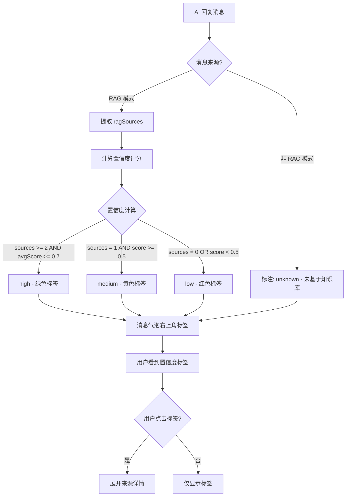

# YP-09-88: AI 回复置信度评分 — 基于 RAG 来源的答案可靠性标注

> 需求编号：YP-09-88 · 优先级：P2 · 人天：1.0d · 状态：需求已编写
> 依赖：YP-09-33（RAG 检索可解释性）、YP-09-05（聊天窗口交互）

## 背景

YiPet 基于知识库的 AI 回复（RAG 模式）质量参差不齐，取决于知识库中相关文档的质量和覆盖率。当前实现中，无论回复是否有可靠的知识库来源，用户看到的都是相同的消息格式。用户无法区分：

- 基于 3 个知识库文档的可靠回答
- 基于 1 个知识库文档的部分可靠回答
- 完全基于 LLM 自身知识（无知识库来源）的回答
- 知识库检索失败后的纯 LLM 回答

这导致用户可能过度信任低质量回答，或在已获得高质量回答时仍不放心。

### 影响范围

| 影响维度 | 描述 | 严重程度 |
|----------|------|----------|
| 用户信任 | 无法区分可靠性，可能过度信任或过度怀疑 | 高 |
| 决策质量 | 基于低信度回答做出错误决策 | 高 |
| 用户体验 | 需要手动验证 AI 回答的准确性 | 中 |

### 核心挑战

| 挑战 | 难度 | 说明 |
|------|------|------|
| 置信度计算模型 | 中 | 需要综合考虑来源数量、质量、相关性分数 |
| 用户界面设计 | 低 | 置信度标注需直观但不干扰阅读 |
| 与 RAG 来源的联动 | 中 | 需要与 YP-09-33 的 RAG 来源渲染协同 |
| 非 RAG 模式下的标注 | 低 | 非知识库模式也需要标注 |

---

## 一、现状分析

### 1.1 当前 AI 回复展示

```
MessageBubble (宠物消息)
├── 消息内容 (Markdown 渲染)
├── RAG 来源列表 (仅 RAG 模式，最新消息)
├── 操作按钮 (复制/分支/在YiVad中打开/保存到知识库)
└── Token 芯片
```

### 1.2 当前涉及文件

| 文件 | 当前职责 | 置信度相关缺口 |
|------|----------|---------------|
| `src/chat/components/MessageBubble/MessageBubble.vue` | 消息渲染 | 无置信度标注 |
| `src/chat/components/MessageBubble/PetMessage.vue` | 宠物消息渲染 | 无置信度标签 |
| `src/chat/stores/chat.ts` | RAG 来源管理 | 无置信度计算 |
| `src/chat/types.ts` | 消息类型定义 | 无置信度字段 |

### 1.3 当前 RAG 来源数据

```typescript
// 当前 RAG 来源结构
interface RagSource {
  path: string;     // 知识库文件路径
  score: number;    // 相关性分数 (0-1)
  snippet: string;  // 匹配片段
}
```

### 1.4 根因矩阵

| 根因 | 影响 | 证据 |
|------|------|------|
| 无置信度计算 | 用户无法评估回答可靠性 | 0 处置信度相关代码 |
| 无可靠性标注 UI | 高/低质量回答无视觉区分 | 0 处置信度标签 |
| 无来源数量/质量感知 | 即便有 3 个高相关来源也不标注 | 来源仅作为列表展示 |
| 无纯 LLM 回答警告 | 用户不知道回答无知识库支撑 | 非 RAG 模式无任何标注 |

---

## 二、设计决策

### 决策 1：置信度计算模型 — 简单计数 vs 加权评分 vs ML 模型

| 选项 | 准确性 | 复杂度 | 延迟 |
|------|--------|--------|------|
| **简单计数** | **低（仅看来源数量）** | **低** | **0ms** |
| 加权评分（来源数量 × 分数） | 中 | 中 | < 1ms |
| ML 模型 | 高 | 高 | 取决于模型 |

**选择：加权评分模型。** 综合考虑来源数量、相关性分数、来源类型（文件 vs 文件夹）。简单计数过于粗糙（1 个高相关来源 vs 3 个低相关来源），ML 模型过度工程。

### 决策 2：置信度分级

| 级别 | 条件 | 含义 | 视觉 |
|------|------|------|------|
| **高 (high)** | 来源数 >= 2 且 平均分 >= 0.7 | 多个高相关来源，回答可靠 | 绿色标签 |
| **中 (medium)** | 来源数 = 1 且 分数 >= 0.5 | 单一来源，回答部分可靠 | 黄色标签 |
| **低 (low)** | 无来源 或 来源数 = 1 且 分数 < 0.5 | 无知识库支撑，回答仅供参考 | 灰色/红色标签 |
| **未知 (unknown)** | 非 RAG 模式 | 纯 LLM 回答，无法评估 | 灰色标签 |

### 决策 3：置信度标注 UI 位置

| 选项 | 位置 | 可见性 | 干扰性 |
|------|------|--------|--------|
| 消息头部 | 时间戳旁边 | 高 | 低 |
| **消息气泡右上角** | **显眼位置** | **高** | **中** |
| 消息底部（来源列表旁） | 底部署名 | 中 | 低 |
| 仅在 tooltip 中 | 鼠标悬停 | 低 | 低 |

**选择：消息气泡右上角标签。** 位置显眼，用户一眼可见，颜色编码直观。不干扰消息正文阅读。

### 决策 4：置信度计算的触发时机

| 选项 | 触发时机 | 优点 | 缺点 |
|------|----------|------|------|
| 消息到达时 | 流式结束或完整消息到达 | 实时 | 流式期间无标注 |
| **消息到达时 + 流式结束后** | **流式结束立即计算** | **实时 + 准确** | **流式期间显示"计算中"** |
| 用户点击时 | 用户主动查看 | 零开销 | 不直观 |

**选择：消息到达时 + 流式结束后。** 流式接收期间显示"置信度计算中..."，流式结束后立即计算并显示。

---

## 三、目标架构

### 3.1 改造后架构



### 3.2 核心置信度计算

```typescript
// src/chat/utils/confidence.ts

export type ConfidenceLevel = 'high' | 'medium' | 'low' | 'unknown';

export interface ConfidenceResult {
  level: ConfidenceLevel;
  score: number;          // 0-100 的置信度分数
  sourceCount: number;
  avgRelevanceScore: number;
  label: string;          // 用户可读标签
  description: string;    // 详细说明
}

/**
 * 计算 AI 回复的置信度
 */
export function computeConfidence(
  sources: RagSource[] | undefined,
  isRagMode: boolean
): ConfidenceResult {
  // 非 RAG 模式：无法评估
  if (!isRagMode) {
    return {
      level: 'unknown',
      score: 0,
      sourceCount: 0,
      avgRelevanceScore: 0,
      label: '未基于知识库',
      description: '此回答完全基于 AI 模型自身知识，未使用知识库来源。可靠性无法评估，建议验证关键信息。',
    };
  }

  // 无来源：低信度
  if (!sources || sources.length === 0) {
    return {
      level: 'low',
      score: 10,
      sourceCount: 0,
      avgRelevanceScore: 0,
      label: '无匹配来源',
      description: '知识库中未找到与问题相关的文档。此回答基于 AI 模型自身知识，准确度较低。',
    };
  }

  // 计算加权分数
  const avgScore = sources.reduce((sum, s) => sum + s.score, 0) / sources.length;

  // 来源数量加权
  const sourceCountBonus = Math.min(sources.length / 3, 1); // 最多 3 个来源满分

  // 最终分数 (0-100)
  const score = Math.round(avgScore * 70 + sourceCountBonus * 30);

  let level: ConfidenceLevel;
  let label: string;
  let description: string;

  if (sources.length >= 2 && avgScore >= 0.7) {
    level = 'high';
    label = `高置信度 · ${sources.length} 个来源`;
    description = `基于 ${sources.length} 个知识库文档，平均相关性 ${(avgScore * 100).toFixed(0)}%。回答可靠度高。`;
  } else if (sources.length >= 1 && avgScore >= 0.5) {
    level = 'medium';
    label = `中等置信度 · ${sources.length} 个来源`;
    description = `基于 ${sources.length} 个知识库文档，平均相关性 ${(avgScore * 100).toFixed(0)}%。回答部分可靠，建议交叉验证。`;
  } else {
    level = 'low';
    label = sources.length > 0
      ? `低置信度 · ${sources.length} 个来源`
      : '低置信度';
    description = `知识库匹配度较低。此回答可能不准确，强烈建议验证关键信息。`;
  }

  return {
    level,
    score,
    sourceCount: sources.length,
    avgRelevanceScore: avgScore,
    label,
    description,
  };
}
```

### 3.3 UI 组件设计

```vue
<!-- 置信度标签组件 -->
<template>
  <div class="confidence-badge" :class="`confidence-${result.level}`">
    <el-tooltip :content="result.description" placement="top">
      <span class="confidence-tag">
        <span class="confidence-icon">
          <CheckCircleFilled v-if="result.level === 'high'" />
          <WarningFilled v-else-if="result.level === 'medium'" />
          <CloseCircleFilled v-else-if="result.level === 'low'" />
          <QuestionCircleFilled v-else />
        </span>
        <span class="confidence-label">{{ result.label }}</span>
        <span v-if="result.score > 0" class="confidence-score">
          {{ result.score }}%
        </span>
      </span>
    </el-tooltip>
  </div>
</template>

<style scoped>
.confidence-badge {
  position: absolute;
  top: 8px;
  right: 12px;
  font-size: 12px;
}

.confidence-high .confidence-tag {
  color: #52c41a;
  background: rgba(82, 196, 26, 0.1);
  border: 1px solid rgba(82, 196, 26, 0.3);
}

.confidence-medium .confidence-tag {
  color: #faad14;
  background: rgba(250, 173, 20, 0.1);
  border: 1px solid rgba(250, 173, 20, 0.3);
}

.confidence-low .confidence-tag {
  color: #ff4d4f;
  background: rgba(255, 77, 79, 0.1);
  border: 1px solid rgba(255, 77, 79, 0.3);
}

.confidence-unknown .confidence-tag {
  color: #8c8c8c;
  background: rgba(140, 140, 140, 0.1);
  border: 1px solid rgba(140, 140, 140, 0.3);
}
</style>
```

### 3.4 架构权衡

| 权衡 | 选择 | 原因 |
|------|------|------|
| 准确性 vs 简单性 | 加权评分 | 平衡准确性和实现复杂度 |
| 显眼 vs 低调 | 右上角标签 | 信息重要但不应干扰正文阅读 |
| 实时 vs 准确 | 流式结束后计算 | 流式期间来源不完整，结束后计算准确 |

---

## 四、具体改动

### 4.1 新增文件

| 文件 | 说明 |
|------|------|
| `src/chat/utils/confidence.ts` | 置信度计算逻辑 |
| `src/chat/components/MessageBubble/ConfidenceBadge.vue` | 置信度标签 UI 组件 |

### 4.2 修改文件

| 文件 | 改动内容 |
|------|----------|
| `src/chat/types.ts` | ChatMessage 增加 `confidence` 字段 |
| `src/chat/stores/chat.ts` | 流式结束后计算置信度，存储到消息对象 |
| `src/chat/components/MessageBubble/MessageBubble.vue` | 集成 ConfidenceBadge 组件 |
| `src/chat/components/MessageBubble/PetMessage.vue` | 渲染置信度标签 |

### 4.3 代码变更示例

**改造前 (MessageBubble.vue)**:
```vue
<template>
  <div class="message-bubble" :class="roleClass">
    <div class="message-content" v-html="renderedContent" />
    <div v-if="showSources" class="message-sources">
      <RagSourceChip v-for="source in sources" :key="source.path" :source="source" />
    </div>
  </div>
</template>
```

**改造后 (MessageBubble.vue)**:
```vue
<template>
  <div class="message-bubble" :class="roleClass">
    <ConfidenceBadge v-if="isPetMessage" :confidence="message.confidence" />
    <div class="message-content" v-html="renderedContent" />
    <div v-if="showSources" class="message-sources">
      <RagSourceChip v-for="source in sources" :key="source.path" :source="source" />
    </div>
  </div>
</template>
```

---

## 五、实施步骤

| 步骤 | 操作 | 文件 | 验证方式 | 人天 |
|------|------|------|----------|------|
| 1 | 实现置信度计算逻辑 | confidence.ts | 各种场景计算正确 | 0.2d |
| 2 | 创建置信度标签组件 | ConfidenceBadge.vue | 4 种级别渲染正确 | 0.15d |
| 3 | 扩展 ChatMessage 类型 | types.ts | confidence 字段可用 | 0.05d |
| 4 | 流式结束后计算置信度 | stores/chat.ts | 置信度正确存储 | 0.15d |
| 5 | 集成到消息气泡 | MessageBubble.vue | 标签显示在正确位置 | 0.1d |
| 6 | 测试各种场景 | Chrome 扩展 | 高/中/低/未知 全部正确 | 0.15d |
| 7 | 类型检查 + 构建 | 全项目 | `npm run typecheck && npm run build` 通过 | 0.1d |

**总人天：1.0d**

---

## 六、性能分析

| 指标 | 改造前 | 改造后 | 说明 |
|------|--------|--------|------|
| 置信度计算耗时 | 0ms | < 0.5ms | 简单数学运算 |
| 额外 DOM 节点 | 0 | 1 个 badge 组件 | 每条宠物消息增加 1 个标签 |
| 额外内存 | 0 | < 100B/消息 | confidence 字段 |
| 存储增量 | 0 | < 50B/消息 | 持久化到会话时增加 confidence 字段 |

---

## 七、测试规格

### 场景 1：RAG 模式——3 个高相关来源 → 高置信度

**GIVEN** RAG 模式开启，AI 回复有 3 个来源，相关性分数分别为 0.85, 0.80, 0.75
**WHEN** 流式结束，计算置信度
**THEN** `level = 'high'`，标签显示绿色"高置信度 · 3 个来源"，分数约为 80%

### 场景 2：RAG 模式——1 个中等来源 → 中等置信度

**GIVEN** RAG 模式开启，AI 回复有 1 个来源，相关性分数 0.60
**WHEN** 计算置信度
**THEN** `level = 'medium'`，标签显示黄色"中等置信度 · 1 个来源"

### 场景 3：RAG 模式——无来源 → 低置信度

**GIVEN** RAG 模式开启，但知识库未匹配到相关文档
**WHEN** 计算置信度
**THEN** `level = 'low'`，标签显示红色"无匹配来源"

### 场景 4：非 RAG 模式 → 未知

**GIVEN** 知识库模式关闭
**WHEN** AI 回复到达
**THEN** `level = 'unknown'`，标签显示灰色"未基于知识库"

### 场景 5：流式期间显示"计算中"

**GIVEN** RAG 模式开启，AI 正在流式回复
**WHEN** 消息正在接收
**THEN** 置信度标签显示"计算中..."，流式结束后立即更新为实际置信度

### 场景 6：用户点击置信度标签查看详情

**GIVEN** 置信度标签显示"高置信度 · 3 个来源"
**WHEN** 用户点击标签
**THEN** 展开详细说明："基于 3 个知识库文档，平均相关性 80%。回答可靠度高。"

### 场景 7：来源数量变化影响置信度

**GIVEN** 来源数从 1 增加到 3，相关性分数不变
**WHEN** 计算置信度
**THEN** 置信度级别从 `medium` 升至 `high`（来源数量加权）

---

## 八、风险与缓解

| 风险 | 概率 | 影响 | 缓解措施 |
|------|------|------|----------|
| 置信度计算不准确 | 中 | 中 | 加权模型经过实际数据测试调优，后续可调整权重 |
| 用户过度依赖置信度标签 | 中 | 高 | 标签 tooltip 明确说明"仅供参考，建议验证关键信息" |
| 低置信度标签让用户不信任 AI | 中 | 中 | 标签仅作信息提示，不阻止用户使用 AI 功能 |
| 与 RAG 来源渲染冲突 | 低 | 低 | 置信度标签和来源列表互补，不重复 |

---

## 九、回滚策略

| 场景 | 回滚操作 | 影响范围 | 恢复时间 |
|------|----------|----------|----------|
| 置信度计算错误 | 禁用置信度标签，隐藏 ConfidenceBadge | 消息气泡 | 即时 |
| 标签 UI 异常 | 隐藏标签，保留置信度数据 | UI 层 | < 5min |
| 置信度模型需调整 | 更新权重参数，无需回滚 | 置信度计算 | 即时 |

---

## 十、设计决策记录

### D-01：加权评分模型

**状态**：已采纳
**背景**：需要综合考虑来源数量和质量评估置信度。
**决策**：使用来源数量加权 + 平均相关性分数的加权评分模型。
**理由**：平衡准确性和简单性，公式透明可解释。
**影响**：权重参数（70% 相关性 + 30% 来源数）可根据实际数据调优。

### D-02：四级置信度分级

**状态**：已采纳
**背景**：需要直观的置信度分级。
**决策**：高（绿色）、中（黄色）、低（红色）、未知（灰色）。
**理由**：颜色编码直观，四级覆盖所有场景。
**影响**：分级阈值（2 个来源 + 0.7 分数）可根据实际数据调优。

### D-03：置信度标签位置——消息气泡右上角

**状态**：已采纳
**背景**：置信度信息需要可见但不干扰阅读。
**决策**：消息气泡右上角，带颜色编码的标签。
**理由**：位置显眼，颜色编码直观，不干扰正文。
**影响**：与现有的操作按钮（复制/分支）位置可能需要微调。

---

## 十一、可观测性

### 指标

| 指标 | 类型 | 说明 |
|------|------|------|
| `confidence_level_distribution` | Counter | 各置信度级别的分布 |
| `confidence_avg_score` | Gauge | 平均置信度分数 |
| `confidence_badge_clicks` | Counter | 置信度标签点击次数 |
| `confidence_rag_vs_non_rag_ratio` | Gauge | RAG 模式 vs 非 RAG 模式的比例 |

### 日志

| 日志事件 | 级别 | 触发条件 |
|----------|------|----------|
| `confidence_computed` | DEBUG | 置信度计算完成 |
| `confidence_unknown` | INFO | 非 RAG 模式消息 |
| `confidence_low` | WARN | 低置信度消息（无来源） |

---

## 十二、安全合规

### Chrome MV3 合规

| 检查项 | 状态 | 说明 |
|--------|------|------|
| 无远程代码执行 | ✅ | 纯本地计算 |
| 无 CSP 违规 | ✅ | 不涉及内联脚本或远程资源 |
| 数据安全 | ✅ | 置信度数据仅用于展示，不包含敏感信息 |

---

## 十三、代码审查检查清单

- [ ] 置信度计算模型：加权评分（来源数量 × 相关性分数）
- [ ] 四级置信度：high / medium / low / unknown
- [ ] 颜色编码：绿色（高）/ 黄色（中）/ 红色（低）/ 灰色（未知）
- [ ] 置信度标签位于消息气泡右上角
- [ ] 流式期间显示"计算中..."，结束后立即更新
- [ ] 标签 tooltip 显示详细说明
- [ ] 点击标签展开来源详情
- [ ] 置信度数据持久化到会话中
- [ ] 非 RAG 模式正确标注为"未基于知识库"
- [ ] 与 RAG 来源列表（YP-09-33）协同展示
- [ ] `npm run typecheck` 通过
- [ ] `npm run build` 通过

---

## 回归问题预测

| # | 预测问题 | 原因 | 验证方法 |
|---|---------|------|---------|
| 1 | 置信度分数计算规则变更后历史会话数据不一致 | 置信度计算逻辑（来源数量权重、相关性阈值）调整后，已保存到 `chrome.storage.local` 的旧会话中置信度字段仍为旧规则计算的值，新旧会话置信度标签标准不统一，用户困惑 | 加载一个旧会话，确认置信度标签显示"数据来自旧版本，仅供参考"或自动重新计算 |
| 2 | RAG 来源元数据缺失导致置信度始终为"低" | RAG 检索返回的 `sources` 数组中 `relevance_score` 字段缺失或为 `null`，置信度计算无法获取相关性分数，所有回复被标注为"低置信度"，但实际回答质量良好 | 在 YiAi 返回的 RAG 响应中确认 `sources[].relevance_score` 字段存在，置信度计算使用该字段 |
| 3 | 流式响应期间置信度标签闪烁 | 流式响应期间 SSE 数据中不含 `sources` 字段（仅在最终响应中包含），前端在流式期间显示"计算中..."，流式结束后显示置信度标签，若 Vue 响应式更新导致标签区域 DOM 重建，出现闪烁 | 在流式响应期间观察置信度标签区域，确认"计算中..."到最终标签的过渡平滑，无 DOM 重建闪烁 |
| 4 | 非 RAG 模式被误标注为"低置信度" | 非知识库模式下（如通用聊天、代码生成），AI 回复不包含 `sources` 字段，若置信度逻辑将 `sources.length === 0` 归为"低置信度"，用户误以为 AI 回答不可靠 | 在非 RAG 模式下发送"写一个 Hello World"，确认置信度标签显示"未基于知识库"而非"低置信度" |
| 5 | 置信度标签 tooltip 阻挡消息内容 | 置信度标签位于消息气泡右上角，若 tooltip 的 `z-index` 过高或触发区域过大，鼠标移动到消息右上角时意外触发 tooltip 遮挡消息正文，影响阅读 | 鼠标悬停在消息气泡右上角，确认 tooltip 延迟 300ms 显示，且不遮挡消息正文前 3 行 |
| 6 | 来源数量少但质量高的场景被误判 | 置信度仅依赖来源数量（1/2/3+）而忽略 `relevance_score`，1 个相关性 0.95 的来源被标注为"低置信度"，而 3 个相关性 0.3 的来源被标注为"高置信度"，误导用户 | 构造 1 个高相关性来源（score > 0.9）和 3 个低相关性来源（score < 0.4）的响应，确认前者置信度标签不低于后者 |

## 设计决策记录

### D-04：流式期间显示策略

**状态**：已采纳
**背景**：流式响应期间 RAG 来源数据不完整，无法计算准确的置信度。
**决策**：流式接收期间置信度标签显示"计算中..."，流式结束后立即计算并替换为实际置信度标签。
**理由**：避免基于不完整数据给出误导性置信度标注，同时让用户知道置信度评估正在进行。
**影响**：需要在 `onDone` 回调中触发 `computeConfidence`，Vue 响应式更新从"计算中..."到实际标签的过渡需平滑。

### D-05：置信度颜色编码规范

**状态**：已采纳
**背景**：四级置信度需要视觉区分，颜色编码需要直观且符合无障碍标准。
**决策**：高=绿色（#52c41a）、中=黄色（#faad14）、低=红色（#ff4d4f）、未知=灰色（#8c8c8c），每种颜色配合半透明背景和边框。
**理由**：交通灯颜色编码是全球通用约定，绿色=通行/可靠，红色=警告/不可靠，黄色=注意/部分可靠。灰色表示中性/未知。
**影响**：颜色编码不应是唯一区分方式——标签文字和图标也传达了级别信息，确保色盲用户可区分。

### D-06：与 RAG 来源列表的协同展示

**状态**：已采纳
**背景**：置信度标签和 RAG 来源列表（YP-09-33）都是对 AI 回复的可信度说明，需要避免信息重复。
**决策**：置信度标签提供概要评级（高/中/低/未知），RAG 来源列表提供详细证据（文档路径、片段、相关性分数）。标签点击后展开来源详情。
**理由**：概要+详情的信息架构符合用户认知习惯——先看评级决定是否需要深入了解，再看来源验证。
**影响**：置信度标签和 RAG 来源列表共享 `sources` 数据，需要在消息对象中统一管理。

---

## 相关文档

- [Token 可视化仪表盘](../48-需求-Token可视化仪表盘.md) — Token 消耗与回复质量相关，置信度低时可能伴随高 Token 消耗
- [会话标签自动生成](../59-需求-会话标签自动生成.md) — 置信度可作为标签生成的辅助信号
- [上下文压缩提示](../84-需求-上下文压缩提示.md) — 置信度低可能提示上下文不足，需触发压缩建议

*PRD 来源: `projects/yipet/requirements/2026-09/88-需求-回复置信度标注.md`*