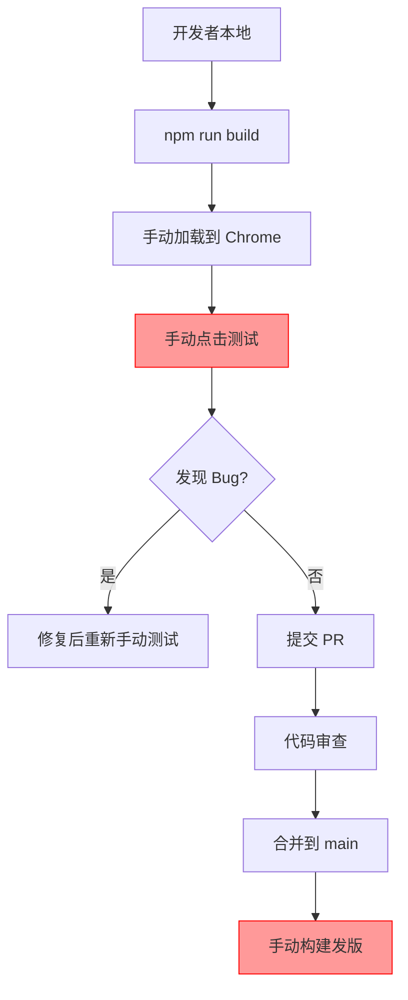
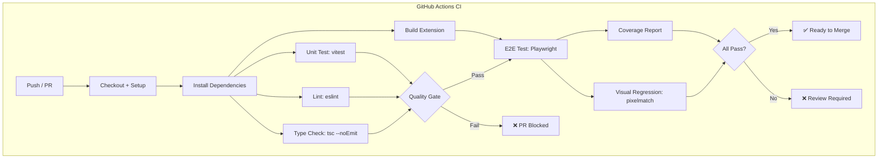
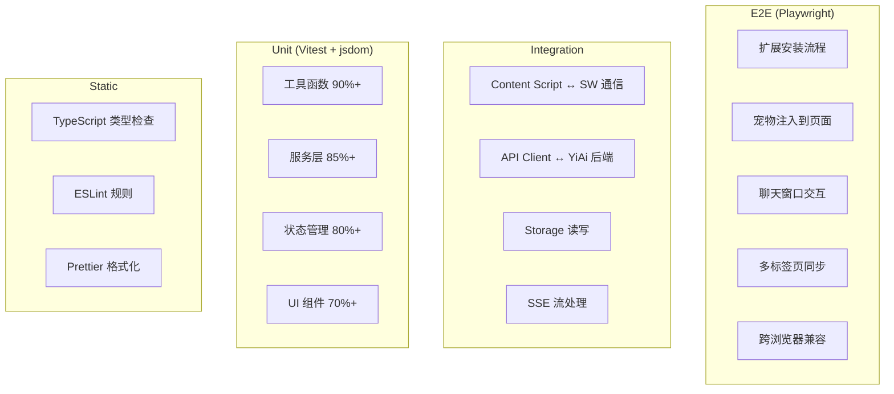

# YP-09-89: 测试体系与 CI — E2E/视觉回归/单元测试基础设施

> 需求编号：YP-09-89 · 优先级：P1 · 人天：1.5d · 状态：需求已编写
> 依赖：无

## 背景

### 问题陈述

YiPet 当前测试体系存在严重缺口：仅有 97 个 Vitest 单元测试覆盖配置和服务层，完全缺乏 E2E 测试和视觉回归测试。Chrome 扩展的测试面临独特挑战——Content Script 与 Service Worker 隔离、chrome.* API 在测试环境不可用、扩展安装/更新流程无法自动化验证。这导致：

1. **回归风险高**：每次发布前依赖手动点击测试，覆盖率不足 30%
2. **视觉缺陷遗漏**：宠物动画、UI 布局问题在代码审查中无法发现
3. **跨浏览器兼容性未知**：Chrome/Edge/Safari/Firefox 之间的差异未自动化检测
4. **CI 流水线缺失**：无自动化构建验证、类型检查、lint 和测试的门禁机制

**核心矛盾**：Chrome 扩展的独特架构（MV3 Service Worker、Content Script 隔离、chrome.* API）使传统 Web 测试工具无法直接适用，需要专门的基础设施适配。

### 影响范围

| # | 影响 | 严重程度 | 典型场景 |
|---|------|----------|----------|
| 1 | 发布前回归测试依赖人工 | 高 | 每次发版需手动验证 20+ 功能点 |
| 2 | UI 视觉缺陷线上才发现 | 高 | 宠物动画错位、聊天窗口布局异常 |
| 3 | 跨浏览器兼容性无保障 | 中 | Safari/Firefox 用户遇到功能异常 |
| 4 | PR 合并无自动化门禁 | 高 | 类型错误、lint 违规代码合入主分支 |
| 5 | 测试覆盖率无强制门槛 | 中 | 新功能无测试，技术债务累积 |

### 挑战

| 挑战 | 说明 |
|------|------|
| Service Worker 测试 | SW 生命周期短，无 DOM 环境，测试框架需模拟 chrome.* API |
| Content Script 隔离 | CS 注入到宿主页面，需模拟页面 DOM 和隔离的执行环境 |
| chrome.* API Mock | 40+ chrome API 需在 Node.js 测试环境中模拟 |
| 视觉回归 | 扩展 UI 渲染在 Shadow DOM 中，截图工具需支持 |
| CI 环境 | GitHub Actions 需安装 Chrome 浏览器并加载解压扩展 |

---

## 一、现状分析

### 1.1 当前测试体系

```
现有测试 (97 个 Vitest 用例):
├── tests/unit/config/
│   ├── manifest.test.ts          # manifest 配置验证
│   ├── build-config.test.ts      # 构建配置验证
│   └── permissions.test.ts       # 权限声明验证
├── tests/unit/services/
│   ├── api-client.test.ts        # API 客户端（mock fetch）
│   ├── storage.test.ts           # chrome.storage 封装（mock）
│   └── message-bus.test.ts       # 消息总线
├── tests/unit/utils/
│   ├── sanitizer.test.ts         # 内容脱敏
│   └── formatter.test.ts         # 格式化工具
└── tests/unit/stores/
    ├── chat.test.ts              # 聊天状态
    └── settings.test.ts          # 设置状态

缺失:
├── tests/e2e/                    # ❌ 不存在
├── tests/visual/                 # ❌ 不存在
├── tests/integration/            # ❌ 不存在
├── .github/workflows/            # ❌ 不存在
└── vitest.config.ts 覆盖率配置   # ❌ 未配置
```

### 1.2 测试覆盖率现状

| 层级 | 当前覆盖 | 目标覆盖 | 差距 |
|------|----------|----------|------|
| 工具函数 (utils/) | ~80% | 90% | 10% |
| 服务层 (services/) | ~60% | 85% | 25% |
| 状态管理 (stores/) | ~40% | 80% | 40% |
| UI 组件 (components/) | 0% | 70% | 70% |
| Content Script (content/) | 0% | 60% | 60% |
| Service Worker (sw/) | 0% | 50% | 50% |
| E2E 流程 | 0% | 核心流程 100% | 100% |

### 1.3 改造前 CI 流程



### 1.4 根因矩阵

| 症状 | 根因 | 触发条件 | 频率 |
|------|------|----------|------|
| 手动回归测试 | 无 E2E 自动化 | 每次发版 | 高 |
| 视觉缺陷遗漏 | 无视觉回归测试 | UI 变更 | 中 |
| PR 无门禁 | 无 CI 流水线 | 每次 PR | 高 |
| SW 测试困难 | chrome.* API 不可用 | 每次编写 SW 测试 | 高 |
| 覆盖率无约束 | 未配置 thresholds | 新功能无测试 | 中 |

---

## 二、设计决策

### 决策 1：E2E 测试框架 — Playwright vs Puppeteer vs Selenium

| 选项 | Chrome 扩展支持 | 多浏览器 | 社区生态 | 调试体验 |
|------|----------------|----------|----------|----------|
| Playwright | 原生支持扩展加载 | Chrome/Edge/Safari/Firefox | 活跃 | 优秀（Trace Viewer） |
| Puppeteer | 仅 Chrome | 仅 Chrome | 成熟 | 良好 |
| Selenium | 需额外配置 | 全浏览器 | 庞大 | 较差 |

**选择：Playwright。** 原生支持 `--load-extension` 参数加载解压扩展，支持多浏览器，Trace Viewer 提供优秀的调试体验。Playwright 的 `browserContext` 模型天然适配扩展的多上下文场景（background page + content script + popup）。

### 决策 2：视觉回归工具 — Percy vs Chromatic vs 自建

| 选项 | 价格 | 集成难度 | 扩展支持 | 审查工作流 |
|------|------|----------|----------|-----------|
| Percy | 免费额度 5000/月 | 低 | 中等（需自定义截图） | 优秀 |
| Chromatic | 免费额度 5000/月 | 低（Storybook 集成） | 需 Storybook 适配 | 优秀 |
| 自建（Playwright 截图 + diff） | 免费 | 高 | 完全可控 | 需自建 |

**选择：自建方案（Playwright 截图 + pixelmatch diff）。** YiPet 的 UI 主要在 Shadow DOM 中渲染，Percy/Chromatic 的 Shadow DOM 支持有限。自建方案使用 Playwright 的 `locator` 穿透 Shadow DOM 截图，配合 `pixelmatch` 做像素级对比，存储基准截图在 Git LFS 中。

### 决策 3：CI 平台 — GitHub Actions vs GitLab CI vs Jenkins

| 选项 | 成本 | 配置复杂度 | 扩展构建缓存 | Chrome 支持 |
|------|------|-----------|------------|------------|
| GitHub Actions | 免费（公开仓库） | 低 | 良好 | 预装 Chrome |
| GitLab CI | 免费额度有限 | 中 | 良好 | 需 Docker 镜像 |
| Jenkins | 自托管成本 | 高 | 需配置 | 需配置 |

**选择：GitHub Actions。** 仓库已托管在 GitHub，Actions 免费额度充足，预装 Chrome 浏览器，社区有成熟的扩展测试 Action 模板。

### 决策 4：chrome.* API Mock 策略 — 手动 mock vs sinon-chrome vs 自建适配层

| 选项 | 维护成本 | 真实性 | 类型安全 |
|------|----------|--------|----------|
| 手动 mock（jest.fn） | 高 | 低 | 无 |
| sinon-chrome | 中 | 中 | 无 |
| 自建适配层（chrome-api-mock） | 中 | 高 | TypeScript 完整类型 |

**选择：自建适配层。** 创建 `tests/mocks/chrome-api.ts`，提供类型安全的 chrome.* API mock，支持常见调用模式（`chrome.storage.local.get`、`chrome.runtime.sendMessage` 等），并支持断言 API 调用次数和参数。

### 设计决策记录

| 决策 | 选项 A | 选项 B | 选项 C | 选择 | 理由 |
|------|--------|--------|--------|------|------|
| E2E 框架 | Playwright | Puppeteer | Selenium | **Playwright** | 原生扩展支持 + 多浏览器 |
| 视觉回归 | Percy | Chromatic | 自建 | **自建** | Shadow DOM 支持需求 |
| CI 平台 | GitHub Actions | GitLab CI | Jenkins | **GitHub Actions** | 免费 + 预装 Chrome |
| chrome.* Mock | 手动 mock | sinon-chrome | 自建适配层 | **自建适配层** | 类型安全 + 可维护 |

---

## 三、目标架构

### 3.1 CI/CD 流水线



### 3.2 测试金字塔



### 3.3 性能指标

| 指标 | 改造前 | 改造后 |
|------|--------|--------|
| CI 流水线耗时 | 0（无 CI） | < 8min（含 E2E） |
| 测试覆盖率 | ~30% | 75%+ |
| PR 门禁 | 无 | 类型检查 + lint + 单元测试 |
| E2E 覆盖 | 0 | 核心流程 5 条 |
| 视觉回归 | 无 | 每次 PR 自动对比 |

---

## 四、具体改动

### 4.1 chrome.* API Mock 适配层

```typescript
// tests/mocks/chrome-api.ts (新增)

type StorageArea = Record<string, unknown>;

class MockStorageArea {
  private store: StorageArea = {};

  async get(keys?: string | string[] | null): Promise<StorageArea> {
    if (keys === null || keys === undefined) {
      return { ...this.store };
    }
    const keyList = Array.isArray(keys) ? keys : [keys];
    const result: StorageArea = {};
    for (const key of keyList) {
      if (key in this.store) {
        result[key] = this.store[key];
      }
    }
    return result;
  }

  async set(items: StorageArea): Promise<void> {
    Object.assign(this.store, items);
  }

  async remove(keys: string | string[]): Promise<void> {
    const keyList = Array.isArray(keys) ? keys : [keys];
    for (const key of keyList) {
      delete this.store[key];
    }
  }

  async clear(): Promise<void> {
    this.store = {};
  }

  _getInternalStore(): StorageArea {
    return this.store;
  }
}

interface MockChromeAPI {
  storage: {
    local: MockStorageArea;
    sync: MockStorageArea;
    session: MockStorageArea;
  };
  runtime: {
    id: string;
    getManifest: () => { version: string; permissions: string[] };
    sendMessage: ReturnType<typeof vi.fn>;
    onMessage: {
      addListener: ReturnType<typeof vi.fn>;
      removeListener: ReturnType<typeof vi.fn>;
    };
    getURL: (path: string) => string;
    lastError: null | { message: string };
  };
  tabs: {
    query: ReturnType<typeof vi.fn>;
    create: ReturnType<typeof vi.fn>;
    sendMessage: ReturnType<typeof vi.fn>;
  };
  _reset: () => void;
}

export function createMockChromeAPI(): MockChromeAPI {
  const storageLocal = new MockStorageArea();
  const storageSync = new MockStorageArea();
  const storageSession = new MockStorageArea();

  return {
    storage: {
      local: storageLocal,
      sync: storageSync,
      session: storageSession,
    },
    runtime: {
      id: 'mock-extension-id',
      getManifest: () => ({
        version: '1.0.0-test',
        permissions: ['storage', 'activeTab'],
      }),
      sendMessage: vi.fn().mockResolvedValue(undefined),
      onMessage: {
        addListener: vi.fn(),
        removeListener: vi.fn(),
      },
      getURL: (path: string) => `chrome-extension://mock-id/${path}`,
      lastError: null,
    },
    tabs: {
      query: vi.fn().mockResolvedValue([{ id: 1, url: 'https://example.com' }]),
      create: vi.fn().mockResolvedValue({ id: 2 }),
      sendMessage: vi.fn().mockResolvedValue(undefined),
    },
    _reset() {
      storageLocal.clear();
      storageSync.clear();
      storageSession.clear();
      vi.clearAllMocks();
    },
  };
}
```

### 4.2 Playwright E2E 测试配置

```typescript
// tests/e2e/playwright.config.ts (新增)

import { defineConfig, devices } from '@playwright/test';

export default defineConfig({
  testDir: './tests/e2e',
  timeout: 30000,
  expect: { timeout: 10000 },
  retries: process.env.CI ? 2 : 0,
  workers: process.env.CI ? 1 : undefined,
  reporter: [
    ['html', { outputFolder: 'playwright-report' }],
    ['json', { outputFile: 'playwright-report/results.json' }],
  ],
  use: {
    baseURL: 'https://example.com',
    trace: 'on-first-retry',
    screenshot: 'only-on-failure',
  },
  projects: [
    {
      name: 'chromium',
      use: {
        ...devices['Desktop Chrome'],
        // 加载解压后的扩展
        launchOptions: {
          args: [
            `--disable-extensions-except=${process.env.EXTENSION_PATH || './dist'}`,
            `--load-extension=${process.env.EXTENSION_PATH || './dist'}`,
          ],
        },
      },
    },
    {
      name: 'firefox',
      use: {
        ...devices['Desktop Firefox'],
        // Firefox 扩展加载方式不同
      },
    },
    {
      name: 'webkit',
      use: { ...devices['Desktop Safari'] },
    },
  ],
  // 测试前启动本地静态页面服务器
  webServer: {
    command: 'npx serve tests/e2e/fixtures -p 3456',
    port: 3456,
    reuseExistingServer: !process.env.CI,
  },
});
```

### 4.3 E2E 测试用例示例

```typescript
// tests/e2e/pet-injection.spec.ts (新增)

import { test, expect } from '@playwright/test';
import { getExtensionId, waitForExtension } from './helpers';

test.describe('宠物注入', () => {
  let extensionId: string;

  test.beforeAll(async ({ browser }) => {
    extensionId = await getExtensionId(browser);
  });

  test('应在支持的页面上注入宠物元素', async ({ page }) => {
    await page.goto('https://example.com');
    await waitForExtension(page, extensionId);

    // 验证宠物覆盖层已注入
    const overlay = page.locator('#yipet-overlay');
    await expect(overlay).toBeVisible({ timeout: 10000 });

    // 验证宠物元素在 Shadow DOM 中
    const petContainer = page.locator('#yipet-overlay')
      .locator('yipet-pet');
    await expect(petContainer).toBeAttached();
  });

  test('应在排除页面上不注入宠物', async ({ page }) => {
    await page.goto('chrome://extensions');
    await page.waitForTimeout(2000);

    const overlay = page.locator('#yipet-overlay');
    await expect(overlay).not.toBeAttached();
  });

  test('宠物应响应点击交互', async ({ page }) => {
    await page.goto('https://example.com');
    await waitForExtension(page, extensionId);

    const pet = page.locator('#yipet-overlay yipet-pet');
    await pet.click();

    // 验证宠物状态变化（如动画触发）
    const petState = await pet.getAttribute('data-state');
    expect(petState).toBe('interacting');
  });
});
```

### 4.4 视觉回归测试

```typescript
// tests/visual/visual-regression.ts (新增)

import { test, expect } from '@playwright/test';
import { compareScreenshots } from './helpers/compare';
import path from 'path';

const SCREENSHOT_DIR = path.resolve('tests/visual/screenshots');
const BASELINE_DIR = path.resolve('tests/visual/baselines');

test.describe('视觉回归测试', () => {
  test('宠物默认状态外观', async ({ page }) => {
    await page.goto('https://example.com');
    await page.waitForSelector('#yipet-overlay', { timeout: 10000 });

    const screenshot = await page.locator('#yipet-overlay').screenshot();
    const result = await compareScreenshots(
      screenshot,
      path.join(BASELINE_DIR, 'pet-default.png'),
      path.join(SCREENSHOT_DIR, 'pet-default.png'),
      { threshold: 0.01 }  // 1% 像素差异容忍度
    );

    expect(result.passed).toBe(true);
    if (!result.passed) {
      console.log(`差异像素数: ${result.diffPixels}, 百分比: ${result.diffPercent}%`);
    }
  });

  test('聊天窗口布局', async ({ page }) => {
    await page.goto('https://example.com');
    await page.waitForSelector('#yipet-overlay', { timeout: 10000 });

    // 打开聊天窗口
    await page.locator('#yipet-overlay [data-action="open-chat"]').click();
    await page.waitForSelector('#yipet-chat-root', { timeout: 5000 });

    const screenshot = await page.locator('#yipet-chat-root').screenshot();
    const result = await compareScreenshots(
      screenshot,
      path.join(BASELINE_DIR, 'chat-layout.png'),
      path.join(SCREENSHOT_DIR, 'chat-layout.png'),
      { threshold: 0.02 }
    );

    expect(result.passed).toBe(true);
  });
});
```

### 4.5 GitHub Actions CI 配置

```yaml
# .github/workflows/ci.yml (新增)

name: CI

on:
  push:
    branches: [main]
  pull_request:
    branches: [main]

jobs:
  quality:
    name: 代码质量检查
    runs-on: ubuntu-latest
    steps:
      - uses: actions/checkout@v4
      - uses: actions/setup-node@v4
        with:
          node-version: '20'
          cache: 'npm'
      - run: npm ci
      - name: TypeScript 类型检查
        run: npx tsc --noEmit
      - name: ESLint
        run: npx eslint src/ --ext .ts,.vue --max-warnings 0
      - name: Prettier
        run: npx prettier --check "src/**/*.{ts,vue,css}"

  unit-test:
    name: 单元测试
    runs-on: ubuntu-latest
    steps:
      - uses: actions/checkout@v4
      - uses: actions/setup-node@v4
        with:
          node-version: '20'
          cache: 'npm'
      - run: npm ci
      - name: Vitest
        run: npx vitest run --coverage
      - name: 覆盖率报告
        uses: davelosert/vitest-coverage-report-action@v2
        with:
          json-summary-path: coverage/coverage-summary.json
          vite-config-path: vitest.config.ts

  e2e-test:
    name: E2E 测试
    runs-on: ubuntu-latest
    needs: [quality, unit-test]
    steps:
      - uses: actions/checkout@v4
      - uses: actions/setup-node@v4
        with:
          node-version: '20'
          cache: 'npm'
      - run: npm ci
      - name: 构建扩展
        run: npm run build
      - name: 安装 Playwright
        run: npx playwright install --with-deps chromium
      - name: 运行 E2E 测试
        run: npx playwright test --project=chromium
        env:
          EXTENSION_PATH: ${{ github.workspace }}/dist
      - name: 上传测试报告
        if: always()
        uses: actions/upload-artifact@v4
        with:
          name: playwright-report
          path: playwright-report/

  visual-regression:
    name: 视觉回归测试
    runs-on: ubuntu-latest
    needs: [unit-test]
    steps:
      - uses: actions/checkout@v4
      - uses: actions/setup-node@v4
        with:
          node-version: '20'
          cache: 'npm'
      - run: npm ci
      - name: 构建扩展
        run: npm run build
      - name: 安装 Playwright
        run: npx playwright install --with-deps chromium
      - name: 运行视觉回归测试
        run: npx playwright test --config=tests/visual/playwright.config.ts
      - name: 上传差异截图
        if: failure()
        uses: actions/upload-artifact@v4
        with:
          name: visual-diffs
          path: tests/visual/screenshots/
```

### 4.6 Vitest 覆盖率配置

```typescript
// vitest.config.ts (修改)

import { defineConfig } from 'vitest/config';

export default defineConfig({
  test: {
    globals: true,
    environment: 'jsdom',
    setupFiles: ['./tests/setup.ts'],
    coverage: {
      provider: 'v8',
      reporter: ['text', 'json-summary', 'html', 'lcov'],
      reportsDirectory: './coverage',
      thresholds: {
        branches: 70,
        functions: 75,
        lines: 75,
        statements: 75,
        perFile: true,
        // 按目录细化阈值
        'src/utils/**': {
          branches: 90,
          functions: 90,
          lines: 90,
          statements: 90,
        },
        'src/services/**': {
          branches: 80,
          functions: 85,
          lines: 85,
          statements: 85,
        },
        'src/stores/**': {
          branches: 75,
          functions: 80,
          lines: 80,
          statements: 80,
        },
        'src/components/**': {
          branches: 65,
          functions: 70,
          lines: 70,
          statements: 70,
        },
      },
      exclude: [
        'tests/**',
        'dist/**',
        'node_modules/**',
        '*.config.*',
        'src/types/**',
      ],
    },
  },
});
```

### 4.7 文件变更清单

| 文件 | 操作 | 说明 |
|------|------|------|
| `.github/workflows/ci.yml` | 新增 | CI 流水线配置 |
| `tests/mocks/chrome-api.ts` | 新增 | chrome.* API Mock 适配层 |
| `tests/setup.ts` | 新增 | 全局测试 setup |
| `tests/e2e/playwright.config.ts` | 新增 | Playwright E2E 配置 |
| `tests/e2e/helpers.ts` | 新增 | E2E 测试辅助函数 |
| `tests/e2e/pet-injection.spec.ts` | 新增 | 宠物注入 E2E 测试 |
| `tests/e2e/chat-interaction.spec.ts` | 新增 | 聊天交互 E2E 测试 |
| `tests/visual/visual-regression.ts` | 新增 | 视觉回归测试 |
| `tests/visual/helpers/compare.ts` | 新增 | pixelmatch 截图对比 |
| `tests/visual/baselines/` | 新增 | 基准截图目录 |
| `vitest.config.ts` | 修改 | 添加覆盖率 thresholds |
| `package.json` | 修改 | 添加 test:e2e/test:visual 脚本 |

---

## 五、实施步骤

| 步骤 | 操作 | 路径 | 验证 | 人天 |
|------|------|------|------|------|
| 1 | 创建 chrome.* API Mock 适配层 | `tests/mocks/chrome-api.ts` | 现有 97 个测试全部通过 | 0.15 |
| 2 | 配置 Vitest 覆盖率 thresholds | `vitest.config.ts` | 覆盖率报告正常生成 | 0.05 |
| 3 | 补充单元测试至目标覆盖率 | 各模块 | 覆盖率 75%+ | 0.3 |
| 4 | 搭建 Playwright 扩展测试环境 | `tests/e2e/playwright.config.ts` | 扩展成功加载到测试浏览器 | 0.2 |
| 5 | 编写 E2E 核心流程测试 | `tests/e2e/*.spec.ts` | 5 条 E2E 测试通过 | 0.3 |
| 6 | 搭建视觉回归测试框架 | `tests/visual/*` | 基准截图生成 + 对比 | 0.15 |
| 7 | 创建 GitHub Actions CI 流水线 | `.github/workflows/ci.yml` | PR 触发自动运行 | 0.2 |
| 8 | 配置 CI 缓存和报告上传 | `.github/workflows/ci.yml` | 报告可下载查看 | 0.1 |
| 9 | 编写测试文档 | `tests/README.md` | 开发者可独立运行测试 | 0.05 |

**总人天：1.5d**

---

## 六、测试规格

### 场景 1：CI 流水线 PR 触发

**GIVEN** 开发者提交 PR 到 main 分支
**WHEN** GitHub Actions 检测到 PR 事件
**THEN** 应依次执行类型检查、ESLint、单元测试、构建
**AND** 任何步骤失败应阻止 PR 合并
**AND** 覆盖率低于 thresholds 应失败

### 场景 2：E2E 宠物注入验证

**GIVEN** Playwright 加载 Chrome 浏览器 + 解压扩展
**WHEN** 导航到 `https://example.com`
**THEN** 应在 10s 内检测到 `#yipet-overlay` 元素
**AND** 宠物元素应可见且可交互
**AND** `chrome://extensions` 页面不应注入宠物

### 场景 3：视觉回归基准对比

**GIVEN** 存在基准截图 `tests/visual/baselines/pet-default.png`
**WHEN** 新构建的扩展在相同页面截图
**THEN** 像素差异应在 1% 阈值内
**AND** 超出阈值应生成差异对比图
**AND** CI 应标记为失败

### 场景 4：chrome.* API Mock 正确性

**GIVEN** 测试环境使用自建 Mock 适配层
**WHEN** 调用 `chrome.storage.local.set({ key: 'value' })` 后 `chrome.storage.local.get('key')`
**THEN** 应返回 `{ key: 'value' }`
**AND** `chrome.runtime.sendMessage` 应记录调用参数
**AND** `_reset()` 应清除所有状态

### 场景 5：覆盖率门禁

**GIVEN** 新功能代码未编写测试
**WHEN** 运行 `vitest run --coverage`
**THEN** 若覆盖率低于 thresholds 应返回非零退出码
**AND** CI 应标记为失败

### 场景 6：Service Worker 测试隔离

**GIVEN** Service Worker 代码依赖 `chrome.runtime.onMessage`
**WHEN** 在 jsdom 环境中运行 SW 单元测试
**THEN** 应使用 Mock 适配层模拟 `chrome.runtime.onMessage.addListener`
**AND** 测试完成后应 `_reset()` 清除所有 mock 状态

---

## 七、风险与缓解

| 风险 | 概率 | 影响 | 缓解措施 |
|------|------|------|----------|
| Playwright 扩展加载不稳定 | 中 | 高 | 添加重试机制 + 等待扩展就绪 |
| 视觉回归误报率高 | 中 | 中 | 调整容忍阈值 + 人工审查 diff |
| CI 执行时间过长 | 低 | 中 | 并行 job + 缓存 node_modules 和 Playwright |
| chrome.* API Mock 不完整 | 中 | 中 | 按需扩展 Mock 适配层，优先覆盖高频 API |
| 覆盖率 thresholds 阻碍开发 | 低 | 低 | 初期设较低阈值，逐步提升 |

---

## 八、回滚策略

| 场景 | 回滚操作 | 影响 |
|------|----------|------|
| CI 流水线阻塞正常开发 | 暂时移除覆盖率 thresholds | 失去强制门禁 |
| Playwright 环境问题 | 降级为仅 Chromium 单浏览器测试 | 失去跨浏览器验证 |
| 视觉回归测试不稳定 | 移除视觉回归 job，仅保留手动触发 | 失去自动视觉验证 |
| Mock 适配层有 bug | 恢复为手动 mock 方式 | 测试代码需重构 |

---

## 九、设计决策记录

### D-01：测试环境隔离策略

- **问题**：单元测试中如何隔离 chrome.* API 依赖
- **选项**：全局 mock（`vi.mock('chrome')`）、依赖注入、适配层
- **选择**：适配层（`tests/mocks/chrome-api.ts`）
- **理由**：全局 mock 无法按测试用例定制行为；依赖注入需修改生产代码；适配层提供类型安全的 mock 且可 `_reset()`

### D-02：E2E 测试页面选择

- **问题**：E2E 测试在什么页面上运行
- **选项**：真实网站（example.com）、本地 fixture 页面、GitHub Pages
- **选择**：本地 fixture 页面 + 真实网站组合
- **理由**：本地 fixture 页面可控且稳定（无网络依赖），真实网站验证实际注入场景

### D-03：视觉回归截图范围

- **问题**：视觉回归应对哪些元素截图
- **选项**：全页面截图、仅扩展 UI 截图、两者
- **选择**：仅扩展 UI 截图（`#yipet-overlay` 和 `#yipet-chat-root`）
- **理由**：宿主页面内容变化会引起全页面截图误报；仅截取扩展 UI 避免干扰

### D-04：覆盖率报告存储

- **问题**：覆盖率报告如何持久化
- **选项**：CI artifact、Coveralls/Codecov、GitHub Pages
- **选择**：CI artifact + vitest-coverage-report-action
- **理由**：GitHub Actions 原生支持 artifact 上传；PR 内嵌覆盖率评论提高可见性

---

## 十、可观测性

### 指标

| 指标 | 类型 | 说明 |
|------|------|------|
| `yipet.ci.pipeline_duration` | Histogram | CI 流水线总耗时 |
| `yipet.ci.unit_test_pass_rate` | Gauge | 单元测试通过率 |
| `yipet.ci.e2e_pass_rate` | Gauge | E2E 测试通过率 |
| `yipet.ci.visual_regression_diff_count` | Gauge | 视觉回归差异数 |
| `yipet.ci.coverage_lines` | Gauge | 行覆盖率 |
| `yipet.ci.coverage_branches` | Gauge | 分支覆盖率 |

### 告警

| 告警 | 条件 | 级别 |
|------|------|------|
| CI 流水线失败率 > 20% | 最近 10 次运行 | WARNING |
| 覆盖率下降 > 5% | 相比上次 main | ERROR |
| E2E 测试不稳定（flaky） | 同一测试 3 次重试才通过 | WARNING |
| 视觉回归差异 > 5% | 像素差异百分比 | WARNING |

---

## 十一、代码审查检查清单

- [ ] chrome.* API Mock 适配层覆盖所有生产代码中使用的 API
- [ ] Mock 适配层提供 `_reset()` 方法确保测试隔离
- [ ] Vitest 覆盖率 thresholds 配置合理（按目录细化）
- [ ] Playwright 配置支持扩展加载和多浏览器
- [ ] E2E 测试覆盖核心流程：安装、注入、交互、通信
- [ ] 视觉回归测试有基准截图且可复现
- [ ] CI 流水线包含类型检查、lint、单元测试、E2E、视觉回归
- [ ] CI 使用缓存加速 node_modules 和 Playwright 安装
- [ ] 测试失败时自动上传报告和截图
- [ ] PR 模板包含测试验证勾选项
- [ ] 新功能 PR 必须包含对应测试

---

## 回归问题预测

| # | 预测问题 | 原因 | 验证方法 |
|---|---------|------|---------|
| 1 | Playwright 加载扩展后 `chrome.runtime.id` 在测试中返回空字符串，导致扩展 Service Worker 未启动，Content Script 不注入 | Playwright 的 `--load-extension` 在 CI 的 headless Chrome 中，扩展的 Service Worker 可能因空闲被终止，Content Script 注入依赖 SW 响应，测试超时 | 在 CI 环境中运行 `chrome.runtime.sendMessage` 验证 SW 存活，添加 `chrome.runtime.connect` 心跳保持 SW 活跃 |
| 2 | chrome.* API Mock 适配层的 `storage.local.get(null)` 返回整个 store 的快照引用，测试修改返回值后影响后续测试 | Mock 的 `get(null)` 返回 `{ ...this.store }` 浅拷贝，但嵌套对象仍是引用，测试中修改嵌套属性后污染了 store | 编写测试验证 `get(null)` 返回的对象修改后不影响 store 内部状态，确认深拷贝正确 |
| 3 | 视觉回归测试在不同 CI 运行中产生系统级渲染差异（字体渲染、抗锯齿），导致误报 | CI 的 Ubuntu 镜像更新后字体版本变化，Chrome 文本渲染在 headless 模式下像素级差异，1% 阈值无法覆盖 | 连续 5 次 CI 运行同一视觉回归测试，验证差异率稳定在 0.5% 以内，否则调整阈值或使用 Docker 固定镜像 |
| 4 | `vitest --coverage` 的 v8 provider 无法正确追踪通过 `chrome.runtime.getURL` 动态注入的脚本覆盖率 | Content Script 通过 `<script src>` 注入的代码不被 v8 覆盖率追踪，覆盖率报告缺失 content/ 目录的覆盖数据 | 在 CI 覆盖率报告中检查 content/ 目录是否有覆盖率数据，若无则考虑使用 istanbul 插桩替代 |
| 5 | GitHub Actions 的 `actions/cache` 缓存了过期的 Playwright 浏览器，新版本 Playwright 与旧版本浏览器不兼容 | Playwright 版本升级后 `npx playwright install` 检测到缓存命中跳过安装，但缓存中的浏览器版本过旧 | 使用 `package-lock.json` 的 hash 作为缓存 key 的一部分，每次 Playwright 版本变更时自动失效缓存 |
| 6 | E2E 测试中的 `page.waitForSelector('#yipet-overlay')` 在页面加载缓慢时 10s 超时，但扩展实际工作正常，测试被标记为 flaky | CI 的 GitHub Actions runner 网络波动导致测试 fixture 页面加载延迟，扩展注入时间超过预期 | 在 CI 中长期运行 20 次同一 E2E 测试，统计通过率 > 95%，对不稳定的测试增加重试或调整超时 |

---

---

## 性能分析

### CI 流水线各阶段耗时

| 阶段 | 预估耗时 | 可并行 | 说明 |
|------|----------|--------|------|
| Checkout + Setup Node | ~15s | 否 | 首次运行 |
| npm ci | ~45s | 否 | 含缓存时 ~15s |
| TypeScript 类型检查 | ~20s | 是 | 可与 lint 并行 |
| ESLint | ~15s | 是 | 可与类型检查并行 |
| 单元测试 | ~30s | 是 | 97+ 用例 |
| 构建扩展 | ~25s | 否 | Vite 构建 |
| Playwright 安装 | ~30s | 否 | 含缓存时 ~5s |
| E2E 测试 | ~90s | 否 | 5 条核心流程 |
| 视觉回归测试 | ~60s | 否 | 截图 + 对比 |
| 报告上传 | ~15s | 否 | artifact 上传 |
| **总计（并行）** | **~6min** | — | quality + unit-test 并行，然后 e2e + visual 并行 |
| **总计（串行最坏）** | **~5.5min** | — | 无缓存首次运行 |

### 测试文件体积预估

| 文件 | 大小 | 说明 |
|------|------|------|
| `tests/mocks/chrome-api.ts` | ~3KB | Mock 适配层核心代码 |
| `tests/setup.ts` | ~1KB | 全局 setup/mock 注入 |
| `tests/e2e/playwright.config.ts` | ~1.5KB | Playwright 配置 |
| `tests/e2e/helpers.ts` | ~2KB | 辅助函数（扩展 ID 获取、等待注入） |
| `tests/e2e/pet-injection.spec.ts` | ~2KB | 宠物注入 E2E 测试 |
| `tests/e2e/chat-interaction.spec.ts` | ~2.5KB | 聊天交互 E2E 测试 |
| `tests/visual/visual-regression.ts` | ~2KB | 视觉回归测试 |
| `tests/visual/helpers/compare.ts` | ~1.5KB | pixelmatch 对比封装 |
| `tests/visual/baselines/` | ~500KB | 基准截图（Git LFS） |
| `.github/workflows/ci.yml` | ~2KB | CI 配置 |
| `vitest.config.ts` (修改) | +0.5KB | 覆盖率 thresholds |