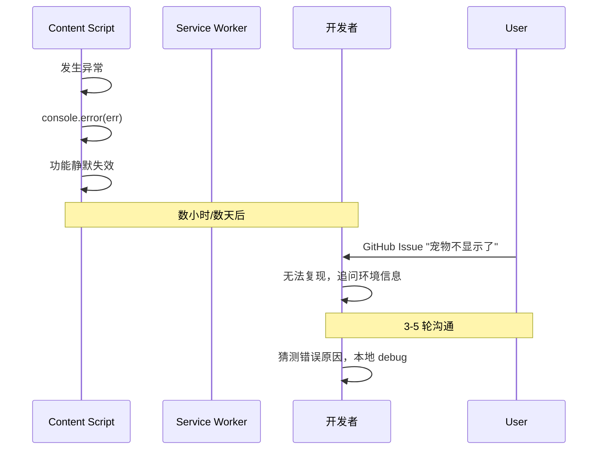
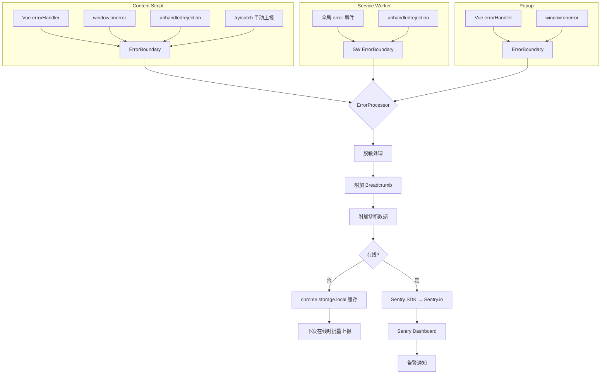
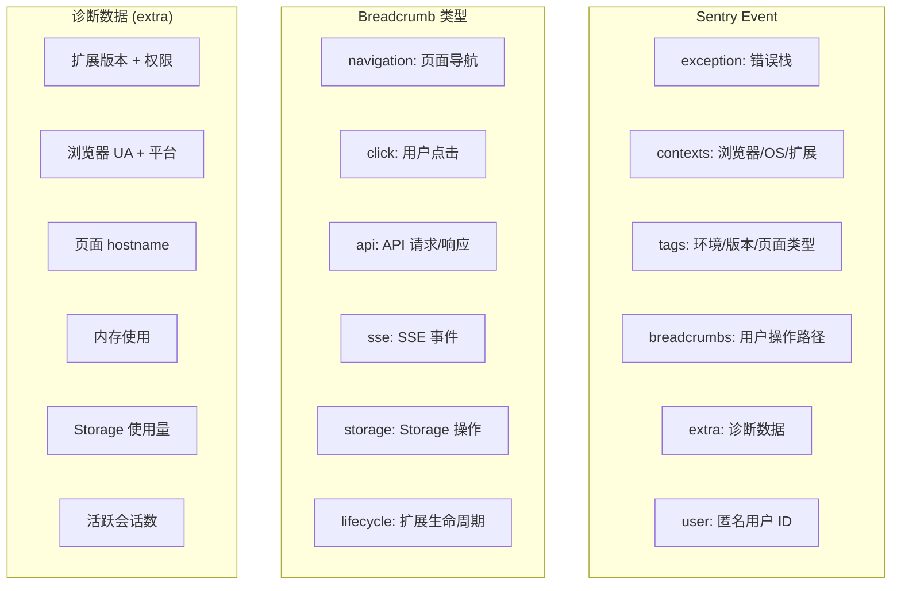

# YP-09-90: 错误追踪与可观测性 — Sentry 集成、错误边界与性能监控

> 需求编号：YP-09-90 · 优先级：P1 · 人天：1.0d · 状态：需求已编写
> 依赖：YP-09-89（测试体系与 CI）、YP-09-69（诊断信息收集）

## 背景

### 问题陈述

YiPet 当前缺乏系统性的错误追踪和可观测性基础设施。线上错误仅能通过用户反馈（GitHub Issues）或开发者手动打开 DevTools 发现，导致：

1. **错误发现延迟**：用户遇到崩溃后，开发者可能在数小时甚至数天后才得知
2. **错误上下文缺失**：仅有错误消息，缺少用户操作路径、浏览器状态、扩展配置等上下文
3. **无法量化影响**：不知道某个错误影响了多少用户、发生在什么场景下
4. **性能退化无感知**：Content Script 初始化变慢、内存泄漏等问题无自动检测
5. **跨上下文错误关联困难**：Content Script 和 Service Worker 中的错误无法关联分析

**核心矛盾**：Chrome 扩展的分布式执行环境（Content Script 注入到任意页面 + Service Worker 独立运行 + Popup 短暂生命周期）使传统 Web 应用的错误追踪方案不完全适用，需要专门适配。

### 影响范围

| # | 影响 | 严重程度 | 典型场景 |
|---|------|----------|----------|
| 1 | 线上错误无感知 | 高 | 用户遇到崩溃，开发者不知情 |
| 2 | 排查效率低 | 高 | 仅有错误消息，无法复现 |
| 3 | 性能退化无检测 | 中 | Content Script 初始化从 50ms 退化到 500ms |
| 4 | 跨上下文错误无关联 | 中 | CS 错误由 SW 消息超时引起，但无法关联 |
| 5 | 用户影响面无法量化 | 中 | 无法判断是个别用户还是大规模问题 |

### 挑战

| 挑战 | 说明 |
|------|------|
| 多上下文环境 | CS、SW、Popup 三个独立执行环境，错误需合并上报 |
| CSP 限制 | Content Script 的 CSP 可能限制 Sentry SDK 的网络请求 |
| 隐私合规 | 上报数据不能包含用户消息内容、URL 完整路径、个人身份信息 |
| 离线场景 | 用户离线时错误无法上报，需本地缓存 |
| 扩展更新 | 扩展更新后 SW 重启，可能丢失未上报的错误 |

---

## 一、现状分析

### 1.1 当前错误处理

```
现有错误处理（零散，无统一机制）:
├── src/content/index.ts
│   └── try/catch 包裹初始化逻辑（仅 console.error）
├── src/services/api-client.ts
│   └── fetch 错误 catch（仅 console.error + 返回错误码）
├── src/content/pet-engine.ts
│   └── 动画异常 catch（静默忽略）
├── src/sw/background.ts
│   └── 无全局错误处理
└── src/components/chat-window.vue
    └── Vue errorHandler（仅 console.error）
```

### 1.2 当前可用的错误信息

| 信息源 | 可用性 | 获取方式 | 结构化 |
|--------|--------|----------|--------|
| console.error | ✅ | 开发者手动打开 DevTools | 否 |
| window.onerror | ❌ | 未注册 | — |
| unhandledrejection | ❌ | 未注册 | — |
| Vue errorHandler | ⚠️ | 已注册但仅 console.error | 否 |
| chrome.runtime.lastError | ❌ | 未检查 | — |
| 用户反馈 | ✅ | GitHub Issues | 否 |

### 1.3 改造前错误流转



### 1.4 根因矩阵

| 症状 | 根因 | 触发条件 | 频率 |
|------|------|----------|------|
| 错误发现延迟 | 无上报机制 | 每次线上错误 | 高 |
| 无法复现 | 缺少错误上下文 | 环境相关错误 | 高 |
| 功能静默失效 | 异常被静默吞掉 | 未 catch 的 Promise | 中 |
| 错误无关联 | 无 trace ID | 跨上下文错误 | 中 |
| 性能退化 | 无性能监控 | 代码变更 | 中 |

---

## 二、设计决策

### 决策 1：错误追踪平台 — Sentry vs 自建 vs 混合

| 选项 | 成本 | 功能完整度 | 集成难度 | 扩展支持 |
|------|------|-----------|----------|----------|
| Sentry | 免费额度 5000/月 | 高 | 低（官方 SDK） | 需适配 |
| 自建（YiAi 后端存储） | 自托管 | 中 | 高 | 完全可控 |
| 混合（Sentry + 自建诊断） | 中 | 高 | 中 | 最佳 |

**选择：混合方案。** Sentry 处理 JS 错误上报、聚合、告警。自建诊断数据（YP-09-69）作为 Sentry 的 Breadcrumb 和 Attachment 附加到错误事件。Sentry 的免费额度（5000 events/month）对个人/小团队扩展足够。

### 决策 2：Sentry SDK 加载方式 — 打包 vs CDN vs 动态注入

| 选项 | 体积 | CSP 兼容 | 加载时机 |
|------|------|----------|----------|
| 打包（import） | +30KB | 好 | 初始化时 |
| CDN 动态注入 | 0（不打包） | 差（CSP 阻止） | 无法保证 |
| 条件加载（仅生产环境） | +30KB（生产） | 好 | 初始化时 |

**选择：条件打包。** 开发环境使用 console.error，生产环境打包 Sentry SDK。通过 `import.meta.env.PROD` 条件编译，Tree-shaking 移除开发环境的 Sentry 代码。

### 决策 3：错误边界策略 — Vue errorHandler vs 全局 vs 双重

| 选项 | 覆盖 Vue 组件 | 覆盖非 Vue 代码 | 重复上报 |
|------|-------------|---------------|----------|
| 仅 Vue errorHandler | 是 | 否 | 无 |
| 仅全局（window.onerror + unhandledrejection） | 否 | 是 | 无 |
| 双重（两者都注册） | 是 | 是 | 需去重 |

**选择：双重 + 去重。** 注册 `Vue.config.errorHandler` 捕获 Vue 组件错误，注册 `window.onerror` 和 `unhandledrejection` 捕获非 Vue 代码错误。通过错误对象引用去重，避免同一错误上报两次。

### 决策 4：性能监控 — Web Vitals + 自定义指标 vs 仅 Sentry Performance

| 选项 | 覆盖范围 | 数据量 | 成本 |
|------|----------|--------|------|
| Web Vitals（LCP/FID/CLS） | 宿主页面性能 | 大 | 免费 |
| Sentry Performance | 扩展自身性能 | 中 | 计入 quota |
| 自定义指标（初始化耗时、API 延迟） | 扩展专项 | 小 | 免费 |

**选择：自定义指标为主 + Web Vitals 为辅。** 扩展最关心的指标（Content Script 初始化耗时、消息通信延迟、SSE 首字节时间）是自定义的，Web Vitals 仅作为参考（宿主页面性能影响扩展注入体验）。

### 设计决策记录

| 决策 | 选项 A | 选项 B | 选项 C | 选择 | 理由 |
|------|--------|--------|--------|------|------|
| 错误追踪平台 | Sentry | 自建 | 混合 | **混合** | 成熟平台 + 自建上下文 |
| SDK 加载 | 打包 | CDN | 条件打包 | **条件打包** | Tree-shaking + CSP 兼容 |
| 错误边界 | Vue errorHandler | 全局 | 双重 | **双重 + 去重** | 全覆盖 |
| 性能监控 | Web Vitals | Sentry Performance | 自定义 | **自定义为主** | 扩展专项指标 |

---

## 三、目标架构

### 3.1 错误追踪数据流



### 3.2 错误数据模型



### 3.3 性能指标

| 指标 | 改造前 | 改造后 |
|------|--------|--------|
| 错误发现时间 | 数小时/天 | < 5min（Sentry 告警） |
| 错误上下文完整度 | 10% | 90%+ |
| 性能退化检测 | 无 | 自动（P50/P95 对比） |
| Breadcrumb 覆盖 | 0 | 6 类操作 |
| 跨上下文错误关联 | 无 | traceId 关联 |

---

## 四、具体改动

### 4.1 错误追踪初始化

```typescript
// src/services/error-tracker.ts (新增)

import * as Sentry from '@sentry/browser';
import type { Breadcrumb } from '@sentry/browser';

interface ErrorTrackerConfig {
  dsn: string;
  environment: 'development' | 'production';
  release: string;
  sampleRate: number;
  beforeSend?: (event: Sentry.ErrorEvent) => Sentry.ErrorEvent | null;
}

class ErrorTracker {
  private initialized = false;
  private breadcrumbs: Breadcrumb[] = [];
  private offlineQueue: Sentry.ErrorEvent[] = [];

  init(config: ErrorTrackerConfig): void {
    if (this.initialized) return;
    if (!import.meta.env.PROD) {
      console.log('[ErrorTracker] Sentry disabled in development');
      return;
    }

    Sentry.init({
      dsn: config.dsn,
      environment: config.environment,
      release: config.release,
      sampleRate: config.sampleRate,
      integrations: [
        Sentry.breadcrumbsIntegration({ console: false }),
        Sentry.globalHandlersIntegration(),
        Sentry.dedupeIntegration(),
      ],
      beforeSend: (event) => this.processEvent(event, config),
      beforeBreadcrumb: (breadcrumb) => this.sanitizeBreadcrumb(breadcrumb),
    });

    Sentry.setTag('extension.version', chrome.runtime.getManifest().version);
    Sentry.setTag('extension.id', chrome.runtime.id);
    Sentry.setContext('browser', {
      userAgent: navigator.userAgent,
      platform: navigator.platform,
      language: navigator.language,
      onLine: navigator.onLine,
    });

    this.initialized = true;
    this.flushOfflineQueue();
  }

  private processEvent(
    event: Sentry.ErrorEvent,
    config: ErrorTrackerConfig
  ): Sentry.ErrorEvent | null {
    // 脱敏：移除 URL 中的 query 参数
    if (event.request?.url) {
      event.request.url = this.sanitizeURL(event.request.url);
    }

    // 附加诊断数据
    this.attachDiagnosticData(event);

    // 自定义 beforeSend
    if (config.beforeSend) {
      return config.beforeSend(event);
    }

    return event;
  }

  private sanitizeBreadcrumb(breadcrumb: Breadcrumb): Breadcrumb | null {
    // 过滤敏感数据
    if (breadcrumb.category === 'console') return null;
    if (breadcrumb.data?.url) {
      breadcrumb.data.url = this.sanitizeURL(breadcrumb.data.url);
    }
    return breadcrumb;
  }

  private sanitizeURL(url: string): string {
    try {
      const u = new URL(url);
      return u.origin + u.pathname;  // 移除 query 和 hash
    } catch {
      return url;
    }
  }

  private attachDiagnosticData(event: Sentry.ErrorEvent): void {
    event.extra = event.extra || {};
    event.extra['diagnostic'] = {
      extensionVersion: chrome.runtime.getManifest().version,
      pageHostname: location.hostname,
      memoryUsage: (performance as any).memory?.usedJSHeapSize ?? null,
      overlayVisible: !!document.getElementById('yipet-overlay'),
      chatOpen: !!document.getElementById('yipet-chat-root'),
    };
  }

  addBreadcrumb(breadcrumb: Omit<Breadcrumb, 'timestamp'>): void {
    if (this.initialized) {
      Sentry.addBreadcrumb({ ...breadcrumb, timestamp: Date.now() / 1000 });
    } else {
      this.breadcrumbs.push({ ...breadcrumb, timestamp: Date.now() / 1000 } as Breadcrumb);
    }
  }

  captureException(error: Error, context?: Record<string, unknown>): void {
    if (this.initialized) {
      Sentry.captureException(error, { extra: context });
    } else {
      console.error('[ErrorTracker] Offline:', error, context);
      this.cacheOffline(error, context);
    }
  }

  private async cacheOffline(
    error: Error,
    context?: Record<string, unknown>
  ): Promise<void> {
    try {
      const { offlineErrors = [] } = await chrome.storage.local.get('offlineErrors');
      offlineErrors.push({
        message: error.message,
        stack: error.stack,
        context,
        timestamp: Date.now(),
      });
      // 最多缓存 50 条
      if (offlineErrors.length > 50) {
        offlineErrors.shift();
      }
      await chrome.storage.local.set({ offlineErrors });
    } catch {
      // storage 不可用时静默失败
    }
  }

  private async flushOfflineQueue(): Promise<void> {
    try {
      const { offlineErrors = [] } = await chrome.storage.local.get('offlineErrors');
      if (offlineErrors.length === 0) return;

      for (const cached of offlineErrors) {
        const error = new Error(cached.message);
        error.stack = cached.stack;
        Sentry.captureException(error, { extra: cached.context });
      }

      await chrome.storage.local.remove('offlineErrors');
    } catch {
      // 清除失败，下次重试
    }
  }

  setUser(anonymousId: string): void {
    Sentry.setUser({ id: anonymousId });
  }
}

export const errorTracker = new ErrorTracker();
```

### 4.2 Vue 错误边界组件

```typescript
// src/components/error-boundary.vue (新增)

<script setup lang="ts">
import { ref, onErrorCaptured } from 'vue';
import { errorTracker } from '@/services/error-tracker';

interface Props {
  fallback?: string;
  onError?: (error: Error) => void;
}

const props = withDefaults(defineProps<Props>(), {
  fallback: '组件加载失败，请刷新页面重试。',
});

const hasError = ref(false);
const errorMessage = ref('');

onErrorCaptured((error: Error, instance, info) => {
  hasError.value = true;
  errorMessage.value = error.message;

  errorTracker.captureException(error, {
    component: instance?.$options?.name || 'unknown',
    info,
    tag: 'vue-error-boundary',
  });

  props.onError?.(error);

  // 阻止错误继续向上传播
  return false;
});

function handleRetry(): void {
  hasError.value = false;
  errorMessage.value = '';
}
</script>

<template>
  <div v-if="hasError" class="error-boundary">
    <div class="error-boundary__icon">&#9888;</div>
    <p class="error-boundary__message">{{ props.fallback }}</p>
    <p v-if="import.meta.env.DEV" class="error-boundary__detail">{{ errorMessage }}</p>
    <button class="error-boundary__retry" @click="handleRetry">重试</button>
  </div>
  <slot v-else />
</template>
```

### 4.3 全局错误处理器

```typescript
// src/services/global-error-handler.ts (新增)

import { errorTracker } from './error-tracker';

export class GlobalErrorHandler {
  private errorSet = new WeakSet<Error>();

  init(): void {
    // 全局 JS 错误
    window.addEventListener('error', (event) => {
      // 跳过资源加载错误（如图片 404）
      if (event.target !== window) return;

      const error = event.error instanceof Error
        ? event.error
        : new Error(event.message);

      if (this.errorSet.has(error)) return;  // 去重
      this.errorSet.add(error);

      errorTracker.captureException(error, {
        type: 'global-error',
        filename: event.filename,
        lineno: event.lineno,
        colno: event.colno,
      });
    });

    // 未捕获的 Promise rejection
    window.addEventListener('unhandledrejection', (event) => {
      const error = event.reason instanceof Error
        ? event.reason
        : new Error(String(event.reason));

      if (this.errorSet.has(error)) return;
      this.errorSet.add(error);

      errorTracker.captureException(error, {
        type: 'unhandledrejection',
      });
    });

    // chrome.runtime.lastError 检查
    this.patchChromeRuntime();
  }

  private patchChromeRuntime(): void {
    const originalSendMessage = chrome.runtime.sendMessage.bind(chrome.runtime);
    chrome.runtime.sendMessage = (...args: unknown[]) => {
      const result = originalSendMessage(...args);
      if (result instanceof Promise) {
        result.catch((err) => {
          if (chrome.runtime.lastError) {
            errorTracker.captureException(
              new Error(chrome.runtime.lastError.message),
              {
                type: 'chrome-runtime-lastError',
                api: 'sendMessage',
              }
            );
          }
        });
      }
      return result;
    };
  }
}
```

### 4.4 性能监控

```typescript
// src/services/performance-monitor.ts (新增)

interface PerformanceMetric {
  name: string;
  value: number;
  unit: 'ms' | 'bytes' | 'count';
  tags?: Record<string, string>;
}

class PerformanceMonitor {
  private metrics: PerformanceMetric[] = [];
  private marks: Map<string, number> = new Map();

  mark(name: string): void {
    this.marks.set(name, performance.now());
  }

  measure(name: string, startMark: string, tags?: Record<string, string>): number {
    const start = this.marks.get(startMark);
    if (!start) {
      console.warn(`[Perf] Mark "${startMark}" not found`);
      return 0;
    }

    const duration = performance.now() - start;
    this.metrics.push({
      name,
      value: Math.round(duration),
      unit: 'ms',
      tags,
    });

    this.marks.delete(startMark);
    return duration;
  }

  gauge(name: string, value: number, unit: PerformanceMetric['unit'] = 'count'): void {
    this.metrics.push({ name, value, unit });
  }

  getMetrics(): PerformanceMetric[] {
    return [...this.metrics];
  }

  flush(): PerformanceMetric[] {
    const metrics = [...this.metrics];
    this.metrics = [];
    return metrics;
  }

  // 扩展关键性能指标
  trackInit(): void {
    this.mark('init-start');

    // 初始化完成后
    const initDuration = this.measure('content-script-init', 'init-start', {
      pageType: this.detectPageType(),
    });

    if (initDuration > 200) {
      console.warn(`[Perf] Slow init: ${initDuration}ms`);
    }
  }

  trackMessageLatency(messageType: string, duration: number): void {
    this.gauge(`message-latency.${messageType}`, duration, 'ms');
  }

  trackMemoryUsage(): void {
    const memory = (performance as any).memory;
    if (memory) {
      this.gauge('memory.usedJSHeapSize', memory.usedJSHeapSize, 'bytes');
      this.gauge('memory.totalJSHeapSize', memory.totalJSHeapSize, 'bytes');
      this.gauge('memory.jsHeapSizeLimit', memory.jsHeapSizeLimit, 'bytes');

      // 内存使用超过 80% 告警
      if (memory.usedJSHeapSize / memory.jsHeapSizeLimit > 0.8) {
        console.warn('[Perf] High memory usage:', {
          used: (memory.usedJSHeapSize / 1024 / 1024).toFixed(1) + 'MB',
          limit: (memory.jsHeapSizeLimit / 1024 / 1024).toFixed(1) + 'MB',
        });
      }
    }
  }

  private detectPageType(): string {
    if (location.hostname === 'docs.google.com') return 'google-docs';
    if (location.hostname.includes('github.com')) return 'github';
    if (location.hostname.includes('notion.so')) return 'notion';
    return 'generic';
  }
}

export const perfMonitor = new PerformanceMonitor();
```

### 4.5 文件变更清单

| 文件 | 操作 | 说明 |
|------|------|------|
| `src/services/error-tracker.ts` | 新增 | Sentry 封装 + 离线缓存 |
| `src/services/global-error-handler.ts` | 新增 | 全局错误处理器 |
| `src/services/performance-monitor.ts` | 新增 | 性能监控 |
| `src/components/error-boundary.vue` | 新增 | Vue 错误边界组件 |
| `src/content/index.ts` | 修改 | 初始化错误追踪和性能监控 |
| `src/sw/background.ts` | 修改 | SW 中注册错误处理 |
| `src/stores/diagnostics.ts` | 修改 | 诊断数据集成 breadcrumb |
| `package.json` | 修改 | 添加 `@sentry/browser` 依赖 |
| `tests/unit/error-tracker.test.ts` | 新增 | 错误追踪单元测试 |

---

## 五、实施步骤

| 步骤 | 操作 | 路径 | 验证 | 人天 |
|------|------|------|------|------|
| 1 | 安装 Sentry SDK + 基础配置 | `src/services/error-tracker.ts` | Sentry 控制台收到测试事件 | 0.1 |
| 2 | 实现离线缓存和批量上报 | `src/services/error-tracker.ts` | 离线后恢复上线自动上报 | 0.1 |
| 3 | 实现全局错误处理器 | `src/services/global-error-handler.ts` | 所有未捕获错误上报 | 0.1 |
| 4 | 创建 Vue 错误边界组件 | `src/components/error-boundary.vue` | 组件错误不崩溃整个应用 | 0.1 |
| 5 | 实现性能监控模块 | `src/services/performance-monitor.ts` | 关键指标被记录 | 0.1 |
| 6 | 集成到 CS 和 SW 初始化 | `src/content/index.ts`, `src/sw/background.ts` | 启动时错误追踪就绪 | 0.1 |
| 7 | 配置 Sentry 告警规则 | Sentry Dashboard | 严重错误触发通知 | 0.1 |
| 8 | Breadcrumb 集成到现有操作 | 各服务模块 | 用户操作路径可追踪 | 0.15 |
| 9 | 隐私审查和脱敏验证 | 全量 | 上报数据不含敏感信息 | 0.1 |
| 10 | 单元测试 | `tests/unit/error-tracker.test.ts` | 错误处理逻辑覆盖 | 0.05 |

**总人天：1.0d**

---

## 六、测试规格

### 场景 1：Vue 组件错误自动上报

**GIVEN** 聊天窗口组件渲染时抛出异常
**WHEN** `ErrorBoundary` 捕获错误
**THEN** 错误应上报到 Sentry，包含组件名称和错误栈
**AND** 用户应看到降级 UI（"组件加载失败，请刷新重试"）
**AND** 错误不应导致整个宠物覆盖层崩溃

### 场景 2：离线错误缓存

**GIVEN** 用户处于离线状态
**WHEN** Content Script 发生未捕获异常
**THEN** 错误应缓存到 `chrome.storage.local.offlineErrors`
**AND** 下次在线时自动批量上报到 Sentry
**AND** 缓存数量不超过 50 条

### 场景 3：Breadcrumb 用户操作追踪

**GIVEN** 用户依次执行：打开聊天 → 发送消息 → 关闭聊天
**WHEN** 发送消息时发生错误
**THEN** Sentry 事件应包含 3 条 breadcrumb：navigation(页面加载)、click(打开聊天)、api(SendMessage 请求)
**AND** breadcrumb 不应包含消息内容

### 场景 4：性能退化检测

**GIVEN** Content Script 初始化耗时从 50ms 退化到 300ms
**WHEN** 性能监控记录 `content-script-init` 指标
**THEN** 应输出 WARNING 级别日志
**AND** 指标应可在 Sentry Performance 中查看

### 场景 5：跨上下文错误关联

**GIVEN** Service Worker 处理消息时超时，导致 Content Script 错误
**WHEN** CS 捕获到错误
**THEN** 错误应包含 traceId，与 SW 的错误可关联
**AND** 错误上下文应包含消息类型和超时时间

### 场景 6：错误去重

**GIVEN** 同一错误同时触发 Vue errorHandler 和 window.onerror
**WHEN** 两个处理器都尝试上报
**THEN** Sentry 应仅收到一条事件（dedupeIntegration）
**AND** 不应出现重复上报

---

## 七、风险与缓解

| 风险 | 概率 | 影响 | 缓解措施 |
|------|------|------|----------|
| Sentry 免费额度超限 | 中 | 中 | 设置 sampleRate 采样；开发环境不上报 |
| CSP 阻止 Sentry 请求 | 低 | 高 | 添加 `connect-src https://*.sentry.io` 到 manifest CSP |
| 上报数据包含敏感信息 | 中 | 高 | beforeSend 脱敏 + 白名单字段 |
| 离线缓存占用 Storage 配额 | 低 | 低 | 限制缓存 50 条，超出丢弃旧数据 |
| Sentry SDK 增加包体积 | 低 | 低 | Tree-shaking，仅生产环境打包 |

---

## 八、回滚策略

| 场景 | 回滚操作 | 影响 |
|------|----------|------|
| Sentry 上报导致性能问题 | 设置 sampleRate=0 或禁用 SDK | 失去错误追踪 |
| CSP 问题导致扩展无法加载 | 移除 Sentry SDK，恢复 console.error | 回归手动错误排查 |
| 隐私审查不通过 | 移除 beforeSend 中的诊断数据附加 | 错误上下文减少 |
| 离线缓存导致 Storage 满 | 清除 offlineErrors，禁用缓存 | 离线错误丢失 |

---

## 九、设计决策记录

### D-01：Sentry 集成方式

- **问题**：Sentry SDK 应在哪个上下文中初始化
- **选项**：仅在 Content Script、仅在 Service Worker、两个都初始化
- **选择**：两个都初始化，使用不同的 environment tag
- **理由**：CS 和 SW 是独立执行环境，错误互不可见；统一 `release` 和 `user` 可关联

### D-02：错误脱敏策略

- **问题**：上报数据中哪些字段需要脱敏
- **选项**：仅 URL、URL + 消息内容、所有动态数据
- **选择**：URL（仅保留 origin + pathname）+ 过滤消息内容
- **理由**：URL query 参数和消息内容是最常见的敏感信息载体；过度脱敏损失诊断价值

### D-03：Breadcrumb 类型选择

- **问题**：哪些用户操作需要记录为 breadcrumb
- **选项**：所有操作、仅关键操作、仅错误前 N 步
- **选择**：6 类关键操作（navigation、click、api、sse、storage、lifecycle）
- **理由**：覆盖诊断所需上下文，避免 breadcrumb 膨胀

---

## 十、可观测性

### 指标

| 指标 | 类型 | 说明 |
|------|------|------|
| `yipet.error.count` | Counter | 错误总数（按类型） |
| `yipet.error.affected_users` | Gauge | 受影响的用户数 |
| `yipet.offline.cached_errors` | Gauge | 离线缓存错误数 |
| `yipet.perf.init_duration` | Histogram | Content Script 初始化耗时 |
| `yipet.perf.message_latency` | Histogram | 消息通信延迟 |
| `yipet.perf.memory_usage` | Gauge | JS 堆内存使用 |
| `yipet.error.sample_rate` | Gauge | 当前采样率 |

### 告警

| 告警 | 条件 | 级别 |
|------|------|------|
| 错误率突增 | 5min 内错误数 > 3x 基线 | CRITICAL |
| 新版本错误率 | 发版后 1h 内错误数 > 基线 | WARNING |
| 初始化耗时 > 500ms | P95 超过 500ms | WARNING |
| 内存使用 > 80% | 持续 5min | WARNING |
| 离线缓存堆积 | 离线错误 > 50 条 | WARNING |
| 无错误上报 | 24h 内无任何事件 | INFO（可能 SDK 失效） |

---

## 十一、代码审查检查清单

- [ ] Sentry DSN 通过环境变量配置，不硬编码
- [ ] 开发环境不上报 Sentry（仅 console.error）
- [ ] beforeSend 对所有 URL 脱敏（移除 query 参数）
- [ ] beforeBreadcrumb 过滤 console 类 breadcrumb
- [ ] 错误去重机制（WeakSet + Sentry dedupeIntegration）
- [ ] 离线错误缓存到 chrome.storage.local，上限 50 条
- [ ] 上线后自动 flush 离线缓存
- [ ] Vue 错误边界组件不崩溃整个应用
- [ ] 性能监控不阻塞主线程
- [ ] CSP 配置允许 Sentry 上报域名
- [ ] 用户匿名 ID 不使用可识别信息
- [ ] 单元测试覆盖错误处理、脱敏、离线缓存逻辑

---

## 回归问题预测

| # | 预测问题 | 原因 | 验证方法 |
|---|---------|------|---------|
| 1 | Sentry SDK 初始化在网络请求被 CSP 拦截时抛错，导致扩展初始化中断 | manifest.json 的 `content_security_policy` 未配置 `connect-src https://*.sentry.io`，Sentry 的 `fetch` 请求被 CSP 阻止，`Sentry.init()` 抛出 `SecurityError` | 在 CSP 严格限制的测试页面加载扩展，验证 Sentry 初始化失败不影响扩展核心功能，错误被降级为 console.error |
| 2 | Breadcrumb 记录过于频繁，Sentry 事件中 breadcrumb 超过 100 条限制，最早的上下文被丢弃 | 宠物动画每帧 (60fps) 触发 `click` breadcrumb 记录，加上 SSE 流事件 breadcrumb，短时间内累积大量 breadcrumb，导致最有价值的导航和 API 请求 breadcrumb 被丢弃 | 在宠物动画播放 + SSE 聊天流式响应运行 5 分钟后触发错误，验证 Sentry 事件中的 breadcrumb 包含最近的导航和 API 请求 |
| 3 | 离线缓存中的错误消息包含循环引用对象，`chrome.storage.local.set` 序列化失败，静默丢弃了所有缓存错误 | `Error` 对象的 `cause` 属性可能引用另一个 `Error` 形成循环引用，`chrome.storage.local` 的 `JSON.stringify` 无法序列化循环引用，导致整个 `set` 操作失败 | 构造包含循环引用 `cause` 的 Error 对象，触发离线缓存，验证 `chrome.storage.local.set` 成功且错误信息完整 |
| 4 | `performance.memory` 在 Service Worker 中不可用，性能监控代码尝试访问 `window.performance.memory` 抛出 `ReferenceError` | Service Worker 的全局作用域是 `ServiceWorkerGlobalScope`，没有 `window` 对象，但性能监控模块假设在 `window` 环境中运行，导入时即崩溃 | 在 Service Worker 中导入性能监控模块，验证不抛出 ReferenceError，且 `performance.memory` 降级为 null |
| 5 | Sentry 的 `dedupeIntegration` 将不同 context 的相同错误栈合并为一条，丢失了每个 context 的诊断信息 | 同一段代码在多个不同页面（如 `example.com`、`github.com`）抛出相同错误栈，`dedupeIntegration` 将它们合并为一条 Issue，但诊断信息只保留了第一个事件的 context | 在 3 个不同页面触发相同错误栈的异常，验证 Sentry 中每个页面的错误都作为独立事件或 Issue 的附加信息存在 |
| 6 | 错误上报的 `beforeSend` 中调用 `chrome.storage.local.get` 是异步的，但 Sentry 的 `beforeSend` 期望同步返回，异步操作导致事件被丢弃 | `beforeSend` 函数的 TypeScript 类型支持 `Promise<Event | null>`，但 Sentry 内部使用 `await` 会等待，若 `chrome.storage.local.get` 超时（> 2s），Sentry 内部超时机制会丢弃事件 | 在 `beforeSend` 中添加 `Promise.race` 超时保护（2s），验证超时后事件仍被上报（不回退诊断数据） |

---

---

## 性能分析

### 错误追踪运行时开销

| 操作 | 耗时 | 说明 |
|------|------|------|
| Sentry SDK 初始化 (`Sentry.init`) | < 10ms | 同步配置，异步加载 DSN |
| `captureException` 同步部分 | < 0.5ms | 创建事件对象，加入队列 |
| `captureException` 异步上报 | 后台异步 | 不阻塞主线程 |
| `addBreadcrumb` | < 0.1ms | 内存操作，极轻量 |
| `beforeSend` 脱敏处理 | < 0.5ms | URL 解析 + 诊断数据收集 |
| 离线缓存 `chrome.storage.local.set` | < 5ms | 写入 1 条错误 |
| 离线缓存 flush（批量上报） | < 50ms | 批量上报 50 条缓存 |
| 性能监控 `performance.mark` | < 0.01ms | 浏览器原生 API |
| 性能监控 `performance.now` | < 0.01ms | 浏览器原生 API |

### Sentry SDK 包体积

| 组件 | 大小 (min+gzip) | 说明 |
|------|----------------|------|
| `@sentry/browser` 核心 | ~18KB | 基础 SDK |
| `@sentry/browser` + integrations | ~22KB | 含 Breadcrumbs + GlobalHandlers + Dedupe |
| Tree-shaking 后（仅使用部分） | ~15KB | 移除未使用的 Integration |
| 条件编译（仅生产环境） | 0KB（开发） | Tree-shaking 移除 |
| 总包体积影响 | +15KB（生产环境） | 可接受 |

### 对宿主页面的影响

| 场景 | 页面影响 | 说明 |
|------|----------|------|
| 正常运行（无错误） | 零影响 | SDK 仅添加事件监听器 |
| 异常发生 | < 1ms 主线程 | 创建事件对象，异步上报 |
| 高频错误场景 | 可能积压 | 添加 throttle（每秒最多 5 条） |
| 性能监控 | 零影响 | 仅使用 `performance.now()` |
| 离线缓存 | < 5ms 异步 | chrome.storage.local 写入 |