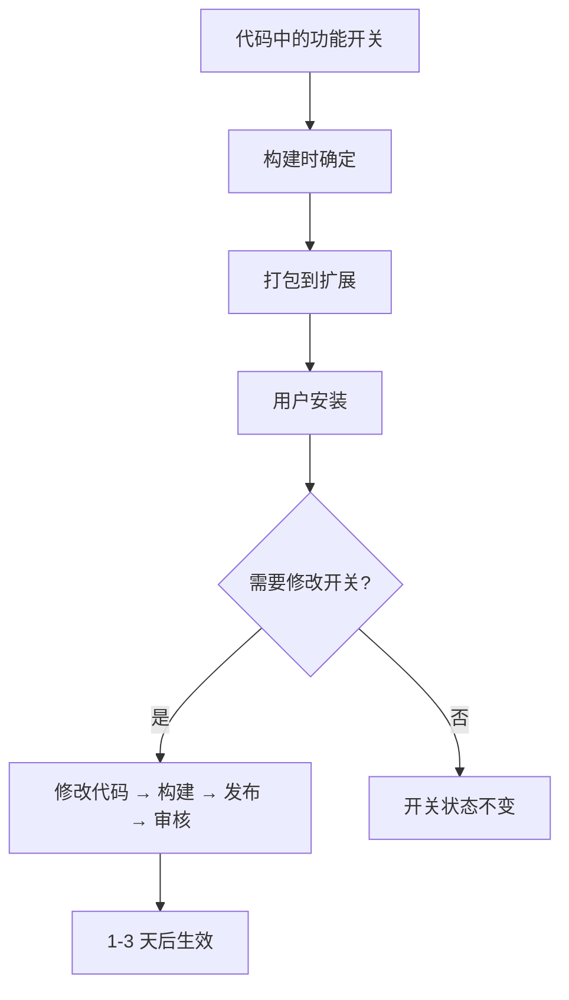
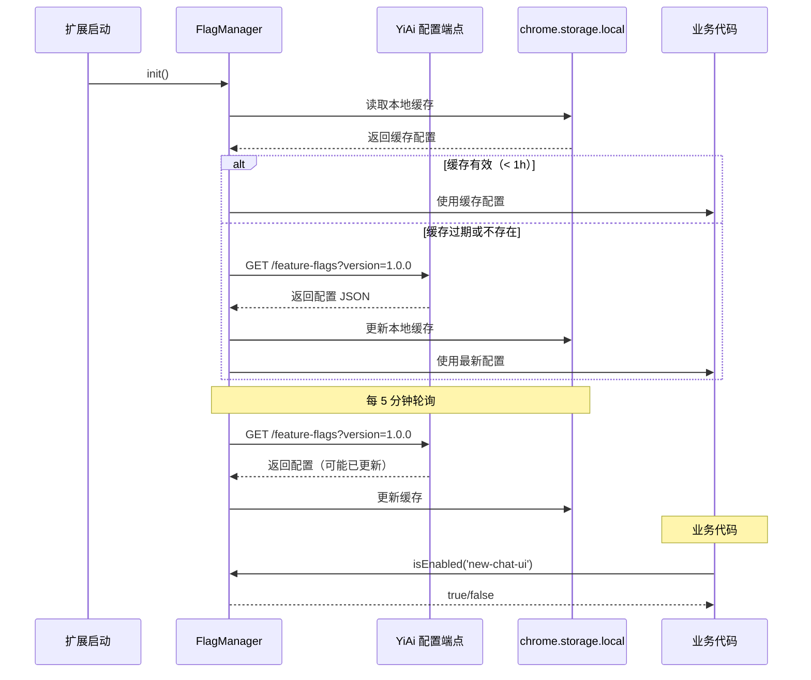
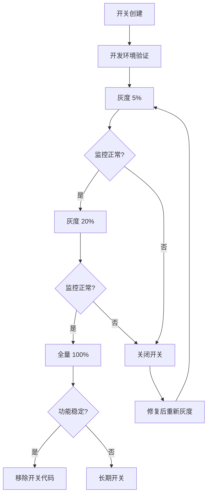

# YP-09-91: 特性开关系统 — 远程配置、渐进式发布与紧急熔断

> 需求编号：YP-09-91 · 优先级：P1 · 人天：0.5d · 状态：需求已编写
> 依赖：无

## 背景

### 问题陈述

YiPet 当前所有功能通过代码分支控制发布——功能开发完成合并到 main 则全量上线，出现问题只能回滚整个版本。这导致：

1. **发布风险高**：新功能无法灰度验证，一次上线影响所有用户
2. **回滚代价大**：功能有问题只能回滚整个扩展版本，而 Chrome Web Store 审核周期 1-3 天
3. **无法 A/B 测试**：无法对比不同 UI/功能方案的用户体验数据
4. **紧急修复慢**：即使是一条小 bug 的修复，也需要走完整发布流程
5. **环境差异难管理**：开发/测试/生产环境使用不同配置，在代码中硬编码环境判断

**核心矛盾**：Chrome 扩展的发布周期（审核 1-3 天）远慢于 Web 应用的即时部署，无法快速响应线上问题。需要一个独立于代码发布的特性开关机制。

### 影响范围

| # | 影响 | 严重程度 | 典型场景 |
|---|------|----------|----------|
| 1 | 新功能无灰度验证 | 高 | 聊天窗口重构后全量上线，大量用户反馈 |
| 2 | 回滚周期长 | 高 | 严重 bug 需等 1-3 天审核 |
| 3 | 无法 A/B 测试 | 中 | 两种 UI 方案无法对比效果 |
| 4 | 紧急修复慢 | 中 | 小 bug 修复也需走完整发布流程 |
| 5 | 环境配置混乱 | 低 | 开发/生产环境判断散落在代码中 |

### 挑战

| 挑战 | 说明 |
|------|------|
| 远程配置不可靠 | 网络可能不可用，需本地缓存降级 |
| 配置同步延迟 | Chrome 扩展无推送机制，配置更新有延迟 |
| 跨上下文一致性 | CS 和 SW 需使用相同的开关状态 |
| 百分比计算 | 用户分组需稳定（同一用户始终在同一组） |
| 配置安全 | 开关配置不能包含敏感信息（如 API key） |

---

## 一、现状分析

### 1.1 当前功能发布流程

```
功能开发完成
  │
  ▼
合并到 main 分支
  │
  ▼
构建新版本扩展
  │
  ▼
提交到 Chrome Web Store 审核
  │ 审核周期 1-3 天
  ▼
全量发布到所有用户
  │
  ▼
等待用户反馈
  │ 反馈收集 1-7 天
  ▼
{ 发现问题? }
  ├── 是 → 紧急修复 → 提交新版本 → 审核 1-3 天 → 全量发布
  └── 否 → 功能稳定
```

### 1.2 当前环境判断

```typescript
// 零散在各处的环境判断
if (import.meta.env.DEV) {
  console.log('debug info');
}

if (import.meta.env.PROD) {
  // 生产环境行为
}

// 硬编码的功能开关
const ENABLE_NEW_CHAT = false;  // 开发中，手动切换
const ENABLE_RAG = true;        // 已上线，但无法关闭
```

### 1.3 改造前配置流



### 1.4 根因矩阵

| 症状 | 根因 | 触发条件 | 频率 |
|------|------|----------|------|
| 无法灰度发布 | 开关在构建时确定 | 每次新功能上线 | 高 |
| 紧急下线慢 | 无远程熔断 | 线上发现严重 bug | 中 |
| 无法 A/B 测试 | 无用户分组 | 功能方案对比需求 | 中 |
| 环境配置分散 | 无统一配置管理 | 开发/测试/生产切换 | 中 |

---

## 二、设计决策

### 决策 1：配置存储 — 远程服务 vs chrome.storage vs 本地文件

| 选项 | 实时性 | 离线可用 | 复杂度 |
|------|--------|----------|--------|
| 远程服务（YiAi 配置端点） | 高 | 否 | 中 |
| chrome.storage.local | 低 | 是 | 低 |
| 远程 + 本地缓存（混合） | 高 | 是 | 中 |

**选择：远程 + 本地缓存混合。** 扩展启动时从 YiAi 拉取最新配置，缓存到 `chrome.storage.local`。如果网络不可用，使用本地缓存。YiAi 配置端点超时 2s，避免阻塞启动。

### 决策 2：开关类型 — 仅 Boolean vs Boolean + Number + String vs 全类型

| 选项 | 灵活性 | 复杂度 | 典型场景 |
|------|--------|--------|----------|
| 仅 Boolean | 低 | 低 | 功能开关 |
| Boolean + Number + String | 中 | 中 | 开关 + 参数 + 文案 |
| 全类型（JSON） | 高 | 高 | 任意配置 |

**选择：Boolean + Number + String + JSON。** Boolean 用于功能开关，Number 用于百分比/阈值，String 用于文案/URL，JSON 用于复杂配置。YiPet 的配置项少（< 20 个），不需要过度设计。

### 决策 3：用户分组算法 — 随机 vs 用户 ID hash vs 固定比例

| 选项 | 稳定性 | 均匀性 | 实现 |
|------|--------|--------|------|
| 随机（Math.random） | 差（每次不同） | 好 | 简单 |
| 用户 ID hash | 好（同用户稳定） | 好 | 中 |
| 固定比例（按序分配） | 好 | 好 | 中 |

**选择：用户 ID hash。** 使用匿名用户 ID（`chrome.runtime.id` 或生成的 UUID）的 hash 值对 100 取模，得到 0-99 的稳定分组。同一用户始终在同一组，支持百分比灰度（如 `rollout: 20` 表示 0-19 组启用）。

### 决策 4：配置更新机制 — 轮询 vs Push vs 混合

| 选项 | 实时性 | 资源消耗 | 实现 |
|------|--------|----------|------|
| 定时轮询（每 5 分钟） | 中 | 中 | 简单 |
| Service Worker Push | 高 | 低 | 复杂 |
| 混合（Push + 轮询降级） | 高 | 中 | 复杂 |

**选择：定时轮询 + 手动刷新。** 扩展启动时拉取一次，之后每 5 分钟轮询。Popup 打开时主动拉取最新配置。避免 Push 的复杂性（需要 Web Push API + 服务端推送基础设施）。

### 设计决策记录

| 决策 | 选项 A | 选项 B | 选项 C | 选择 | 理由 |
|------|--------|--------|--------|------|------|
| 配置存储 | 远程 | chrome.storage | 混合 | **混合** | 实时 + 离线 |
| 开关类型 | 仅 Boolean | Boolean+Number+String | 全类型 | **Boolean+Number+String+JSON** | 足够灵活 |
| 用户分组 | 随机 | 用户 ID hash | 固定比例 | **用户 ID hash** | 稳定分组 |
| 更新机制 | 轮询 | Push | 混合 | **轮询+手动** | 简单可靠 |

---

## 三、目标架构

### 3.1 特性开关数据流



### 3.2 开关生命周期



### 3.3 性能指标

| 指标 | 改造前 | 改造后 |
|------|--------|--------|
| 功能下线时间 | 1-3 天（审核） | < 5 分钟（轮询生效） |
| 灰度发布能力 | 无 | 5% → 20% → 100% |
| A/B 测试能力 | 无 | 用户 ID hash 分组 |
| 配置更新延迟 | 无（不可远程更新） | < 5 分钟 |
| 离线可用性 | N/A | 本地缓存降级 |

---

## 四、具体改动

### 4.1 特性开关管理器

```typescript
// src/services/feature-flags.ts (新增)

type FlagValue = boolean | number | string | Record<string, unknown>;

interface FlagDefinition {
  key: string;
  defaultValue: FlagValue;
  description: string;
  type: 'boolean' | 'number' | 'string' | 'json';
  rollout?: number;           // 灰度百分比 (0-100)
  killSwitch?: boolean;       // 是否为紧急熔断开关
  owner?: string;             // 负责人
}

interface RemoteConfig {
  version: string;
  updatedAt: string;
  flags: Record<string, FlagValue>;
  rollouts: Record<string, number>;  // flag key → rollout percentage
}

class FeatureFlagManager {
  private flags: Map<string, FlagDefinition> = new Map();
  private remoteConfig: RemoteConfig | null = null;
  private userId: string = '';
  private pollingTimer: ReturnType<typeof setInterval> | null = null;
  private readonly POLL_INTERVAL = 5 * 60 * 1000;  // 5 分钟
  private readonly CACHE_TTL = 60 * 60 * 1000;      // 1 小时
  private readonly CONFIG_URL = 'http://localhost:10086/api/feature-flags';

  register(definition: FlagDefinition): void {
    this.flags.set(definition.key, definition);
  }

  async init(userId: string): Promise<void> {
    this.userId = userId;

    // 尝试从本地缓存加载
    const cached = await this.loadFromCache();
    if (cached && this.isCacheValid(cached)) {
      this.remoteConfig = cached;
    }

    // 异步拉取最新配置
    await this.fetchRemoteConfig();

    // 启动定时轮询
    this.startPolling();
  }

  isEnabled(key: string): boolean {
    const definition = this.flags.get(key);
    if (!definition) {
      console.warn(`[FeatureFlags] Unknown flag: ${key}`);
      return false;
    }

    // 远程配置覆盖
    const remoteValue = this.remoteConfig?.flags[key];
    if (remoteValue !== undefined) {
      if (typeof remoteValue === 'boolean') {
        return this.applyRollout(key, remoteValue);
      }
      return !!remoteValue;
    }

    // 默认值
    if (typeof definition.defaultValue === 'boolean') {
      return this.applyRollout(key, definition.defaultValue);
    }

    return !!definition.defaultValue;
  }

  getValue<T extends FlagValue>(key: string): T {
    const definition = this.flags.get(key);
    const remoteValue = this.remoteConfig?.flags[key];

    if (remoteValue !== undefined) {
      return remoteValue as T;
    }

    if (definition) {
      return definition.defaultValue as T;
    }

    console.warn(`[FeatureFlags] Unknown flag: ${key}`);
    return false as unknown as T;
  }

  private applyRollout(key: string, baseValue: boolean): boolean {
    if (!baseValue) return false;

    const rollout = this.remoteConfig?.rollouts[key] ?? 100;
    if (rollout >= 100) return true;
    if (rollout <= 0) return false;

    // 用户分组：hash(userId + key) % 100
    const bucket = this.hashUser(key);
    return bucket < rollout;
  }

  private hashUser(key: string): number {
    const str = `${this.userId}:${key}`;
    let hash = 0;
    for (let i = 0; i < str.length; i++) {
      const char = str.charCodeAt(i);
      hash = ((hash << 5) - hash) + char;
      hash = hash & hash;  // Convert to 32bit integer
    }
    return Math.abs(hash) % 100;
  }

  private async loadFromCache(): Promise<RemoteConfig | null> {
    try {
      const result = await chrome.storage.local.get('featureFlagsCache');
      return result.featureFlagsCache || null;
    } catch {
      return null;
    }
  }

  private isCacheValid(cached: RemoteConfig): boolean {
    const cacheAge = Date.now() - new Date(cached.updatedAt).getTime();
    return cacheAge < this.CACHE_TTL;
  }

  private async fetchRemoteConfig(): Promise<void> {
    try {
      const controller = new AbortController();
      const timeoutId = setTimeout(() => controller.abort(), 2000);

      const response = await fetch(
        `${this.CONFIG_URL}?version=${chrome.runtime.getManifest().version}`,
        { signal: controller.signal }
      );
      clearTimeout(timeoutId);

      if (!response.ok) throw new Error(`HTTP ${response.status}`);

      const config: RemoteConfig = await response.json();
      this.remoteConfig = config;

      // 更新本地缓存
      await chrome.storage.local.set({ featureFlagsCache: config });
    } catch (err) {
      console.warn('[FeatureFlags] Failed to fetch remote config:', err);
      // 使用本地缓存降级（已在 init 中加载）
    }
  }

  private startPolling(): void {
    this.pollingTimer = setInterval(() => {
      this.fetchRemoteConfig();
    }, this.POLL_INTERVAL);
  }

  destroy(): void {
    if (this.pollingTimer) {
      clearInterval(this.pollingTimer);
      this.pollingTimer = null;
    }
  }

  getAllFlags(): Array<{ key: string; value: FlagValue; rollout: number }> {
    const result: Array<{ key: string; value: FlagValue; rollout: number }> = [];
    for (const [key, def] of this.flags) {
      result.push({
        key,
        value: this.getValue(key),
        rollout: this.remoteConfig?.rollouts[key] ?? 100,
      });
    }
    return result;
  }
}

export const featureFlags = new FeatureFlagManager();
```

### 4.2 开关注册清单

```typescript
// src/config/feature-flags.ts (新增)

import { featureFlags } from '@/services/feature-flags';

// 所有特性开关统一注册
featureFlags.register({
  key: 'new-chat-ui',
  defaultValue: false,
  description: '新版聊天窗口 UI',
  type: 'boolean',
  rollout: 20,       // 20% 灰度
  killSwitch: false,
  owner: '陈铭',
});

featureFlags.register({
  key: 'rag-search',
  defaultValue: true,
  description: 'RAG 知识库搜索',
  type: 'boolean',
  rollout: 100,
  killSwitch: true,  // 紧急熔断
  owner: '陈铭',
});

featureFlags.register({
  key: 'sse-streaming',
  defaultValue: true,
  description: 'SSE 流式响应',
  type: 'boolean',
  rollout: 100,
  killSwitch: true,
  owner: '陈铭',
});

featureFlags.register({
  key: 'pet-animation-v2',
  defaultValue: false,
  description: '宠物动画 v2（性能优化版）',
  type: 'boolean',
  rollout: 10,
  killSwitch: false,
  owner: '陈铭',
});

featureFlags.register({
  key: 'diagnostic-button',
  defaultValue: true,
  description: '诊断信息一键收集',
  type: 'boolean',
  rollout: 100,
  killSwitch: false,
  owner: '陈铭',
});

featureFlags.register({
  key: 'max-sessions',
  defaultValue: 10,
  description: '最大会话数限制',
  type: 'number',
  owner: '陈铭',
});

featureFlags.register({
  key: 'api-timeout',
  defaultValue: 30000,
  description: 'API 请求超时时间 (ms)',
  type: 'number',
  owner: '陈铭',
});

featureFlags.register({
  key: 'welcome-message',
  defaultValue: '你好！我是你的 AI 宠物助手！',
  description: '新用户欢迎消息',
  type: 'string',
  owner: '陈铭',
});
```

### 4.3 业务代码中使用

```typescript
// 使用示例：条件渲染新 UI
if (featureFlags.isEnabled('new-chat-ui')) {
  mountNewChatUI();
} else {
  mountLegacyChatUI();
}

// 使用示例：读取配置值
const timeout = featureFlags.getValue<number>('api-timeout');
const welcomeMsg = featureFlags.getValue<string>('welcome-message');

// 使用示例：A/B 测试分组
const useNewAnimation = featureFlags.isEnabled('pet-animation-v2');
analytics.track('pet-animation', { variant: useNewAnimation ? 'v2' : 'v1' });
```

### 4.4 Popup 管理界面

```typescript
// src/components/flag-manager-popup.vue (新增)

<script setup lang="ts">
import { ref, onMounted } from 'vue';
import { featureFlags } from '@/services/feature-flags';

interface FlagDisplay {
  key: string;
  value: unknown;
  rollout: number;
  type: string;
  description: string;
}

const flags = ref<FlagDisplay[]>([]);
const loading = ref(false);

async function refresh(): Promise<void> {
  loading.value = true;
  await featureFlags.init(chrome.runtime.id);
  flags.value = featureFlags.getAllFlags();
  loading.value = false;
}

function copyFlags(): void {
  const text = flags.value
    .map((f) => `${f.key}: ${JSON.stringify(f.value)} (rollout: ${f.rollout}%)`)
    .join('\n');
  navigator.clipboard.writeText(text);
}

onMounted(refresh);
</script>

<template>
  <div class="flag-manager">
    <div class="flag-manager__header">
      <h3>特性开关</h3>
      <button @click="refresh" :disabled="loading">
        {{ loading ? '刷新中...' : '刷新' }}
      </button>
      <button @click="copyFlags">复制</button>
    </div>
    <div class="flag-manager__list">
      <div
        v-for="flag in flags"
        :key="flag.key"
        class="flag-manager__item"
      >
        <span class="flag-manager__key">{{ flag.key }}</span>
        <span class="flag-manager__value" :class="{ active: flag.value }">
          {{ JSON.stringify(flag.value) }}
        </span>
        <span class="flag-manager__rollout">{{ flag.rollout }}%</span>
        <span class="flag-manager__type">{{ flag.type }}</span>
      </div>
    </div>
  </div>
</template>
```

### 4.5 YiAi 配置端点

```python
# YiAi: services/feature_flags/config_service.py (新增)

from fastapi import APIRouter, Query
from typing import Any

router = APIRouter()

# 配置存储（生产环境应使用 MongoDB）
_feature_flags: dict[str, Any] = {
    "new-chat-ui": True,
    "rag-search": True,
    "sse-streaming": True,
    "pet-animation-v2": False,
    "diagnostic-button": True,
    "max-sessions": 10,
    "api-timeout": 30000,
    "welcome-message": "你好！我是你的 AI 宠物助手！",
}

_rollouts: dict[str, int] = {
    "new-chat-ui": 20,
    "pet-animation-v2": 10,
}

@router.get("/api/feature-flags")
async def get_feature_flags(version: str = Query("0.0.0")):
    return {
        "version": "1.0.0",
        "updatedAt": "2026-09-09T00:00:00Z",
        "flags": _feature_flags,
        "rollouts": _rollouts,
    }
```

### 4.6 文件变更清单

| 文件 | 操作 | 说明 |
|------|------|------|
| `src/services/feature-flags.ts` | 新增 | 特性开关管理器 |
| `src/config/feature-flags.ts` | 新增 | 开关注册清单 |
| `src/components/flag-manager-popup.vue` | 新增 | Popup 管理界面 |
| `src/content/index.ts` | 修改 | 初始化特性开关 |
| `src/sw/background.ts` | 修改 | SW 中初始化（轮询） |
| `YiAi/services/feature_flags/` | 新增 | 配置端点 |
| `tests/unit/feature-flags.test.ts` | 新增 | 特性开关单元测试 |

---

## 五、实施步骤

| 步骤 | 操作 | 路径 | 验证 | 人天 |
|------|------|------|------|------|
| 1 | 实现 FeatureFlagManager | `src/services/feature-flags.ts` | 注册/读取/灰度逻辑正确 | 0.1 |
| 2 | 实现用户分组算法 | `src/services/feature-flags.ts` | 同用户稳定分组 | 0.05 |
| 3 | 实现远程配置拉取和缓存 | `src/services/feature-flags.ts` | 远程拉取 + 本地缓存降级 | 0.1 |
| 4 | 注册所有现有开关 | `src/config/feature-flags.ts` | 所有功能点有对应开关 | 0.05 |
| 5 | 创建 YiAi 配置端点 | `YiAi/services/feature_flags/` | GET 返回配置 JSON | 0.05 |
| 6 | 集成到 CS 和 SW 初始化 | `src/content/index.ts`, `src/sw/` | 启动时加载配置 | 0.05 |
| 7 | 创建 Popup 管理界面 | `src/components/flag-manager-popup.vue` | 可查看/刷新开关状态 | 0.05 |
| 8 | 单元测试 | `tests/unit/feature-flags.test.ts` | 灰度/缓存/降级逻辑覆盖 | 0.05 |

**总人天：0.5d**

---

## 六、测试规格

### 场景 1：开关默认值

**GIVEN** 远程配置不可用
**WHEN** 调用 `featureFlags.isEnabled('new-chat-ui')`
**THEN** 应返回注册时的 `defaultValue`（false）
**AND** 不应抛出错误

### 场景 2：远程配置覆盖默认值

**GIVEN** 远程配置中 `new-chat-ui: true`
**WHEN** 调用 `featureFlags.isEnabled('new-chat-ui')`
**THEN** 应返回 `true`
**AND** 本地缓存应被更新

### 场景 3：百分比灰度

**GIVEN** 远程配置中 `new-chat-ui: true, rollout: 20`
**WHEN** 100 个不同用户调用 `featureFlags.isEnabled('new-chat-ui')`
**THEN** 约 20% 的用户应返回 `true`
**AND** 同一用户每次调用结果应一致

### 场景 4：紧急熔断

**GIVEN** 远程配置中 `rag-search: false`（killSwitch 开关）
**WHEN** 调用 `featureFlags.isEnabled('rag-search')`
**THEN** 应返回 `false`
**AND** 所有用户的 RAG 功能应立即禁用

### 场景 5：本地缓存降级

**GIVEN** 远程配置拉取失败（网络不可用）
**AND** 本地缓存中有上次的有效配置
**WHEN** 初始化 FeatureFlagManager
**THEN** 应使用本地缓存配置
**AND** 不应抛出错误

### 场景 6：配置值类型

**GIVEN** 远程配置中 `max-sessions: 15`
**WHEN** 调用 `featureFlags.getValue<number>('max-sessions')`
**THEN** 应返回 `15`（number 类型）
**AND** `featureFlags.getValue<string>('welcome-message')` 应返回配置的字符串

---

## 七、风险与缓解

| 风险 | 概率 | 影响 | 缓解措施 |
|------|------|------|----------|
| 远程配置服务不可用 | 中 | 中 | 本地缓存降级，TTL 1h |
| 用户分组不均匀 | 低 | 低 | hash 算法验证均匀性 |
| 配置更新延迟导致用户困惑 | 低 | 低 | 5 分钟轮询，Popup 打开时主动刷新 |
| 开关配置被恶意篡改 | 低 | 高 | YiAi 端点需认证 |
| 开关过多导致管理混乱 | 中 | 低 | 代码审查清单 + 定期清理已全量开关 |

---

## 八、回滚策略

| 场景 | 回滚操作 | 影响 |
|------|----------|------|
| 远程配置导致功能异常 | YiAi 端点回滚配置 → 5 分钟内生效 | 功能恢复正常 |
| 本地缓存错误 | 清除 chrome.storage.local.featureFlagsCache | 使用默认值 |
| 用户分组算法问题 | 设置 rollout=100 或 rollout=0 | 全量或全关 |
| 开关管理器本身 bug | 降级为仅使用 defaultValue | 失去远程控制 |

---

## 九、设计决策记录

### D-01：用户 ID 生成

- **问题**：用户分组用什么 ID 做 hash
- **选项**：`chrome.runtime.id`（扩展 ID，所有用户相同）、`chrome.storage.local` 生成的 UUID、浏览器指纹
- **选择**：`chrome.storage.local` 生成的 UUID
- **理由**：`chrome.runtime.id` 对所有用户相同，无法分组；浏览器指纹涉及隐私；UUID 持久化到 storage 且不关联用户身份

### D-02：灰度分组稳定性

- **问题**：灰度百分比从 20% 调整到 50% 时，已在 20% 组内的用户是否会变组
- **选项**：可能变组（hash 重新计算）、保持原组（记录分组历史）
- **选择**：保持原组（hash 结果不变，扩大 rollout 只增加新用户）
- **理由**：hash(userId + key) 对同一用户始终返回相同值，扩大 rollout 不会影响已有用户

### D-03：开关清理策略

- **问题**：全量上线 100% 且稳定后，开关代码如何处理
- **选项**：保留开关（长期 flag）、移除开关代码、标记为 `deprecated`
- **选择**：移除开关代码（保留 killSwitch 类开关）
- **理由**：长期保留无用开关增加代码复杂度和认知负担；仅保留 killSwitch 开关用于紧急下线

---

## 十、可观测性

### 指标

| 指标 | 类型 | 说明 |
|------|------|------|
| `yipet.flag.enabled.{key}` | Gauge | 各开关启用状态（1/0） |
| `yipet.flag.rollout.{key}` | Gauge | 各开关灰度百分比 |
| `yipet.flag.config_fetch_success` | Counter | 远程配置拉取成功次数 |
| `yipet.flag.config_fetch_error` | Counter | 远程配置拉取失败次数 |
| `yipet.flag.config_age` | Gauge | 缓存配置年龄（秒） |
| `yipet.flag.using_cache` | Gauge | 当前使用缓存（1/0） |

### 告警

| 告警 | 条件 | 级别 |
|------|------|------|
| 远程配置拉取连续失败 | 连续 3 次 | WARNING |
| 缓存配置过期 | 缓存年龄 > 2h | WARNING |
| 所有开关返回默认值 | 远程配置不可用 + 无缓存 | WARNING |

---

## 十一、代码审查检查清单

- [ ] 所有新增功能都有对应的特性开关
- [ ] killSwitch 类开关覆盖所有核心功能
- [ ] 用户分组算法使用稳定 hash（userId + key）
- [ ] 远程配置拉取有超时保护（2s）
- [ ] 本地缓存有 TTL（1h）和过期降级
- [ ] 开关读取性能 < 0.1ms（内存操作）
- [ ] 配置端点有认证保护
- [ ] 开发环境可手动覆盖开关值
- [ ] 单元测试覆盖灰度/缓存/降级/熔断
- [ ] 全量稳定后清理无用开关代码

---

## 回归问题预测

| # | 预测问题 | 原因 | 验证方法 |
|---|---------|------|---------|
| 1 | `chrome.storage.local` 的 UUID 在用户清除浏览器数据后丢失，用户分组发生变化，灰度体验不一致 | 用户清理"扩展数据"或"浏览器缓存"时，`chrome.storage.local` 被清除，下次初始化生成新 UUID，用户从灰度组变到对照组（或反之），功能变化困惑用户 | 清除扩展数据后重新加载扩展，验证 UUID 是否重新生成（符合预期），并在 UI 中不显示功能切换的突变 |
| 2 | 远程配置拉取的 2s 超时在网络慢时过早触发，用户始终使用旧缓存，配置更新无法生效 | 网络延迟 1.5-2s 的边缘情况下，超时可能先于响应触发，`AbortController` 终止了已经接近完成的请求，配置更新失败 | 在网络延迟 1.5s 的环境下测试，验证超时设置合理（或使用 3s），`fetch` 使用 `signal` 超时但不会误杀正常的慢响应 |
| 3 | 特性开关初始化晚于业务代码首次调用，业务代码获取到 `undefined` 而非默认值 | `FeatureFlagManager.init()` 是异步的（读取 storage + 远程 fetch），但业务代码在模块顶层同步调用 `isEnabled()`，此时 `flags` Map 中已有注册的 definition（`register()` 同步），但 `remoteConfig` 为 null，仍返回默认值——实际行为正确但可能引起困惑 | 在模块顶层调用 `isEnabled()` 验证返回注册的默认值，添加 JSDoc 说明同步调用行为 |
| 4 | Popup 打开时触发的远程配置刷新与 SW 的定时轮询同时发起请求，YiAi 端点收到重复请求 | Popup 和 SW 独立运行，各自维护轮询/刷新逻辑，可能在同一时间窗口发起请求，YiAi 端点收到 2 次相同请求 | 在 Popup 和 SW 同时打开时监控网络请求，验证无重复请求（或使用 SW 作为唯一配置拉取方，通过消息广播给 CS 和 Popup） |
| 5 | 灰度发布时，rollout 从 20% 调整为 0%（紧急关闭），但 hash 结果为 0 的用户（即 `bucket === 0`）仍被启用 | `applyRollout` 中 `rollout <= 0` 返回 `false`，但边界条件 `rollout === 0` 时 `bucket < 0` 永远为 false，逻辑正确。但 `bucket === 0` 且 rollout 从 20 改为 0 时，`bucket < 0` 为 false，结果正确。需验证 rollout=0 时所有用户都返回 false | 设置 rollout=0，用 100 个不同 userId 验证 `isEnabled` 全部返回 false |
| 6 | `JSON.stringify` 序列化 `RemoteConfig` 到 `chrome.storage.local` 时，`Date` 对象被序列化为字符串，反序列化后 `new Date(cached.updatedAt).getTime()` 可能为 NaN | `RemoteConfig.updatedAt` 是 ISO 字符串（如 `"2026-09-09T00:00:00Z"`），`new Date()` 可以正确解析 ISO 字符串。但若 JSON 中包含 `undefined` 值，`chrome.storage.local` 会静默删除该字段，反序列化后缺少 `updatedAt` 字段 | 验证 `RemoteConfig` 序列化 → 写入 storage → 读取 → 反序列化的完整往返，`updatedAt` 字段存在且可解析为有效 Date |

---

---

## 性能分析

### 特性开关运行时开销

| 操作 | 耗时 | 说明 |
|------|------|------|
| `isEnabled()` 调用 | < 0.01ms | 内存 Map 查找 + hash 计算 |
| `getValue()` 调用 | < 0.01ms | 内存 Map 查找 |
| `register()` 单次注册 | < 0.01ms | Map.set 操作 |
| 初始化（有缓存） | < 5ms | `chrome.storage.local.get` 异步读取 |
| 初始化（无缓存） | < 200ms (网络) | 远程 fetch + storage 写入 |
| 远程配置拉取成功 | < 200ms | 取决于网络延迟 |
| 远程配置拉取超时 | 2000ms | AbortController 超时 |
| 用户分组 hash 计算 | < 0.01ms | 简单字符串 hash |
| 定时轮询 | 零主线程开销 | setInterval 触发，异步 fetch |

### 配置数据量

| 数据 | 大小 | 说明 |
|------|------|------|
| 单个开关定义 | ~100B | key + default + description + metadata |
| 远程配置 JSON | ~1KB | 20 个开关 + rollout 配置 |
| chrome.storage.local 缓存 | ~1KB | 序列化的 RemoteConfig |
| 20 个开关的 Map 内存占用 | ~5KB | FeatureFlagManager 实例 |

### 对扩展启动的影响

| 阶段 | 影响 | 说明 |
|------|------|------|
| 启动前（同步） | 零影响 | `register()` 是同步的，仅在内存中添加定义 |
| 启动中（异步） | 不阻塞 | `init()` 是异步的，不阻塞其他初始化 |
| 首次调用 | 使用默认值 | 远程配置可能尚未加载，返回注册的 defaultValue |
| 配置更新 | 零影响 | 后台轮询，不阻塞主线程 |