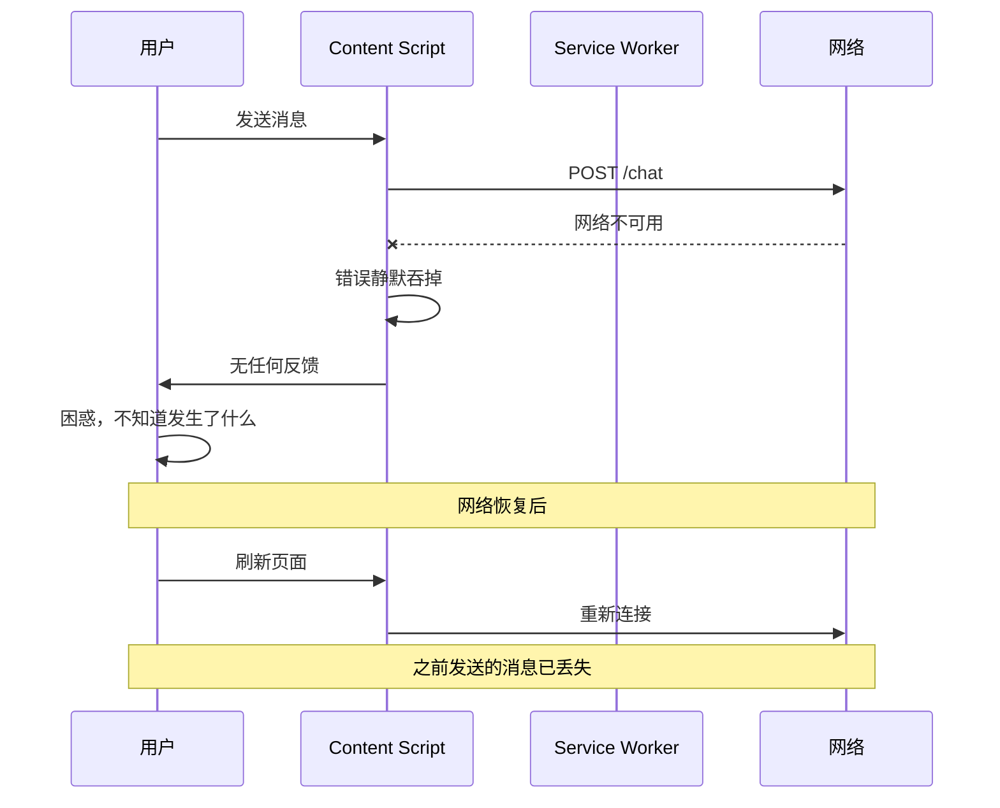
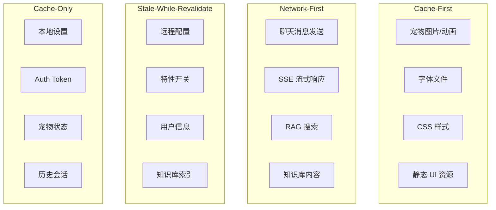

# YP-09-92: 离线支持与缓存策略 — Service Worker 缓存、离线 UI 降级与数据持久化

> 需求编号：YP-09-92 · 优先级：P2 · 人天：1.0d · 状态：需求已编写
> 依赖：YP-09-91（特性开关系统）

## 背景

### 问题陈述

YiPet 作为浏览器扩展，当前完全依赖网络连接才能正常工作。用户离线或网络不稳定时，宠物界面空白、聊天功能不可用、历史会话无法访问。这导致：

1. **离线不可用**：用户在地铁、飞机、网络不稳定环境下无法使用任何功能
2. **数据丢失风险**：未保存的消息在网络恢复前可能丢失
3. **Storage 配额管理缺失**：chrome.storage.local 有 10MB 限制，无配额监控和清理机制
4. **缓存策略不一致**：各模块自行管理缓存，无统一的缓存策略和失效机制
5. **数据迁移无方案**：扩展版本升级时，storage 数据结构变更可能导致数据丢失

**核心矛盾**：YiPet 的 AI 聊天功能依赖远程 API（YiAi 后端），但大量功能（历史会话浏览、宠物展示、设置管理）可以也应该离线可用。需要区分"必须在线"和"可离线"的功能，并为之提供适配的缓存策略。

### 影响范围

| # | 影响 | 严重程度 | 典型场景 |
|---|------|----------|----------|
| 1 | 离线完全不可用 | 高 | 用户在地铁中打开宠物，界面空白 |
| 2 | 网络恢复后数据不一致 | 中 | 离线时发送的消息未同步 |
| 3 | Storage 配额溢出 | 中 | 会话积累过多，新数据无法保存 |
| 4 | 缓存数据过期 | 中 | 用户看到 3 天前的旧数据 |
| 5 | 版本升级数据丢失 | 低 | 扩展更新后 storage 结构变化 |

### 挑战

| 挑战 | 说明 |
|------|------|
| Storage 配额限制 | chrome.storage.local 有 10MB 上限，索引和会话数据可能超出 |
| 缓存策略选择 | 不同类型数据需要不同的缓存策略（Cache-First / Network-First / SWR） |
| 离线 UI 体验 | 需要明确的离线状态指示和优雅的功能降级 |
| 数据同步 | 离线操作需在网络恢复后同步，避免冲突 |
| MV3 Service Worker | SW 生命周期短，不适合做长时间运行的后台同步 |

---

## 一、现状分析

### 1.1 当前数据存储分布

```
当前存储使用情况:
├── chrome.storage.local
│   ├── sessions: 聊天会话列表（~2MB）
│   ├── settings: 用户设置（~10KB）
│   ├── sessionKey: 认证 Token（~200B）
│   └── eventLog: 事件日志（YP-09-53）（~500KB）
├── 内存
│   ├── 当前会话消息（~500KB）
│   ├── 宠物状态（~50KB）
│   └── UI 状态（~100KB）
└── 无
    ├── IndexedDB: ❌ 未使用
    ├── Cache API: ❌ 未使用
    └── 离线队列: ❌ 不存在
```

### 1.2 当前离线行为

| 功能 | 在线 | 离线 | 体验 |
|------|------|------|------|
| 宠物展示 | 正常 | 正常（静态资源） | 良好 |
| 历史会话浏览 | 正常 | 正常（本地数据） | 良好 |
| 发送消息 | 正常 | ❌ 失败 | 无提示 |
| 接收 SSE 流 | 正常 | ❌ 断开 | 静默断开 |
| 加载知识库 | 正常 | ❌ 空白 | 无降级 |
| 设置管理 | 正常 | 正常 | 良好 |
| 诊断信息 | 正常 | ⚠️ 部分可用 | 网络相关字段为空 |

### 1.3 改造前离线流程



### 1.4 根因矩阵

| 症状 | 根因 | 触发条件 | 频率 |
|------|------|----------|------|
| 离线不可用 | 无离线策略 | 任何离线场景 | 中 |
| 消息丢失 | 无离线队列 | 网络不稳定 | 中 |
| Storage 溢出 | 无配额管理 | 会话积累 | 中 |
| 缓存不一致 | 无统一缓存策略 | 各模块自行管理 | 高 |
| 数据迁移失败 | 无版本化管理 | 扩展更新 | 低 |

---

## 二、设计决策

### 决策 1：存储后端 — 仅 chrome.storage vs chrome.storage + IndexedDB vs 分层

| 选项 | 容量 | 性能 | 复杂度 | 查询能力 |
|------|------|------|--------|----------|
| 仅 chrome.storage.local | 10MB | 中 | 低 | 无（仅 key-value） |
| 仅 IndexedDB | 无限制 | 高 | 中 | 有（索引） |
| 分层（chrome.storage + IndexedDB） | 分层 | 高 | 中 | 各有 |

**选择：分层存储。** chrome.storage.local 用于配置、设置、认证 Token（小数据，需跨上下文同步）。IndexedDB 用于会话消息、事件日志、离线队列（大数据，需索引查询）。chrome.storage.session 用于临时状态（内存级别，浏览器重启后清除）。

### 决策 2：缓存策略 — 统一策略 vs 按数据类型 vs 按网络状态

| 选项 | 灵活性 | 一致性 | 复杂度 |
|------|--------|--------|--------|
| 统一策略（全部 Cache-First） | 低 | 好 | 低 |
| 按数据类型（配置/消息/资源） | 高 | 中 | 中 |
| 按网络状态动态切换 | 高 | 中 | 高 |

**选择：按数据类型。** 不同数据有不同的新鲜度要求和离线容忍度。配置数据使用 Stale-While-Revalidate，消息使用 Network-First，静态资源使用 Cache-First。

### 决策 3：离线消息处理 — 丢弃 vs 本地队列 vs 乐观更新

| 选项 | 用户体验 | 数据一致性 | 实现复杂度 |
|------|----------|-----------|-----------|
| 丢弃（提示用户离线） | 差 | 好 | 低 |
| 本地队列（网络恢复后发送） | 中 | 中 | 中 |
| 乐观更新（立即显示 + 后台同步） | 好 | 中 | 高 |

**选择：乐观更新 + 本地队列。** 消息立即显示在聊天界面（标记为"发送中"），同时加入离线队列。网络恢复后自动发送，成功则标记为"已发送"，失败则标记为"发送失败"并提供重试。

### 决策 4：Storage 配额管理 — 无限制 vs 固定上限 vs LRU 淘汰

| 选项 | 数据安全 | 存储效率 | 实现 |
|------|----------|----------|------|
| 无限制（仅 IndexedDB） | 差 | 高 | 简单 |
| 固定上限（如 50MB） | 中 | 中 | 中 |
| LRU 淘汰（自动清理旧数据） | 好 | 高 | 中 |

**选择：固定上限 + LRU 淘汰。** 总配额 50MB（IndexedDB），其中会话数据 30MB、事件日志 10MB、离线队列 5MB、其他 5MB。超出时 LRU 淘汰最久未访问的会话。

### 设计决策记录

| 决策 | 选项 A | 选项 B | 选项 C | 选择 | 理由 |
|------|--------|--------|--------|------|------|
| 存储后端 | 仅 chrome.storage | 仅 IndexedDB | 分层 | **分层** | 小数据 sync + 大数据 index |
| 缓存策略 | 统一 | 按数据类型 | 按网络状态 | **按数据类型** | 精确匹配数据特性 |
| 离线消息 | 丢弃 | 本地队列 | 乐观更新 | **乐观更新 + 队列** | 最佳用户体验 |
| 配额管理 | 无限制 | 固定上限 | LRU | **固定上限 + LRU** | 可控 + 自动清理 |

---

## 三、目标架构

### 3.1 分层存储架构

```mermaid
graph TD
    subgraph "Storage Layer"
        A[chrome.storage.sync<br/>跨设备同步<br/>用户设置: 5KB]
        B[chrome.storage.local<br/>跨上下文共享<br/>Auth Token + 配置: 500KB]
        C[chrome.storage.session<br/>内存级临时<br/>当前会话状态: 100KB]
        D[IndexedDB<br/>大数据持久化<br/>会话消息 + 事件日志: 50MB]
    end

    subgraph "Cache Layer"
        E[Cache API (SW)<br/>静态资源缓存<br/>宠物图片/字体/CSS]
    end

    subgraph "Sync Layer"
        F[OfflineQueue<br/>离线操作队列<br/>消息/状态变更]
    end

    subgraph "Business Logic"
        G[StorageService]
        H[CacheService]
        I[SyncService]
    end

    G --> A
    G --> B
    G --> C
    G --> D
    H --> E
    I --> F
```

### 3.2 缓存策略矩阵



### 3.3 性能指标

| 指标 | 改造前 | 改造后 |
|------|--------|--------|
| 离线可用功能 | 0% | 60%+ |
| 消息发送丢失败率 | 100%（离线时） | 0%（本地队列缓存） |
| Storage 配额使用率 | 未知 | 实时监控 |
| 缓存命中率 | 0% | 60%+（静态资源） |
| 首次加载时间（离线） | 不可用 | < 500ms |

---

## 四、具体改动

### 4.1 分层存储服务

```typescript
// src/services/storage-service.ts (新增)

interface StorageQuota {
  used: number;
  limit: number;
  percentage: number;
}

type StorageArea = 'sync' | 'local' | 'session' | 'indexeddb';

interface StorageConfig {
  area: StorageArea;
  key: string;
  version: number;
  ttl?: number;  // 毫秒
  maxSize?: number;  // 字节
}

class StorageService {
  private db: IDBDatabase | null = null;
  private readonly DB_NAME = 'yipet-storage';
  private readonly DB_VERSION = 1;

  async init(): Promise<void> {
    await this.openIndexedDB();
    await this.checkQuota();
  }

  // === chrome.storage 封装 ===

  async get<T>(area: StorageArea, key: string): Promise<T | null> {
    if (area === 'indexeddb') {
      return this.getFromIndexedDB<T>(key);
    }

    const storage = this.getStorageArea(area);
    const result = await storage.get(key);
    const entry = result[key];

    if (!entry) return null;

    // 检查 TTL
    if (entry._ttl && Date.now() > entry._ttl) {
      await storage.remove(key);
      return null;
    }

    return entry._value as T;
  }

  async set<T>(
    area: StorageArea,
    key: string,
    value: T,
    config?: { ttl?: number }
  ): Promise<void> {
    if (area === 'indexeddb') {
      return this.setToIndexedDB(key, value, config);
    }

    const storage = this.getStorageArea(area);
    const entry = {
      _value: value,
      _ttl: config?.ttl ? Date.now() + config.ttl : undefined,
      _updatedAt: Date.now(),
    };

    await storage.set({ [key]: entry });
  }

  async remove(area: StorageArea, key: string): Promise<void> {
    if (area === 'indexeddb') {
      return this.removeFromIndexedDB(key);
    }

    const storage = this.getStorageArea(area);
    await storage.remove(key);
  }

  // === IndexedDB 操作 ===

  private async openIndexedDB(): Promise<void> {
    return new Promise((resolve, reject) => {
      const request = indexedDB.open(this.DB_NAME, this.DB_VERSION);

      request.onupgradeneeded = (event) => {
        const db = (event.target as IDBOpenDBRequest).result;
        if (!db.objectStoreNames.contains('keyvalue')) {
          db.createObjectStore('keyvalue', { keyPath: 'key' });
        }
        if (!db.objectStoreNames.contains('offlineQueue')) {
          const queueStore = db.createObjectStore('offlineQueue', {
            keyPath: 'id',
            autoIncrement: true,
          });
          queueStore.createIndex('timestamp', 'timestamp', { unique: false });
        }
        if (!db.objectStoreNames.contains('sessions')) {
          const sessionStore = db.createObjectStore('sessions', {
            keyPath: 'sessionId',
          });
          sessionStore.createIndex('updatedAt', 'updatedAt', { unique: false });
        }
      };

      request.onsuccess = (event) => {
        this.db = (event.target as IDBOpenDBRequest).result;
        resolve();
      };

      request.onerror = (event) => {
        console.error('[Storage] IndexedDB open failed:', event);
        reject(new Error('IndexedDB open failed'));
      };
    });
  }

  private async getFromIndexedDB<T>(key: string): Promise<T | null> {
    return new Promise((resolve, reject) => {
      if (!this.db) { reject(new Error('DB not initialized')); return; }

      const tx = this.db.transaction('keyvalue', 'readonly');
      const store = tx.objectStore('keyvalue');
      const request = store.get(key);

      request.onsuccess = () => {
        const entry = request.result;
        if (!entry) { resolve(null); return; }

        // 检查 TTL
        if (entry._ttl && Date.now() > entry._ttl) {
          this.removeFromIndexedDB(key);
          resolve(null);
          return;
        }

        resolve(entry._value as T);
      };

      request.onerror = () => reject(request.error);
    });
  }

  private async setToIndexedDB<T>(
    key: string,
    value: T,
    config?: { ttl?: number }
  ): Promise<void> {
    return new Promise((resolve, reject) => {
      if (!this.db) { reject(new Error('DB not initialized')); return; }

      const tx = this.db.transaction('keyvalue', 'readwrite');
      const store = tx.objectStore('keyvalue');
      store.put({
        key,
        _value: value,
        _ttl: config?.ttl ? Date.now() + config.ttl : undefined,
        _updatedAt: Date.now(),
      });

      tx.oncomplete = () => resolve();
      tx.onerror = () => reject(tx.error);
    });
  }

  private async removeFromIndexedDB(key: string): Promise<void> {
    return new Promise((resolve, reject) => {
      if (!this.db) { reject(new Error('DB not initialized')); return; }

      const tx = this.db.transaction('keyvalue', 'readwrite');
      tx.objectStore('keyvalue').delete(key);
      tx.oncomplete = () => resolve();
      tx.onerror = () => reject(tx.error);
    });
  }

  // === 配额管理 ===

  async checkQuota(): Promise<StorageQuota> {
    try {
      const estimate = await navigator.storage.estimate();
      return {
        used: estimate.usage ?? 0,
        limit: estimate.quota ?? 0,
        percentage: estimate.quota
          ? Math.round((estimate.usage ?? 0) / estimate.quota * 100)
          : 0,
      };
    } catch {
      return { used: 0, limit: 0, percentage: 0 };
    }
  }

  async enforceQuota(maxBytes: number): Promise<void> {
    const quota = await this.checkQuota();
    if (quota.used < maxBytes) return;

    console.warn(`[Storage] Quota exceeded: ${(quota.used / 1024 / 1024).toFixed(1)}MB / ${(maxBytes / 1024 / 1024).toFixed(1)}MB`);

    // LRU 淘汰：删除最旧的不活跃会话
    await this.evictLRUSessions();
  }

  private async evictLRUSessions(): Promise<void> {
    if (!this.db) return;

    return new Promise((resolve, reject) => {
      const tx = this.db!.transaction('sessions', 'readwrite');
      const store = tx.objectStore('sessions');
      const index = store.index('updatedAt');

      const sessionsToDelete: string[] = [];
      const request = index.openCursor();

      request.onsuccess = (event) => {
        const cursor = (event.target as IDBRequest<IDBCursorWithValue>).result;
        if (cursor) {
          // 保留最近 20 个会话，删除更旧的
          if (sessionsToDelete.length >= 20) {
            sessionsToDelete.push(cursor.value.sessionId);
          }
          cursor.continue();
        }
      };

      tx.oncomplete = () => {
        for (const sessionId of sessionsToDelete) {
          store.delete(sessionId);
        }
        resolve();
      };

      tx.onerror = () => reject(tx.error);
    });
  }

  private getStorageArea(area: StorageArea) {
    switch (area) {
      case 'sync': return chrome.storage.sync;
      case 'local': return chrome.storage.local;
      case 'session': return chrome.storage.session;
      default: throw new Error(`Unknown storage area: ${area}`);
    }
  }
}

export const storageService = new StorageService();
```

### 4.2 缓存策略服务

```typescript
// src/services/cache-service.ts (新增)

type CacheStrategy = 'cache-first' | 'network-first' | 'stale-while-revalidate' | 'network-only';

interface CacheEntry<T> {
  data: T;
  timestamp: number;
  ttl: number;
  etag?: string;
}

class CacheService {
  private cacheName = 'yipet-cache-v1';

  async get<T>(
    key: string,
    fetchFn: () => Promise<T>,
    strategy: CacheStrategy,
    options?: { ttl?: number; etag?: boolean }
  ): Promise<{ data: T; fromCache: boolean }> {
    switch (strategy) {
      case 'cache-first':
        return this.cacheFirst(key, fetchFn, options);
      case 'network-first':
        return this.networkFirst(key, fetchFn, options);
      case 'stale-while-revalidate':
        return this.staleWhileRevalidate(key, fetchFn, options);
      case 'network-only':
        return this.networkOnly(fetchFn);
    }
  }

  private async cacheFirst<T>(
    key: string,
    fetchFn: () => Promise<T>,
    options?: { ttl?: number }
  ): Promise<{ data: T; fromCache: boolean }> {
    const cache = await caches.open(this.cacheName);
    const cached = await cache.match(key);

    if (cached) {
      const entry: CacheEntry<T> = await cached.json();
      const age = Date.now() - entry.timestamp;
      if (age < (options?.ttl ?? 24 * 60 * 60 * 1000)) {
        return { data: entry.data, fromCache: true };
      }
    }

    // 缓存过期或不存在，回退到网络
    try {
      const data = await fetchFn();
      await this.putCache(key, data, options?.ttl);
      return { data, fromCache: false };
    } catch {
      // 网络失败，返回过期缓存
      if (cached) {
        const entry: CacheEntry<T> = await cached.json();
        return { data: entry.data, fromCache: true };
      }
      throw new Error('Cache miss and network unavailable');
    }
  }

  private async networkFirst<T>(
    key: string,
    fetchFn: () => Promise<T>,
    options?: { ttl?: number }
  ): Promise<{ data: T; fromCache: boolean }> {
    try {
      const data = await fetchFn();
      await this.putCache(key, data, options?.ttl);
      return { data, fromCache: false };
    } catch {
      const cache = await caches.open(this.cacheName);
      const cached = await cache.match(key);
      if (cached) {
        const entry: CacheEntry<T> = await cached.json();
        return { data: entry.data, fromCache: true };
      }
      throw new Error('Network unavailable and cache miss');
    }
  }

  private async staleWhileRevalidate<T>(
    key: string,
    fetchFn: () => Promise<T>,
    options?: { ttl?: number }
  ): Promise<{ data: T; fromCache: boolean }> {
    const cache = await caches.open(this.cacheName);
    const cached = await cache.match(key);

    // 立即返回缓存（stale）
    const cachedPromise = cached
      ? Promise.resolve({ data: (await cached.json() as CacheEntry<T>).data, fromCache: true as const })
      : null;

    // 后台更新缓存（revalidate）
    const revalidatePromise = (async () => {
      try {
        const data = await fetchFn();
        await this.putCache(key, data, options?.ttl);
        return { data, fromCache: false as const };
      } catch {
        return null;
      }
    })();

    if (cachedPromise) {
      // 不 await revalidate，让它后台执行
      revalidatePromise.catch(() => {});
      return cachedPromise;
    }

    // 无缓存，等待网络
    const result = await revalidatePromise;
    if (!result) throw new Error('No cache and network unavailable');
    return result;
  }

  private async networkOnly<T>(
    fetchFn: () => Promise<T>
  ): Promise<{ data: T; fromCache: boolean }> {
    const data = await fetchFn();
    return { data, fromCache: false };
  }

  private async putCache<T>(
    key: string,
    data: T,
    ttl?: number
  ): Promise<void> {
    const cache = await caches.open(this.cacheName);
    const entry: CacheEntry<T> = {
      data,
      timestamp: Date.now(),
      ttl: ttl ?? 24 * 60 * 60 * 1000,
    };
    await cache.put(key, new Response(JSON.stringify(entry)));
  }

  async invalidate(pattern?: string): Promise<void> {
    const cache = await caches.open(this.cacheName);
    if (pattern) {
      const keys = await cache.keys();
      for (const request of keys) {
        if (request.url.includes(pattern)) {
          await cache.delete(request);
        }
      }
    } else {
      // 清除所有缓存
      await caches.delete(this.cacheName);
      this.cacheName = `yipet-cache-v${Date.now()}`;
    }
  }

  async getCacheSize(): Promise<number> {
    const cache = await caches.open(this.cacheName);
    const keys = await cache.keys();
    let totalSize = 0;
    for (const request of keys) {
      const response = await cache.match(request);
      if (response) {
        const blob = await response.blob();
        totalSize += blob.size;
      }
    }
    return totalSize;
  }
}

export const cacheService = new CacheService();
```

### 4.3 离线消息队列

```typescript
// src/services/offline-queue.ts (新增)

interface QueuedMessage {
  id?: number;
  type: 'send-message' | 'update-settings' | 'sync-session';
  payload: unknown;
  timestamp: number;
  retryCount: number;
  maxRetries: number;
  status: 'pending' | 'sending' | 'failed';
}

class OfflineQueue {
  private processing = false;
  private readonly MAX_RETRIES = 3;
  private readonly RETRY_DELAY = 5000;  // 5s

  async enqueue(
    type: QueuedMessage['type'],
    payload: unknown
  ): Promise<void> {
    const storage = await this.openStore();
    const item: QueuedMessage = {
      type,
      payload,
      timestamp: Date.now(),
      retryCount: 0,
      maxRetries: this.MAX_RETRIES,
      status: 'pending',
    };

    return new Promise((resolve, reject) => {
      const request = storage.add(item);
      request.onsuccess = () => {
        this.processQueue();
        resolve();
      };
      request.onerror = () => reject(request.error);
    });
  }

  private async processQueue(): Promise<void> {
    if (this.processing) return;
    if (!navigator.onLine) return;

    this.processing = true;

    try {
      const items = await this.getPendingItems();
      for (const item of items) {
        const success = await this.processItem(item);
        if (success) {
          await this.removeItem(item.id!);
        } else {
          item.retryCount++;
          if (item.retryCount >= item.maxRetries) {
            item.status = 'failed';
          }
          await this.updateItem(item);
        }
      }
    } finally {
      this.processing = false;
    }
  }

  private async processItem(item: QueuedMessage): Promise<boolean> {
    try {
      switch (item.type) {
        case 'send-message':
          return await this.sendMessage(item.payload);
        case 'update-settings':
          return await this.updateSettings(item.payload);
        case 'sync-session':
          return await this.syncSession(item.payload);
        default:
          return false;
      }
    } catch {
      return false;
    }
  }

  private async sendMessage(payload: unknown): Promise<boolean> {
    try {
      const response = await fetch('http://localhost:10086/', {
        method: 'POST',
        headers: { 'Content-Type': 'application/json' },
        body: JSON.stringify({
          module_name: 'services.ai.chat_service',
          method_name: 'chat',
          parameters: payload,
        }),
      });
      return response.ok;
    } catch {
      return false;
    }
  }

  private async updateSettings(payload: unknown): Promise<boolean> {
    // 实现设置同步逻辑
    return true;
  }

  private async syncSession(payload: unknown): Promise<boolean> {
    // 实现会话同步逻辑
    return true;
  }

  private async openStore(): Promise<IDBObjectStore> {
    return new Promise((resolve, reject) => {
      const request = indexedDB.open('yipet-storage', 1);
      request.onsuccess = () => {
        const db = request.result;
        const tx = db.transaction('offlineQueue', 'readwrite');
        resolve(tx.objectStore('offlineQueue'));
      };
      request.onerror = () => reject(request.error);
    });
  }

  private async getPendingItems(): Promise<QueuedMessage[]> {
    return new Promise((resolve, reject) => {
      const request = indexedDB.open('yipet-storage', 1);
      request.onsuccess = () => {
        const db = request.result;
        const tx = db.transaction('offlineQueue', 'readonly');
        const store = tx.objectStore('offlineQueue');
        const getAll = store.getAll();
        getAll.onsuccess = () => resolve(getAll.result);
        getAll.onerror = () => reject(getAll.error);
      };
      request.onerror = () => reject(request.error);
    });
  }

  private async removeItem(id: number): Promise<void> {
    return new Promise((resolve, reject) => {
      const request = indexedDB.open('yipet-storage', 1);
      request.onsuccess = () => {
        const db = request.result;
        const tx = db.transaction('offlineQueue', 'readwrite');
        tx.objectStore('offlineQueue').delete(id);
        tx.oncomplete = () => resolve();
        tx.onerror = () => reject(tx.error);
      };
    });
  }

  private async updateItem(item: QueuedMessage): Promise<void> {
    return new Promise((resolve, reject) => {
      const request = indexedDB.open('yipet-storage', 1);
      request.onsuccess = () => {
        const db = request.result;
        const tx = db.transaction('offlineQueue', 'readwrite');
        tx.objectStore('offlineQueue').put(item);
        tx.oncomplete = () => resolve();
        tx.onerror = () => reject(tx.error);
      };
    });
  }
}

export const offlineQueue = new OfflineQueue();
```

### 4.4 离线 UI 指示器

```typescript
// src/components/offline-indicator.vue (新增)

<script setup lang="ts">
import { ref, onMounted, onUnmounted } from 'vue';
import { offlineQueue } from '@/services/offline-queue';

const isOnline = ref(navigator.onLine);
const queueCount = ref(0);
const showBanner = ref(false);

function updateOnlineStatus(): void {
  const wasOffline = !isOnline.value;
  isOnline.value = navigator.onLine;

  if (wasOffline && isOnline.value) {
    showBanner.value = true;
    setTimeout(() => { showBanner.value = false; }, 3000);
  }
}

onMounted(() => {
  window.addEventListener('online', updateOnlineStatus);
  window.addEventListener('offline', updateOnlineStatus);
});

onUnmounted(() => {
  window.removeEventListener('online', updateOnlineStatus);
  window.removeEventListener('offline', updateOnlineStatus);
});
</script>

<template>
  <Transition name="fade">
    <div v-if="!isOnline" class="offline-indicator offline-indicator--offline">
      <span class="offline-indicator__dot"></span>
      <span>离线模式 - 部分功能不可用</span>
    </div>
    <div
      v-else-if="showBanner"
      class="offline-indicator offline-indicator--reconnected"
    >
      <span>已恢复连接</span>
    </div>
  </Transition>
</template>
```

### 4.5 文件变更清单

| 文件 | 操作 | 说明 |
|------|------|------|
| `src/services/storage-service.ts` | 新增 | 分层存储服务 |
| `src/services/cache-service.ts` | 新增 | 缓存策略服务 |
| `src/services/offline-queue.ts` | 新增 | 离线消息队列 |
| `src/components/offline-indicator.vue` | 新增 | 离线 UI 指示器 |
| `src/components/network-status.vue` | 新增 | 网络状态组件 |
| `src/content/index.ts` | 修改 | 初始化存储和缓存服务 |
| `src/sw/background.ts` | 修改 | SW 中注册 Cache API |
| `src/services/api-client.ts` | 修改 | 集成缓存策略 |
| `tests/unit/storage-service.test.ts` | 新增 | 存储服务单元测试 |
| `tests/unit/cache-service.test.ts` | 新增 | 缓存策略单元测试 |

---

## 五、实施步骤

| 步骤 | 操作 | 路径 | 验证 | 人天 |
|------|------|------|------|------|
| 1 | 实现分层存储服务 | `src/services/storage-service.ts` | chrome.storage + IndexedDB 读写 | 0.2 |
| 2 | 实现缓存策略服务 | `src/services/cache-service.ts` | 4 种策略测试通过 | 0.15 |
| 3 | 实现离线消息队列 | `src/services/offline-queue.ts` | 离线消息缓存 + 恢复发送 | 0.15 |
| 4 | 实现配额管理 + LRU 淘汰 | `src/services/storage-service.ts` | 超配额自动清理 | 0.1 |
| 5 | 创建离线 UI 指示器 | `src/components/offline-indicator.vue` | 离线/恢复状态显示 | 0.1 |
| 6 | 集成到 API Client | `src/services/api-client.ts` | 缓存策略应用于 API 请求 | 0.1 |
| 7 | SW 静态资源缓存 | `src/sw/background.ts` | 宠物图片/字体离线可用 | 0.1 |
| 8 | 数据迁移和版本化 | `src/services/storage-service.ts` | 升级后数据不丢失 | 0.05 |
| 9 | 单元测试 | `tests/unit/` | 存储/缓存/队列逻辑覆盖 | 0.05 |

**总人天：1.0d**

---

## 六、测试规格

### 场景 1：离线时发送消息

**GIVEN** 用户处于离线状态
**WHEN** 用户发送聊天消息
**THEN** 消息应显示在聊天界面（标记为"发送中"）
**AND** 消息应加入离线队列（IndexedDB）
**AND** 离线 UI 指示器应显示"离线模式"

### 场景 2：网络恢复后自动同步

**GIVEN** 离线队列中有 3 条待发送消息
**WHEN** 浏览器检测到网络恢复（`online` 事件）
**THEN** 离线队列应自动处理，逐条发送消息
**AND** 发送成功的消息应标记为"已发送"
**AND** 发送失败的消息应标记为"发送失败"并提供重试

### 场景 3：Cache-First 策略

**GIVEN** 宠物图片已缓存到 Cache API
**WHEN** 用户离线打开宠物
**THEN** 宠物图片应从缓存加载（`fromCache: true`）
**AND** 加载时间应 < 50ms

### 场景 4：Stale-While-Revalidate 策略

**GIVEN** 远程配置已缓存 1 小时
**WHEN** 用户打开宠物
**THEN** 应立即返回缓存配置（`fromCache: true`）
**AND** 后台静默拉取最新配置
**AND** 下次读取时使用最新配置

### 场景 5：Storage 配额超限

**GIVEN** IndexedDB 使用量接近 50MB 上限
**WHEN** 新会话需要保存
**THEN** 应触发 LRU 淘汰，删除最旧的不活跃会话
**AND** 新会话应成功保存
**AND** 应输出 WARNING 日志

### 场景 6：数据版本迁移

**GIVEN** 扩展从 v1.0 升级到 v2.0
**AND** v1.0 的 storage 数据结构与 v2.0 不同
**WHEN** 扩展 v2.0 首次启动
**THEN** 应检测数据版本差异
**AND** 应执行迁移逻辑
**AND** 迁移后数据应正确可用

---

## 七、风险与缓解

| 风险 | 概率 | 影响 | 缓解措施 |
|------|------|------|----------|
| IndexedDB 在隐私模式下不可用 | 中 | 高 | 降级为 chrome.storage.local |
| 配额超限数据丢失 | 中 | 中 | LRU 淘汰 + 配额监控告警 |
| 离线队列堆积过多 | 低 | 中 | 限制队列 100 条，超出丢弃 |
| 缓存数据与服务器不一致 | 中 | 中 | TTL 过期 + ETag 校验 |
| 数据迁移失败 | 低 | 高 | 迁移前备份 + 回滚机制 |

---

## 八、回滚策略

| 场景 | 回滚操作 | 影响 |
|------|----------|------|
| IndexedDB 导致性能问题 | 降级为仅 chrome.storage.local | 失去大数据存储能力 |
| 缓存策略导致数据不一致 | 全部切换为 network-only | 失去离线缓存 |
| 离线队列发送重复消息 | 清除离线队列，禁用离线发送 | 离线消息丢失 |
| 数据迁移异常 | 清除所有 storage，重新初始化 | 用户数据丢失 |

---

## 九、设计决策记录

### D-01：IndexedDB 库选择

- **问题**：使用原生 IndexedDB API 还是封装库（idb/Dexie.js）
- **选项**：原生 API、idb（Promise 封装）、Dexie.js（完整 ORM）
- **选择**：原生 API + 简单 Promise 封装
- **理由**：YiPet 的 IndexedDB 使用场景简单（key-value + 简单队列），不需要 ORM；原生 API 无额外依赖

### D-02：离线消息去重

- **问题**：网络恢复后重复发送消息如何避免
- **选项**：客户端生成唯一 ID、服务端幂等、不处理
- **选择**：客户端生成消息 ID（UUID），服务端幂等
- **理由**：客户端 ID 保证离线时即可生成；服务端幂等保证即使客户端重复发送也不影响

### D-03：Cache API 缓存范围

- **问题**：Cache API 应缓存哪些资源
- **选项**：所有资源、仅静态资源、仅扩展资源
- **选择**：仅扩展静态资源（宠物图片、字体、CSS）
- **理由**：避免缓存宿主页面资源；扩展资源体积小（< 500KB），适合 Cache API

---

## 十、可观测性

### 指标

| 指标 | 类型 | 说明 |
|------|------|------|
| `yipet.storage.quota_used` | Gauge | IndexedDB 使用量（字节） |
| `yipet.storage.quota_limit` | Gauge | IndexedDB 配额上限（字节） |
| `yipet.storage.quota_percent` | Gauge | 配额使用百分比 |
| `yipet.cache.hit_count` | Counter | 缓存命中次数 |
| `yipet.cache.miss_count` | Counter | 缓存未命中次数 |
| `yipet.cache.size` | Gauge | Cache API 存储大小 |
| `yipet.offline.queue_size` | Gauge | 离线队列待处理数 |
| `yipet.offline.sync_success` | Counter | 离线消息同步成功次数 |
| `yipet.offline.sync_failed` | Counter | 离线消息同步失败次数 |
| `yipet.network.online_status` | Gauge | 当前网络状态（1/0） |

### 告警

| 告警 | 条件 | 级别 |
|------|------|------|
| 配额使用 > 80% | 持续 5min | WARNING |
| 配额使用 > 95% | 持续 5min | CRITICAL |
| 离线队列 > 50 条 | 持续 10min | WARNING |
| 缓存命中率 < 30% | 1h 滚动窗口 | INFO |
| 离线同步失败率 > 50% | 最近 20 条 | WARNING |

---

## 十一、代码审查检查清单

- [ ] 分层存储：小数据 chrome.storage，大数据 IndexedDB
- [ ] 4 种缓存策略：Cache-First / Network-First / SWR / Network-Only
- [ ] 缓存数据有 TTL，过期后自动重取
- [ ] 离线消息队列：乐观更新 + 后台同步
- [ ] Storage 配额监控 + LRU 淘汰
- [ ] 离线 UI 指示器显示网络状态
- [ ] 数据版本化，支持迁移
- [ ] IndexedDB 不可用时降级为 chrome.storage.local
- [ ] 隐私模式下功能降级可用
- [ ] 静态资源（图片/字体/CSS）使用 Cache API 预缓存
- [ ] 单元测试覆盖所有缓存策略和存储操作

---

## 回归问题预测

| # | 预测问题 | 原因 | 验证方法 |
|---|---------|------|---------|
| 1 | IndexedDB 在 Chrome 隐私模式（Incognito）下不可用，`indexedDB.open()` 抛出 `DOMException`，导致存储服务初始化失败，扩展完全不可用 | 隐私模式下 IndexedDB 的行为：Chrome 不允许在隐私窗口创建 IndexedDB（抛出 `QuotaExceededError` 或 `UnknownError`），但 `chrome.storage.local` 在隐私模式下可用（设置 `incognito: 'split'`） | 在隐私窗口中加载扩展，验证存储服务降级为仅使用 `chrome.storage.local`，核心功能（宠物展示、设置）仍可用 |
| 2 | Cache API 的 `caches.open()` 在 Service Worker 被终止后重新启动时，缓存名称版本号不匹配，旧缓存未被清理，导致存储空间浪费 | MV3 Service Worker 空闲后终止，重启时 `cacheName` 使用 `Date.now()` 动态生成新名称，旧缓存成为孤儿缓存，永久占用存储空间 | 在 SW 中多次重启后，检查 `caches.keys()` 确保旧缓存被清理，使用固定版本号而非动态名称 |
| 3 | `navigator.storage.estimate()` 返回值在跨域 iframe 中不准确，配额监控可能显示错误数据 | Content Script 在某些宿主页面中通过 iframe 加载，`navigator.storage.estimate()` 返回的是 iframe 的配额而非扩展的配额，配额检查可能误报超限 | 在包含 iframe 的页面中验证配额监控数据准确性，优先在 Service Worker 中执行配额检查（SW 不受宿主页面限制） |
| 4 | 离线队列的 `processQueue` 在网络恢复时批量发送消息，多条消息并发请求导致服务端负载过高或触发限流 | 网络恢复后检测到 `online` 事件，立即处理队列中的所有消息，10 条消息同时发出 10 个 POST 请求，可能触发服务端限流 | 在队列处理中添加并发控制（每次最多 3 条并发），验证消息按顺序发送且不触发限流 |
| 5 | LRU 淘汰删除会话时，用户正在查看该会话的历史消息，会话被删除后 UI 显示空白或异常 | LRU 淘汰逻辑在后台异步执行，不感知用户当前正在查看的会话，删除后 UI 中引用的会话数据变为 null | 在 LRU 淘汰前检查当前活跃会话 ID，跳过正在查看的会话，验证用户正在查看的会话不会被淘汰 |
| 6 | `chrome.storage.session` 在 Service Worker 中不可用（MV3 中 SW 没有 `session` storage），代码在 SW 中调用 `chrome.storage.session.get()` 抛出 `TypeError` | `chrome.storage.session` 仅在扩展页面（Popup/Options）和 Content Script 中可用，Service Worker 中调用会报错，但存储服务未区分上下文 | 在 Service Worker 中调用 `storageService.get('session', key)` 验证返回 null 或优雅降级，不抛出异常 ||

---

---

## 性能分析

### 存储操作耗时

| 操作 | 耗时 | 说明 |
|------|------|------|
| `chrome.storage.local.get()` (单 key) | < 1ms | 读取小数据 |
| `chrome.storage.local.get()` (全量) | < 10ms | 读取所有 storage |
| `chrome.storage.local.set()` (单 key) | < 2ms | 写入小数据 |
| IndexedDB 读 (单条) | < 5ms | 有索引 |
| IndexedDB 写 (单条) | < 10ms | 事务提交 |
| IndexedDB 查询 (索引) | < 20ms | 范围查询 |
| `navigator.storage.estimate()` | < 5ms | 异步估算 |
| Cache API 读 (缓存命中) | < 2ms | 内存缓存 |
| Cache API 写 | < 50ms | 磁盘写入 |
| LRU 淘汰 (20 条会话) | < 50ms | 遍历 + 删除 |

### 存储配额预估

| 数据类型 | 存储位置 | 单条大小 | 数量上限 | 总大小 |
|----------|----------|----------|----------|--------|
| 用户设置 | chrome.storage.sync | 1KB | 1 | 1KB |
| Auth Token | chrome.storage.local | 200B | 1 | 200B |
| 扩展配置 | chrome.storage.local | 2KB | 1 | 2KB |
| 当前会话状态 | chrome.storage.session | 50KB | 1 | 50KB |
| 会话消息 | IndexedDB | 50KB | 200 | 10MB |
| 事件日志 | IndexedDB | 30KB | 300 | 9MB |
| 离线队列 | IndexedDB | 5KB | 100 | 500KB |
| 静态资源缓存 | Cache API | 200KB | 10 | 2MB |
| **总计** | — | — | — | **~22MB** |

### 对扩展启动的影响

| 阶段 | 影响 | 说明 |
|------|------|------|
| 启动前（同步） | 零影响 | 存储服务初始化是异步的 |
| IndexedDB 打开 | < 50ms | 首次打开可能较慢 |
| 缓存策略初始化 | 零影响 | 延迟初始化，按需调用 |
| 离线队列恢复 | < 100ms | 读取并处理队列 |
| 配额检查 | < 5ms | 异步，不阻塞启动 |