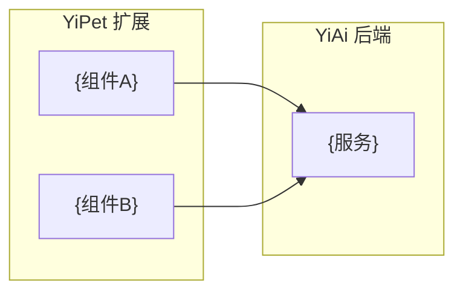

# YP-XX-NN: {需求标题} — {一句话描述}

> 需求编号：YP-XX-NN · 优先级：{P0|P1|P2|P3} · 人天：{N.N}d · 状态：{状态}
> 依赖：{依赖的需求编号，无则写"无"}
> 交付物：{关键交付物列表}

本文档定义**需求**——Chrome MV3 扩展必须提供什么能力、边界在哪里、如何验收。实现方案见[开发方案](../../devs/{YYYY-MM}/{序号}-prd-task-{描述}.md)，验证方式见[测试用例](../../tests/{YYYY-MM}/{序号}-prd-test-{描述}.md)。

---

## 背景

### 业务背景

{描述谁、在什么场景下、遇到什么问题、为什么现在要解决}

### 核心挑战

| 挑战 | 影响 | 说明 |
|------|------|------|
| {挑战1} | {影响} | {说明} |
| {挑战2} | {影响} | {说明} |

---

## 一、现状与目标

### 1.1 改造前

{当前扩展的行为、限制、痛点}

### 1.2 改造后能力全景

| 能力 | 载体 | 作用点 |
|------|------|--------|
| {能力1} | {Content Script / SW / Popup} | {在哪个环节生效} |

### 1.3 能力边界

{明确本需求**不**覆盖的场景。MV3 平台限制需明确标注。}

---

## 二、需求范围

### 2.1 范围内

| 编号 | 需求项 |
|------|--------|
| R-01 | {需求项} |

### 2.2 范围外

| 不做的事 | 原因 | 归属 |
|---------|------|------|
| {事项} | {原因（含 MV3 限制）} | 未来按需 |

---

## 三、功能需求

### FR-01 {功能模块名}

| 项 | 要求 |
|----|------|
| {属性1} | {要求} |
| {属性2} | {要求} |

### 双世界职责

| 世界 | 职责 | 约束 |
|------|------|------|
| Content Script | {职责} | ISOLATED world，无法访问页面 JS |
| Service Worker | {职责} | 30s 空闲休眠，无 DOM 访问 |
| Popup | {职责} | 失焦即销毁 |

---

## 四、非功能需求

### 4.1 安全需求

| 需求 | 要求 | 验证方式 |
|------|------|---------|
| CSP 合规 | 无 inline script、无 eval | 构建产物审查 |

### 4.2 性能需求

| 指标 | 目标 | 说明 |
|------|------|------|
| Content Script 注入耗时 | < 100ms | 不阻塞页面渲染 |

### 4.3 MV3 兼容性

- Service Worker 生命周期（空闲 30s 休眠）
- `chrome.storage` 配额限制（local 10MB / sync 100KB）
- CSP 限制（禁止 remote code）

---

## 五、设计决策

| 决策 | 选项 A | 选项 B | 选择 | 理由 |
|------|--------|--------|------|------|
| {决策主题} | {A} | {B} | **{选择}** | {理由} |

---

## 六、验收标准

- [ ] **AC-01** {验收条件}
- [ ] **AC-02** {验收条件}
- [ ] **AC-03** `tsc --noEmit` 与 `npm run build` 通过

---

## 七、风险与缓解

| 风险 | 概率 | 影响 | 等级 | 缓解措施 |
|------|------|------|------|---------|
| {风险} | 高/中/低 | 高/中/低 | **高/中/低** | {措施} |

---

## 八、回滚策略

| 回滚场景 | 回滚方式 | 影响范围 |
|----------|----------|----------|
| {场景} | 发布修复版本 | 全部用户（Chrome Web Store 审核周期） |

---

## 九、后续演进

| 编号 | 事项 | 优先级 | 说明 |
|------|------|--------|------|
| T-01 | {事项} | P0/P1/P2/P3 | {说明} |

---

## 十、关联需求

- 开发方案：[{序号}-prd-task-{描述}.md](../../devs/{YYYY-MM}/{序号}-prd-task-{描述}.md)
- 测试用例：[{序号}-prd-test-{描述}.md](../../tests/{YYYY-MM}/{序号}-prd-test-{描述}.md)