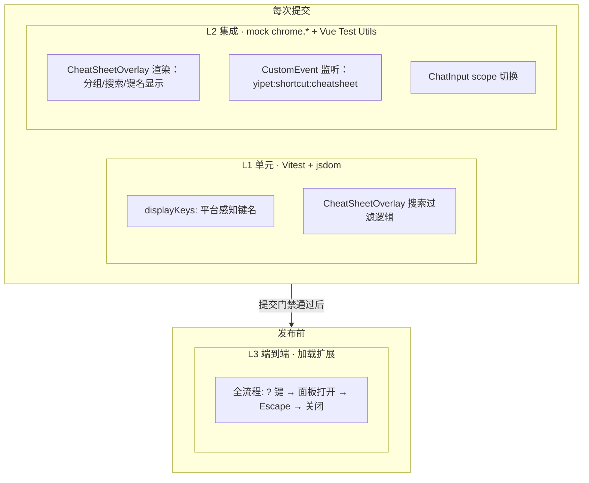

# YP-09-97: 键盘快捷键系统 — CheatSheetOverlay 与 ChatInput 集成 — 测试用例

> 来源 PRD：[104-功能实现-键盘快捷键系统.md](../../prds/2026-09/104-功能实现-键盘快捷键系统.md)
> 开发方案：[104-prd-task-键盘快捷键系统.md](../../devs/2026-09/104-prd-task-键盘快捷键系统.md)
> 提取日期：2026-09-15

本文档定义**验证方式**——测什么、怎么测、通过标准是什么。需求见 PRD，实现见开发方案。

---

## 一、测试范围与策略

### 1.1 测试分层

| 层级 | 工具 | 环境依赖 | 执行时机 |
|------|------|---------|---------|
| L1 单元 | Vitest + jsdom | 无外部依赖 | 每次提交 |
| L2 集成 | Vitest + @vue/test-utils + jsdom | mock chrome.* | 每次提交 |
| L3 端到端 | 加载扩展 + 手动 | YiAi + Chrome | 发布前 |

### 1.2 覆盖范围

| 编号 | 被测对象 | 层级 |
|------|---------|------|
| COV-1 | displayKeys 平台感知 | L1 |
| COV-2 | CheatSheetOverlay 搜索过滤 | L1 |
| COV-3 | CheatSheetOverlay 组件渲染 | L2 |
| COV-4 | CustomEvent 触发面板切换 | L2 |
| COV-5 | ChatInput scope 切换事件 | L2 |

### 1.3 不覆盖范围

| 不覆盖 | 原因 |
|--------|------|
| KeyboardRegistry 核心逻辑 | 见 [36-prd-test-快捷键系统.md](36-prd-test-快捷键系统.md) |
| 快捷键绑定编辑器 UI | 见 [198-prd-test-快捷键绑定编辑器.md](198-prd-test-快捷键绑定编辑器.md) |
| Element Plus el-dialog/el-input 内部行为 | 由 Element Plus 保证 |

### 1.4 测试环境

| 项 | 值 |
|----|-----|
| 运行器 | Vitest（`npm test`） |
| DOM | jsdom |
| Vue 测试 | @vue/test-utils + mount |
| chrome.* mock | `globalThis.chrome` mock |
| navigator.platform | 可注入 mock（MacIntel / Win32 / Linux） |

### 1.5 测试数据

| 夹具 | 数据 | 用途 |
|------|------|------|
| `mockShortcuts` | 14 个 ShortcutBinding 示例 | CheatSheetOverlay 渲染数据源 |
| `mockNavigatorMac` | `navigator.platform = 'MacIntel'` | macOS 键名显示 |
| `mockNavigatorWin` | `navigator.platform = 'Win32'` | Windows 键名显示 |

---

## 二、测试用例

### 2.1 displayKeys 平台感知（COV-1 · L1）

> 自动化落点：`tests/shared/shortcuts.test.ts`（**待新增**）

| 编号 | 用例 | 步骤 | 预期结果 | 优先级 | 状态 |
|------|------|------|---------|--------|------|
| TC-DK-001 | macOS 平台显示 Cmd | GIVEN navigator.platform='MacIntel' WHEN displayKeys('Ctrl+Shift+P') | 返回 "Cmd+Shift+P" | P0 | 待实现 |
| TC-DK-002 | Windows 平台显示 Ctrl | GIVEN navigator.platform='Win32' WHEN displayKeys('Ctrl+Shift+P') | 返回 "Ctrl+Shift+P" | P0 | 待实现 |
| TC-DK-003 | 多修饰键正确替换 | GIVEN macOS WHEN displayKeys('Ctrl+Alt+Delete') | 返回 "Cmd+Alt+Delete" | P1 | 待实现 |
| TC-DK-004 | 无修饰键不变 | GIVEN 任意平台 WHEN displayKeys('Enter') | 返回 "Enter" | P1 | 待实现 |
| TC-DK-005 | navigator 不可用时默认 Ctrl | GIVEN navigator 为 undefined WHEN displayKeys('Ctrl+P') | 返回 "Ctrl+P"（不崩溃） | P1 | 待实现 |

### 2.2 CheatSheetOverlay 搜索过滤（COV-2 · L1）

> 自动化落点：`tests/chat/components/CheatSheetOverlay.test.ts`（**待新增**）

| 编号 | 用例 | 步骤 | 预期结果 | 优先级 | 状态 |
|------|------|------|---------|--------|------|
| TC-CS-001 | 搜索快捷键描述 | GIVEN 14 个快捷键 WHEN 搜索 "zoom" | 返回 zoom-in + zoom-out 2 个 | P0 | 待实现 |
| TC-CS-002 | 搜索快捷键 ID | GIVEN 14 个快捷键 WHEN 搜索 "toggle-sidebar" | 返回 toggle-sidebar 1 个 | P0 | 待实现 |
| TC-CS-003 | 搜索键位字符串 | GIVEN 14 个快捷键 WHEN 搜索 "Ctrl+Shift+P" | 返回 toggle-pet 1 个 | P1 | 待实现 |
| TC-CS-004 | 搜索分类名 | GIVEN 14 个快捷键 WHEN 搜索 "Pet" | 返回 pet 分类下所有快捷键 | P1 | 待实现 |
| TC-CS-005 | 空搜索显示全部 | GIVEN 14 个快捷键 WHEN 搜索 "" (空) | 返回全部 14 个 | P0 | 待实现 |
| TC-CS-006 | 无匹配显示空状态 | GIVEN 14 个快捷键 WHEN 搜索 "xyznotexist" | grouped 为空数组，渲染空状态提示 | P1 | 待实现 |
| TC-CS-007 | 大小写不敏感 | GIVEN 快捷键描述 "Pet Controls" WHEN 搜索 "pet" | 匹配成功 | P1 | 待实现 |

### 2.3 CheatSheetOverlay 组件渲染（COV-3 · L2）

> 自动化落点：`tests/chat/components/CheatSheetOverlay.test.ts`（**待新增**）

| 编号 | 用例 | 步骤 | 预期结果 | 优先级 | 状态 |
|------|------|------|---------|--------|------|
| TC-CR-001 | 初始化不可见 | GIVEN CheatSheetOverlay 挂载 WHEN 初始状态 | visible === false，overlay DOM 不存在 | P0 | 待实现 |
| TC-CR-002 | 触发 CustomEvent 打开面板 | GIVEN 挂载 WHEN dispatchEvent('yipet:shortcut:cheatsheet') | visible === true，overlay DOM 渲染 | P0 | 待实现 |
| TC-CR-003 | 再次触发 CustomEvent 关闭面板 | GIVEN 面板已打开 WHEN dispatchEvent('yipet:shortcut:cheatsheet') | visible === false | P0 | 待实现 |
| TC-CR-004 | Escape 关闭面板 | GIVEN 面板已打开 WHEN 模拟 Escape keydown | visible === false | P0 | 待实现 |
| TC-CR-005 | 点击背景关闭面板 | GIVEN 面板已打开 WHEN 点击 .yipet-cheatsheet-overlay | visible === false | P0 | 待实现 |
| TC-CR-006 | 4 分组渲染 | GIVEN 面板已打开，未搜索 WHEN 渲染 | 4 个 group-title 元素存在（Pet/Chat/Navigation/Utilities） | P0 | 待实现 |
| TC-CR-007 | kbd 键名样式渲染 | GIVEN 面板已打开 WHEN 渲染 | 每个快捷键行至少包含 1 个 kbd 元素 | P1 | 待实现 |
| TC-CR-008 | 不可自定义标记 | GIVEN 面板已打开 WHEN 渲染 Enter 行 | 该行包含 🔒 图标 | P1 | 待实现 |
| TC-CR-009 | 搜索过滤后分组更新 | GIVEN 面板已打开 WHEN 输入 "zoom" 到搜索框 | 仅显示 Utilities 组，内有 zoom-in + zoom-out | P0 | 待实现 |

### 2.4 ChatInput 作用域切换（COV-5 · L2）

> 自动化落点：`tests/chat/components/ChatInput.test.ts`（**待新增**）

| 编号 | 用例 | 步骤 | 预期结果 | 优先级 | 状态 |
|------|------|------|---------|--------|------|
| TC-CI-001 | 输入框聚焦 → scope='input' | GIVEN ChatInput 挂载 WHEN textarea 触发 focus 事件 | keyboardRegistry.getScope() === 'input' | P0 | 待实现 |
| TC-CI-002 | 输入框失焦 → scope='chat' | GIVEN scope='input' WHEN textarea 触发 blur 事件 | keyboardRegistry.getScope() === 'chat' | P0 | 待实现 |
| TC-CI-003 | 输入框内 Enter 发送 | GIVEN scope='input'，input 有文本 WHEN 按 Enter (非 Shift) | 触发 sendMessage，不触发换行 | P0 | 待实现 |
| TC-CI-004 | Shift+Enter 换行 | GIVEN scope='input' WHEN 按 Shift+Enter | 不触发 sendMessage，插入换行 | P0 | 待实现 |
| TC-CI-005 | IME 组合时 Enter 不发送 | GIVEN isComposing=true WHEN 按 Enter | 不触发 sendMessage，IME 正常处理 | P0 | 待实现 |
| TC-CI-006 | Ctrl+K 清空会话 | GIVEN scope='input' WHEN 按 Ctrl+K | 触发 sendMessage('/clear') | P1 | 待实现 |
| TC-CI-007 | Escape 清空输入 | GIVEN scope='input'，input 有文本 WHEN 按 Escape | inputValue 清空为 '' | P1 | 待实现 |

---

## 三、边缘场景用例

| 编号 | 场景 | 步骤 | 预期结果 | 优先级 | 状态 |
|------|------|------|---------|--------|------|
| TC-EDGE-001 | 快速切换面板闪烁 | GIVEN 面板关闭 WHEN 快速连续 3 次 dispatchEvent 'yipet:shortcut:cheatsheet' | 最终 visible=true（toggle 奇数次），无闪烁异常 | P1 | 待实现 |
| TC-EDGE-002 | 输入框内按 `?` 不触发面板 | GIVEN textarea 聚焦 WHEN 按 `?` 键 | 面板不打开，`?` 字符正常输入到 textarea | P0 | 待实现 |
| TC-EDGE-003 | 面板搜索特殊字符 | GIVEN 面板已打开 WHEN 搜索 "+" 或 "?" | 不崩溃，返回匹配结果或空状态 | P1 | 待实现 |
| TC-EDGE-004 | 面板打开时组件卸载 | GIVEN 面板已打开 WHEN 组件 onUnmounted | 事件监听器被移除，无内存泄漏 | P1 | 待实现 |
| TC-EDGE-005 | 无快捷键时空面板 | GIVEN keyboardRegistry.getAll() 返回空数组 WHEN 面板打开 | 显示空状态提示（如 "No shortcuts registered"） | P1 | 待实现 |

---

## 四、回归用例

| 编号 | 关联缺陷 | 场景 | 当前预期（固化） | 优先级 | 状态 |
|------|---------|------|-----------------|--------|------|
| TC-REG-001 | — | 现有聊天功能不受快捷键系统影响 | ChatInput Enter/Esc 行为与重构前一致 | P0 | 待实现 |

---

## 五、追溯矩阵

| 需求项（PRD） | 验收标准 | 覆盖用例 |
|--------------|---------|---------|
| FR-01 CheatSheetOverlay 渲染 | AC-01 `?` 键打开，Escape 关闭，分组展示 | TC-CR-001~009 |
| FR-02 搜索过滤 | AC-02 实时过滤，大小写不敏感 | TC-CS-001~007 |
| FR-03 平台感知键名 | AC-03 macOS Cmd / Windows Ctrl | TC-DK-001~005 |
| FR-04 ChatInput scope 切换 | AC-04 focus→input, blur→chat | TC-CI-001~007 |

---

## 六、覆盖缺口

| 编号 | 缺口 | 影响 | 建议 |
|------|------|------|------|
| G-1 | CheatSheetOverlay 动画过渡不可测试 | 视觉反馈无法在 jsdom 中验证 | L3 手动确认 fade+scale 动画 |
| G-2 | `@vue/test-utils` 尚未在 YiPet 中使用 | 当前测试仅覆盖纯 .ts 文件 | 引入 @vue/test-utils 依赖后补充组件测试 |

---

## 七、入口与出口准则

### 入口准则

- [ ] CheatSheetOverlay 组件代码落地，`tsc --noEmit` 通过
- [ ] ChatInput scope 集成完成
- [ ] chrome.* mock 就绪

### 出口准则

- [ ] **P0 用例 100% 通过**
- [ ] P1 用例通过率 ≥ 90%
- [ ] 手动 L3 验证通过（? 键 → 面板 → Escape）
- [ ] 现有 97 个测试不退化