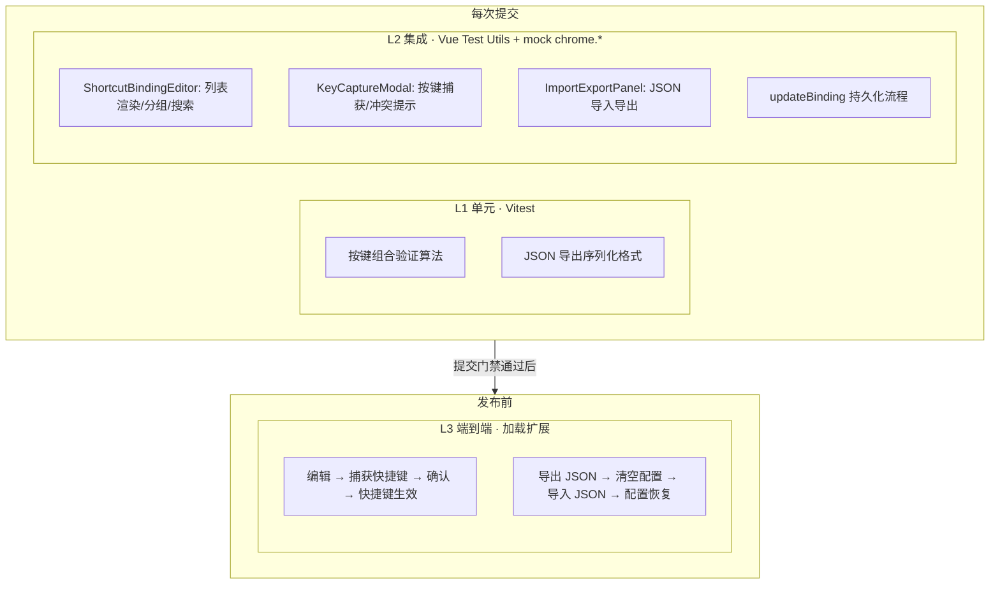

# YP-09-191: 快捷键绑定编辑器 — 测试用例

> 来源 PRD：[198-功能实现-快捷键绑定编辑器.md](../../prds/2026-09/198-功能实现-快捷键绑定编辑器.md)
> 开发方案：[198-prd-task-快捷键绑定编辑器.md](../../devs/2026-09/198-prd-task-快捷键绑定编辑器.md)
> 提取日期：2026-09-15

本文档定义**验证方式**——测什么、怎么测、通过标准是什么。需求见 PRD，实现见开发方案。

---

## 一、测试范围与策略

### 1.1 测试分层

| 层级 | 工具 | 环境依赖 | 执行时机 |
|------|------|---------|---------|
| L1 单元 | Vitest | 无外部依赖 | 每次提交 |
| L2 集成 | Vitest + @vue/test-utils + jsdom | mock chrome.* | 每次提交 |
| L3 端到端 | 加载扩展 + 手动 | YiAi + Chrome | 发布前 |

### 1.2 覆盖范围

| 编号 | 被测对象 | 层级 |
|------|---------|------|
| COV-1 | 组合键验证算法 (validateCombination) | L1 |
| COV-2 | JSON 导出/导入序列化 | L1 |
| COV-3 | ShortcutBindingEditor 列表渲染 | L2 |
| COV-4 | KeyCaptureModal 按键捕获 | L2 |
| COV-5 | ImportExportPanel 导入导出流程 | L2 |
| COV-6 | updateBinding + restoreDefaults 持久化 | L2 |

### 1.3 不覆盖范围

| 不覆盖 | 原因 |
|--------|------|
| KeyboardRegistry 核心 | 见 [36-prd-test-快捷键系统.md](36-prd-test-快捷键系统.md) |
| CheatSheetOverlay UI | 见 [104-prd-test-键盘快捷键系统.md](104-prd-test-键盘快捷键系统.md) |
| Element Plus el-table/el-dialog 内部行为 | 由 Element Plus 保证 |
| 跨版本导入 Schema 迁移 | 第一版不做版本迁移 |

### 1.4 测试环境

| 项 | 值 |
|----|-----|
| 运行器 | Vitest（`npm test`） |
| DOM | jsdom |
| Vue 测试 | @vue/test-utils + mount |
| chrome.* mock | `globalThis.chrome` mock（storage.sync/local） |
| file mock | mock FileReader / Blob / URL.createObjectURL |

### 1.5 测试数据

| 夹具 | 数据 | 用途 |
|------|------|------|
| `mockBindings` | 14 个 ShortcutBinding，其中 3 个有自定义 | 编辑器列表渲染 |
| `validKeyCombo` | `{ ctrlKey: true, shiftKey: true, key: 'K' }` | 有效组合键 |
| `modifierOnly` | `{ ctrlKey: true, key: 'Control' }` | 纯修饰键（无效） |
| `noModifierSingle` | `{ key: 'k' }` | 单字母无修饰键（警告） |
| `exportJSON` | `{ version: '1.0', exportedAt: '...', shortcuts: {...} }` | 导出格式 |
| `invalidJSON` | `{ foo: 'bar' }` | 无效导入格式 |

---

## 二、测试用例

### 2.1 组合键验证算法（COV-1 · L1）

> 自动化落点：`tests/shared/shortcuts.test.ts`（**待新增**）

| 编号 | 用例 | 步骤 | 预期结果 | 优先级 | 状态 |
|------|------|------|---------|--------|------|
| TC-CV-001 | 有效组合键 Ctrl+Shift+K | GIVEN { ctrl:true, shift:true, key:'K' } WHEN validateCombination | `{ valid: true }` | P0 | 待实现 |
| TC-CV-002 | 纯修饰键无效 | GIVEN { ctrl:true, key:'Control' } WHEN validateCombination | `{ valid: false, error: '请包含一个字母、数字或功能键' }` | P0 | 待实现 |
| TC-CV-003 | 功能键可无修饰键 | GIVEN { key:'F1' } WHEN validateCombination | `{ valid: true }` | P0 | 待实现 |
| TC-CV-004 | 单字母建议加修饰键 (全局) | GIVEN isGlobal=true, { key:'k' } WHEN validateCombination | `{ valid: false, error: '请搭配修饰键使用' }` | P1 | 待实现 |
| TC-CV-005 | 多修饰键 + 主键有效 | GIVEN { ctrl:true, alt:true, shift:true, key:'D' } WHEN validateCombination | `{ valid: true }` | P1 | 待实现 |
| TC-CV-006 | Cmd 键视为修饰键 | GIVEN { meta:true, key:'P' } WHEN validateCombination | `{ valid: true }` | P1 | 待实现 |

### 2.2 JSON 导出导入序列化（COV-2 · L1）

> 自动化落点：`tests/shared/shortcuts.test.ts`（**待新增**）

| 编号 | 用例 | 步骤 | 预期结果 | 优先级 | 状态 |
|------|------|------|---------|--------|------|
| TC-EX-001 | 导出 JSON 格式正确 | GIVEN 3 个自定义绑定 WHEN export() | JSON 包含 version="1.0", exportedAt (ISO 8601), shortcuts 对象有 3 个条目 | P0 | 待实现 |
| TC-EX-002 | 导出无自定义时 shortcuts 为空 | GIVEN 所有快捷键为默认值 WHEN export() | shortcuts 对象为空 `{}` | P1 | 待实现 |
| TC-EX-003 | 导入有效 JSON | GIVEN 有效导出 JSON WHEN import(json) | `{ success: true, imported: 3, errors: [] }` | P0 | 待实现 |
| TC-EX-004 | 导入无效 JSON 格式 | GIVEN 非 JSON 字符串 WHEN import('not json') | `{ success: false, errors: ['...'] }` | P0 | 待实现 |
| TC-EX-005 | 导入缺少 version 字段 | GIVEN `{ shortcuts: {} }` (无 version) WHEN import | `{ success: false, errors: ['无效的配置文件格式'] }` | P1 | 待实现 |
| TC-EX-006 | 导入含已废弃 ID | GIVEN shortcuts 含 2 个有效 + 1 个无效 ID WHEN import | `{ success: true, imported: 2, errors: [] }` — 跳过无效 ID | P1 | 待实现 |

### 2.3 ShortcutBindingEditor 列表渲染（COV-3 · L2）

> 自动化落点：`tests/chat/components/ShortcutBindingEditor.test.ts`（**待新增**）

| 编号 | 用例 | 步骤 | 预期结果 | 优先级 | 状态 |
|------|------|------|---------|--------|------|
| TC-BE-001 | 4 场景 Tab 渲染 | GIVEN 编辑器打开 WHEN 渲染 | 4 个 el-tab-pane: 全局/聊天/工具/阅读 | P0 | 待实现 |
| TC-BE-002 | 列表显示快捷键信息 | GIVEN "聊天" tab 选中 WHEN 渲染列表 | 每行显示: 名称、当前快捷键 (kbd)、编辑/重置按钮 | P0 | 待实现 |
| TC-BE-003 | 自定义快捷键蓝色标记 | GIVEN zoom-in 已自定义为 Ctrl+Shift+= WHEN 渲染 | 该行快捷键显示蓝色样式 (customized class) | P0 | 待实现 |
| TC-BE-004 | 不可自定义行无编辑按钮 | GIVEN Enter 行 (customizable=false) WHEN 渲染 | 编辑按钮 disabled 或隐藏 | P1 | 待实现 |
| TC-BE-005 | 默认快捷键无重置按钮 | GIVEN 快捷键未自定义 WHEN 渲染 | 重置按钮不显示 | P1 | 待实现 |
| TC-BE-006 | 点击编辑打开 KeyCaptureModal | GIVEN 列表渲染 WHEN 点击某行编辑按钮 | KeyCaptureModal 打开，进入监听模式 | P0 | 待实现 |

### 2.4 KeyCaptureModal 按键捕获（COV-4 · L2）

> 自动化落点：`tests/chat/components/KeyCaptureModal.test.ts`（**待新增**）

| 编号 | 用例 | 步骤 | 预期结果 | 优先级 | 状态 |
|------|------|------|---------|--------|------|
| TC-KM-001 | 初始状态显示提示 | GIVEN KeyCaptureModal 打开 WHEN 渲染 | 显示 "Press the key combination you want to bind..." | P0 | 待实现 |
| TC-KM-002 | 捕获 Ctrl+Shift+K | GIVEN 监听模式 WHEN 按下 Ctrl+Shift+K | 显示 "Ctrl + Shift + K"，确认按钮 enabled | P0 | 待实现 |
| TC-KM-003 | 仅按修饰键不捕获 | GIVEN 监听模式 WHEN 按下 Ctrl (释放) | 不显示任何键组合，等待主键 | P0 | 待实现 |
| TC-KM-004 | 捕获后确认保存 | GIVEN 已捕获 Ctrl+Shift+K WHEN 点击确认 | emit('confirm', 'Ctrl+Shift+K')，模态框关闭 | P0 | 待实现 |
| TC-KM-005 | 捕获后取消 | GIVEN 已捕获 Ctrl+Shift+K WHEN 点击取消或按 Escape | 模态框关闭，不 emit confirm | P0 | 待实现 |
| TC-KM-006 | 冲突警告显示 | GIVEN 捕获的键组合与已有快捷键冲突 WHEN 显示冲突 | 显示 "已被'切换侧边栏'使用" 警告 | P0 | 待实现 |
| TC-KM-007 | IME 激活时提示 | GIVEN compositionstart 触发 WHEN 监听模式 | 显示 "请关闭输入法后再录制快捷键" 提示 | P1 | 待实现 |
| TC-KM-008 | 重新捕获覆盖前次 | GIVEN 已捕获 Ctrl+Shift+K WHEN 再次按下 Ctrl+Shift+L | 显示更新为 "Ctrl + Shift + L" | P1 | 待实现 |

### 2.5 导入导出流程（COV-5 · L2）

| 编号 | 用例 | 步骤 | 预期结果 | 优先级 | 状态 |
|------|------|------|---------|--------|------|
| TC-IE-001 | 导出按钮触发下载 | GIVEN 编辑器已打开 WHEN 点击导出按钮 | 触发 Blob 下载，文件名格式 yipet-shortcuts-YYYY-MM-DD.json | P0 | 待实现 |
| TC-IE-002 | 导入按钮触发文件选择 | GIVEN 编辑器已打开 WHEN 点击导入按钮 | 打开文件选择对话框，accept=".json" | P0 | 待实现 |
| TC-IE-003 | 导入成功后列表刷新 | GIVEN 选择有效 JSON 文件 WHEN 导入完成 | 列表即时刷新，自定义标记更新 | P0 | 待实现 |
| TC-IE-004 | 导入失败显示错误 | GIVEN 选择无效 JSON 文件 WHEN 导入 | 显示错误提示 "无效的配置文件格式" | P1 | 待实现 |

### 2.6 重置功能（COV-6 · L2）

| 编号 | 用例 | 步骤 | 预期结果 | 优先级 | 状态 |
|------|------|------|---------|--------|------|
| TC-RS-001 | 重置单个快捷键 | GIVEN zoom-in 已自定义 WHEN 点击该行重置按钮 | zoom-in 恢复默认值 'Ctrl+=', 蓝色标记消失 | P0 | 待实现 |
| TC-RS-002 | 全部重置需确认 | GIVEN 多个快捷键已自定义 WHEN 点击全部重置 | 弹出确认对话框 "确认恢复所有默认快捷键？" | P0 | 待实现 |
| TC-RS-003 | 确认后全部重置生效 | GIVEN 确认对话框已显示 WHEN 点击确认 | 所有快捷键恢复默认，自定义标记全部消失 | P0 | 待实现 |
| TC-RS-004 | 取消重置不生效 | GIVEN 确认对话框已显示 WHEN 点击取消 | 快捷键保持不变 | P1 | 待实现 |
| TC-RS-005 | 重置后持久化清除 | GIVEN 全部重置 WHEN 检查 chrome.storage.sync | 'yipet:shortcuts' key 被 remove | P1 | 待实现 |

---

## 三、边缘场景用例

| 编号 | 场景 | 步骤 | 预期结果 | 优先级 | 状态 |
|------|------|------|---------|--------|------|
| TC-EDGE-001 | 导入空文件 | GIVEN 空 JSON 文件 WHEN 导入 | 显示 "无效的配置文件格式" | P1 | 待实现 |
| TC-EDGE-002 | 导入超大文件 | GIVEN JSON 文件 > 1MB WHEN 导入 | 拒绝导入，提示文件过大 | P2 | 待实现 |
| TC-EDGE-003 | 按键捕获时窗口失焦 | GIVEN 监听模式 WHEN 用户点击模态框外 | 模态框保持打开，捕获的键组合不丢失 | P1 | 待实现 |
| TC-EDGE-004 | 同时打开多个编辑器实例 | GIVEN 编辑器已打开 WHEN 再次触发打开 | 不创建第二个实例（单例模式 或复用现有实例） | P1 | 待实现 |
| TC-EDGE-005 | 导出自定义后修改快捷键再导入 | GIVEN 导出配置 A → 修改快捷键 → 导入配置 A WHEN 导入 | 快捷键恢复到配置 A 的状态 | P1 | 待实现 |

---

## 四、回归用例

| 编号 | 关联缺陷 | 场景 | 当前预期（固化） | 优先级 | 状态 |
|------|---------|------|-----------------|--------|------|
| TC-REG-001 | — | 编辑器打开/关闭不影响聊天功能 | 聊天消息、发送、切换正常 | P0 | 待实现 |

---

## 五、追溯矩阵

| 需求项（PRD） | 验收标准 | 覆盖用例 |
|--------------|---------|---------|
| FR-01 查看快捷键列表 | AC-01 4 场景分组 + 搜索过滤 | TC-BE-001~006 |
| FR-02 修改快捷键绑定 | AC-02 按键捕获 → 确认 → 生效 | TC-KM-001~008 |
| FR-03 冲突检测提示 | AC-03 扩展内冲突 + 已知系统冲突 | TC-KM-006 |
| FR-04 导入导出配置 | AC-04 JSON 格式正确 + 导入有效 | TC-EX-001~006, TC-IE-001~004 |
| FR-05 重置快捷键 | AC-05 单个重置 + 全部重置确认 | TC-RS-001~005 |

---

## 六、覆盖缺口

| 编号 | 缺口 | 影响 | 建议 |
|------|------|------|------|
| G-1 | 跨版本导入 Schema 迁移未测试 | 第一版不做迁移，暂不覆盖 | 在实现迁移功能后补充 |
| G-2 | 导入大文件性能未测试 | 配置文件通常 < 10KB | 添加文件大小上限校验即可 |
| G-3 | @vue/test-utils 尚未在 YiPet 中使用 | L2 组件测试需要先引入依赖 | 引入 @vue/test-utils 后执行 L2 用例 |

---

## 七、入口与出口准则

### 入口准则

- [ ] ShortcutBindingEditor / KeyCaptureModal / ImportExportPanel 代码落地
- [ ] `tsc --noEmit` 通过
- [ ] chrome.* mock + file mock 就绪

### 出口准则

- [ ] **P0 用例 100% 通过**
- [ ] P1 用例通过率 ≥ 90%，未通过项已登记
- [ ] L3 手动验证: 编辑 → 捕获 → 保存 → 快捷键生效
- [ ] L3 手动验证: 导出 → 清空 → 导入 → 配置恢复
- [ ] 现有测试不退化