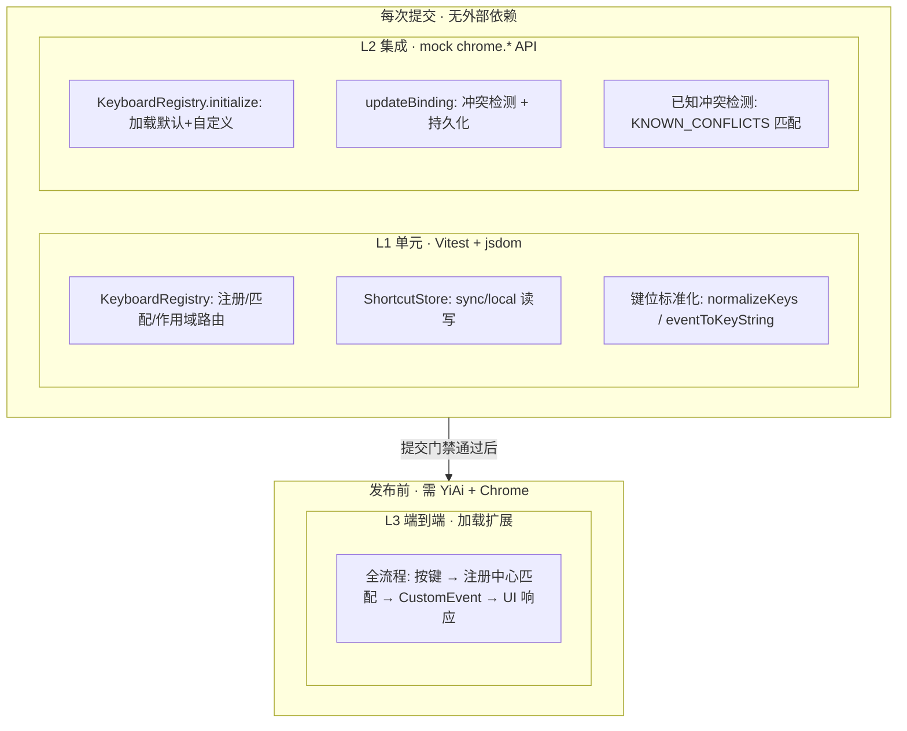

# YP-09-29: 快捷键系统 — 测试用例

> 来源 PRD：[36-架构设计-快捷键系统.md](../../prds/2026-09/36-架构设计-快捷键系统.md)
> 开发方案：[36-prd-task-快捷键系统.md](../../devs/2026-09/36-prd-task-快捷键系统.md)
> 提取日期：2026-09-15

本文档定义**验证方式**——测什么、怎么测、通过标准是什么。需求见 PRD，实现见开发方案。

---

## 一、测试范围与策略

### 1.1 测试分层

| 层级 | 工具 | 环境依赖 | 执行时机 |
|------|------|---------|---------|
| L1 单元 | Vitest + jsdom | 无外部依赖 | 每次提交 |
| L2 集成 | Vitest + mock chrome.* API | 无外部依赖 | 每次提交 |
| L3 端到端 | 加载扩展 + 手动 | YiAi + Chrome | 发布前 |

### 1.2 覆盖范围

| 编号 | 被测对象 | 层级 |
|------|---------|------|
| COV-1 | KeyboardRegistry 注册/匹配/作用域 | L1 |
| COV-2 | ShortcutStore 持久化 | L2 |
| COV-3 | 键位标准化算法 | L1 |
| COV-4 | 已知冲突检测 | L2 |
| COV-5 | updateBinding 自定义流程 | L2 |

### 1.3 不覆盖范围

| 不覆盖 | 原因 |
|--------|------|
| Chrome Extensions API 内部行为 | 由 Chrome 自身保证 |
| chrome.commands 触发 (manifest.json) | 需真实 Chrome 环境，归 L3 |
| CheatSheetOverlay UI 渲染 | 见 [104-prd-test-键盘快捷键系统.md](104-prd-test-键盘快捷键系统.md) |
| 快捷键绑定编辑器 | 见 [198-prd-test-快捷键绑定编辑器.md](198-prd-test-快捷键绑定编辑器.md) |

### 1.4 测试环境

| 项 | 值 |
|----|-----|
| 运行器 | Vitest（`npm test`） |
| DOM | jsdom |
| 用例发现 | `tests/**/*.{test,spec}.ts` |
| chrome.* mock | `globalThis.chrome` mock（storage.sync/local） |
| 别名 | `@` → `src` |

### 1.5 测试数据

| 夹具 | 数据 | 用途 |
|------|------|------|
| `DEFAULT_BINDINGS` | 14 个默认快捷键绑定 | 注册/匹配基准 |
| `KNOWN_CONFLICTS` | 18 个已知冲突快捷键 | 冲突检测基准 |
| `customStorageData` | `{ 'zoom-in': 'Ctrl+Shift+=' }` | 自定义持久化验证 |

---

## 二、测试用例

### 2.1 KeyboardRegistry 注册与匹配（COV-1 · L1）

> 自动化落点：`tests/shared/shortcuts.test.ts`（**待新增**）

| 编号 | 用例 | 步骤 | 预期结果 | 优先级 | 状态 |
|------|------|------|---------|--------|------|
| TC-KR-001 | 初始化注册 14 个快捷键 | GIVEN KeyboardRegistry 创建 WHEN 调用 initialize() THEN 检查 getAll() | `getAll().length === 14`；所有 id 存在于 DEFAULT_BINDINGS | P0 | 待实现 |
| TC-KR-002 | 精确匹配已注册快捷键 | GIVEN registry 已初始化 WHEN 模拟 Ctrl+Shift+X keydown (ctrlKey=true, shiftKey=true, key='X') THEN _handleKeyDown | `byKeys.get('Ctrl+Shift+X') === 'open-chat'` | P0 | 待实现 |
| TC-KR-003 | 未注册快捷键 passthrough | GIVEN registry 已初始化 WHEN 模拟 Ctrl+Shift+Z keydown | 事件不被 preventDefault，不被 stopImmediatePropagation | P0 | 待实现 |
| TC-KR-004 | IME 组合时跳过 | GIVEN registry 已初始化 WHEN 模拟 keydown 且 e.isComposing=true | 不匹配任何快捷键，不调用 preventDefault | P0 | 待实现 |
| TC-KR-005 | 修饰键标准化 | GIVEN 输入 "shift+ctrl+x" WHEN normalizeKeys | 输出 "Ctrl+Shift+X"（Ctrl 在 Shift 前） | P0 | 待实现 |
| TC-KR-006 | macOS Cmd 键映射 | GIVEN e.metaKey=true, e.key='p' WHEN eventToKeyString | 输出 "Ctrl+P"（metaKey 视为 Ctrl） | P1 | 待实现 |

### 2.2 作用域路由（COV-1 · L1）

| 编号 | 用例 | 步骤 | 预期结果 | 优先级 | 状态 |
|------|------|------|---------|--------|------|
| TC-SC-001 | global 快捷键始终匹配 | GIVEN scope='page' WHEN 匹配 scope='global' 的快捷键 | 匹配成功，触发 CustomEvent | P0 | 待实现 |
| TC-SC-002 | chat 快捷键在 input scope 匹配 | GIVEN scope='input' WHEN 匹配 scope='chat' 的快捷键 | 匹配成功（chat 向上兼容 input） | P0 | 待实现 |
| TC-SC-003 | chat 快捷键在 page scope 不匹配 | GIVEN scope='page' WHEN 匹配 scope='chat' 的快捷键 | 不匹配，事件 passthrough | P0 | 待实现 |
| TC-SC-004 | input 快捷键仅在 input scope 匹配 | GIVEN scope='chat' WHEN 匹配 scope='input' 的快捷键 (Enter) | 不匹配，事件 passthrough | P0 | 待实现 |
| TC-SC-005 | setScope 切换 | GIVEN scope='page' WHEN setScope('input') THEN getScope() | getScope() === 'input' | P1 | 待实现 |

### 2.3 ShortcutStore 持久化（COV-2 · L2）

> 前置：mock `chrome.storage.sync` 和 `chrome.storage.local`

| 编号 | 用例 | 步骤 | 预期结果 | 优先级 | 状态 |
|------|------|------|---------|--------|------|
| TC-ST-001 | 加载用户自定义绑定 | GIVEN chrome.storage.sync 返回 `{ 'yipet:shortcuts': { 'zoom-in': 'Ctrl+Shift+=' } }` WHEN load() | 返回 `{ 'zoom-in': 'Ctrl+Shift+=' }` | P0 | 待实现 |
| TC-ST-002 | sync 不可用时 fallback 到 local | GIVEN chrome.storage.sync.get 抛出异常，local 返回数据 WHEN load() | 返回 local 中的数据 | P0 | 待实现 |
| TC-ST-003 | 保存自定义绑定 | GIVEN 自定义绑定数据 WHEN save({ 'zoom-in': 'Ctrl+Shift+=' }) | chrome.storage.sync.set 被调用，参数正确 | P0 | 待实现 |
| TC-ST-004 | sync 写入失败 fallback 到 local | GIVEN chrome.storage.sync.set 抛出异常 WHEN save | chrome.storage.local.set 被调用 | P1 | 待实现 |
| TC-ST-005 | 清空所有存储 | GIVEN sync 和 local 都有数据 WHEN clear() | sync.remove 和 local.remove 均被调用 | P1 | 待实现 |

### 2.4 updateBinding 自定义流程（COV-5 · L2）

| 编号 | 用例 | 步骤 | 预期结果 | 优先级 | 状态 |
|------|------|------|---------|--------|------|
| TC-UB-001 | 成功自定义快捷键 | GIVEN registry 已初始化 WHEN updateBinding('zoom-in', 'Ctrl+Shift+=') | 返回 `{ success: true }`，binding.keys 更新为 'Ctrl+Shift+=' | P0 | 待实现 |
| TC-UB-002 | 自定义不可自定义的快捷键 | GIVEN registry 已初始化 WHEN updateBinding('send-message', 'Ctrl+Enter') | 返回 `{ success: false }`（customizable=false） | P0 | 待实现 |
| TC-UB-003 | 冲突检测 — 扩展内重复 | GIVEN 'toggle-sidebar' 绑定 'Ctrl+B' WHEN updateBinding('zoom-in', 'Ctrl+B') | 返回 `{ success: false, conflict: 'toggle-sidebar' }` | P0 | 待实现 |
| TC-UB-004 | 恢复默认 | GIVEN 多个快捷键已自定义 WHEN restoreDefaults() | 所有 binding.keys 恢复为 DEFAULT_BINDINGS 中的值 | P0 | 待实现 |

### 2.5 已知冲突检测（COV-4 · L2）

| 编号 | 用例 | 步骤 | 预期结果 | 优先级 | 状态 |
|------|------|------|---------|--------|------|
| TC-KC-001 | 检测到已知冲突 | GIVEN registry 注册了 'toggle-pet' (Ctrl+Shift+P) WHEN _detectKnownConflicts() | knownConflicts 包含 `{ keys: 'Ctrl+Shift+P', description: '命令面板 (VS Code)' }` | P0 | 待实现 |
| TC-KC-002 | 无已知冲突时不误报 | GIVEN registry 仅注册了 'Ctrl+I' 等无冲突快捷键 WHEN _detectKnownConflicts() | knownConflicts 为空数组 | P1 | 待实现 |
| TC-KC-003 | console.warn 输出冲突 | GIVEN 检测到至少 1 个已知冲突 WHEN _detectKnownConflicts() | console.warn 被调用，包含冲突列表 | P1 | 待实现 |

---

## 三、边缘场景用例

| 编号 | 场景 | 步骤 | 预期结果 | 优先级 | 状态 |
|------|------|------|---------|--------|------|
| TC-EDGE-001 | 空快捷键字符串 | GIVEN DEFAULT_BINDINGS 中某 binding.keys 为空 WHEN normalizeKeys('') | 返回空字符串，不抛异常 | P1 | 待实现 |
| TC-EDGE-002 | 仅修饰键无主键 | GIVEN keydown 事件仅 Ctrl 按下 (key='Control') WHEN eventToKeyString | 返回 "Ctrl"，不包含重复的 Control | P1 | 待实现 |
| TC-EDGE-003 | 空格键 | GIVEN keydown 事件 key=' ' WHEN eventToKeyString | 返回 "Ctrl+Space"（如有 Ctrl）或 "Space" | P1 | 待实现 |
| TC-EDGE-004 | storage 全部不可用 | GIVEN sync 和 local 都抛异常 WHEN load() | 返回 `{}` 空对象，不崩溃 | P1 | 待实现 |
| TC-EDGE-005 | 重复注册同一 ID | GIVEN registry 已注册 'zoom-in' WHEN 再次 register 相同 id | 覆盖旧 binding，不产生重复条目 | P1 | 待实现 |

---

## 四、回归用例

| 编号 | 关联缺陷 | 场景 | 当前预期（固化） | 修复后预期 | 优先级 | 状态 |
|------|---------|------|-----------------|-----------|--------|------|
| TC-REG-001 | 缺陷 37 (快捷键冲突检测) | Ctrl+Shift+P 在 manifest.json 中声明 | `chrome.commands` 全局处理，KeyboardRegistry 不重复处理 | 同上 | P1 | 待实现 |

---

## 五、追溯矩阵

| 需求项（PRD） | 验收标准 | 覆盖用例 |
|--------------|---------|---------|
| FR-01 KeyboardRegistry 核心 | AC-01 14 个快捷键注册 | TC-KR-001~006 |
| FR-02 4 层作用域路由 | AC-02 global/chat/input/page 隔离 | TC-SC-001~005 |
| FR-03 ShortcutStore 持久化 | AC-03 sync/local 读写正确 | TC-ST-001~005 |
| FR-04 updateBinding 自定义 | AC-04 可自定义 + 冲突检测 | TC-UB-001~004 |
| FR-05 已知冲突检测 | AC-05 18 项已知冲突检测 | TC-KC-001~003 |

---

## 六、覆盖缺口

| 编号 | 缺口 | 影响 | 建议 |
|------|------|------|------|
| G-1 | L3 端到端测试未自动化 | 依赖手动验证，回归周期长 | 引入 Playwright + Chrome Extensions 测试框架 |
| G-2 | 捕获阶段 `{ capture: true }` 在 jsdom 中无法完全模拟 | jsdom 不区分捕获/冒泡阶段 | L3 手动验证捕获阶段行为 |
| G-3 | chrome.commands 触发路径未覆盖 | 需真实 Chrome 环境 | L3 手动验证 4 个全局快捷键 |

---

## 七、入口与出口准则

### 入口准则

- [ ] KeyboardRegistry 代码落地，`tsc --noEmit` 通过
- [ ] chrome.* mock 就绪

### 出口准则

- [ ] **P0 用例 100% 通过**
- [ ] P1 用例通过率 ≥ 90%，未通过项已登记
- [ ] 用例并入 `npm test`，全量通过
- [ ] 覆盖率达标；已登记缺口可接受