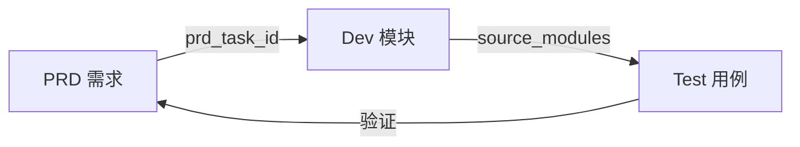

# YiPet 测试文档索引

> **文档职责**：本文档定义**怎么验证**（VERIFY），不含产品目标与实现方案。

> 测试文档——描述 VERIFY（测试策略、测试用例、回归计划），独立于产品和开发文档。
> 完整追溯链：**OKR → PRD → Dev Module → Test**

<a id="sec-1"></a>
## 一、全链路追溯



<a id="sec-2"></a>
## 二、月度分布

| 月份 | PRD 数 | Dev 模块数 | Test 规格数 |
|------|--------|-----------|------------|
| 2026-07 | 7 | [7](../devs/2026-07/) | [7](./2026-07/) |
| 2026-08 | 8 | [8](../devs/2026-08/) | [8](./2026-08/) |
| 2026-09 | 232 | [232](../devs/2026-09/) | [232](./2026-09/) |

<a id="sec-3"></a>
## 三、Test 文档结构

每个测试用例文件遵循标准结构（参考 [Test 模板](../模板/00-模板-测试规格.md)）：

```
1. 测试范围与策略 — 测试分层、覆盖范围、环境配置
2. 测试用例 — 按模块分组 (TC-{MODULE}-{NNN})
3. 边缘场景用例 — SW 休眠恢复、storage 配额满、受保护页面
4. 回归用例 — 已知缺陷固化测试
5. 追溯矩阵 — 需求项 → 用例映射
6. 覆盖缺口 — 已知未覆盖项及建议
7. 入口与出口准则 — 测试开始/通过条件
```

<a id="sec-4"></a>
## 四、测试分层

| 层级 | 工具 | 环境依赖 | 执行时机 |
|------|------|---------|---------|
| L1 单元 | Vitest + jsdom | 无外部依赖 | 每次提交 |
| L2 集成 | Vitest + mock chrome.* API | 无外部依赖 | 每次提交 |
| L3 端到端 | 加载扩展 + 手动/Playwright | YiAi + Chrome | 发布前 |

<a id="sec-5"></a>
## 五、文件命名约定

```
tests/{month}/NN-prd-test-{描述}.md   → 测试规格文档
prds/{month}/NN-{type}-{描述}.md      → 来源 PRD
devs/{month}/NN-prd-task-{描述}.md    → 对应开发模块
```

<a id="sec-6"></a>
## 六、Frontmatter 规范

```yaml
doc_type: test
prd_task_id: "YP-{月}-{序号}"
source_prds: ["{PRD名称}"]
source_modules: ["{Dev模块}"]
```

<a id="sec-7"></a>
## 七、YiPet 测试要点

| 关注点 | 工具 | 说明 |
|--------|------|------|
| 双世界隔离 | mock chrome.* | CS 不访问 MAIN 变量，MAIN 不调 chrome.* |
| IPC 通信 | mock postMessage | 消息格式、签名验证、超时 |
| SW 生命周期 | 模拟 SW 重启 | 状态从 chrome.storage 恢复 |
| chrome.storage | mock storage API | 配额限制、序列化 |
| MV3 CSP | 静态检查 | 无 eval、无远程代码 |
| ApiClient | mock fetch | RPC 信封格式、参数名契约 |

<a id="sec-8"></a>
## 八、追溯规则

| 从 | 到 | 字段 | 说明 |
|----|----|------|------|
| Test | Dev | `source_modules` | 每个 Test **必须**关联至少一个 Dev Module |
| Test | PRD | `source_prds` | 每个 Test **必须**关联来源 PRD |

<a id="sec-9"></a>
## 九、出口准则

- [ ] P0 用例 100% 通过
- [ ] P1 用例通过率 ≥ 90%
- [ ] 用例并入 `npm test`，全量通过
- [ ] `tsc --noEmit` 通过
- [ ] `npm run build` 成功