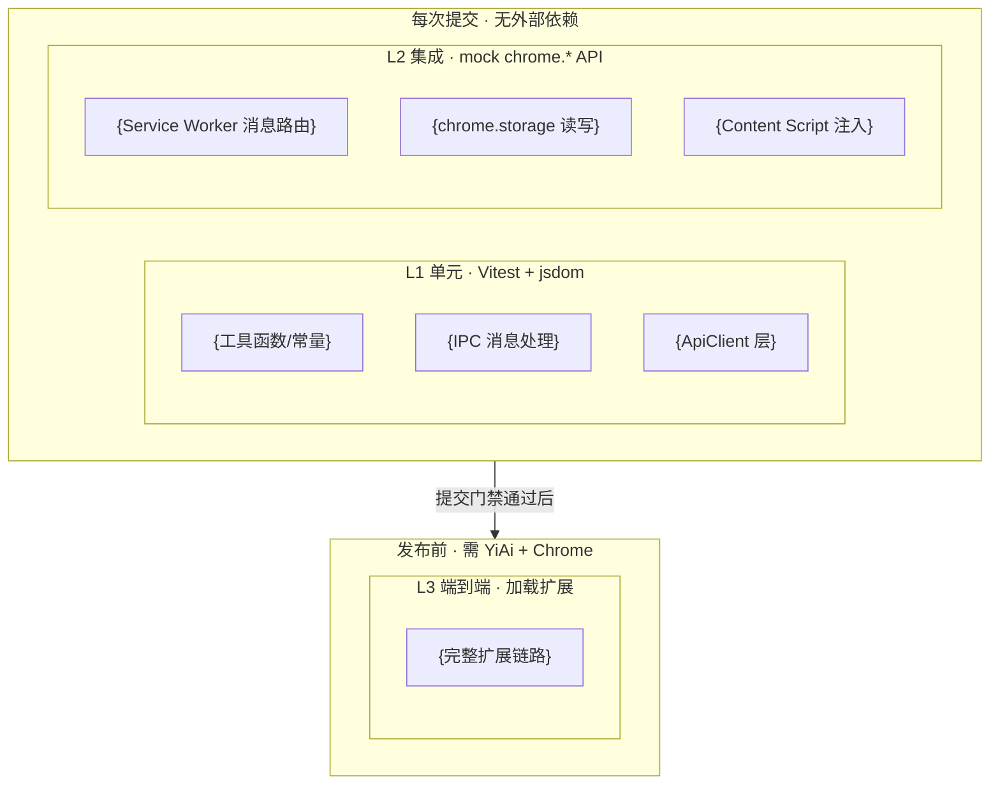

# YP-{{MONTH}}-{{NUMBER}}: {{功能名称}} — {{一句话描述}} — 测试用例

> 来源 PRD：[{{NUMBER}}-{{分类}}-{{描述}}.md](../../prds/{{YEAR}}-{{MONTH}}/{{NUMBER}}-{{分类}}-{{描述}}.md)
> 开发方案：[{{NUMBER}}-prd-task-{{描述}}.md](../../devs/{{YEAR}}-{{MONTH}}/{{NUMBER}}-prd-task-{{描述}}.md)
> 提取日期：{{DATE}}

本文档定义**验证方式**——测什么、怎么测、通过标准是什么。需求见 PRD，实现见开发方案。

---

## 一、测试范围与策略

### 1.1 测试分层

| 层级 | 工具 | 环境依赖 | 执行时机 |
|------|------|---------|---------|
| L1 单元 | Vitest + jsdom | 无外部依赖 | 每次提交 |
| L2 集成 | Vitest + mock chrome.* API | 无外部依赖 | 每次提交 |
| L3 端到端 | 加载扩展 + 手动/Playwright | YiAi + Chrome | 发布前 |

### 1.2 覆盖范围

| 编号 | 被测对象 | 层级 |
|------|---------|------|
| COV-1 | {模块1} | L1/L2 |
| COV-2 | {模块2} | L1/L2 |

### 1.3 不覆盖范围

| 不覆盖 | 原因 |
|--------|------|
| Chrome Extensions API 内部行为 | 由 Chrome 自身保证 |
| chrome.storage 配额满自动驱逐 | Chrome 内部实现 |

### 1.4 测试环境

| 项 | 值 |
|----|-----|
| 运行器 | Vitest（`npm test`） |
| DOM | jsdom |
| 用例发现 | `tests/**/*.{test,spec}.ts` |
| chrome.* mock | `tests/__mocks__/chrome.ts`（mock 全部 chrome.* API） |
| 别名 | `@` → `src` |

### 1.5 测试数据

| 夹具 | 数据 | 用途 |
|------|------|------|
| `{FIXTURE_A}` | {描述} | {场景} |
| `{FIXTURE_B}` | {描述} | {场景} |

---

## 二、测试用例

### 2.1 {被测模块1}（COV-1 · L1）

> 自动化落点：`tests/{path}/{name}.test.ts`（**待新增**）

| 编号 | 用例 | 步骤 | 预期结果 | 优先级 | 状态 |
|------|------|------|---------|--------|------|
| TC-{MODULE}-001 | {正常场景} | {GIVEN/WHEN/THEN} | {预期} | P0 | 待实现 |
| TC-{MODULE}-002 | {边界场景} | {步骤} | {预期} | P0 | 待实现 |

### 2.2 {被测模块2}（COV-2 · L2）

> 自动化落点：`tests/{path}/{name}.test.ts`（**待新增**）
> 前置：mock `chrome.runtime.sendMessage`、`chrome.storage.local`

| 编号 | 用例 | 步骤 | 预期结果 | 优先级 | 状态 |
|------|------|------|---------|--------|------|
| TC-{MODULE}-001 | {用例标题} | {步骤} | {预期} | P0 | 待实现 |
| TC-{MODULE}-002 | SW 休眠恢复 | SW 重新启动后读取存储 | 状态恢复，功能正常 | P0 | 待实现 |

---

## 三、边缘场景用例

| 编号 | 场景 | 步骤 | 预期结果 | 优先级 | 状态 |
|------|------|------|---------|--------|------|
| TC-EDGE-001 | SW 休眠恢复 | 模拟 SW 重启 | 状态从 chrome.storage 恢复 | P0 | 待实现 |
| TC-EDGE-002 | storage 配额满 | 写入超配额数据 | LRU 淘汰或错误处理，不崩溃 | P1 | 待实现 |
| TC-EDGE-003 | 受保护页面注入 | 在 chrome:// 页面尝试注入 | 静默跳过，不抛错 | P1 | 待实现 |

---

## 四、回归用例

| 编号 | 关联缺陷 | 场景 | 当前预期（固化） | 修复后预期 | 优先级 | 状态 |
|------|---------|------|-----------------|-----------|--------|------|
| TC-REG-001 | 缺陷 N | {场景} | {当前行为} | {期望行为} | Pn | 待实现 |

---

## 五、追溯矩阵

| 需求项（PRD） | 验收标准 | 覆盖用例 |
|--------------|---------|---------|
| FR-01 {功能} | AC-01 | TC-{MODULE}-001 ~ 003 |

---

## 六、覆盖缺口

| 编号 | 缺口 | 影响 | 建议 |
|------|------|------|------|
| G-1 | {缺口} | {影响} | {建议} |

---

## 七、入口与出口准则

### 入口准则

- [ ] 开发方案文件清单落地，`tsc --noEmit` 通过
- [ ] chrome.* mock 就绪

### 出口准则

- [ ] **P0 用例 100% 通过**
- [ ] P1 用例通过率 ≥ 90%，未通过项已登记
- [ ] 用例并入 `npm test`，全量通过
- [ ] 覆盖率达标；已登记缺口可接受