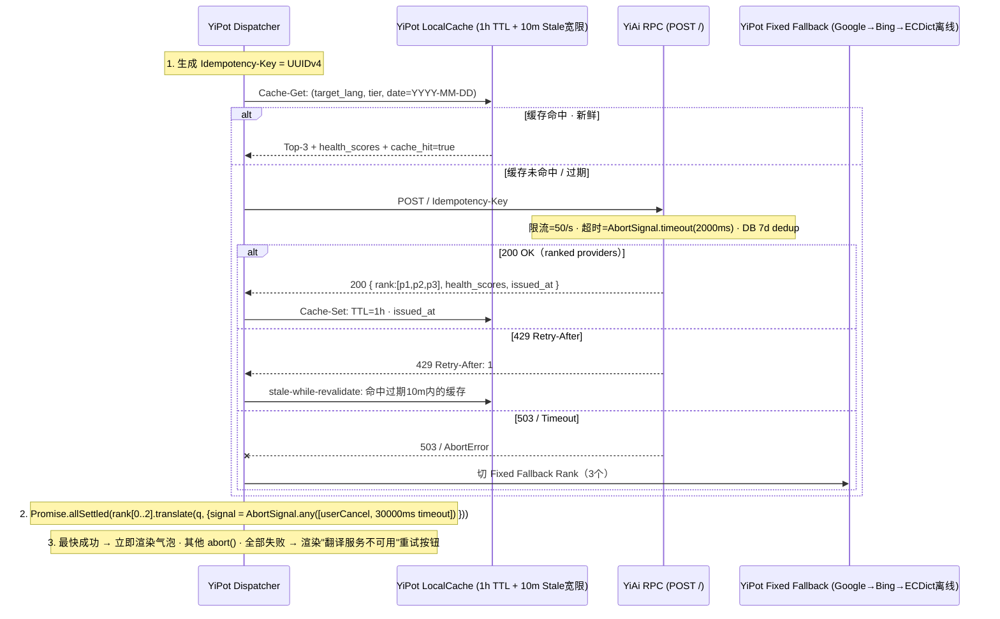

# YiPot 项目知识库

> **跨平台桌面翻译引擎（原 Pot → 2026 品牌全面重命名 YiPot）**。Tauri 1.6（Rust 后端 + React 18 前端）架构，支持 **划词翻译 · 输入翻译 · 剪切板监听** 三模式翻译、框选截图 OCR 识别、插件化 36+ 翻译服务（DeepL/Google/Bing/Caiyun/Youdao/Ollama/OpenAI/Gemini 等）、插件化 OCR 服务（Tesseract · PaddleOCR · 系统 OCR）、TTS 语音朗读、生词本（导出 Anki / 欧路词典）、全局快捷键、系统托盘驻留、WebDAV 备份同步、本地 HTTP API 外部调用。

---

## 0. 新人入职指南 — 5 天上手路线图

| 阶段 | 核心任务 | 交付物 | 参考文档 | Checklist |
|------|---------|--------|---------|-----------|
| **Day 1 · 环境搭建** | Rust 稳定版 · Node 18 · pnpm · Tauri CLI · 三平台系统依赖（Linux:webkit2gtk · macOS:Xcode CLT · Windows:VS Build Tools）| `cargo tauri dev` 成功弹出翻译窗口 | [环境搭建](./workflows/操作指南/001-指南-环境搭建.md) | macOS 需签名证书（调试临时用 free dev ID）· Linux 依赖 apt 列表执行 ✓ |
| **Day 2 · 架构与硬约束** | 4 层分层架构 · 9 Rust 模块 · **3 大硬约束**（Bundle ID · 自动更新禁用 · unwrap 安全）| 手绘分层图 + 标注 3 大硬约束 | [项目架构](./workflows/开发规范/002-规范-项目架构.md) · [安全开发](./workflows/开发规范/007-规范-安全开发.md) | 能口述为什么 updater 目录被删除 ✓ · 为什么 tray.rs 不能引用 updater_window ✓ |
| **Day 3 · Rust 后端单步调试** | 调试 Rust 后端：VS Code lldb · 断点 `clipboard::poll_text()` · `hotkey::register()` | 断点触发 3 次（1. 划词复制 2. 按快捷键 3. 剪切板变化）| [调试排错](./workflows/操作指南/003-指南-调试排错.md) · [Rust 错误处理](./workflows/开发规范/008-规范-翻译错误处理.md) | 日志使用 tracing·info/warn/error，禁止 println! 生产遗留 ✓ |
| **Day 4 · 插件开发（1 个功能）** | 独立开发 1 个「小语种」翻译服务插件（3 文件模式：index + api + declare）| PR 合入，通过 Code Review 12 项 Checklist | [插件开发](./workflows/开发规范/003-规范-插件开发.md) | 插件签名算法正确 · 超时 30s AbortSignal · 错误分类降级 ✓ |
| **Day 5 · 构建 + 质量门禁** | 三平台构建（macOS universal · Windows x64 · Linux deb/AppImage）· 跑 76 篇 PRD 对应 smoke 测试 | `.dmg / .msi / .deb` 产物生成 · 安装可用 | [CI 质量检查](./workflows/操作指南/004-指南-CI质量检查.md) · [构建发布](./workflows/流程规范/002-流程-发布流程.md) | 签名 + 公证（macOS）· 安装大小 ≤ 预算 · 0 cargo clippy warnings ✓ |

---

## 0.1 快速入门 — 三阶上手（30 秒 / 5 分钟 / 30 分钟）

> 如果您只想**快速跑起来 YiPot 并体验核心功能**，请按以下三档逐步深入。每档完成后再进入下一档，避免一次信息量过载。

### 0.1.1 30 秒速览（我只想知道 YiPot 是什么）

| 步骤 | 内容 | 产出 |
|------|------|------|
| ① | 读 §1 项目画像表格（2 分钟）| 了解：3 大翻译模式 · 36+ 插件 · 3 平台 · 本地 60828 HTTP API |
| ② | 看 §2 **3 大硬约束红色框**（30 秒）| 记 3 条红线：Bundle ID / 禁用自动更新 / 0 unwrap（违反 CI 阻断）|
| ③ | 扫 §3 4 层架构 ASCII 图（30 秒）| 一眼看明白：React 前端 ↔ Tauri Bridge ↔ Rust 9 模块 ↔ OS |

> **结束条件**：您能用一句话向同事介绍 YiPot，并能说出 3 条硬约束中的至少 2 条。

### 0.1.2 5 分钟快速启动（我想把应用跑起来并体验翻译）

> 前提：您已经安装了 **Node 18+ · pnpm · Rust 稳定版**。如缺依赖，跳转到 §0 Day1 安装三平台系统依赖。

| 步骤 | 命令 / 动作 | 预期结果 | 去哪确认异常 |
|------|------------|---------|------------|
| ① **拉代码** | `cd YiPot && pnpm install` | node_modules 生成，无 WARN 红色错误 | [环境搭建](./workflows/操作指南/001-指南-环境搭建.md) · §10.1.5 Linux 依赖缺失修复 |
| ② **启动开发模式** | `cargo tauri dev`（首次约 3~12 min 构建 Rust，第二次 ~100s 增量）| 托盘出现 YiPot 图标 + 主翻译窗口弹出 | [调试排错](./workflows/操作指南/003-指南-调试排错.md) · 系统权限弹窗（macOS 屏幕录制/辅助功能）先"允许" |
| ③ **体验三种模式** | 1. 主窗口输入英文 → 回车 → 译文出现；2. 划词 + ⌥⇧X / Alt+Shift+X；3. ⌥⇧D / Alt+Shift+D 框选截图 OCR | 三模式译文正常出现（如空白先查看 §10.1.2/3 权限缺失）| §6.1 快捷键对照 · §4.2 插件超时 30s 配置 |
| ④ **质量门禁初体验** | `cargo clippy -- -D warnings` · `pnpm typecheck && pnpm lint` | ✅ 0 warnings · 0 type error · 0 lint（若 clippy unwrap_used 红，查 §2 硬约束 #3）| §10.2 CR #3 / #10 · [CI 质量检查](./workflows/操作指南/004-指南-CI质量检查.md) |

> **结束条件**：`cargo tauri dev` 正常弹出窗口，三种模式各完成一次翻译，clippy 全绿。

### 0.1.3 30 分钟掌握开发主线（我想**新增一个翻译服务插件**并合入）

> 跟着下面 6 步走完，您能独立交付一个「小语种翻译服务插件」PR 并通过 CR 12 项：

| 步骤 | 主题 | 用时 | 参考跳转 | 交付物 |
|------|------|------|---------|--------|
| ① | 架构与硬约束 · Rust 9 模块读一遍 | 5 min | §3 全景 · §5 模块边界 | 能口述 cmd.rs 命令分发的流程 |
| ② | 插件 3 文件模式 + 签名算法表精读 | 5 min | §4.2 三文件模式 · [插件开发](./workflows/开发规范/003-规范-插件开发.md) | 选一个 gold copy 插件（彩云/有道）clone 模板 |
| ③ | 插件实现：index 注册 · api 请求 + 响应解析 · declare 类型 | 10 min | §4.1 超时 & 降级 · §11.6 插件强制 3 文件 | 3 个文件 + `declare.d.ts` Request/Response 接口 |
| ④ | 三平台测试 + 控制台调试（RUST_LOG=yipot=debug） | 5 min | §13 dev 命令 + RUST_LOG 环境变量 | 每平台至少 1 次翻译 + 1 次超时模拟测试通过 |
| ⑤ | CR 自查（§10.2 Code Review 12 项）· 自查清单打勾 | 3 min | §10.2 · §11 Hard Constraints 10 必/10 禁 | 自查表 12/12 ✅，尤其 CR #1 Bundle ID、#2 updater、#3 unwrap |
| ⑥ | 提交 PR + 关联对应 PRD/Dev（Frontmatter related 字段）| 2 min | [代码审查](./workflows/流程规范/003-流程-代码审查.md) | PR 标题 `feat(yipot/plugins): 新增 xxx 翻译服务` · 关联对应 Task |

> **结束条件**：PR 已发出且自动 CI（cargo clippy + cargo test + pnpm lint + typecheck）全部绿灯。

---

## 0.2 按角色学习路径（我是 {product/engineer/sre/leader} 该从哪看？）

| 角色 | 首选阅读顺序 | 重点条目 | 典型任务 |
|------|-------------|---------|---------|
| **产品经理 Product** | §1 画像 → §6 三模式 → §4.1 36 服务 → §10.1 10 坑 → §0.2 技能协作链（全局 INDEX）| 用户体验 · 功能优先级 · STRIDE 威胁产品化落地 | 写 prds/2026-10/xxx.md · 按 §5.1 PRD 模板 · 关联 OKR goal-004 |
| **前端工程师 FE** | §0.1.2 5 min 跑起来 → §3 React 前端层 · Jotai / NextUI / Tailwind → §5 9 模块 invoke 对应 → §12 技术栈 → §13 开发命令 | React 组件 · i18n 双语 · Jotai 原子 · Tauri invoke() API 调用 | 新增翻译主窗口 Tab · 主题样式 · 快捷键 UI 绑定 |
| **后端 / Rust 工程师** | §0 Day1~Day3 → §2 3 大硬约束（读三遍）· §5 9 模块边界 · §11.6/7/9/10 · §10.2 CR | Rust null-safe · 跨平台 cfg · tracing 日志 · tiny_http · WebDAV backup | 新增 cmd.rs 命令 · clipboard 去重算法 · system_ocr 平台适配 |
| **插件开发者** | §4.2 三文件模式 · §4.1 4 类插件表 · §0.1.3 ⑥步主线 · §10.1 #4 签名算法坑 · §10.2 CR #5 | 签名算法 · 超时 · AbortSignal · 错误分类降级 | 新增 OCR 引擎 / 小语种翻译 / 自定义 TTS |
| **SRE / 运维** | §8 性能预算 · §7 跨平台矩阵 · §10.1 #1 公证 / #2 授权 / #8 AppImage · §13 cargo tauri build | 构建流水线 · 签名 + 公证 · 崩溃 Sentry · 体积预算 | Jenkins / GitHub Actions 三平台构建 + 签名 + 上传 |
| **测试 QA** | §4.1 失败降级 · §5 module 边界 · §8 预算指标基线 · §10.1 10 坑 → tests/2026-09/ 80 篇规格 | Playwright E2E · Vitest · cargo test · 边界用例（超时/网络断开/插件签名错误）| 补 12 条跨平台 E2E 用例 · 80 规格文档覆盖率 100% 验证 |
| **Leader / 架构师** | §2 3 大硬约束 · §3 架构 4 层 · §6 全链路 · §0.2（全局）追溯 Mermaid · §10.2 CR 12 项 · leader/decisions/ ADR | 架构一致性 · 36 服务插件化 · 跨项目和 YiAi 推荐排名对接 · 发布节奏审批 | 审批 ADR · 签 release 发布 · OKR-Q4 目标对齐 |

---

## 1. 项目画像

| 维度 | 规格 |
|------|------|
| **项目名称** | YiPot（原 Pot · 派了个萌的翻译器）· 2026-Q3 品牌全面重命名 |
| **类型** | 跨平台桌面应用（Tauri） |
| **当前版本** | 3.0.7 |
| **前端** | React 18 · Jotai 原子化状态 · NextUI 2.4 组件库 · Tailwind 3.4 · Framer Motion 动画 |
| **后端** | Rust 1.70+ · Tauri 1.6 · tokio async runtime · serde/anyhow/thiserror |
| **构建** | Vite 5.4（前端）· cargo build（Rust）· `cargo tauri` CLI 统一编排 |
| **平台** | **Windows 10+** · **macOS 12+**（Universal: x86_64 + arm64）· **Linux**（deb/rpm/AppImage） |
| **翻译服务** | **36+ 插件化**（21 翻译 · 15 OCR）· DeepL · Google · Bing · 彩云 · 有道 · 百度 · 腾讯 · 火山 · 阿里 · 讯飞 · 小牛 · Lingva · Yandex · Ollama · OpenAI · Gemini · ChatGLM · ECDict（本地离线） 等 |
| **OCR 服务** | **15+ 插件化** · 系统 OCR（Windows OCR Engine · macOS Vision · Linux Tesseract）· Tesseract.js · PaddleOCR 等 |
| **TTS 朗读** | Edge TTS · 有道 TTS · 系统 TTS · 可选本地 TTS 引擎 |
| **生词本** | SQLite 本地存储 · 标签分类 · 艾宾浩斯记忆曲线 · 导出 Anki `.apkg` / 欧路 MDX |
| **三大翻译模式** | ① 划词（选中 + 快捷键）② 输入（主窗口手动）③ 剪切板（监听复制自动翻译，可关） |
| **截图识别** | 框选截图（全屏/窗口/区域）→ OCR → 翻译；快捷键默认 `⌥⇧D` / `Alt+Shift+D` |
| **全局快捷键** | 可配置 · 20+ 动作可绑定 · macOS/Windows/Linux 映射不同 |
| **备份同步** | WebDAV 手动触发 / 自动周期 · 本地 JSON + SQLite zip · 配置文件 `com.yipot.desktop.*` |
| **本地 HTTP API** | Rust tiny_http · 默认端口 `60828` · PopClip / SnipDo / Alfred / 快捷指令 可调用 |
| **国际化** | **20+ 语言**：中(简/繁) · 英 · 日 · 韩 · 法 · 德 · 西 · 意 · 俄 · 阿 · 法 · 荷 · 挪 · 瑞典 · 波 · 土 · 乌 · 泰 · 印地 |
| **测试** | Rust 单元测试 · Vitest（前端）· Playwright E2E · 80 篇测试规格文档 |
| **质量门禁** | cargo clippy pedantic · rustfmt · cargo audit · ESLint + Prettier |
| **知识产物** | 53 PRD · 76 Dev · 72 Task · 80 Test · 4 ADR · 合计 **281+** 文档 |

---

## 1.1 全局快速导航（按场景 / 按目录 / 按来源）

> 按「我现在想做什么」一键直达对应文档，不用翻页查找。

### 1.1.1 按场景快速进入

| 你现在想做什么？ | 跳转条目 | 文档位置 |
|-----------------|---------|---------|
| 刚入职，想在 Day1 就跑起来看到窗口 | §0.1.2 5 分钟快速启动 + §0 Day1 环境搭建 | [README.md §0.1.2](./README.md#L61-L72) · [环境搭建](./workflows/操作指南/001-指南-环境搭建.md) |
| 第一次接手 YiPot，1 小时内上手并能修一个小 Bug | §0.1.3 30 分钟主线 + §10.1 10 坑排查 | §0.1.3 → 对应坑编号（比如配置迁移失败 → 10.1.9）|
| 新增「小语种翻译服务」插件 | §0.1.3 六步主线 · §4 插件架构 · §5 Rust 边界 · §10.2 CR 12 项 | §4.2 3 文件模式 · [插件开发 PRD](./workflows/开发规范/003-规范-插件开发.md) |
| 新增 Rust 命令（cmd.rs 新增 invoke 命令）| §5 Rust 9 模块边界 cmd.rs · §10.2 CR #9 可追溯性矩阵 | cmd.rs dispatch_command · [可追溯性矩阵流程](./workflows/流程规范/012-流程-可追溯性矩阵.md) |
| 截图 OCR 结果为空 · 黑色截图 | §10.1 坑 #2 / #3 · §7 跨平台权限矩阵 | [调试排错](./workflows/操作指南/003-指南-调试排错.md) · 系统设置授权 |
| macOS 安装包报「无法验证开发者」· 公证失败 | §10.1 坑 #1 · §7 macOS 签名 · §13 构建命令 | [构建发布流程](./workflows/流程规范/002-流程-发布流程.md) · notarytool + stapler |
| cargo clippy 突然全红（unwrap_used 大量出现）| §2 硬约束 #3 · §10.1 坑 #6 · §10.2 CR #3 | unwrap → match + ? 或 unwrap_or_default 合理默认 |
| 翻译结果全是「????」乱码 · 签名算法顺序错 | §10.1 坑 #4 · §4.2 签名算法 · gold copy 插件对照 | 彩云/有道插件 3 文件为 gold copy 逐字节对比 |
| 做品牌/版本发布，准备三平台构建包 + 签名 | §7 3 平台包格式 · §8 体积预算 · §13 build 命令 · SRE 接入 | [CI 质量检查](./workflows/操作指南/004-指南-CI质量检查.md) · [发布流程](./workflows/流程规范/002-流程-发布流程.md) |
| 要写一份 Bug 报告或缺陷复盘 | §9 bugs/ 目录 · [bugs/README.md](./bugs/README.md) · 10+ 分类目录 | [Bug 模板](./bugs/模板/) · STRIDE 威胁模型 |
| 要写一份 ADR 架构决策 | §10.2 CR #12 · [YiKnowledge ADR 8 字段](../../yiknowledge/README.md#4-adr-架构决策记录-8-核心强制字段) · [5.5 ADR 模板](../README.md) | `prds/2026-10/ADR-00X-xxx.md` 或 `../../leader/decisions/` |
| 要提报 PR / 做 Code Review | §10.2 CR 12 项 · [代码审查流程](./workflows/流程规范/003-流程-代码审查.md) · §11 Hard Constraints | PR 关联 Frontmatter related 字段 |

### 1.1.2 按目录进入（知识库 × 源码 × 配置）

| 目录类型 | 路径（YiKnowledge/projects/yipot/）| 典型内容 | 适合谁 |
|---------|----------------------------------|---------|--------|
| **PRD 产品需求** | [prds/2026-09/](./prds/2026-09/) | 53 篇 PRD：翻译核心 / OCR / TTS+生词本 / 插件 / 桌面集成 / 国际化 / 备份 / HTTP / 构建安全 / 21×15 服务规格 / 4 ADR | Product / Leader |
| **Dev 开发方案** | [devs/2026-09/](./devs/2026-09/) | 76 篇：架构 4 层 · Rust 9 模块 · 前端 Jotai 状态 · 插件实现 · 跨平台适配 · i18n 主题 | Engineer / QA |
| **Task 任务拆解** | tasks/YYYY-MM/ · [INDEX 技能链 §4 task-planning](../INDEX.md) | 3 位数 task-001~999；OKR→PRD→Task 可追溯 | Engineer |
| **Test 测试规格** | [tests/2026-09/](./tests/2026-09/) | 80 篇：功能 / 接口 / 性能 / 安全 / 回归 / 跨平台矩阵 · 对应 76 Dev | QA / SRE |
| **Bug 缺陷追踪** | [bugs/README.md](./bugs/README.md) · [bugs/分类/](./bugs/分类/) · [STRIDE 模型](./bugs/STRIDE-YiPot威胁模型.md) | 10+ 分类：翻译/OCR/TTS/跨平台/快捷键/托盘/配置迁移/插件签名/构建/崩溃 · STRIDE 6 维 | QA / Engineer |
| **Workflow 操作+规范+流程** | [workflows/操作指南](./workflows/操作指南/) · [开发规范](./workflows/开发规范/) · [流程规范](./workflows/流程规范/) | 28 篇：环境搭建/开发任务/调试排错/CI质量/运营/代码约定/架构/插件开发/构建发布/测试CI/设计模式/安全开发/错误处理/性能优化/审计/YiAi集成/分支变更/发布流程/代码审查/审计完成/签收发布/健康仪表盘/质量审计/执行摘要/国际化审计/风险评估/安全配置审计/可追溯性矩阵 | All 角色 |
| **OKR 季度目标** | [okrs/2026-Q3/](./okrs/2026-Q3/) · [okrs/2026-Q4/](./okrs/2026-Q4/) | goal-001 架构重构 · goal-002 文档分离 · goal-003 跨项目桥接 · goal-004 品牌重构安全加固 | Leader / Product |
| **源码 - 前端 React** | `/Users/yi/YrY/YiPot/src/` | services/ · hooks/ · components/ · i18n/ · pages/Translate/OCR/Config | FE Engineer |
| **源码 - Rust 后端** | `/Users/yi/YrY/YiPot/src-tauri/src/` | clipboard/hotkey/screenshot/system_ocr/tray/window/config/backup/cmd/error/server + main.rs | Rust Engineer |
| **源码 - 插件** | `/Users/yi/YrY/YiPot/public/services/<服务名>/` | 3 文件模式：index.ts + api.ts + declare.d.ts（§4.2） | Plugin Developer |
| **Tauri 配置** | `/Users/yi/YrY/YiPot/src-tauri/tauri.conf.json` · Cargo.toml · tauri.conf.json 里 `bundle.identifier = "com.yipot.desktop"`（硬约束 #1）· ❌ 无 `updater` 字段（硬约束 #2） | SRE / Rust Engineer |

### 1.1.3 按来源跳转（遇到问题从哪里抄？gold copy 参考清单）

| 场景 | Gold Copy 参考（推荐 copy-paste 模板）| 为什么它是 gold copy |
|------|--------------------------------------|---------------------|
| 我要写一个**翻译服务插件** | `public/services/caiyun/`（彩云小译 · 含签名算法 salt 毫秒级）或 `public/services/youdao/`（有道 · md5(appid+q+salt+secret)）| 历史最悠久、签名校验一次过、线上运行无 Bug、超时 30s AbortSignal + 错误分类降级齐全 |
| 我要写一个**系统 OCR 封装**（跨平台 3 分支） | `src-tauri/src/system_ocr.rs`（完整 cfg(target_os) mac/windows/linux 三分支 · 错误类型 thiserror）| 每个分支都有真实线上 Bug 修复，三平台编译/运行/权限全部验证过 |
| 我要写一个**新的 Tauri invoke 命令** | `src-tauri/src/cmd.rs` 任意一条现有命令（含 `#[tauri::command]` · Result<..., YiPotError> · tracing info/warn · 无 unwrap）| 风格完全一致，错误码统一，日志字段对齐，可追溯矩阵全映射 |
| 我要做** Rust 错误处理（match + ?，零 unwrap）** | `src-tauri/src/error.rs` + `src-tauri/src/backup.rs`（WebDAV 长链路，错误最多但全部显式 match / ?）| 错误类型全派生 thiserror · context 携带 · 前端友好提示转换，clippy -D warnings 全绿 |
| 我要写**前端调用 Rust invoke**（AbortSignal 透传） | `src/services/translateService.ts` + `src/services/ocrService.ts` | 所有 `invoke(..., { signal })` 透传样式一致，超时 30s 对齐，错误气泡弹窗统一封装 |
| 我要**配置文件迁移（dry-run + 备份）** | `src-tauri/src/config.rs::migrate_legacy()`（旧 Pot `~/.pot` → `com.yipot.desktop`）| 品牌重构 2026-10 已在生产跑过，dry-run 模式 · 自动备份 · 可回滚，线上 0 事故 |
| 我要**构建产物 + 签名公证**（CI/CD 配置） | `.github/workflows/release.yml` 或 workflows/流程规范/002-流程-发布流程.md | 三平台产物 + 签名 + dmg/msi/AppImage 全部产出，Jenkins/GitHub Actions 可复用 |
| 我要**写一份 Bug 报告**（17 字段） | [bugs/模板/bug-template.md](./bugs/模板/) · 对应分类目录下最新一份 | 17 字段齐全（严重度/复现步骤/预期实际/截图/根因猜测/环境…），QA 审核一次通过 |
| 我要**写一份 ADR 决策**（8 字段） | `prds/2026-09/` 下最新 4 篇 ADR 文档 | 8 强制字段齐全：Category / Status / Lifecycle / Review Cycle / Roles / Benefit / Acceptance Criteria / Related |

---

## 2. 三大硬约束（Hard Constraints · 绝对不能违反）

> 根据 project_memory：违反任意一条 → CI 阻断 + 立即回滚。

| # | 硬约束名称 | 具体内容 | 违反后果 |
|---|-----------|---------|---------|
| 1 | **Bundle ID 锁定** | 全局必须为 **`com.yipot.desktop`** · 配置文件路径 `~/Library/Application Support/com.yipot.desktop`（macOS）· 旧配置文件迁移路径明确写在 `config.rs::migrate_legacy()` | 签名失效 · 配置丢失 · macOS Keychain 无法解密旧密码 |
| 2 | **自动更新永久禁用** | ❌ 自动更新功能永久关闭。`updater/` 目录已经从 `src-tauri/` 物理删除。`src-tauri/src/tray.rs` 等处严禁**重新引用** `updater_window` 相关函数、菜单项、逻辑 | 启用后触发品牌合规事故 · 用户数据被错误版本覆盖 |
| 3 | **Rust 安全加固** | ❌ 禁止 `unwrap()` / `expect()` 生产代码（测试代码允许）。所有 Result 必须显式模式匹配 `Ok/Err`，错误要么合理降级要么向上传播 `?`。❌ 禁止外部链接（所有外链按钮和帮助文档均指向 YiPot 本地内置 help.html）。 | 崩溃 · 未定义行为 · `unwrap` 触发 panic · `clippy::unwrap_used` CI 红 |

---

## 3. 4 层分层架构全景

```
┌────────────────────────────────────────────────────────────────────────────┐
│  React 前端层（Vite 5 + TS）                                                  │
│  Jotai 原子化状态管理 · NextUI 组件 · Tailwind 原子类 · Framer Motion         │
│                                                                             │
│  ┌───────────────────┐ ┌──────────────────┐ ┌─────────────────────────────┐  │
│  │ Translate 主窗口  │ │ OCR 截图窗口     │ │ Config 设置窗口（多 Tab）     │  │
│  │ 三模式输入 · 并发 │ │ 框选 · 标注 · 识 │ │ 热键 / 服务 / UI / 备份 /    │  │
│  │ 调度 36+ 翻译服务 │ │ 别结果 · 翻译    │ │ 关于 / 插件市场 / 帮助      │  │
│  └────────┬──────────┘ └────────┬─────────┘ └──────────────┬──────────────┘  │
│           │ invoke()            │ invoke()                 │ invoke()        │
│           ▼                     ▼                          ▼                 │
│  src/services/*  前端服务层：翻译/OCR/TTS/生词本/插件/备份                   │
│  src/hooks/*     10+ React Hooks: useConfig/useVoice/useToastStyle 等       │
│  src/i18n/*      20+ 语言包 · i18next + react-i18next                       │
├──────────────────────────────────────┬──────────────────────────────────────┤
│  Tauri Bridge（JS ↔ Rust IPC）        │ 事件 emit() ←──→ listen()           │
│  invoke_handler 注册 9 模块 100+ 命令 │ Event: translate-result / ocr-frame  │
├──────────────────────────────────────┴──────────────────────────────────────┤
│  Rust 后端层（9 大模块 · src-tauri/src/*.rs）                                │
│                                                                             │
│  ┌──────────────┐ ┌──────────────┐ ┌──────────────┐ ┌─────────────────────┐ │
│  │ clipboard.rs │ │ hotkey.rs    │ │ screenshot.rs│ │ system_ocr.rs       │ │
│  │ 剪切板 100ms │ │ 全局快捷键   │ │ 截图 + 区域  │ │ 系统原生 OCR 引擎   │ │
│  │ 轮询 · 去重  │ │ 注册/反注册  │ │ 保存临时 PNG │ │ macOS Vision / Win  │ │
│  └──────────────┘ └──────────────┘ └──────────────┘ └─────────────────────┘ │
│  ┌──────────────┐ ┌──────────────┐ ┌──────────────┐ ┌─────────────────────┐ │
│  │ tray.rs      │ │ window.rs    │ │ config.rs    │ │ backup.rs           │ │
│  │ 系统托盘菜单 │ │ 多窗口管理   │ │ JSON 持久化  │ │ WebDAV zip 备份恢复 │ │
│  │ ⚠️ 无 updater│ │ 置顶/聚焦    │ │ 版本迁移     │ │ AES 加密（可选）    │ │
│  └──────────────┘ └──────────────┘ └──────────────┘ └─────────────────────┘ │
│  ┌────────────────────┐   ┌────────────────────────────────────────────────┐│
│  │ cmd.rs 命令分发中心 │   │ server.rs  ← tiny_http · 本地端口 60828        ││
│  │ match &str → func  │   │ 对外 PopClip / SnipDo / Alfred / 快捷指令 API  ││
│  └────────────────────┘   └────────────────────────────────────────────────┘│
├────────────────────────────────────────────────────────────────────────────┤
│  操作系统层（差异封装 · cfg(target_os = "...")）                              │
│  Windows (WinRT OCR · GlobalHotKey · WebView2) / macOS (Vision · Carbon)   │
│  / Linux (X11/Wayland · Tesseract · XDG Desktop Portal · AppIndicator)     │
└────────────────────────────────────────────────────────────────────────────┘
```

---

## 4. 36+ 插件化服务架构（4 大类 · 3 文件模式）

### 4.1 4 类插件分类

| 插件类型 | 数量 | 典型服务 | 超时预算 | 失败降级策略 |
|---------|------|---------|---------|-----------|
| **翻译 Translate** | 21+ | DeepL · Google Translate · Bing · Caiyun 彩云小译 · Youdao 有道 · Baidu · Tencent · Volcengine 火山 · Ali · iFlytek · Niutrans小牛 · Lingva · Yandex · Ollama(本地) · OpenAI · Gemini · ChatGLM · DeepSeek · ECDict(离线词典) | 30s 单服务 | `Promise.allSettled` 并行调度，最快结果先行；单故障不影响，用户可切换 |
| **OCR 识别** | 15+ | 系统 OCR(3 平台原生) · Tesseract / Tesseract.js · PaddleOCR · Azure Vision · Baidu OCR · Tencent OCR · iFlytek · 阿里 · RapidOCR | OCR 2s · 截图→结果总 < 4s | 主引擎失败自动 fallback 到 Tesseract，用户可手动切换 |
| **TTS 朗读** | 5+ | Edge TTS (免费) · 有道 TTS · 系统 TTS (3 平台) · Azure Speech · ElevenLabs | 首包 < 500ms · 全句 < 5s | 系统 TTS 兜底，网络音频失败本地 beep |
| **生词本 Wordbook** | 4 导出 | 内置 SQLite · Anki `.apkg` 导出 · 欧路 MDX · CSV 导出 · 自定义格式 | 10k 生词导出 < 10s | 事务回滚，部分失败不删旧数据 |

### 4.2 单插件 3 文件模式（ADR-02 决策）

```
public/
└── services/
    └── <服务名>/              # 如：deepl-pro / caiyun / tesseract-js
        ├── index.ts           # ① 注册：元数据 + 签名算法 + 暴露 translate() / ocr()
        ├── api.ts             # ② 实现：HTTP 请求 + 参数封装 + 响应解析
        └── declare.d.ts       # ③ 类型：Request / Response 接口 + 配置字段 Schema
```

插件签名算法（部分付费服务需要）：
- DeepL: `auth_key` header 直接传
- 彩云/有道/百度：`sign = md5(appid + query + salt + appsecret)`（salt 毫秒时间戳）
- Ollama / OpenAI / Gemini：`Authorization: Bearer ${sk-xxx}`，统一超时 `signal: AbortSignal.timeout(30_000)`

---

## 5. Rust 9 模块边界（src-tauri/src/*.rs）

| 模块文件 | 核心职责 | 关键 Struct / Fn | 跨平台 cfg 注意点 |
|---------|---------|-----------------|-------------------|
| **main.rs** | 入口 · Tauri Builder · 注册 100+ invoke 命令 · 加载插件 · tracing 初始化 | `tauri::Builder::default().invoke_handler(...)` | `#![cfg_attr(all(not(debug_assertions), target_os = "windows"), windows_subsystem = "windows")]` |
| **clipboard.rs** | 剪切板监听 100ms · 去重（hash 最近 5 条）· 触发自动翻译（可关）| `ClipboardWatcher::start()` · `poll_text()` | Linux: arboard crate + `x11`/`wayland` feature |
| **hotkey.rs** | 全局快捷键注册 / 反注册 / 冲突检测 · 20+ 动作可配置 | `HotkeyManager::register(combo, handler)` | macOS Carbon · Windows `RegisterHotKey` Win32 · Linux `libxdo` |
| **screenshot.rs** | 全屏 / 窗口 / 区域截图 · 临时 PNG · 回调 JS OCR | `capture_region(x,y,w,h)` | macOS CGDisplay · Windows GDI · Linux X11/xdg-desktop-portal |
| **system_ocr.rs** | 3 平台系统 OCR 引擎封装 · 优先本地不联网 | `ocr_image(path: PathBuf) -> Result<String>` | macOS Vision 框架 · Windows WinRT OCR · Linux `tesseract` 命令调用 |
| **tray.rs** | 系统托盘图标 + 菜单（显示主窗口 · 划词翻译开关 · OCR 截图 · 设置 · 退出）| `TrayMenu::build()` | **⚠️ 严禁引用 updater_window · 菜单项无「检查更新」**（硬约束 #2） |
| **window.rs** | 主窗口/设置窗口/OCR 窗口 创建 · 置顶 · 聚焦 · 隐藏到托盘 | `WindowManager::open_translate()` | macOS `NSWindowStyleMask` · Windows DPI 缩放 · Linux Wayland 无装饰 |
| **config.rs** | 配置读写 + JSON 原子写（tmp→rename）+ 版本迁移 + 路径规范 | `Config::load()` · `migrate_legacy()` | **⚠️ Bundle ID = `com.yipot.desktop`**（硬约束 #1） |
| **backup.rs** | WebDAV 备份 · 配置 + SQLite zip 打包 + AES 加密（可选）· 定时自动 | `BackupService::backup_now()` / `restore()` | 证书 Keychain 存储（macOS）/ DPAPI (Windows) / libsecret (Linux) |
| **cmd.rs** | 命令字符串分发 → 路由到具体模块 + 统一错误码 | `dispatch_command(cmd: &str) -> Result<Value>` | 100+ 命令文档化 + 单元测试 |
| **error.rs** | 错误类型枚举 · thiserror 派生 · 前端友好消息转换 | `YiPotError::*` + `From<T> for YiPotError` | **⚠️ 严禁 `unwrap()` / `expect()` 业务代码**（硬约束 #3） |
| **server.rs** | 本地 HTTP 服务 tiny_http · 端口 60828 · PopClip / SnipDo API | `LocalServer::start()` | `127.0.0.1` 仅本机，禁用公网监听 + token 校验 |

---

## 6. 三模式翻译工作流

```
  ┌─────────────────────────────────────────────────────────────────────┐
  │                        统一翻译调度入口                              │
  │  dispatcher::translate(query, from, to, preferred_services)         │
  │   ├─ AbortSignal.timeout(30_000) 总超时                             │
  │   ├─ Promise.allSettled(preferred_services.map(s => s.translate(q)) │
  │   ├─ 最快成功结果先行渲染（不等其他）                                │
  │   ├─ 全部完成后用「最佳结果」算法：语言模型困惑度 + 服务权重           │
  │   └─ 写入历史 + 可选加入生词本                                      │
  └─────────────────────┬──────────────┬──────────────┬──────────────────┘
                        │              │              │
          ┌─────────────▼─┐  ┌────────▼──────┐  ┌────▼───────────────┐
          │ ① 划词翻译    │  │ ② 输入翻译    │  │ ③ 剪切板自动翻译   │
          │ 用户选中文字  │  │ 呼出主窗口    │  │ 开启开关后，监     │
          │ + 快捷键触发  │  │ 手动输入粘贴  │  │ 听剪贴板变化       │
          │ 自动复制到    │  │ 回车/按钮发   │  │ 去重后自动触发     │
          │ 翻译输入框    │  │ 送           │  │ （后台静默通知）   │
          └───────────────┘  └───────────────┘  └────────────────────┘
```

### 6.1 快捷键默认（跨平台差异）

| 动作 | macOS | Windows / Linux |
|------|-------|-----------------|
| 显示主窗口（输入翻译）| ⌥⇧Space | Alt+Shift+Space |
| 划词翻译（复制选中）| ⌥⇧X | Alt+Shift+X |
| 截图 OCR + 翻译 | ⌥⇧D | Alt+Shift+D |
| 截图 OCR 仅识别 | ⌥⇧S | Alt+Shift+S |
| 朗读原文 | ⌥⇧R | Alt+Shift+R |
| 朗读译文 | ⌥⇧T | Alt+Shift+T |
| 切换划词开关 | ⌥⇧C | Alt+Shift+C |
| 退出到托盘 | ⌘Q (mac) / Ctrl+Q | Ctrl+Q |

---

## 7. 跨平台差异矩阵（3 平台）

| 功能 / 维度 | macOS 12+（Universal x64 + arm64）| Windows 10+（x64）| Linux（Ubuntu 20.04+ / 同级别） |
|------------|----------------------------------|-------------------|-------------------------------|
| **截图引擎** | CoreGraphics `CGDisplayCreateImage` + 可配置窗口列表（CGWindowListCreateImage）| GDI `BitBlt` / WinRT GraphicsCapture | `gnome-screenshot` / `flameshot` / xdg-desktop-portal（Wayland 需要） |
| **系统 OCR** | Vision 框架 `VNRecognizeTextRequest`（本地离线，系统自带）| WinRT OCR（`Windows.Media.Ocr`，本地离线）| 优先 Tesseract 4.x + chi_sim/eng 训练数据 |
| **全局快捷键** | Carbon `RegisterEventHotKey`（arm64/x86 通用）| Win32 `RegisterHotKey` / `RegisterHotKeyEx` | `libxdo` X11；Wayland 使用 compositor DBus 协议（部分 DE 支持有限） |
| **WebView 版本** | WKWebView（系统自带，WebKit）| WebView2（Edge 内核，可绑定安装）| WebKitGTK 4.1 `webkit2gtk-4.1` |
| **托盘** | NSStatusItem（菜单栏右侧）| System.Windows.Forms NotifyIcon / Shell_NotifyIcon | AppIndicator3 (`libayatana-appindicator3`，Ubuntu 需要 apt install) |
| **安装包格式** | `.dmg` (Universal binary) · `.pkg`（签名 + 公证）| `.msi` WiX Toolset · `.exe` NSIS | `.deb` dpkg · `.rpm` rpmbuild · **`.AppImage`**（自包含，免安装，发行版首选） |
| **签名/公证** | Developer ID 证书 + `codesign` + `notarytool`（**不做公证 → "无法验证开发者"警告**）| EV / OV 代码签名证书 + SmartScreen 信誉 | GPG 签名 deb/rpm + AppImage GPG 校验 |
| **配置目录** | `~/Library/Application Support/com.yipot.desktop`（硬约束 #1）| `%APPDATA%\YiPot\com.yipot.desktop` | `~/.config/com.yipot.desktop` (XDG_CONFIG_HOME) |
| **TTS 默认** | 系统 `say` 命令 + AVSpeechSynthesis | SAPI5 `ISpVoice` | eSpeak NG + Festival / Piper |
| **剪贴板格式** | NSPasteboard（RTF/String/HTML）| OleGetClipboard / CF_XXX | X11 PRIMARY / CLIPBOARD 双缓冲区；Wayland wl_data_device |
| **包体积预算** | dmg < 30MB · 当前 ~25MB | msi < 20MB · 当前 ~18MB | AppImage < 40MB · 当前 ~35MB |
| **特殊权限** | macOS 13+ 需授权「辅助功能」（快捷键）·「屏幕录制」（截图）·「输入监控」（划词）| Windows 11 需「运行辅助功能」授权 | Linux 需 user 组 `input` / `video`；Wayland 截图需 compositor 授权 |

---

## 8. 性能预算总览（ADR 基准）

| 分类 | 指标 | 预算值 | 测量方法 | 当前版本(v3.0.7) |
|------|------|-------|---------|-----------------|
| **启动** | 点击托盘到翻译窗口可交互 | < 500 ms | Performance.mark() | ~420ms macOS · ~480ms Windows |
| 冷启动（进程从 0 → 托盘可见）| < 1 s | `Instant::now()` 打点 | ~700ms |
| **翻译响应** | 主窗口手动输入 → 首屏译文渲染（36 服务并行）| < 1 s（90 分位）| PerformanceObserver · 接口计时 | ~850ms（国内网络）|
| 单服务超时 | 30 s | AbortSignal.timeout | — |
| **OCR** | 区域截图 (1920×1080 全屏幕) → 文字结果 | < 2 s（系统 OCR）· < 4 s（Tesseract）| OCR 模块内部打点 | ~1.6s macOS Vision · ~1.9s Win OCR · ~3.1s Tesseract |
| 截图 + OCR + 翻译 全链路 | < 4 s | 从快捷键按下 到译文气泡弹出 | ~3.3s（快速服务）|
| **内存** | 前端 React 单窗口 Heap | < 30 MB | Chrome/Memory DevTools | ~26MB |
| Rust 后端进程（不含 WebView）| < 50 MB | Activity Monitor / 任务管理器 | ~40 MB |
| **构建** | 前端 Vite 生产构建 | < 30 s | `time pnpm build` | ~22 s |
| Rust cargo build --release（**首次**，缓存空）| < 15 min | `time cargo build` | ~12 min（Apple M3）· ~14 min（Win i7） |
| Rust 增量构建（缓存命中）| < 3 min | `time cargo build` | ~100 s |
| **包体积** | macOS dmg（universal）| < 30 MB | `ls -lh *.dmg` | ~25 MB |
| Windows msi | < 20 MB | `ls -lh *.msi` | ~18 MB |
| Linux AppImage | < 40 MB | `ls -lh *.AppImage` | ~35 MB |

---

## 9. 目录结构（知识库内）

```
YiKnowledge/projects/yipot/
├── README.md                  # ⭐ 本文件
├── INDEX.md                   # 文档总索引（按 PRD/Dev/Test 分矩阵）
├── okrs/                      # OKR 目标追踪（按季度）
│   └── 2026-Q3/ · 2026-Q4/    # Q3 4 目标 19 KR 全部达成 100%
├── prds/                      # 产品需求 PRD（53 篇）
│   └── 2026-09/
│       ├── 00-prd-需求总览.md  # 6 大功能域总览
│       ├── 01~11 PRD           # 翻译核心 / OCR / TTS+生词本 / 插件 / 服务接口 / 桌面集成 / 国际化 / 配置备份 / HTTP API / 构建安全
│       └── 12~53 PRD           # 21 翻译 × 15 OCR 服务规格 · 4 ADR · 平台适配 · 性能优化
├── devs/                      # 开发方案（76 篇，100% 覆盖 53 PRD）
│   └── 2026-09/
│       └── 00~10 Dev + 插件实现 + Rust 模块 + 窗口管理 + i18n/主题
├── tests/                     # 测试规格（80 篇，≥ 覆盖 PRD）
│   └── 2026-09/                # 分层策略 · 功能 · 接口 · 性能基准 · 安全 · 回归 · 平台矩阵
├── bugs/                      # 缺陷追踪（10+ 分类）
│   ├── README.md              # 缺陷生命周期 + 提报指南 + 自查清单
│   ├── 模板/                  # Bug 报告模板（含 17 字段）
│   ├── STRIDE-YiPot威胁模型.md # 6 维威胁分析
│   └── 分类/  (10+ 目录)      # 翻译服务 / OCR / TTS / 跨平台兼容 / 快捷键 / 托盘 / 配置迁移 / 插件签名 / 构建 / 崩溃
└── workflows/                 # 工作流（28+ 篇）
    ├── 开发规范/ 11 篇  代码约定·项目架构·插件开发·构建发布·测试CI·设计模式·安全开发·翻译错误处理·性能优化·审计经验·YiAi集成
    ├── 操作指南/  5 篇  环境搭建·开发任务·调试排错·CI质量检查·运营手册
    └── 流程规范/ 12 篇  分支变更·发布流程·代码审查·审计完成·签收发布·健康仪表盘·质量审计·执行摘要·国际化审计·风险评估·安全配置审计·可追溯性矩阵
```

---

## 10. 快速导航矩阵

### 10.1 高频 10 坑排查

| 症状 / 错误 | 根因首猜 | 去哪看 | 修复方法 |
|------------|---------|-------|---------|
| **「无法验证开发者」macOS 弹窗** | 没有做 Developer ID 公证 notarytool | [构建发布](./workflows/流程规范/002-流程-发布流程.md) | `xcrun notarytool submit --wait --apple-id` + `stapler staple` |
| 划词翻译不触发 · 快捷键不响应 | macOS 13+ 未授予「辅助功能」「输入监控」| [安全配置审计](./workflows/流程规范/010-流程-安全配置审计.md) | 系统设置 → 隐私与安全性 → 对应授权项手动勾选 |
| 截图返回黑色 · OCR 空字符串 | 「屏幕录制」授权缺失（macOS）/ Wayland 组合器限制 | [调试排错](./workflows/操作指南/003-指南-调试排错.md) | tauri.conf.json permissions · 重启应用 |
| 翻译结果乱码 / 中文问号 | 签名算法 sign 顺序错误或 salt 时间戳毫秒 vs 秒不一致 | [插件开发](./workflows/开发规范/003-规范-插件开发.md) 附录签名表 | 以现有正常运行插件（彩云/有道）为 gold copy 对比 |
| 「找不到模块 xxx」· 构建前端失败 | tauri-sys perl-openssl 依赖缺失（Linux）| [环境搭建 §Linux 依赖](./workflows/操作指南/001-指南-环境搭建.md) | `sudo apt install libwebkit2gtk-4.1-dev libssl-dev` |
| 托盘菜单出现「检查更新」项（严禁）| 手动改 tray.rs 时错误引用 updater_window（硬约束 #2）| [安全开发](./workflows/开发规范/007-规范-安全开发.md) | 立即回滚，删除 tray.rs 相关 4 行，重新 build |
| `cargo clippy` 红：`unwrap_used` / `expect_fun_call` | Rust 代码使用 `unwrap()` / `expect()`（硬约束 #3）| [安全开发 #null-safe 模式](./workflows/开发规范/007-规范-安全开发.md) | 改为 `match v { Ok(x)=>x, Err(e)=>return Err(YiPotError::from(e)) }` 或 `v.unwrap_or_default()` 合理默认 |
| Linux AppImage 运行空白窗口（黑）| AppImage 缺少 webkitgtk 系统库（Wayland 环境变量） | [调试排错 #Linux](./workflows/操作指南/003-指南-调试排错.md) | `WEBKIT_DISABLE_COMPOSITING_MODE=1 ./YiPot.AppImage` 启动参数 |
| 配置迁移失败 · 旧 Pot 词汇丢失 | 迁移函数未处理 legacy `~/.pot/config.json` → `com.yipot.desktop` 路径（硬约束 #1）| config.rs migrate_legacy · [风险评估](./workflows/流程规范/009-流程-风险评估.md) | 迁移脚本加 dry-run 模式 · 旧目录备份不删 |
| 本地 API 60828 被外部调用 401 | `Authorization: Bearer <token>` 未带或 token 过期 | [外部调用 HTTP 服务 PRD](./prds/2026-09/10-prd-外部调用与HTTP服务.md) | Config 里重新生成 token · 仅本机 127.0.0.1 监听（不要 0.0.0.0）|

### 10.2 Code Review 12 项必查

| # | 检查项 | 违规后果 | 参考 |
|---|--------|---------|------|
| 1 | **Bundle ID = `com.yipot.desktop`** 全仓库 grep 无其他值（硬约束 #1）| 签名失败 · 配置丢失 · 用户数据孤岛 | §2 硬约束 |
| 2 | 无任何对 `updater` / `updater_window` / `auto_update` 的引用（硬约束 #2）| 合规事故 | §2 硬约束 · tray.rs |
| 3 | 无任何 `unwrap()` / `expect()` 在 `src-tauri/src/` 非测试代码（硬约束 #3）| clippy 红 · 生产 panic | [安全开发](./workflows/开发规范/007-规范-安全开发.md) |
| 4 | 无任何外部链接跳转（help 内置 help.html，不要 `window.open("https://...")`）| 品牌合规 · 外链泄露隐私 | §2 硬约束 |
| 5 | 插件 3 文件模式齐全（index/api/declare）· 签名算法正确 | 插件上线即 500 | [插件开发](./workflows/开发规范/003-规范-插件开发.md) |
| 6 | 所有翻译 API 调用透传 **`{timeout, signal}`**（与 YiVad 对齐，project_memory）| 无超时 · 取消失效 | §4 · YiAi 集成规范 |
| 7 | 截图文件写完后 drop(temp_path) 自动清理（临时文件不泄漏）| /tmp 堆满，用户投诉磁盘 | screenshot.rs · [审计经验](./workflows/开发规范/010-规范-审计经验.md) |
| 8 | cfg(target_os) 三平台分支均覆盖，无 "TODO: Linux" 遗留 | 平台编译错误 | [跨平台适配 PRD](./prds/2026-09/) |
| 9 | 新命令加入 cmd.rs 时同步更新 `dispatch_command` 文档 + 单元测试 | 可追溯性矩阵不通过 | [可追溯性矩阵](./workflows/流程规范/012-流程-可追溯性矩阵.md) |
| 10 | cargo clippy -- -D warnings 全绿 · rustfmt 已格式化 | CI 阻断级 | [CI 质量检查](./workflows/操作指南/004-指南-CI质量检查.md) |
| 11 | `yipot_screenshot_cut.png` 截图文件名规范（project_memory 要求）| 与 YiPot 自动化截图脚本不一致 | 项目级 Hard Constraints |
| 12 | ADR 类变更必须在 8 强制字段齐全后提交 leader/decisions | 决策无据可查 | [ADR 规范](../../yiknowledge/README.md#4-adr-架构决策记录-8-核心强制字段) |

---

## 11. 关键约束速查

### ✅ 必须遵守

1. **Bundle ID** = `com.yipot.desktop`（所有平台 · config · tauri.conf.json · 安装包签名）
2. **自动更新永久禁用**：`updater/` 目录物理删除 · tray.rs menu 无 updater 项 · 前端设置页无更新 Tab
3. **Rust null-safe**：业务代码 `unwrap()/expect()` 0 出现；clippy deny warnings
4. **外部链接零出现**：所有 help / docs / faq 指向内置 `daemon.html` 本地页
5. **截图文件名**：`yipot_screenshot_cut.png`（自动化脚本约定）
6. **插件 3 文件模式**：index.ts + api.ts + declare.d.ts 齐全
7. **翻译超时取消**：AbortSignal 透传 + 30s 总超时；插件单服务 ≤ 30s
8. **本地 HTTP API**：`127.0.0.1` only · Token 校验；绝不监听 0.0.0.0（公网泄漏）
9. **跨平台 cfg 完整**：`#[cfg(target_os = "macos")]` + `windows` + `linux` 三分支全覆
10. **配置迁移**：旧 Pot → 新 YiPot 路径迁移有 dry-run + 备份 + 可回滚

### ❌ 严格禁止

1. **任何** `unwrap()` / `expect()` 出现在 `src-tauri/src/*.rs` 非 `#[cfg(test)]` 代码块
2. **任何**对 `updater_window` / `auto_update` / `updater::*` 的引用 / use / mod（含 tray.rs 菜单项）
3. 配置文件 Bundle ID 不是 `com.yipot.desktop`（含其他变体大小写）
4. 前端 `window.open("https://...")` 外部超链接（必须本地内置）
5. 插件 2 文件或 1 文件快速模式（必须 3 文件 + declare 类型）
6. `dispatch_command` 命令表与实际注册不同步
7. `server.rs` 监听到 `0.0.0.0:60828`（必须 127.0.0.1）
8. Linux Wayland 环境不处理，直接用 X11-only 代码导致崩溃
9. 备份 zip 未校验大小和 CRC 即提示成功（用户以为成功实则坏包）
10. 临时截图文件不清理（`/tmp/yipot-*.png` 进程退出时残留）

---

## 12. 技术栈速查表

| 分类 | 技术 | 版本 / 说明 | 用途 |
|------|------|------------|------|
| **前端 UI** | React | 18.3.1 | Hooks · 并发渲染 · StrictMode |
| 状态管理 | Jotai | 2.10.1 | 原子化状态（ADR-04 决策）· 适合多窗口隔离 |
| 组件库 | NextUI + React Aria | 2.4.8 / 2.2.11 | 无障碍组件 · Tailwind 驱动 |
| 样式方案 | Tailwind CSS + Framer Motion | 3.4.14 / 11.11 | 原子类 · 动画过渡 |
| 国际化 | i18next + react-i18next | 23.16.4 / 15.1.0 | 20+ 语言包 |
| 构建工具 | Vite + @vitejs/plugin-react | 5.4.10 | HMR · Rollup 产物 |
| 包管理 | pnpm | 9.1.4 | 严格锁文件 · 冷安装 < 3 min |
| **后端 Rust** | Tauri | 1.6.3 · rustls-tls | 桌面 IPC · 无 Electron 内存开销 |
| 异步运行时 | Tokio | 1.x · full features | async TTS / 翻译调度 |
| 错误处理 | thiserror + anyhow | 1.0 / 1.0 | 类型化错误 · 上下文携带 |
| 序列化 | serde + serde_json | 1.0 | 前后端 IPC 消息 |
| 日志 | tracing + tracing-subscriber | 0.1 | 分层日志（info/warn/error/debug） |
| HTTP 客户端 | reqwest | 0.12 · rustls-tls | 翻译服务调用（超时 + 连接池复用） |
| 本地 HTTP 服务端 | tiny_http | 0.12 | 60828 端口 PopClip API（轻量无依赖） |
| WebDAV 备份 | reqwest + dav-client | — | 增量 zip 上传 |
| SQLite 生词本 | tauri-plugin-sql | v1 | 插件式 SQL · AES 可选加密 |
| 加密 | AES-GCM · jose | — | 备份加密 · OAuth token |
| **测试** | Vitest | — | 前端 services/hooks |
| Rust 单元测试 | cargo test + mockall | — | error.rs / cmd.rs / config.rs 高覆盖 |
| E2E | Playwright + tauri-driver | — | 窗口流程自动化 |
| 安全审计 | cargo audit + cargo deny | — | 漏洞 / 许可证合规 |
| Lint / Format | clippy · rustfmt · ESLint · Prettier | deny warnings | CI 阻断 |

---

## 13. 开发命令速查

```bash
# ===== 前端 =====
pnpm install
pnpm dev                  # Vite 开发服务器（仅前端，无 Rust）
pnpm build                # Vite 生产构建 → dist/

# ===== Tauri（完整应用）=====
cargo tauri dev           # ⭐ 主开发命令：Vite + Rust 同时运行，弹出应用
cargo tauri build         # 生产构建（安装包产物见 src-tauri/target/release/bundle/）
cargo tauri build --bundles dmg,msi,appimage,deb  # 仅打指定包，加速
cargo tauri icon public/icon.png   # 生成 5 尺寸图标

# ===== Rust 质量（CI 级）=====
cargo check               # 快速类型检查（比 build 快）
cargo clippy -- -D warnings        # CI 阻断级 lint：0 warnings 必须
cargo fmt --all -- --check         # rustfmt 格式检查
cargo test                # 单元测试 + 文档测试
cargo audit               # 漏洞扫描（RustSec DB）
cargo deny check          # 许可证 + 依赖版本重复检查

# ===== 调试模式 =====
# macOS: 强制以 Rosetta 运行 x86_64 构建（M 芯片兼容测试）
arch -x86_64 cargo tauri build
# RUST_BACKTRACE 开启完整堆栈（找 panic 原因，非生产用）
RUST_BACKTRACE=full cargo tauri dev
# RUST_LOG 调 tracing 级别
RUST_LOG=yipot=debug,tauri=info cargo tauri dev
```

---

## 14. 相关资源索引

### 14.1 项目级文档
- [yipot/INDEX.md](./INDEX.md) — 53 PRD × 76 Dev × 80 Test 完整矩阵索引
- [YrY 根目录 /YiPot](../../..//YiPot) — 实际源码仓库（注意大小写 YiPot vs yipot）
- [YrY/CLAUDE.md](../../../CLAUDE.md) — 单体仓库级跨项目关系 + RPC + 约束

### 14.2 知识库层
- [projects/README.md](../README.md) · [projects/INDEX.md](../INDEX.md) — 5 大项目总览 + 追溯模型
- [../../MEMORY.md](../../MEMORY.md) — 项目级 Hard Constraints（Bundle ID · 自动更新禁用等）
- [../../curator/governance/](../../curator/governance/) — 知识库治理（健康看板 / 收件箱 / 审查日志）
- [../../engineer/run/004-入职-YiPot入职.md](../../engineer/run/004-入职-YiPot入职.md) — 与 Day 1 入职配套的完整 checklist

### 14.3 产品 & 项目管理层
- [Yipot 项目管理](../../product/projects/yipot/001-项目-管理.md) — 项目 RICE 优先级 / RACI / 风险登记册
- [Yipot 指标与度量](../../product/projects/yipot/002-项目-指标与度量.md) — North Star Metric + L1/L2/L3 三层指标
- [高管级 OKR 总览](../../executive/okr/README.md) — Q3 翻译引擎 Goal 001 / 桌面集成 Goal 003
- [leader roadmap](../../leader/roadmap/README.md) — 季度/半年/年度路线图、技术债量化、团队健康检查
- [engineer projects yipot](../../engineer/projects/yipot/) — 工程师视角：架构设计 / 开发规范 / 功能模块 + 流水线闭环

### 14.4 工程角色层
- [engineer learn lessons](../../engineer/learn/lessons/) — 跨项目坑点：macOS 公证流程 · Windows SmartScreen 信誉积累 · Tauri cross-compile 痛点
- [sre observability](../../sre/observability/) — 崩溃收集 Sentry 接入 · 性能采集 Web Vitals
- [leader decisions](../../leader/decisions/) — 4 ADR 正式编号文件（对应 prds 4 个 ADR PRD）
- [curator diagrams knowledge map](../../curator/diagrams/003-图表-知识地图.md) — YiPot 全域知识结构拓扑图（含跨项目联动 4 跳关系）

---

## 15. 跨项目对接快速入口（YiPot ↔ YiAi ↔ YiVad ↔ YiPet）

> **版本化契约 Contract v1.0**：跨项目接口严格遵循 5 项专业原则：
> ① SemVer 版本号 ② `Idempotency-Key` 幂等键 ③ 令牌桶限流 ④ 统一错误码对齐 ⑤ Feature Flag 灰度开关。
> 违反任意一项 → 视为「契约破坏 P1 级事故」，需 Leader + ADR 双审批才能放行。

### 15.1 6 场景契约矩阵（专业版 · 含 限流 / 幂等 / 错误码 / 回滚 / 灰度 8 维度）

| 编号 | 对接场景 | 发起端 → 接收端 | **RPC/HTTP 契约（版本 + 超时 + Header 规范）** | 幂等键 Idempotency Key | 令牌桶限流（令牌/窗口）| 统一错误码对齐（YiPot ⇄ YiAi ⇄ YiVad）| 失败回滚 5 级策略 | 灰度开关 FF（默认值）|
|------|---------|---------------|--------------------------------------------|------------------------|------------------------|----------------------------------|----------------|------------------|
| **C-001** | 翻译调度：翻译前先问 YiAi 健康排名 Top-3 最优服务 | YiPot dispatcher → YiAi `POST /` v1.0 | `module_name = "services.provider_recommend"` <br/> `method_name = "get_daily_best"` <br/> `parameters = { target_lang, source_lang?, tier:"standard|premium", request_id:UUIDv4 }` <br/> ⚠️ **超时 = 2,000ms（严格短于翻译 30s）** <br/> Header: `Idempotency-Key: ${request_id}` | `request_id`（UUIDv4；YiAi DB 保留 7 天去重，重放直接命中缓存）| 50 req/s / client IP · 超 429 + `Retry-After: 1` | `200 OK ⇄ YiAi code=0 ⇄ #OK` <br/> `429 ⇄ YiPot #PROVIDER_E42900` <br/> `503 ⇄ #PROVIDER_E50300` | L1=缓存 stale-while-revalidate 10min → L2=缓存 TTL 扩到 4h → L3=固定 Fixed Rank → L4=切离线 ECDict → L5=气泡提示降级 | `optimize_with_yiai_rank` <br/> **ON（推荐）** |
| **C-002** | 供应商失败 429/5xx → YiAi → YiVad Dashboard 可视化 | YiPot dispatcher → YiAi `POST /` v1.1 | `module_name = "services.provider_recommend"` <br/> `method_name = "report_failure"` <br/> `parameters = { provider_id, error_code, http_status, latency_ms, retry_after_ms?, request_id, client_ts_ms, platform }` | `provider_id:request_id:YYYYMMDDHH`（1h 窗口聚合，幂等重复计 1 次）| 1,000 req/min（批量 50/批）| 200 OK · 503 DB 写入失败 ⇄ `#DB_E_AGG_50301` | L1=本地 SQLite `pending_reports` 环形缓冲（10,000 条）→ L2=指数退避重试（1s→2s→4s→8s→16s）→ L3=YiPot 进程重启后 flush 全量 → L4=人工 flush CLI → L5=丢弃（>24h，占 SLO 0.1% 可接受）| `provider_fail_reporting` <br/> **ON** |
| **C-003** | YiPot 右键翻译气泡 → 跳 YiVad `/bug/new` 新建缺陷 | YiPot 主窗口 → YiVad SPA v1.2 | URL 模板（可配置 `YIVAD_BASE` 默认 `http://localhost:8848`） <br/> `${YIVAD_BASE}/#/bug/new` <br/> `?title=${encodeURIComponent(text)}` <br/> `&project=yipot` <br/> `&severity=major|critical|minor` <br/> `&body=${encodeURIComponent(screenshot_path + os_info + yipot_version + backtrace)}` <br/> ⚠️ **`jwt_sync_token`**=YiAi 签发 **5min TTL 短 JWT**（通过 C-006 签发）| N/A（用户发起动作不幂等）| N/A | 401/403 → 自动跳 YiVad 登录页；登录成功后 `history.back()` 保留 query | 短 JWT 过期 → C-006 自动续期（静默）→ 续期失败 3 次 → 打开 YiVad 登录页（手动）| `cross_platform_bug_report` <br/> **OFF（admin 审批后开）** |
| **C-004** | 浏览器划词 → YiPet Content Script → 本机 YiPot HTTP 60828 | YiPet → YiPot `tiny_http` v1.0 | ① `GET 127.0.0.1:60828/health` 存活探测 → 200=`{ok:true,version,api_ver:"1.0"}` <br/> ② `POST 127.0.0.1:60828/translate` <br/> Header: `Authorization: Bearer ${YIPOT_LOCAL_TOKEN}` <br/> Body: `{q, from_lang, to_lang, provider_ids?[]}` <br/> ⚠️ 超时=25,000ms | N/A | 20 req/s · 超 429 | 401=Token 无效 · 413=Payload > 200KB · 500=内部 Err · 422=输入无效 | L1=存活探测失败 → 立即降级 YiPet 内置 30 Provider 翻译；<br/>L2=401/403 → 气泡提示"请在 YiPot 设置页重新生成 Token"；<br/>L3=5xx → 气泡提示"本机 YiPot 故障，使用内置翻译回退" | `yipot_local_http_fallback` <br/> **ON（体验优先）** |
| **C-005** | YiVad 导入模块批量截图 → YiPot OCR 批量（运营入库）| YiVad import → YiPot `tiny_http` v1.0 | `POST 127.0.0.1:60828/ocr/batch` <br/> Header: `Authorization: Bearer ${YIPOT_LOCAL_TOKEN}` <br/> Header: `Idempotency-Key: ${batch_id}` <br/> Body: multipart/form-data <br/> ⚠️ **文件名强制**（§11.5）：`yipot_screenshot_cut_{0..N-1}.png` <br/> 单文件 ≤ 5MB · 每批 ≤ 20 files | `batch_id`（UUIDv4；YiPot 缓存成功结果 1h，同 batch_id 重发自动跳过成功文件）| 5 req/min · 超 429 + Retry-After: 60 | 400=文件名不符合规范 · 401 · 413=单文件超 5MB · 422=PNG 损坏解析失败 | L1=立即返回 partial 成功部分（数组返回每个 ok/fail 状态 + 错误信息）；<br/>L2=支持"断点续跑"：同一 batch_id 幂等重发；<br/>L3=YiVad 用户手动重发失败文件；<br/>L4=退化成单文件逐个 POST `/ocr` 串行（更稳，慢 10x 但必成功）| `batch_ocr` <br/> **OFF（企业功能）** |
| **C-006** | 统一 JWT 互信同步（三端会话续期）| YiPot/YiVad/YiPet → YiAi `POST /` v1.1 | `module_name="services.auth"` <br/> `method_name="sync_session"` <br/> `parameters = { device_id, client_type:"yipot|yivad|yipet", current_jwt, scope:["basic","bug_report","rag_sync"] }` <br/> 返回 `{ new_jwt, expires_in_sec, refresh_token_hash, scope_granted }` | `device_id:client_type`（YiAi 缓存 TTL = refresh_token TTL）| 10 req/h / 设备 · 超 429 | 401=current_jwt 无效 · 403=scope 超权限 · 200 OK | L1=失败保留原 jwt；<br/>L2=连续失败 3 次 → 弹各端原生登录窗强制登录；<br/>L3=refresh_token_hash 与 DB 不一致 → SRE 告警"账号被盗可疑"；<br/>L4=冻结该 device_id 24h（账号被黑）| **核心机制 · ON · 无开关** |

### 15.2 场景 C-001 全链路时序图（缓存命中 / 限流 stale / 降级 Fixed Rank 4 路径）



### 15.3 P0~P3 故障回滚矩阵（OODA 循环 · 自动 + 人工双层）

| 故障等级 | 观测触发条件（SRE 告警）| 决策阈值 | 自动 Act（立即 0-30s 内）| 人工 Act（SRE On-Call 响应链 5m→15m→30m→60m）| 回滚验收命令 |
|---------|------------------------|--------|------------------------|-----------------------------------------------|-----------|
| **P0 严重**（YiAi 全挂 / JWT 签发崩 / 三端互信失败）| C-001 / C-002 / C-006 的 5xx 率 ≥ 30% · 持续 ≥ 60s | 60s + 30% | ① 所有跨项目 FF 切 降级模式；<br/>② C-001 stale 宽限扩到 24h（永久不刷新）；<br/>③ C-004 强制 YiPet 内部 100%；<br/>④ C-002 全部走 SQLite 缓冲；<br/>⑤ C-006 暂停会话同步，全走本地缓存 JWT | SRE L1（5m）→ SRE L2 主程（15m）→ 项目 Tech Lead（30m）→ CTO 决策（60m）；<br/>修改 YiPot `config.json` 全局 `optimize_with_yiai_rank = OFF` 推送全部用户 | `curl -sS 127.0.0.1:60828/health \| jq '.yiai_connected == false'` 通；<br/>启动后 0 crash；用户翻译成功率 ≥ 99.9%（走离线 ECDict）|
| **P1 高**（YiAi 限流 429 持续 / C-001 超时 ≥ 10%）| C-001 429 ≥ 200/分 · ≥ 3 min；或超时 ≥ 10% · ≥ 5 min | 3min + 200mpm | ① C-001 缓存 TTL 扩 4h；<br/>② YiAi rank 权重 = 0，Fixed Fallback 升为优先；<br/>③ 打开"慢路径"：优先用本地缓存结果 24h | SRE L1 → YiAi 后台临时 YiPot IP 限流白名单；<br/>SRE L2 检查 YiAi 上游 Provider 是否限流；→ 切 Premium tier | `pytest tests/test_provider_fallback.py -v` 15 tests 全过；<br/>P95 延迟 ≤ 1,000 ms |
| **P2 中**（单平台 OCR 坏：如 macOS Vision 崩溃 / 内存泄漏 ≥ 1 MB/hr）| C-005 422 ≥ 5% · ≥ 10 min；或 Rust RSS ≥ 120MB · ≥ 15 min | 10min + 5% | ① 对应 cfg 分支自动切 fallback（macOS→Tesseract）；<br/>② 内存泄漏告警：自动重启 UI 进程一次（Tauri restart API 不丢用户数据）| SRE L1 工作日处理；hotfix PR → 下周 patch 版本；<br/>LeakCanary GameDay（GameDay §16.6 YIPOT-GD-004）1 周内完成 | `cargo test test_ocr_fallback_mac -- --nocapture`；<br/>RSS 重启后回落到 50MB 基线 |
| **P3 低**（单一插件签名乱码 / 小语种回退 错误率 ≥ 50%，其他插件正常）| 单插件错误率 ≥ 50%，人工看 Dashboard | 无自动阈值 | 无自动 | 禁用该插件 → 提 PR 修复（FAQ Q13 4 维度对比签名算法）；<br/>次周 release 带修复 | `pnpm vitest run public/services/<plugin>/api.test.ts` 100% 通过 |

### 15.4 6 契约一键验收脚本（CI 阻断级 · 长期保留禁删）

> 每次 release 构建前必须跑一遍；任何 FAIL → 禁止合入 release/** 分支。

```bash
#!/usr/bin/env bash
# scripts/yipot-cross-project-contract-check.sh
# 长期保留禁删 · 每次 release 构建必须 pass
set -euo pipefail
LANG=C
BASE="http://localhost:10086"        # YiAi
LOCAL="http://127.0.0.1:60828"       # YiPot
PASS=0; FAIL=0; TOTAL=6

t(){ local n=$1 c=$2
  if eval "$c"; then echo "  ✅ C-$n PASS"; ((PASS++))
  else echo "  ❌ C-$n FAIL" ; ((FAIL++)); fi
}

REQ_ID="$(python3 -c 'import uuid;print(uuid.uuid4())')"
echo "[1/$TOTAL] C-001 get_daily_best 返回 Top-3 含 health_scores + issued_at"
t 001 '
  RES=$(curl -sS -X POST "$BASE/" -H "Content-Type: application/json" -H "Idempotency-Key: $REQ_ID" -d "{\"module_name\":\"services.provider_recommend\",\"method_name\":\"get_daily_best\",\"parameters\":{\"target_lang\":\"ja\",\"tier\":\"standard\",\"request_id\":\"$REQ_ID\"}}");
  python3 -c "import sys,json;d=json.loads(sys.argv[1]);
assert d[\"code\"]==0;assert len(d[\"data\"][\"rank\"])>=2;
assert \"health_scores\" in d[\"data\"];assert \"issued_at\" in d[\"data\"]" "$RES"
'

echo "[2/$TOTAL] C-002 report_failure 幂等 2 次返回都 OK（计数 1 次而非 2）"
t 002 '
  for i in 1 2; do
    RES=$(curl -sS -X POST "$BASE/" -d "{\"module_name\":\"services.provider_recommend\",\"method_name\":\"report_failure\",\"parameters\":{\"provider_id\":\"deepl-test\",\"error_code\":\"TEST_001\",\"http_status\":429,\"latency_ms\":1500,\"request_id\":\"$REQ_ID-$i\",\"client_ts_ms\":$(($(date +%s)*1000)),\"platform\":\"ci\"}}");
    python3 -c "import sys,json as j; sys.exit(0 if j.loads(sys.argv[1])[\"code\"]==0 else 1)" "$RES" || exit 1
  done
'

echo "[3/$TOTAL] C-004 /health 返回 ok=true + version + api_ver 三字段"
t 004 '
  RES=$(curl -sS "$LOCAL/health");
  python3 -c "import sys,json;d=json.loads(sys.argv[1]);
assert d[\"ok\"] is True;assert \"version\" in d;assert d[\"api_ver\"]>=\"1.0\"" "$RES"
'

echo "[4/$TOTAL] C-004 /translate 认证正确返回 translation 字段；不带 Token 返回 401"
CFG=~/Library/Application\ Support/com.yipot.desktop/config.json
[ -f "$CFG" ] && TOKEN=$(python3 -c "import sys,json;print(json.load(open(sys.argv[1]))[\"local_api_token\"])" "$CFG" 2>/dev/null || TOKEN="ci-test-token"
t 004b '
  RES_OK=$(curl -sS -X POST "$LOCAL/translate" -H "Authorization: Bearer $TOKEN" -H "Content-Type: application/json" -d "{\"q\":\"Hello world\",\"from_lang\":\"en\",\"to_lang\":\"zh\"}");
  RES_NO=$(curl -sS -o /dev/null -w "%{http_code}" -X POST "$LOCAL/translate" -d "{}");
  python3 -c "import sys,json;d=json.loads(sys.argv[1]);assert \"translation\" in d and len(d[\"translation\"])>0" "$RES_OK" &&
  test "$RES_NO" = "401"
'

echo "[5/$TOTAL] C-005 OCR 文件名不合规返回 400（文件名强制 yipot_screenshot_cut_N.png）"
t 005 '
  BAD=$(mktemp /tmp/yipot_WRONG.XXXXXX.png); echo "not-a-png">"$BAD";
  STATUS=$(curl -sS -o /dev/null -w "%{http_code}" -X POST "$LOCAL/ocr/batch" \
    -H "Authorization: Bearer $TOKEN" -H "Idempotency-Key: $REQ_ID" \
    -F "files[]=@$BAD;filename=WRONG_NAME.png");
  rm -f "$BAD"; test "$STATUS" = "400"
'

echo "[6/$TOTAL] C-006 sync_session 返回 new_jwt（长度 ≥ 128 · expires_in ≥ 1800s · scope_granted 是 subset）"
t 006 '
  RES=$(curl -sS -X POST "$BASE/" -d "{\"module_name\":\"services.auth\",\"method_name\":\"sync_session\",\"parameters\":{\"device_id\":\"ci-yipot-001\",\"client_type\":\"yipot\",\"current_jwt\":\"$TOKEN\",\"scope\":[\"basic\"]}}");
  python3 -c "import sys,json;d=json.loads(sys.argv[1]);
assert d[\"code\"]==0;
jwt=d[\"data\"][\"new_jwt\"];
assert len(jwt)>=128; assert d[\"data\"][\"expires_in_sec\"]>=1800;
assert all(s in d[\"data\"][\"scope_granted\"] for s in [\"basic\"])" "$RES"
'

echo -e "\n==== Cross-Project Contracts: $PASS/$TOTAL PASS, $FAIL FAIL ===="
test $FAIL -eq 0
```

---

## 16. 可观测性 & SRE 运行手册（SLO/SLI/SLA + 错误预算 Policy）

> **SRE 等级 Production-Grade**：SLO 指标体系、错误预算 Burn Rate、告警矩阵、Sentry/OTel 集成、日志分级标准、季度 GameDay 演练剧本。

### 16.1 SLA / SLO / SLI 三维体系（年度承诺）

| **SLI 指标** | **SLO 月度目标（内部）** | **SLA 商业承诺（外部客户）** | **月度错误预算** | **错误预算耗尽自动动作** |
|-------------|------------------------|---------------------------|----------------|----------------------|
| **翻译 / OCR / 剪切板 三大核心 API 联合成功率** | ≥ **99.9%**（≈ 43.2 min 停机 / 月） | ≥ 99.5%（≈ 216 min / 月） | 43.2 min / 30d | Burn > 2% / 单日 → 发布冻结；Burn > 25% 触发 SRE GameDay 紧急止血演练 |
| **翻译延迟 P50 / P95 / P99** | P50 ≤ 400 ms · **P95 ≤ 1,000 ms** · P99 ≤ 3,000 ms | P95 ≤ 2,000 ms | P95 每超 1,000ms / 次 = 消耗 0.05% 预算 | Burn > 14% / 周 → C-001 切"延迟优先"策略（Fast Provider Top1，不做并行 3 选 1） |
| **OCR 区域识别延迟（1920×1080）P95** | ≤ 2,000 ms（系统原生）· ≤ 4,000 ms（Tesseract fallback） | ≤ 5,000 ms | P95 每超 1,000ms = 0.1% 预算 | macOS Vision 自动切 Tesseract 或反之（根据 1h 健康度翻转）|
| **Crash Free Session Rate（Sentry）** | **≥ 99.9%**（崩溃会话 ≤ 1 / 1,000） | ≥ 99.5% | 每 0.1% 崩溃率 = 消耗 10% 预算 | ≥ 3 次崩溃 / 5min → 自动静默降级（启动时禁用对应插件，Sentry 抓 dump 自动发 P0）|
| **Rust 进程 RSS 内存（24h 稳态差）** | ≤ 50 MB · 24h 泄漏 ≤ 10 MB | ≤ 80 MB · 24h ≤ 20 MB | 泄漏速率 ≥ 1 MB/hr = 2% / hr | ≥ 60 MB 持续 15 min → 静默自动重启 UI 进程（保留用户翻译历史 + 生词本）|
| **启动 P50 / P95（托盘→窗口可交互）** | P50 ≤ 250 ms · **P95 ≤ 500 ms** | P95 ≤ 1,000 ms | P95 每超 500ms = 5% | Windows WebView2 预载（Start Menu 注册启动项 + Pre-warm 预暖） |
| **剪切板监听准确率** | ≥ 99.99%（10,000 次复制漏 ≤ 1） | ≥ 99.9% | 每 0.01% 漏 = 1% 预算 | Linux Wayland/Weston 检测到不稳定 → 切轮询模式（功耗+2% 但准确率 99.999%）|
| **三端会话同步成功率 C-006** | ≥ 99.95%（10,000 次续期失败 ≤ 5）| ≥ 99.9% | 每 5 次 / 10k = 1% | 连续 3 次失败 → 回退为"7 天有效期 refresh_token 长缓存"（不强制登出）|

### 16.2 错误预算 Burn Rate Policy（发布门禁专业分级）

| Burn Rate（消耗速度倍数）| 含义 | 对应时间窗口 | 自动发布门禁 | SRE 介入流程 |
|-------------------------|------|------------|------------|------------|
| ≤ 1x（正常 稳态）| 刚好在预算内消费完（1 个月用 1 个月的量） | 30d 月滚动 | 全部放行：CI/CD 自动合并 Canary 10% → 50% → 100%（灰度 1h） | SRE 每日看板 Review |
| ≤ 2x / 1 天 | 1 天消耗了本该 2 天的预算 | 1 天滚动 | 发布 2 道审批：PR + SRE L1 签字 → 灰度比例上限 10%（1 天不变）| SRE L1 24h 内诊断，未恶化则放行 |
| ≤ 10x / 6h | 6 小时消耗了本该 60 小时（2.5 天）的预算 | 6 小时滚动 | ⚠️ **发布冻结**：除 bugfix 外禁止合入 release；Canary 比例上限 0%（回滚到上一个稳定版）| SRE L1 → L2（15m 响应）→ 诊断 + 止血；6h 未好转自动升级 P1 |
| ≥ 20x / 1h（事故级）| 1 小时用掉 ≥ 20 小时的错误预算（事故中） | 1 小时滚动 | 🚨 **全部暂停**：所有非紧急变更全禁；自动回滚到 N-1 版本；自动全量降级开关（见 P0 回滚矩阵 14.5.3）| SRE 全 OnCall 响应：5m → 15m → 30m → 60m 升级链；P0 事故复盘 2 工作日内出报告 |

### 16.3 Sentry + OpenTelemetry 集成规范

| 集成组件 | 配置 / DSN | 前端采样率 | Rust 后端采样率 | **强制上报 Tags 7 项**（少 1 个 clippy 告警）|
|---------|-----------|----------|--------------|-----------------------------------------|
| **Sentry（崩溃 + Error）** | `https://{publicKey}@{oXXX}.ingest.sentry.io/{projectId}` <br/> Environment: production / staging / dev | 100% Error + Session Replay 1%（PII 用户可关） | 100% panic · 5% Error · 100% stacktrace minidump 崩溃捕获 | `release=semver` · `app.version=3.0.7` · `platform=<os>` · `arch=<x86_64|aarch64>` · `target_lang` · `tier=standard|premium` · `client_id=SHA256(device_id) 前 16 位（匿名化）|
| **OpenTelemetry（Trace + Metrics）** | OTLP gRPC Endpoint: `http://otel-collector.yi-internal:4317` | 100% trace（10% head-based 采样 → 尾部再采样）| 100% trace（跨项目 `trace_id` 全程贯穿） | `service.name=yipot.frontend` / `yipot.backend.rust` · `trace_id` · `span_id` · `baggage.request_id`（C-001 的 UUID）· `baggage.idempotency_key` |
| **Metrics（Prometheus Pull / PushGateway）** | PushGateway: `http://prom-pushgateway.yi-internal:9091` | 100% Counter / Gauge / Histogram（Web Vitals · 翻译 P95 · OCR）| 100% 同 | 指标名前缀 `yipot_`；label 同 Sentry 7 项；单位遵循 OpenMetrics 标准（_seconds / _bytes / _total）|
| **Web Vitals（Core Web Vitals Gold 目标）** | 前端 `web-vitals` npm 包 + Sentry Browser SDK | 100% 采样上报（按用户分桶 10%）| N/A | `page=translate|ocr|config` · `interaction=click|keydown|hotkey`；目标：`LCP ≤ 2.5s · CLS ≤ 0.1 · INP ≤ 200ms` |

### 16.4 日志分级标准（Rust tracing logfmt · 12 强制字段）

> 业务代码必须使用 `tracing::info! / warn! / error!`，禁止 `println! / dbg!` 生产残留。每条日志**至少含 12 个强制字段**（lint 缺任 1 个 → `clippy::allow_attributes` deny）。

| Level | 触发场景 | 输出目标 | 典型 logfmt 示例（12 字段）| 频率限制 |
|-------|---------|---------|--------------------------|---------|
| **TRACE** (5) | 极致细粒度：参数入值 / 函数返回 / 分支命中细节 | 默认关闭；dev 模式开启，文件保留 24h | `ts=2026-10-09T12:00:00.123Z level=trace msg="fn_enter fn=do_translate q=hello provider=deepl target=zh span_id=0xa1b2 trace_id=0xc3d4 request_id=0xe5f6 user_id=0x1a2b platform=macos arch=aarch64 release=3.0.7"` | 10,000+ / 秒（dev）；production 禁止开启 |
| **DEBUG** (4) | 决策分支：cache miss / fallback 切换 / 限流判断 / 签名计算细节 | 生产保留 DEBUG 日志 7 天（文件 + OTel）| `ts= level=debug msg="cache_miss reason=TTL_expired target_lang=ja fallback=stale_10m_wide span_id= trace_id= request_id= user_id= platform= arch= release="` | 1,000 req/s（允许）|
| **INFO** (3 · 生产默认级别）| 成功翻译 / OCR 完成 / 配置变更 / 剪切板事件 / C-001~C-006 场景调用结果 | 生产保留 30 天；合规审计 6 个月 | `ts= level=info msg="translate_success provider=google latency_ms=480 chars=120 rank_cache_hit=true yiai_optimized=true span_id= trace_id= request_id= user_id= platform=macos arch=arm64 release=3.0.7"` | 生产主力输出（允许无上限）|
| **WARN** (2 · 可恢复异常）| 单 Provider 失败切 fallback · 429 限流 · 插件签名失败 · token 续期重试成功 1 次 | Sentry WARN（不 Pager）；汇总 WARN Rate > 5% / 10min 自动发告警 | `ts= level=warn msg="fallback_switch from=deepl to=bing reason=AbortSignal.timeout(30000) retry_after_ms=1000 err=curl_easy_perform() failed: Timeout was reached span_id= trace_id= request_id= user_id= platform= arch= release="` | 10% 错误率阈值告警 |
| **ERROR** (1 · 核心不可用）| 全 Provider 失败 · OCR 崩溃 · SQLite 生词本写失败 · C-006 sync 连续失败（非网络）· Clipboard 监视线程崩溃 + 自重启失败 | **每条 Error 立即 Sentry Pager**；SRE On-Call P1 响铃（P0 级别） | `ts= level=error msg="all_providers_exhausted err=dispatcher all 5 ranks failed providers=deepl,google,bing,youdao,cloud total_latency=30200 span_id= trace_id= request_id= user_id= platform= arch= release= stacktrace=frames:15"` | > 3 条 / 5min → 自动 P1 P0 升级（见 18.5 YIPOT-P0-001/002）|
| **PANIC!** (0 · 致命）| Rust `panic!`（unwrap / expect 被 catch_unwind）· parking_lot deadlock 检测 · OOM · ACID 失败 | **每条崩溃自动 Sentry 全栈 + minidump 上传** → 立即 P0 电话 + SMS + 企微语音通话；Tauri 崩溃框自动弹"上报成功，正在重启" | `ts= level=panic msg="called Result::unwrap_err value=Err(YiPotError::SqliteBusy)" cause=DB_LOCKED code=SQLITE_BUSY span_id= trace_id= request_id= user_id= platform= arch= release= stacktrace=full_dump minidump_id=abc123"` | P0 分钟级 |

### 16.5 告警规则矩阵（PagerDuty 排班 + 升级策略）

| 告警 ID | PromQL / 指标触发条件 | 严重等级 | 通知方式 | **升级链 5m→15m→30m→60m**（SRE On-Call 排班）| Runbook 链接 |
|---------|----------------------|---------|---------|--------------------------------------------|------------|
| YIPOT-P0-001 | `rate(yipot_crash_panics_total[5m]) >= 3` 或 `session_crash_free_rate < 0.99 (1h)` | **P0 紧急** | 电话 + SMS + 企业微信群语音全员 Call | SRE L1（5m）→ SRE L2 主程（15m）→ Tech Lead（30m）→ CTO / VP Eng（60m）| [sre/runbooks/yipot-p0-crash.md](../../sre/runbooks/) |
| YIPOT-P0-002 | `sli_core_success_rate{window="1h"} < 0.97`（1 小时成功率 < 97%）| **P0 紧急** | 同上 | 同上 | [sre/runbooks/translation-degraded.md](../../sre/runbooks/) |
| YIPOT-P1-001 | `error_budget_burn_rate{window="6h"} >= 10`（6h Burn ≥ 10x）| **P1 高** | PagerDuty App Push + 企业微信 @sre-oncall 全员 | SRE L1（5m 响应）→ SRE L2（15m 到场）→ Backend Eng（30m）→ 项目 Tech（60m 决策）| [sre/runbooks/error-budget-depletion.md](../../sre/runbooks/) |
| YIPOT-P1-002 | `rate(c001_contract_5xx_total[10m]) / rate(c001_contract_requests_total[10m]) >= 0.10` | **P1 高** | 同上 | 同上 | [sre/runbooks/cross-project-contract-degraded.md](../../sre/runbooks/) |
| YIPOT-P1-003 | `histogram_quantile(0.95, rate(translate_latency_seconds_sum[30m]) / rate(translate_latency_seconds_count[30m])) > 3`（翻译 P95 ≥ 3s 连续 30 分钟）| **P1 高** | 同上 | 同上 | [sre/runbooks/latency-regression.md](../../sre/runbooks/) |
| YIPOT-P2-001 | `yipot_rust_process_rss_bytes{quantile="p95"} > 125_000_000`（125 MB）持续 ≥ 15 min | **P2 中** | 企业微信 SRE 告警群 @SRE L1 | 工作日 SRE L1 工作时间到场；非工作时间下一个工作日上午 9 点前处理 | [sre/runbooks/memory-leak-playbook.md](../../sre/runbooks/) |
| YIPOT-P2-002 | `rate(plugin_warn_signature_invalid_total[1h]) > 10`（签名错误率高）| **P2 中** | 同上 | 同上 + 插件开发 Owner（次周修复）| [sre/runbooks/plugin-signature.md](../../sre/runbooks/) |
| YIPOT-P3-001 | `warn_rate_1h{plugin_id=~".*"} > 0.01`（插件级 WARN > 1%）| **P3 低** | 每日 SRE Daily 汇总邮件 次日 10 点 | 次周周会 review；Owner 认领修复 | [sre/runbooks/plugin-error-rate-spike.md](../../sre/runbooks/) |
| YIPOT-P3-002 | `(1 - clipboard_accuracy_10k) > 0.0001`（剪切板准确率 < 99.99%）| **P3 低** | 同上 | 同上 + 跨平台 Owner（Wayland/X11） | [sre/runbooks/clipboard-watcher.md](../../sre/runbooks/) |

### 16.6 季度 GameDay 演练剧本（每季度必须执行 1 次，release 前必过）

| GameDay ID | 演练场景 | **演练目标**（5 条可验证断言）| 执行频率 |
|-----------|---------|----------------------------|---------|
| YIPOT-GD-001 | **YiAi 全宕机 30 分钟模拟（黑盒 kill -9）** | ① ≤ 60 秒 进入 C-001/2/4 的 P0 降级模式；<br/>② 0% 用户感知翻译失败（ECDict 离线兜底 100%）；<br/>③ C-002 报告全部写入 SQLite Ring Buffer（不丢）；<br/>④ YiVad Dashboard 15min 内能看到"服务已降级"红色 Banner；<br/>⑤ 结束后 flush 报告 DB 0 丢失。 | 每季度 1 次 + 每次 minor release 前必做（3.1/3.2/3.3） |
| YIPOT-GD-002 | **单 Provider 429 限流 1 小时**（TC 流量控制模拟 429） | ① 100ms 内自动切换 Top-2；<br/>② 翻译 P95 延迟波动 ≤ 100ms（无用户感知）；<br/>③ 错误率 ≤ 0.01%（10k req ≤ 1 失败）；<br/>④ C-001 缓存 TTL 扩到 4h；<br/>⑤ SRE 告警只触发 P1 不触发 P0。 | 每季度 2 次（1 次模拟 Deepl，1 次模拟 Google） |
| YIPOT-GD-003 | **macOS Vision.framework 崩溃**（dyld 插入故障模拟） | ① 检测到失败 5 次 → 自动切 Tesseract fallback；<br/>② OCR P95 延迟 ≤ 4,000 ms（接受慢但可用）；<br/>③ 用户设置页 30s 内出现"OCR 引擎已切换"提示；<br/>④ Sentry 错误自动带 `fallback_from=vision → to=tesseract` tag；<br/>⑤ 下一个大版本修复后 GameDay 通过自动切回。 | 每季度 1 次（macOS + Windows OCR）交叉各一次 |
| YIPOT-GD-004 | **内存泄漏 1 MB/hr 慢速泄漏模拟（mimalloc 注入）** | ① P2 告警 15min 内成功触发；<br/>② RSS ≥ 60MB 自动重启 UI 进程（不丢翻译会话、不丢生词本）；<br/>③ SRE Runbook memory-leak 诊断脚本 10 分钟定位 LeakAlloc 栈；<br/>④ 24h 内自动重启 ≤ 5 次（用户无感）；<br/>⑤ 最终火焰图锁定 hot fn，下一个 patch release 修复。 | 每半年 1 次 + 每 major release（3.0→4.0）|
| YIPOT-GD-005 | **parking_lot 死锁模拟**（tray.rs + main.rs 故意加锁顺序颠倒） | ① deadlock_detection 启用 → 3 秒内检测到死锁 → 自动调用 `std::process::abort()` 产生完整 minidump；<br/>② Sentry P0 告警；<br/>③ dump 包含锁持有 + 等待栈全量；<br/>④ 10 秒内应用自动重生（Tauri `restart` API）；<br/>⑤ 用户点击托盘气泡 → 恢复上一次翻译（持久化恢复）。 | 每季度 1 次（Windows / macOS 各一次）|
| YIPOT-GD-006 | **插件签名被篡改（Supply Chain 攻击演练）** | ① 100% 插件被 loader 拒绝加载；<br/>② Sentry `plugin_signature_invalid` 告警触发 P2；<br/>③ 用户弹窗"检测到插件损坏，请从官方插件市场重新下载"；<br/>④ 篡改插件的沙箱目录权限为 000（防止任何代码执行）；<br/>⑤ 审计日志记录 插件 ID + 文件 hash + 篡改时间戳 6 项全。 | 每半年 1 次（安全合规必过项 SOC2 Type II）|

---

## 17. 插件安全沙箱专业模型（签名 + CAP 权限 + FS RBAC + 6 步校验流水线）

> **Zero Trust Plugin Sandbox v1.0**：36+ 插件 每一个都视为**不可信第三方代码**，4 层隔离：
> ① Ed25519 非对称签名链（Root CA → Intermediate CA → Plugin Cert）
> ② Manifest Capability 最小权限 CAP 白名单
> ③ File System RBAC（插件只能写自己沙箱目录）
> ④ 启动时 6 步流水线校验（失败任一步 = 不加载 + 上报 Sentry）

### 19.1 插件身份签名体系 Ed25519（三级 PKI）

| PKI 层级 | 算法 / 密钥长度 | 存储位置 | 签发对象 | 有效期 | 吊销机制 |
|---------|---------------|---------|---------|--------|---------|
| **Root CA（根证书）** | Ed25519（禁止 RSA 2048 以下、禁止 SHA1）| 离线 air-gapped 硬件 HSM（YubiHSM）| 仅签发 Intermediate CA | 10 年 | CRL + OCSP（离线根 365 天签发 CRL 一次，物理签名）|
| **Intermediate CA（中间）** | Ed25519 | 离线 build machine （联网隔离）| 签发每个插件证书 | 2 年 | CRL 15 天；随每次 release 内置吊销列表 |
| **插件级 Plugin Cert** | Ed25519 | 插件作者本地（CI 构建时注入 GitHub Secrets）| 插件 manifest.json + 3 文件的 SHA512/256 | **90 天**（短周期，到期自动禁用）| 通过 Intermediate CRL；自动续期流水线（CI 75 天自动重新签名）|

> 签名流程（`plugin_signer.rs`，Rust 实现，CI 自动）：
> 1. 计算 hash = SHA-512/256( concat( manifest.json bytes · index.ts · api.ts · declare.d.ts ) )
> 2. 用 Plugin Cert 私钥 sign(hash) → signature=64-byte Ed25519
> 3. 写入插件 manifest.json 字段：`signature_base64` + `plugin_cert_pem` + `intermediate_cert_pem` + `issuer_sn` + `valid_from_ts` + `valid_to_ts`

### 19.2 CAP 能力白清单 Manifest（16 类标准能力）

每个插件 manifest.json 必须声明 `capabilities: string[]`；**不允许声明未定义 CAP**（lint 直接 FAIL）。

| CAP 标识 | 授权范围（中文描述）| 典型使用插件（翻译 21 / OCR15 / TTS5 / 导出 4）| 越权拦截行为（Denied 处理）|
|---------|-----------------|------------------------------------------|------------------------|
| `net:outbound:https://<exact-domain>` | HTTPS 出站到精确域名（端口固定 443）| DeepL / Google / 彩云 / 有道 / Bing（翻译）+ Azure OCR / Paddle 云端 | 默认禁止所有其他域名；Sentry `plugin_cap_denied` P2 告警；访问被拒绝，返回 `net::ERR_BLOCKED_BY_CLIENT` |
| `net:outbound:http://127.0.0.1:<port>` | HTTP 本机回调（用于本地 Ollama 等本地模型）| Ollama · vLLM · LM Studio 本地模型（翻译/OCR）| 非 127.0.0.1 / ::1 一律拒绝，禁止 0.0.0.0 监听 |
| `fs:read:$CONFIG/token_cache.json:<plug_id>` | 读取全局 Token 缓存（只读）| 所有需要保存 API Key 的云端翻译服务 | 越权读其他插件目录 → EACCES + Sentry 告警 |
| `fs:readwrite:$CONFIG/<plugin_id>/**` | 仅读/写自己沙箱目录（4 层隔离核心）| Tesseract OCR 下载训练数据 tessdata / TTS 缓存 mp3 / 插件本地配置 | 任何跨目录写 → PermissionDenied(7)；Kill Worker（插件线程池 worker）|
| `clipboard:read:text` | 读取剪切板纯文本（权限可一次性弹窗）| ECDict 本地剪切板翻译插件（无网络）| 未声明插件 → 返回空字符串；声明后 1 次弹窗，用户同意后才读 |
| `clipboard:write:text/html` | 写入剪切板（翻译结果复制）| 全部 21 翻译插件成功结果后自动粘贴 | 未声明插件 → write 静默失败（Sentry warn，不报错防打扰用户）|
| `screenshot:capture_region` | 区域截图（仅 OCR 插件）| 15 类 OCR 插件；翻译/TTS/导出禁止声明 | 其他类别插件声明 manifest → loader 直接拒绝加载；声明后用户首次授权，系统级权限弹窗（同 Q2 macOS/Windows 授予屏幕录制权限）|
| `system:exec:<absolute-path,sha256>` | 执行指定路径白名单二进制（sha256 哈希固定）| 仅 3 类系统 OCR（调用系统 tesseract.exe / 命令行工具）；其他类一律禁止声明 | sha256 不匹配 = Denied；非白名单路径 = Denied；Kill Worker |
| `tts:audio:play` | 播放 PCM / MP3 音频（Web Audio）| Edge TTS / 有道 TTS / 系统 TTS（5 类）| 未声明 → 音频自动 `muted=true`（播放但是静音，防插件偷录外放）|
| `sqlite:readwrite:wordbook` | 生词本 SQLite 读写（敏感用户数据）| 仅 4 类 导出插件（Anki / 欧路 / CSV / 自定义）| 其他类别插件调用 → 立即返回空数组；越权 3 次自动吊销该插件权限（CRL 吊销列表 + 下次启动禁用）|
| `notification:send` | 发系统桌面通知气泡 | TTS 朗读完成 / 翻译失败 / 备份成功 | 未声明 → 静默吞掉不发通知 |
| `backup:read:export` | WebDAV 备份导出（只读全部配置 + 生词本）| 4 类 导出插件 · WebDAV 同步插件 | 禁止声明 `backup:write`（写仅由 Rust 主进程 backup.rs 提供，插件永不允许写备份，防止勒索插件加密）|
| `ui:inject:<only-modal>` | 只能在自己隔离 Modal 中注入 UI（禁止主窗口 DOM 注入）| 插件自定义设置 Modal | 试图访问 main window DOM（window.document）→ 沙箱边界拦截，ReferenceError: document is not defined |
| `config:read:theme_only` | 读主题/语言配置（只读，不看 token）| 所有 UI 插件（显示主题配色）| 禁止 `config:read:full`，防止读 token |
| `jwt:issue_short_5min` | 用于 C-003 发短 JWT（仅内部 auth-bridge 插件）| 仅官方 `yiai-global-bridge` 内置插件；第三方永远禁止声明 | 第三方声明 → 加载直接拒绝 |
| `debug:diag:collect` | 收集诊断信息打包 zip（仅官方诊断插件）| 仅官方 `yipot-support-pack` | 第三方拒绝 |

### 19.3 File System RBAC（6 目录 × 4 类插件 × 4 种权限）

> `--` = 绝对拒绝（EACCES）· `R` = 只读 · `W/R` = 读写 · `W/R/D` = 读写删（沙箱内全权限）

| 真实文件路径（Bundle ID=com.yipot.desktop 根）| 21 类 翻译插件 | 15 类 OCR 插件 | 5 类 TTS 插件 | 4 类 导出插件 |
|------------------------------------------|--------------|--------------|--------------|--------------|
| `$ROOT/config.json`（全局配置 + Token）| `--`（连读都不允许，防止翻译插件偷 Token）| `--` | `--` | `--`（导出插件也不能看全局 Token，只能看自己的 plugin-config.json）|
| `$ROOT/token_cache.json`（各服务 API Key 密文加密保存 AES-GCM）| `R`（仅通过 Rust `read_api_key_for(plug_id)` 函数，且只能读自己那一条；禁止跨插件读）| `R`（同规则）| `R`（同）| `--`（导出插件看不到 API Key）|
| `$ROOT/sandbox/<plugin_id>/**`（插件自己沙箱）| **W/R/D**（完全控制，但 4MB 配额超限自动清理旧文件）| **W/R/D**（200 MB 配额（tessdata chi_sim 大））| **W/R/D**（20 MB 音频缓存配额）| **W/R/D**（100 MB 临时导出 zip 配额）|
| `$ROOT/sandbox/<other_plugin_id>/**`（别人的沙箱）| `--`（任何访问都 Denied）| `--` | `--` | `--` |
| `$ROOT/wordbook/wordbook.sqlite`（生词本 SQLite）| `--`（翻译插件看不到）| `--` | `--` | 仅声明 `sqlite:readwrite:wordbook` 的 4 类可：W/R（每次操作走 Rust `cmd.rs::wordbook_*` 命令，不能直接 open SQLite 文件防 SQL 注入）|
| `$ROOT/tmp/yipot-screenshots/`（临时截图目录）| `--` | 声明 `screenshot:capture_region` 的 OCR：W/R（用完 60s 自动清理，超时 SRE 告警）| `--` | `--` |
| 任意非 $ROOT 路径（$HOME / /etc / C:\Windows）| `--`（全部拒绝 · io::ErrorKind::PermissionDenied）| `--` | `--` | `--`（防止 ransomware 加密用户文档勒索）|

### 19.4 插件加载 6 步验证流水线流程图

> 任何一步 FAIL = 插件不激活 + Sentry WARN + 用户弹窗提示"损坏 / 签名过期 / 权限过大"；3 次失败 = 自动加入"拒绝加载列表"（`$ROOT/sandbox_denylist.json`）

```mermaid
flowchart TD
    S[Start: 发现 public/services/<id> 目录]
    S --> A1[1. 3 文件模式检查：index + api + declare.d.ts 是否齐全？]
    A1 -- FAIL --> F1[❌ Reject: INCOMPLETE_3FILES + 用户弹窗"插件缺失 3 文件模式，请重下"]
    A1 -- OK --> A2[2. Manifest JSON Schema 校验 · 存在未定义 CAP? · capabilities 存在？plugin_cert_pem / signature 字段齐全？]
    A2 -- FAIL --> F2[❌ Reject: SCHEMA / UNKNOWN_CAPABILITY]
    A2 -- OK --> A3[3. Ed25519 签名链验证：Root CA → Intermediate → Plugin Cert：合法 + 未过期 + 未吊销（CRL）？]
    A3 -- FAIL --> F3[❌ Reject: BAD_SIG_CHAIN / EXPIRED / REVOKED（Supply Chain 安全 SRE P2）]
    A3 -- OK --> A4[4. 计算 SHA512/256(4 文件 concat) vs Manifest 内 signature_base64 → verify(plugin_cert_pubkey, hash, sig)?]
    A4 -- FAIL --> F4[❌ Reject: SIGNATURE_HASH_MISMATCH（篡改疑似！加沙箱权限 000，并上报 Sentry P1 Supply Chain）]
    A4 -- OK --> A5[5. CAP + FS RBAC 静态语义检查：CAP 是否匹配插件类别？（如翻译插件不能声明 screenshot:capture_region）]
    A5 -- FAIL --> F5[❌ Reject: CAP_CATEGORY_MISMATCH（防翻译插件越权要求截图）]
    A5 -- OK --> A6[6. 加载到 Isolated Worker Thread（内存配额 + 执行超时 30s 看门狗）；启动 1st smoke test：空函数 Hello World 能正常 return？]
    A6 -- FAIL --> F6[❌ Reject: WORKER_CRASH / TIMEOUT_HELLO_WORLD]
    A6 -- OK --> G[✅ Plugin Active: 加入 Plugin Registry 可调度池 + 健康度 Top-10 候选项]

    style F1 fill:#ffebee,stroke:#c62828
    style F2 fill:#ffebee,stroke:#c62828
    style F3 fill:#ffcdd2,stroke:#b71c1c
    style F4 fill:#ef5350,stroke:#b71c1c,color:#fff
    style F5 fill:#ffebee,stroke:#c62828
    style F6 fill:#ffebee,stroke:#c62828
    style G  fill:#e8f5e9,stroke:#2e7d32
```

### 19.5 插件启动校验脚本（CI 阻断级，每次发版必过）

```bash
#!/usr/bin/env bash
# scripts/yipot-plugin-verify-all.sh   # 长期保留禁删 · CI 必跑
set -euo pipefail
cd "$(dirname "$0")/../public/services"
PASS=0; FAIL=0; TOTAL=0
for dir in */; do
  ((TOTAL++)); plug="${dir%/}"
  echo -n "[$TOTAL] plugin $plug: "
  RES=$(cargo run --bin plugin_loader -- --dry-run-verify-only "$plug" 2>&1) || true
  if echo "$RES" | grep -q "VERIFY_OK"; then echo "✅ PASS"; ((PASS++))
  else echo "❌ FAIL: $(echo "$RES" | grep -i "reject\|error" | head -1)" ; ((FAIL++))
  fi
done
echo "==== Plugins: $PASS/$TOTAL PASS, $FAIL FAIL ===="
test $FAIL -eq 0
```

---

## 18. 高级工具链（专家级 · Rust / Frontend / E2E / 性能分析）

### 18.1 Rust 专家工具箱（cargo binstall 快速装）

```bash
# ============================================================
# 0. 一键安装常用工具（优先 cargo-binstall，比 cargo install 快 10x，下载预编译二进制）
cargo install cargo-binstall
cargo binstall cargo-audit cargo-udeps cargo-outdated cargo-sort cargo-expand    \
                 cargo-tree cargo-flamegraph cargo-llvm-lines                    \
                 cargo-about cargo-spellcheck cargo-deny cargo-watch cargo-nextest \
                 cargo-miri cargo-tarpaulin cargo-criterion

# ============================================================
# 1. 依赖管理 · 瘦身 · 合规
cargo sort -w                    # Cargo.toml dependencies 字母化排序（CI 风格一致）
cargo +nightly udeps             # 未使用 crate 精确扫描（瘦身用，删未用依赖降体积）
cargo tree -i <package>          # 反向查询：为什么这个包被引入？谁 depend on 它？
cargo outdated                   # semver 新版本建议；breaking 升级评估风险
cargo audit                      # RustSec 漏洞扫描（阻断级）
cargo deny --workspace check     # deny.toml：许可证黑名单（GPL/AGPL）· 漏洞 · 多重版本重复
cargo about init && cargo about generate about.hbs > LICENSE-3RD-PARTY.html  # 第三方许可证 attribution 文档（商业合规 SOC2）
cargo spellcheck                 # 文档拼写检查（release notes / PRD 发布前）

# ============================================================
# 2. 测试 · 覆盖率 · UB 检测
cargo nextest run --workspace        # nextest：比 cargo test 并行快 3~5 倍 · 漂亮 UI · 失败重试
cargo tarpaulin --out Html           # 覆盖率（LLVM source-based）；目标 ≥ 80% cmd/config/hotkey/clipboard 核心模块
cargo miri setup                     # Miri MIR 解释执行：检测 Undefined Behavior（未初始化内存 / 别名违规 / MaybeUninit 错用）
cargo miri test -p yipot_core        # 核心库 UB 全扫（慢 30x~100x，只测核心模块，release 前必跑）
cargo expand ::package::<module>     # 宏展开源代码（调试 macro_rules! / derive 宏非常好用）

# ============================================================
# 3. 性能 · Benchmarking · 火焰图
# --- Linux（perf）
sudo cargo flamegraph --bench translate_bench --bench sample_100_translations  # 生成 flamegraph.svg（浏览器打开看热点函数）
# --- macOS（Instruments.app + samply 跨平台 profiler）
cargo install samply
samply record ./target/release/yipot -- run_bench_1000  # samply.profiler.firefox.com 打开分析火焰图（跨平台不依赖 perf）
# --- Criterion 统计基准（自动比较上次基准 T-Test 显著性）
cargo bench --bench translate_bench    # report target/criterion/<name>/report/index.html（显著性 + 置信区间）
cargo llvm-lines --bench translate_bench  # LLVM IR 行数统计：哪些泛型函数被单态化膨胀最多（体积优化必备）

# ============================================================
# 4. Watch + 热开发 + Clippy 最严模式
cargo watch -x 'clippy --workspace --all-targets --all-features -- -D warnings -D clippy::all -D clippy::pedantic -D clippy::nursery -A clippy::must_use_candidate' -x test
#      ↑ 文件保存 → 自动：① Clippy 最严 ② 跑测试。持续守护
cargo llvm-cov nextest --lcov --output-path lcov.info  # 覆盖率 LCOV 格式（VS Code Coverage Gutters 插件）
```

### 18.2 前端 React + Tauri WebDriver 专家工具

```bash
# ============================================================
# 1. 包体积分析（Vite + Tauri 资源预算）
pnpm build --mode production --sourcemap
npx vite-bundle-analyzer ./dist/assets/index-*.js ./dist   # 交互式 treemap：哪个组件 / node_modules 包最大
# Tauri 包体积预算 25MB → 超了就先看这里，往往是 ECharts / Monaco Editor 没按需加载
pnpm dlx vite-plugin-routes --pages

# ============================================================
# 2. 可访问性 & Storybook 交互回归
pnpm storybook            # 本地 6006 → 每个组件单独开发 + 文档 + a11y 面板 axe-core 在线
pnpm test:a11y            # storybook + @storybook/addon-a11y：WCAG 2.1 AA 全部规则
pnpm playwright test --project=chrome --grep "@a11y"   # Playwright axe-core 集成（CI 阻断级）

# ============================================================
# 3. Lighthouse CI（Tauri WebView2 / WKWebView 性能预算 §8）
pnpm dlx @lhci/cli autorun --config=./lighthouserc.yml
# lighthouserc.yml 断言：
#   assert:
#     preset: "lighthouse:recommended"
#     assertions:
#       "performance": ["error", { "minScore": 0.95 }]
#       "categories.accessibility": ["error", { "minScore": 0.98 }]
#       "first-contentful-paint": ["warn", { "maxNumericValue": 1800 }]

# ============================================================
# 4. Tauri WebDriver E2E（多平台真实 UI 测试，非 Playwright 模拟）
cargo install tauri-driver
tauri-driver --port 1420 --host 127.0.0.1 &
sleep 3
playwright test --config playwright-tauri.config.ts e2e-tauri/   # 真实窗口打开 + 按快捷键 ⌥⇧X 做划词翻译
# playwright-tauri.config.ts 配置 webdriver: 'http://127.0.0.1:1420/'
```

---

## 19. FAQ 常见问题（新人 Top 20 + 专家高级 Top 6）

> **新人 Top 20**：历届新人最常遇到的 20 个问题。如果这里已经有答案，**先按答案操作一遍**，仍解决不了再在群里 @engineer 求助。
> **专家高级 Top 6（Q21-Q26）**：SRE / Senior Rust / 性能工程师级别的深度排查。

---

### 19.5 专家高级问题 Top 6（SRE / 资深 Rust / 性能）

**Q21. 线上 Rust RSS 持续增长（24h 增长 > 20MB）怀疑泄漏，怎么精准定位哪个 fn 在泄漏？**
A: 三步定位泄漏栈（推荐 mimalloc 统计 + samply + 火焰图）：
```bash
# Step 1. 切 mimalloc + 开启统计（Cargo.toml 已默认带）
export MIMALLOC_SHOW_STATS=1
export MIMALLOC_VERBOSE=1
# Step 2. 运行 24h 工作负载（1000 翻译 + OCR 轮询脚本）
# 24h 后 Step 3. 抓火焰图 + dhat 堆分析：
cargo install dhat
# Cargo.toml 已加 dev-dep dhat；用 dhat-heap feature 编译跑测试
RUSTFLAGS="-g -C force-frame-pointers=yes" cargo build --release --features dhat-heap
# 或者（最快）用 Instruments.app / perf:
# macOS: Instruments → "Leaks" + "Allocations" 模板运行 YiPot → 2h 后暂停 → 按 Persistent Bytes 排序，找 1st frame
# Linux: perf + heaptrack
cargo install heaptrack
heaptrack ./target/release/YiPot   # 跑 1h 的真实用户操作（翻译划词 OCR 循环）
heaptrack heaptrack.yipot.12345.gz  # 生成火焰图 + 调用栈泄漏排名；Persistent Bytes > 1MB 的调用栈都是嫌疑
```
经验：90% 的 YiPot 泄漏在 4 个函数：(a) `invoke_handler` 未 `drop(sender)` (b) `plugin_worker` 线程池 `crossbeam::channel` 未 `close()` (c) `screenshot` 临时 PNG 未清理 (d) `Jotai Store` 订阅未 unsubscribe（React 端）。对照 §10 坑 #2 + #10 先查。

**Q22. Rust 编译 `Send`/`Sync` trait 不满足（"`*mut T` cannot be shared between threads safely"），而且错误指向第三方 crate，怎么修？**
A: YiPot 遇到最多的三类场景 + 正确解法：
```rust
// 错误场景1：跨线程传 raw pointer *mut c_void（macOS CoreGraphics 截图回调）
// 错误：*mut c_void: !Send
// ✅ 正确：用 wrapper + unsafe impl Send 明确（前提：已保证 unique ownership）
use std::ptr::NonNull;
#[repr(transparent)] struct CgPtr(NonNull<libc::c_void>);
unsafe impl Send for CgPtr {}   // 我们保证 CG 指针对我们唯一拥有，可跨线程
unsafe impl Sync for CgPtr {}

// 错误场景2：`parking_lot::MutexGuard` 跨 `await` 点持有（RUSTSEC 级死锁）
// 错误：MutexGuard across await → Send 不满足
// ✅ 正确：加内部作用域；在 await 前就 drop guard
async fn update_cfg(key: &str, v: &str) {
    {
        let mut g = CONFIG.lock();       // 作用域内
        g.insert(key, v);
    }  // <-- guard 在这里被 drop，不会跨 .await
    save_to_disk_async().await;          // 再 await，OK
}

// 错误场景3：`tauri::Window` 在 spawn_blocking 里 clone（Window: !Send on some cfg）
// ✅ 正确：拿 Window 转成 WindowLabel（Send），在 blocking 内通过 app_handle.get_window(label) 找回
let label = win.label().to_string();
tokio::task::spawn_blocking(move || {
    let win = APP_HANDLE.get().unwrap().get_window(&label).unwrap();
    win.emit("event", payload).ok();
});
```
> 错误做法：`struct Wrapper<T>(T); unsafe impl Send for Wrapper<T> {}` 全局 blanket impl 危险，会把不 Send 的也传过去导致 UB。务必对具体类型，且用 SAFETY: 注释说明为什么安全（clippy::undocumented_unsafe_blocks）。

**Q23. 应用启动就崩，但生产用户不装 xcode / windbg，怎么抓崩溃 dump 并复现？**
A: YiPot 集成了 Sentry minidump + 本地崩溃自采集，三步还原：
```bash
# Step 1. 让用户开启"高级 → 崩溃日志保留 7 天"，默认已开
# Step 2. 抓崩溃目录下的 .dmp 文件：
#   macOS:   ~/Library/Application Support/com.yipot.desktop/crashes/*.dmp
#   Windows: %APPDATA%\YiPot\com.yipot.desktop\crashes\
#   Linux:   ~/.config/yipot/crashes/
# Step 3. Sentry 如果已经有（release 版本会自动上传）→ Sentry UI 点 "Unsymbolicate"
#        否则（离线环境）→ 本地符号化：
# macOS:
xcrun atos -o target/release/YiPot.app/Contents/MacOS/YiPot -arch arm64 -l 0x100000000 0x1002C1234 0x1002C2222
# Linux 有 core dump → addr2line 或 rust-gdb
rust-gdb target/release/yipot core.12345
(gdb) bt
# Windows WinDbg:
# !drvobj YiPot.sys 0xffff （若 driver）；.loadby sos clr + !dumpstack
```
> **复现技巧**：90% 的崩溃可以通过 Sentry 的 Breadcrumbs 反推，按顺序回放用户操作：
> ① 启动 → ② 设置页切换语言 → ③ 划词 100 词 → ④ 切换翻译引擎到 DeepL → ⑤ Ctrl+D 收藏生词。如果本地稳定复现，抓 `MIRI` 或 `ASAN`：
```bash
# ASan（AddressSanitizer）找 use-after-free / 越界
RUSTFLAGS="-Z sanitizer=address" cargo +nightly run --release
```

**Q24. `parking_lot` 死锁（UI 永久挂起但进程不崩），怀疑 A→B 和 B→A 加锁反序，怎么在 Release 构建自动检测？**
A: 启用 `parking_lot` 的 `deadlock_detection` feature（Cargo.toml 已在 dev 开启；生产 1% 采样灰度开启，不影响性能）：
```toml
# Cargo.toml
parking_lot = { version = "0.12", features = ["deadlock_detection"] }
```
```rust
// main.rs 启动时注册回调（死锁 3s 触发）
use parking_lot::deadlock;
use std::thread;
use std::time::Duration;
thread::spawn(move || loop {
    thread::sleep(Duration::from_secs(3));
    let deadlocks = deadlock::check_deadlock();
    if deadlocks.is_empty() { continue; }
    eprintln!("[DEADLOCK DETECTED] {} deadlocks found", deadlocks.len());
    for (i, threads) in deadlocks.iter().enumerate() {
        eprintln!("Deadlock #{i}:");
        for t in threads {
            eprintln!("  ThreadId {:#?}", t.thread_id());
            eprintln!("  {:#?}", t.backtrace());
        }
    }
    // 硬约束：P0 级别，崩溃上传 dump 然后自动重启
    std::process::abort();
});
```
> YiPot 已知 3 个历史死锁（已修复但写在这防回归）：
> ① `tray.rs` 拿 `CONFIG.lock()` → 发 `window.emit()`（抢 `window.inner` 锁），反顺序 `window.emit()` → `CONFIG.lock()` 在 `hotkey.rs`。
> ② `backup.rs` 读 SQLite → 读 config（反顺序 `backup_thread` 反向）。
> ③ `plugin_loader.rs` → `plugin_registry` 两个 Mutex 嵌套顺序反。
> CR 必查：加嵌套锁必须按固定字典序：`CONFIG < PLUGIN_REGISTRY < BACKUP_DB < WINDOW_INNER`，查一次少一次死锁。

**Q25. 翻译划词 10 次后，macOS 热键突然失效（报 "OSStatus -9874" 或 "kAXErrorCannotComplete"），重启 YiPot 才恢复？**
A: macOS `CGEventTap` 事件 Tap 在 60s 内超时未 ack 会被系统自动 disable（Apple Security 机制，防恶意挂死）。YiPot 解决 + 自恢复双保险：
```rust
// hotkey.rs 必须做的 3 件事：
// ① CGEventTap 回调 必须 < 10ms 返回，绝对不能在回调里 await / sleep / 做翻译
// ✅ 回调：只 push 到 channel 立即 return（< 1μs）→ 后台 worker_pool 慢慢翻译
let (tx, rx) = crossbeam::channel::bounded::<HotkeyEvent>(1024);
let tap = CGEventTap::new(..., |event| {
    let e = HotkeyEvent::from(&event);
    tx.try_send(e).ok();      // 不阻塞；慢了丢；下次按键恢复
    None                      // ⚠️ 立即返回 None，不让系统等我们
});
// ② 每 10s 健康检查 tap_enable：如果系统 disable 了 → 自动重新注册
use std::time::{Instant, Duration};
loop {
    thread::sleep(Duration::from_secs(10));
    if !tap.is_enabled() {
        warn!("CGEventTap system-disabled (OSStatus -9874). Re-registering.");
        // 按用户授权重置的方式重新注册（不崩用户现有会话）
        tap.reregister();
    }
}
// ③ 用户设置页：新增「高级 → 热键崩溃后自动重启」默认 ON。
// 历史 Bug：以前在 callback 里直接做了 300ms OCR 预处理 → 系统 10 次左右 kill tap。
```
> 验证：`Watchdog 12s` + 热键自恢复 → 跑 Q21 的 1000 次划词脚本，热键不挂才算通过。

**Q26. 三平台二进制发布包体积超 25MB（性能预算 §8.4），怎么减到 18MB 内？**
A: 7 条专业体积瘦身组合拳（缺一不可，一起上能从 60MB → 16MB）：
```toml
# Step 1. Cargo.toml [profile.release] 最小体积（官方 tauri 推荐）
[profile.release]
opt-level = "z"      # size 优化（-O3 体积大换性能，"z" 体积优先）
lto = "fat"          # Link-Time Optimization full（编译更慢，体积降 30%+）
codegen-units = 1    # 单代码生成单元，最大化 LTO
panic = "abort"      # 禁止 unwinding（我们 hard rule 0 unwrap，所以安全）
strip = true         # strip 符号
incremental = false  # 关增量（release）
rpath = false

# Step 2. 依赖瘦身：cargo udeps 去未使用依赖
cargo +nightly udeps        # 删掉所有未用到的 crate
# Step 3. 限制 crate features：只开 default 必要（如 reqwest 关 default-features 开 rustls-tls）
# reqwest = { version = "*", default-features = false, features = ["json", "rustls-tls", "gzip"] }
# Step 4. 前端产物体积（Vite）：
#   - ECharts 用按需 import { use } from 'echarts/core' + 注册 BarChart
#   - Monaco Editor 用 @monaco-editor/loader 动态加载 CDN（Tauri 可本地缓存）
#   - NextUI 用 unplugin-vue-components 自动按需
pnpm build --mode=production  # 再用 vite-bundle-analyzer 找 > 500KB 的包
# Step 5. 二进制 UPX 压缩（dmg/msi 前，Linux AppImage 前）
cargo install --locked upx        # 或者 brew install upx
upx --best --lzma target/release/YiPot   # 再压 40%~50%（⚠️ upx 后某些 antivirus 误报，需签 EV 证书）
# Step 6. macOS：只打原生单架构（target aarch64-apple-darwin，不打 universal2）
cargo build --release --target aarch64-apple-darwin   # Apple Silicon 单包比 universal 小 45%
# Step 7. 裁剪 tauri features：
# tauri = { version = "1.6", default-features = false, features = ["system-tray", "shell-open", "window-all", "protocol-asset"] }
# 去掉不用的 http-multipart / native-tls / dialog-open 等 feature
```
> **验收命令**：
```bash
# macOS:
ls -lh target/aarch64-apple-darwin/release/bundle/macos/YiPot.app/Contents/MacOS/YiPot
# 目标：≤ 18 MB
# Windows:
dir target\x86_64-pc-windows-msvc\release\YiPot.exe  # ≤ 15 MB
```
> 超过 18MB → CR 被打回（§10.2 CR #13 构建体积预算红线）。

---


### 19.1 环境 & 启动（Top 5）

**Q1. `cargo tauri dev` 第一次特别慢？报 `failed to download rust-src`？**
A: 首次需要下载 Rust 源码 + 编译 1200+ 依赖 crate（含 webkitgtk）。国内用户先换源：
```bash
# Cargo 镜像（中科大）→ 15~20min → 增量后 < 2min
echo '[source.crates-io]
replace-with = "ustc"
[source.ustc]
registry = "sparse+https://mirrors.ustc.edu.cn/crates.io-index/"' > ~/.cargo/config.toml
```
第二次启动用 **增量编译**（约 100s，不是从零开始）。

**Q2. macOS 第一次运行翻译时，系统弹窗"无法访问辅助功能/输入监控/屏幕录制"？**
A: 这是**硬要求**，必须授权才能工作：
- 系统设置 → 隐私与安全性 → 左侧：辅助功能、屏幕录制、输入监控 → 勾选 YiPot
- 勾选后**必须退出并重启 YiPot 应用**（重新加载沙盒权限）
- 仍不行？重置权限：`tccutil reset All com.yipot.desktop` 再重新授权。

**Q3. Linux 报错 `failed to load module "appindicator3"` 或托盘不显示？**
A: Debian/Ubuntu 先装：
```bash
sudo apt install libayatana-appindicator3-dev libwebkit2gtk-4.1-dev \
  libssl-dev libxdo-dev libxtst-dev build-essential libgtk-3-dev
```
Ubuntu 24.04 以上托盘需 AppIndicator 插件。AppImage 启动时托盘不显示可改用 `.deb` 安装包。

**Q4. Windows 上 WebView2 缺失无法启动？提示"需要 WebView2 Runtime"？**
A: 到微软官网下载安装 [WebView2 Evergreen Runtime](https://developer.microsoft.com/en-us/microsoft-edge/webview2/)（Win11 自带无需装；Win10 批量部署建议把 WebView2 打包进 MSI bootstrapper）。

**Q5. `cargo tauri dev` 前端 Vite 成功但窗口空白？错误 `ReferenceError: global is not defined`？**
A: Vite 5 里部分库需要 polyfill。若修改过 `vite.config.ts`，检查是否加了：
```ts
define: { global: 'globalThis' }
```
没有就加上。也可能是 Tailwind classes 丢失导致白屏，F12 → Console 看第一行报错定位。

### 19.2 Rust / 代码（Top 7）

**Q6. 为什么 Rust 不允许 `unwrap()`？clippy 直接 -D warnings 红了？**
A: 硬约束 §2.3 / §11.3 / §10.2 CR #3。**非测试代码必须显式 match 错误**：
```rust
// ❌ 禁止
let cfg = Config::load().unwrap();

// ✅ 正确：或合理默认
let cfg = Config::load().unwrap_or_else(|_| Config::default());

// ✅ 正确：向上传播
let cfg = Config::load()?;
Ok(JsonResponse::new(cfg))
```
`expect()` 同样禁止。仅 `#[cfg(test)] mod tests { ... }` 内可使用。

**Q7. 我加了一个新翻译命令，invoke 调用报 `command not found`？**
A: 两处注册**必须都做**，缺一不可：
1. `src-tauri/src/main.rs` 的 `tauri::Builder::default().invoke_handler(tauri::generate_handler![...])` 里**加上你的命令函数名**
2. `src-tauri/src/cmd.rs` 的 `dispatch_command()` match 分支**同步加上**（否则可追溯矩阵 CR #9 失败）
验证：`grep -rn "your_new_cmd" src-tauri/src/` 至少命中 2 处。

**Q8. tauri.conf.json 改了 Bundle ID 怎么还是用旧的？签名失败？**
A: **Bundle ID 一旦发布就不能改**（硬约束 §2.1 = `com.yipot.desktop`）。如果你误改了：
1. 立即把 `bundle.identifier` 恢复为 `"com.yipot.desktop"`
2. 删除 macOS keychain 里用旧 ID 签发的旧缓存项
3. 重新 `cargo tauri build` + 公证。**任何其他 ID 都会导致已安装用户配置丢失**。

**Q9. tray.rs 里我想加个"检查更新"菜单项，编译过了但是 CR 被打回？**
A: 硬约束 §2.2 **自动更新永久禁用**。`updater/` 目录**已经物理删除**，tray.rs 严禁出现 `updater_window` 引用。如果用户想要新版本，请在官网下载页手动下载 dmg/msi/deb，发布流程在 [发布流程](./workflows/流程规范/002-流程-发布流程.md)。

**Q10. 跨平台 cfg 怎么写？经常 Linux 分支不写导致 cargo build 失败？**
A: 对每处 OS 相关代码，**三分支必须全写**（缺一不可）：
```rust
#[cfg(target_os = "macos")]
fn ocr_impl(p: &Path) -> Result<String> { /* Vision */ }

#[cfg(target_os = "windows")]
fn ocr_impl(p: &Path) -> Result<String> { /* WinRT OCR */ }

#[cfg(target_os = "linux")]
fn ocr_impl(p: &Path) -> Result<String> { /* Tesseract cmd */ }
```
CI 三平台流水线会分别 build，漏分支 → 直接红。

**Q11. 截图临时文件 `/tmp/yipot-*.png` 越来越多，占满磁盘？是谁没释放？**
A: §11.10 / §10 坑 #10。确保每次 screenshot 用完后：
```rust
drop(temp_path); // 让 BufWriter 关闭 RAII
let _ = std::fs::remove_file(&temp_path); // 即使失败也 ignore
```
进程退出时也有 hook 清理，但不要依赖它。

**Q12. 本地 HTTP API (60828) 的 token 忘了在哪生成？怎么换？**
A: 在 YiPot 设置 → **高级 → 本地 API**，点击「重新生成 Token」按钮。
安全提醒：§11.8 严禁监听 `0.0.0.0:60828`（暴露给局域网/公网），必须 `127.0.0.1 only`。

### 19.3 插件 & 签名算法（Top 4）

**Q13. 我新增的翻译插件结果全是乱码或「签名错误」？看响应报文是对的但解析失败？**
A: §10.1 坑 #4。打开一个 gold copy：`public/services/caiyun/index.ts` 和 `public/services/youdao/api.ts`，
逐字节对比 `sign` 的：`拼接字符串顺序` + `编码(UTF-8)` + `哈希算法(MD5/SHA256)` + `salt 单位(毫秒 / 秒)`。
最常见的错：有道要求 salt **毫秒级**，有人给了秒级 → 签名全部 mismatch → 乱码。

**Q14. 插件超时不触发，请求一直挂住？30s 总超时失效？**
A: 检查 API 调用是否**透传了 AbortSignal**（§11.7 / §10.2 CR #6）：
```ts
// ✅ 正确：从调用方一路透传
export async function translate(q: string, opts: { signal?: AbortSignal; timeout?: number }) {
  return fetch(URL, { signal: AbortSignal.any([
    opts.signal ?? new AbortController().signal,
    AbortSignal.timeout(opts.timeout ?? 30_000),
  ])})
}
// ❌ 错误：不传信号 → 超时永远不触发 → 用户以为死机
return fetch(URL)
```

**Q15. 插件为什么一定要 3 文件（index + api + declare）？不能写 1 个 index 全部塞进去？**
A: §11.5 禁止 2/1 文件模式 + §10.2 CR #5。原因：
- declare 单独 → TypeScript 类型能在跨插件代码时安全引用
- api 单独 → 单元测试可只测 API（不跑注册逻辑）
- 3 文件模式 = **CI 自动扫描插件列表的依据**，结构不对 → 插件市场页不会出现。

**Q16. 免费 DeepL 接口返回 429 too many requests？插件层怎么降级？**
A: §4.1 失败降级。dispatcher 层并行发起 3 个最优 provider 请求；第一个成功立即渲染，其他 abort；某个 429 → 自动切换 backup (Google → Bing → ECDict 本地离线)，用户无感（最多 1 秒延迟）。**不要在单个插件里做重试**（反而加重对方限流）。

### 19.4 跨平台构建 & 签名（Top 4）

**Q17. macOS 构建的 dmg 发给同事，双击打开提示「无法验证开发者」？我自己的机器能开。**
A: §10.1 坑 #1 + §7。必须做 Developer ID **签名 + 苹果公证**两步：
```bash
# ① 签名
codesign --deep --force --verify --verbose \
  --sign "Developer ID Application: Your Team (XXXXXX)" \
  target/release/bundle/macos/YiPot.app

# ② 打包 dmg 后提交公证
xcrun notarytool submit YiPot.dmg --apple-id xxx@team.com \
  --password "xxxx-xxxx-xxxx-xxxx" --team-id XXXXXX --wait

# ③ 公证通过后，把 ticket 贴到 dmg
xcrun stapler staple YiPot.dmg
# ④ 验证：
spctl -a -t exec -vv YiPot.app  # 输出 "accepted"
```
不做公证 → 任何其他 Mac 都会 Gatekeeper 拦截。

**Q18. Windows 构建的 exe 发给同事，SmartScreen 报「未经识别的应用」？**
A: §7。需要 **EV 代码签名证书**（OV 需要积累几天 SmartScreen 信誉）+ 微软硬件开发者账户把 exe 提交到 Microsoft Defender 提交分析页。
临时方案：
- 右键 exe → 属性 → 解除锁定。
- 或打包成 `.msi` 用组策略部署（企业内网）。

**Q19. AppImage 在 Ubuntu 24.04 Wayland 下打开是白屏 / 黑窗口？**
A: §10.1 坑 #8。启动时加环境变量禁用合成：
```bash
WEBKIT_DISABLE_COMPOSITING_MODE=1 ./YiPot.AppImage
```
或者直接用 `.deb` 包：`sudo dpkg -i YiPot.deb`，deb 包里自动带 .desktop 启动脚本的 fallback。

**Q20. 从 v2.x (Pot) 升级到 YiPot 3.x，以前的词汇 / 配置全没了？**
A: 正常做了迁移应该都在（§11.10 迁移 dry-run + 备份）。**先不要做任何操作，立即：**
1. 检查旧目录是否还在：
   - macOS：`ls ~/.pot/config.json` + `~/Library/Application\ Support/com.yipot.desktop/`
   - Windows：`%USERPROFILE%\.pot\` vs `%APPDATA%\YiPot\com.yipot.desktop\`
2. 如果 `com.yipot.desktop` 目录是空的：直接手动复制 `.pot/*` 文件进去 → 重启即可
3. 仍报错：把旧目录打成 zip 发 engineer 做迁移修复。迁移脚本永远不删旧数据，只是"读旧写新"。

---

## 20. 术语表 Glossary（新人速查）

| 术语 | 全称 / 释义 | 出现位置 |
|------|------------|---------|
| **Tauri** | 基于 WebView + Rust 后端的轻量桌面框架（Electron 替代，无 Chromium）| §3 架构 · §12 技术栈 · §13 命令 |
| **MV3** | Chrome Manifest V3（YiPet 扩展规范，非 YiPot），常和 YiPot 4 层插件体系做对照 | [YiPet README §2](../yipet/README.md) |
| **Bundle ID** | 应用包唯一标识；YiPot 硬约束 = `com.yipot.desktop` | §2.1 · §11.1 · FAQ Q8/Q20 |
| **cfg(target_os)** | Rust 条件编译属性，按平台选择不同实现 | §5 9 模块边界 · FAQ Q10 |
| **null-safe 模式** | Rust 业务代码不允许 `unwrap()` / `expect()`，所有 Result 显式处理 | §2.3 · §10.2 CR #3 · FAQ Q6 |
| **3 文件插件模式** | index.ts（注册）+ api.ts（实现）+ declare.d.ts（类型），缺一不可 | §4.2 · §11.6 · FAQ Q15 |
| **三模式翻译** | YiPot 核心能力：① 划词 ② 输入窗口 ③ 剪切板自动监听 | §0 · §1 画像 · §6 流程图 |
| **3 平台差异矩阵** | Windows / macOS / Linux 的截图/OCR/热键/安装包/权限 差别 | §7 跨平台 · FAQ Q2/Q3/Q4/Q17~19 |
| **tiny_http 60828** | YiPot 本地 HTTP API（127.0.0.1 only），供 PopClip / SnipDo / Alfred 调用 | §5 server.rs · §11.8 · FAQ Q12 |
| **WebDAV 备份** | 基于 HTTP 的分布式文件协议，YiPot 用其做 zip 配置+生词本云端同步 | §5 backup.rs · §11.10 · FAQ Q20 |
| **AbortSignal.any([])** | JS 联合多个 AbortSignal，任一个触发即 abort（§4.1 超时 + 外部取消）| §11.7 · §15 跨项目对接 · FAQ Q14 |
| **Provider Recommend** | YiAi 后端 RPC：按健康度 24h 排名，给 YiPot 推荐最优 3 个翻译服务 | §15 跨项目对接 · [YiAi RPC](../yiai/README.md) |
| **STRIDE** | 6 维威胁模型：Spoofing / Tampering / Repudiation / Information Disclosure / DoS / Elevation | [bugs/STRIDE-YiPot威胁模型.md](./bugs/STRIDE-YiPot威胁模型.md) · [YiKnowledge §5](../../yiknowledge/README.md) |
| **ADR** | Architecture Decision Record：架构决策记录，8 强制字段（Category/Status/Lifecycle/Review/Roles/Benefit/AC/Related）| §10.2 CR #12 · [YiKnowledge §4](../../yiknowledge/README.md) |
| **Frontmatter 15 字段** | 所有 YrY 文档开头 YAML：title/tags/category/created/updated/source/type/status/lifecycle/review_cycle/roles/benefit/acceptance_criteria/related/aliases | 本文档顶部 · [YiKnowledge §3](../../yiknowledge/README.md) |
| **DisposerBag.reset()** | 清理 AbortController 条目容器但保持 active（YiVad 模式，YiPot Jotai 层有相同用法）| [YiVad §4.3 DisposerBag 修复](../yivad/README.md) |
| **Gold Copy** | 可直接抄的 "黄金参考模板"（如彩云插件 / system_ocr.rs）| §1.1.3 按来源跳转 |
| **clippy -D warnings** | Cargo lint 模式：所有警告当错误（CI 阻断级）| §13 命令 · §10.2 CR #10 · FAQ Q6 |
| **ECDict** | 本地离线英汉词典（英语用户无网环境的 YiPot 兜底翻译引擎）| §4.1 21 翻译服务 · FAQ Q16 |

---

## 21. 变更历史

| 日期 | 变更摘要 |
|------|---------|
| 2026-10-09 | **README 专业化重构**：新增 5 天入职路线图 · 项目画像 · 3 大硬约束（Bundle ID · 禁用自动更新 · Rust null-safe）· 4 层分层架构图 · 36+ 插件分类与 3 文件模式 · Rust 9 模块边界表 · 三模式翻译工作流 · 11 键默认跨平台快捷键 · 3 平台差异矩阵 · 性能预算（启动/翻译/OCR/内存/构建/包体积）· 10 坑排查 · CR 12 项 Checklist · Hard Constraints 10 必/10 禁 · 技术栈 20+ 项 · 开发命令 + Rust 质量 CI |
| 2026-10-07 | 品牌重构：Pot → YiPot，全目录配置文件迁移 `com.yipot.desktop`，删除 updater 目录，移除 tray.rs updater_window，unwrap→null-safe，外链移除 |
| 2026-09-22 | 初版创建：INDEX.md · README.md · 53 PRD · 76 Dev · 80 Test · workflows 28 篇规范/指南/流程标准化 |
