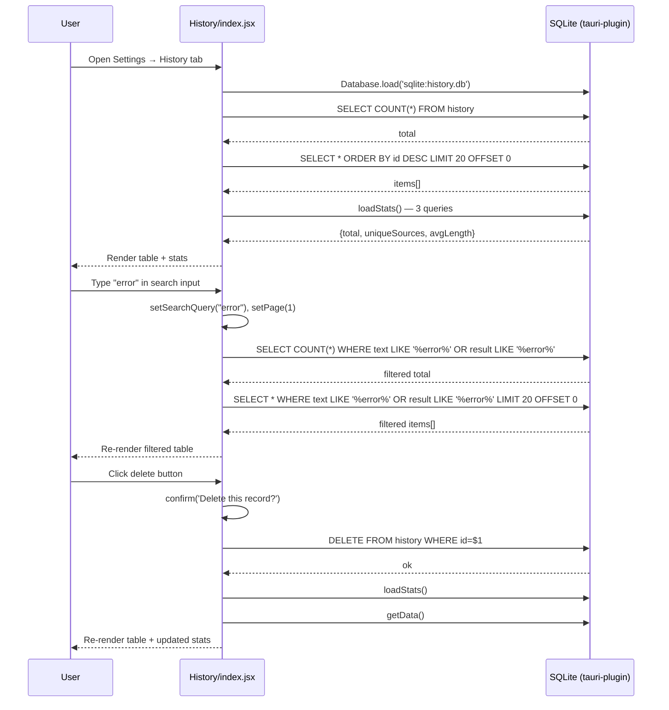

---

doc_type: task
prd_task_id: "PO-09-99"
title: "PO-09-99: 交互增强与历史优化 — 技术设计"
status: 已完成
priority: P2
owner: Claude
roles: [engineer]
created: 2026-09-23
updated: 2026-09-23
project: YiPot
project_id: yipot
prd_month: "202609"
estimate: 0.5
source_prd: "54-prd-交互增强与历史优化.md"
tags: [history, search, statistics, sqlite, react, ux]

type: task
---

# PO-09-99: 交互增强与历史优化 — 技术设计

> **版本**：v3.0 · **人天**：0.5d · **PRD**：[54-prd-交互增强与历史优化.md](../../prds/2026-09/54-prd-交互增强与历史优化.md)

---

## 1. 业务上下文

YiPot 历史面板使用 SQLite 本地存储。日均 50+ 条翻译的高级用户在 200+ 条记录中逐页翻找耗时 >30s。本设计新增搜索、统计、单条删除功能，提升查找效率到 <3s。

**PRD**：[PO-09-54](../../prds/2026-09/54-prd-交互增强与历史优化.md)

## 2. 架构

### 系统架构图

```
History/index.jsx
  │ useState(searchQuery) → onValueChange → getData()
  ▼
tauri-plugin-sql-api (Database.load('sqlite:history.db'))
  │ SELECT ... WHERE text LIKE '%q%' OR result LIKE '%q%'
  ▼
SQLite history.db
```

### 组件清单

| 组件 | 职责 | 技术 | 文件 |
|------|------|------|------|
| History 页面 | 搜索 + 统计 + 表格 + 分页 | React 18 + NextUI | `window/Config/pages/History/index.jsx` |
| TargetArea | 质量反馈 👍/👎 | React + YiAi RPC | `window/Translate/components/TargetArea/index.jsx` |

### 数据流

```
searchQuery 变化 → setPage(1) → getData()
  ├─ 有搜索词: SELECT COUNT(*)...WHERE LIKE → SELECT *...WHERE LIKE LIMIT OFFSET
  └─ 无搜索词: SELECT COUNT(*) → SELECT *...ORDER BY id DESC LIMIT OFFSET

deleteSingle(id) → DELETE...WHERE id=$1 → loadStats() → getData()

loadStats() → COUNT(*) + COUNT(DISTINCT text) + AVG(LENGTH(result))
```

### 搜索与删除调用序列



## 3. 实现细节

### 文件变更

| 文件 | 操作 | 行数 | 说明 |
|------|------|------|------|
| `window/Config/pages/History/index.jsx` | 修改 | +40 | 搜索 + 统计 + 删除 + 图标 |
| `window/Translate/.../TargetArea/index.jsx` | 已有 | — | 质量反馈（本次确认） |

### 关键实现

**搜索**：`const [searchQuery, setSearchQuery] = useState('')` → Input `onValueChange` 触发 `setSearchQuery(v); setPage(1)` → getData() 中 SQL LIKE `%q%`

**统计**：`const [stats, setStats] = useState({total:0, uniqueSources:0, avgLength:0})` → `loadStats()` 中 3 个 SELECT 并发

**删除**：`deleteSingle(id)` → `DELETE FROM history WHERE id=$1` → `loadStats()` → `getData()`

**图标**：`import { HiOutlineSearch } from 'react-icons/hi'` 替代 `react-iconly` 的 `Search`

### 错误处理

- SQLite 不可达 → 统计静默失败，表格不变
- LIKE 无匹配 → emptyContent 显示

## 4. 非功能需求

| 维度 | 要求 | 实现 |
|------|------|------|
| 性能 | LIKE <100ms (万条) | SQLite 简单 LIKE，无额外索引 |
| 兼容 | Win/Mac/Linux | Tauri 1.x 跨平台 |
| UI 一致性 | NextUI + react-icons | 使用项目已有组件库 |
| 安全性 | SQL 参数化 | `$1` 占位符防注入 |