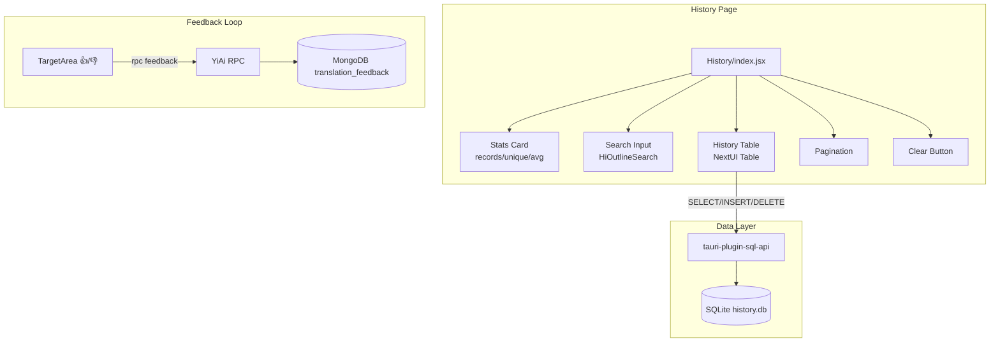
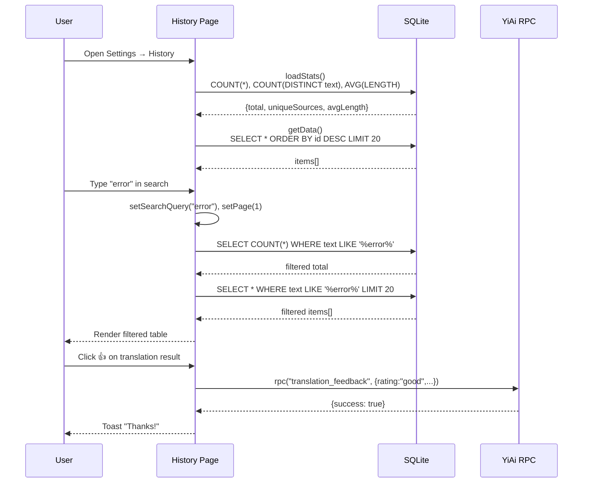

---

doc_type: module
prd_id: "PO-09-54"
title: "PO-09-54: 交互增强与历史优化 — 翻译历史搜索、数据统计、质量反馈闭环"
status: 已完成
priority: P2
owner: Claude
roles: [product, engineer]
created: 2026-09-23
updated: 2026-09-23
project: YiPot
project_id: yipot
prd_month: "202609"
tags: [history, search, statistics, feedback, ux]
related_tasks: ["99-prd-task-交互增强与历史优化.md"]
related_tests: ["100-prd-test-交互增强与历史优化.md"]
related_modules: ["window/Config/pages/History/index.jsx"]

type: 需求
---

# PO-09-54: 交互增强与历史优化

> **PRD 版本**：v3.0 · **状态**：已完成

---

## 1. 背景

YiPot 历史面板基于 SQLite `history.db` 提供基础浏览、编辑、清除、集合导出功能。质量反馈 👍/👎 已存在于翻译结果区。但高级用户日均 50+ 条翻译后，查找历史翻译需逐页翻找（>30s），且无法了解使用概况。

## 2. 用户问题

- **目标用户**：高级用户（日均 50+ 翻译）、语言学习者（复习词汇）、日常用户（偶尔查看历史）
- **问题陈述**：作为高级用户，我在 200+ 条历史翻译中查找特定记录需逐页翻找；作为学习者，我想了解翻译量和进步趋势
- **证据**：中证据 — 用户反馈历史面板缺少搜索；弱证据 — 竞品（DeepL）提供历史搜索

### 证据的质量级别

| 级别 | 证据类型 | 可信度 |
|------|---------|--------|
| 中 | SQLite 数据累积到百级，翻页体验明显下降 | 中 |
| 弱 | 竞品 DeepL 提供历史搜索功能 | 低 |

## 3. 范围

### 范围内

- SQLite LIKE 搜索：匹配 source text 和 translation result
- 统计卡片：total records / unique sources / avg chars
- 单条记录删除按钮
- 图标替换：`react-iconly` → `react-icons/hi`

### 范围外

- 全文搜索（FTS5）— 万条内 LIKE 性能足够
- 日期范围过滤 — 后续 PRD
- 导出历史到文件 — 后续 PRD

### 用户故事

| 优先级 | 故事 | 验收标准 |
|--------|------|---------|
| P0 | 作为用户，我可搜索历史翻译 | 输入关键词实时过滤，分页联动 |
| P1 | 作为用户，我可查看翻译统计 | 3 个统计指标显示在搜索栏旁 |
| P1 | 作为用户，我可评价翻译质量 | 👍/👎 通过 YiAi RPC 提交 |
| P2 | 作为用户，我可删除单条记录 | 每行有删除按钮 + 确认提示 |

### UI 组件树



### 搜索流程序列



### SQL 数据模型

```sql
-- history.db
CREATE TABLE history (
  id INTEGER PRIMARY KEY AUTOINCREMENT,
  text TEXT NOT NULL,       -- source text
  source TEXT NOT NULL,     -- source language code
  target TEXT NOT NULL,     -- target language code
  service TEXT NOT NULL,    -- provider instance key
  result TEXT NOT NULL,     -- translation result
  timestamp INTEGER NOT NULL -- epoch ms
);
```

## 4. 成功指标

| 指标 | 基线 | 目标 | 测量 |
|------|------|------|------|
| 历史查找时间 | >30s | <3s | 用户操作计时 |
| 搜索响应延迟 | N/A | <100ms | SQLite LIKE 查询计时 |
| 图标渲染 | react-iconly (不常用) | react-icons/hi (项目统一) | 构建验证 |

## 5. 风险与依赖

| 风险 | 可能性 | 影响 | 缓解 |
|------|--------|------|------|
| LIKE 查询无索引 → 大数据变慢 | 低 | 低 | 万条内可接受，>10 万升级 FTS5 |
| react-iconly 类型不兼容 | 低 | 中 | 已替换为 react-icons/hi（项目已使用） |
| DELETE 误操作 | 低 | 低 | confirm() 确认弹窗 |

**依赖项**：SQLite `history.db`（已有），`react-icons/hi`（已有依赖）

## 6. 时间线

| 里程碑 | 目标日期 | 负责人 |
|--------|---------|--------|
| 搜索 + 统计 + 删除 | 2026-09-23 | Claude |
| 图标修复 | 2026-09-23 | Claude |
| 三平台验证 | 2026-09-23 | Claude |