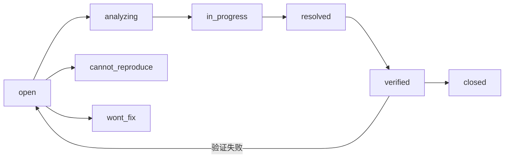

# 缺陷报告模板

> 使用此模板记录缺陷。每个缺陷只描述**一个问题**（单一职责）。如果多个问题共现，拆分为独立的缺陷报告。

---

## 命名规范

文件命名：`{序号}-{分类}-{简短描述}.md`

- **序号**：两位数字，同一分类内递增
- **分类**：缺陷所属模块或类别（如 `国际化`、`组件`、`路由`、`权限`）
- **描述**：5-15 字，动词短语，描述现象而非根因

示例：`0001-国际化-项目标题未显示.md`

---

## 严重度与优先级

| 严重度 | 定义 | 典型场景 |
|--------|------|---------|
| `critical` | 页面不可访问、数据丢失、安全漏洞 | 路由死循环、XSS 漏洞 |
| `major` | 核心功能异常、数据错误 | 列表无法加载、表单提交失败 |
| `minor` | 非核心功能异常、体验退化 | 国际化未显示、样式错位 |
| `trivial` | 代码风格、未使用导入、命名不规范 | 控制台 warning |

| 优先级 | 定义 | 响应时间 |
|--------|------|---------|
| `p0` | 阻断生产 | 立即修复 |
| `p1` | 影响核心功能 | 当天修复 |
| `p2` | 影响非核心功能 | 本周修复 |
| `p3` | 可延后 | 下个迭代 |

---

## 生命周期



---

## 模板

### 一、现象

> **一句话描述**：什么情况下发生了什么问题。

**错误日志**（如有）：

```
# 控制台错误或堆栈信息
```

### 二、复现步骤

1. 前置条件（环境、数据状态、配置）
2. 操作步骤（精确到 UI 操作或 API 调用）
3. 观察结果

### 三、根因分析

> 技术层面的根因，包含：
> - **问题代码位置**：`文件:行号`
> - **为什么出错**：逻辑缺陷或配置不匹配
> - **是否历史遗留**：重构残留、依赖升级等

### 四、修复方案

> 具体的代码变更，附修复前后对比。

### 五、验证方法

- [ ] 类型检查通过：`vue-tsc --noEmit` / `tsc --noEmit`
- [ ] 单元测试通过：`pnpm test` / `npm test`
- [ ] 功能验证：具体操作步骤与预期结果

### 六、影响范围

| 维度 | 评估 |
|------|------|
| 影响模块 | `{file path}` |
| 是否影响 API 契约 | 是/否 |
| 是否影响其他页面 | 是/否 |
| 用户感知 | {用户可见的影响} |
| 数据完整性 | {是否涉及数据丢失或损坏} |

### 七、预防措施

| 层面 | 措施 |
|------|------|
| 代码 | {代码层面的防护} |
| 测试 | {测试层面的覆盖} |
| 流程 | {流程层面的改进} |
| CI | {CI 门禁的增强} |

### 八、追溯

| 关联 | 链接 |
|------|------|
| 来源 PRD | {PRD 链接，如适用} |
| 关联开发模块 | {Dev 链接，如适用} |
| 关联测试用例 | {Test 链接，如适用} |