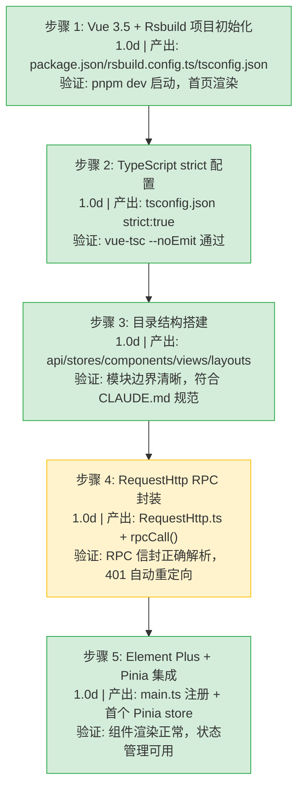

# YV-07-01: 项目初始化与构建系统 — Vue 3.5 + TypeScript strict + Rsbuild — 开发任务

> 来源 PRD：[01-prd-项目初始化与构建系统.md](../prds/2026-07/01-prd-项目初始化与构建系统.md)
> 需求编号：YV-07-01 · 优先级：P0 · 人天：5.0d

## 三、实施步骤

### 3.1 分步执行

### 3.2 验证检查点

| 步骤 | 验证项 | 通过标准 |
|------|--------|----------|
| 步骤 1 | 开发服务器 | `pnpm dev` 在 30s 内启动，`http://localhost:8848` 可访问 |
| 步骤 2 | 类型检查 | `vue-tsc --noEmit` 退出码 0，无类型错误 |
| 步骤 3 | 目录结构 | `src/api/`、`src/stores/`、`src/components/`、`src/views/` 均存在 |
| 步骤 4 | RPC 通信 | `rpcCall("services.data_service", "query_documents", {cname:"menus"})` 返回正确数据 |
| 步骤 5 | 组件渲染 | Element Plus 组件渲染正常，Pinia store 读写正常 |

---
