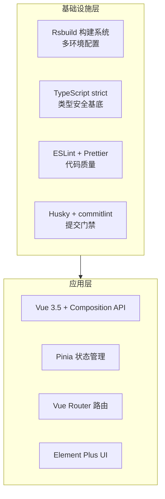
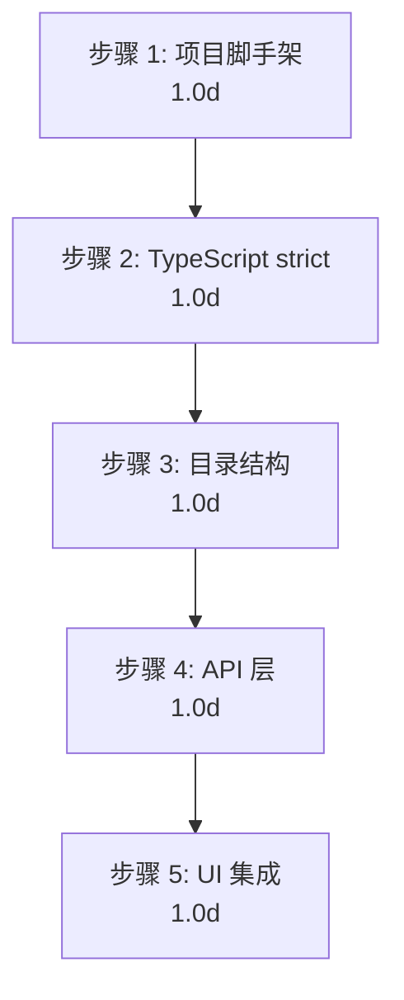

# YV-07-01: 项目初始化与构建系统 — 开发方案

> 来源 PRD：[01-prd-项目初始化与构建系统.md](../../prds/2026-07/01-prd-项目初始化与构建系统.md)
> 需求编号：YV-07-01 · 优先级：P0 · 人天：5.0d
> 本文档定义**实现方案**。需求见 PRD。

---

## 一、方案概述

### 1.1 架构定位

项目初始化是整个 YiVad 的基石——确立技术栈、构建工具链、目录结构和质量门禁，为后续所有功能模块提供标准化的开发环境。



### 1.2 技术选型

| 技术 | 版本 | 用途 | 选型理由 |
|------|------|------|---------|
| Vue | 3.5 | 前端框架 | Composition API、`<script setup>`、响应式优化 |
| TypeScript | 5.x | 类型系统 | strict 模式、泛型约束、编译时错误检测 |
| Rsbuild | 1.x | 构建工具 | Rspack 内核、比 Vite 更快的冷启动 |
| Pinia | 4.x | 状态管理 | Vue 3 官方推荐、Setup Store 语法 |
| Element Plus | 2.14 | UI 组件库 | Vue 3 生态最成熟 |
| pnpm | ≥8 | 包管理器 | 严格的依赖隔离、更快的安装速度 |

---

## 二、文件清单

| 文件 | 类型 | 职责 |
|------|------|------|
| `package.json` | 新增 | 依赖声明 + 脚本 |
| `rsbuild.config.ts` | 新增 | Rsbuild 构建配置（多环境） |
| `tsconfig.json` | 新增 | TypeScript strict 配置 |
| `eslint.config.mjs` | 新增 | ESLint 10 配置 |
| `.prettierrc` | 新增 | Prettier 格式化配置 |
| `.husky/` | 新增 | Git hooks（pre-commit/commit-msg） |
| `commitlint.config.ts` | 新增 | Conventional Commits 校验 |
| `src/main.ts` | 新增 | Vue 应用入口 |
| `src/App.vue` | 新增 | 根组件 |
| `src/api/` | 新增 | API 层目录骨架 |
| `src/stores/` | 新增 | Store 目录骨架 |
| `src/components/` | 新增 | 组件目录骨架 |
| `src/views/` | 新增 | 页面目录骨架 |

---

## 三、模块设计

### 3.1 Rsbuild 多环境构建

```typescript
// rsbuild.config.ts
import { defineConfig } from "@rsbuild/core";
import { pluginVue } from "@rsbuild/plugin-vue";
import { pluginSass } from "@rsbuild/plugin-sass";

export default defineConfig({
  plugins: [pluginVue(), pluginSass()],
  source: {
    entry: { index: "./src/main.ts" },
    alias: { "@": "./src" },
  },
  output: {
    assetPrefix: process.env.RSBUILD_PUBLIC_PATH || "/",
  },
  html: {
    title: "YiVad",
    favicon: "./public/favicon.ico",
  },
  server: {
    port: Number(process.env.RSBUILD_PORT) || 8848,
    proxy: {
      "/api": { target: process.env.RSBUILD_API_BASE || "http://localhost:10086" },
    },
  },
});
```

**环境变量规范：** 前缀 `RSBUILD_*`，通过 `.env.{mode}` 文件管理。

| 变量 | 默认值 | 说明 |
|------|--------|------|
| `RSBUILD_API_BASE` | `http://localhost:10086` | YiAi 后端地址 |
| `RSBUILD_PORT` | `8848` | 开发服务器端口 |
| `RSBUILD_PUBLIC_PATH` | `/` | 静态资源路径 |
| `RSBUILD_ROUTER_MODE` | `hash` | 路由模式 |

### 3.2 TypeScript strict 配置

```json
// tsconfig.json
{
  "compilerOptions": {
    "strict": true,
    "noUnusedLocals": true,
    "noUnusedParameters": true,
    "noImplicitAny": true,
    "strictNullChecks": true,
    "moduleResolution": "bundler",
    "baseUrl": ".",
    "paths": { "@/*": ["./src/*"] }
  },
  "include": ["src/**/*.ts", "src/**/*.vue"]
}
```

### 3.3 质量门禁链


**工具链：**

| 工具 | 版本 | 触发时机 | 失败行为 |
|------|------|---------|---------|
| ESLint | 10.x | 保存/pre-commit | 阻止提交 |
| Prettier | 3.x | 保存 | 自动修复 |
| Stylelint | 17.x | pre-commit | 阻止提交 |
| Husky | 9.x | Git hooks | — |
| lint-staged | 17.x | pre-commit | 阻止提交 |
| commitlint | 21.x | commit-msg | 阻止提交 |
| vue-tsc | 2.x | CI | 阻止构建 |

### 3.4 目录结构骨架

```
src/
├── api/
│   ├── index.ts              # RequestHttp 实例
│   ├── interface/            # 类型定义
│   └── modules/              # API 模块
├── stores/
│   ├── index.ts              # Pinia 实例
│   └── modules/              # Store 模块
├── components/               # 公共组件
├── views/                    # 页面视图
├── routers/
│   ├── index.ts              # 路由实例 + 守卫
│   └── modules/              # 静态/动态路由
├── hooks/                    # Composables
├── directives/               # 自定义指令
├── languages/                # i18n
├── styles/                   # 全局样式
├── utils/                    # 工具函数
├── App.vue                   # 根组件
└── main.ts                   # 入口
```

---

## 四、实施步骤与验证



| 步骤 | 内容 | 涉及文件 | 验证方式 | 人天 |
|------|------|---------|---------|------|
| 1 | Vue 3.5 + Rsbuild 脚手架 | `package.json`, `rsbuild.config.ts` | `pnpm dev` 启动，首页渲染 | 1.0 |
| 2 | TypeScript strict + ESLint + Prettier | `tsconfig.json`, `eslint.config.mjs` | `vue-tsc --noEmit` 零错误 | 1.0 |
| 3 | 目录结构 + 路径别名 | `src/` 目录树 | `@/` 别名解析正确 | 1.0 |
| 4 | RequestHttp RPC 封装 | `src/api/` | RPC 信封正确解析，401 自动拦截 | 1.0 |
| 5 | Element Plus + Pinia + Router + Husky | `main.ts`, `stores/`, `routers/` | 组件渲染正常，状态管理可用，Git hooks 生效 | 1.0 |

**合计：5.0d**

### 验证检查点

| 步骤 | 验证项 | 通过标准 |
|------|--------|---------|
| 1 | 开发服务器 | `pnpm dev` 启动 < 30s，`localhost:8848` 可访问 |
| 2 | 类型检查 | `vue-tsc --noEmit` 退出码 0 |
| 3 | 别名 | `import { x } from "@/api"` 正确解析 |
| 4 | RPC | `queryDocuments({ cname: "menus" })` 返回正确数据 |
| 5 | 集成 | Element Plus 组件渲染、Pinia store 读写、commitlint 拦截不规范提交 |

---

## 五、边缘场景

| 场景 | 处理策略 |
|------|---------|
| pnpm 未安装 | 文档指引 `npm i -g pnpm` 或 `corepack enable` |
| Node.js 版本过低 | `package.json` 中 `engines.node >= 18` |
| Rsbuild 构建缓存异常 | `rm -rf node_modules/.cache && pnpm dev` |
| 环境变量未配置 | 使用 `.env.development` 默认值 |

---

## 六、完成定义（DoD）

- [ ] 13 个文件按 §2 清单落地
- [ ] `pnpm dev` 在 30s 内启动，首页渲染
- [ ] `vue-tsc --noEmit` 零错误
- [ ] Git hooks（pre-commit + commit-msg）生效
- [ ] RequestHttp RPC 调用返回正确数据
- [ ] Element Plus + Pinia + Router 集成正常