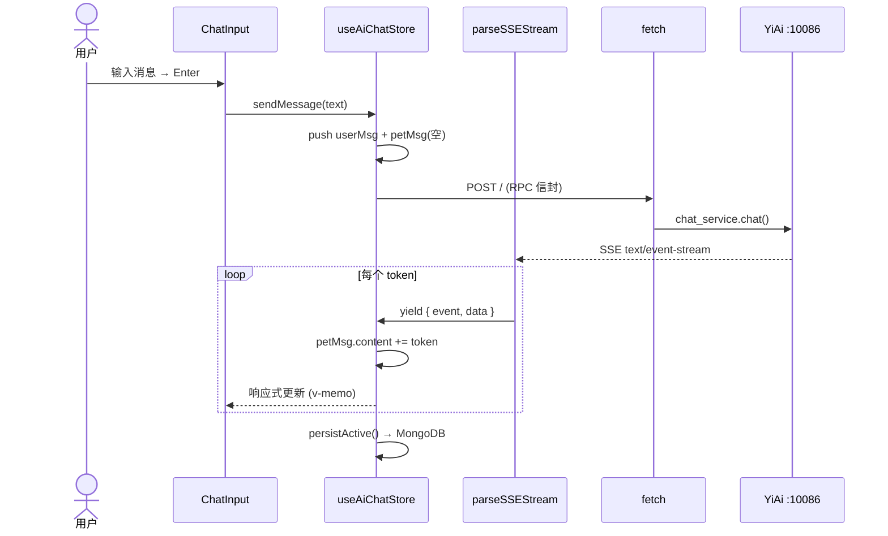

# YV-07-02: AI Chat 模块迁移 — 开发方案

> 来源 PRD：[02-prd-AI聊天模块迁移.md](../../prds/2026-07/02-prd-AI聊天模块迁移.md)
> 测试规格：[02-prd-test-AI聊天模块迁移.md](../../tests/2026-07/02-prd-test-AI聊天模块迁移.md)

---

## 一、架构决策记录 (ADR)

### ADR-001: SSE over WebSocket

**问题**：AI Chat 需流式传输 LLM token，RPC 信封要求 POST 传参。
**决策**：SSE（HTTP）+ 手动 `fetch` + `ReadableStream` 解析器。
**选项矩阵**：

| 维度 | SSE (fetch+ReadableStream) | WebSocket | EventSource (GET) |
|------|---------------------------|-----------|-------------------|
| POST body | ✅ | ✅ | ❌ 致命 |
| 自定义 Header | ✅ (X-Token) | ✅ | ❌ 致命 |
| 代理兼容 | 优秀 | 需 Upgrade | 优秀 |
| 自动重连 | 手动 | 手动 | 内置 ✅ |
| 实现代码量 | ~80 行 | ~200 行 | 0 行 |
| AbortController | ✅ | ❌ | ❌ |

**选择**：SSE via fetch+ReadableStream。POST + X-Token 是硬需求（RPC 信封 + 认证）。解析器约 80 行，完全控制协议。

**权衡**：失去 EventSource 自动重连；后续通过 `Last-Event-ID` 实现断点续传。

### ADR-002: Pinia setup-function store

**问题**：Chat Store 需管理 20+ 响应式状态、10+ 异步操作，且需持久化支持。Options API store 的 TypeScript 类型推断受限，composable 复用困难。

**决策**：`defineStore(() => { ... })`（setup 语法）。所有状态和方法在单一闭包内定义，类型自动推导；外部 composables（`useRagSettings`、`useToolRegistry`）可在 store 内直接调用。

**权衡**：失去 options store 的 `$patch` 批量更新便利性，但通过 `setActiveMessages(updater)` 回调模式弥补。

### ADR-003: RAF 滚动限流 + v-memo

**问题**：SSE token 到达速率 50-100/s，每个 token 触发 `petMsg.content += token` → 响应式更新 → DOM diff → 滚动。未经限流时每 token 都触发 layout/reflow，FPS 降至 15 以下。

**决策**：双重优化 — (1) `SCROLL_THROTTLE_MS = 120`（8 次/s）通过 RAF 队列合并滚动请求；(2) `v-memo="[message.content.length]"` 使 Vue 仅在内容长度变化时重渲染 MessageBubble，而非每次引用更新。

**权衡**：RAF 限流引入最多 120ms 滚动延迟，但人眼不可感知；v-memo 需要维护额外的 memo 数组，但性能收益远超成本。

---

## 二、系统架构

### 2.1 数据流



### 2.2 组件树

```
src/views/aiChat/index.vue
├── ConversationSidebar (知识侧边栏, 可拖拽 220-600px)
│   ├── SearchInput + SyncButton
│   └── el-tree (知识库目录树, 点击预览文件)
├── Resizer (4px 拖拽条)
└── AiChatBox (fill mode)
    ├── ConversationSessionSidebar (会话内栏, 可折叠)
    ├── ChatHeader (标题 + 模型 + ctx badge + New/Export)
    ├── MessageList
    │   ├── Welcome Card (会话元数据, 可折叠)
    │   ├── MessageBubble[] (v-for + v-memo)
    │   └── ScrollToBottom FAB
    ├── QuickButtons (7 按钮, 仅无消息时显示)
    ├── ChatInput
    │   ├── ChatToolbar (FAQ/图片/标签/RAG/Web/技能/模型/提示词/知识文件选择)
    │   ├── DraftImageList + FileMentionDropdown
    │   └── Textarea + Send/Stop
    └── Dialogs (KnowledgePreview / SessionEdit / TagManager / WeChat)
```

---

## 三、初始文件规划

| # | 文件 | 行数 | 核心职责 |
|---|------|------|----------|
| 1 | `src/api/sse.ts` | 80 | SSE 解析器 AsyncGenerator |
| 2 | `src/api/modules/chatService.ts` | 40 | `streamChat()` RPC 封装 |
| 3 | `src/stores/modules/aiChat.ts` | 1500+ | 会话/消息/流式/持久化/工具/压缩 |
| 4 | `src/views/aiChat/index.vue` | 100 | 布局编排 |
| 5 | `src/views/aiChat/types.ts` | 10 | 类型定义 |
| 6 | `src/views/aiChat/constants.ts` | 60 | 默认模型 + 快捷按钮配置 |
| 7-11 | `composables/use*.ts` ×5 | 300 | UI状态/模型选择/RAG/压缩/工具执行 |
| 12 | `ConversationSidebar.vue` | 380 | 知识树 + 文件预览 |
| 13 | `ConversationSessionSidebar.vue` | 150 | 会话元数据面板 |
| 14 | `MessageList.vue` | 550 | 消息列表 + Welcome Card + 滚动 |
| 15 | `MessageBubble/index.vue` | 780 | 消息气泡 + 元数据 + 工具卡片 |
| 16 | `ChatInput.vue` | 340 | 输入框 + @提及 + 发送/停止 |
| 17 | `ChatToolbar/index.vue` | 550+ | 工具栏 + 知识文件选择器 |
| 18 | `QuickButtons.vue` | 100 | 快捷提示词按钮 |
| 19 | `AiChatBox/AiChatBox.vue` | 500+ | 可复用面板 (fill/side 双模式) |

---

## 四、核心模块实现

### 4.1 SSE 解析器 (`api/sse.ts`)

**接口**：
```typescript
interface SSEEvent {
  event?: string;   // "token" | "error" | "done" | "session_key" | "retrieving"
  data: any;
  id?: string;
}
async function* parseSSEStream(response: Response, signal?: AbortSignal): AsyncGenerator<SSEEvent>
```

**SSE 协议五字段处理**：

| 字段 | 格式 | 处理 |
|------|------|------|
| `data:` | `data: <json>\n` | 核心数据。`[DONE]` → yield done+return；JSON → yield event |
| `event:` | `event: <type>\n` | 记录 `currentEvent`，下个 `data:` 到达时分发 |
| `id:` | `id: <value>\n` | 记录 `eventId`（断点续传预留） |
| `retry:` | `retry: <ms>\n` | 记录日志（自动重连预留） |
| `:` | `: <comment>\n` | 心跳注释，跳过 |

**边缘处理**：
- UTF-8 多字节跨 chunk：`decoder.decode(value, { stream: true })` + buffer 拼接
- AbortController 死循环：`signal?.aborted` 检查 → `reader.cancel()` → break
- reader 锁：`finally { reader.releaseLock() }` 兜底
- 非 JSON 行：try/catch → DEV 模式 console.warn → 跳过

### 4.2 RPC 流式请求 (`api/modules/chatService.ts`)

**请求格式**：
```
POST /  Content-Type: application/json  X-Token: <jwt>
{
  "module_name": "services.ai.chat_service",
  "method_name": "chat",
  "parameters": { "messages": [...], "model": "...", "stream": true }
}
```

**响应**：SSE `text/event-stream` → `event: token\ndata: {"content":"..."}\n\n` → `event: done\ndata: {"done":true}\n\n`

**Handlers 接口**：
```typescript
interface StreamChatHandlers {
  onChunk: (text: string) => void;
  onPhase?: (phase: string) => void;
  onSources?: (sources: RagSource[]) => void;
  onDone: () => void;
  onError: (err: Error) => void;
}
function streamChat(params: StreamChatParams, handlers: StreamChatHandlers): { abort: () => void }
```

**错误路径**：HTTP 非200→onError / SSE error帧→onError / AbortError→onDone / 其他→onError

### 4.3 Store 引擎 (`stores/modules/aiChat.ts`)

**核心状态与方法**：
```typescript
// 会话
conversations, activeConversation, loading, error
// 流式
sending, streamingPhase, streamingTargetTimestamp, abortController, toolAbortController
// 输入
input, draftImages, scrollTick

// 会话管理
loadConversations(), selectConversation(key), createConversation(title?, pageContent?, tags?)
deleteConversation(key), renameConversation(key, title), toggleFavorite(key)
exportConversationHtml()

// 消息引擎
sendMessage(text?), stopSending(), regenerateMessage(idx), resendMessage(idx)
editMessage(idx, content), deleteMessage(idx), copyMessage(msg)

// 引擎内核
runStream(upToIdx, petTimestamp, type, searchContext?)
persistActive(), setActiveMessages(updater)
```

**关键设计模式**：
1. **持久化链 `_persistChain`**：Promise 队列，15s 超时防死锁
2. **双路 AbortController**：SSE 流 + 工具执行，独立 abort

### 4.4 消息渲染管道

**PetMessage 渲染管道**（6 级处理，顺序不可变更）：

```text
raw Markdown
  → 未闭合代码块检测（odd ``` → 临时补全，防止吞噬后续内容）
  → marked.parse()（Markdown → HTML）
  → DOMPurify.sanitize(ALLOWED_TAGS, ALLOWED_ATTR)（XSS 清洗）
  → highlight.js（pre code 语法高亮 + 语言标签 + 复制按钮）
  → mermaid.run()（Mermaid 图表渲染）
  → sanitizeLinks()（外部链接 noopener + 协议白名单）
  → v-html 渲染
```

**安全关键点**：
- DOMPurify 必须在 marked 之后、v-html 之前执行——顺序不可颠倒
- 白名单不含 `<script>`、`<iframe>`、`<object>`、`<embed>`、事件处理器
- `sanitizeLinks` 过滤 `javascript:` / `data:` 协议，自动添加 `rel="noopener noreferrer nofollow"`

**流式安全**：未闭合代码块检测在每帧 token 到达时运行，检测到奇数个 ` ``` ` 时临时追加闭合标记，完整后移除，确保后续 Markdown 内容不被吞噬进代码块。

### 4.5 会话上下文文件系统

**标签协议**：`ctx:{file_path}` 存储在 `SessionDocument.tags`。
**内容存储**：`pageContent` 字段，分段格式 `## path\n\ncontent\n\n---\n\n`。

**默认上下文**：会话的上下文文件内容（`pageContent`）始终作为 system context 注入到 LLM 请求中，无论 RAG 开关状态如何。这意味着 AI 的回答始终基于用户选择的上下文文件。

**RAG 激活**：`ragActive` = tags 中有 `ctx:` 前缀 → `streamRagChat` + 计算 scope。RAG 开启后，对知识库**所有已索引文件**进行语义检索，`ctx:` 文件作为 scope 限定参数，检索结果作为补充参考叠加到上下文文件中。

**4 种添加入口**：

| 入口 | 代码路径 |
|------|----------|
| ChatToolbar 知识选择器 | `openKnowledgePicker()` → `readKnowledgeFile()` → `ensureKnowledgeSession()` → `selectConversation()` |
| @ 文件提及 | `FileMentionDropdown` → `store.addTag("ctx:"+path)` |
| ChatToolbar Context 编辑 | 上下文 Popover → Edit → Save → 更新 pageContent |
| 拖拽文件到聊天区 | `onDrop()` → `mergeContextNode()` → `onSave()` → `addContextFile()` |

**变更管理**：`useContextChanges` composable 管理 pageContent 段落变更。
- Apply → 更新 pageContent + 添加 `ctx:` tag
- Undo → 从 `contextChangeHistory` 恢复快照，移除条目
- 历史 FIFO，最多 50 条，支持撤销重做

### 4.6 RAG 知识库检索

**配置 composable** (`useRagSettings`)：`ragEnabled` / `ragHybrid` / `ragRerank` / `ragCitations` — 全部持久化到 localStorage。检索模式固定为 `simple`（最快）。

**工具栏 UI**：
- RAG 胶囊按钮：关闭=灰色 / 开启+有文件=绿色"N" / 开启+无文件=黄色"+file"
- LlamaIndexPanel：4 个 Tab（检索/分解/索引/历史）

**流式集成** (`runStream`)：
```typescript
if (ragEnabled && ragActive) {
  const ctxPaths = session.tags.filter(t => t.startsWith("ctx:")).map(t => t.slice(4));
  const scope = ctxPaths.length === 1 ? ctxPaths[0] : commonPrefix(ctxPaths);
  // ragMeta 快照记录到 petMsg 供 UI 展示来源/评分
  abort = streamRagChat({ messages, scope, hybrid, rerank, citations, chat_mode: "simple" }, handlers).abort;
}
```

### 4.7 Web 搜索

**配置**：`webSearchEnabled` (localStorage 持久化)，工具栏 Search 图标 + el-switch 滑动开关。

**两阶段执行管道**（通过 `useToolExecution` composable 实现）：

**阶段 1 — 前置抓取** (`executePreStreamTools`, 同步阻塞)：
- 解析用户消息中的 URL → 逐 URL 执行 `web_fetch` 工具
- 设置 `streamingPhase = "fetching"`，显示加载状态
- 结果写入对应 UserMessage 的 `searchContext` 字段
- 返回值作为 `searchContext` 参数传入 `runStream`，影响首次回复

**阶段 2 — 后台搜索 + Follow-up 注入** (`launchBackgroundSearch`, 异步 fire-and-forget)：
- 与主 SSE 流**并行执行**（独立 `toolAbortController`）
- `web_search(query, maxResults: 6)` → 提取结果 URL → `web_fetch` top 3 深度抓取
- **注入条件**：`await streamPromise`（主流完成）AND `pendingContext` 非空
- **注入流程**：`persistActive()` → 创建 `followUpPet` 消息 (`type: "pet"`) → `setActiveMessages` → 新 `runStream` 以 `pendingContext` 为 system context
- **失败降级**：搜索异常/结果为空 → `webSearching = false`，仅保留主回复

**状态联动**：
- `webSearching: boolean` — 搜索进行中，ChatInput placeholder → "Searching the web..."
- `webSearchEnabled: boolean` — localStorage 持久化，工具栏胶囊高亮
- Tool Registry：`webSearchEnabled` → 自动启用 `web_search` + `web_fetch` 工具
- Tool Registry 联动：`webSearchEnabled` → 自动启用 `web_search` + `web_fetch` 工具

---

## 五、实施步骤

| 步骤 | 核心内容 | 验证 | 人天 |
|------|---------|------|------|
| 1 | SSE 解析器 (AsyncGenerator + 五字段 + AbortController + UTF-8) | 8 单元测试 | 1.0 |
| 2 | Chat Store (会话CRUD + sendMessage引擎 + persistActive + 工具注册) | Store 单元测试 | 1.0 |
| 3 | 消息组件 (MessageList + MessageBubble + Markdown 安全渲染 + v-memo) | 组件测试 | 1.0 |
| 4 | 输入+工具栏 (ChatInput + ChatToolbar + IME + 快捷键 + 知识选择器) | 组件测试 | 1.0 |
| 5 | 会话侧边栏 (ConversationSidebar + SessionSidebar + 搜索+同步) | 组件测试 | 0.5 |
| 6 | 布局编排 + AiChatBox 双模式 + 集成 | 端到端 | 0.5 |

**总计：5.0d**

---

## 六、ChatMessage / SessionDocument 类型

```typescript
interface ChatMessage {
  type: "user" | "pet" | "followup";
  message: string;                            // Markdown 原文
  timestamp: number;                          // Date.now() 毫秒
  imageDataUrls?: string[];                   // base64 DataURL，最多 4 张
  error?: boolean;                            // SSE 错误标记
  aborted?: boolean;                          // 用户中断标记
  sources?: RagSource[];                      // RAG 检索来源列表
  ragMeta?: {                                 // RAG 检索元数据（仅 pet 消息）
    chatMode: "simple";
    hybrid: boolean;
    rerank: boolean;
    citations: boolean;
    numQueries: number;
    scope?: string;
  };
  toolCalls?: ToolCall[];                     // 本轮工具调用时间线
  searchContext?: string;                     // Web 搜索结果注入
  firstTokenLatencyMs?: number;               // 客户端 TTFT 测量
}

interface ToolCall {
  name: string;                               // 工具名称
  label: string;                              // UI 显示标签
  args?: Record<string, unknown>;             // JSON Schema 参数
  content?: string;                           // 执行结果
  error?: string;                             // 错误信息
  durationMs?: number;                        // 执行耗时
}

interface SessionDocument {
  key: string; url: string; title: string;
  pageTitle?: string; pageDescription?: string; pageContent?: string;
  messages: ChatMessage[]; tags: string[]; isFavorite?: boolean;
  createdAt: number; updatedAt: number; filePath?: string;
}
```

---

## 七、边缘场景处理

| # | 场景 | 触发 | 处理 | 代码位置 |
|---|------|------|------|----------|
| EC-01 | SSE event: 分发 | 多事件类型帧 | currentEvent 路由 | `parseSSEStream` |
| EC-02 | 未闭合代码块 | ``` 不配对 | 临时追加 + 完整后移除 | `PetMessage.vue` |
| EC-03 | abort 后死循环 | reader 不释放 | signal.aborted + cancel + releaseLock | `parseSSEStream` |
| EC-04 | localStorage 配额 | >5MB | IndexedDB 降级 + LRU | `persistActive` |
| EC-05 | Date 序列化 | Date→string | reviver 检测 ISO 8601 | persistedstate |
| EC-06 | IME Enter | composition | isComposing + keyCode===229 | `ChatInput` |
| EC-07 | iOS 键盘 | resize×3 | 100ms debounce | CSS transition |
| EC-08 | 多标签页 | 跨 Tab 创建 | BroadcastChannel | store init |
| EC-09 | AbortController 残留 | 快速切换 | selectConversation 首行 stopSending | store |
| EC-10 | 首次 session_key | 无 key | SSE 首帧提取 | streamChat |
| EC-11 | 大段粘贴 | >5000字 | ElMessage.warning | ChatInput |
| EC-12 | Tab 不可见 | visibilitychange | RAF 跳过 | MessageList |
| EC-13 | _persistChain 死锁 | Promise 链阻塞 | 15s 超时 → resolve 继续 | `persistActive` |
| EC-14 | 中文 @ 误触发 | IME 候选窗 | @ 后紧跟空格不触发 mention | `FileMentionDropdown` |

---

## 八、安全实现

| 威胁 | 防御 | 位置 |
|------|------|------|
| XSS Stored | marked → DOMPurify 白名单 | PetMessage.vue |
| XSS DOM | href 过滤 javascript:/data: | sanitizeLinks() |
| 外部链接劫持 | target=_blank rel=noopener | sanitizeLinks() |
| 会话泄漏 | X-Token 区分 + 后端校验 | RequestHttp |
| PII 泄漏 | maskPII 正则脱敏 | ChatInput |
| Token 泄漏 | 仅 X-Token 头 | RequestHttp |

---

## 九、技术债务

| # | 债务 | 优先级 | 人天 | 当前状态 | 触发条件 | 处置 |
|---|------|--------|------|----------|----------|------|
| TD-01 | 虚拟滚动 | P1 | 1.0 | **未触发** | >500 条消息 → FPS<30 | 已验证：当前 v-memo + RAF 限流 (120ms) 在 <200 条消息下维持 ≥30fps。触发后引入 `vue-virtual-scroller` |
| TD-02 | Markdown AST 缓存 | P2 | 0.5 | **已完成** ✅ | >2000 字 → 每次重解析 ~15ms | `useMarkdown.ts` 已实现 LRU Map 缓存 (max 200 entries)。render() 在缓存命中时跳过 marked.parse()，SSE 流式期间消除重复解析 |
| TD-03 | SSE 断点续传 | P2 | 0.5 | **待实现** | 网络不稳定 >3 次中断 | 前端方案：`parseSSEStream` 扩展 `Last-Event-ID` 头。需 YiAi 同步支持 offset 恢复 |
| TD-04 | IndexedDB 正式迁移 | P2 | 0.5 | **监控中** | >5 用户 localStorage>4MB | `getStorageQuota()` 工具已就绪 (src/utils/storage.ts)。persistActive 每 10 次抽样检查，≥85% 容量时 console.warn。迁移路径：`idb-keyval` + LRU |
| TD-05 | E2E Playwright | P3 | 1.0 | **待实施** | 回归手动>1h/次 | 测试规格已定义 5 个 E2E 用例 (CH-01~04 + I-14)，待 Playwright 基础设施就绪 |

---

## 十、代码审查检查清单

### SSE 解析器
- [x] `parseSSEStream`: 五字段（data:/event:/id:/retry:/:）正确处理
- [x] `[DONE]` 检测 → yield done + return（不遗漏最后一个 event）
- [x] `signal.aborted` 检查在每个 chunk 循环迭代中
- [x] `reader.cancel()` + `reader.releaseLock()` 在 finally 块
- [x] UTF-8 多字节字符跨 chunk 时 decoder buffer 正确拼接

### Store 引擎
- [x] `_persistChain`: 15s 超时 + skipIfLocked 防并发
- [x] `selectConversation`: 首行 `stopSending()` 防止残留 SSE
- [x] `sendMessage`: isComposing 检查 + empty input guard
- [x] `setActiveMessages(updater)`: 回调模式保证原子性

### 消息渲染
- [x] `PetMessage`: marked → DOMPurify 顺序不可颠倒
- [x] `ALLOWED_TAGS`: 白名单不含 script/iframe/object/embed
- [x] `ALLOWED_ATTR`: 不含 on* 事件处理器
- [x] 未闭合代码块：odd ``` 检测 → 临时补全 → 完整后移除

### 输入与交互
- [x] `ChatInput`: isComposing + keyCode===229 双重 IME 检查
- [x] Enter/Escape/Ctrl+L/ArrowUp/ArrowDown 全路径验证
- [x] `FileMentionDropdown`: @ 后紧跟空格不触发
- [x] 粘贴截断：>5000 字符 → ElMessage.warning

### 状态与类型
- [x] 四种状态（空/加载/错误/流式）UI 全覆盖
- [x] `vue-tsc --noEmit` 零新增错误
- [x] `pnpm test` 全通过

---

## 十一、完成定义

- [x] 47 个模块专属文件 + 10 个共享基础设施文件交付，类型检查零新增错误
- [x] SSE 解析器 7 种帧格式正确处理（data/event/id/retry/:/[DONE]/error）
- [x] Chat Store 会话 CRUD + 持久化链 + 双路 AbortController
- [x] Markdown 安全渲染管道（marked → DOMPurify → highlight.js → mermaid → sanitizeLinks）
- [x] IME 兼容 + 全键盘快捷键 + @提及 + 4 种上下文文件添加入口
- [x] XSS 测试向量 8 项全通过
- [x] 四种核心状态（空/加载/错误/流式）全覆盖
- [x] vue-tsc --noEmit 零新增错误 + pnpm test 全通过

---

## 十二、Pi 风格扩展实现

实际实现中超出原 PRD 设计范围的功能模块。以下模式受 Claude Code (Pi) 交互范式启发引入——流式阶段状态机、插件化工具注册、Shell 风格历史导航——目的是一致化 AI 交互体验，降低前端用户的认知负担。

### 12.1 Streaming Phases（流式阶段）

6 阶段状态机驱动 UI：`idle` → `fetching` → `thinking` → `retrieving` → `streaming` → `done`（error 可发生在任意阶段→回 idle）。

```typescript
type StreamingPhase = "idle" | "fetching" | "thinking" | "retrieving" | "streaming" | "done";
```

- `onPhase(phase)`: 仅 thinking/retrieving 阶段接受 phase 帧，首个 chunk 后锁定为 streaming
- ChatInput placeholder 随 phase 动态变化
- MessageBubble 显示当前 phase 标签

### 12.2 Tool Registry（插件化工具系统）

`useToolRegistry()` composable 管理工具生命周期：

```typescript
registerTool(name, label, handler, enabled?)
setToolEnabled(name, enabled)
executeTool(name, args, signal?)
```

- 内置 4 工具：web_search, web_fetch, rag_search, context_edit
- MCP 工具：通过 `useSkillsMcp` composable 动态加载
- 自动根据 store 开关同步启用状态（watch [ragEnabled, ragActive, webSearchEnabled]）
- 工具事件生命周期：`start(phase, name, label, args?)` → 执行 → `end(phase, name, content?, error?, durationMs?)`
- `toolEvents[]` 记录每轮所有 start/end 事件 → `attachTurnToolCalls` 将本轮工具调用附加到对应 pet 消息
- 双路 AbortController（SSE 流 + 工具执行），Stop 时两者同时终止
- **LLM Prompt 预览**：查看当前会话发送给 LLM 的完整 system prompt + tools 描述

### 12.3 Prompt History（Shell 风格历史导航）

`usePromptHistory()` composable（单例）：
- `pushPromptHistory(text)`: Enter 发送时推入，内存去重
- `promptHistory: Ref<string[]>`: localStorage 持久化
- ArrowUp/ArrowDown 导航：行首→召回，行尾→下一条，-1→清空
- ChatToolbar 历史面板：搜索+trigram Jaccard 模糊建议+recent chips+复制/删除

### 12.5 Per-Message Tool Timeline

`attachTurnToolCalls(petTimestamp, startIdx)`: 每个发送轮次完成后，将该轮 `toolEvents` 配对 start/end，附加到对应 pet 消息的 `toolCalls[]` 字段。UI 渲染为可折叠工具卡片 (名称/参数/结果/耗时/错误)。

### 12.6 WeChat/WeCom Auto-Forward

`forwardReplyToWeCom(content)`: AI 回复完成后 (`onDone`)，当 `!aborted && !error && streamed.trim()` 时，并行发送到所有启用+autoForward 的 WeCom 机器人。失败静默忽略。

### 12.7 Conversation Compaction

`useConversationCompact()` composable，每次 `onDone` 后自动检查：
- token 估算阈值 6554 (≈16K chars)
- 超阈值时保留最近 N 轮+系统提示，移除中间历史
- 压缩日志记录每次操作

### 12.8 AiChatBox 双模式

| 模式 | props | 用途 |
|------|-------|------|
| fill (side="fill") | 无额外 props | aiChat 页面主布局，完整功能 |
| side (side="right"/"left") | resizable, collapsible, defaultWidth, storageKey, clearActiveOnUnmount, systemPrompt, title | 侧边面板 (Story 文件预览 chat)，精简功能 |

side 模式：`useResizable(invert)` + `collapsed` localStorage 持久化 + expand tab 按钮。

### 12.9 ChatHeader 栏

fill 模式下的固定头部 (40px)：session sidebar 折叠/展开、会话标题、ctx 文件计数徽章、模型选择器 popover (fetchModels+radio-group)、新建会话、导出 HTML。

### 12.10 Export HTML

`exportConversationHtml()`: 生成独立 HTML 文件，包含内联 CSS + light/dark 双主题 + 完整对话 + 工具调用 `&lt;details&gt;` 折叠 + 语法高亮代码块。`exportConversation()` 输出 Markdown。

### 12.11 ConversationListItem 增强

- 来源域名标签 (TL/CR/Story/RAG/AI/Bug)，可点击跳转回源页面
- 元信息行: N files · N msgs · 相对时间
- Hover 可见操作按钮 (收藏/重命名/删除)
- 批量模式 checkbox + bulkDelete

### 12.12 Responsive 布局

| 断点 | 行为 |
|------|------|
| >1023px | 三栏：知识侧边栏 + 会话内栏 + 聊天区 |
| ≤1023px | 知识侧边栏 absolute + transform 动画 + 阴影；会话内栏 absolute；标题 max-width 160px |
| ≤767px | 知识侧边栏全宽；标题 max-width 100px；输入框紧凑化 |

### 12.13 Loading/Error/Empty/Skeleton 状态

- **loading**: ChatSkeleton (sidebar/messages 两种)
- **error**: ChatError (全屏错误 + retry 按钮)
- **empty (无会话)**: 欢迎界面 + 知识侧边栏自动展开 (首次访问)
- **empty (有会话无消息)**: Welcome Card (元数据+折叠) + QuickButtons
- **sending**: Stop 按钮 + placeholder 动态文本 + typing indicator

### 12.14 Follow-up 异步消息注入

Web 搜索场景中，`useToolExecution` composable 实现两阶段消息注入机制：

**两路并行执行**：

```typescript
// 伪代码：sendMessage 核心流程
const streamPromise = runStream(...);           // 主 SSE 流（不 await）
launchBackgroundSearch(query, toolSignal, streamPromise);  // 后台搜索（fire-and-forget）
await streamPromise;                            // 等待主流完成
```

**`launchBackgroundSearch` 实现**：
1. `web_search` API → 获取搜索结果 (maxResults: 6)
2. `web_fetch` 深度抓取 (top 3 URLs) → 丰富上下文
3. 等待条件：`await streamPromise`（主流完成）+ 搜索成功
4. 消息注入：
   ```typescript
   const followUpPet: ChatMessage = { type: "pet", message: "", timestamp: Date.now() + 1 };
   const prev = s.messages.length;
   setActiveMessages(m => [...m, followUpPet]);
   await runStream(prev, followUpPet.timestamp, "send", pendingContext);
   ```
5. 失败静默降级：搜索异常 → `webSearching = false`，无 follow-up 消息

**时序约束**：
- 搜索和主流**并行执行**（独立的 `toolAbortController`），不互相阻塞
- Follow-up 注入在两个条件**同时满足**时触发：主流 done + 搜索完成
- `await streamPromise` 确保主 SSE 流已完全写入持久化，再追加 follow-up 消息
- `pendingContext` 为空时跳过注入，不产生空的 follow-up 气泡

**导出适配**：
- 导出中 `type === "followup"` 的消息标记为 "Follow-up (queued)"
- HTML 导出：`msg--user` 样式（与用户消息同色），区别于正常 AI 消息

---

## 十三、实际交付文件清单

> 较初始规划（19 个文件）扩展至 47 个模块专属文件 + 10 个跨模块共享组件/hooks。增量主要来自：消息子组件拆分、工具系统（Skills/MCP）、RAG 配置面板（4 Tab）、弹窗组件矩阵、状态组件体系。

### API 层（4 文件）

| # | 文件 | 行数 | 职责 |
|---|------|------|------|
| 1 | `src/api/sse.ts` | 80 | SSE 解析器 AsyncGenerator — 五字段协议解析、UTF-8 跨 chunk 拼接、AbortController |
| 2 | `src/api/modules/chatService.ts` | 40 | `streamChat()` — RPC 信封封装，POST → SSE `text/event-stream` |
| 3 | `src/api/modules/ragService.ts` | 60 | `streamRagChat()` — RAG 模式流式，携带 scope/hybrid/rerank/citations 参数 |
| 4 | `src/api/interface/yiAi.ts` | — | `ChatMessage`、`SessionDocument`、`SSEEvent` 类型定义（共享） |

### Store 引擎（1 文件）

| # | 文件 | 行数 | 职责 |
|---|------|------|------|
| 5 | `src/stores/modules/aiChat.ts` | 1500+ | 会话 CRUD、消息引擎、SSE 流式编排、持久化链、Tool Registry、Compaction、WeChat 转发、Export 双格式、Streaming Phases 状态机 |

### 页面编排（4 文件）

| # | 文件 | 行数 | 职责 |
|---|------|------|------|
| 6 | `src/views/aiChat/index.vue` | 100 | 三栏布局编排：ConversationSidebar + Resizer + AiChatBox |
| 7 | `src/views/aiChat/types.ts` | 10 | `AiChatStreamingType`、模块级类型定义 |
| 8 | `src/views/aiChat/constants.ts` | 60 | 默认模型、快捷按钮配置（QUICK_BUTTONS / QUICK_BUTTONS_NEW）、FAQ 条目 |
| 9 | `src/views/aiChat/mcpServers.ts` | — | MCP 服务器端点配置 |

### Composables — 页面级（6 文件）

| # | 文件 | 行数 | 职责 |
|---|------|------|------|
| 10 | `composables/useChatUiState.ts` | — | 会话侧边栏展开、FAQ 弹窗、批量模式、选中键集合 |
| 11 | `composables/useModelSelection.ts` | — | 模型选择器状态 + localStorage 持久化 |
| 12 | `composables/useRagSettings.ts` | — | RAG 四开关配置（enabled/hybrid/rerank/citations）+ localStorage |
| 13 | `composables/useConversationCompact.ts` | — | Token 阈值检测 + 对话压缩 + 压缩日志 |
| 14 | `composables/useToolExecution.ts` | 110 | 两阶段 Web 搜索管道：`executePreStreamTools` + `launchBackgroundSearch` |
| 15 | `composables/usePromptTemplates.ts` | — | 提示词模板管理 |

### 消息系统（5 文件）

| # | 文件 | 行数 | 职责 |
|---|------|------|------|
| 16 | `components/MessageList.vue` | 550 | 消息列表容器：滚动管理（RAF 限流 120ms）、ScrollToBottom FAB、Welcome Card、visibilitychange 跳过 |
| 17 | `components/MessageBubble/index.vue` | 100+ | 消息气泡路由：UserMessage / PetMessage 分发、v-memo 优化 |
| 18 | `components/MessageBubble/PetMessage.vue` | — | AI 消息渲染管道：marked → DOMPurify → highlight.js → mermaid → sanitizeLinks |
| 19 | `components/MessageBubble/UserMessage.vue` | — | 用户消息渲染：图片缩略图、WebSearchResults 指示器 |
| 20 | `components/MessageBubble/MessageActions.vue` | — | 消息操作工具栏：复制/编辑/删除/重新生成/跳转 |

### 输入与工具栏（6 文件）

| # | 文件 | 行数 | 职责 |
|---|------|------|------|
| 21 | `components/ChatInput.vue` | 340 | 多行输入框：IME 兼容（isComposing+keyCode===229）、Enter/Escape/Ctrl+L/ArrowUp/ArrowDown、粘贴截断、@提及触发、图片附件 |
| 22 | `components/ChatToolbar/index.vue` | 550+ | 工具栏编排：FAQ/图片/标签/RAG/Web/技能/模型/提示词/知识文件选择/上下文文件/WeChat/LlamaIndex 胶囊按钮组 |
| 23 | `components/ChatToolbar/useSkillsMcp.ts` | 2000+ | MCP 工具系统：加载/执行/搜索/pin 管理/排序/内联参数表单/LLM Prompt 预览 |
| 24 | `components/ChatToolbar/ContextIndicator.vue` | — | 上下文文件胶囊 + Popover 面板（预览/编辑/移除） |
| 25 | `components/ChatToolbar/ModelSelector.vue` | — | 模型下拉选择器：fetchModels + radio-group + spinner/empty 状态 |
| 26 | `components/FileMentionDropdown.vue` | — | @ 文件提及下拉：知识库搜索 + ArrowUp/Down/Enter/Escape/点击选择 |

### RAG 配置面板（7 文件）

| # | 文件 | 行数 | 职责 |
|---|------|------|------|
| 27 | `components/LlamaIndexPanel/index.vue` | — | RAG 面板容器：4 Tab 路由 |
| 28 | `components/LlamaIndexPanel/RagQueryTab.vue` | — | 检索配置：Hybrid/Rerank/Citations 开关、Top-K、Q-variants、分类/标签过滤 |
| 29 | `components/LlamaIndexPanel/RagDecomposeTab.vue` | — | 查询分解结果展示 |
| 30 | `components/LlamaIndexPanel/RagIndexTab.vue` | — | 索引状态 + 重建索引按钮 |
| 31 | `components/LlamaIndexPanel/RagHistoryTab.vue` | — | RAG 检索历史记录 |
| 32 | `components/LlamaIndexPanel/useRagAnalytics.ts` | — | RAG 分析统计 |
| 33 | `components/LlamaIndexPanel/useRagScope.ts` | — | Scope 计算：ctx: 文件路径 → 公共前缀 → 全库 |

### 会话管理（4 文件）

| # | 文件 | 行数 | 职责 |
|---|------|------|------|
| 34 | `components/ConversationSidebar.vue` | 380 | 知识侧边栏：el-tree 目录树 + 搜索 + 同步按钮 + 文件预览触发 |
| 35 | `components/ConversationSessionSidebar.vue` | 150 | 会话列表面板：搜索 + 新建 + 批量管理（全选/删除） |
| 36 | `components/ConversationListItem.vue` | 228 | 会话条目：来源标签、ctx 计数、消息数、相对时间、hover 操作、收藏置顶 |
| 37 | `components/SessionEditDialog.vue` | — | 会话重命名弹窗 |

### 弹窗组件（5 文件）

| # | 文件 | 行数 | 职责 |
|---|------|------|------|
| 38 | `components/FaqPopover.vue` | — | FAQ 常见问题弹窗 |
| 39 | `components/TagManagerDialog.vue` | — | 会话标签管理弹窗 |
| 40 | `components/WeChatSettingsDialog.vue` | — | 企业微信机器人配置弹窗 |
| 41 | `components/KnowledgeChatPanel.vue` | — | 知识文件选择器弹窗：浏览知识库 → 创建会话 |
| 42 | `components/ContextFilesPanel.vue` | — | 上下文文件编辑面板 |

### 状态与辅助组件（8 文件）

| # | 文件 | 行数 | 职责 |
|---|------|------|------|
| 43 | `components/ChatSkeleton.vue` | — | 骨架屏（sidebar/messages 两种变体） |
| 44 | `components/ChatError.vue` | — | 全屏错误提示 + retry 按钮 |
| 45 | `components/QuickButtons.vue` | 100 | 快捷提示词按钮（4 直接发送 + 3 template 填充） |
| 46 | `components/DraftImageList.vue` | — | 图片草稿水平滚动预览（最多 4 张） |
| 47 | `components/WebSearchResults.vue` | — | Web 搜索结果指示器 |
| 48 | `components/RequestStatusButton.vue` | — | 请求状态指示按钮 |
| 49 | `components/KnowledgeDropZone.vue` | — | 文件拖拽投放区（AiChatBox 集成） |
| 50 | `components/ScrollToBottom.vue` | — | 滚动到底部 FAB |

### 跨模块共享基础设施（10 文件）

| # | 文件 | 行数 | 职责 |
|---|------|------|------|
| 51 | `src/components/AiChatBox/AiChatBox.vue` | 500+ | 可复用双模式面板：fill（完整功能）/ side（精简侧边面板） |
| 52 | `src/components/MarkdownPreview/index.vue` | — | Markdown 预览组件（useMarkdown 集成） |
| 53 | `src/components/MermaidViewer/MermaidViewer.vue` | — | Mermaid 图表增强查看器（hover 工具栏 + zoom/pan） |
| 54 | `src/components/KnowledgePreviewDialog/KnowledgePreviewDialog.vue` | — | 知识文件预览弹窗（共享） |
| 55 | `src/hooks/useMarkdown.ts` | — | Markdown 渲染 + DOMPurify XSS 防护 + Mermaid 客户端渲染 + LRU 解析缓存 |
| 56 | `src/hooks/useToolRegistry.ts` | — | 插件化工具注册表（共享） |
| 57 | `src/hooks/useAiChatTools.ts` | — | aiChat 工具注册：web_search/web_fetch/rag_search/context_edit |
| 58 | `src/hooks/useAiChatBridge.ts` | — | 跨项目桥接：YiPet → YiVad session key 传递 |
| 59 | `src/hooks/useConversationTree.ts` | — | 对话树管理（分支/回退/重新生成） |
| 60 | `src/hooks/useContextChanges.ts` | — | 上下文变更追踪：Apply/Undo/FIFO 历史（50 条） |

**总计 47 个模块专属文件 + 10 个共享基础设施文件，~6500+ 行代码**。模块专属文件覆盖原 PRD 19 个文件的全部范围并大幅扩展，共享文件作为跨模块复用资产服务于 YiVad 多个功能域。