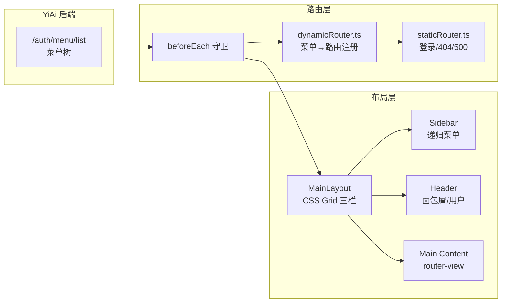
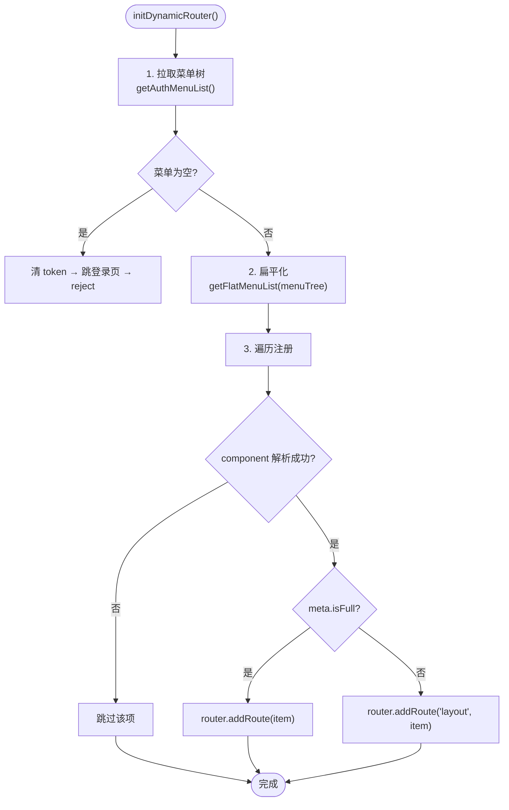
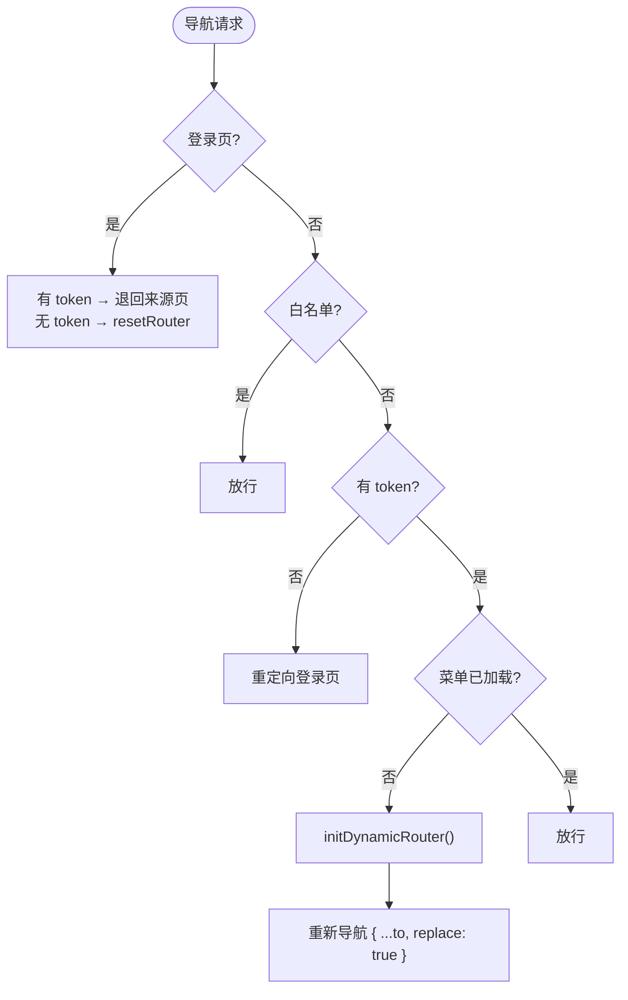
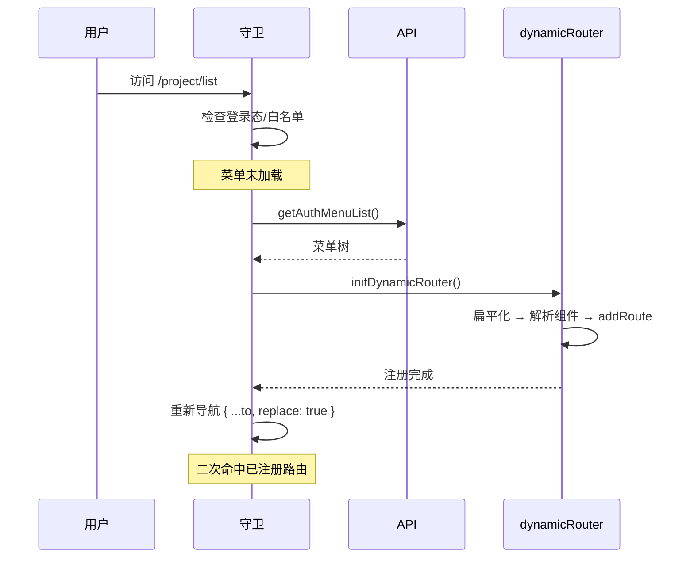

# YV-07-03: 布局与动态路由 — 三栏布局 + 菜单驱动的动态路由 — 开发方案

> 来源 PRD：[03-prd-布局与动态路由.md](../../prds/2026-07/03-prd-布局与动态路由.md)
> 需求编号：YV-07-03 · 优先级：P0 · 人天：4.0d
> 本文档定义**实现方案**。需求见 PRD。

---

## 一、方案概述

### 1.1 架构定位

布局系统是 YiVad 所有页面的容器，动态路由是菜单与页面的桥梁。两者共同构成应用的导航骨架。



### 1.2 职责边界

| 组件 | 文件 | 职责 | 明确不做 |
|------|------|------|---------|
| MainLayout | `src/layouts/MainLayout.vue` | CSS Grid 三栏容器、响应式断点 | 不处理菜单数据 |
| Sidebar | `src/layouts/components/Sidebar/` | 递归菜单渲染、折叠持久化 | 不处理权限判定 |
| Header | `src/layouts/components/Header/` | 面包屑、用户菜单、语言切换 | 不处理路由逻辑 |
| dynamicRouter | `src/routers/modules/dynamicRouter.ts` | 菜单树→路由注册 | 不做登录态判定 |
| 守卫 | `src/routers/index.ts` | 导航编排、登录态、时序 | 不做按钮级判定 |

---

## 二、文件清单

| 文件 | 类型 | 职责 |
|------|------|------|
| `src/layouts/MainLayout.vue` | 新增 | CSS Grid 三栏布局容器 |
| `src/layouts/components/Sidebar/index.vue` | 新增 | 侧边栏递归菜单 |
| `src/layouts/components/Header/index.vue` | 新增 | 顶部导航栏 |
| `src/layouts/components/Breadcrumb/index.vue` | 新增 | 动态面包屑 |
| `src/routers/index.ts` | 新增 | 路由守卫 + 实例创建 |
| `src/routers/modules/staticRouter.ts` | 新增 | 静态路由（登录/404/500） |
| `src/routers/modules/dynamicRouter.ts` | 新增 | 动态路由注册 |
| `src/utils/index.ts` | 修改 | 菜单工具函数（flatMenuList/showMenuList等） |

---

## 三、模块设计

### 3.1 MainLayout — CSS Grid 三栏布局

```scss
.main-layout {
  display: grid;
  grid-template-columns: auto 1fr;
  grid-template-rows: 56px 1fr;
  height: 100vh;

  .sidebar {
    grid-row: 1 / -1;
    width: 240px;
    transition: width 0.3s;

    &.collapsed { width: 64px; }
  }

  .header {
    grid-column: 2;
    grid-row: 1;
    height: 56px;
  }

  .main {
    grid-column: 2;
    grid-row: 2;
    overflow-y: auto;
    padding: 16px;
  }
}

// 响应式：< 768px 隐藏侧边栏
@media (max-width: 768px) {
  .main-layout {
    grid-template-columns: 1fr;
    .sidebar { display: none; }
  }
}
```

**设计要点：**
- CSS Grid 天然支持「侧边栏跨行」——`grid-row: 1 / -1` 让 Sidebar 占据全高
- 折叠过渡使用 `width` + `transition: 0.3s`，不触发 Layout 重排
- 响应式断点 768px——小屏设备隐藏侧边栏，通过汉堡菜单触发抽屉

### 3.2 Sidebar — 递归菜单组件

```vue
<!-- SidebarItem.vue — 递归渲染 -->
<script setup lang="ts">
import type { MenuItem } from "@/routers/interface";

defineProps<{ item: MenuItem }>();
</script>

<template>
  <!-- 叶子节点 -->
  <el-menu-item v-if="!item.children?.length" :index="item.path">
    <el-icon><component :is="item.meta.icon" /></el-icon>
    <span>{{ $t(item.meta.title) }}</span>
  </el-menu-item>

  <!-- 父节点：递归 -->
  <el-sub-menu v-else :index="item.path">
    <template #title>
      <el-icon><component :is="item.meta.icon" /></el-icon>
      <span>{{ $t(item.meta.title) }}</span>
    </template>
    <SidebarItem
      v-for="child in item.children"
      :key="child.path"
      :item="child"
    />
  </el-sub-menu>
</template>
```

**组件自引用：** 在 `<script setup>` 中组件可通过文件名自引用，无需显式注册。

**折叠状态持久化：**
```typescript
const globalStore = useGlobalStore();
const isCollapse = computed(() => globalStore.isCollapse);

function toggleCollapse() {
  globalStore.setGlobalState("isCollapse", !isCollapse.value);
  // pinia-plugin-persistedstate 自动写入 localStorage
}
```

### 3.3 动态路由注册

`initDynamicRouter()` 三步流程：



**组件懒加载：** 菜单项的 `component` 字段（如 `/project/list`）映射为 `() => import("@/views/project/list.vue")`，通过构建插件 `views-glob-plugin.ts` 在构建期展开为静态 `import()`。

**注册前清理：**
```typescript
// 扁平化后子节点已独立注册，删除 children 避免嵌套路由重复
delete item.children;
// 纯重定向分组不注册组件
if (item.redirect && !item.component) delete item.component;
```

### 3.4 路由守卫



---

## 四、接口与数据契约

### 4.1 菜单项结构

```typescript
interface MenuOptions {
  path: string;                              // 路由路径
  name: string;                              // 路由名（按钮鉴权索引键）
  component?: string;                        // 组件相对路径，如 "/project/list"
  redirect?: string;                         // 重定向路径
  meta: {
    icon: string;                            // Element Plus 图标名
    title: string;                           // 菜单标题
    isHide: boolean;                         // 不在侧边栏显示
    isFull: boolean;                         // 全屏页面（注册于顶层）
    isKeepAlive: boolean;                    // 组件缓存
    isAffix: boolean;                        // 固定标签页
  };
  children?: MenuOptions[];                  // 子菜单
}
```

### 4.2 菜单 API

| 端点 | 方法 | 返回 | 兜底 |
|------|------|------|------|
| `/auth/menu/list` | GET | `MenuOptions[]` | `authMenuList.json` |

---

## 五、关键流程

### 5.1 冷启动导航时序



### 5.2 侧边栏渲染流程

```
authMenuList (原始菜单树)
  → getShowMenuList() 过滤 isHide
  → sortMenuTree() 按 meta.title 排序
  → showMenuListGet (computed)
  → SidebarItem 递归渲染
```

---

## 六、实施步骤与验证

| 步骤 | 内容 | 涉及文件 | 验证方式 | 人天 |
|------|------|---------|---------|------|
| 1 | MainLayout CSS Grid 三栏布局 | `MainLayout.vue` | 三栏渲染正确，响应式断点生效 | 1.0 |
| 2 | Sidebar 递归菜单组件 | `Sidebar/index.vue` | 多级菜单展开/折叠，图标渲染，当前项高亮 | 1.0 |
| 3 | 菜单工具函数 + 扁平化 | `utils/index.ts` | flatMenuList 父先于子，showMenuList 过滤隐藏项 | 0.5 |
| 4 | 动态路由注册 | `dynamicRouter.ts` | 菜单注册为路由，组件缺失项跳过 | 1.0 |
| 5 | 路由守卫 + 登录态 | `routers/index.ts` | 未登录→登录页，菜单未加载→初始化 | 0.5 |

**合计：4.0d**

### 验证检查点

| 步骤 | 验证项 | 通过标准 |
|------|--------|---------|
| 1 | 布局渲染 | Sidebar (240px) + Header (56px) + Main (flex:1) |
| 2 | 菜单渲染 | 多级递归、图标、高亮、折叠持久化 |
| 4 | 路由注册 | 访问菜单路径可达，未下发路径 404 |
| 5 | 守卫 | 未登录跳登录页，已登录访问登录页退回来源 |

---

## 七、边缘场景处理

| 场景 | 触发条件 | 处理策略 | 位置 |
|------|---------|---------|------|
| 菜单项组件缺失 | 后端下发菜单但视图文件未实现 | `if (!resolved) return` 跳过该项 | `dynamicRouter.ts` |
| 菜单项为纯重定向 | `redirect` 存在且无 `component` | `delete item.component` 不注册 | `dynamicRouter.ts` |
| 菜单 API 不可用 | YiAi 离线 | 降级到 `authMenuList.json` | `api/modules/login.ts` |
| 侧边栏折叠状态 | 用户手动折叠 | 持久化到 localStorage，刷新恢复 | `globalStore` |
| 响应式断点 | 屏幕 < 768px | 侧边栏隐藏，汉堡菜单触发抽屉 | `MainLayout.vue` |
| 重复路由名 | 菜单名与静态路由冲突 | `addRoute` 抛错，被 catch 捕获 | `dynamicRouter.ts` |

---

## 八、已知限制

| 限制 | 影响 | 计划 |
|------|------|------|
| 菜单深度固定 3 级 | 超出 3 级的菜单项被截断 | 当前菜单规模未达阈值 |
| 侧边栏宽度非可拖拽 | 用户不可自定义侧边栏宽度 | 固定 240px/64px 满足当前需求 |
| 面包屑依赖 `route.matched` | 动态路由需正确配置 `children` 关系 | 扁平化注册时不保留嵌套 |

---

## 九、完成定义（DoD）

- [ ] 8 个文件按 §2 清单落地
- [ ] MainLayout 三栏布局渲染正确，响应式断点生效
- [ ] Sidebar 递归菜单展开/折叠/高亮正常
- [ ] 动态路由注册成功，菜单路径可达
- [ ] 路由守卫完成登录态 + 白名单 + 菜单初始化
- [ ] `pnpm type:check` 与 `pnpm lint` 通过