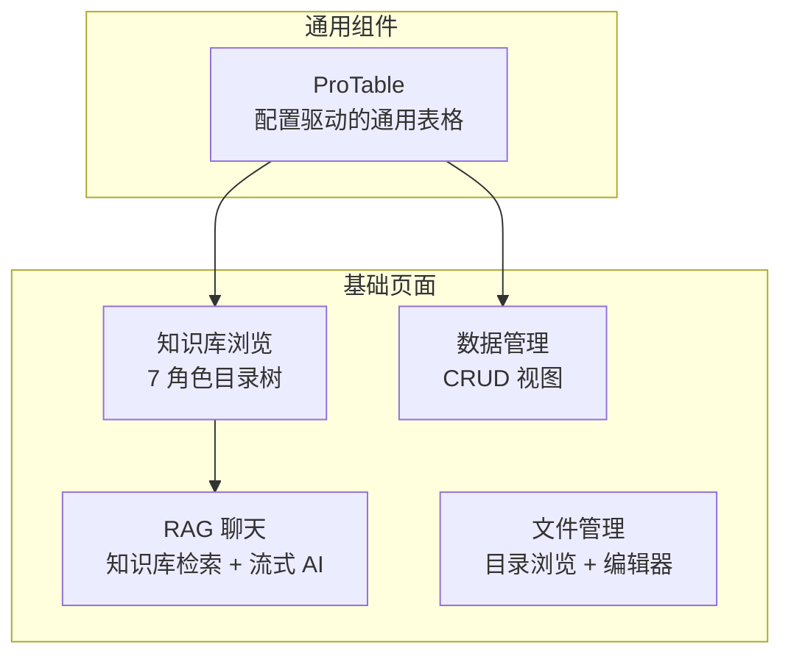
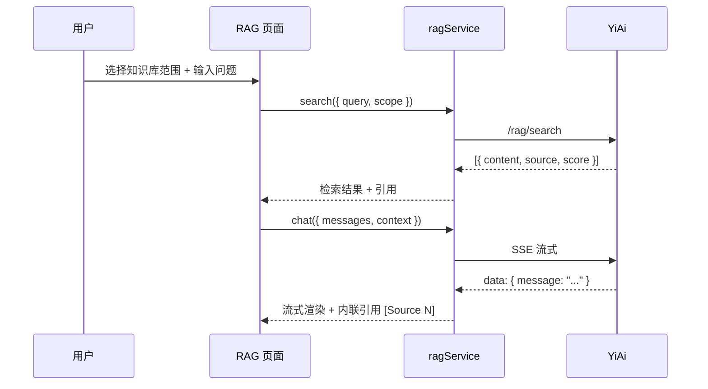

# YV-07-04: 知识库集成与基础页面 — 开发方案

> 来源 PRD：[04-prd-知识库集成与基础页面.md](../../prds/2026-07/04-prd-知识库集成与基础页面.md)
> 需求编号：YV-07-04 · 优先级：P0 · 人天：4.0d
> 本文档定义**实现方案**。需求见 PRD。

---

## 一、方案概述

### 1.1 架构定位

基础页面模块包含 YiVad 最核心的四个能力：ProTable 通用列表组件、知识库浏览、RAG 聊天、数据和文件管理。ProTable 是整个管理后台的页面基座，其他三个是 YiVad 作为知识管理平台的核心功能。



### 1.2 职责边界

| 模块 | 职责 | 依赖 |
|------|------|------|
| ProTable | 配置驱动的列表渲染（分页/排序/筛选/CRUD/导出） | Element Plus |
| 知识库浏览 | YiKnowledge 7 角色目录树 + 文件预览 | knowledgeService |
| RAG 聊天 | 知识库范围选择 + 混合检索 + SSE 流式 AI | ragService + chatService |
| 数据管理 | 4 个集合 CRUD（issue/bug/module/user） | dataService |
| 文件管理 | 目录树 + CodeMirror 编辑器 | fileService |

---

## 二、文件清单

| 文件 | 类型 | 职责 |
|------|------|------|
| `src/components/ProTable/ProTable.vue` | 新增 | 通用表格主组件 |
| `src/components/ProTable/interface.ts` | 新增 | ColumnProps/TableProps 类型 |
| `src/hooks/useTable.ts` | 新增 | 表格数据管理 composable |
| `src/views/knowledge/index.vue` | 新增 | 知识库浏览页面 |
| `src/views/aiChat/index.vue` | 新增 | RAG 聊天页面 |
| `src/views/dataManage/index.vue` | 新增 | 数据管理页面 |
| `src/views/fileManage/index.vue` | 新增 | 文件管理页面 |
| `src/api/modules/knowledgeService.ts` | 新增 | 知识库 API |
| `src/api/modules/ragService.ts` | 新增 | RAG API |
| `src/api/modules/fileService.ts` | 新增 | 文件 API |

---

## 三、模块设计

### 3.1 ProTable — 配置驱动的通用表格

```typescript
// src/components/ProTable/interface.ts
export interface ColumnProps {
  prop: string;                    // 字段名
  label: string;                   // 列标题
  width?: number | string;         // 列宽
  sortable?: boolean;              // 可排序
  search?: {                       // 搜索配置
    el: "input" | "select" | "date-picker" | "cascader";
    props?: Record<string, unknown>;
  };
  enum?: Record<string, string>[]; // 枚举值（select 选项/标签映射）
  render?: (row: Record<string, unknown>) => VNode; // 自定义渲染
}

export interface ProTableProps {
  columns: ColumnProps[];
  data: Record<string, unknown>[];
  loading: boolean;
  pagination?: { current: number; pageSize: number; total: number };
  selection?: boolean;             // 多选
  exportApi?: () => Promise<void>; // 导出
}
```

**ProTable 能力矩阵：**

| 能力 | 配置方式 | 说明 |
|------|---------|------|
| 分页 | `pagination` prop | 自动渲染分页器 |
| 排序 | `column.sortable: true` | `el-table` sort-change 事件 |
| 筛选 | `column.search.el` | 表头搜索行 |
| 多选 | `selection: true` | `el-table` selection 列 |
| 自定义列 | `column.render` | 渲染函数或具名插槽 |
| 导出 | `exportApi` | 工具栏导出按钮 |
| 空状态 | 内置 | `data.length === 0` 时显示 |
| 加载态 | `loading` prop | `v-loading` 指令 |

### 3.2 useTable Composable

```typescript
// src/hooks/useTable.ts
export function useTable(options: {
  requestApi: (params: PageParams) => Promise<QueryResult>;
  defaultParams?: Record<string, unknown>;
}) {
  const tableData = ref<Record<string, unknown>[]>([]);
  const loading = ref(false);
  const pagination = reactive({ current: 1, pageSize: 20, total: 0 });
  const search = ref<Record<string, unknown>>({});

  async function refresh() {
    loading.value = true;
    try {
      const data = await options.requestApi({
        pageNum: pagination.current,
        pageSize: pagination.pageSize,
        filter: search.value,
        ...options.defaultParams,
      });
      tableData.value = data.list;
      pagination.total = data.total;
    } finally {
      loading.value = false;
    }
  }

  // 搜索参数变更自动触发 refresh
  watch(search, () => refresh(), { deep: true });
  // 首次加载
  onMounted(() => refresh());

  return { tableData, loading, pagination, search, refresh };
}
```

### 3.3 知识库浏览

知识树渲染 7 个角色目录：

```
YiKnowledge/
├── executiver/  → 业务战略
├── producter/   → 需求
├── leader/      → 技术决策
├── engineer/    → 实现
├── srer/        → 运维
├── aier/        → AI 赋能
└── curator/     → 知识治理
```

```typescript
// 知识树数据流
knowledgeService.getTree()
  → 7 角色目录 → 递归子目录 → 文件列表
  → el-tree 渲染
  → 点击文件 → 预览面板（解析 frontmatter + Markdown 正文）
```

### 3.4 RAG 聊天



---

## 四、实施步骤与验证

| 步骤 | 内容 | 涉及文件 | 验证方式 | 人天 |
|------|------|---------|---------|------|
| 1 | ProTable 开发（类型 + composable + 主组件） | `ProTable.vue`, `interface.ts`, `useTable.ts` | 配置驱动列表渲染，筛选/排序/分页正常 | 1.0 |
| 2 | 知识库浏览页面 | `knowledge/index.vue` | 7 角色目录完整渲染，文件预览正确 | 1.0 |
| 3 | RAG 聊天页面 | `aiChat/index.vue` | 范围选择→检索→流式 AI→引用标注 | 1.0 |
| 4 | 数据管理 + 文件管理 | `dataManage/`, `fileManage/` | 4 个集合 CRUD，CodeMirror 语法高亮 | 1.0 |

**合计：4.0d**

### 验证检查点

| 步骤 | 验证项 | 通过标准 |
|------|--------|---------|
| 1 | ProTable | 空状态/加载态/错误态/数据态四态完整 |
| 2 | 知识树 | 1000 节点 < 500ms 渲染，文件预览正确解析 frontmatter |
| 3 | RAG | 检索返回 5 条引用 + 分数，SSE 流式渲染，引用自动标注 |
| 4 | CRUD | 4 个集合增删改查正常，CodeMirror 支持 Markdown/JSON/YAML/Python |

---

## 五、边缘场景处理

| 场景 | 触发条件 | 处理策略 |
|------|---------|---------|
| 知识树无数据 | YiKnowledge 目录为空 | 空状态提示「暂无知识文件」 |
| RAG 检索无结果 | `top_k` 条均为低相关 | 提示「未找到相关内容，请调整搜索范围」 |
| SSE 流中断 | 网络波动 | 显示已接收内容 + 「回复中断」标记 |
| ProTable 大数据量 | 列表 > 1000 条 | 服务端分页，单页 ≤ 100 条 |
| CodeMirror 大文件 | 文件 > 1MB | 截断显示前 5000 行 + 提示 |

---

## 六、完成定义（DoD）

- [ ] 10 个文件按 §2 清单落地
- [ ] ProTable 四态完整（空/加载/错误/数据）
- [ ] 知识库 7 角色目录完整渲染
- [ ] RAG 聊天：检索 → 流式 AI → 引用标注 全链路
- [ ] 数据管理 4 个集合 CRUD 正常
- [ ] `vue-tsc --noEmit` 与 `pnpm lint` 通过