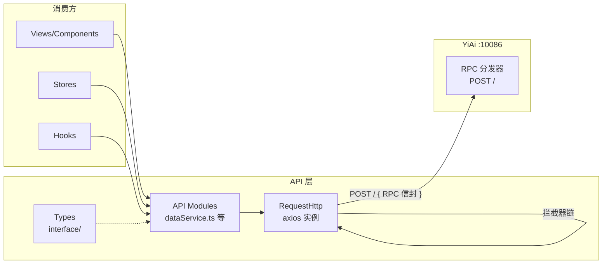
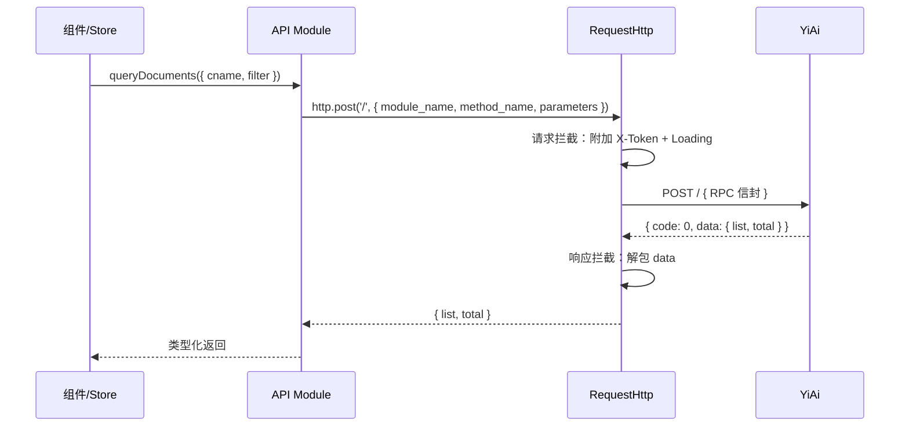
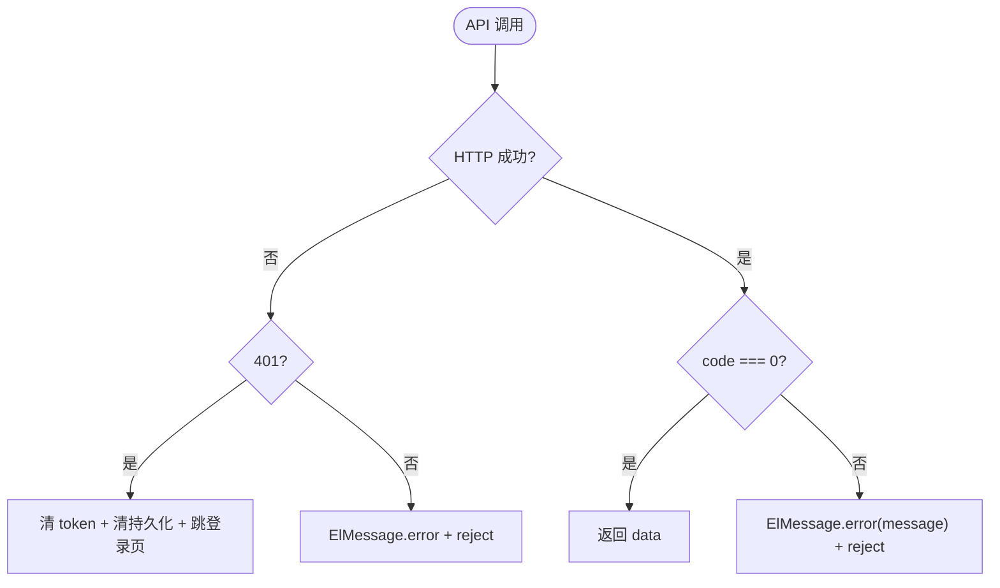

# YV-07-05: API 层设计 — RequestHttp RPC 拦截器 + 错误处理 + 认证集成 — 开发方案

> 来源 PRD：[05-prd-API层设计.md](../../prds/2026-07/05-prd-API层设计.md)
> 需求编号：YV-07-05 · 优先级：P0 · 人天：2.0d
> 本文档定义**实现方案**。需求见 PRD。

---

## 一、方案概述

### 1.1 架构定位

RequestHttp 是 YiVad 所有后端通信的唯一入口。它封装了 RPC 信封协议、Token 管理、错误处理和请求/响应拦截，使上层代码只需关心业务参数和返回数据。



### 1.2 职责边界

| 层 | 职责 | 明确不做 |
|----|------|---------|
| `RequestHttp` | axios 实例、拦截器链、RPC 信封封装 | 不包含业务逻辑 |
| API Modules | 领域 RPC 调用封装、类型导出 | 不做数据转换 |
| Types | 请求/响应类型定义 | 不包含运行时逻辑 |

---

## 二、文件清单

| 文件 | 类型 | 职责 |
|------|------|------|
| `src/api/index.ts` | 新增 | RequestHttp 实例 + 拦截器链 |
| `src/api/interface/index.ts` | 新增 | RpcRequest/RpcResponse/分页等通用类型 |
| `src/api/modules/dataService.ts` | 新增 | 通用 CRUD（query/create/update/delete） |
| `src/api/modules/chatService.ts` | 新增 | AI 聊天（SSE 流式） |
| `src/api/modules/fileService.ts` | 新增 | 文件读写 |
| `src/api/modules/login.ts` | 新增 | 认证 + 权限下发 |
| `src/api/helper/axiosCancel.ts` | 新增 | AbortController 请求取消 |

---

## 三、模块设计

### 3.1 RequestHttp — 拦截器链

```typescript
// src/api/index.ts
import axios, { AxiosInstance } from "axios";
import { ElMessage } from "element-plus";
import { useUserStore } from "@/stores/modules/user";
import { useGlobalStore } from "@/stores/modules/global";
import { LOGIN_URL } from "@/constants";
import { clearPersistedState } from "@/stores/helper/persist";

const http: AxiosInstance = axios.create({
  baseURL: import.meta.env.RSBUILD_API_BASE,
  timeout: 30000,
});

// 请求拦截器：附加 Token + Loading
http.interceptors.request.use((config) => {
  const token = useUserStore().token;
  if (token) config.headers["X-Token"] = token;
  if (config.loading !== false) useGlobalStore().loading = true;
  return config;
});

// 响应拦截器：解包信封 + 错误处理
http.interceptors.response.use(
  (response) => {
    const { code, message, data } = response.data;
    if (code === 0) return data;                         // 成功 → 解包
    ElMessage.error(message || "请求失败");               // 业务错误 → 提示
    return Promise.reject(new Error(message));
  },
  (error) => {
    if (error.response?.status === 401) {                 // 认证失败
      useUserStore().setToken("");
      clearPersistedState();
      router.replace(LOGIN_URL);
    }
    ElMessage.error(error.message || "网络错误");
    return Promise.reject(error);
  }
);
```

**拦截器链顺序：**

| 序号 | 位置 | 动作 | 说明 |
|------|------|------|------|
| 1 | Request | 附加 `X-Token` | 从 userStore 读取，无 token 则跳过 |
| 2 | Request | 注入 loading | 可通过 `{ loading: false }` 抑制 |
| 3 | Response | 解包 `data` | `code === 0` → 返回 `data`，上层无需处理信封 |
| 4 | Response | 业务错误提示 | `code !== 0` → `ElMessage.error` |
| 5 | Response | 401 连锁清理 | 清 token → 清持久化 → 跳登录页 |

### 3.2 API 模块模式

```typescript
// src/api/modules/dataService.ts
import http from "@/api";
import type { QueryParams, QueryResult } from "@/api/interface";

export async function queryDocuments(params: QueryParams): Promise<QueryResult> {
  return http.post("/", {
    module_name: "services.database.data_service",
    method_name: "query_documents",
    parameters: params,  // filter 包含在此
  });
}

export async function createDocument(params: CreateParams): Promise<{ _id: string }> {
  return http.post("/", {
    module_name: "services.database.data_service",
    method_name: "create_document",
    parameters: params,
  });
}
```

**设计要点：**
- 每个函数封装一个 RPC 调用，函数名对应 `method_name`
- 参数通过 `parameters` 透传，`filter` 在调用方组装
- 返回类型由泛型约束，`http.post` 的响应已被拦截器解包为 `data`

### 3.3 类型体系

```typescript
// src/api/interface/index.ts

/** RPC 请求信封 */
export interface RpcRequest {
  module_name: string;
  method_name: string;
  parameters: Record<string, unknown>;
}

/** 分页查询参数 */
export interface QueryParams {
  cname: string;
  filter?: Record<string, unknown>;
  pageNum?: number;
  pageSize?: number;
  orderBy?: Record<string, 1 | -1>;
  fields?: string[];
}

/** 分页查询结果 */
export interface QueryResult {
  list: Record<string, unknown>[];
  total: number;
  pageNum: number;
  pageSize: number;
  totalPages: number;
}
```

### 3.4 请求取消

```typescript
// src/api/helper/axiosCancel.ts
import axios, { AxiosRequestConfig } from "axios";

const pendingMap = new Map<string, AbortController>();

export function addPending(config: AxiosRequestConfig) {
  const key = `${config.method}:${config.url}:${JSON.stringify(config.data)}`;
  if (pendingMap.has(key)) {
    pendingMap.get(key)!.abort();  // 取消前一个相同请求
  }
  const controller = new AbortController();
  config.signal = controller.signal;
  pendingMap.set(key, controller);
}

export function removePending(config: AxiosRequestConfig) {
  const key = `${config.method}:${config.url}:${JSON.stringify(config.data)}`;
  pendingMap.delete(key);
}
```

---

## 四、关键流程

### 4.1 RPC 调用全链路



### 4.2 错误处理流程



---

## 五、实施步骤与验证

| 步骤 | 内容 | 涉及文件 | 验证方式 | 人天 |
|------|------|---------|---------|------|
| 1 | RequestHttp 实例 + 拦截器链 | `api/index.ts` | 拦截器链正确执行，Token 附加、错误提示 | 0.5 |
| 2 | 类型定义 + RPC 信封封装 | `api/interface/`, `api/helper/` | `vue-tsc --noEmit` 通过，泛型约束生效 | 0.25 |
| 3 | dataService CRUD 模块 | `api/modules/dataService.ts` | 查询/创建/更新/删除返回正确类型 | 0.5 |
| 4 | chatService SSE 流式 | `api/modules/chatService.ts` | SSE 流式接收，Token 正确累积 | 0.25 |
| 5 | fileService 文件读写 | `api/modules/fileService.ts` | 写文件→读文件→内容一致 | 0.25 |
| 6 | 迁移现有调用到新 API 层 | 各组件/Store | `grep -r "axios" src/` 零结果 | 0.25 |

**合计：2.0d**

### 验证检查点

| 步骤 | 验证项 | 通过标准 |
|------|--------|---------|
| 1 | 拦截器链 | Token 自动附加、401 连锁清理、业务错误提示 |
| 3 | CRUD | 参数名 `filter`/`target_file`/`cname`，TypeScript 类型检查通过 |
| 6 | 迁移 | 无残留 `axios` 直接调用 |

---

## 六、边缘场景处理

| 场景 | 触发条件 | 处理策略 | 位置 |
|------|---------|---------|------|
| Token 过期 | 后端返回 401 | 清 token + 清持久化 + 跳登录页 | 响应拦截器 |
| 网络超时 | axios timeout 触发 | `ElMessage.error("网络错误")` | 响应拦截器 |
| 重复请求 | 短时间内同一请求多次发起 | AbortController 取消前一个 | `axiosCancel.ts` |
| 参数名错误 | 使用 `query` 而非 `filter` | 后端静默忽略 → 返回空列表 | TypeScript 类型约束预防 |
| Loading 抑制 | 权限接口、轮询接口 | `{ loading: false }` 配置 | 请求拦截器 |

---

## 七、关键约束

| 约束 | 说明 |
|------|------|
| API 模块不包含业务逻辑 | 仅做参数转发和类型定义 |
| 参数名契约 | `filter`/`target_file`/`cname`，非 `query`/`path`/`collection_name` |
| 组件不直接 import axios | 通过 API 模块调用，享受拦截器保护 |
| 错误提示统一 | 拦截器层 `ElMessage.error`，组件层不重复提示 |

---

## 八、完成定义（DoD）

- [ ] 7 个文件按 §2 清单落地
- [ ] RequestHttp 拦截器链正确（Token/Loading/解包/错误/401）
- [ ] 5 个 API 模块可正常调用 YiAi RPC
- [ ] `grep -r "axios" src/views src/stores` 零直接引用
- [ ] `vue-tsc --noEmit` 通过，类型约束生效