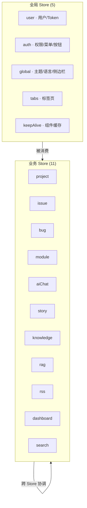

# YV-07-06: 状态管理架构设计 — Pinia Setup Store + 持久化策略 + 跨 Store 协调 — 开发方案

> 来源 PRD：[06-prd-状态管理架构设计.md](../../prds/2026-07/06-prd-状态管理架构设计.md)
> 需求编号：YV-07-06 · 优先级：P0 · 人天：2.0d
> 本文档定义**实现方案**。需求见 PRD。

---

## 一、方案概述

### 1.1 架构定位

Pinia 是 YiVad 的唯一状态管理方案。所有 Store 遵循 Setup Store 语法，按业务域拆分，通过 `pinia-plugin-persistedstate` 实现关键状态的 localStorage 持久化。



### 1.2 职责边界

| Store 类别 | 数量 | 职责 | 持久化 |
|-----------|------|------|--------|
| 全局 | 5 | 用户/权限/主题/语言/侧边栏/标签页/缓存 | 关键字段 |
| 业务 | 11 | 各业务域的 CRUD 状态、列表、筛选 | 不持久化 |

---

## 二、文件清单

| 文件 | 类型 | 职责 |
|------|------|------|
| `src/stores/index.ts` | 新增 | Pinia 实例创建 + persistedstate 插件注册 |
| `src/stores/modules/user.ts` | 新增 | 用户状态（token/信息） |
| `src/stores/modules/auth.ts` | 新增 | 权限状态（菜单/按钮/路由名） |
| `src/stores/modules/global.ts` | 新增 | 全局 UI 状态（主题/语言/侧边栏/loading） |
| `src/stores/modules/tabs.ts` | 新增 | 标签页状态 |
| `src/stores/modules/keepAlive.ts` | 新增 | 组件缓存名单 |
| `src/stores/modules/project.ts` | 新增 | 项目管理 CRUD |
| `src/stores/modules/issue.ts` | 新增 | Issue 管理 |
| `src/stores/modules/bug.ts` | 新增 | Bug 管理 |
| `src/stores/modules/aiChat.ts` | 新增 | AI 聊天消息/会话 |
| `src/stores/helper/persist.ts` | 新增 | 持久化辅助函数 |

---

## 三、模块设计

### 3.1 Pinia 实例 + 持久化插件

```typescript
// src/stores/index.ts
import { createPinia } from "pinia";
import piniaPluginPersistedstate from "pinia-plugin-persistedstate";

const pinia = createPinia();
pinia.use(piniaPluginPersistedstate);

export default pinia;
```

### 3.2 Setup Store 模式（唯一允许的格式）

```typescript
// src/stores/modules/project.ts
import { defineStore } from "pinia";
import { ref, computed } from "vue";
import { queryDocuments, createDocument } from "@/api/modules/dataService";
import type { ProjectItem } from "@/api/interface";

export const useProjectStore = defineStore("yivad-project", () => {
  // 1. 状态 (ref/reactive)
  const list = ref<ProjectItem[]>([]);
  const loading = ref(false);
  const currentItem = ref<ProjectItem | null>(null);

  // 2. 派生 (computed)
  const activeProjects = computed(() =>
    list.value.filter(p => p.status === "active")
  );
  const totalCount = computed(() => list.value.length);

  // 3. 动作 (async function)
  async function fetchList(filter?: Record<string, unknown>) {
    loading.value = true;
    try {
      const data = await queryDocuments({
        cname: "projects",
        filter,
      });
      list.value = data.list;
    } finally {
      loading.value = false;
    }
  }

  async function create(data: Record<string, unknown>) {
    await createDocument({ cname: "projects", data });
    await fetchList();
  }

  // 4. 只暴露方法，不直接暴露 mutable state
  return { list, loading, currentItem, activeProjects, totalCount, fetchList, create };
});
```

**设计要点：**
- Store id 前缀 `yivad-` 避免与其他项目冲突
- 状态用 `ref`/`reactive`，派生用 `computed`，动作用 `async function`
- 异步操作统一管理 `loading` 状态
- 只暴露方法，外部不直接修改 `list.value = [...]`

### 3.3 持久化策略

```typescript
// 需要持久化的 Store 添加 persist 配置
export const useUserStore = defineStore("yivad-user", () => {
  const token = ref("");
  const userInfo = ref<UserInfo | null>(null);

  return { token, userInfo };
}, {
  persist: {
    key: "yivad-user",
    storage: localStorage,
    pick: ["token", "userInfo"],  // 仅持久化指定字段
  },
});
```

**持久化决策表：**

| Store | 持久化字段 | 原因 |
|-------|-----------|------|
| `user` | token, userInfo | 刷新不丢失登录态 |
| `global` | language, theme, isCollapse | 用户偏好保留 |
| `tabs` | tabs | 刷新恢复标签页 |
| 业务 Store | — | 数据从 API 重新加载，不需持久化 |

### 3.4 跨 Store 协调

```typescript
// 示例：关闭标签页时同步清理 KeepAlive 缓存
// stores/modules/tabs.ts
import { useKeepAliveStore } from "./keepAlive";

async function closeTab(path: string) {
  tabs.value = tabs.value.filter(t => t.path !== path);
  // 跨 Store 协调
  const keepAliveStore = useKeepAliveStore();
  keepAliveStore.removeCache(path);
}
```

**跨 Store 协调规则：**
- Store 之间可以互相引用（Pinia 支持循环依赖检测）
- 仅在动作（action）中调用其他 Store，不在 computed 中
- 避免形成 A→B→A 的循环依赖

---

## 四、Store 分类与职责

### 4.1 全局 Store (5)

| Store | Store ID | 核心状态 | 持久化 |
|-------|----------|---------|--------|
| user | `yivad-user` | token, userInfo | ✅ |
| auth | `yivad-auth` | authMenuList, authButtonList, routeName | — |
| global | `yivad-global` | language, theme, isCollapse, loading | ✅ |
| tabs | `yivad-tabs` | tabs | ✅ |
| keepAlive | `yivad-keepAlive` | cacheList | — |

### 4.2 业务 Store (11)

| Store | Store ID | 核心状态 | 数据来源 |
|-------|----------|---------|---------|
| project | `yivad-project` | list, currentItem | `dataService.queryDocuments` |
| issue | `yivad-issue` | list, currentIssue | `dataService.queryDocuments` |
| bug | `yivad-bug` | list, currentBug | `dataService.queryDocuments` |
| module | `yivad-module` | list | `dataService.queryDocuments` |
| aiChat | `yivad-aiChat` | messages, sessions | `chatService.chat` (SSE) |
| story | `yivad-story` | stories, scenarios | `dataService.queryDocuments` |
| knowledge | `yivad-knowledge` | fileTree | `knowledgeService` |
| rag | `yivad-rag` | searchResults | `ragService.search` |
| rss | `yivad-rss` | feeds, articles | `feedService` |
| dashboard | `yivad-dashboard` | stats | `dataService.queryDocuments` |
| search | `yivad-search` | results | `searchService` |

---

## 五、实施步骤与验证

| 步骤 | 内容 | 涉及文件 | 验证方式 | 人天 |
|------|------|---------|---------|------|
| 1 | Pinia 实例 + persistedstate 插件 | `stores/index.ts` | Vue DevTools 中可见 Pinia 实例 | 0.25 |
| 2 | 5 个全局 Store | `stores/modules/{user,auth,global,tabs,keepAlive}.ts` | 主题/语言/Token 持久化正常 | 0.5 |
| 3 | 4 个简单 CRUD Store | `stores/modules/{project,issue,bug,module}.ts` | CRUD 通过 RPC 正常，loading 状态正确 | 0.5 |
| 4 | 3 个复杂 Store | `stores/modules/{aiChat,story,knowledge}.ts` | AI 聊天/故事板/知识库功能正常 | 0.5 |
| 5 | 跨 Store 协调 + 持久化验证 | 全部 Store | 关闭标签→清理缓存、刷新→不丢失 Token | 0.25 |

**合计：2.0d**

### 验证检查点

| 步骤 | 验证项 | 通过标准 |
|------|--------|---------|
| 2 | 持久化 | 刷新页面后 token/language/theme 不丢失 |
| 3 | CRUD | Store 动作通过 RPC 正常读写，loading 状态切换正确 |
| 5 | 协调 | 标签页关闭→keepAlive 清理同步 |

---

## 六、边缘场景处理

| 场景 | 触发条件 | 处理策略 |
|------|---------|---------|
| Token 过期 | API 返回 401 | userStore 清 token → 持久化清除 → 跳登录页 |
| 并发请求 | 快速切换页面 | 前一个请求 AbortController 取消 |
| 持久化配额满 | localStorage 满 | 仅持久化关键字段（token），非关键字段降级 |
| Store 循环依赖 | A→B→A | Pinia 运行时检测并警告，避免在 computed 中跨 Store 引用 |

---

## 七、设计原则

| 原则 | 说明 |
|------|------|
| 单一业务域 | 一个 Store 一个业务域，不做万能 Store |
| Setup Store | 唯一允许格式，禁止 Options Store |
| 方法暴露 | 暴露方法而非直接暴露 mutable state |
| API 层隔离 | Store 不直接 import axios/fetch，通过 API 模块 |
| 持久化最小化 | 仅持久化关键字段（token/偏好），业务数据从 API 恢复 |

---

## 八、完成定义（DoD）

- [ ] 11 个文件按 §2 清单落地
- [ ] 16 个 Store 全部使用 Setup Store 语法
- [ ] 5 个全局 Store 持久化验证通过
- [ ] 跨 Store 协调正确（tabs↔keepAlive）
- [ ] `vue-tsc --noEmit` 通过