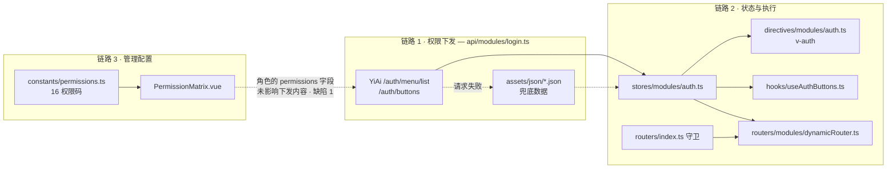
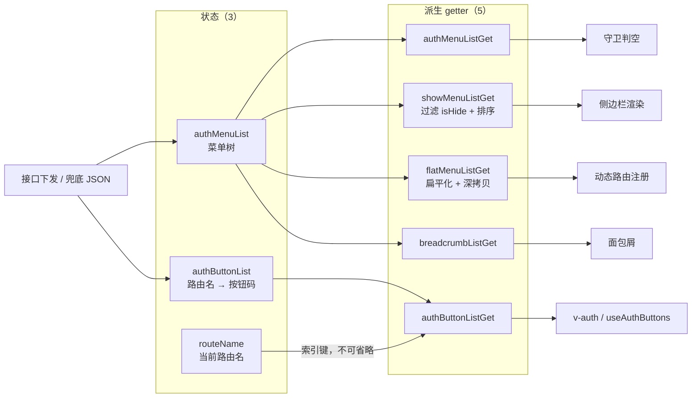
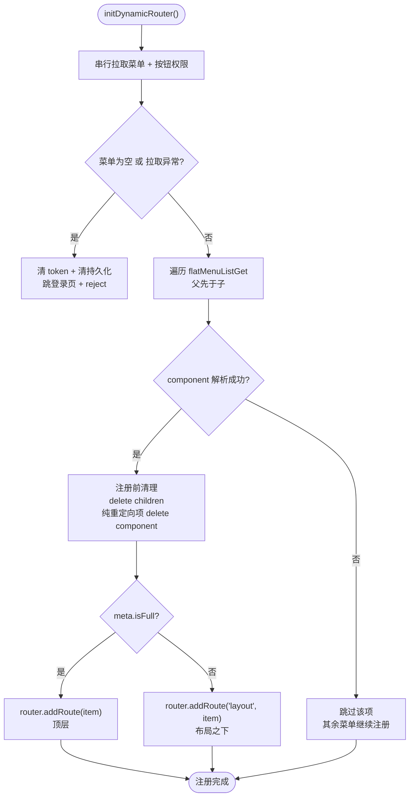
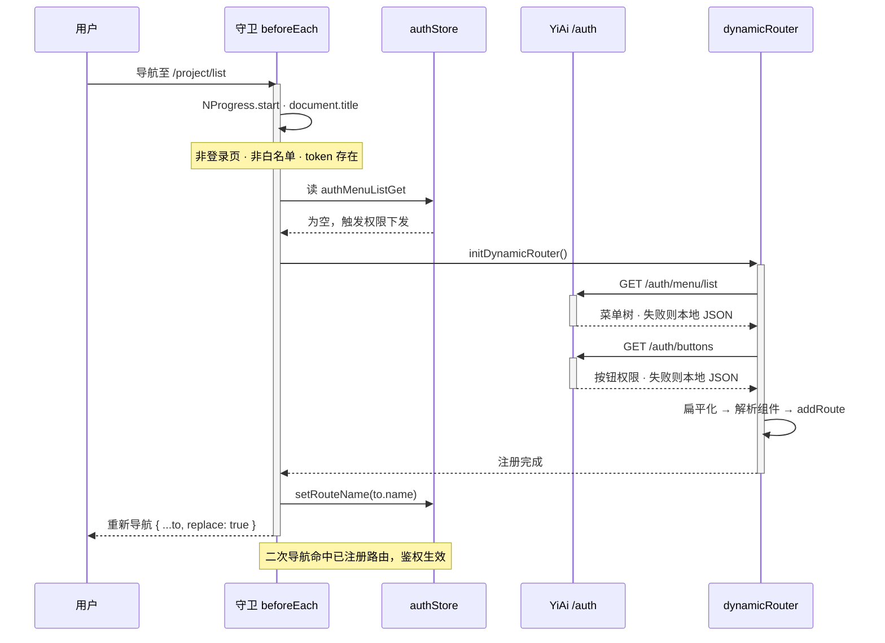
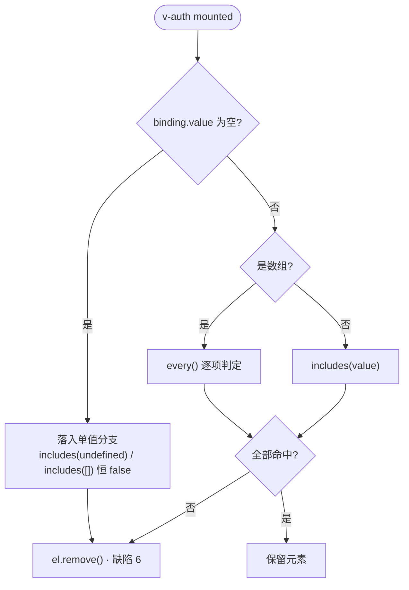
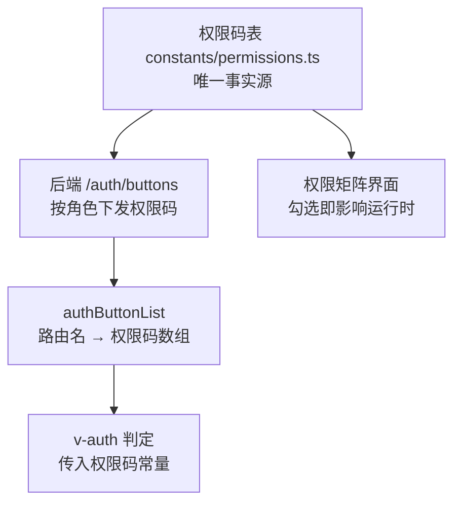

# YV-07-07: 权限系统与动态菜单 — RBAC 权限码 + v-auth 按钮级鉴权 + 菜单驱动动态路由 — 开发方案

> 来源 PRD：[07-prd-权限系统与动态菜单.md](../../prds/2026-07/07-prd-权限系统与动态菜单.md)
> 需求编号：YV-07-07 · 优先级：P0 · 人天：2.0d 估算 / 2.75d 计划（见 §六）
> 本文档定义**实现方案**——怎么做、改动哪些文件、如何验证。需求定义见 PRD，验证方式见[测试用例](../../tests/2026-07/07-prd-test-权限系统与动态菜单.md)。

---

## 一、方案概述

### 1.1 三条链路

权限系统由三条链路组成，**本期仅第 1、2 条链路闭环**：



> 图中两条虚线是**反向**的语义：`API -.-> FB` 表示请求失败时降级（非兜底数据供给接口）；`MATRIX -.-> API` 表示**本该存在而实际缺失**的接线——角色权限并未影响下发内容。

| 链路 | 输入 | 输出 | 状态 |
|------|------|------|------|
| 1 · 权限下发 | YiAi 授权接口 | 菜单树 + 按钮规则 | ✅ 闭环 |
| 2 · 状态与执行 | 下发数据 | 路由注册 + 按钮显隐 | ✅ 闭环 |
| 3 · 管理配置 | 权限码表 | 角色 `permissions` 字段 | ⚠️ **未接入链路 2** |

**链路 3 与链路 2 使用两套不相通的权限词汇**——这是本方案最重要的架构事实，详见[§8 已知缺陷](#known-defects)。

### 1.2 职责边界

| 层 | 职责 | 明确不做 |
|----|------|---------|
| `api/modules/login.ts` | 拉取授权数据、失败降级 | 不解释数据结构 |
| `stores/modules/auth.ts` | 持有权限状态、派生菜单视图 | 不做鉴权判定 |
| `directives/modules/auth.ts` | 单元素按钮级判定 | 不感知路由注册 |
| `routers/modules/dynamicRouter.ts` | 菜单树 → 路由注册 | 不做登录态判定 |
| `routers/index.ts` | 导航编排、登录态、时序 | 不做按钮级判定 |
| `constants/permissions.ts` | 权限码定义与角色矩阵 | 不参与运行时判定（当前） |

---

## 二、文件清单

| 文件 | 类型 | 职责 |
|------|------|------|
| `src/constants/permissions.ts` | 新增 | 16 个权限码、7 个模块分组、5 个角色默认矩阵 |
| `src/stores/modules/auth.ts` | 新增 | 权限状态（菜单树 / 按钮规则 / 当前路由名）+ 菜单派生 |
| `src/directives/modules/auth.ts` | 新增 | `v-auth` 指令——按钮级鉴权 |
| `src/hooks/useAuthButtons.ts` | 新增 | 编程式按钮权限查询 |
| `src/routers/modules/dynamicRouter.ts` | 新增 | `initDynamicRouter()`——菜单树转路由 |
| `src/routers/index.ts` | 修改 | 守卫 `beforeEach`、`afterEach`、`onError`、`resetRouter()` |
| `src/api/modules/login.ts` | 修改 | 授权接口 + 本地 JSON 兜底 |
| `src/assets/json/authMenuList.json` | 新增 | 菜单兜底数据 |
| `src/assets/json/authButtonList.json` | 新增 | 按钮权限兜底数据 |
| `src/utils/index.ts` | 修改 | `getFlatMenuList` / `getShowMenuList` / `sortMenuTree` / `getAllBreadcrumbList` |
| `build/views-glob-plugin.ts` | 新增 | 视图懒加载映射虚拟模块 `@yivad/views-glob` |
| `src/views/system/roleManage/components/PermissionMatrix.vue` | 新增 | 角色权限矩阵编辑界面 |

---

## 三、模块设计

### 3.1 权限码表 — `src/constants/permissions.ts`

单一事实源：权限码、模块分组、角色默认矩阵、类型导出。

```typescript
export const PERMISSIONS = {
  PROJECT_VIEW: "project:view",
  PROJECT_CREATE: "project:create",
  PROJECT_EDIT: "project:edit",
  PROJECT_DELETE: "project:delete",

  KNOWLEDGE_VIEW: "knowledge:view",
  KNOWLEDGE_CREATE: "knowledge:create",
  KNOWLEDGE_EDIT: "knowledge:edit",
  KNOWLEDGE_DELETE: "knowledge:delete",

  DATA_VIEW: "data:view",
  DATA_EXPORT: "data:export",

  CHAT_VIEW: "chat:view",
  CHAT_CREATE: "chat:create",

  USER_MANAGE: "user:manage",
  ROLE_MANAGE: "role:manage",

  AUDIT_VIEW: "audit:view",
  AUDIT_EXPORT: "audit:export",
} as const;

export type PermissionCode = (typeof PERMISSIONS)[keyof typeof PERMISSIONS];
```

三个导出物，消费方各不相同：

| 导出 | 形状 | 消费方 |
|------|------|--------|
| `PERMISSIONS` | `as const` 对象 → 联合类型 | `PermissionMatrix.vue` 全选 |
| `PERMISSION_MODULES` | `{ module, label, permissions: { code, label }[] }[]` | `PermissionMatrix.vue` 分组渲染 |
| `DEFAULT_ROLE_PERMISSIONS` | `Record<RoleKey, PermissionCode[]>` | **无消费方**（见 §8） |

`as const` 是类型安全的关键——它使 `PermissionCode` 成为字面量联合类型，权限码拼写错误在编译期即可暴露。

### 3.2 权限状态 — `src/stores/modules/auth.ts`

Setup 语法，store id 为 `yivad-auth`。

**状态**（3 项）：

```typescript
const authButtonList = ref<Record<string, string[]>>({});  // 路由名 → 按钮码数组
const authMenuList = ref<MenuItem[]>([]);                  // 菜单树
const routeName = ref("");                                 // 当前路由名，按钮鉴权的索引键
```

**派生**（5 项，全部为 `computed`）：

| Getter | 实现 | 用途 |
|--------|------|------|
| `authButtonListGet` | 直接透出 | `v-auth` 判定数据源 |
| `authMenuListGet` | 直接透出 | 守卫判断菜单是否已加载 |
| `showMenuListGet` | `sortMenuTree(getShowMenuList(...))` | 侧边栏渲染（已过滤隐藏项 + 排序） |
| `flatMenuListGet` | `getFlatMenuList(...)` | 动态路由注册 |
| `breadcrumbListGet` | `getAllBreadcrumbList(...)` | 面包屑 |

`routeName` 是按钮鉴权的**索引键**：`v-auth` 通过它从 `authButtonList` 取出当前页面的按钮码数组。这意味着按钮权限按**路由名**而非路由路径索引——菜单下发时 `name` 字段的稳定性直接决定按钮鉴权是否生效。

状态到消费方的完整派生关系：



**动作**（3 项）：`getAuthMenuList()`、`getAuthButtonList()`、`setRouteName(name)`。前两者将接口响应写入状态，失败处理交由接口层（§3.3）。

> 已知约束：`getShowMenuList` 与 `getFlatMenuList` 内部均先做 `JSON.parse(JSON.stringify())` 深拷贝，避免派生过程污染原始菜单树。新增派生 getter 时须沿用该约定，否则会因共享引用导致菜单树被就地修改。

### 3.3 授权接口与兜底 — `src/api/modules/login.ts`

授权走 YiAi 的 REST 面（非 RPC 信封）——`/auth/*` 是认证域接口，不经过 `data_service`。

```typescript
export const getAuthMenuListApi = async (): Promise<any> => {
  try {
    return await http.get<Menu.MenuOptions[]>(`/auth/menu/list`, {}, { loading: false });
  } catch {
    return authMenuList;   // 本地 JSON 兜底
  }
};
```

| 接口 | 方法 | 兜底数据 |
|------|------|---------|
| `/auth/menu/list` | GET | `assets/json/authMenuList.json` |
| `/auth/buttons` | GET | `assets/json/authButtonList.json` |
| `/auth/login` | POST | — |
| `/auth/logout` | POST | — |

**后端数据源**（YiAi `src/server/routes/auth.py`）：

| 端点 | 事实来源 | 形状 |
|------|---------|------|
| `/auth/menu/list` | MongoDB `menus` 集合（由 `/system/menuMange` 页面维护） | 按 `parent` 分组的嵌套树；集合为空时降级为 `src/views` 文件系统扫描 |
| `/auth/buttons` | MongoDB `button_permissions` 集合 | 文档 `{ key: <页面名>, buttons: ["add", "edit", …] }`，聚合为 `{ 页面名: 按钮码数组 }` |

两个后端事实决定了运行时鉴权的词汇（见 §8 缺陷 1）：

1. 按钮规则按 **页面名（`key`）** 索引，与前端 `authButtonListGet[routeName]` 的索引键对应——即菜单的 `name` 字段
2. 按钮码为**裸动作名**（`add` / `edit` / `export`），**不是** `{module}:{action}` 权限码

`/auth/menu/list` 的文件系统扫描降级只覆盖 `BUSINESS_DIRS = ["home", "aiChat", "system"]`——模板目录（含 `proTable`）不在其中。

**兜底语义**：`try/catch` 吞掉任何异常（网络错误、非 2xx、超时）后返回本地 JSON。降级对上层**完全透明**——调用方无法区分数据来自接口还是兜底，因此降级事件无法被上层感知（见 §8 缺陷 2）。`{ loading: false }` 抑制全局 loading 遮罩，避免权限拉取触发整页 loading。

**信封一致性**：后端与兜底文件**都**返回 `{ code, data }` 信封（兜底 JSON 亦为 `{ code: 200, data: { … } }`），而 store 中统一解构 `data`：

```typescript
const { data } = await getAuthButtonListApi();
authButtonList.value = data;
```

两条路径因此在 store 层形状一致——这是兜底能与接口无缝互换的原因。

### 3.4 按钮级鉴权 — `src/directives/modules/auth.ts`

```typescript
const auth: Directive = {
  mounted(el: HTMLElement, binding: DirectiveBinding) {
    const { value } = binding;
    const authStore = useAuthStore();
    const currentPageRoles = authStore.authButtonListGet[authStore.routeName] ?? [];
    if (value instanceof Array && value.length) {
      const hasPermission = value.every(item => currentPageRoles.includes(item));
      if (!hasPermission) el.remove();
    } else {
      if (!currentPageRoles.includes(value)) el.remove();
    }
  }
};
```

| 判定分支 | 条件 | 语义 |
|---------|------|------|
| 数组 | `value instanceof Array && value.length > 0` | `.every()` → **AND**，缺一即移除 |
| 单值 | 其他 | `.includes()` → 包含即保留 |
| 空值 | `value` 为空/空数组 | 走单值分支，`includes(undefined/[])` 恒 false → **移除** |

**实现特征与约束**：

- 仅在 `mounted` 判定一次——**无 `updated` 钩子**，权限数据变化不会触发重新判定（见 §8 缺陷 3）
- 移除方式为 `el.remove()`，比 `display: none` 彻底，HTML 源码不可见
- 无权限数据未就绪的保护——若 `authButtonList` 尚未写入状态，`?? []` 使数组为空，**所有按钮被移除**（见 §8 缺陷 4）
- 无空值守卫——`v-auth` 不传值时判定为移除
- 空数组 `v-auth="[]"` 落入单值分支，`includes([])` 恒 false → 移除

### 3.5 编程式查询 — `src/hooks/useAuthButtons.ts`

```typescript
export const useAuthButtons = () => {
  const route = useRoute();
  const authStore = useAuthStore();
  const authButtons = authStore.authButtonListGet[route.name as string] || [];

  const BUTTONS = computed(() => {
    let currentPageAuthButton: { [key: string]: boolean } = {};
    authButtons.forEach(item => (currentPageAuthButton[item] = true));
    return currentPageAuthButton;
  });

  return { BUTTONS };
};
```

返回 `Record<string, boolean>` 映射而非数组，使用形式为 `BUTTONS.value.add` 或 `BUTTONS.value["export"]`。

> 注意：`authButtons` 在 setup 阶段求值一次（非 `computed`），因此**路由切换后 `BUTTONS` 不会自动更新**。同页多路由复用的场景需重新调用组合式函数。这是返回映射而非常量数组的代价——映射构造被缓存于闭包，判定数据被冻结在首次求值。

### 3.6 动态路由注册 — `src/routers/modules/dynamicRouter.ts`

`initDynamicRouter()` 三步：

| 步骤 | 动作 | 失败处理 |
|------|------|---------|
| 1 | 串行 `await getAuthMenuList()` → `await getAuthButtonList()` | `catch` → 清 token、清持久化、跳登录页、reject |
| 2 | 菜单为空 → `ElNotification` 警告 + 清 token + 清持久化 + 跳登录页 + reject | 同上 |
| 3 | 遍历 `flatMenuListGet`，解析组件，`addRoute` 注册 | 组件缺失则 `return`（跳过该项） |

控制流如下——注意两条失败路径在步骤 1、2 已收敛为同一组动作，步骤 3 的跳过是**局部**的、不影响其余菜单：



**组件解析**：菜单项的 `component` 为相对路径字符串（如 `/home/index`），映射键为 `"/src/views" + component + ".vue"`：

```typescript
const resolved = modules["/src/views" + item.component + ".vue"];
if (!resolved) return;   // 视图文件缺失 → 跳过，交由静态路由或 404
```

`modules` 来自虚拟模块 `@yivad/views-glob`，由构建插件 `build/views-glob-plugin.ts` 扫描 `src/views` 生成，形状为 `{ "/src/views/foo/bar.vue": () => import("@/views/foo/bar.vue") }`。选择构建期生成而非 `import.meta.glob`，是因为 Rsbuild 的 swc 解析器将 `import.meta.glob` 视为 critical dependency 而拒绝——插件在构建期展开为静态 `import()`，既保持 rspack 的分块能力，又让 `dynamicRouter.ts` 无需为构建器差异改写。

**注册位置**：

```typescript
if (item.meta.isFull) router.addRoute(item);          // 全屏页面 → 顶层
else router.addRoute("layout", item);                 // 常规页面 → 布局之下
```

仅重定向的菜单分组（`redirect` 存在且无 `component`）会被 `delete item.component`，不注册组件。注册前统一 `delete item.children`——扁平化后子节点已独立注册，保留 `children` 会造成嵌套路由重复。

**失败路径**统一为：

```typescript
userStore.setToken("");
clearPersistedState();
router.replace(LOGIN_URL);
return Promise.reject(error);
```

即「权限不可得」等价于「未登录」——避免用户停留在菜单不完整的半可用状态。

### 3.7 路由守卫 — `src/routers/index.ts`

`beforeEach` 按序执行（返回即放行，`return` 值作为导航目标）：

| 序 | 判定 | 动作 |
|----|------|------|
| 1 | — | `NProgress.start()` |
| 2 | — | `document.title = to.meta.title ? \`${to.meta.title} - ${APP_TITLE}\` : APP_TITLE` |
| 3 | `to.path === LOGIN_URL` | 有 token → `return from.fullPath`；无 token → `resetRouter()` |
| 4 | `ROUTER_WHITE_LIST.includes(to.path)` | `return`（放行） |
| 5 | `!userStore.token` | `return { path: LOGIN_URL, replace: true }` |
| 6 | `!authStore.authMenuListGet.length` | `await initDynamicRouter()` → `return { ...to, replace: true }` |
| 7 | — | `authStore.setRouteName(to.name as string)` |

**时序要点**：

- 第 6 步的 `{ ...to, replace: true }` 是**必需**的——路由在本次导航开始时尚未注册，必须重新发起导航才能命中新注册的路由
- 该步骤同时构成天然的重入保护：`initDynamicRouter()` 完成后 `authMenuListGet` 非空，第 6 步条件不再成立。**不需要额外的加载锁**（区别于旧方案的 `menuLoading` 标志）
- 第 7 步写入 `routeName` 是按钮鉴权的前置条件——`v-auth` 依赖它索引按钮码
- 第 3 步的 `resetRouter()` 在登出/切号时移除已注册的动态路由，避免上一账号的菜单残留
- **守卫中不存在路由级权限判定**——路由可达性完全由「菜单是否下发了该路由」决定（PRD 决策 4）

`ROUTER_WHITE_LIST` 当前为 `["/500"]`（仅错误页）；登录页由第 3 步单独处理，未列入白名单。

`afterEach` → `NProgress.done()`；`onError` → `NProgress.done()` + `console.warn`。

### 3.8 菜单工具 — `src/utils/index.ts`

| 函数 | 行为 | 关键实现 |
|------|------|---------|
| `getFlatMenuList` | 树 → 扁平数组 | `flatMap` 先深拷贝再展开，父先于子 |
| `getShowMenuList` | 过滤 `meta.isHide` | 递归过滤，深拷贝 |
| `sortMenuTree` | 按 `meta.title` 排序 | `localeCompare(a, b, "zh-CN-u-kf-lower")` |
| `getAllBreadcrumbList` | 路径 → 面包屑数组 | 递归累积 `parent` |

`sortMenuTree` 使用 `"zh-CN-u-kf-lower"` 排序规则——`kf` 表示小写优先，使中文标题按拼音序、英文按字典序稳定排列。

### 3.9 权限矩阵 — `PermissionMatrix.vue`

`v-model` 绑定 `string[]`（角色权限码数组）：

- 按 `PERMISSION_MODULES` 分组渲染，模块标签以 `rowspan` 跨行合并
- `selectAll` → `Object.values(PERMISSIONS)`；`deselectAll` → `[]`
- 变更通过 `update:modelValue` 上抛，由 `roleManage/index.vue` 随角色 `createRole` / `updateRole` 持久化

---

## 四、接口与数据契约

### 4.1 授权接口

| 端点 | 方法 | 响应 | 事实来源 |
|------|------|------|---------|
| `/auth/menu/list` | GET | 菜单树 `Menu.MenuOptions[]` | MongoDB `menus` |
| `/auth/buttons` | GET | `Record<页面名, string[]>` | MongoDB `button_permissions` |

响应均包裹 `{ code, message, data }` 信封；前端在 store 层解构 `data`。

### 4.2 菜单项结构

```typescript
declare namespace Menu {
  interface MenuOptions {
    path: string;
    name: string;                                        // 路由名——按钮鉴权的索引键
    component?: string | (() => Promise<unknown>);       // 相对路径，注册时解析为懒加载函数
    redirect?: string;
    meta: MetaProps;
    children?: MenuOptions[];
  }
  interface MetaProps {
    icon: string;
    title: string;
    titleI18n?: string;
    activeMenu?: string;
    isLink?: string;
    isHide: boolean;      // 不在侧边栏显示（仍注册路由）
    isFull: boolean;      // 全屏页面——注册于顶层
    isAffix: boolean;     // 固定标签页
    isKeepAlive: boolean; // 组件缓存
    independentTab?: boolean;
  }
}
```

### 4.3 按钮权限结构

按**页面名**（对应菜单 `name` 字段）索引，值为**裸动作名**数组：

```json
{ "useProTable": ["add", "batchAdd", "export"] }
```

兜底文件 `authButtonList.json` 为同形状的信封（键为模板遗留的页面名）：

```json
{
  "code": 200,
  "data": {
    "useProTable": ["add", "batchAdd", "export", "batchDelete", "status"],
    "authButton": ["add", "edit", "delete", "import", "export"]
  }
}
```

> **兜底数据与兜底菜单的键不相交**（已验证）：兜底菜单 `authMenuList.json` 含 60 个路由名（`home` / `aiChat` / `system*` / `dashboard*` / `project` / `issue` …），而兜底按钮规则仅有 `useProTable` 与 `authButton` 两个键，**交集为空**。因此在离线降级状态下，任何可达路由的按钮规则均为 `undefined`，经 `?? []` 后所有 `v-auth` 按钮被移除。这是缺陷 1 与缺陷 4 在降级路径上的叠加表现。

> 另有 `src/assets/mock/geeker/` 下的模板 mock 套件（`menu/list.json`、`auth/buttons.json`）——**无任何引用，属死数据**，不应作为契约依据。

### 4.4 权限码契约

- **格式**：`{module}:{action}`，小写，冒号分隔
- **动作词表**：`view` / `create` / `edit` / `delete` / `export` / `manage`
- **模块**：`project` / `knowledge` / `data` / `chat` / `user` / `role` / `audit`
- **禁止**：在视图中使用字符串字面量权限码，须引用 `PERMISSIONS.*`

---

## 五、关键流程

### 5.1 冷启动时序



### 5.2 按钮鉴权判定



### 5.3 失败与降级

| 失败点 | 行为 | 用户感知 |
|--------|------|---------|
| 授权接口异常 | 返回本地 JSON | 无（静默降级） |
| 菜单为空 | 通知 + 清 token + 清状态 + 跳登录页 | 提示无权限，回到登录页 |
| 菜单树异常 | `catch` → 同上 | 同上 |
| 组件文件缺失 | 跳过该菜单项 | 该页面 404，其余正常 |
| 路由未下发 | 路由不存在 | 404 |

---

## 六、实施步骤与验证

| 步骤 | 内容 | 涉及文件 | 验证方式 | 人天 |
|------|------|---------|---------|------|
| 1 | 定义 16 个权限码 + 7 个模块分组 + 5 个角色矩阵 | `constants/permissions.ts` | `PermissionCode` 联合类型可推导；权限码格式统一 | 0.25 |
| 2 | 实现权限状态 store 与菜单派生 getter | `stores/modules/auth.ts` | 三个动作写入状态；五个 getter 派生正确 | 0.5 |
| 3 | 实现授权接口与本地 JSON 兜底 | `api/modules/login.ts` + `assets/json/` | 断开 YiAi 后菜单仍可加载 | 0.25 |
| 4 | 实现 `v-auth` 指令与 `useAuthButtons` | `directives/modules/auth.ts` + `hooks/useAuthButtons.ts` | 无权限按钮 DOM 移除；单值/数组语义正确 | 0.5 |
| 5 | 实现视图懒加载映射构建插件 | `build/views-glob-plugin.ts` | 构建产物中视图按 chunk 分割 | 0.25 |
| 6 | 实现动态路由注册 | `routers/modules/dynamicRouter.ts` | 菜单树注册为路由；组件缺失项被跳过 | 0.5 |
| 7 | 实现路由守卫与重置 | `routers/index.ts` | 未登录跳登录页；菜单未加载时二次导航命中 | 0.25 |
| 8 | 实现角色权限矩阵界面 | `PermissionMatrix.vue` | 勾选结果正确上抛并持久化 | 0.25 |

**合计：2.75d**。PRD 估算为 2.0d（`estimate_frontend`），差额 0.75d 全部来自原估算未列出的三项交付物：授权接口与本地兜底（步骤 3，0.25d）、视图懒加载构建插件（步骤 5，0.25d）、角色权限矩阵界面（步骤 8，0.25d）。其余五步沿用原估算粒度。

### 验证检查点

| 步骤 | 验证项 | 通过标准 |
|------|--------|---------|
| 1 | 权限码类型 | `PermissionCode` 为字面量联合类型，拼错权限码编译失败 |
| 2 | 菜单派生 | `flatMenuListGet` 父先于子；`showMenuListGet` 已过滤 `isHide` 且按标题排序 |
| 3 | 兜底 | 停止 YiAi 后登录，菜单从本地 JSON 加载 |
| 4 | 指令 | `<button v-auth="'noSuchCode'">` 从 DOM 移除；`v-auth="['a','b']"` 缺一即移除 |
| 5 | 构建 | `pnpm build:pro` 成功，视图产出独立 chunk |
| 6 | 路由 | 登录后访问菜单项可达；手工输入未下发路径落 404 |
| 7 | 守卫 | 未登录访问受保护路由 → `/login`；已登录访问 `/login` → 退回来源页 |
| 8 | 矩阵 | 勾选后 `permissions` 随角色保存并可回显 |

---

## 七、边缘场景处理

| 场景 | 触发条件 | 处理策略 | 实现位置 |
|------|---------|---------|---------|
| 菜单项组件缺失 | 后端下发菜单但视图文件未实现 | `if (!resolved) return` 跳过该项，其余菜单正常注册 | `dynamicRouter.ts` |
| 菜单项为纯重定向分组 | `redirect` 存在且无 `component` | `delete item.component`，不注册组件 | `dynamicRouter.ts` |
| 扁平化后子节点残留 | 直接注册含 `children` 的节点 | 注册前 `delete item.children`，避免嵌套路由重复 | `dynamicRouter.ts` |
| 白名单路径 | `to.path ∈ ROUTER_WHITE_LIST` | 直接放行，不检查 token | `routers/index.ts` |
| 已登录访问登录页 | `to.path === LOGIN_URL` 且 token 存在 | `return from.fullPath` 退回来源页 | `routers/index.ts` |
| 切号/登出残留路由 | 新账号菜单少于旧账号 | `resetRouter()` 按 `name` 逐个 `removeRoute` | `routers/index.ts` |
| 授权接口异常 | YiAi 不可用 | `try/catch` 返回本地 JSON | `api/modules/login.ts` |
| 权限完全不可得 | 接口失败且菜单为空 | 清 token + 清持久化 + 跳登录页 + reject（告警因 `useI18n()` 抛错而缺失，见 §8 缺陷 7） | `dynamicRouter.ts` |
| 按钮码数组为空 | 当前路由未下发任何按钮码 | `?? []` → 全部按钮被移除 | `directives/modules/auth.ts` |
| 权限数据晚于渲染 | 异步下发未完成即渲染按钮 | 无保护，按钮被移除（**缺陷**，见 §8） | `directives/modules/auth.ts` |
| 多权限码 AND 组合 | `v-auth="['a','b']"` | `every()` 判定，缺一即移除 | `directives/modules/auth.ts` |
| 权限变更后按钮未恢复 | 运行中变更角色权限 | 无 `updated` 钩子，需刷新页面（**缺陷**，见 §8） | `directives/modules/auth.ts` |

---

## 八、已知缺陷与改进项

<a id="known-defects"></a>

以下缺陷均为**当前实现的真实状态**，需求侧对应风险见 PRD §8。

### 缺陷 1（P0）：权限词汇分裂——权限码不驱动运行时鉴权

**现象**：`permissions.ts` 定义的 16 个 `{module}:{action}` 权限码，没有任何一个被运行时鉴权链路消费。

**证据**：

| 事实 | 位置 |
|------|------|
| `permissions.ts` 的唯一消费方是权限矩阵界面 | `PermissionMatrix.vue:42` |
| `DEFAULT_ROLE_PERMISSIONS` 无任何消费方 | 全仓检索为空 |
| `v-auth` 的实际用法使用裸动作名，而非权限码 | `views/proTable/useProTable/index.vue`：`v-auth="'add'"`、`v-auth="'batchAdd'"`、`v-auth="'export'"` |
| 按钮码按**路由名**索引 | `authButtonListGet[authStore.routeName]` |
| 后端按钮规则按**页面名**索引、值为**裸动作名** | YiAi `auth.py:234-249`：读 `button_permissions` 集合，`{key: 页面名, buttons: ["add", …]}` |
| 权限矩阵持久化的 `permissions` 字段与按钮规则无交集 | 前者形如 `project:delete`，后者形如 `delete`；两者从未在同一处比对 |
| 兜底菜单与兜底按钮规则**键不相交** | 兜底菜单 60 个路由名 ∩ 兜底按钮键 `{useProTable, authButton}` = ∅ |

**根因**：两套词汇各自演化——运行时链路沿用模板的「页面名 → 裸动作名」结构（前后端一致）；权限矩阵引入了更规范的 `{module}:{action}` 词汇，但未回接指令与后端下发。二者之间没有任何一层做词汇转换或一致性校验。

> 同一事实的需求侧呈现（词汇断点链路图）见 PRD §4.3。

**影响**：

1. 角色管理页配置的 `permissions` 字段被持久化到后端，但**对按钮与菜单的可见性没有任何影响**——给角色勾选 `project:delete` 不会使删除按钮出现，取消勾选也不会使其消失
2. `DEFAULT_ROLE_PERMISSIONS`（5 个角色的默认权限矩阵）是**未接线的配置**，其正确性无法通过运行时行为验证
3. 离线降级时，因兜底菜单与兜底按钮键不相交，**所有 `v-auth` 按钮都会被移除**——降级状态下按钮鉴权退化为「全隐藏」

**改进方向**：统一为单一词汇。建议以 `{module}:{action}` 为准，因为它是已登记在权限码表中的规范形式：

1. 后端 `button_permissions` 集合与 `/auth/buttons` 改为下发权限码（`["project:delete", …]`）而非裸动作名
2. 视图中的 `v-auth="'add'"` 改为 `v-auth="PERMISSIONS.PROJECT_CREATE"`
3. 兜底 `authButtonList.json` 改为权限码，且键与兜底菜单的路由名对齐
4. 提升按钮规则的索引键稳定性——当前依赖菜单 `name`，应明确为契约字段
5. 新增一致性检查：扫描视图中的 `v-auth` 用法，与权限码表和兜底数据比对（CI 门禁）

改进 1–3 完成后的目标形态——权限码成为下发、判定、矩阵编辑三处的**唯一词汇**，链路 3 由断头变为闭环：



### 缺陷 2（P2）：降级事件不可观测

**现象**：`api/modules/login.ts` 的 `catch` 块静默返回本地 JSON，不记录日志、不区分失败原因。

**影响**：无法度量降级频率，也无法在降级数据过期时告警——PRD §5.4 要求的 WARN 日志与降级计数当前均未实现。

**改进方向**：在 `catch` 中 `console.warn` 并上抛降级事件（或注入可观测上报点），使降级可计数、可告警。

### 缺陷 3（P2）：权限变更后按钮不恢复

**现象**：`v-auth` 仅在 `mounted` 判定，无 `updated` 钩子。已移除的元素在权限变更后不会恢复。

**影响**：管理员调整角色权限后，被调整的用户必须刷新页面才能看到按钮变化（权限**收紧**方向无影响，因为元素已移除；**放宽**方向表现滞后）。

**改进方向**：新增 `updated` 钩子重新判定。需注意元素已被移除时无法原地恢复，实现上须保留占位注释节点或改为 CSS 隐藏 + `aria-hidden` 方案，权衡见 PRD 技术债 T-03。

### 缺陷 4（P1）：权限未就绪时按钮被误移除

**现象**：`v-auth` 无「权限数据未就绪」保护。若 `authButtonList` 尚未写入状态，`?? []` 产生空数组，判定失败并移除按钮。

**影响**：首屏渲染早于权限下发时，按钮被误移除且**不会恢复**（叠加上缺陷 3），用户必须刷新页面。

**改进方向**：在 store 中引入 `authButtonListReady` 标记；未就绪时保留元素并暂缓判定（或以 `visibility` 占位），就绪后统一判定。

### 缺陷 5（P3）：`useAuthButtons` 不随路由变化更新

**现象**：`authButtons` 在 setup 阶段一次性求值，`BUTTONS` 虽为 `computed`，但其闭包捕获的 `authButtons` 已被冻结。

**影响**：同一组件实例跨路由复用时（如 KeepAlive 场景下的多路由共用组件），`BUTTONS` 返回上一路由的权限集合。

**改进方向**：将 `authButtons` 改为 `computed(() => authStore.authButtonListGet[route.name] ?? [])`，使映射随路由响应。

### 缺陷 6（P3）：`v-auth` 空值语义为「移除」

**现象**：`v-auth` 不传值或传空数组时，落入单值分支，`includes(undefined)` / `includes([])` 恒为 false → 移除元素。

**影响**：写法疏漏（如动态权限码求值为空）导致按钮静默消失，排查成本高。

**改进方向**：显式处理空值——`if (!value || (Array.isArray(value) && !value.length)) return;` 保留元素，使「未声明权限」与「无权限」区分开。

### 缺陷 7（P1）：空菜单分支的 `useI18n()` 抛错，告警缺失且失败原因失真

**现象**：`initDynamicRouter()` 在「菜单为空」分支中调用 `useI18n()`：

```typescript
if (!authStore.authMenuListGet.length) {
  const { t } = useI18n();          // ← 在路由守卫上下文中调用
  ElNotification({ title: t("common.noPermission"), ... });
  ...
}
```

`useI18n()` 要求存在当前组件实例。`initDynamicRouter()` 由 `beforeEach` 调用，**没有组件实例**，因此该行抛出 `MUST_BE_CALL_SETUP_TOP`（"Must be called at the top of a `setup` function"）。

**验证依据**（vue-i18n 11.4.10，`dist/vue-i18n.mjs:2180-2183`）：

```js
function useI18n(options = {}) {
  const instance = getCurrentInstance();
  if (instance == null) {
    throw createI18nError(I18nErrorCodes.MUST_BE_CALL_SETUP_TOP);
  }
```

其中 `getCurrentInstance()` 返回 `mirroredCurrentInstance ?? vueGetCurrentInstance()`；`mirroredCurrentInstance` 仅在 Vue 设置全局当前实例时（组件 setup/渲染期间）被赋值，路由守卫中为 `null`。

**影响链**：

1. 「无权限」通知**永不显示**——异常在 `ElNotification` 之前抛出
2. 异常被同函数的 `catch` 捕获，因此最终行为（清 token + 跳登录页 + reject）**仍是正确的**——缺陷被正确行为掩盖
3. 但 `Promise.reject` 携带的是 i18n 错误而非权限错误，守卫的 `await` 因此抛出，`router.onError` 记录 `Route error: Must be called at the top of a setup function`——**排障时会被引向错误方向**
4. PRD §5.4 要求的 ERROR 级「权限为空」日志实际未产生

**改进方向**：改为在 setup 作用域内取 `t` 并传入（或改用不依赖组件上下文的全局 composer）：

```typescript
import { i18n } from "@/languages";
const t = i18n.global.t;   // 或 useI18n({ useScope: "global" }) 于调用方 setup 中取好后传入
```

同时将「菜单为空」与「下发异常」两个分支的 `reject` 原因区分开，便于观测与排障。

---

## 九、风险与回滚

### 风险

| 风险 | 概率 | 影响 | 缓解措施 |
|------|------|------|---------|
| 权限码与运行时词汇分裂扩大 | 高 | 高 | 优先排期缺陷 1；在闭合前不在新页面依赖 `v-auth` |
| 菜单 `name` 变更致按钮鉴权静默失效 | 中 | 中 | 将菜单 `name` 视为契约字段；变更需同步后端按钮规则 |
| 兜底数据与接口数据形状不一致 | 中 | 中 | 兜底 JSON 随部署更新；补充形状一致性校验 |
| 视图文件重命名致菜单项静默跳过 | 中 | 中 | 构建期校验菜单 `component` 与视图文件的存在性 |

### 回滚

| 场景 | 回滚方式 | 影响范围 |
|------|---------|---------|
| 权限误拦截 | 补齐角色权限矩阵 | 该角色用户 |
| 动态路由注册失败 | 回退静态路由表 | 全部路由 |
| 兜底数据异常 | 下线兜底 JSON，强制走接口 | 全部用户 |

---

## 十、完成定义（DoD）

- [ ] 12 个文件按 §2 清单落地，无遗漏、无多余
- [ ] `PERMISSIONS` 导出 16 个权限码，`PermissionCode` 为字面量联合类型
- [ ] `v-auth` 单值与数组（AND）语义正确，元素从 DOM 移除
- [ ] 授权接口失败时降级到本地 JSON
- [ ] 菜单树注册为路由，组件缺失项被跳过而非中断
- [ ] 守卫完成登录态、白名单、菜单初始化、`setRouteName` 四件事
- [ ] 权限矩阵可编辑并持久化角色 `permissions`
- [ ] `pnpm type:check` 与 `pnpm lint:eslint` 通过
- [ ] 单元测试覆盖权限码表、`v-auth` 判定、菜单工具（见测试用例）
- [ ] §8 已知缺陷已登记至缺陷追踪，未闭合项在 PRD 技术债中可追溯
