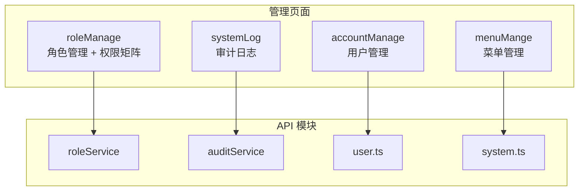

# YV-08-06: 系统管理模块 — 开发方案

> 来源 PRD：[06-prd-系统管理模块.md](../../prds/2026-08/06-prd-系统管理模块.md)
> 需求编号：YV-08-06 · 优先级：P0 · 人天：4.0d

---

## 一、方案概述

系统管理模块提供 RBAC 权限管理的完整管理面：用户管理、角色管理（含权限矩阵）、菜单管理、审计日志四大功能，仅 `admin` 角色可访问。



---

## 二、文件清单

| 文件 | 类型 | 职责 |
|------|------|------|
| `src/api/modules/roleService.ts` | 新增 | 角色 CRUD |
| `src/api/modules/auditService.ts` | 新增 | 审计日志查询 |
| `src/api/modules/system.ts` | 新增 | 菜单/部门/字典管理 |
| `src/views/system/roleManage/index.vue` | 新增 | 角色管理页 |
| `src/views/system/roleManage/components/PermissionMatrix.vue` | 新增 | 权限矩阵组件 |
| `src/views/system/accountManage/index.vue` | 新增 | 用户管理页 |
| `src/views/system/menuMange/index.vue` | 新增 | 菜单管理页 |
| `src/views/system/systemLog/index.vue` | 新增 | 审计日志页 |

---

## 三、模块设计

### 3.1 权限矩阵 — PermissionMatrix

按模块分组渲染 16 个权限码，支持全选/取消全选，v-model 双向绑定角色权限数组：

```typescript
// 7 个模块分组
const PERMISSION_MODULES = [
  { module: "project", label: "项目管理", permissions: ["project:view","project:create","project:edit","project:delete"] },
  { module: "knowledge", label: "知识库", permissions: ["knowledge:view","knowledge:create","knowledge:edit","knowledge:delete"] },
  { module: "data", label: "数据服务", permissions: ["data:view","data:export"] },
  { module: "chat", label: "AI 对话", permissions: ["chat:view","chat:create"] },
  { module: "user", label: "用户管理", permissions: ["user:manage"] },
  { module: "role", label: "角色管理", permissions: ["role:manage"] },
  { module: "audit", label: "审计日志", permissions: ["audit:view","audit:export"] },
];
```

**设计要点：**
- `el-table` 按模块分组，`rowspan` 跨行合并模块标签
- 全选 → `Object.values(PERMISSIONS)`，取消全选 → `[]`
- 变更通过 `update:modelValue` 上抛

### 3.2 角色管理 — roleManage

```typescript
// 删除角色前检查关联用户数
async function handleDelete(role: Role) {
  const { count } = await getRoleUserCount(role._id);
  if (count > 0) {
    ElMessage.warning(`该角色下有 ${count} 个用户，无法删除`);
    return;
  }
  await deleteRole({ cname: "roles", key: { _id: role._id } });
  refresh();
}
```

---

## 四、实施步骤

| 步骤 | 内容 | 验证 | 人天 |
|------|------|------|------|
| 1 | roleService + auditService + system API 模块 | Network 面板确认 RPC 信封正确 | 0.5 |
| 2 | 权限常量 (16 权限码 + 7 模块 + 5 角色矩阵) | PermissionCode 联合类型可推导 | 0.25 |
| 3 | PermissionMatrix + AssignRoleDialog 组件 | 全选后 modelValue 含 17 个权限码 | 0.75 |
| 4 | 4 个管理页面 (角色/用户/菜单/日志) | 每页 ProTable CRUD 正常 | 2.0 |
| 5 | 菜单注册 + 路由权限 | admin 用户可见系统管理菜单 | 0.25 |
| 6 | 键盘快捷键 (? 帮助 / / 搜索 / n 新建 / Esc) | 菜单管理页快捷键生效 | 0.25 |

**合计：4.0d**

---

## 五、完成定义（DoD）

- [ ] 8 个文件按 §2 清单落地
- [ ] 4 个管理页面 ProTable CRUD 正常
- [ ] PermissionMatrix 全选/逐项勾选/取消全选
- [ ] 角色删除前检查关联用户数
- [ ] 仅 admin 可访问系统管理菜单