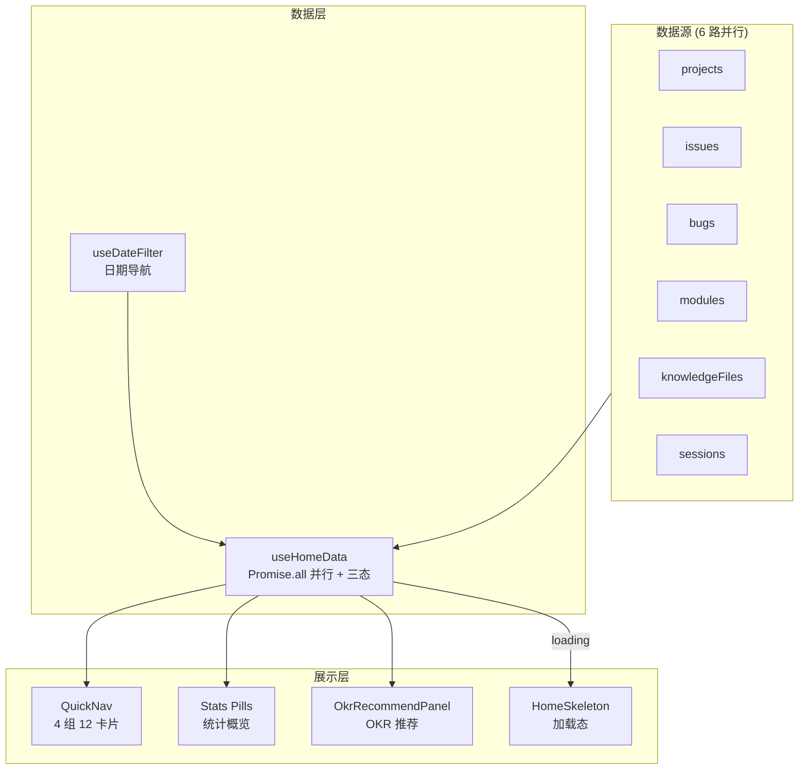

# YV-08-07: 首页仪表盘 — 开发方案

> 来源 PRD：[07-prd-首页仪表盘.md](../../prds/2026-08/07-prd-首页仪表盘.md)
> 需求编号：YV-08-07 · 优先级：P0 · 人天：3.0d

---

## 一、方案概述

### 1.1 架构定位

首页仪表盘是用户登录后的第一个页面，提供全局数据概览、快速导航入口和 OKR 推荐。它聚合来自多个 MongoDB 集合的数据，通过并行查询优化加载性能。



### 1.2 职责边界

| 组件 | 职责 | 明确不做 |
|------|------|---------|
| useHomeData | 6 路并行数据拉取 + 三态管理 | 不处理 UI 渲染 |
| QuickNav | 4 组导航卡片渲染 | 不拉取数据 |
| Stats Pills | 统计数字展示 + 点击跳转 | 不计算统计（由 useHomeData 提供） |
| OkrRecommendPanel | OKR 推荐 + 角色/项目筛选 | 不管理 OKR 数据源 |

---

## 二、文件清单

| 文件 | 类型 | 职责 |
|------|------|------|
| `src/hooks/useHomeData.ts` | 新增 | 6 路并行查询 + loading/error/data 三态 |
| `src/views/home/components/QuickNav.vue` | 新增 | 快速导航卡片 |
| `src/views/home/components/StatsPills.vue` | 新增 | 统计概览 |
| `src/views/home/components/HomeSkeleton.vue` | 新增 | 骨架屏加载态 |
| `src/views/home/index.vue` | 新增 | 首页编排 |

---

## 三、模块设计

### 3.1 useHomeData — 6 路并行查询

```typescript
export function useHomeData(selectedProjects: Ref<string[]>) {
  const loading = ref(true);
  const error = ref<Error | null>(null);

  const projects = ref<Project[]>([]);
  const issues = ref<Issue[]>([]);
  const bugs = ref<Bug[]>([]);
  const modules = ref<Module[]>([]);
  const knowledgeFiles = ref<KnowledgeFile[]>([]);
  const sessions = ref<Session[]>([]);

  // 统计数据（派生）
  const stats = computed(() => ({
    totalProjects: projects.value.length,
    activeIssues: issues.value.filter(i => i.status !== "done").length,
    openBugs: bugs.value.filter(b => b.status === "open").length,
    totalModules: modules.value.length,
    knowledgeCount: knowledgeFiles.value.length,
    activeSessions: sessions.value.filter(s => s.updatedAt > recentThreshold).length,
  }));

  async function refresh() {
    loading.value = true;
    error.value = null;
    try {
      const filter = selectedProjects.value.length
        ? { project: { $in: selectedProjects.value } }
        : {};

      [projects.value, issues.value, bugs.value, modules.value,
       knowledgeFiles.value, sessions.value] = await Promise.all([
        queryDocuments({ cname: "projects", filter }),
        queryDocuments({ cname: "issues", filter }),
        queryDocuments({ cname: "bugs", filter }),
        queryDocuments({ cname: "modules", filter }),
        queryDocuments({ cname: "knowledge_files", filter: { status: "active" } }),
        queryDocuments({ cname: "sessions", filter: { ...filter, pageSize: 50 } }),
      ]);
    } catch (e) {
      error.value = e as Error;
    } finally {
      loading.value = false;
    }
  }

  return { loading, error, projects, issues, bugs, modules, knowledgeFiles, sessions, stats, refresh };
}
```

**设计要点：**
- `Promise.all` 并行查询 6 个集合，减少串行等待时间
- 三态渲染：loading（骨架屏）→ error（错误提示+重试）→ data（正常内容）
- `selectedProjects` 变化时自动 `refresh`（watch 驱动）

### 3.2 QuickNav — 快速导航

4 组 12 个导航卡片：
- **项目管理**：项目列表、新增项目、需求看板、路线图
- **质量管理**：Bug 看板、模块管理、代码健康
- **知识协作**：AI 聊天、知识库、RAG 检索、RSS 内容
- **系统工具**：全局搜索、系统管理

每个卡片显示：图标 + 标题 + 描述 + 计数 badge（如有待处理项）

### 3.3 三态渲染

```vue
<template>
  <!-- 加载态 -->
  <HomeSkeleton v-if="loading" />

  <!-- 错误态 -->
  <div v-else-if="error" class="home-error">
    <p>{{ $t("home.error.loadFailed") }}</p>
    <el-button @click="refresh">{{ $t("common.retry") }}</el-button>
  </div>

  <!-- 数据态 -->
  <div v-else class="home-content">
    <StatsPills :stats="stats" />
    <QuickNav :stats="stats" />
    <OkrRecommendPanel :projects="projects" />
  </div>
</template>
```

---

## 四、实施步骤与验证

| 步骤 | 内容 | 涉及文件 | 验证方式 | 人天 |
|------|------|---------|---------|------|
| 1 | useHomeData 6 路并行查询 | `hooks/useHomeData.ts` | Network 面板显示 6 个请求并行 | 0.5 |
| 2 | QuickNav + StatsPills 组件 | `QuickNav.vue`, `StatsPills.vue` | 12 个卡片渲染，统计数字正确 | 0.75 |
| 3 | HomeSkeleton 加载态 | `HomeSkeleton.vue` | 加载中显示骨架屏，加载完切换 | 0.5 |
| 4 | 首页编排 + 三态渲染 | `home/index.vue` | loading/error/data 三态完整 | 0.5 |
| 5 | i18n + 响应式适配 | 各组件 | 中英切换正常，3 断点 grid 适配 | 0.5 |
| 6 | OkrRecommendPanel 集成 | 首页编排 | 角色/项目筛选 + 日期联动 | 0.25 |

**合计：3.0d**

### 验证检查点

| 步骤 | 验证项 | 通过标准 |
|------|--------|---------|
| 1 | 并行查询 | 6 个 Network 请求同时发出，首页加载 < 2s |
| 2 | 导航卡片 | 12 个卡片渲染，点击跳转正确 |
| 3 | 三态 | 模拟 API 失败 → 错误态 + 重试按钮可用 |

---

## 五、边缘场景

| 场景 | 处理策略 |
|------|---------|
| API 部分失败 | `Promise.all` 任一失败 → 整体进错误态 |
| 空数据 | 统计卡片显示 0，非空白 |
| 大量项目时筛选 | URL query → `selectedProjects` 过滤 |

---

## 六、完成定义（DoD）

- [ ] 5 个文件按 §2 清单落地
- [ ] 首页三态渲染完整（loading/error/data）
- [ ] 12 个导航卡片点击跳转正确
- [ ] 统计数据与实际集合数据一致
- [ ] `vue-tsc --noEmit` 通过