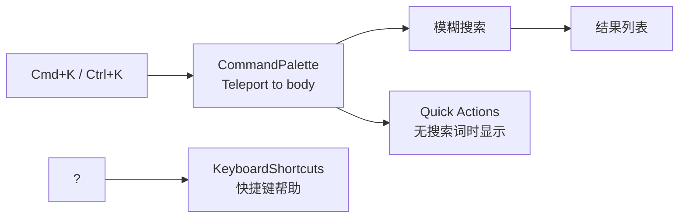

# YV-08-08: 命令面板与键盘快捷键 — 开发方案

> 来源 PRD：[08-prd-命令面板与键盘快捷键.md](../../prds/2026-08/08-prd-命令面板与键盘快捷键.md)
> 需求编号：YV-08-08 · 优先级：P1 · 人天：1.5d

---

## 一、方案概述

命令面板提供 Cmd+K 全局快速导航，支持模糊搜索项目/Issue/页面，以及 5 个 Quick Actions。键盘快捷键系统统一管理全局快捷键。



---

## 二、文件清单

| 文件 | 类型 | 职责 |
|------|------|------|
| `src/components/CommandPalette/index.vue` | 新增 | 命令面板主组件 |
| `src/components/KeyboardShortcuts/index.vue` | 新增 | 快捷键帮助面板 |
| `src/hooks/useCommandPalette.ts` | 新增 | 搜索索引 + 键盘导航 |

---

## 三、模块设计

### 3.1 CommandPalette

```vue
<script setup lang="ts">
// Teleport to body，避免 z-index 被父元素限制
// 200ms 防抖搜索
// 键盘导航：↑↓ 选择、Enter 执行、Esc 关闭

const visible = ref(false);
const query = ref("");
const activeIndex = ref(0);

// 搜索源：项目 + Issue + 页面路由
const searchIndex = computed(() => [
  ...projects.value.map(p => ({ type: "project", label: p.name, path: `/project/${p.id}` })),
  ...issues.value.map(i => ({ type: "issue", label: i.title, path: `/issue/${i.id}` })),
  ...staticRoutes.map(r => ({ type: "page", label: r.meta.title, path: r.path })),
]);

const filtered = computed(() =>
  query.value
    ? searchIndex.value.filter(item => fuzzyMatch(item.label, query.value))
    : []  // 空查询 → 显示 Quick Actions
);
</script>
```

### 3.2 Quick Actions（无搜索词时显示）

| 操作 | 快捷键 | 说明 |
|------|--------|------|
| 新建项目 | Cmd+N | 跳转新建项目页 |
| 全局搜索 | Cmd+K | 聚焦搜索框 |
| AI 聊天 | Cmd+J | 跳转 AI 聊天 |
| 知识库 | Cmd+B | 跳转知识库 |
| 系统设置 | Cmd+, | 跳转设置 |

### 3.3 全局键盘监听

```typescript
// App.vue 中注册
onMounted(() => {
  document.addEventListener("keydown", (e) => {
    const isMeta = e.metaKey || e.ctrlKey;
    if (isMeta && e.key === "k") { e.preventDefault(); showCommandPalette(); }
    if (e.key === "?" && !isInputFocused()) { showShortcuts(); }
    if (e.key === "Escape") { closeAll(); }
  });
});
```

---

## 四、实施步骤

| 步骤 | 内容 | 验证 | 人天 |
|------|------|------|------|
| 1 | CommandPalette 组件（Teleport + 遮罩 + 输入） | Cmd+K 打开，搜索过滤 | 0.75 |
| 2 | Quick Actions（5 个操作 + 图标/快捷键/颜色） | 无搜索词时显示 Quick Actions | 0.25 |
| 3 | KeyboardShortcuts 帮助面板 | ? 打开快捷键列表 | 0.25 |
| 4 | App.vue 全局键盘监听 | 任意页面 Cmd+K / ? / Esc 生效 | 0.25 |

**合计：1.5d**

---

## 五、边缘场景

| 场景 | 处理 |
|------|------|
| 输入框内按 Cmd+K | 不触发命令面板（`isInputFocused` 检查） |
| 弹窗打开时快捷键 | 弹窗优先，命令面板不抢焦点 |
| 无匹配结果 | 「未找到结果」提示 |
| Esc 关闭 | 同时清除搜索词和选中状态 |

---

## 六、完成定义（DoD）

- [ ] 3 个文件按 §2 清单落地
- [ ] Cmd+K 全局打开命令面板
- [ ] 模糊搜索正确过滤结果
- [ ] ↑↓Enter 键盘导航，Esc 关闭
- [ ] Quick Actions 点击跳转正确