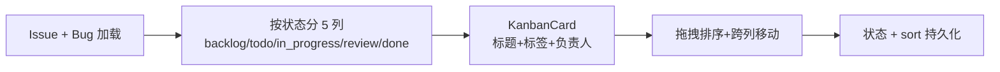

# YV-08-09: Kanban 看板 — 开发方案

> 来源 PRD：[09-prd-Kanban看板.md](../../prds/2026-08/09-prd-Kanban看板.md)
> 需求编号：YV-08-09 · 优先级：P1 · 人天：2.0d

---

## 一、方案概述

Kanban 以泳道视图展示 Issue/Bug 状态流转，支持拖拽排序和跨列移动。



---

## 二、模块设计

### 2.1 按状态分列

```typescript
const columns = computed(() =>
  ["backlog", "todo", "in_progress", "review", "done"].map(status => ({
    status,
    items: items.value.filter(i => i.status === status),
  }))
);
```

### 2.2 拖拽处理

```typescript
async function handleDragEnd(col: KanbanColumn) {
  await Promise.all(col.items.map((item, i) =>
    updateDocument({ cname: item.type === "issue" ? "issues" : "bugs", key: { _id: item._id }, data: { status: col.status, sort: i } })
  ));
}
```

---

## 三、实施步骤

| 步骤 | 内容 | 验证 | 人天 |
|------|------|------|------|
| 1 | 数据加载 + 5 列渲染 | 列渲染正确，卡片内容完整 | 0.5 |
| 2 | KanbanCard 组件 | 标题/标签/负责人正确 | 0.5 |
| 3 | 拖拽 + 跨列移动 | 拖拽后状态和 sort 更新 | 0.5 |
| 4 | 筛选 + 搜索 + 空状态 | 类型/项目筛选生效 | 0.5 |

**合计：2.0d**

---

## 四、完成定义（DoD）

- [ ] 5 列渲染，卡片内容正确
- [ ] 拖拽跨列移动后状态即时更新
- [ ] sort 字段持久化