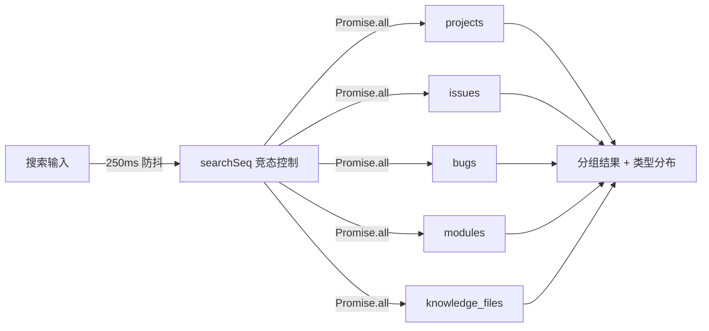

# YV-08-10: 全局搜索 — 开发方案

> 来源 PRD：[10-prd-全局搜索.md](../../prds/2026-08/10-prd-全局搜索.md)
> 需求编号：YV-08-10 · 优先级：P1 · 人天：2.0d

---

## 一、方案概述

全局搜索跨 7 个 MongoDB 集合（projects/issues/bugs/modules/knowledge_files/sessions/users）执行并行全文检索，250ms 防抖 + 竞态控制，结果按类型分组展示。



---

## 二、文件清单

| 文件 | 类型 | 职责 |
|------|------|------|
| `src/api/modules/searchService.ts` | 新增 | 7 集合并行搜索 |
| `src/views/search/index.vue` | 新增 | 搜索结果页 |
| `src/hooks/useSearch.ts` | 新增 | 搜索状态 + 竞态控制 |

---

## 三、模块设计

### 3.1 防抖 + 竞态控制

```typescript
// src/hooks/useSearch.ts
let searchSeq = 0;

export function useSearch() {
  const query = ref("");
  const results = ref<SearchResults>({});
  const loading = ref(false);

  // 防抖 250ms
  const debouncedSearch = useDebounceFn(async (q: string) => {
    const seq = ++searchSeq;  // 递增序列号
    loading.value = true;

    const data = await searchAll(q);
    // 竞态控制：仅最新一次搜索的结果生效
    if (seq === searchSeq) {
      results.value = data;
      loading.value = false;
    }
  }, 250);

  watch(query, (q) => { if (q.trim()) debouncedSearch(q); });
}
```

### 3.2 并集搜索

```typescript
async function searchAll(query: string) {
  const [projects, issues, bugs, modules, knowledge] = await Promise.all([
    queryDocuments({ cname: "projects", filter: { name: { $regex: query, $options: "i" } } }),
    queryDocuments({ cname: "issues", filter: { title: { $regex: query, $options: "i" } } }),
    queryDocuments({ cname: "bugs", filter: { title: { $regex: query, $options: "i" } } }),
    queryDocuments({ cname: "modules", filter: { name: { $regex: query, $options: "i" } } }),
    queryDocuments({ cname: "knowledge_files", filter: { title: { $regex: query, $options: "i" } } }),
  ]);
  return { projects, issues, bugs, modules, knowledge };
}
```

---

## 四、实施步骤

| 步骤 | 内容 | 验证 | 人天 |
|------|------|------|------|
| 1 | 搜索核心：防抖 + 竞态 + 并行查询 | 快速输入仅最后一次生效 | 0.75 |
| 2 | 结果展示：分组折叠 + 类型分布条 + Badge | 7 种类型正确分组，Badge 颜色正确 | 0.5 |
| 3 | 键盘导航：↑↓Enter + Ctrl+K 聚焦 | 键盘完整操作搜索→选择→导航 | 0.25 |
| 4 | URL 同步 + 搜索历史 | 刷新保留搜索词，历史跨会话 | 0.5 |

**合计：2.0d**

---

## 五、边缘场景

| 场景 | 处理 |
|------|------|
| 空查询 | 显示最近搜索 + 快速导航 |
| 无结果 | 空状态 + 建议 |
| 快速连续输入 | searchSeq 竞态控制，仅最后一次生效 |
| 集合查询失败 | 该类型显示「加载失败」，其他类型正常 |

---

## 六、完成定义（DoD）

- [ ] 3 个文件按 §2 清单落地
- [ ] 7 集合并行搜索，250ms 防抖
- [ ] 竞态控制正确（快速输入仅最后一次生效）
- [ ] 分组结果可折叠/筛选/排序