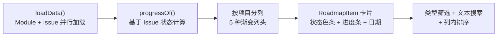

# YV-08-11: Roadmap 路线图 — 开发方案

> 来源 PRD：[11-prd-Roadmap路线图.md](../../prds/2026-08/11-prd-Roadmap路线图.md)
> 需求编号：YV-08-11 · 优先级：P1 · 人天：2.0d

---

## 一、方案概述

Roadmap 以甘特图风格展示多个项目的模块进度，按项目分列，每列显示 Module 卡片，卡片内展示进度条、状态色条、日期范围、逾期高亮。



---

## 二、文件清单

| 文件 | 职责 |
|------|------|
| `src/views/roadmap/index.vue` | Roadmap 主页面 |
| `src/views/roadmap/components/RoadmapItem.vue` | Module 卡片组件 |
| `src/hooks/useRoadmap.ts` | 数据加载 + 进度计算 + 筛选 |

---

## 三、模块设计

### 3.1 进度计算

```typescript
function progressOf(module: Module, issues: Issue[]): number {
  const moduleIssues = issues.filter(i => i.module === module.key);
  if (!moduleIssues.length) return 0;
  const done = moduleIssues.filter(i => i.status === "done").length;
  return Math.round((done / moduleIssues.length) * 100);
}
```

### 3.2 RoadmapItem 卡片

| 元素 | 说明 |
|------|------|
| 状态色条 | 左侧 4px 色条，active=绿/archived=灰 |
| 标题 | Module key + 类型 badge |
| 进度条 | `el-progress` 百分比 + Issue done/total |
| 日期 | 开始-结束日期范围 |
| 逾期高亮 | 红色边框（`due_date < today && status !== done`） |

### 3.3 右键菜单

```typescript
// Teleport + position:fixed + 全局点击关闭
const contextMenu = reactive({ visible: false, x: 0, y: 0, module: null });

function showContextMenu(e: MouseEvent, module: Module) {
  e.preventDefault();
  contextMenu.x = e.clientX;
  contextMenu.y = e.clientY;
  contextMenu.module = module;
  contextMenu.visible = true;
}
```

4 种快速状态切换：active / archived / done / cancelled

---

## 四、实施步骤

| 步骤 | 内容 | 验证 | 人天 |
|------|------|------|------|
| 1 | 数据加载 + 进度计算 + 按项目分列 | 多列渲染，进度条正确 | 0.5 |
| 2 | RoadmapItem 卡片 + 筛选排序 | 卡片字段完整，筛选生效 | 0.5 |
| 3 | 右键菜单 + Markdown 预览 | 右键菜单位置正确，状态切换即时 | 0.5 |
| 4 | 统计 Pills + 逾期高亮 + 空状态 | 统计正确，逾期红色边框 | 0.5 |

**合计：2.0d**

---

## 五、完成定义（DoD）

- [ ] 3 个文件按 §2 清单落地
- [ ] 多项目分列渲染，进度条正确
- [ ] 逾期 Module 红色边框高亮
- [ ] 右键菜单状态切换即时生效