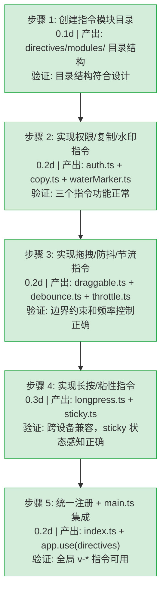

# YV-08-12: 自定义指令系统 — 8 个 Vue 3 指令的声明式行为增强 — 开发任务

> 来源 PRD：[12-prd-自定义指令系统.md](../prds/2026-08/12-prd-自定义指令系统.md)
> 需求编号：YV-08-12 · 优先级：P1 · 人天：1.0d

## 七、实施步骤

### 验证检查点

| 步骤 | 验证项 | 通过标准 |
|------|--------|----------|
| 步骤 2 | v-auth 权限控制 | 有权限显示，无权限 DOM 移除 |
| 步骤 2 | v-copy 复制 | 点击复制成功，ElMessage 提示 |
| 步骤 2 | v-waterMarker 水印 | 页面显示 Canvas 水印背景 |
| 步骤 3 | v-draggable 拖拽 | 元素在父容器内自由拖拽，不出边界 |
| 步骤 3 | v-debounce 防抖 | 快速点击 5 次，仅最后一次触发 |
| 步骤 3 | v-throttle 节流 | 快速点击 5 次，仅首次触发，1000ms 后恢复 |
| 步骤 4 | v-longpress 长按 | 按下 1000ms 触发，提前松开不触发 |
| 步骤 4 | v-sticky 粘性 | 滚动时 stuck 状态类正确切换 |

---
