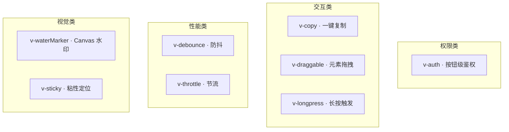

# YV-08-12: 自定义指令系统 — 开发方案

> 来源 PRD：[12-prd-自定义指令系统.md](../../prds/2026-08/12-prd-自定义指令系统.md)
> 需求编号：YV-08-12 · 优先级：P1 · 人天：1.0d

---

## 一、方案概述

8 个 Vue 3 自定义指令，提供声明式行为增强：权限控制、复制、水印、拖拽、防抖、节流、长按、粘性定位。



---

## 二、文件清单

| 文件 | 职责 |
|------|------|
| `src/directives/modules/auth.ts` | v-auth · 按钮权限 |
| `src/directives/modules/copy.ts` | v-copy · 点击复制 |
| `src/directives/modules/waterMarker.ts` | v-waterMarker · Canvas 水印 |
| `src/directives/modules/draggable.ts` | v-draggable · 拖拽 |
| `src/directives/modules/debounce.ts` | v-debounce · 防抖 |
| `src/directives/modules/throttle.ts` | v-throttle · 节流 |
| `src/directives/modules/longpress.ts` | v-longpress · 长按 |
| `src/directives/modules/sticky.ts` | v-sticky · 粘性定位 |
| `src/directives/index.ts` | 统一注册入口 |

---

## 三、模块设计

### 3.1 指令清单

| 指令 | 用法 | 核心实现 | 适用场景 |
|------|------|---------|---------|
| `v-auth` | `v-auth="'add'"` | `el.remove()` 物理移除 | 按钮权限控制 |
| `v-copy` | `v-copy="text"` | `navigator.clipboard.writeText` | 复制文本 |
| `v-waterMarker` | `v-waterMarker="{text:'水印'}"` | Canvas 绘制 + `background-image` | 页面水印 |
| `v-draggable` | `v-draggable` | `mousedown→mousemove→mouseup` 边界约束 | 弹窗拖拽 |
| `v-debounce` | `v-debounce:click="handle"` | 计时器防抖 | 提交按钮 |
| `v-throttle` | `v-throttle:click="handle"` | 时间戳节流 | 滚动加载 |
| `v-longpress` | `v-longpress="handle"` | 1000ms 按下触发 | 长按菜单 |
| `v-sticky` | `v-sticky` | IntersectionObserver + `position:sticky` | 表头固定 |

### 3.2 统一注册

```typescript
// src/directives/index.ts
import type { App } from "vue";
import auth from "./modules/auth";
import copy from "./modules/copy";
// ... 其余指令

const directives = { auth, copy, waterMarker, draggable, debounce, throttle, longpress, sticky };

export function setupDirectives(app: App) {
  Object.entries(directives).forEach(([name, directive]) => {
    app.directive(name, directive);
  });
}

// main.ts
import { setupDirectives } from "@/directives";
setupDirectives(app);
```

---

## 四、实施步骤

| 步骤 | 内容 | 验证 | 人天 |
|------|------|------|------|
| 1 | 目录结构 + 统一注册 | `app.directive(name, ...)` 生效 | 0.1 |
| 2 | v-auth / v-copy / v-waterMarker | 三个指令功能正常 | 0.2 |
| 3 | v-draggable / v-debounce / v-throttle | 边界约束 + 频率控制正确 | 0.2 |
| 4 | v-longpress / v-sticky | 跨设备兼容，sticky 状态感知 | 0.3 |
| 5 | main.ts 集成 + 全局可用 | 任意组件 `v-*` 可用 | 0.2 |

**合计：1.0d**

---

## 五、完成定义（DoD）

- [ ] 9 个文件按 §2 清单落地
- [ ] 8 个指令全局 `v-*` 可用
- [ ] v-auth 有权限显示、无权限 DOM 移除
- [ ] v-debounce 快速点击仅触发一次
- [ ] v-draggable 不超出父容器