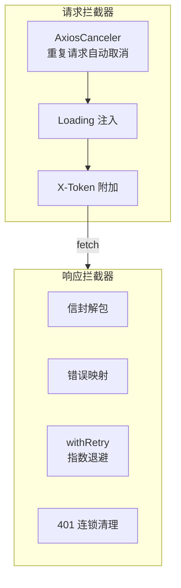

# YV-08-18: API 层架构增强 — 开发方案

> 来源 PRD：[13-prd-API层架构.md](../../prds/2026-08/13-prd-API层架构.md)
> 需求编号：YV-08-18 · 优先级：P1 · 人天：1.0d

---

## 一、方案概述

在已有 RequestHttp 基础上增强：请求取消防重复、指数退避重试、并发批处理、HTTP 状态码中文映射。



---

## 二、文件清单

| 文件 | 职责 |
|------|------|
| `src/api/helper/axiosCancel.ts` | 请求取消（防重复） |
| `src/api/helper/retry.ts` | 指数退避重试 |
| `src/api/helper/batch.ts` | 并发批处理 |
| `src/api/helper/checkStatus.ts` | HTTP 状态码中文映射 |

---

## 三、模块设计

### 3.1 请求取消

```typescript
// 同一请求在 pending 期间再次发起 → 取消前一个
const pendingMap = new Map<string, AbortController>();

export function addPending(config: AxiosRequestConfig) {
  const key = `${config.method}:${config.url}:${JSON.stringify(config.data)}`;
  pendingMap.get(key)?.abort();  // 取消前一个
  const controller = new AbortController();
  config.signal = controller.signal;
  pendingMap.set(key, controller);
}
```

### 3.2 指数退避重试

```typescript
async function withRetry<T>(fn: () => Promise<T>, maxRetries = 3): Promise<T> {
  for (let i = 0; i <= maxRetries; i++) {
    try {
      return await fn();
    } catch (err) {
      if (i === maxRetries) throw err;
      // 仅 502/503/网络错误重试，4xx 不重试
      if (err.response?.status < 500) throw err;
      await new Promise(r => setTimeout(r, Math.pow(2, i) * 1000)); // 1s→2s→4s
    }
  }
  throw new Error("unreachable");
}
```

### 3.3 HTTP 状态码映射

| 状态码 | 中文提示 |
|--------|---------|
| 400 | 请求参数错误 |
| 401 | 登录已过期，请重新登录 |
| 403 | 无权限访问 |
| 404 | 请求资源不存在 |
| 500 | 服务器内部错误 |
| 502 | 网关错误，正在重试... |
| 503 | 服务暂不可用 |

---

## 四、实施步骤

| 步骤 | 内容 | 验证 | 人天 |
|------|------|------|------|
| 1 | RequestHttp 基础封装 | get/post/put/delete 可用 | 0.2 |
| 2 | 请求拦截器链（取消+Loading+认证） | 重复请求被取消 | 0.2 |
| 3 | 响应拦截器链（错误映射+401） | 业务错误提示，401 重定向 | 0.2 |
| 4 | AxiosCanceler 防重复 | 快速点击，仅最后一个请求发出 | 0.1 |
| 5 | withRetry + batch 并发 | 502 自动重试，批量并发 | 0.2 |
| 6 | checkStatus 状态码映射 | 各状态码显示正确中文 | 0.1 |

**合计：1.0d**

---

## 五、完成定义（DoD）

- [ ] 4 个 helper 文件落地
- [ ] 重复请求自动取消
- [ ] 502/503 指数退避重试（最多 3 次）
- [ ] HTTP 状态码中文提示正确