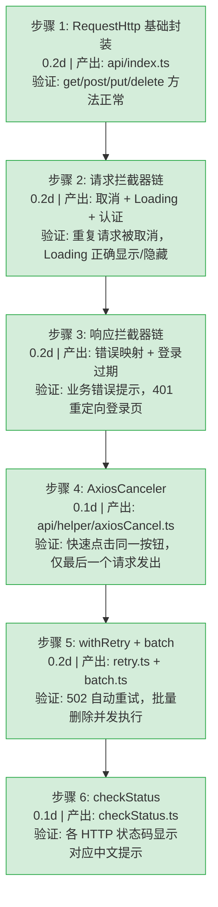

# YV-08-18: API 层架构 — RequestHttp 拦截器链 + 请求取消 + 指数退避重试 + 并发批处理 — 开发任务

> 来源 PRD：[13-prd-API层架构.md](../prds/2026-08/13-prd-API层架构.md)
> 需求编号：YV-08-18 · 优先级：P1 · 人天：1.0d

## 七、实施步骤

```mermaid
flowchart TD
  S1["步骤 1: RequestHttp 基础封装<br/>0.2d | 产出: api/index.ts<br/>验证: get/post/put/delete 方法正常"]
  S2["步骤 2: 请求拦截器链<br/>0.2d | 产出: 取消 + Loading + 认证<br/>验证: 重复请求被取消，Loading 正确显示/隐藏"]
  S3["步骤 3: 响应拦截器链<br/>0.2d | 产出: 错误映射 + 登录过期<br/>验证: 业务错误提示，401 重定向登录页"]
  S4["步骤 4: AxiosCanceler<br/>0.1d | 产出: api/helper/axiosCancel.ts<br/>验证: 快速点击同一按钮，仅最后一个请求发出"]
  S5["步骤 5: withRetry + batch<br/>0.2d | 产出: retry.ts + batch.ts<br/>验证: 502 自动重试，批量删除并发执行"]
  S6["步骤 6: checkStatus<br/>0.1d | 产出: checkStatus.ts<br/>验证: 各 HTTP 状态码显示对应中文提示"]

  S1 --> S2 --> S3 --> S4 --> S5 --> S6

  style S1 fill:#d4edda,stroke:#28a745
  style S2 fill:#d4edda,stroke:#28a745
  style S3 fill:#d4edda,stroke:#28a745
  style S4 fill:#d4edda,stroke:#28a745
  style S5 fill:#d4edda,stroke:#28a745
  style S6 fill:#d4edda,stroke:#28a745
```

---
