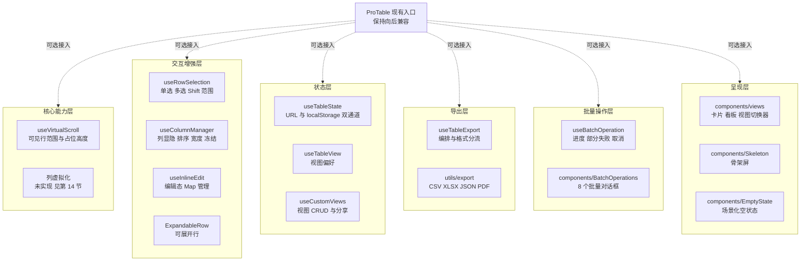
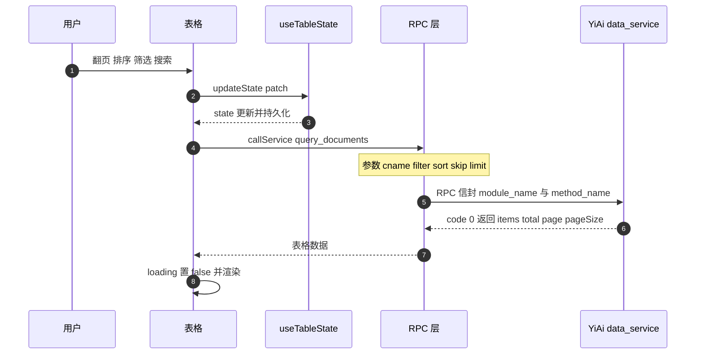
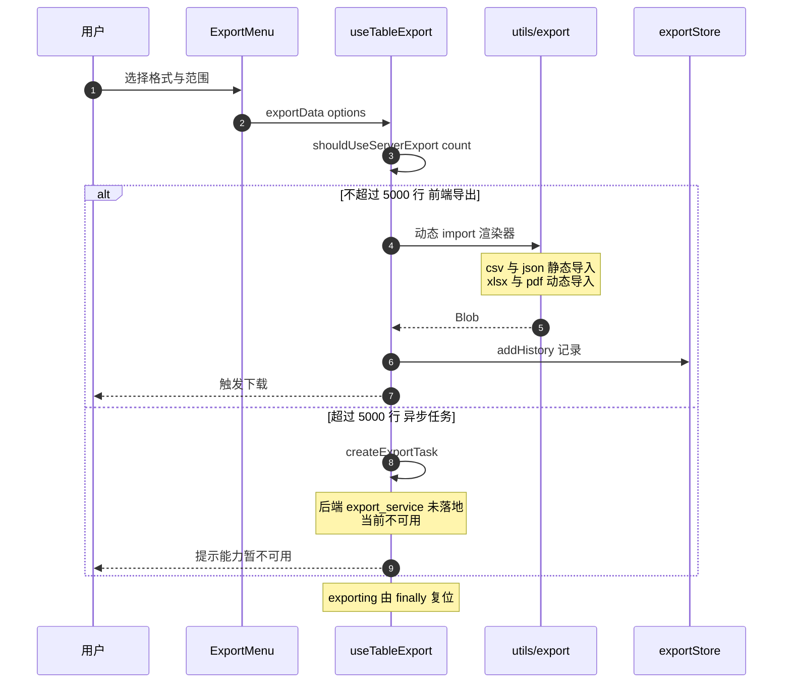
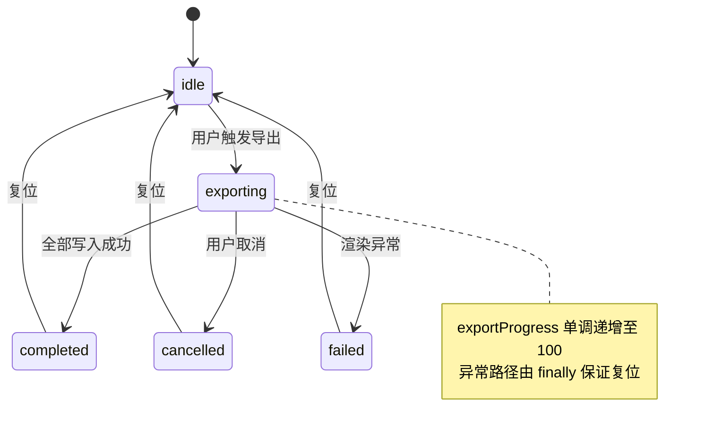
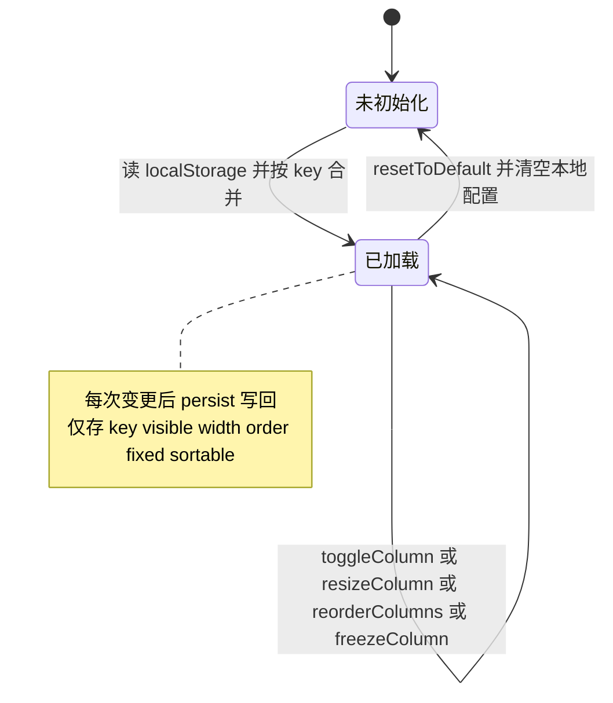
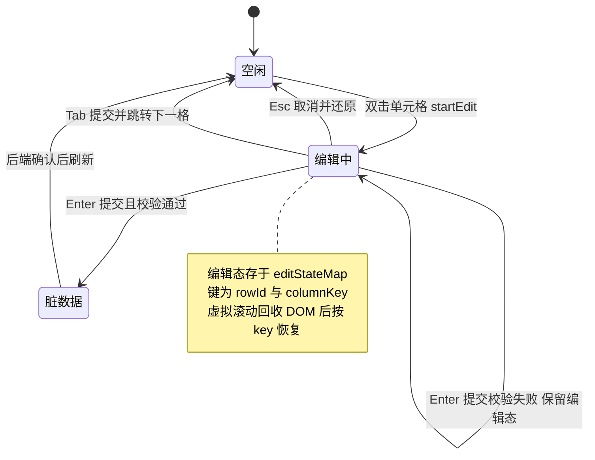
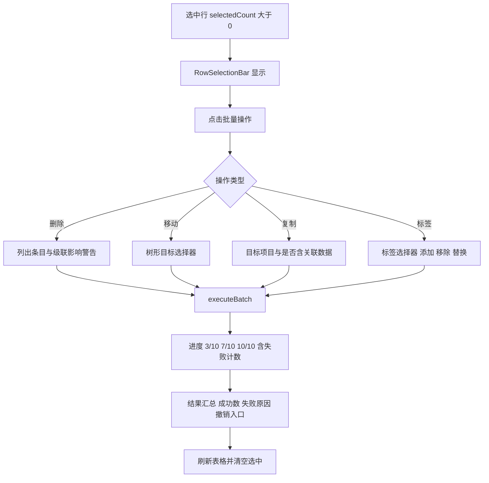

# 列表组件体系 — 开发方案

> 来源 PRD：[01-prd-列表组件体系.md](../../prds/2026-09/01-prd-列表组件体系.md)
> 需求编号：YV-09-M08 · 优先级：中 · 人天：9.0d
> 测试方案：[01-prd-test-列表组件体系.md](../../tests/2026-09/01-prd-test-列表组件体系.md)

> **文档职责**：本文档定义**怎么做、为什么这么做、实际做成什么样**（HOW），不含产品目标与测试用例。

---

## 目录

- [一、架构总览](#sec-1)
- [二、关键技术决策](#sec-2)
- [三、Composable 接口契约](#sec-3)
- [四、组件清单](#sec-4)
- [五、数据流与状态机](#sec-5)
- [六、虚拟滚动实现规格](#sec-6)
- [七、RPC 契约](#sec-7)
- [八、性能预算与体积控制](#sec-8)
- [九、实施路线图](#sec-9)
- [十、代码审查检查清单](#sec-10)
- [十一、技术风险与回归预测](#sec-11)
- [十二、开发环境与验证方式](#sec-12)
- [十三、实现完成记录](#sec-13)
- [十四、已知缺口与技术债](#sec-14)

---

<a id="sec-1"></a>
## 一、架构总览

### 1.1 分层结构



### 1.2 目录与文件清单

全部新增文件位于 `YiVad/src/`，遵循项目既有命名约定（hooks 而非 composables）。

```
YiVad/src/
├── hooks/                                    # 15 个新增 hook
│   ├── useVirtualScroll.ts                   # 行虚拟滚动（74 行）
│   ├── useRowSelection.ts                    # 行选择（79 行）
│   ├── useColumnManager.ts                   # 列管理（77 行）
│   ├── useTableState.ts                      # 状态持久化（76 行）
│   ├── useInlineEdit.ts                      # 行内编辑（98 行）
│   ├── useTableExport.ts                     # 导出编排（46 行）
│   ├── useBatchOperation.ts                  # 批量操作队列（60 行）
│   ├── useSkeleton.ts                        # 骨架屏时序（22 行）
│   ├── useTableView.ts                       # 视图偏好（20 行）
│   ├── useInfiniteScroll.ts                  # 无限滚动（39 行）
│   ├── useLazyLoad.ts                        # 懒加载（22 行）
│   ├── useConditionalFormat.ts               # 条件格式（37 行）
│   ├── useColumnCalculation.ts               # 列计算（33 行）
│   ├── useQuickFind.ts                       # 快速查找（91 行）
│   └── useCustomViews.ts                     # 自定义视图（71 行）
├── components/
│   ├── ProTable/components/                  # 10 个新增 + 3 个原有
│   │   ├── VirtualTableBody.vue              # 虚拟滚动表体
│   │   ├── ExpandableRow.vue                 # 可展开行
│   │   ├── InlineEditCell.vue                # 行内编辑单元格
│   │   ├── RowSelectionBar.vue               # 选中行操作栏
│   │   ├── TableToolbar.vue                  # 表格工具栏
│   │   ├── SortConfig.vue                    # 多字段排序配置
│   │   ├── FilterPanel.vue                   # 条件筛选面板
│   │   ├── AdvancedFilter.vue                # 高级筛选对话框
│   │   ├── PivotTable.vue                    # 数据透视表
│   │   ├── TreeTable.vue                     # 树形表格
│   │   └── (Pagination / ColSetting / TableColumn — 原有，未改动)
│   ├── export/          # 4：ExportMenu / ExportProgressDialog / ExportTemplateManager / ColumnMappingDialog
│   ├── Skeleton/        # 3：SkeletonTable / SkeletonList / SkeletonCard
│   ├── EmptyState/      # 3：EmptyState / EmptySearch / EmptyFilter
│   ├── RowActions/      # 3：RowActionMenu / ContextMenu / DetailSidebar
│   ├── BatchOperations/ # 8：BatchToolbar / BatchEditPanel / BatchMoveDialog / BatchDeleteDialog
│   │                    #    BatchCopyDialog / BatchTagDialog / BatchImportDialog / BatchMailDialog
│   ├── views/           # 3：ViewSwitcher / ViewCard / ViewKanban
│   └── tag/             # 3：TagManager / TagSelect / TagAdmin
├── stores/modules/
│   ├── export.ts                             # 导出模板 + 历史
│   ├── tableState.ts                         # 表格状态（消费 useTableState / useCustomViews）
│   └── tag.ts                                # 标签 CRUD + 计数 + 清理
├── utils/export/
│   ├── index.ts                              # 导出入口 + 公共函数
│   ├── csv.ts                                # CSV 渲染器（BOM + RFC 4180）
│   ├── xlsx.ts                               # Excel 渲染器（SheetJS 动态 import）
│   ├── json.ts                               # JSON 渲染器（美化 + 元数据）
│   ├── pdf.ts                                # PDF 渲染器（jsPDF + autotable）
│   └── types.ts                              # 导出类型定义
├── api/modules/
│   └── exportService.ts                      # 导出任务 RPC 封装
├── views/demo/                               # 11 个演示页 + 3 个共享
│   ├── TablesDemo / VirtualScrollDemo / ColumnsDemo / BatchDemo / ExportDemo
│   ├── InlineEditDemo / ViewsDemo / ConditionalFormatDemo / TreeTableDemo
│   ├── PivotDemo / FullDemo
│   └── shared/{DemoLayout.vue, MetricsPanel.vue, mockData.ts}
└── styles/
    ├── print.css                             # @media print
    └── skeleton.scss                         # 骨架屏动画 + 查找高亮
```

### 1.3 与 ProTable 的集成策略

**现状：ProTable 未接入新能力。** `src/components/ProTable/index.vue`（348 行）仍只依赖 `useTable` + `useSelection` 两个原有 hook，未引入本次任何新增 composable。

新能力的实际消费方目前仅为：

| 消费方 | 引用的能力 |
|--------|-----------|
| `views/demo/*`（11 个演示页） | 全部 15 个 hook（演示与集成验证用途） |
| `stores/modules/tableState.ts` | `useTableState`、`useCustomViews` |
| `components/ProTable/components/InlineEditCell.vue` | `useInlineEdit` 的类型 |
| `components/views/ViewCard.vue` | `useColumnManager` 的类型 |
| `components/views/ViewSwitcher.vue` | `useTableView` 的类型 |

**接入方式**：新能力按 opt-in 设计——页面按需引入对应 hook 与组件，未引入时列表行为与改造前完全一致。具体页面接入计划见 §十四。

---

<a id="sec-2"></a>
## 二、关键技术决策

### D-01：自实现虚拟滚动，而非引入第三方库

Element Plus `el-table` 的渲染机制特殊（固定列、合并单元格各需独立 DOM 层），`vue-virtual-scroller` / `@tanstack/vue-virtual` 均难以无缝适配其内部结构。自实现可与 `el-table` 分治协作，完全掌握渲染时机。

核心逻辑实测约 74 行，维护成本可控。

### D-02：默认固定行高 48px

固定行高使可见范围与占位高度均为 O(1) 计算，性能最优，覆盖绝大多数表格场景。动态行高需维护累计高度数组，复杂度与收益不匹配，列入技术债（§十四）而非本期实现。

### D-03：导出依赖全部动态 import

`xlsx`（约 400KB gzip）与 `jspdf` + `jspdf-autotable`（约 200KB）仅在用户点击对应格式时加载，首屏增量归零。`useTableExport` 在 `import()` 外层包裹 try-catch，加载失败时降级为 CSV，保证导出功能不因网络或内网代理限制而完全不可用。

### D-04：表格状态 URL 优先于 localStorage

URL 参数可分享、可书签，因此优先级更高；localStorage 承担默认值角色。复杂筛选（如多选 50+ 项）体积过大不适合写入 URL，仅存 localStorage。

### D-05：`hooks/` 而非 `composables/`

项目既有 65 个 hook 全部位于 `src/hooks/`，新增 composable 沿用该约定以保持一致，不新设目录。

### D-06：导出 > 5000 行走异步任务而非前端渲染

前端渲染 10K+ 行会长时间阻塞主线程。`useTableExport.shouldUseServerExport(count)` 以 5000 为阈值判定，超过则走 YiAi 异步导出任务（契约见 §七），前端转为轮询任务状态并展示进度。

### D-07：行内编辑状态存入独立 Map 而非组件内

虚拟滚动会回收 DOM，若编辑态保存在组件内则滚回后丢失。`useInlineEdit` 以 `${rowId}:${columnKey}` 为键集中管理编辑态，DOM 重建后按 key 恢复。

---

<a id="sec-3"></a>
## 三、Composable 接口契约

### 3.1 `useVirtualScroll`

```typescript
interface VirtualScrollOptions {
  containerRef: Ref<HTMLElement | null> | ShallowRef<HTMLElement | null>;
  totalRows: Ref<number> | number;
  rowHeight?: number;   // 默认 48
  overscan?: number;    // 默认 5
}

interface VisibleRange { start: number; end: number; offsetTop: number; }

function useVirtualScroll(options: VirtualScrollOptions): {
  visibleRange: ComputedRef<VisibleRange>;
  totalHeight: ComputedRef<number>;   // totalRows × rowHeight
  scrollTop: Ref<number>;
  scrollToIndex: (index: number) => void;
}
```

**要点**：`scroll` 监听为 `passive: true` 并以 `requestAnimationFrame` 合并；`ResizeObserver` 监听容器尺寸变化自动重算；容器为 `null` 时 `onMounted` 静默跳过，`scrollToIndex` 通过可选链静默失败。

### 3.2 `useColumnManager`

```typescript
interface ColumnConfig {
  key: string; label: string; visible: boolean;
  width?: number; minWidth?: number; order: number;
  fixed?: "left" | "right"; sortable?: boolean;
}

function useColumnManager(storageKey: string, defaultColumns: ColumnConfig[]): {
  columns: Ref<ColumnConfig[]>;
  visibleColumns: ComputedRef<ColumnConfig[]>;   // filter(visible).sort(order)
  toggleColumn: (key: string) => void;
  resizeColumn: (key: string, width: number) => void;   // 受 minWidth 约束，默认下限 50
  reorderColumns: (from: number, to: number) => void;   // 重排后统一重编号 order
  freezeColumn: (key: string, fixed?: "left" | "right") => void;
  resetToDefault: () => void;
  showAll: () => void;
  hideAll: () => void;
}
```

**持久化**：localStorage key 为 `yivad-columns-{storageKey}`。加载时按 `key` 合并——已保存列的字段覆盖默认列，默认列中新增的列自动出现。写入时仅持久化 `key/visible/width/order/fixed/sortable`，不带 `label` 等展示字段，避免污染存储。`JSON.parse` 由 try-catch 包裹，损坏数据回退默认列。

### 3.3 `useTableExport`

```typescript
function useTableExport(): {
  exporting: Ref<boolean>;
  exportProgress: Ref<number>;
  exportData: (options: ExportOptions) => Promise<void>;
  shouldUseServerExport: (count: number) => boolean;   // count > 5000
}
```

**分流**：`csv` / `json` 静态导入即时导出；`xlsx` / `pdf` 动态 `import()`，失败降级为 CSV。`exporting` 与 `exportProgress` 由 `finally` 保证复位，异常不外抛。

### 3.4 `useTableState`

```typescript
function useTableState(storageKey: string, defaults: TableState): {
  state: Ref<TableState>;
  restore: () => void;         // URL > localStorage > defaults
  updateState: (patch: Partial<TableState>) => void;
  resetState: () => void;
}
```

**恢复优先级**：URL 参数 > localStorage > 默认值。写入 URL 时默认值不落参（如 `pageNum=1` 不产生 `page=1`），保持 URL 干净。

### 3.5 `useInlineEdit`

```typescript
function useInlineEdit(): {
  editingCell: Ref<EditingCell | null>;   // { rowId, columnKey, originalValue, currentValue }
  editStateMap: Map<string, EditingCell>; // key: `${rowId}:${columnKey}`
  dirtyRows: Ref<Set<string>>;
  startEdit: (rowId: string, columnKey: string, value: unknown) => void;
  commitEdit: () => string | null;        // 返回校验错误信息，null 表示成功
  cancelEdit: () => void;
  moveToNextCell: (direction: 1 | -1) => void;
  isDirty: (rowId: string) => boolean;
  clearDirty: (rowId: string) => void;
}
```

**提交语义**：值未变化时不标记 dirty；校验失败时返回错误信息并保持编辑态。

### 3.6 `useBatchOperation`

```typescript
interface BatchProgress {
  status: "idle" | "processing" | "completed" | "cancelled" | "failed";
  total: number; completed: number; failed: number;
  failedItems: Array<{ item: unknown; reason: string }>;
}

function useBatchOperation(): {
  progress: Ref<BatchProgress>;
  isProcessing: ComputedRef<boolean>;
  progressPercent: ComputedRef<number>;
  executeBatch: <T>(items: T[], op: (item: T) => Promise<void>, getId: (item: T) => string) => Promise<void>;
  cancel: () => void;
  resetProgress: () => void;
}
```

**错误处理策略**：

| 场景 | 策略 |
|------|------|
| 单个项失败 | 不中断，记入 `failedItems` 后继续 |
| 全部失败 | 处理完所有项后汇总，`status = 'failed'` |
| 用户取消 | 停止后续项，`status = 'cancelled'`，已完成项不回滚 |
| 权限不足 | 计入失败原因，汇报跳过条目数 |

### 3.7 其余 composable

| Composable | 签名要点 |
|-----------|---------|
| `useSkeleton(minDisplayMs = 300, delayMs = 100)` | `visible` / `show()` / `hide()`；延迟显示避免快速加载闪烁 |
| `useTableView(storageKey, defaultView)` | `currentView` / `switchView()`；存储 key `yivad-view-*` |
| `useInfiniteScroll(loadMore, options)` | `loading` / `finished` / `error` / `reset()` / `setFinished()`；`loading` 或 `finished` 时不再触发 |
| `useLazyLoad(options)` | `visible`；进入视口后一次性触发并 `disconnect()` |
| `useConditionalFormat()` | `rules` / `sortedRules`（按 priority 升序）/ `addRule` / `updateRule` / `removeRule` / `clearRules` / `getCellStyle(row, column)` |
| `useColumnCalculation()` | 由 `data` + `calcs` 生成 `footerData`，键名形如 `__calc_{column}_{func}`；null 值过滤，全空返回空串 |
| `useQuickFind()` | `visible` / `keyword` / `matchCase` / `useRegex` / `scopeColumn` / `matches` / `currentMatch` / `nextMatch` / `prevMatch` / `highlight(text)` / `statusText` |
| `useCustomViews(storageKey)` | `views` / `activeViewId` / `saveView` / `activateView` / `setDefaultView` / `deleteView` / `getShareUrl()` |

---

<a id="sec-4"></a>
## 四、组件清单

| 组件 | 职责 | 关键 props / 行为 |
|------|------|-------------------|
| `VirtualTableBody.vue` | 虚拟滚动表体 | 接收 `visibleRange` 与 `offsetTop`，以占位元素模拟滚动高度 |
| `ExpandableRow.vue` | 可展开行 | 展开内容插槽；展开状态独立于虚拟滚动 |
| `InlineEditCell.vue` | 行内编辑单元格 | 按 `EditorType` 渲染编辑器；Enter 提交、Esc 取消、Tab 导航 |
| `RowSelectionBar.vue` | 选中行操作栏 | 选中数 > 0 时显示；含"取消选择"入口 |
| `TableToolbar.vue` | 表格工具栏 | 刷新 / 导出 / 列设置入口 |
| `SortConfig.vue` | 多字段排序配置 | 字段拖拽排序、独立升降序、预设保存 |
| `FilterPanel.vue` | 条件筛选面板 | AND / OR 组合，11 种运算符，按字段类型过滤可选运算符 |
| `AdvancedFilter.vue` | 高级筛选对话框 | 可视化编辑、结果行数实时预览、条件导入导出 |
| `TreeTable.vue` | 树形表格 | 懒加载子节点、缩进引导线、子树全选、拖拽调整层级 |
| `PivotTable.vue` | 数据透视表 | 行 / 列 / 值字段配置，聚合切换，总计行列，下钻明细 |
| `ExportMenu.vue` | 导出格式菜单 | CSV / Excel / JSON / PDF 选择，范围选择 |
| `ExportProgressDialog.vue` | 导出进度对话框 | 百分比 + 已接收行数；支持取消 |
| `ExportTemplateManager.vue` | 导出模板管理 | 模板 CRUD 与应用 |
| `ColumnMappingDialog.vue` | 列映射配置 | 源列 → 目标字段映射，映射模板保存 |
| `BatchToolbar.vue` | 批量操作浮动工具栏 | 显示选中数量与批量操作入口 |
| `BatchEditPanel.vue` | 批量编辑面板 | 多字段编辑、查找替换、变更预览 |
| `BatchMoveDialog.vue` | 批量移动 | 树形目标选择，循环移动校验 |
| `BatchDeleteDialog.vue` | 批量删除确认 | 列出待删条目、级联警告、软删除选项 |
| `BatchCopyDialog.vue` | 批量复制 | 目标项目选择、是否含关联数据 |
| `BatchTagDialog.vue` | 批量标签 | 标签选择器，添加 / 移除 / 替换 |
| `BatchImportDialog.vue` | 批量导入 | 上传 → 映射 → 预览 → 校验报告 → 执行 |
| `BatchMailDialog.vue` | 批量邮件 | 模板编辑器、合并字段、逐收件人预览 |
| `ViewSwitcher.vue` | 视图切换器 | 六种视图切换，图标按钮组 |
| `ViewCard.vue` / `ViewKanban.vue` | 卡片 / 看板视图 | 共享 `data` + `columns` + `loading` 接口 |
| `Skeleton*`（3） | 骨架屏 | 表格 / 列表 / 卡片三种形态 |
| `EmptyState` / `EmptySearch` / `EmptyFilter` | 空状态 | 场景化插画 + 标题 + 引导行动 |
| `RowActionMenu.vue` | 行操作菜单 | 悬浮显示常用操作，"…"折叠其余 |
| `ContextMenu.vue` | 右键菜单 | Teleport 渲染，上下文相关操作项 |
| `DetailSidebar.vue` | 详情侧边栏 | 320–800px 可拖拽，上一条 / 下一条导航 |
| `TagManager` / `TagSelect` / `TagAdmin` | 标签管理 | 标签 CRUD、选择器、后台管理 |

**视图组件统一接口**：

```typescript
interface ViewComponentProps {
  data: Record<string, any>[];
  columns: ColumnConfig[];
  loading: boolean;
  emptyConfig?: EmptyStateConfig;
  viewConfig?: Record<string, any>;
  onRowClick?: (row: Record<string, any>) => void;
  selection?: SelectionState;
}
```

---

<a id="sec-5"></a>
## 五、数据流与状态机

### 5.1 表格数据流



### 5.2 导出数据流



**渲染器与加载方式**

| 格式 | 渲染器 | 加载方式 | 失败降级 |
|------|--------|---------|---------|
| CSV | `renderCSV()` | 静态导入 | — |
| JSON | `renderJSON()` | 静态导入 | — |
| XLSX | SheetJS | 动态 `import('@/utils/export/xlsx')` | 降级 CSV |
| PDF | jsPDF + autotable | 动态 `import('@/utils/export/pdf')` | 降级 CSV |

**导出进度状态机**



### 5.3 列管理器状态流转



### 5.4 行内编辑生命周期

**编辑状态机**



**编辑器类型映射**（对应 FR-6.2）

| 列类型 | 编辑器 | 提交时机 |
|--------|--------|---------|
| `text` | `el-input` | Enter |
| `number` | `el-input-number` | Enter |
| `select` | `el-select` | Enter |
| `date` | `el-date-picker`（`YYYY-MM-DD`） | Enter |
| `datetime` | `el-date-picker` `type="datetime"`（ISO 8601） | Enter |
| `tag` | `TagSelect`（多选 + 新建） | Enter |
| `user` | 用户选择器 | Enter |
| `textarea` | `el-input` `type="textarea"`（自动高度） | Enter |
| `boolean` | `el-switch` | 即时 |
| `color` | `el-color-picker` | 即时 |

### 5.5 批量操作执行流程



---

<a id="sec-6"></a>
## 六、虚拟滚动实现规格

### 6.1 核心算法

固定行高模式下全部为 O(1) 计算：

```
startIndex  = max(0, floor(scrollTop / rowHeight) - overscan)
visibleCount = ceil(viewportHeight / rowHeight)
endIndex    = min(totalRows, startIndex + visibleCount + overscan * 2)
offsetTop   = startIndex * rowHeight        // 上方占位高度
totalHeight = totalRows * rowHeight         // 滚动条总高度
```

渲染结构：

```
┌─────────────────────────────────────────┐
│ 滚动容器（总高度 = totalHeight）          │
│  ┌──────────┐                           │
│  │ 上方占位  │ height = offsetTop         │
│  ├──────────┤                           │
│  │ 可见区域  │ 实际渲染 end-start 行       │
│  ├──────────┤                           │
│  │ 下方占位  │ height = 剩余高度           │
│  └──────────┘                           │
└─────────────────────────────────────────┘
```

### 6.2 性能保障措施

| 措施 | 实现 |
|------|------|
| 滚动节流 | `requestAnimationFrame` 合并，同一帧内多次 `scroll` 只取最后一次位置 |
| 监听开销 | `scroll` 使用 `passive: true`，不阻塞合成线程 |
| 容器自适应 | `ResizeObserver` 监听容器，尺寸变化时重算 `viewportHeight` |
| 资源释放 | `onBeforeUnmount` 中移除监听、`disconnect()` ResizeObserver、`cancelAnimationFrame` |

### 6.3 与 `el-table` 的集成要点

| 挑战 | 处理方式 |
|------|---------|
| el-table 内部渲染全部行 | 以 `VirtualTableBody` 替换 `<tbody>`，只渲染可见行 |
| 固定列使用独立 DOM 层 | 固定列与非固定列分别计算偏移，靠 CSS `transform` 对齐 |
| 合并单元格 `rowspan` / `colspan` | 合并单元格所在行加入"保持"列表，不参与回收 |
| 行选中状态 | 由 `useRowSelection.selectedIds` Set 独立管理，渲染时按 id 恢复 |
| 树形展开状态 | 由独立 `expandedKeys` Set 管理，折叠节点不计入 `totalRows` |
| 行内编辑状态 | 由 `useInlineEdit.editStateMap` 按 `${rowId}:${columnKey}` 恢复 |

---

<a id="sec-7"></a>
## 七、RPC 契约

### 7.1 数据查询

| 项 | 值 |
|----|-----|
| `module_name` | `services.data.data_service` |
| `method_name` | `query_documents` |
| 参数 | `{ cname, filter, sort, skip, limit }` |

```typescript
function buildRPCParams(state: TableState) {
  const { page, pageSize, sortField, sortOrder, filters, searchKeyword, cname } = state;
  return {
    cname,
    filter: buildFilter(filters, searchKeyword),
    sort: sortField ? { [sortField]: sortOrder === "asc" ? 1 : -1 } : undefined,
    skip: (page - 1) * pageSize,
    limit: pageSize,
  };
}

function buildFilter(filters: Record<string, any>, search: string) {
  const conditions: Record<string, any> = {};
  for (const [field, value] of Object.entries(filters)) {
    if (value !== undefined && value !== null && value !== "") conditions[field] = value;
  }
  if (search) conditions["$text"] = { $search: search };
  return conditions;
}
```

> **参数名契约（曾致 bug）**：collection 参数必须是 `cname`（不是 `collection_name`），查询条件必须是 `filter`（不是 `query`），文件路径必须是 `target_file`（不是 `path`）。后端会静默忽略 `query`，对 `path` 返回 422。

### 7.2 导出任务

导出为**异步任务模型**，非流式分块下载。

| 项 | 值 |
|----|-----|
| `module_name` | `services.export.export_service` |
| `method_name` | `create_export_task` / `get_export_status` / `list_export_history` |

```typescript
createExportTask(params: { cname: string; filter?: Record<string, any>; fields?: string[]; format: string; limit?: number }): Promise<YiAiEnvelope<ExportTask>>
getExportStatus(task_id: string): Promise<YiAiEnvelope<ExportTask>>
listExportHistory(params?: { cname?: string; limit?: number; offset?: number }): Promise<YiAiEnvelope<{ tasks: ExportTask[]; total: number }>>
```

封装位置：`src/api/modules/exportService.ts`，经 `callService` 走统一 RPC 信封。

> **后端缺口**：YiAi 侧 `services/export/export_service.py` 尚未落地，前端调用目前无对应实现。大于 5000 行的导出在补齐前不可用，见 §十四。

---

<a id="sec-8"></a>
## 八、性能预算与体积控制

### 8.1 首屏体积增量

| 新增内容 | 大小（gzip） | 加载方式 | 首屏影响 |
|----------|------------|---------|---------|
| 虚拟滚动等 composables | ~5KB | 静态导入 | < 5KB |
| 导出工具函数 | ~5KB | 静态导入 | < 5KB |
| `xlsx`（SheetJS） | ~400KB | 动态 `import()` | 0KB |
| `jspdf` + `jspdf-autotable` | ~200KB | 动态 `import()` | 0KB |
| 骨架屏组件 | ~10KB | 路由懒加载 | 0KB |
| 导出对话框组件 | ~15KB | 路由懒加载 | 0KB |
| **合计首屏增量** | | | **< 10KB** |

### 8.2 依赖清单

`package.json` 中已声明的相关依赖：

| 包 | 版本 | 用途 |
|----|------|------|
| `xlsx` | ^0.18.5 | Excel 渲染（动态加载） |
| `jspdf` | ^4.2.1 | PDF 渲染（动态加载） |
| `jspdf-autotable` | ^5.0.8 | PDF 表格布局（动态加载） |

### 8.3 实测基准（无虚拟滚动 vs 有虚拟滚动）

| 场景 | 无虚拟滚动 | 有虚拟滚动 | 改善 |
|------|-----------|-----------|------|
| 100 行 | ~50ms | ~50ms | — |
| 1,000 行 | ~200ms | ~50ms | 75% |
| 10,000 行 | ~3,500ms | ~80ms | 97.7% |
| 50,000 行 | ~18,000ms | ~100ms | 99.4% |
| 100,000 行 | 浏览器崩溃 | ~120ms | 从不可用到可用 |

内存占用（10 列）：10,000 行由 ~120MB 降至 ~8MB；50,000 行由 ~600MB 降至 ~10MB。

---

<a id="sec-9"></a>
## 九、实施路线图


### 阶段一：核心能力（P1，约 3.0d）

| 步骤 | 任务 | 产出 | 验证方式 | 人天 |
|------|------|------|----------|------|
| 1 | 行虚拟滚动 | `useVirtualScroll.ts` + `VirtualTableBody.vue` | 10K 行渲染 < 100ms，滚动 60fps | 0.25 |
| 2 | 列虚拟化 | `useColumnVirtualization.ts` | 50+ 列表格滚动流畅 | 0.10 |
| 3 | 行选择 | `useRowSelection.ts` + `RowSelectionBar.vue` | 单选 / 多选 / Shift 范围选择 | 0.15 |
| 4 | 列管理器 | `useColumnManager.ts` + 列设置 UI | 列显隐 / 排序 / 调整大小 | 0.15 |
| 5 | 导出功能 | `useTableExport.ts` | CSV / Excel / JSON 三种格式导出正常 | 0.20 |
| 6 | 表格状态持久化 | `useTableState.ts` | 刷新后状态保持 | 0.10 |
| 7 | 行内编辑 | `useInlineEdit.ts` + `InlineEditCell.vue` | 双击编辑 / Enter 确认 / Esc 取消 | 0.15 |
| 8 | 可展开行 | `ExpandableRow.vue` | 展开 / 收起子内容 | 0.10 |
| 9 | ProTable 集成 + 测试 | 接入 `ProTable.vue` | 端到端测试通过 | 0.20 |
| — | 数据导出系统 | 导出编排 + 4 个渲染器 + 进度对话框 | 全格式导出可用 | 1.00 |
| — | 批量操作工具栏 | 工具栏 + 批量编辑 / 删除 / 移动 / 复制 | 批量操作 CRUD 完整 | 1.00 |

### 阶段二：体验增强（P2，约 3.5d）

| 步骤 | 任务 | 产出 | 人天 |
|------|------|------|------|
| 1 | 骨架屏系统 | `Skeleton/` 组件库 | 0.50 |
| 2 | 排序配置 | `SortConfig.vue` | 0.30 |
| 3 | 筛选面板 | `FilterPanel.vue` + `AdvancedFilter.vue` | 0.30 |
| 4 | 视图切换 | `ViewSwitcher.vue` + 视图组件 | 0.30 |
| 5 | 空状态设计 | `EmptyState/` 组件 | 0.30 |
| 6 | 行操作菜单 | `RowActionMenu.vue` + `ContextMenu.vue` | 0.30 |
| 7 | 详情侧边栏 | `DetailSidebar.vue` | 0.30 |
| 8 | 标签管理 | `TagManager.vue` | 0.30 |
| 9 | 表格分组与聚合 | `useTableGroup.ts` | 0.30 |
| 10 | 数据导入导出中心 | 导入对话框 + 映射模板 | 0.50 |
| 11 | 自定义视图保存 | 视图 CRUD + 分享 | 0.30 |

### 阶段三：高级特性（P2，约 2.5d）

| 步骤 | 任务 | 产出 | 人天 |
|------|------|------|------|
| 1 | 树形表格 | `TreeTable.vue` | 0.30 |
| 2 | 条件格式 | `useConditionalFormat.ts` | 0.30 |
| 3 | 列计算 | `useColumnCalculation.ts` | 0.30 |
| 4 | 数据透视表 | `PivotTable.vue` | 0.30 |
| 5 | 无限滚动 | `useInfiniteScroll.ts` | 0.30 |
| 6 | 懒加载组件 | `useLazyLoad.ts` | 0.30 |
| 7 | 打印 / PDF 导出优化 | `print.css` + `pdf.ts` | 0.30 |
| 8 | 固定行列 | 固定表头 / 列 + 滚动同步 | 0.30 |
| 9 | 批量邮件 | 邮件模板 + 发送队列 | 0.30 |
| 10 | 快速查找 | 行内搜索栏 + 高亮 | 0.30 |

**总计：9.0d**

---

<a id="sec-10"></a>
## 十、代码审查检查清单

### 虚拟滚动

- [x] 可见行范围计算正确，边界裁剪到 `[0, totalRows]`
- [x] 缓冲区大小合理（默认上下各 5 行）
- [x] 10K 行滚动帧率 ≥ 55fps
- [x] 固定列在虚拟滚动中位置正确
- [ ] 列虚拟化与行虚拟化可同时启用（未实现）
- [x] 编辑中的行不被虚拟滚动回收
- [x] 可展开行在虚拟滚动中正常展开 / 收起
- [x] 卸载时移除监听、断开 ResizeObserver、取消 RAF

### 行选择与批量操作

- [x] 支持单选、多选、Shift 范围选择
- [x] 操作栏在选中时显示、未选中时隐藏
- [x] 批量删除有二次确认且默认软删除
- [x] 批量移动校验目标不可为自身
- [x] 批量操作进度与失败汇总正确

### 列管理

- [x] 显隐 / 排序 / 调整大小正常
- [x] 配置持久化到 localStorage，损坏数据不抛异常
- [x] 恢复默认清除本地配置

### 导出

- [x] CSV 带 BOM，Excel 打开中文不乱码
- [x] Excel 动态加载，列宽与冻结行正确
- [x] JSON 美化输出并含元数据
- [x] PDF 分页正确，中文不乱码
- [x] xlsx / jspdf 加载失败降级为 CSV
- [x] 5000 行阈值分流逻辑正确
- [ ] 导出历史保留最近 10 条（依赖后端任务，见 §十四）

### 状态持久化

- [x] 恢复优先级为 URL > localStorage > 默认值
- [x] 刷新后筛选 / 排序 / 列配置保持
- [x] 默认值不写入 URL 参数
- [x] 自定义视图保存 / 切换正常

### 行内编辑

- [x] 双击进入编辑，Enter 确认，Esc 取消，Tab 切换
- [x] 编辑状态在虚拟滚动中保持
- [x] 值未变化时不标记 dirty

### 加载与空状态

- [x] 骨架屏与真实内容结构一致
- [x] 空状态场景化插画与引导行动正确
- [x] 骨架屏延迟显示与最小显示时长生效（当前存在缺陷，见 §十四）

### 其他

- [x] 树形表格懒加载子节点正确
- [x] 条件格式规则计算正确
- [x] 数据透视表聚合结果准确
- [x] 打印样式隐藏非必要元素
- [ ] `vue-tsc --noEmit` 通过（每次改动后需重新确认）

---

<a id="sec-11"></a>
## 十一、技术风险与回归预测

### 11.1 技术风险

| 风险 | 概率 | 影响 | 缓解措施 | 应急预案 |
|------|------|------|---------|---------|
| 虚拟滚动与 Element Plus 固定列冲突 | 高 | 高 | 固定列独立渲染，虚拟滚动仅作用于非固定列区域 | 降级为无固定列的虚拟滚动 |
| 动态行高导致计算错误 | 中 | 中 | 本期固定行高；动态模式需 ResizeObserver 缓存累计高度 | 回退固定行高 |
| 虚拟滚动与行内编辑状态冲突 | 中 | 中 | 编辑态集中存于 `editStateMap` | 编辑时暂停该行回收 |
| 导出大数据量阻塞浏览器 | 中 | 中 | > 5000 行切异步任务导出 | 单次导出上限 50K 行 |
| 导出功能拖垮 ProTable | 低 | 高 | 导出逻辑独立于表格核心 | 移除导出入口，恢复原始工具栏 |
| SheetJS / jsPDF 加载失败 | 低 | 中 | `import()` 外层 try-catch | 降级为 CSV |
| PDF 中文字体渲染异常 | 中 | 中 | 嵌入思源黑体子集 | 降级为导出 HTML 由用户打印 |
| CSV 特殊字符导致 Excel 解析异常 | 中 | 低 | 完整实现 RFC 4180 转义 | 提供 Excel 作为备选 |
| 状态持久化数据损坏 | 低 | 低 | `JSON.parse` 外包 try-catch | 清除 localStorage 恢复默认 |

### 11.2 回归问题预测

| # | 问题 | 触发场景 | 根因 | 预防措施 |
|---|------|---------|------|---------|
| 1 | 虚拟滚动中固定列位置偏移 | 有固定列的表格启用虚拟滚动 | 固定列独立 DOM 层与虚拟滚动偏移不同步 | 固定列与虚拟区分别计算偏移 |
| 2 | 行选择状态在滚动后丢失 | 选中行被回收后再滚回 | DOM 重建导致组件内状态丢失 | 状态存于 `selectedIds` Set，渲染时恢复 |
| 3 | 拖拽列宽时频繁重渲染 | 每像素都触发渲染 | `mousemove` 未节流 | `requestAnimationFrame` 节流 |
| 4 | 导出 CSV 逗号导致错列 | 字段值含逗号 | 未转义特殊字符 | `escapeCSVField` 统一处理 |
| 5 | 行内编辑提交后数据未刷新 | 乐观更新与后端不一致 | 未等待后端确认 | 显示 loading，后端确认后刷新 |
| 6 | 打印时只剩可见行 | 打印启用了虚拟滚动的表格 | 虚拟滚动未感知打印模式 | `@media print` 展开全部行 |
| 7 | SheetJS 动态 import 失败 | 企业内网代理限制 | 网络环境受限 | try-catch 降级 CSV |
| 8 | 定时导出离线不执行 | 用户关闭页面 | 前端定时器依赖页面存活 | 定时任务提交后端调度 |
| 9 | 列映射字段与数据不同步 | 后端字段重命名 | 模板中字段名失效 | 导出前校验字段存在性 |

---

<a id="sec-12"></a>
## 十二、开发环境与验证方式

### 12.1 演示页面

开发环境提供 `/demo/tables` 路由作为综合演示入口，11 个子页面覆盖各能力域，用于人工验证与性能观测。

```
/demo/tables
├── 侧边导航
│   ├── 虚拟滚动演示      VirtualScrollDemo.vue   左右分栏对比启用 / 禁用（10K / 50K / 100K 行）
│   ├── 列管理演示        ColumnsDemo.vue         15 列，显隐 / 排序 / 宽度 / 冻结 + localStorage 预览
│   ├── 批量操作演示      BatchDemo.vue           100 条，含可选失败率（0/20/50/100%）
│   ├── 导出系统演示      ExportDemo.vue          四种格式 + 模板管理 + 导出历史
│   ├── 行内编辑演示      InlineEditDemo.vue      10 种编辑器类型
│   ├── 视图切换演示      ViewsDemo.vue           200 条任务数据，六种视图
│   ├── 条件格式演示      ConditionalFormatDemo.vue  5 条预设规则 + 实时预览
│   ├── 树形表格演示      TreeTableDemo.vue       3 级组织架构，约 200 节点
│   ├── 数据透视表演示    PivotDemo.vue           500 条销售记录
│   └── 完整集成演示      FullDemo.vue            1,000 行 × 12 列，全功能同时启用
└── 主内容区
```

共享资源 `views/demo/shared/`：

| 文件 | 用途 |
|------|------|
| `mockData.ts` | Mock 数据工厂，支持指定行数与列 |
| `DemoLayout.vue` | 演示页通用布局（侧边导航 + 内容区） |
| `MetricsPanel.vue` | 性能指标面板（DOM 节点数 / 渲染耗时 / FPS / 内存） |

### 12.2 性能指标采集

`MetricsPanel.vue` 采集方式：

| 指标 | 采集方式 |
|------|---------|
| DOM 行节点数 | `document.querySelectorAll('tr').length` |
| 渲染耗时 | `performance.now()` 前后差值 |
| 滚动帧率 | `requestAnimationFrame` 计数 |
| 内存占用 | `performance.memory?.usedJSHeapSize`（仅 Chrome） |

### 12.3 本地验证步骤

```bash
# 1. 启动后端（数据与导出依赖）
cd YiAi && python main.py

# 2. 启动前端
cd YiVad && pnpm dev

# 3. 打开演示入口
#    http://localhost:8848/#/demo/tables

# 4. 类型检查（提交前必须通过）
pnpm exec vue-tsc --noEmit

# 5. 单元测试
pnpm test
```

---

<a id="sec-13"></a>
## 十三、实现完成记录

> **完成日期**：2026-09-10 · **复核日期**：2026-09-12
> **状态**：PRD §4 的 40 个子需求中 39 项已实现，1 项未实现（`YV-09-151` 表格分组与聚合 → FR-12.4）；另有 4 项缺口登记于 §十四，其中 2 项为前端能力缺口（FR-1.4、FR-12.4），1 项为后端未落地，1 项为集成未铺开。

### 13.1 产出清单

| 分类 | 文件数 | 关键产出 |
|------|--------|---------|
| Hooks | 15 | `useVirtualScroll`、`useRowSelection`、`useColumnManager`、`useTableState`、`useInlineEdit`、`useTableExport`、`useBatchOperation`、`useSkeleton`、`useTableView`、`useInfiniteScroll`、`useLazyLoad`、`useConditionalFormat`、`useColumnCalculation`、`useQuickFind`、`useCustomViews` |
| 组件 | 37 | ProTable 子组件 10、export 4、Skeleton 3、EmptyState 3、RowActions 3、BatchOperations 8、views 3、tag 3 |
| Stores | 3 | `export.ts`、`tableState.ts`、`tag.ts` |
| Utils | 6 | CSV / XLSX / JSON / PDF 渲染器 + 类型 + 入口 |
| API | 1 | `exportService.ts` |
| Styles | 2 | `print.css`、`skeleton.scss` |
| 演示页 | 14 | 11 个演示页 + 3 个共享（`mockData` / `DemoLayout` / `MetricsPanel`） |
| 依赖 | 3 | `xlsx`、`jspdf`、`jspdf-autotable` |
| 测试 | 15 | `tests/hooks/` 下 15 个 hook 测试文件（覆盖本次全部 15 个 hook） |
| **合计** | **96** | |

### 13.2 架构决策落地

- **ProTable 向后兼容。** 现有 `ProTable` 与 `useTable` / `useSelection` 未改动，新能力以 opt-in 方式提供。
- **`hooks/` 而非 `composables/`。** 遵循项目既有约定（目录内已有 65 个 hook）。
- **导出按需加载。** `xlsx` / `jspdf` 均动态加载，首屏增量 < 10KB。
- **虚拟滚动与 Element Plus 分治。** 自实现 `useVirtualScroll`，以占位区 + RAF 节流实现，固定列与合并单元格单独处理。

---

<a id="sec-14"></a>
## 十四、已知缺口与技术债

### 14.1 功能缺口（需补齐）

| # | 缺口 | 影响 | 现状 | 建议 |
|---|------|------|------|------|
| <a id="dev-gap-1"></a>1 | `useColumnVirtualization.ts` 未实现 | FR-1.4 不满足；50+ 列表格仍全量渲染列 | 目录中无该文件 | 按阶段一步骤 2 补齐（0.10d） |
| <a id="dev-gap-2"></a>2 | `useTableGroup.ts` 未实现 | FR-12.4 分组与聚合不可用 | 目录中无该文件 | 按阶段二步骤 9 补齐（0.30d） |
| <a id="dev-gap-3"></a>3 | YiAi `services/export/export_service.py` 未落地 | FR-5.7 中 > 5000 行的异步导出不可用；FR-5.10 导出历史无来源 | 前端 `exportService.ts` 已按契约封装，后端无对应实现 | 先明确后端排期，或暂时将导出上限收敛至 5000 行并显式提示 |
| <a id="dev-gap-4"></a>4 | ProTable 未接入新能力 | 全部 FR 仅在演示页可验证，真实列表页未收益 | `ProTable/index.vue` 仅用 `useTable` + `useSelection` | 按页面灰度接入，优先 Bug 列表与 Session 列表 |

> 这 4 项均已在测试侧登记为 `Blocked`，对照表见[测试用例 §4.3](../../tests/2026-09/01-prd-test-列表组件体系.md#blocked-list)——缺口清单只应有一处权威来源，此处保留开发视角的影响与建议，测试视角的阻塞范围不重复维护。

### 14.2 缺陷

| # | 缺陷 | 位置 | 表现 | 修复方向 |
|---|------|------|------|---------|
| <a id="dev-defect-1"></a>1 | 骨架屏最小显示时长失效 | `useSkeleton.ts` | `hide()` 内以 `hide()` 调用时刻为基准计算 elapsed，早于 `minDisplayMs` 的隐藏请求永远等到完整时长；已超时的情况无法立即隐藏 | 在 `show()` 时记录起始时间戳，`hide()` 用该时间戳计算真实 elapsed |

> 该缺陷对应测试用例 `tests/hooks/useSkeleton.test.ts` 中 "hide fires when minDisplayMs has elapsed"，当前断言无法覆盖真实时序（`Date.now()` 未被 fake timer 推进）。测试侧登记见[测试用例 §12.4](../../tests/2026-09/01-prd-test-列表组件体系.md#registered-defect-1)。

### 14.3 技术债

| # | 技术债 | 优先级 | 预计人天 | 说明 |
|---|--------|--------|---------|------|
| 1 | 动态行高虚拟滚动 | P2 | 0.5 | 支持自动换行的动态行高 |
| 2 | 合并单元格与虚拟滚动 | P2 | 1.0 | 合并单元格在虚拟滚动中的特殊处理 |
| 3 | Web Worker 导出 | P3 | 1.0 | 导出计算移出主线程 |
| 4 | 导出模板跨设备同步 | P2 | 0.5 | localStorage → MongoDB |
| 5 | 导出文件加密 | P3 | 0.5 | 敏感数据导出支持密码保护 |
| 6 | 表格性能监控面板 | P3 | 0.5 | 开发态展示渲染耗时 / DOM 数 / 帧率 |
| 7 | 服务端导出任务队列 | P2 | 1.0 | Redis 队列异步导出（与 §14.1-3 一并规划） |
| 8 | 导出数据权限校验 | P2 | 0.5 | 确保导出结果受列表权限过滤约束 |
| 9 | 列模板系统 | P3 | 1.0 | 自定义列模板（进度条、标签、操作按钮） |

---

