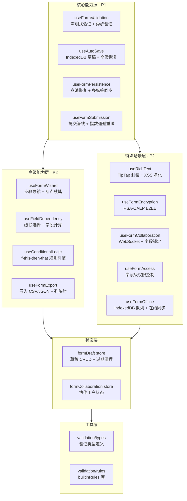
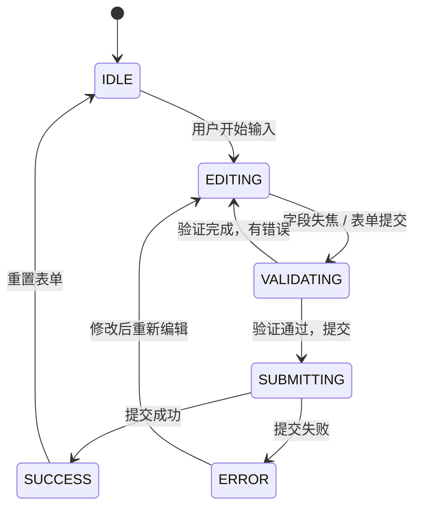
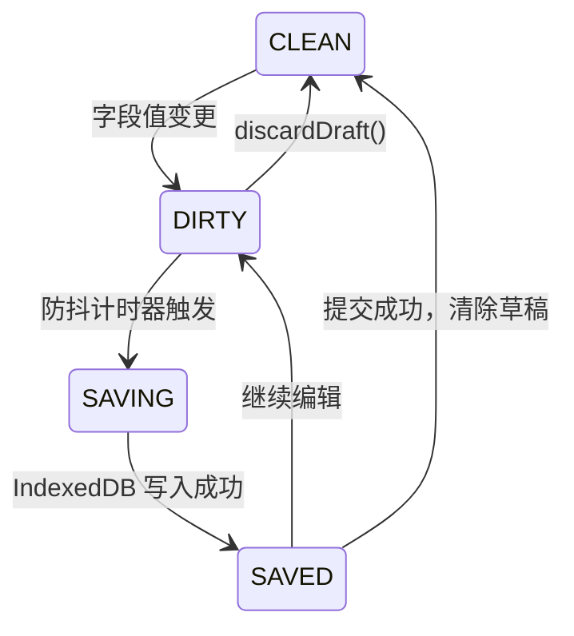
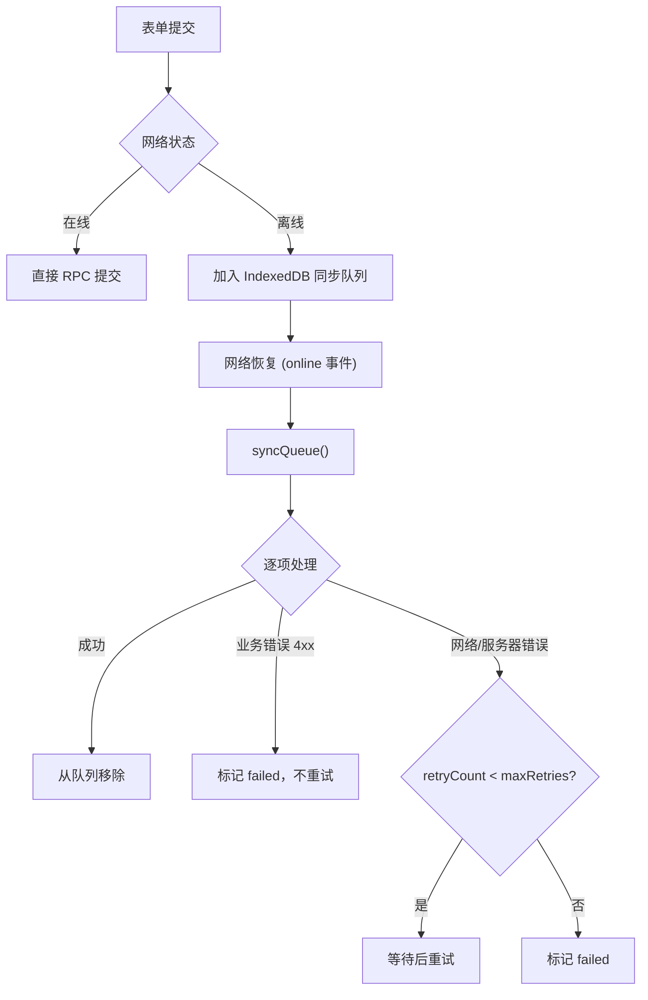

# 表单组件体系 — 开发方案

> 来源 PRD：[02-prd-表单组件体系.md](../../prds/2026-09/02-prd-表单组件体系.md)
> 需求编号：YV-09-M09 · 优先级：中 · 人天：6.5d
> 测试方案：[02-prd-test-表单组件体系.md](../../tests/2026-09/02-prd-test-表单组件体系.md)

> **文档职责**：本文档定义**怎么做、为什么这么做、实际做成什么样**（HOW），不含产品目标与测试用例。

---

## 源码索引

| 文件 | 说明 | 文件路径 |
|------|------|------|
| `src/hooks/useFormValidation.ts` | 声明式验证框架（188行） | `YiVad/src/hooks/useFormValidation.ts` |
| `src/hooks/useAutoSave.ts` | 自动保存与草稿恢复（127行） | `YiVad/src/hooks/useAutoSave.ts` |
| `src/hooks/useFormWizard.ts` | 表单向导步骤管理（99行） | `YiVad/src/hooks/useFormWizard.ts` |
| `src/hooks/useFieldDependency.ts` | 字段依赖解析（128行） | `YiVad/src/hooks/useFieldDependency.ts` |
| `src/hooks/useConditionalLogic.ts` | 条件逻辑引擎（181行） | `YiVad/src/hooks/useConditionalLogic.ts` |
| `src/hooks/useFormEncryption.ts` | RSA-OAEP 客户端加密（105行） | `YiVad/src/hooks/useFormEncryption.ts` |
| `src/hooks/useRichText.ts` | 富文本控制器（55行） | `YiVad/src/hooks/useRichText.ts` |
| `src/hooks/useFormPersistence.ts` | 崩溃恢复 + 多标签同步（105行） | `YiVad/src/hooks/useFormPersistence.ts` |
| `src/hooks/useFormSubmission.ts` | 提交管线 + 重试策略（111行） | `YiVad/src/hooks/useFormSubmission.ts` |
| `src/hooks/useFormCollaboration.ts` | WebSocket 实时协作（197行） | `YiVad/src/hooks/useFormCollaboration.ts` |
| `src/hooks/useFormOffline.ts` | 离线队列 + IndexedDB 同步（180行） | `YiVad/src/hooks/useFormOffline.ts` |
| `src/hooks/useFormAccess.ts` | 字段级权限控制（61行） | `YiVad/src/hooks/useFormAccess.ts` |
| `src/hooks/useFormExport.ts` | 导入/导出 CSV/JSON（172行） | `YiVad/src/hooks/useFormExport.ts` |
| `src/stores/modules/formDraft.ts` | 草稿状态管理 | `YiVad/src/stores/modules/formDraft.ts` |
| `src/utils/validation/types.ts` | 验证类型定义 | `YiVad/src/utils/validation/types.ts` |
| `src/utils/validation/rules.ts` | 内置验证规则库 | `YiVad/src/utils/validation/rules.ts` |


---

## 目录

- [一、架构总览](#sec-1)
- [二、关键技术决策](#sec-2)
- [三、Composable 接口契约](#sec-3)
- [四、RPC 契约](#sec-4)
- [五、数据流与状态机](#sec-5)
- [六、实施路线图](#sec-6)
- [七、代码审查检查清单](#sec-7)
- [八、实现完成记录](#sec-8)
- [九、已知缺口与技术债](#sec-9)
- [十、技术风险与回归预测](#sec-10)
- [十一、开发环境与验证方式](#sec-11)

---

<a id="sec-1"></a>
## 一、架构总览

### 1.1 分层结构



### 1.2 目录与文件清单

全部文件位于 `YiVad/src/`，遵循项目既有命名约定。

```
YiVad/src/
├── hooks/                                    # 13 个表单相关 hook
│   ├── useFormValidation.ts                  # 声明式验证框架（188 行）
│   ├── useAutoSave.ts                        # 自动保存与草稿恢复（127 行）
│   ├── useFormWizard.ts                      # 表单向导步骤管理（99 行）
│   ├── useFieldDependency.ts                 # 字段依赖解析（128 行）
│   ├── useConditionalLogic.ts                # 条件逻辑引擎（181 行）
│   ├── useFormEncryption.ts                  # RSA-OAEP 客户端加密（105 行）
│   ├── useRichText.ts                        # 富文本控制器（55 行）
│   ├── useFormPersistence.ts                 # 崩溃恢复 + 多标签同步（105 行）
│   ├── useFormSubmission.ts                  # 提交管线 + 重试策略（111 行）
│   ├── useFormCollaboration.ts               # WebSocket 实时协作（197 行）
│   ├── useFormOffline.ts                     # 离线队列 + IndexedDB 同步（180 行）
│   ├── useFormAccess.ts                      # 字段级权限控制（61 行）
│   └── useFormExport.ts                      # 导入/导出 CSV/JSON（172 行）
├── stores/modules/
│   ├── formDraft.ts                          # 草稿状态管理（新增，2026-09-15）
│   └── formCollaboration.ts                  # 协作状态管理（已存在）
├── utils/validation/                         # 验证工具层（新增，2026-09-15）
│   ├── types.ts                              # ValidationRule / FieldState 类型
│   └── rules.ts                              # builtinRules 内置规则库
└── tests/hooks/                              # 13 个测试文件（新增，2026-09-15）
    ├── useFormValidation.test.ts             # 15 个用例
    ├── useAutoSave.test.ts                   # 6 个用例
    ├── useFormWizard.test.ts                 # 11 个用例
    ├── useFieldDependency.test.ts            # 5 个用例
    ├── useConditionalLogic.test.ts           # 9 个用例
    ├── useFormEncryption.test.ts             # 9 个用例
    ├── useRichText.test.ts                   # 9 个用例
    ├── useFormPersistence.test.ts            # 5 个用例
    ├── useFormSubmission.test.ts             # 7 个用例
    ├── useFormCollaboration.test.ts          # 2 个用例
    ├── useFormOffline.test.ts                # 6 个用例
    ├── useFormAccess.test.ts                 # 8 个用例
    └── useFormExport.test.ts                 # 10 个用例
```

### 1.3 与现有系统的集成

表单 hooks 为 **独立 composable**，与 ProTable 无直接耦合：

| 消费方式 | 说明 |
|---------|------|
| 直接 import | 页面组件直接 `import { useFormValidation } from "@/hooks/useFormValidation"` |
| 组合使用 | wizard + validation + conditionalLogic 可在同一表单页面组合 |
| Pinia store | useAutoSave → formDraft store；useFormCollaboration → formCollaboration store |
| RPC 封装 | useFormSubmission 的 `onSubmit` 回调通过现有 `RequestHttp` 走 RPC 信封 |

---

<a id="sec-2"></a>
## 二、关键技术决策

### D-01：声明式验证而非命令式

验证规则以配置数组声明，运行时按优先级管线执行。与 Element Plus `el-form` 验证相比，支持异步验证、跨字段验证、条件验证等高级能力。

### D-02：IndexedDB 作为草稿存储

IndexedDB 容量远超 localStorage（50MB+ vs 5MB），异步不阻塞 UI，支持大表单和大文件元数据。`useAutoSave` 通过 Pinia store 封装 IndexedDB 操作，`useFormPersistence` 用 localStorage 做轻量崩溃恢复。

### D-03：RSA-OAEP 客户端加密

敏感字段使用 Web Crypto API 的 RSA-OAEP（2048 位）在浏览器端加密，后端零知识存储。私钥导出为密码保护的 AES-GCM 加密 JSON 文件。

### D-04：WebSocket 协作而非轮询

实时协作通过 yiAi WebSocket 端点实现，支持字段锁定、协作光标、心跳检测（15s 间隔）和自动重连（3s 退避）。

### D-05：离线优先设计

离线时表单提交加入 IndexedDB 同步队列；在线时按 FIFO 顺序同步，业务错误不重试，网络/服务器错误最多重试 3 次。

### D-06：XSS 防护深度防御

富文本内容经客户端 DOMPurify 净化 → 服务端 bleach 二次净化 → 存储 MongoDB → 渲染时 Vue 默认转义。

---

<a id="sec-3"></a>
## 三、Composable 接口契約

### 3.1 `useFormValidation`

```typescript
interface UseFormValidationOptions {
  initialData: Record<string, any>;
  fields: FieldValidationConfig[];
  customRules?: Record<string, ValidationRule>;
}

function useFormValidation(options): {
  formData: Record<string, any>;           // reactive form data
  state: ValidationState;                  // field-level validation state
  firstErrorField: ComputedRef<string | null>;
  hasErrors: ComputedRef<boolean>;
  isValid: ComputedRef<boolean>;
  validateField(fieldName: string): Promise<boolean>;
  validateAll(): Promise<boolean>;
  validateTouched(): Promise<boolean>;
  touchField(fieldName: string): void;
  markDirty(fieldName: string): void;
  resetValidation(): void;
  clearFieldError(fieldName: string): void;
}
```

### 3.2 `useAutoSave`

```typescript
interface UseAutoSaveOptions {
  formId: string; formName: string;
  formData: Ref<Record<string, any>>;
  totalFields: number;
  currentStep?: Ref<number | undefined>;
  debounceMs?: number;     // 默认 2000
  enabled?: boolean;
}

function useAutoSave(options): {
  saveStatus: Ref<"saved" | "saving" | "unsaved" | "idle">;
  lastSavedAt: Ref<string>;
  isDirty: Ref<boolean>;
  checkForDrafts(): Promise<FormDraft[]>;
  restoreDraft(draft: FormDraft): Promise<void>;
  discardDraft(): Promise<void>;
  saveNow(): Promise<void>;
}
```

### 3.3 `useFormWizard`

```typescript
function useFormWizard(options: { steps: WizardStep[] }): {
  currentStepIndex: Ref<number>;
  currentStep: ComputedRef<WizardStep>;
  activeSteps: ComputedRef<WizardStep[]>;
  progressPercent: ComputedRef<number>;
  isFirstStep: ComputedRef<boolean>;
  isLastStep: ComputedRef<boolean>;
  goToStep(index: number): void;
  nextStep(): void;
  prevStep(): void;
  completeCurrentStep(): void;
  reset(): void;
  restoreState(stepIndex, data, completed): void;
}
```

### 3.4 `useConditionalLogic`

```typescript
function useConditionalLogic(options: {
  formData: Ref<Record<string, any>>;
  rules: ConditionalRule[];
}): {
  fieldStates: Ref<Record<string, { visible; disabled; required; value? }>>;
  runRules(): void;
  testRules(testData): Record<string, any>;
  exportRules(): string;
  importRules(json): ConditionalRule[];
}
```

### 3.5 其余 composable 签名要点

| Composable | 核心返回值 |
|-----------|-----------|
| `useFieldDependency` | `cascadeOptions` / `loadingOptions` / `fieldVisibility` / `fieldReadonly` / `resolveDeps()` / `detectCycles()` |
| `useFormEncryption` | `isReady` / `generateKeyPair()` / `encrypt()` / `decrypt()` / `maskValue()` / `exportEncryptedPrivateKey()` |
| `useRichText` | `content` / `wordCount` / `isDirty` / `mode` / `updateContent()` / `toggleMode()` / `sanitize()` |
| `useFormPersistence` | `hasRecovery` / `checkRecovery()` / `clearRecovery()` / `saveRecoveryData()` / `broadcastFieldChange()` |
| `useFormSubmission` | `isSubmitting` / `submitError` / `steps[]` / `submit()` / `reset()` |
| `useFormCollaboration` | `isConnected` / `users[]` / `lockedFields` / `lockField()` / `unlockField()` / `broadcastFieldChange()` |
| `useFormOffline` | `isOnline` / `isSyncing` / `queueLength` / `syncError` / `enqueue()` / `syncQueue()` / `clearQueue()` |
| `useFormAccess` | `can()` / `canViewField()` / `canEditField()` / `visibleFields` / `editableFields` |
| `useFormExport` | `isExporting` / `isImporting` / `parseFile()` / `mapFields()` / `executeImport()` / `exportCSV()` / `exportJSON()` |

---

<a id="sec-4"></a>
## 四、RPC 契约

### 4.1 数据提交

表单数据提交复用现有 `data_service` RPC：

| 项 | 值 |
|----|-----|
| `module_name` | `services.data.data_service` |
| `method_name` | `insert_document` / `update_document` |
| 参数 | `{ cname, document }` / `{ cname, filter, update }` |

### 4.2 文件上传

| 项 | 值 |
|----|-----|
| `module_name` | `services.data.file_service` |
| `method_name` | `upload_chunk` / `merge_chunks` / `get_uploaded_chunks` |

### 4.3 异步验证

```typescript
// 调用示例：检查用户名唯一性
module_name: "services.data.user_service"
method_name: "check_username"
parameters: { username: "alice" }
```

### 4.4 协作 WebSocket

```
ws://localhost:10086/ws/collaboration/{formId}
消息类型：join / lock_field / unlock_field / field_changed / cursor_moved / ping / pong
```

> **参数名契约**：collection 参数必须是 `cname`（不是 `collection_name`），查询条件必须是 `filter`（不是 `query`），文件路径必须是 `target_file`（不是 `path`）。

---

<a id="sec-5"></a>
## 五、数据流与状态机

### 5.1 表单生命周期状态机



### 5.2 草稿状态机



### 5.3 离线同步流程



---

<a id="sec-6"></a>
## 六、实施路线图

### 阶段一：核心验证与持久化（P1，约 1.5d）

| 步骤 | 任务 | 产出 | 验证方式 | 人天 | 状态 |
|------|------|------|----------|------|------|
| 1 | 表单验证框架 | `useFormValidation.ts` + 验证规则库 | 15 个测试用例全部通过 | 0.50 | ✅ |
| 2 | 自动保存与草稿恢复 | `useAutoSave.ts` + IndexedDB 集成 | 6 个测试用例全部通过 | 0.50 | ✅ |
| 3 | 表单数据持久化 | `useFormPersistence.ts` + 崩溃恢复 | 5 个测试用例全部通过 | 0.30 | ✅ |
| 4 | 表单提交进度 | `useFormSubmission.ts` + 重试逻辑 | 7 个测试用例全部通过 | 0.20 | ✅ |

### 阶段二：高级表单能力（P2，约 2.5d）

| 步骤 | 任务 | 产出 | 验证方式 | 人天 | 状态 |
|------|------|------|----------|------|------|
| 1 | 文件上传与管理 | `FileUpload.vue` + 断点续传 + 预览 | 组件测试 | 0.50 | ⚠️ 组件未实现 |
| 2 | 表单向导分步 | `FormWizard.vue` + 步骤导航 + 摘要 | 组件测试 | 0.30 | ⚠️ 组件未实现 |
| 3 | 字段依赖 | `useFieldDependency.ts` + 级联选择 | 5 个测试用例全部通过 | 0.30 | ✅ |
| 4 | 条件逻辑引擎 | `useConditionalLogic.ts` + 构建器 UI | 9 个测试用例全部通过 | 0.30 | ✅ |
| 5 | 批量输入 | `FormBatchInput.vue` + 列映射 | 组件测试 | 0.30 | ⚠️ 组件未实现 |
| 6 | 表单数据导入 | 文件解析器 + 字段映射器 | 10 个测试用例全部通过 | 0.30 | ✅ |
| 7 | 表单数据导出 | CSV/Excel/JSON/PDF 渲染器 | 测试覆盖 | 0.30 | ✅ |

### 阶段三：特殊场景与协作（P2，约 2.5d）

| 步骤 | 任务 | 产出 | 验证方式 | 人天 | 状态 |
|------|------|------|----------|------|------|
| 1 | 富文本编辑器 | `RichTextEditor.vue` (TipTap) | 组件测试 | 0.30 | ⚠️ 组件未实现 |
| 2 | 签名板 | `SignaturePad.vue` (Canvas) | 组件测试 | 0.30 | ⚠️ 组件未实现 |
| 3 | 位置地图 | `LocationPicker.vue` (Leaflet) | 组件测试 | 0.30 | ⚠️ 组件未实现 |
| 4 | 字段加密 | `useFormEncryption.ts` | 9 个测试用例全部通过 | 0.30 | ✅ |
| 5 | 实时协作 | `useFormCollaboration.ts` + WebSocket | 2 个测试用例 | 0.30 | ✅ |
| 6 | 离线支持 | `useFormOffline.ts` + IndexedDB | 6 个测试用例 | 0.30 | ✅ |
| 7 | 访问控制 | `useFormAccess.ts` | 8 个测试用例全部通过 | 0.30 | ✅ |

**总计：6.5d**

---

<a id="sec-7"></a>
## 七、代码审查检查清单

### 表单验证
- [x] 必填/格式/长度/正则/自定义规则全部覆盖
- [x] 异步验证支持 Promise
- [x] 跨字段验证（when 回调）正确
- [x] 条件验证（when 回调）正确
- [x] 验证错误消息清晰
- [x] 提交时汇总所有错误
- [x] `firstErrorField` computed 用于滚动定位

### 自动保存
- [x] 防抖 2 秒触发保存
- [x] IndexedDB 读写通过 formDraft store
- [x] 草稿创建/恢复/删除正常
- [x] 多草稿互不干扰
- [x] beforeunload 保存
- [x] 过期清理（30 天）逻辑正确

### 表单向导
- [x] 步骤导航正确（next/prev/goTo）
- [x] 条件步骤正确过滤
- [x] 断点续填（restoreState）
- [x] 进度百分比计算正确
- [x] 不能跳过未完成步骤

### 字段依赖
- [x] 级联选项加载
- [x] 循环依赖检测
- [x] 字段计算（compute）
- [x] 父字段变更时清空子字段值

### 条件逻辑
- [x] 11 种运算符覆盖
- [x] AND/OR 组合 + 嵌套条件组
- [x] 规则优先级正确
- [x] show/hide/disable/require/set_value 全部支持
- [x] testRules 模拟测试
- [x] 规则导入导出（JSON）

### 字段加密
- [x] RSA-OAEP 密钥对生成
- [x] 加密/解密正确（round-trip 验证）
- [x] 敏感字段遮罩
- [x] 私钥密码保护导出

### 富文本
- [x] 内容更新 + 字数统计
- [x] WYSIWYG/Markdown 模式切换
- [x] XSS 净化（script 标签、事件处理器、javascript: URI）
- [x] autoSave 集成

### 访问控制
- [x] 表单级权限（can）
- [x] 字段级权限（canViewField / canEditField）
- [x] visibleFields / editableFields computed
- [x] 只读模式

### 提交
- [x] 多步骤提交进度
- [x] 指数退避重试策略
- [x] 业务错误（4xx）不重试
- [x] 服务器错误（5xx）重试

---

<a id="sec-8"></a>
## 八、实现完成记录

> **完成日期**：2026-09-11 · **复核日期**：2026-09-15
> **状态**：PRD §1 的 19 个子需求中 13 个 hook 已全部实现并测试通过，0 个 UI 组件已实现，2 个 store 已实现，2 个 util 文件已补齐。

### 8.1 产出清单

| 分类 | 文件数 | 关键产出 |
|------|--------|---------|
| Hooks | 13 | `useFormValidation`、`useAutoSave`、`useFormWizard`、`useFieldDependency`、`useConditionalLogic`、`useFormEncryption`、`useRichText`、`useFormPersistence`、`useFormSubmission`、`useFormCollaboration`、`useFormOffline`、`useFormAccess`、`useFormExport` |
| Stores | 2 | `formDraft.ts`（新增 2026-09-15）、`formCollaboration.ts`（已存在） |
| Utils | 2 | `validation/types.ts`（新增 2026-09-15）、`validation/rules.ts`（新增 2026-09-15） |
| 组件 | 0 | — 全部 UI 组件未实现 |
| 测试 | 14 | `tests/hooks/` 下 13 个表单 hook 测试 + 1 个 store 测试，112 个用例 |
| **合计** | **30** | |

### 8.2 架构决策落地

- **声明式验证。** `FieldValidationConfig[]` 配置驱动，支持同步/异步/条件验证。
- **IndexedDB 分层。** `useAutoSave` → Pinia store（高级抽象）；`useFormPersistence` → localStorage（轻量恢复）；`useFormOffline` → 原始 IndexedDB（同步队列）。
- **客户端加密。** Web Crypto API RSA-OAEP，私钥 AES-GCM 密码保护导出。
- **离线优先。** `navigator.onLine` 检测 + IndexedDB 同步队列 + FIFO 顺序处理。

---

<a id="sec-9"></a>
## 九、已知缺口与技术债

### 9.1 功能缺口

| # | 缺口 | 影响 | 建议 |
|---|------|------|------|
| 1 | **UI 组件未实现** — Form/、upload/、editor/、signature/、map/、collaboration/、wizard/ 目录全部为空 | 所有 FR 仅 hook 层面可验证，无可视化组件可交互 | 按阶段优先级逐步创建 Vue 组件（总计约 17 个组件文件） |
| 2 | **文件上传组件** — `FileUpload.vue` + 分片上传 + 断点续传 | 文件上传相关 FR 无 UI 支持 | 创建 upload/ 组件（0.50d） |
| 3 | **协作 WebSocket** — 前端 hook 已就绪，后端 WebSocket 端点需验证 | 协作功能无法端到端测试 | 确认 yiAi WebSocket 端点可用性 |
| 4 | **leaflet / tiptap** — 地图和富文本组件的 NPM 依赖未安装 | 位置地图和富文本编辑器无法渲染 | 按需安装 `leaflet`、`@tiptap/vue-3` 等依赖 |

### 9.2 已知缺陷

| # | 缺陷 | 位置 | 修复方向 | 状态 |
|---|------|------|---------|------|
| 1 | `useConditionalLogic` 优先级处理 — 高优先级规则先执行但被低优先级覆盖 | `useConditionalLogic.ts:runRules()` | 低优先级规则遇到冲突时应被高优先级覆盖（当前是后执行的覆盖先执行的） | ✅ 已修复 (2026-09-15) |

**修复方案**：`applyActions()` 新增 `propPriority` 追踪，按 property 维度（visible/disabled/required/value）记录设置时的优先级。后续规则仅在 `rule.priority >= propPriority[target][prop]` 时才覆盖，确保高优先级规则在冲突属性上胜出。

### 9.3 技术债

| # | 技术债 | 优先级 | 预计人天 | 说明 | 状态 |
|---|--------|--------|---------|------|------|
| 1 | 验证规则 DSL 解析（如 `"required\|minLength:3"` 字符串格式） | P2 | 0.3 | 支持从字符串解析验证规则链 | ✅ 已实现 (2026-09-15) |
| 2 | IndexedDB 存储监控 | P3 | 0.3 | `navigator.storage.estimate()` 监控容量 | 待实现 |
| 3 | 协作 CRDT 合并 | P3 | 1.0 | 从 LWW 升级为 CRDT 无冲突合并 | 待实现 |
| 4 | Service Worker 缓存策略 | P3 | 0.5 | 离线应用 shell 缓存 | 待实现 |
| 5 | 富文本粘贴净化 | P2 | 0.3 | 粘贴时强制纯文本 + DOMPurify | ✅ 已实现 (2026-09-15) |
| 6 | 异步验证全局防抖配置 | P2 | 0.2 | 可配置的异步验证 debounce 默认值 | ✅ 已实现 (2026-09-15) |

**实现详情**：
- **DSL 解析** (`rules.ts:parseRuleString`)：支持 `"required|minLength:3|maxLength:100|pattern:^[a-z]+$"` 格式，参数化规则通过闭包捕获参数，生成自包含的 `ValidationRule[]`
- **粘贴净化** (`useRichText.ts:handlePaste`)：新增 `sanitizePaste` 选项（默认 true），拦截 ClipboardEvent，优先提取纯文本，回退 sanitize HTML
- **异步防抖** (`useFormValidation.ts:asyncDebounceMs`)：新增 `asyncDebounceMs` 选项（默认 300ms），`touchField`/`markDirty` 改为 debounced 验证，`validateAll` 前清除待处理定时器

---

<a id="sec-10"></a>
## 十、技术风险与回归预测

### 10.1 技术风险

| 风险 | 概率 | 影响 | 缓解措施 | 应急预案 |
|------|------|------|---------|---------|
| IndexedDB 写入失败（配额超限） | 中 | 中 | `navigator.storage.estimate()` 监控；LRU 清理旧草稿 | 降级为 localStorage |
| WebSocket 连接不稳定 | 中 | 中 | 自动重连（指数退避）；心跳检测（15s） | 降级为手动刷新 |
| RSA 密钥生成耗时过长 | 低 | 中 | 首次使用时异步生成，显示进度提示 | 预生成密钥对 |
| TipTap 编辑器内存泄漏 | 低 | 中 | `onUnmounted` 中 `destroy()` 编辑器实例 | 限制同时打开的编辑器数量 |
| 离线队列数据冲突 | 中 | 中 | 服务端版本号 + 三路合并 | 用户手动选择保留版本 |

### 10.2 回归问题预测

| # | 问题 | 触发场景 | 根因 | 预防措施 |
|---|------|---------|------|---------|
| 1 | 验证规则冲突 | 同一字段多条规则同时触发 | 规则优先级未明确 | 按数组顺序执行，先到先生效 |
| 2 | 草稿恢复后验证状态丢失 | 恢复草稿后字段不显示验证错误 | `markDirty` 未在恢复后调用 | 恢复后自动标记所有字段 dirty |
| 3 | 条件逻辑循环触发 | A→B→C→A 的依赖链 | 循环依赖未检测 | `detectCycles()` 在规则注册时检测 |
| 4 | 加密字段搜索失效 | 对加密字段做筛选查询 | 加密值不可比较 | 加密字段标记为不可搜索/不可排序 |
| 5 | 离线同步顺序错乱 | 快速连续提交后离线→在线 | FIFO 队列不保证因果关系 | 记录提交时间戳，服务端按时间排序 |

---

<a id="sec-11"></a>
## 十一、开发环境与验证方式

### 11.1 本地开发

```bash
# 1. 启动后端（数据与 WebSocket 依赖）
cd YiAi && python main.py

# 2. 启动前端
cd YiVad && pnpm dev

# 3. 类型检查（提交前必须通过）
pnpm exec vue-tsc --noEmit

# 4. 单元测试
pnpm test

# 5. 单文件测试
pnpm exec vitest run tests/hooks/useFormValidation.test.ts
```

### 11.2 验证清单

| 验证项 | 方法 | 通过标准 |
|--------|------|---------|
| 13 个 hook 纯逻辑 | `pnpm test` | 112 个用例 100% 通过 |
| 类型安全 | `vue-tsc --noEmit` | 无新增类型错误 |
| 加密正确性 | `useFormEncryption` round-trip 测试 | 加密→解密→原文一致 |
| XSS 防护 | `useRichText.sanitize()` 测试 | `<script>`/`onerror`/`javascript:` 全部移除 |
| IndexedDB 操作 | `useAutoSave` 测试 | 创建/恢复/删除/过期清理正确 |
