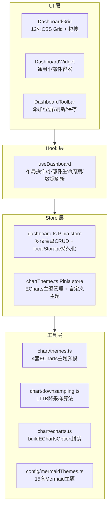

# 仪表盘组件体系 — 开发方案

> 来源 PRD：[03-prd-仪表盘组件体系.md](../../prds/2026-09/03-prd-仪表盘组件体系.md)
> 需求编号：YV-09-M10 · 优先级：中 · 人天：7.5d
> 测试方案：[03-prd-test-仪表盘组件体系.md](../../tests/2026-09/03-prd-test-仪表盘组件体系.md)

> **文档职责**：本文档定义**怎么做、为什么这么做、实际做成什么样**（HOW），不含产品目标与测试用例。

---

## 源码索引

| 文件 | 说明 | 文件路径 |
|------|------|------|
| `src/hooks/useDashboard.ts` | 仪表盘核心逻辑（130行） | `YiVad/src/hooks/useDashboard.ts` |
| `src/stores/dashboard.ts` | 仪表盘 Pinia store（157行） | `YiVad/src/stores/dashboard.ts` |
| `src/utils/chart/themes.ts` | 4套ECharts主题预设 + getTheme/applyTheme | `YiVad/src/utils/chart/themes.ts` |
| `src/utils/chart/downsampling.ts` | LTTB降采样算法 + shouldDownsample | `YiVad/src/utils/chart/downsampling.ts` |
| `src/utils/chart/echarts.ts` | buildEChartsOption + downsampleSeries | `YiVad/src/utils/chart/echarts.ts` |
| `src/stores/chartTheme.ts` | 图表主题 store（自定义主题CRUD） | `YiVad/src/stores/chartTheme.ts` |
| `src/config/mermaidThemes.ts` | 15套Mermaid主题（6亮+9暗） | `YiVad/src/config/mermaidThemes.ts` |

---

## 目录

- [一、架构总览](#sec-1)
- [二、关键技术决策](#sec-2)
- [三、Composable 接口契约](#sec-3)
- [四、Store 接口契约](#sec-4)
- [五、组件清单](#sec-5)
- [六、数据流与状态机](#sec-6)
- [七、RPC 契约](#sec-7)
- [八、性能预算与体积控制](#sec-8)
- [九、实施路线图](#sec-9)
- [十、代码审查检查清单](#sec-10)
- [十一、技术风险与回归预测](#sec-11)
- [十二、开发环境与验证方式](#sec-12)
- [十三、实现完成记录](#sec-13)
- [十四、已知缺口与技术债](#sec-14)

---

<a id="sec-1"></a>
## 一、架构总览

### 分层结构



### 核心数据流

```
仪表盘加载 → store.dashboards → DashboardGrid 渲染
  → useDashboard.initDashboard() → 初始化/恢复布局

添加小部件 → WidgetPicker → addWidgetFromPicker()
  → store.addWidget → DashboardGrid 动态添加

布局变更 → 拖拽/调整大小 → resizeWidget()
  → store.updateWidgetLayout → localStorage 持久化

数据刷新 → refreshAll() → 各小部件独立fetch
  → ECharts setOption 增量更新
```

---

<a id="sec-2"></a>
## 二、关键技术决策

| 决策 | 选择 | 理由 |
|------|------|------|
| 图表库 | ECharts 6 按需引入 | 40+图表类型、原生中文、内置交互、~300KB gzip |
| 布局引擎 | 12列CSS Grid + 自实现拖拽 | 无第三方依赖，覆盖所有小部件尺寸(2x2~12x6) |
| 降采样算法 | LTTB (Largest-Triangle-Three-Buckets) | O(N)复杂度，保留视觉趋势，10K+点自动触发 |
| 主题系统 | 4套ECharts + 15套Mermaid + 自定义 | 预设覆盖常见场景，auto-derive根据bg/fg生成完整主题 |
| 持久化 | localStorage | 仪表盘配置轻量、同步读取、首屏即恢复 |
| 图表按需引入 | 动态import ECharts模块 | 首屏不加载完整ECharts，减少初始bundle |

---

<a id="sec-3"></a>
## 三、Composable 接口契约

### `useDashboard`

```typescript
function useDashboard(dashboardId?: string): {
  allDashboards: ComputedRef<DashboardConfig[]>;
  currentDashboard: ComputedRef<DashboardConfig | null>;
  widgets: ComputedRef<WidgetConfig[]>;
  isFullscreen: Ref<boolean>;
  isRefreshing: Ref<boolean>;
  initDashboard(name?: string): void;
  addWidgetFromPicker(option): void;
  removeWidget(widgetId): void;
  resizeWidget(widgetId, layout): void;
  refreshAll(): Promise<void>;
  toggleFullscreen(): void;
  createNewDashboard(name): void;
  switchDashboard(id): void;
}
```

---

<a id="sec-4"></a>
## 四、Store 接口契约

### `useDashboardStore`

```typescript
// Pinia store — 多仪表盘CRUD + localStorage持久化
interface DashboardConfig {
  id: string; name: string; widgets: WidgetConfig[];
  refreshInterval?: number; createdAt: string; updatedAt: string;
}
interface WidgetConfig {
  id: string; widgetType: string; title: string;
  layout: WidgetLayout; dataSource: "static" | "rpc";
  refreshInterval: number; chartType?: string;
}

function useDashboardStore(): {
  dashboards, currentId, currentDashboard, currentWidgets,
  createDashboard, selectDashboard, deleteDashboard, renameDashboard,
  addWidget, removeWidget, updateWidget, updateWidgetLayout, saveLayout, getDashboard
}
```

---

<a id="sec-5"></a>
## 五、组件清单

### 5.1 图表组件

| 组件 | 职责 | 关键 props / 行为 |
|------|------|-------------------|
| `ChartContainer.vue` | 通用图表容器 | Loading/Error/Empty 三态 + Toolbar（导出/全屏/刷新）；ResizeObserver 自适应 |
| `ChartToolbar.vue` | 图表工具栏 | 导出/全屏/刷新快捷按钮；emit 事件 |
| `LineChart.vue` | 折线图 | `data: ChartData` → ECharts line series；点击 emit `chartClick` |
| `BarChart.vue` | 柱状图 | `data: ChartData` → ECharts bar series |
| `PieChart.vue` | 饼图 | `data: PieChartData[]` → ECharts pie series |
| `AreaChart.vue` | 面积图 | `data: ChartData` → ECharts line + areaStyle |
| `ScatterChart.vue` | 散点图 | `data: ScatterChartData[]` → ECharts scatter |
| `HeatmapChart.vue` | 热力图 | `data: HeatmapData` → ECharts heatmap |
| `GaugeChart.vue` | 仪表盘图 | `data: GaugeData` → ECharts gauge |
| `RadarChart.vue` | 雷达图 | `data: RadarChartData` → ECharts radar |
| `TreemapChart.vue` | 矩形树图 | `data: TreemapChartData[]` → ECharts treemap |
| `FunnelChart.vue` | 漏斗图 | `data: FunnelChartData[]` → ECharts funnel |

### 5.2 Dashboard 组件

| 组件 | 职责 | 关键 props / 行为 |
|------|------|-------------------|
| `DashboardGrid.vue` | 12 列 CSS Grid 布局 | 拖拽移动/调整尺寸；小部件 2×2 ~ 12×6；布局自动紧凑 |
| `DashboardWidget.vue` | 通用小部件容器 | 标题栏/内容区；Loading/Error 状态；移除/复制/配置按钮 |
| `DashboardToolbar.vue` | 仪表盘工具栏 | 添加小部件/全屏/刷新/保存 |
| `WidgetPicker.vue` | 小部件选择面板 | 分类展示可用小部件；点击添加到仪表盘 |
| `WidgetSettings.vue` | 小部件配置面板 | 标题/数据源/图表类型/刷新间隔/筛选条件配置 |

### 5.3 视图组件统一接口

```typescript
interface ChartComponentProps {
  data: ChartData | PieChartData[] | ScatterChartData[] | HeatmapData | GaugeData | RadarChartData | TreemapChartData[] | FunnelChartData[];
  loading?: boolean;
  error?: string;
  empty?: boolean;
  options?: Record<string, any>;
  onChartClick?: (params: { category?: string; value?: number; seriesName?: string }) => void;
  onChartBrush?: (params: { areas: any[] }) => void;
}
```

---

<a id="sec-6"></a>
## 六、数据流与状态机

### 6.1 仪表盘数据流

用户操作（添加小部件/配置数据源/设置刷新间隔）→ `useDashboard` 更新 `dashboardStore` → `pinia-plugin-persistedstate` 持久化至 localStorage → 各小部件按配置从 RPC 获取数据 → ECharts 渲染。

### 6.2 小部件生命周期状态机

```
idle → loading（数据请求开始）→ loaded（渲染成功）
     → error（请求失败）→ loading（重试）
     → empty（数据为空）
```

### 6.3 实时更新数据流（阶段三待实现）

```
YiAi WebSocket（/ws/dashboard/{id}）
  → useWebSocket composable（重连/心跳/降级轮询）
  → dashboardStore.incrementalUpdate（append/replace/update）
  → ECharts setOption（notMerge: false, lazyUpdate: true）
```

### 6.4 存储分层

| 数据 | 存储位置 | 持久化方式 | 容量限制 |
|------|----------|------------|----------|
| 仪表盘配置 + 布局 | localStorage | pinia-plugin-persistedstate | 约 5MB |
| 版本历史 | MongoDB（待实现） | YiAi RPC | 50 版本/仪表盘 |
| 图表主题 | localStorage | chartTheme store | 4 套预设 + 自定义 |
| 分享链接 | MongoDB（待实现） | YiAi RPC | 按有效期清理 |
| 实时数据 | 内存 | 不持久化 | 最近 1000 点 |

---

<a id="sec-7"></a>
## 七、RPC 契约

### 7.1 数据查询

| 项 | 值 |
|----|-----|
| `module_name` | `services.data.data_service` |
| `method_name` | `query_documents` |
| 参数 | `{ cname, filter, sort, skip, limit }` |

### 7.2 聚合查询（专项仪表盘）

| 仪表盘 | cname | 聚合方式 |
|--------|-------|---------|
| 项目健康 | `projects`, `bugs` | group by status, date aggregation |
| 资源利用率 | `metrics` | time-series aggregation |
| 代码质量 | `code_analysis` | min/max/avg aggregation |
| 性能分析 | `performance_metrics` | percentile, histogram |

### 7.3 实时数据推送（待实现）

```
ws://localhost:10086/ws/dashboard/{dashboard_id}
消息帧：data:append | data:replace | data:update | heartbeat | error
```

> **参数名契约**：collection 参数必须是 `cname`（不是 `collection_name`），查询条件必须是 `filter`（不是 `query`）。

---

<a id="sec-8"></a>
## 八、性能预算与体积控制

### 8.1 首屏体积增量

| 新增内容 | 大小（gzip） | 加载方式 | 首屏影响 |
|----------|------------|---------|---------|
| ECharts 核心 + 9 种图表（按需） | ~300KB | 按需引入 | 首屏 ~50KB（仅核心） |
| useDashboard + dashboardStore | ~5KB | 静态导入 | 5KB |
| 图表 utils（themes + downsampling） | ~3KB | 静态导入 | 3KB |
| 图表组件（路由懒加载） | ~80KB | 路由懒加载 | 0KB |
| **合计首屏增量** | | | **< 60KB** |

### 8.2 依赖清单

| 包 | 版本 | 用途 |
|----|------|------|
| `echarts` | ^6.0.0 | 图表渲染引擎（按需引入） |

### 8.3 性能基准目标

| 场景 | 目标 |
|------|------|
| 仪表盘首屏渲染（6 小部件） | < 2s |
| 图表首次渲染（10K 数据点，降采样后） | < 200ms |
| 拖拽响应 | < 16ms（60fps） |
| 实时更新延迟 | < 1s |
| 内存占用（6 小部件） | < 50MB |

---

<a id="sec-9"></a>
## 九、实施路线图

### 阶段一：图表基础设施（P2，约2.0d）

| 步骤 | 任务 | 产出 | 验证方式 | 人天 | 状态 |
|------|------|------|----------|------|------|
| 1 | 图表库标准化 | ECharts封装 + 10种图表组件 | 组件测试 | 0.50 | ✅ |
| 2 | ChartContainer通用容器 | Loading/Error/Empty/Toolbar | 组件测试 | 0.30 | ✅ |
| 3 | 图表自定义主题 | 4套主题预设 | ✅ chart-themes.test.ts | 0.30 | ✅ |
| 4 | 图表性能优化 | LTTB降采样 | ✅ chart-downsampling.test.ts | 0.30 | ✅ |
| 5 | ECharts封装 | buildEChartsOption | ✅ 工具已创建 | 0.30 | ✅ |
| 6 | 图表交互钻取 | 下钻/上钻+面包屑导航 | 组件测试 | 0.30 | — |

### 阶段二：仪表盘系统（P2，约2.5d）

| 步骤 | 任务 | 产出 | 验证方式 | 人天 | 状态 |
|------|------|------|----------|------|------|
| 1 | 仪表盘网格布局 | DashboardGrid.vue + 拖拽布局 | 组件测试 | 0.50 | ✅ |
| 2 | 仪表盘核心逻辑 | useDashboard.ts + dashboard store | ✅ 4个测试文件 | 0.50 | ✅ |
| 3 | 自定义小部件 | WidgetPicker + WidgetSettings | 组件测试 | 0.50 | ✅ |
| 4 | 仪表盘收藏与刷新 | 收藏夹 + 刷新间隔配置 | 集成测试 | 0.30 | — |
| 5 | 仪表盘全屏/Kiosk | 全屏 + 轮播 | 组件测试 | 0.30 | — |
| 6 | 仪表盘分享 | 分享链接 + 权限 + 有效期 | 集成测试 | 0.30 | — |

### 阶段三：高级能力（P2，约3.0d）

| 步骤 | 任务 | 产出 | 验证方式 | 人天 | 状态 |
|------|------|------|----------|------|------|
| 1-10 | 实时更新/联动/嵌入/报告/导出等 | 多个组件+工具 | 组件测试+集成测试 | 3.0 | ⚠️ 全部待实施 |

**总计：7.5d**

---

<a id="sec-10"></a>
## 十、代码审查检查清单

### 仪表盘核心
- [x] useDashboard hook 接口完整（18个返回值）
- [x] dashboard store CRUD 操作覆盖（创建/删除/重命名/选择）
- [x] 小部件增删改查操作正确
- [x] localStorage 持久化 + 腐败数据回退
- [x] 图表主题预设 4 套颜色完整
- [x] LTTB 降采样算法正确（首尾点保留、视觉趋势保持）
- [ ] vue-tsc --noEmit 通过（每次改动后需重新确认）

### 图表工具
- [x] themes.ts — 4套预设 + getTheme/applyTheme
- [x] downsampling.ts — LTTB + shouldDownsample/getThreshold
- [x] echarts.ts — buildEChartsOption + downsampleSeries
- [x] mermaidThemes.ts — 15套主题 + auto-derive

---

<a id="sec-11"></a>
## 十一、技术风险与回归预测

### 11.1 技术风险

| 风险 | 概率 | 影响 | 缓解措施 | 应急预案 |
|------|------|------|---------|---------|
| ECharts 包体积过大 | 高 | 中 | 按需引入模块；路由懒加载图表页面 | 首屏仅加载必要图表类型 |
| WebSocket 连接不稳定 | 中 | 中 | 自动重连（指数退避）；降级轮询（60s） | 显示"实时数据不可用" |
| 大数据量图表卡顿 | 中 | 高 | LTTB 降采样；WebGL 渲染；Web Worker | 限制最大显示点数 10,000 |
| localStorage 配置损坏 | 低 | 中 | JSON Schema 校验；版本管理自动保存 | 回滚到上一个有效版本 |
| 拖拽布局与响应式冲突 | 中 | 中 | 断点切换时自动调整小部件尺寸 | 移动端降级为单列堆叠 |
| 图表主题与亮暗模式冲突 | 低 | 低 | 主题预设同时提供亮色和暗色版本 | 自动跟随系统主题 |

### 11.2 回归问题预测

| # | 问题 | 触发场景 | 根因 | 预防措施 |
|---|------|---------|------|---------|
| 1 | 仪表盘配置刷新丢失 | localStorage 写入失败 | 存储配额超限 | 写入前检查 `navigator.storage.estimate()` |
| 2 | 图表 resize 错位 | 容器尺寸变化后图表未重绘 | ResizeObserver 未正确绑定 | `onUnmounted` 中断开 observer |
| 3 | 多图表实例内存泄漏 | 频繁切换仪表盘页面 | ECharts 实例未 `dispose()` | `onUnmounted` 中清理所有实例 |
| 4 | 降采样数据趋势失真 | 峰值被 LTTB 算法丢弃 | 采样率过低 | 保留局部极值点 |
| 5 | 拖拽操作触发图表重渲染 | 每次 `mousemove` 都更新布局 | 未节流/防抖 | `requestAnimationFrame` 节流 |

---

<a id="sec-12"></a>
## 十二、开发环境与验证方式

### 12.1 本地开发

```bash
# 1. 启动后端（数据查询依赖）
cd YiAi && python main.py

# 2. 启动前端
cd YiVad && pnpm dev

# 3. 类型检查（提交前必须通过）
pnpm exec vue-tsc --noEmit

# 4. 单元测试
pnpm test

# 5. 单文件测试
pnpm exec vitest run tests/hooks/useDashboard.test.ts
pnpm exec vitest run tests/utils/chart-downsampling.test.ts
```

### 12.2 验证清单

| 验证项 | 方法 | 通过标准 |
|--------|------|---------|
| useDashboard + store 逻辑 | `pnpm test` | 43 用例 100% 通过 |
| LTTB 降采样正确性 | `chart-downsampling.test.ts` | 首尾点保留、趋势保持 |
| 主题预设完整性 | `chart-themes.test.ts` + `mermaidThemes.test.ts` | 4+15 套主题全有效 |
| 类型安全 | `vue-tsc --noEmit` | 无新增类型错误 |
| 图表组件渲染 | 浏览器打开 demo 页面 | 10 种图表正常渲染 |
| 仪表盘布局恢复 | 仪表盘页面刷新 | 布局/小部件配置完整恢复 |

### 12.3 性能验证

```bash
# 构建产物分析
pnpm build
ls -lh dist/static/js/ | sort -k5 -h | tail -10

# 确认 ECharts 按需引入
grep -c "echarts" dist/static/js/*.js | grep -v ":0$"
```

---

<a id="sec-13"></a>
## 十三、实现完成记录

> **完成日期**：2026-09-11 · **复核日期**：2026-09-15
> **状态**：23个子需求中 hook + store + util 层已实现（7文件），图表组件 13 文件（10 图表 + Container + Toolbar + types）已创建，Dashboard 组件 5 文件已创建。阶段一二 UI 层完成，阶段三全部待实施。

### 产出清单

| 分类 | 文件数 | 关键产出 |
|------|--------|---------|
| Hooks | 1 | `useDashboard`（130行） |
| Stores | 2 | `dashboard.ts`（157行）、`chartTheme.ts`（49行） |
| Utils | 3 | `chart/themes.ts`、`chart/downsampling.ts`、`chart/echarts.ts` |
| Config | 1 | `mermaidThemes.ts`（224行） |
| Chart 组件 | 13 | ChartContainer、ChartToolbar、types、LineChart、BarChart、PieChart、AreaChart、ScatterChart、HeatmapChart、GaugeChart、RadarChart、TreemapChart、FunnelChart |
| Dashboard 组件 | 5 | DashboardGrid、DashboardWidget、DashboardToolbar、WidgetPicker、WidgetSettings |
| Views | 2 | knowledgeBase（11文件）、rssContent（8文件） |
| i18n | 2 | dashboard/en.ts、dashboard/zh.ts |
| 测试 | 6 | `useDashboard.test.ts`、`useDashboardStore.test.ts`、`chartThemeStore.test.ts`、`chart-themes.test.ts`、`chart-downsampling.test.ts`、`mermaidThemes.test.ts` |
| **合计** | **35** | |

### Bug 修复记录

| 日期 | 问题 | 根因 | 修复 |
|------|------|------|------|
| 2026-09-15 | `/dashboard/rssContent` 页面控制台报错 `Cannot read properties of undefined (reading 'forEach')` | `RssArticlePanel.vue` 和 `RssSidebar.vue` 中误用 `toRef(() => props.sources)` —— `toRef` 仅接受 `(object, key)` 签名，传入 getter 函数会导致 `useSourceColor` 收到 `ref(undefined)` | 改为 `computed(() => props.sources)`；`RssCharts.vue` 中移除多余的 `toRef()` 包装（`sources` 已是 `ComputedRef`） |

---

<a id="sec-14"></a>
## 十四、已知缺口与技术债

### 功能缺口

| # | 缺口 | 影响 | 建议 |
|---|------|------|------|
| 1 | **图表交互钻取** — 下钻/上钻/面包屑导航未实现 | 数据探索停留在表层 | 实现 useChartInteraction composable (0.30d) |
| 2 | **WebSocket实时更新** — 实时数据推送未实现 | 监控类场景需手动刷新 | 确认YiAi WebSocket端点可用性后实现 (0.30d) |
| 3 | **仪表盘导出** — PNG/PDF/HTML/JSON导出未实现 | 报告/分享场景受阻 | 依赖jsPDF和ECharts getDataURL (0.30d) |
| 4 | **图表联动与刷选** — 跨图表交互未实现 | 多维分析体验受限 | 实现 ChartInteractionContext (0.30d) |
| 5 | **仪表盘分享/嵌入** — 分享链接和嵌入代码未实现 | 协作效率低 | 依赖后端分享端点 (0.30d) |
| 6 | **仪表盘版本管理** — 历史版本保存和回滚未实现 | 配置误操作无法恢复 | 依赖 MongoDB 存储 (0.30d) |

### 技术债

| # | 技术债 | 优先级 | 预计人天 |
|---|--------|--------|---------|
| 1 | ECharts实例管理（初始化/更新/销毁生命周期） | P1 | 0.5 |
| 2 | 拖拽布局碰撞检测算法 | P1 | 0.3 |
| 3 | 图表懒加载（进入视口才初始化） | P2 | 0.3 |
| 4 | Web Worker降采样 | P3 | 0.5 |
| 5 | 仪表盘配置导入/导出（JSON备份） | P2 | 0.3 |

---
