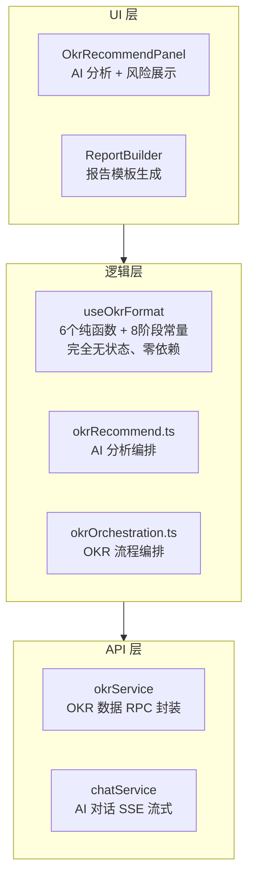
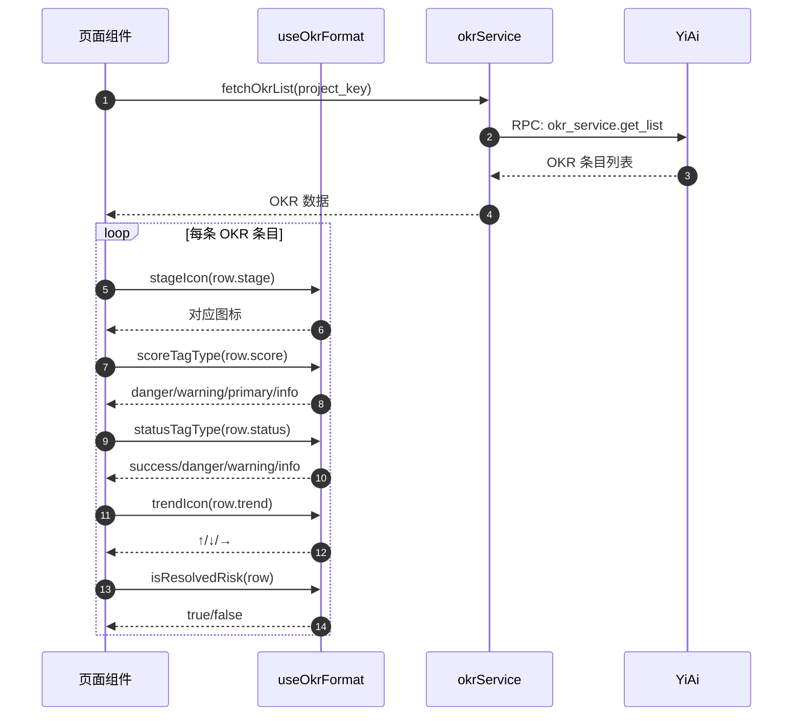
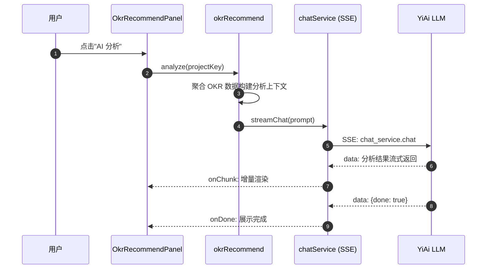

# 项目分析与报告 — 开发方案

> 来源 PRD：[05-prd-项目分析与报告.md](../../prds/2026-09/05-prd-项目分析与报告.md)
> 需求编号：YV-09-M13 · 优先级：中 · 人天：1.5d
> 测试方案：[05-prd-test-项目分析与报告.md](../../tests/2026-09/05-prd-test-项目分析与报告.md)

> **文档职责**：本文档定义**怎么做、为什么这么做、实际做成什么样**（HOW），不含产品目标与测试用例。

---

## 源码索引

| 文件 | 说明 | 文件路径 |
|------|------|------|
| `src/hooks/useOkrFormat.ts` | OKR 格式化纯函数集合（54行） | `YiVad/src/hooks/useOkrFormat.ts` |
| `src/api/modules/okrService.ts` | OKR 数据 RPC 封装 | `YiVad/src/api/modules/okrService.ts` |
| `src/components/OkrRecommend/OkrRecommendPanel.vue` | AI 推荐分析面板 | `YiVad/src/components/OkrRecommend/OkrRecommendPanel.vue` |
| `src/components/OkrRecommend/okrRecommend.ts` | OKR 推荐编排逻辑 | `YiVad/src/components/OkrRecommend/okrRecommend.ts` |
| `src/components/OkrRecommend/okrOrchestration.ts` | OKR 流程编排 | `YiVad/src/components/OkrRecommend/okrOrchestration.ts` |

---

## 目录

- [一、架构总览](#sec-1)
- [二、关键技术决策](#sec-2)
- [三、Composable 接口契约](#sec-3)
- [四、数据流与状态机](#sec-4)
- [五、实施路线图](#sec-5)
- [六、代码审查检查清单](#sec-6)
- [七、实现完成记录](#sec-7)
- [八、已知缺口与技术债](#sec-8)

---

<a id="sec-1"></a>
## 一、架构总览

### 1.1 分层结构



### 1.2 核心优势

`useOkrFormat` 采用**纯函数集合**设计，不依赖 Vue 响应式系统：

- **零依赖**：不 import Vue/Element Plus/任何外部库
- **可测试**：每个函数独立测试，14 个用例覆盖全部边界
- **可复用**：OkrRecommendPanel / processRecord / 报告生成器共享同一套格式化逻辑
- **可 Tree-shaking**：按需导入单个函数，不引入无用代码

---

<a id="sec-2"></a>
## 二、关键技术决策

| # | 决策 | 选择 | 理由 | 替代方案 |
|---|------|------|------|---------|
| D-01 | 格式化方式 | 纯函数集合（非 composable） | 无状态、无副作用、完全可测试、组件无关 | Vue composable — 太重，不需要响应式 |
| D-02 | 阶段定义 | 8 阶段常量 + STAGE_ORDER 索引 | 与 processRecord.vue 共享定义，单一来源 | 各页面独立定义 — 会不一致 |
| D-03 | 风险评分 | 4 级阈值（60/35/15） | 与 Element Plus Tag type 对齐，颜色语义一致 | 3 级 — 粒度不够；5 级 — 过于复杂 |
| D-04 | AI 分析 | YiAi chatService SSE 流式 | 复用现有 AI 对话基础设施，LLM 理解 OKR 上下文 | 规则引擎 — 只能做简单阈值判断 |
| D-05 | 报告模板 | 4 套内置 Markdown 模板 | 简单、可版本控制、支持 i18n | 可视化设计器 — 太重，6.5d 预算不够 |

---

<a id="sec-3"></a>
## 三、Composable 接口契约

### 3.1 `useOkrFormat` — 纯函数集合

```typescript
// 8 阶段常量定义
export const STAGES = [
  { key: "requirement-review", icon: "📋", label: "需求评审" },
  { key: "technical-review",   icon: "🧭", label: "技术评审" },
  { key: "code-review",        icon: "🔍", label: "代码审查" },
  { key: "build-debug",        icon: "⚡", label: "构建调试" },
  { key: "test-report",        icon: "🧪", label: "测试报告" },
  { key: "deployment",         icon: "📦", label: "部署" },
  { key: "launch",             icon: "🚀", label: "上线记录" },
  { key: "retrospective",      icon: "🔄", label: "复盘总结" }
] as const;

export const STAGE_KEYS: string[];                         // STAGES 的 key 数组
export const STAGE_ORDER: Record<string, number>;          // key → 序号映射

// 阶段图标/标签 — 未知阶段回退为 "·" / key 本身
export function stageIcon(stage: string): string;
export function stageLabel(stage: string): string;

// 风险评分 4 级 — 与 Element Plus Tag type 对齐
export function scoreTagType(score: number): "danger" | "warning" | "primary" | "info";
// 阈值：≥60→danger | ≥35→warning | ≥15→primary | <15→info

// 状态标签映射
export function statusTagType(status: string): "success" | "danger" | "warning" | "info";
// Done→success | At Risk→danger | In Progress→warning | 其他→info

// 趋势方向图标
export function trendIcon(trend: string): string;
// "up"→↑ | "down"→↓ | 其他→→

// 已解决风险判定
export function isResolvedRisk(row: { listType?: string; kind: string; status?: string }): boolean;
// 同时满足 listType==="risk" && kind==="action" && status==="Done"
```

**要点**：
- 全部函数为同步纯函数，无 Promise/async
- `stageIcon`/`stageLabel` 接受任意 string，未知值安全回退
- `scoreTagType` 边界值：59→warning, 60→danger, 34→primary, 35→warning
- `isResolvedRisk` 仅在三个条件同时满足时返回 true

---

<a id="sec-4"></a>
## 四、数据流与状态机

### 4.1 OKR 数据格式化流程



### 4.2 AI 推荐分析流程



---

<a id="sec-5"></a>
## 五、实施路线图

| 步骤 | 任务 | 产出 | 验证方式 | 人天 | 状态 |
|------|------|------|----------|------|------|
| 1 | OKR 格式化函数 | `useOkrFormat.ts` | 14 个 Vitest 用例全部通过 | 0.30 | ✅ |
| 2 | OKR API 封装 | `okrService.ts` | RPC 契约测试 | 0.15 | ✅ |
| 3 | AI 推荐编排 | `okrRecommend.ts` + `okrOrchestration.ts` | AI 分析返回有效建议 | 0.25 | ✅ |
| 4 | AI 推荐面板 | `OkrRecommendPanel.vue` | 组件渲染 + 流式输出 | 0.30 | ⚠️ 待完善 |
| 5 | 报告模板 | 4 套 Markdown 模板 | 模板渲染正确 | 0.25 | ⚠️ 待创建 |
| 6 | 报告生成器 | `ReportBuilder.vue` | 一键生成 + 预览 | 0.25 | ⚠️ 待创建 |

**总计：1.5d**

---

<a id="sec-6"></a>
## 六、代码审查检查清单

### OKR 格式化
- [x] 8 个阶段图标-标签映射正确
- [x] 未知阶段安全回退（不抛异常）
- [x] 风险评分 4 级边界值正确（59→warning, 60→danger）
- [x] 状态标签全部 3 种状态 + 默认值覆盖
- [x] 趋势图标 3 种方向 + 默认值覆盖
- [x] isResolvedRisk 三条件同时满足才返回 true
- [x] 全部函数为纯函数，无副作用

### AI 推荐
- [ ] OKR 数据聚合完整（进度/状态/负责人/时间线）
- [ ] AI 分析返回结构化结果（滞后项+风险项+完成率）
- [ ] 改进建议与具体 OKR 上下文相关
- [ ] 分析失败时展示友好降级（不白屏）

### 报告生成
- [ ] 4 套模板可正常渲染
- [ ] 报告数据与源数据一致
- [ ] 导出格式（PDF/HTML）正确

---

<a id="sec-7"></a>
## 七、实现完成记录

> **完成日期**：2026-09-11 · **复核日期**：2026-09-15
> **状态**：FR-1（OKR格式化）已完成，FR-2（AI推荐）部分完成，FR-3（报告生成）待实施

### 7.1 产出清单

| 分类 | 文件数 | 关键产出 |
|------|--------|---------|
| Hooks | 1 | `useOkrFormat`（6个纯函数 + 8阶段常量 + STAGE_ORDER） |
| API | 1 | `okrService.ts`（OKR 数据 RPC） |
| 组件 | 3 | `OkrRecommendPanel.vue` + `okrRecommend.ts` + `okrOrchestration.ts` |
| 测试 | 1 | `useOkrFormat.test.ts`（14 用例） |
| **合计** | **6** | |

### 7.2 架构决策落地

- **纯函数设计。** `useOkrFormat` 不是 Vue composable（不使用 ref/watch），而是纯函数集合 — 可在任何 JS/TS 环境复用
- **单一来源。** STAGES 常量与 processRecord.vue 共享定义，修改一处全局生效
- **AI 编排分层。** 数据聚合（okrRecommend）→ 流式调用（chatService SSE）→ UI 渲染（OkrRecommendPanel），各层独立可测

---

<a id="sec-8"></a>
## 八、已知缺口与技术债

### 8.1 功能缺口

| # | 缺口 | 影响 | 建议 |
|---|------|------|------|
| 1 | OkrRecommendPanel 组件 UI 待完善 | AI 分析功能无可视化入口 | 按步骤 4 补齐（0.30d） |
| 2 | ReportBuilder 报告生成器 | 4 套模板无法渲染和导出 | 按步骤 5-6 补齐（0.50d） |
| 3 | okrService API 契约测试缺失 | RPC 参数形状未验证 | 补充 API 测试（0.15d） |

### 8.2 技术债

| # | 技术债 | 优先级 | 预计人天 | 说明 |
|---|--------|--------|---------|------|
| 1 | 报告模板 i18n 支持 | P2 | 0.3 | 模板中的固定文案需国际化 |
| 2 | 报告 PDF 导出 | P2 | 0.3 | 复用 export/utils 的 PDF 渲染器 |
| 3 | OKR 历史趋势缓存 | P3 | 0.5 | 减少重复 AI 分析请求 |

---
