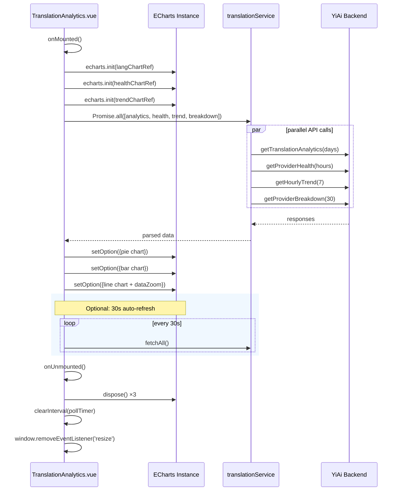

---

doc_type: task
prd_task_id: "YV-09-100"
title: "YV-09-100: 翻译分析仪表盘 — 技术设计"
status: 已完成
priority: P2
owner: Claude
roles: [engineer]
created: 2026-09-23
updated: 2026-09-23
project: YiVad
project_id: yivad
prd_month: "202609"
estimate_frontend: 0.5
source_prd: "100-prd-翻译分析仪表盘.md"
tags: [dashboard, echarts, translation, analytics, vue3]

type: task
---

# YV-09-100: 翻译分析仪表盘 — 技术设计

> **版本**：v3.0 · **人天**：0.5d · **PRD**：[100-prd-翻译分析仪表盘.md](../../prds/2026-09/100-prd-翻译分析仪表盘.md)

---

## 1. 业务上下文

YiAi 后端已暴露 4 个分析 RPC 接口。YiVad 作为管理后台，需要消费这些接口提供 ECharts 可视化 Dashboard，供运维巡检供应商健康、管理者查看 KPI 概览、PM 分析翻译趋势。

**PRD**：[YV-09-100](../../prds/2026-09/100-prd-翻译分析仪表盘.md)

## 2. 架构

### 系统架构图

```
TranslationAnalytics.vue
  │ Promise.all([getTranslationAnalytics, getProviderHealth, getHourlyTrend, getProviderBreakdown])
  ▼
translationService.ts (RPC 调用层)
  │ callService("services.translation.translate_service", method, params)
  ▼
YiAi :10086 (execution module → translate_service → provider_health)
  │ MongoDB aggregation
  ▼
ECharts 渲染 (饼图 / 柱状图 / 折线图)
```

### 组件清单

| 组件 | 职责 | 技术 | 文件 |
|------|------|------|------|
| TranslationAnalytics.vue | 页面组件 | Vue 3.5 + ECharts 6 | `views/dashboard/analytics/TranslationAnalytics.vue` |
| translationService.ts | API 模块 | TypeScript + RPC | `api/modules/translationService.ts` |

### API 契约

```typescript
// 三个独立 RPC 调用，并行加载
getProviderHealth(hours): Promise<{data: ProviderHealth}>
getHourlyTrend(days): Promise<{data: HourlyTrendItem[]}>
getProviderBreakdown(days): Promise<{data: ProviderBreakdownItem[]}>
// 复用现有的
getTranslationAnalytics(days): Promise<{data: TranslationAnalytics}>
```

### 组件生命周期序列



## 3. 实现细节

### 文件变更

| 文件 | 操作 | 行数 | 说明 |
|------|------|------|------|
| `views/.../TranslationAnalytics.vue` | 新增 | ~280 | ECharts 仪表盘 |
| `api/modules/translationService.ts` | 修改 | +60 | 3 新函数 + 类型 |
| `tests/api/translationService.test.ts` | 新增 | ~50 | 9 个 Vitest 用例 |

### 关键实现模式

**ECharts 生命周期**：`onMounted` init → `setOption` → `onUnmounted` dispose → `resize` 监听

**数据加载**：`Promise.all` 并行 4 个 API → 依次 setOption 三个图表 + 填充表格/卡片

**自动刷新**：`setInterval(fetchAll, 30000)` + toggle 控制

**CSV 导出**：`Blob` + `URL.createObjectURL` + 临时 `<a download>` — 零依赖

### 错误处理

- 任一 API 失败 → `el-alert` + `error.value`，其他正常渲染
- 空数据 → 图表不崩溃，表格显示 "No data yet"
- 组件卸载 → `clearInterval(pollTimer)` + `chart.dispose()`

## 4. 非功能需求

| 维度 | 要求 | 实现 |
|------|------|------|
| 性能 | 首屏 <2s | 骨架屏 + 并行 API |
| 内存 | 无泄漏 | dispose + clearInterval |
| 响应式 | 图表自适应 | echarts.resize() + window.resize 监听 |
| 类型安全 | vue-tsc 通过 | strict mode TypeScript |
| 兼容性 | Chrome/Edge/Firefox/Safari 最近 2 版本 | ES module 输出 |