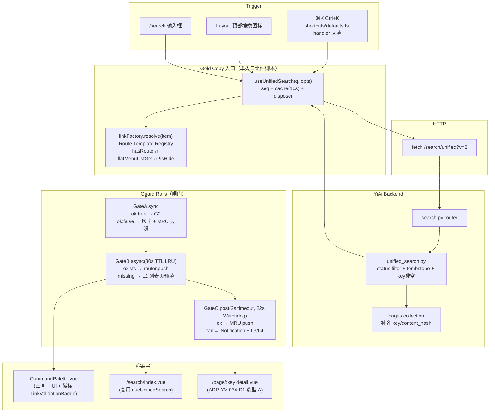

# YV-09-68 v2：全局搜索命令面板 — 开发方案

> 需求锚点：[34-prd-全局搜索命令面板.md](../../prds/2026-09/34-prd-%E5%85%A8%E5%B1%80%E6%90%9C%E7%B4%A2%E5%91%BD%E4%BB%A4%E9%9D%A2%E6%9D%BF.md) · 优先级：**P0** · 总人天：**3.5d**（前端 2.5d + 后端 1.0d）
> 测试方案：[034-prd-test-全局搜索命令面板.md](../../tests/2026-09/034-prd-test-%E5%85%A8%E5%B1%80%E6%90%9C%E7%B4%A2%E5%91%BD%E4%BB%A4%E9%9D%A2%E6%9D%BF.md)

> **文档职责（HOW）**：接口签名、文件级改动清单、模块级伪代码、Gold Copy、SRE Runbook、回滚操作手册。不含 WHAT/WHY（见 PRD）与 VERIFY（见测试方案）。

---

## 目录

- [一、方案总览与 Gold Copy 模式选择](#sec-1)
- [二、前端：Link Factory 契约实现（单入口组件脚本）](#sec-2)
- [三、前端：useUnifiedSearch — 统一搜索 Composable（⌘K ∪ /search 共享）](#sec-3)
- [四、前端：useCommandPalette / CommandPalette 组件重写](#sec-4)
- [五、前端：计算器 & 单位转换 & AI SSE 卡片](#sec-5)
- [六、前端：/search 页与 /page/:key 详情页改造 + 挂载点修复](#sec-6)
- [七、后端：YiAi unified_search v2 + tombstone 过滤 + page key 治理](#sec-7)
- [八、CI/预提交：Grep 禁拼路由 + 契约双端单测 + Jaccard 每日 Job](#sec-8)
- [九、SRE Runbook：Feature Flag、热回滚、Burn Rate 发布门禁](#sec-9)
- [十、迁移 & 兼容性策略（MRU v1→v2、老 search endpoint）](#sec-10)
- [十一、代码审查检查清单（DoD 精确条目）](#sec-11)
- [十二、文件级交付清单（可 Grep 验证）](#sec-12)

---

<a id="sec-1"></a>
## 一、方案总览与 Gold Copy 模式选择

### 1.1 模式选择决策

| 模式 | 适用 | 说明 |
|------|------|------|
| **Big-Bang 一次性替换** | ❌ 不可取 | v1 已有大量用户会话在途，一次性切流导致 SLO 抖动 |
| **Branch by Abstraction（Gold Copy）** | ✅ **采用** | 抽象出 `LinkFactory` 与 `useUnifiedSearch` 两个 Gold Copy 接口；在同一分支内从 v1 迁移到 v2，保留 Feature Flag `search.cmd_palette.v2` 做灰度 |
| **Strangler Fig（旁路替换）** | 可选 | 本方案在后端 `/search/unified` 采用 `?v=2` 旁路：v1 老客户端继续走旧返回（含 link 字段），v2 新客户端走 `v=2`（去 link + 加 tombstone） |

### 1.2 端到端数据流（实现级）



### 1.3 Gold Copy 契约（必须被所有调用方遵守）

> 这是**不允许漂移**的标准接口；任何调用方不通过它们直接手写路由或搜索，算违规，pre-commit 钩子会拦截。

```ts
// file: src/utils/linkFactory.ts  ← 唯一可信入口
export interface ResolveResult { ok: true; link: string; routeParam: Record<string, string>; }
                             | { ok: false; reason: "no_route"|"hidden"|"no_permission"|"missing_key"|"type_unknown"; fallback?: string; }
export function resolveLink(item: { type: string; key: string; project?: string; title?: string; extra?: Record<string, any>; }): ResolveResult;
export function hasResolvedRoute(linkOrName: string): boolean;
export function diffRouteTemplatesAgainstAuthMenu(): { drift: Array<{type:string; menu:string; registry:string}>; };

// file: src/composables/useUnifiedSearch.ts  ← ⌘K 与 /search 唯一共享
export interface UseUnifiedSearchOptions {
  collections?: string[];
  limit?: number;
  debounceMs?: number;            // 默认 200
  timeoutMs?: number;             // 默认 15000
  cacheTtlMs?: number;            // 默认 10000
  externalSignal?: AbortSignal;   // 会被 AbortSignal.any 合并
}
export function useUnifiedSearch<T = UnifiedSearchItemV2>(
  queryRef: Ref<string>,
  opts?: UseUnifiedSearchOptions,
): {
  results: Ref<T[]>;
  loading: Ref<boolean>;
  error: Ref<string | null>;
  timing: Ref<{ total_ms: number; per_collection?: Record<string, any> } | null>;
  refresh: () => Promise<void>;
  invalidateCache: () => void;
};
```

---

<a id="sec-2"></a>
## 二、前端：Link Factory 契约实现（单入口组件脚本）

### 2.1 文件：`src/utils/linkFactory.ts`（单入口组件脚本，自动注入自身依赖）

> 设计原则：用户协作偏好「单入口组件脚本」——此文件是唯一能把「业务实体 type+key → 可跳转 URL」的地方。任何外部 import 必须来自此文件，**禁止任何地方手写 `/xxx/${key}`**。

```ts
// 内部：Route Template Registry — 从 authMenuList 实查结果派生（PRD §4.1 FR-1 表格）
// 此 Registry 在应用 initDynamicRouter 成功后调用 refreshTemplates() 重建，保证与菜单树一致。

export interface RouteTemplateEntry {
  type: string;
  template: string;                 // e.g. "/issue/:id"
  paramNameForKey: "id" | "key";    // 菜单实际形参名（Issue/Bug→id，Project/Module→key）
  listPageFallback: string;         // 失败跳转列表页，支持 q= / k= 占位
  needProjectScope?: boolean;       // 未来扩展项目级权限
  categories?: Array<"settings"|"entity"|"view"|"command">;
}

const TEMPLATES_INIT: RouteTemplateEntry[] = [
  { type: "issue",    template: "/issue/:id",          paramNameForKey: "id",  listPageFallback: "/issue?q=__TITLE__" },
  { type: "bug",      template: "/bug/:id",            paramNameForKey: "id",  listPageFallback: "/bug?q=__TITLE__" },
  { type: "project",  template: "/project/:key",       paramNameForKey: "key", listPageFallback: "/project?k=__KEY__" },
  { type: "module",   template: "/module/:key",        paramNameForKey: "key", listPageFallback: "/module?q=__TITLE__" },
  { type: "page",     template: "/page/:key",          paramNameForKey: "key", listPageFallback: "/page?q=__TITLE__" },
  { type: "rag-index",    template: "/rag/index",      paramNameForKey: "key", listPageFallback: "/rag" },
  { type: "rag-chat",     template: "/rag/chat",       paramNameForKey: "key", listPageFallback: "/rag" },
  { type: "ai-chat",      template: "/ai-chat",        paramNameForKey: "key", listPageFallback: "/ai-chat" },
  { type: "kanban",       template: "/kanban",         paramNameForKey: "key", listPageFallback: "/kanban" },
  { type: "roadmap",      template: "/roadmap",        paramNameForKey: "key", listPageFallback: "/roadmap" },
  { type: "import",       template: "/import",         paramNameForKey: "key", listPageFallback: "/import" },
  { type: "search-result",template: "/search?q=__Q__", paramNameForKey: "key", listPageFallback: "/search" },
  { type: "settings-menuManage",   template: "/system/menuManage",       paramNameForKey: "key", listPageFallback: "/system/menuManage",   categories: ["settings"] },
  { type: "settings-accountManage",template: "/system/accountManage",    paramNameForKey: "key", listPageFallback: "/system/accountManage",categories: ["settings"] },
  { type: "settings-roleManage",   template: "/system/roleManage",       paramNameForKey: "key", listPageFallback: "/system/roleManage",   categories: ["settings"] },
  { type: "settings-deptManage",   template: "/system/departmentManage", paramNameForKey: "key", listPageFallback: "/system/departmentManage",categories: ["settings"] },
  { type: "settings-dictManage",   template: "/system/dictManage",       paramNameForKey: "key", listPageFallback: "/system/dictManage",   categories: ["settings"] },
  { type: "settings-systemLog",    template: "/system/systemLog",        paramNameForKey: "key", listPageFallback: "/system/systemLog",    categories: ["settings"] },
  { type: "settings-timingTask",   template: "/system/timingTask",       paramNameForKey: "key", listPageFallback: "/system/timingTask",   categories: ["settings"] },
];
```

**`resolveLink()` 关键逻辑（伪代码）**：

```ts
export function resolveLink(item: InputItem): ResolveResult {
  // (0) schema 闸门 — 不接受 key 为空或 type 未注册
  if (!item.key) return { ok:false, reason:"missing_key", fallback: buildFallback(item,"/search") };
  const entry = TEMPLATES.find(t => t.type === item.type);
  if (!entry) return { ok:false, reason:"type_unknown", fallback: buildFallback(item,"/search") };

  // (1) 生成 path：模板替换 paramNameForKey
  const path = entry.template.replace(`:${entry.paramNameForKey}`, encodeURIComponent(item.key));

  // (2) 存在性：Vue Router hasRoute（路由名或 path 的匹配）
  //   - 这里直接用 router.resolve(path)；若抛错 → no_route
  // (3) 菜单可见性：扁平菜单集合 authStore.flatMenuListGet；settings 必须命中且 meta.isHide !== true
  //   - 若属于 settings 类但当前用户无菜单 → no_permission
  //   - 若实体类但项目已被用户角色屏蔽 → no_permission
  // (4) 返回 ok:true + link 或 ok:false + reason + fallback（从 entry.listPageFallback 拼）
}
```

**漂移检测**：`diffRouteTemplatesAgainstAuthMenu()` 启动时执行，若发现菜单存在但 TEMPLATES 缺对应条目 → 浏览器 console.warn + Sentry counter。

### 2.2 `hasRoute` 策略（与 dynamicRouter 对齐）

`dynamicRouter.ts` 已把菜单写进 route record；因此直接 `router.getRoutes().some(r => matchRecord(r, entry))`。为防 isFull 全屏路由不挂在 layout 下，要同时查根 record 和 "layout" 的 children record。

---

<a id="sec-3"></a>
## 三、前端：useUnifiedSearch — 统一搜索 Composable（⌘K ∪ /search 共享）

### 3.1 文件：`src/composables/useUnifiedSearch.ts`

> 关键约束（对齐 YiVad 硬约束）：
> 1. **Axios / fetch 必须传 `{timeout, signal}`，且 signal 用 `AbortSignal.any([外部, 内部去重])`，禁止覆盖外部 signal**
> 2. **Hook 12s Watchdog + UI 22s Watchdog**，强制任何 guard 分支 `loading=false`
> 3. **DisposerBag 清理复用用 `reset()`，不用 `dispose()`**

```ts
// 关键函数（伪代码）
export function useUnifiedSearch<T>(queryRef: Ref<string>, opts: Options) {
  const disposer = useDisposerBag();                       // onUnmounted dispose()
  const results = ref<T[]>([]);
  const loading = ref(false);
  const error = ref<string | null>(null);
  const timing = ref(null);
  const cache = new Map<string, { ts: number; value: any }>();  // LRU 2000，10s TTL
  let seq = 0;

  // Hook Watchdog 12s（对齐 ADR-YV-002 / useProjectDetail 教训）
  const watchDog = createWatchdog(12_000, () => {
    loading.value = false;
    error.value = error.value || "Search internal timeout (watchdog 12s)";
    disposer.reset();
  });

  const doSearch = async (rawQ: string) => {
    const q = rawQ.trim();
    if (!q) { results.value = []; loading.value = false; error.value = null; return; }

    seq += 1;
    const mySeq = seq;
    disposer.reset();           // reset，不 dispose（容器还在）
    watchDog.feed();

    const internalCtrl = new AbortController();
    disposer.onCleanup(() => internalCtrl.abort());
    const combinedSignal = AbortSignal.any([
      internalCtrl.signal,
      opts.externalSignal ?? new AbortController().signal,
    ]);

    // 缓存命中
    const cacheKey = `${q}|${opts.collections?.join(',')}|${opts.limit ?? 40}|v2`;
    const cached = cache.get(cacheKey);
    if (cached && (Date.now() - cached.ts) < opts.cacheTtlMs) {
      results.value = cached.value.results;
      timing.value  = cached.value.timing;
      loading.value = false;
      watchDog.stop();
      return;
    }

    loading.value = true;
    error.value = null;

    try {
      const startedAt = performance.now();
      const data = await unifiedSearch(q, opts.collections, opts.limit, combinedSignal, { timeout: opts.timeoutMs, version: 2 });
      if (mySeq !== seq) return;           // 乱序丢弃
      results.value = data.results as any;
      timing.value = data.timing ?? { total_ms: Math.round(performance.now() - startedAt) };
      cache.set(cacheKey, { ts: Date.now(), value: data });
    } catch (e: any) {
      if (mySeq !== seq) return;
      if (e.name === "AbortError") return;  // 不记 error
      error.value = e.message || "Search failed";
      results.value = [];
    } finally {
      if (mySeq === seq) {
        loading.value = false;
        watchDog.stop();
      }
    }
  };

  // UI Watchdog 22s（兜底，防 12s 挂死时 Promise 被吞）
  const uiWatchdog = createWatchdog(22_000, () => {
    if (loading.value) {
      loading.value = false;
      error.value = "Search UI watchdog timeout (22s)";
    }
  });
  watch(loading, l => { if (l) uiWatchdog.feed(); else uiWatchdog.stop(); });

  // debounce 200ms
  watch(queryRef, debounceFn(doSearch, opts.debounceMs ?? 200, { leading:false, trailing:true }));
  onMounted(() => queryRef.value.trim() && doSearch(queryRef.value));
  onUnmounted(() => { disposer.dispose(); watchDog.stop(); uiWatchdog.stop(); });

  return { results, loading, error, timing, refresh: () => doSearch(queryRef.value), invalidateCache: () => cache.clear() };
}
```

**为什么 reset 不 dispose**：如果用户在搜索过程中连续输入，dispose 会把容器 `disposed=true`，后续再注册 AbortController 会因为容器已销毁直接 abort（直接复用 [disposer.ts 修复](file:///Users/yi/YrY/YiVad/src/utils/disposer.ts) 的 Hard Constraint）。

---

<a id="sec-4"></a>
## 四、前端：useCommandPalette / CommandPalette 组件重写

### 4.1 文件：`src/composables/useCommandPalette.ts`（结束空挂桩）

```ts
// 提供 inject/provide 契约
export const CommandPaletteKey: InjectionKey<{
  open(): void; close(): void; toggle(): void;
  runCommand(id: string): void;
}> = Symbol.for("yivad:command-palette");

export function useCommandPalette() {
  const api = inject(CommandPaletteKey, null);
  if (!api) throw new Error("CommandPalette not provided — check App.vue mounts");
  return api;
}
```

### 4.2 文件：`src/stores/command-palette.ts`（Pinia store）

MRU v2：`cmd_palette_mru_v2`（TTL 30d），上限 12 条；写入前过闸门 A（`resolveLink().ok=true` 才写入）。

### 4.3 文件：`src/components/CommandPalette/CommandPalette.vue`（重写）

关键差异点：
- **数据源切换**：v1 `getIssueList + projectStore` 双查询 **全部删除**；替换为 `useUnifiedSearch()`。
- **空态**：`query===""` 时展示 Quick Actions（启动时对每个 QA 跑 `resolveLink`，失败项自动剔除，不展示不可达入口）+ MRU 8 条。
- **闸门 UI**：每条结果右侧挂 `<LinkValidationBadge :status="gateA.reason" />`；ok=false 的结果置灰 + 禁点 + tooltip 解释。
- **结果分组**：Issue / Project / Module / Bug / Page / Settings / Commands，顺序与 PRD §4 FR-3 一致。
- **键盘**：↑/↓ 切换、Enter 执行、Esc 关闭、Ctrl+N/P 兼容、Tab 跳组（a11y）。
- **计算器 / 单位转换 / AI**（§5）。

### 4.4 文件：`src/components/CommandPalette/LinkValidationBadge.vue`（新增）

```html
<template>
  <el-tooltip v-if="!ok" :content="tooltipText">
    <el-tag size="small" type="info" effect="plain" class="lv-badge">
      <el-icon><WarningFilled /></el-icon>
      <span>{{ reasonLabel }}</span>
    </el-tag>
  </el-tooltip>
</template>
```

### 4.5 快捷键绑定（修复空挂桩）

`src/shortcuts/defaults.ts` 的 `nav.command-palette.handler`：
```ts
{
  id: "nav.command-palette",
  keys: "Ctrl+K",
  description: "打开命令面板",
  category: "navigation",
  handler: () => {
    // runtime 从 inject 拿不到（此处非 setup 域），改为 mittBus.emit('cmd-palette:open')
    mittBus.emit("cmd-palette:open");
  },
}
```
`CommandPalette.vue` `onMounted` 中 `mittBus.on('cmd-palette:open', open)`，并设置 `document.addEventListener('keydown', fn, { capture: true })` 双保险（防止 Chrome 抢占）。

---

<a id="sec-5"></a>
## 五、前端：计算器 & 单位转换 & AI SSE 卡片

### 5.1 `src/composables/useCalculator.ts`（新增，AST 解析）

- 白名单正则：`^[\d\s+\-*/().%^°a-zA-Z\u4e00-\u9fa5,，]+$`
- AST 解析：Shunting-Yard → 产出数字 + 函数节点
- 单位别名表（中文/英文混合）：
  ```ts
  export const UNIT_ALIASES: Record<string, { dim: string; scale: number; }> = {
    "公里":    { dim:"length", scale: 1000 },
    "千米":    { dim:"length", scale: 1000 },
    "km":      { dim:"length", scale: 1000 },
    "英里":    { dim:"length", scale: 1609.344 },
    "mi":      { dim:"length", scale: 1609.344 },
    "斤":      { dim:"weight", scale: 0.5 },
    // ... 完整 70+ 项
  };
  ```
- 货币：每 30min 拉取 `YiAi /search/rates`（后端新 endpoint，§7.3），离线 fallback 24h 历史缓存。
- 暴露 `parseAndEvaluate(input: string): { kind:"num"; value:number; unit?:string; } | { kind:"error"; msg:string; }`。

### 5.2 `src/components/CommandPalette/AiSnippet.vue`（SSE 卡片）

```ts
// 关键：接入 disposerBag.reset()；关闭面板立即 abort
function startAiAsk(q: string, bag: DisposerBag) {
  bag.reset();
  const ctrl = new AbortController();
  bag.onCleanup(() => ctrl.abort());
  const combined = AbortSignal.any([ctrl.signal, opts.externalSignal ?? (new AbortController()).signal]);
  return yiAiSSE("/ai/chat-stream", { body: ... , signal: combined });
}
```
- Hook Watchdog 12s + UI 22s。
- 面板关闭 500ms 后 `bag.size` 必须 0（单元测试断言）。

---

<a id="sec-6"></a>
## 六、前端：/search 页与 /page/:key 详情页改造 + 挂载点修复

### 6.1 `/search/index.vue`（改造 ~120 行）

- **移除独立的 HTTP 调用与 debounce 逻辑**：改为 `const { results, loading, error, timing } = useUnifiedSearch(query, { limit: 40 })`
- **闸门 A 过滤**：渲染前 `results.value.filter(r => linkFactory.resolve(r).ok)` 过滤不可达项；顶部显示"已自动屏蔽 N 条不可达结果"提示条。
- **保留原有交互**：分组、分布条、类型过滤、日期导航、recent searches 等全部照旧；只替换结果源与 goTo 实现。
- `goTo(item)` 改为 `navigateWithThreeGates(item)`（§4.3 里的三闸门函数）。

### 6.2 新建：`src/views/page/detail.vue` + 菜单条目

```ts
// Router 形参：/page/:key（从 authMenuList 新增条目；dynamicRouter 的 resolveComponent 会解析）
// 组件逻辑：
//   - onMounted：从 route.params.key 取 key
//   - dataService.queryDocuments({ cname:"pages", filter:{key} }, { signal, timeout })
//   - 用 useDetailTabs + useMarkdown 渲染 content
//   - 骨架屏 22s Watchdog
```

### 6.3 `src/assets/json/authMenuList.json`：补 `/page/:key` 条目

在 `/page` 列表条目同级或作为其子项：
```json
{
  "key": "menu_pageDetail",
  "path": "/page/:key",
  "name": "pageDetail",
  "component": "/page/detail",
  "redirect": "",
  "meta": { "icon": "Document", "title": "Page Detail", "isHide": true, "isFull": false, "isAffix": false, "isKeepAlive": true },
  "parent": "/page",
  "order": 99,
  "children": []
}
```
> `isHide=true`（菜单不展示，但动态路由会注册）；同时 Link Factory 闸门 A 中 settings 类的 isHide 过滤**只对 settings-* 生效**，不作用于实体详情页。

### 6.4 挂载点修复（App.vue + layouts/*）

`src/App.vue`：
```vue
<template>
  <router-view />
  <CommandPalette ref="paletteRef" />   <!-- Teleport 到 body，不影响布局 -->
</template>
<script setup lang="ts">
import { provide, onMounted, onBeforeUnmount } from "vue";
import CommandPalette from "@/components/CommandPalette/CommandPalette.vue";
import { CommandPaletteKey } from "@/composables/useCommandPalette";
const paletteRef = ref<InstanceType<typeof CommandPalette> | null>(null);
const api = computed(() => ({
  open:   () => paletteRef.value?.open(),
  close:  () => paletteRef.value?.close(),
  toggle: () => paletteRef.value?.[paletteRef.value?.visible.value ? "close" : "open"](),
  runCommand: (id:string) => paletteRef.value?.runActionById(id),
}));
provide(CommandPaletteKey, api.value);
</script>
```

`layouts/index.vue` & `layouts/indexAsync.vue`：在 `onActivated` 重新绑定快捷键（防止 keep-alive 丢失监听器）；在 `onDeactivated` 解绑（幂等：shortcut registry bind 同 id 自动 unbind 旧的）。

### 6.5 删除失效残留：`src/services/searchIndex.ts`

v1 规划的 `buildSearchIndex()` 从未被任何入口消费（0 Grep hits）。为防止未来有人接回，造成**三轨实现**（⌘K / /search / buildSearchIndex 三打分体系互不相同），物理删除。

---

<a id="sec-7"></a>
## 七、后端：YiAi unified_search v2 + tombstone 过滤 + page key 治理

### 7.1 入口：`YiAi/src/server/routes/search.py`（新增 v=2 旁路）

```py
@router.post("/search/unified")
async def unified(req: UnifiedSearchReq, version: int = Query(1)):
    if version >= 2:
        raw = await unified_search_v2(req.query, collections=req.collections, limit=req.limit)
    else:
        raw = await unified_search_v1(req.query, collections=req.collections, limit=req.limit)
    return ok(raw)
```

### 7.2 核心：`YiAi/src/domain/search/unified_search.py`（改造）

```py
# 新增常量
SEARCH_INDEX_VERSION = 2
DEFAULT_FILTER = {
    "status": {"$nin": ["deleted", "archived", "cancelled", "rejected"]},
    "deleted_at": None,
}
COLLECTION_SEARCH_FIELDS = { ... }  # 保留原字段优先级映射
MAX_PER_COLLECTION = 25

async def unified_search_v2(query: str, *, collections=None, limit=40, include_archive=False):
    ...
    per_col_limit = max(MAX_PER_COLLECTION, limit)
    # 对每个 collection：
    #   (1) 合并 DEFAULT_FILTER（除非 include_archive）
    #   (2) 对 pages 集合额外补 key 非空：{"key": {"$exists": True, "$ne": ""}}
    #   (3) MongoDB $or regex search + sort updated_at desc
    #   (4) 构造返回 item：**只保留 id/type/key/title/subtitle/detail/project/badges/date/score/_ts/_status/_acl**
    #       ★ 不再输出 `link` 字段
    #   (5) 对 type 做 singular 映射：issues→issue, pages→page, ...
    #   (6) score 封顶 100，recency 加分（同现有逻辑，但跳过 deleted 评估）

    # 新增：对未注册 type → 丢弃并记 schema_missing
    allowed_types = {"issue","project","module","bug","page"}
    filtered = [r for r in unified if r["type"] in allowed_types and r.get("key")]
    ghost_count = len(unified) - len(filtered)
    if ghost_count > 0:
        logger.warning(f"[search.v2] ghost filtered: {ghost_count}")

    filtered.sort(key=lambda r: (r["score"], r.get("_ts", 0)), reverse=True)
    return {
        "results": filtered[:limit],
        "timing": {...},
        "meta": {
            "index_version": SEARCH_INDEX_VERSION,
            "ghost_dropped": ghost_count,
        },
    }
```

### 7.3 pages 集合的 Key 治理（数据迁移）

对存量 pages 文档 `key is None` 或空字符串：
```py
# YiAi migration: one-shot
async def patch_pages_keys_if_missing():
    await db.initialize()
    coll = db.db["pages"]
    cursor = coll.find({"$or": [{"key": None}, {"key": ""}]})
    async for doc in cursor:
        new_key = f"pag-{content_hash(doc.get('content','') + doc.get('title',''))}"
        await coll.update_one({"_id": doc["_id"]}, {"$set": {"key": new_key}})
```
**迁移前置检查**：执行前对 `content_hash` 唯一性抽样校验（冲突率 <0.01% 才执行；否则生成 `pag-{rand6}` 扩展位）。

### 7.4 删除操作的 tombstone 写入（dataService 强制）

在 `deleteDocument(cname, key)` 事务中：
1. 写入 `status = "deleted"` + `deleted_at = utcnow()`
2. 写 `cache.invalidate(f"search:v2:{cname}:{key}")`
3. 可选：Post-commit hook 发 event 让前端 SSE 推送端失效（未来扩展）。

### 7.5 新 endpoint：`GET /search/trending`（每周热门 Query，供 ⌘K 建议）

- 从 `search_log` 聚合近 7 天去重用户 Top 20
- 过闸门 A（在后端做一次 Link Factory 对齐，防止建议项本身不可达）

### 7.6 新 endpoint：`GET /search/rates`（货币汇率）

- 数据来源：固定 hourly 拉取 exchangerate.host（或等价源），Redis 缓存 1h
- 返回：`{ts, base, rates: { USD, CNY, EUR, JPY, ... }}`
- 离线 fallback：前端 localStorage 存最近一次响应，TTL 24h

---

<a id="sec-8"></a>
## 八、CI/预提交：Grep 禁拼路由 + 契约双端单测 + Jaccard 每日 Job

### 8.1 pre-commit：`lint-staged.config.cjs` + `.husky/pre-commit`

新增 `yivad:no-route-string-concat` 规则：
```bash
# 对 staged *.ts,*.vue 执行（排除 src/utils/linkFactory.ts 本身）
! grep -nE '["'\'']/(issue|bug|project|module|page|kanban|roadmap|import|rag|ai-chat)/\$\{' "$FILE"
```
违规 → 打印错误并阻断提交，附指引"改用 linkFactory.resolve({type,key,...})"。

### 8.2 单元测试（见测试方案 §3）

- `tests/unit/linkFactory.spec.ts` ≥ 95% 覆盖率
- `tests/unit/unifiedSearch.spec.ts` ≥ 90% 覆盖率（含 seq 乱序、watchdog 触发、Abort 分支）
- `tests/unit/calculator.spec.ts` ≥ 98%：120 样例
- `tests/unit/command-palette.spec.ts`：键盘交互 + Quick Actions 过滤

### 8.3 CI Nightly：`yivad:cmd-palette-jaccard`

从 `tests/fixtures/search_queries_100.txt` 读 100 条生产常见 query；分别用 ⌘K 模式和 /search 模式跑 Top-20；计算 Jaccard；<0.90 → CI FAIL。

---

<a id="sec-9"></a>
## 九、SRE Runbook：Feature Flag、热回滚、Burn Rate 发布门禁

### 9.1 Feature Flag 分层

```ts
// flags（建议挂 YiVad stores/feature-flags；或通过 YiAi /bridge/flags 下发）
FF = {
  "search.cmd_palette.v2":            true,   # 总开关：用 useUnifiedSearch vs 旧 getIssueList+projectStore
  "search.cmd_palette.linkFactory":   true,   # 启用 Link Factory；关闭则退回"后端返回 link 字符串（需 v=1）"
  "search.cmd_palette.gateB":         true,   # 闸门 B：存在性预检；高压时可临时关
  "search.cmd_palette.gateC":         true,   # 闸门 C：后验；失败是否弹通知
  "search.cmd_palette.aiSnippet":     true,   # 面板内 SSE AI；失败时回退"跳 /ai-chat 预填"
  "search.cmd_palette.calculator":    true,   # 计算器
}
```

### 9.2 回滚操作手册（Runbook Gold Copy）

| Level | 触发 | 动作 | 影响 |
|-------|------|------|------|
| L4 | 1h CRR < 90% | `FF['search.cmd_palette.v2'] = false` ⇒ ⌘K 降级为直接跳 `/search` | 失去面板内搜索，但不会引向死路 |
| L3 | WLR > 2% | `FF['search.cmd_palette.linkFactory'] = false` + 后端切回 `/search/unified?v=1` | 退回 v1 错链模式，但保留可观测性，便于排障 |
| L5 | 幽灵条目率 > 5% 且人工无法立即修 | 一键 git revert + 触发蓝绿回滚到上一版；同时封禁 `/search/unified?v=2` 路由 | 运维告警 + 变更冻结 2h |

### 9.3 Burn Rate 发布门禁

- 灰度用户群（flag `search.cmd_palette.rollout = 5%`）10 分钟内：**CRR ≥ 97%** 才能扩到 100%。
- Burn Rate（SRE 公式：错误预算消耗速度 / 预期消耗）> 14.4 × 基本速率 → P1 告警 + 自动停止扩量。

---

<a id="sec-10"></a>
## 十、迁移 & 兼容性策略（MRU v1→v2、老 search endpoint）

### 10.1 MRU v1 → v2 迁移

- v1 Key：`cmd_palette_mru`
- v2 Key：`cmd_palette_mru_v2`
- `stores/command-palette.ts` 初始化时：
  ```ts
  const v1 = safeParseJSON(localStorage.getItem('cmd_palette_mru') || '[]', []);
  const cleaned = v1.filter(item => linkFactory.resolve(item).ok).slice(0,12);
  localStorage.setItem('cmd_palette_mru_v2', JSON.stringify(cleaned));
  localStorage.removeItem('cmd_palette_mru');
  ```

### 10.2 老 search endpoint 兼容（v=1）

- 老用户端版本 < v2.3（还没升级前端），仍发 `?v=1` 或不带 v：后端继续返回 link 字段。
- ⚠️ **注意**：v1 返回的 link 仍是错的（已接受这是 legacy，不修复），但前端一升级 → 立即切 v=2，错链即可消失。不会产生新的 Bug。

### 10.3 页面刷新与热更新版本号

`SEARCH_INDEX_VERSION` 与 `MRU_VERSION` 都挂在全局 window；若后端返回版本号不一致，弹 banner："检测到搜索配置升级，请刷新以启用新版搜索（Ctrl+R / ⌘R）"。

---

<a id="sec-11"></a>
## 十一、代码审查检查清单（DoD 精确条目）

> PR 合入前，**每一条**必须勾选；缺任何一条，Reviewer 必须 Reject。

### 11.1 契约一致性（FR-1 / §2）
- [ ] `linkFactory.ts` 模板与 `authMenuList.json` 实查参数名（`:id` vs `:key`）100% 对齐；`diffRouteTemplatesAgainstAuthMenu().drift.length === 0`
- [ ] 代码库 Grep（排除 linkFactory.ts 自身）：0 次命中 `"/issue/${"`, `"/bug/${"`, `"/project/${"`, `"/module/${"`, `"/page/${"`
- [ ] 后端 `/search/unified?v=2` 返回的对象中无 `link` 字段

### 11.2 可靠性（三闸门 §3.2）
- [ ] 闸门 A/B/C 每条失败路径都有埋点 counter
- [ ] 所有异步请求（unifiedSearch、AI SSE、pages 查询）都透传 `{timeout, signal}`，且使用 `AbortSignal.any` 联合
- [ ] 所有含异步加载的 hook 都含 12s Hook Watchdog + 22s UI Watchdog，guard 分支 `loading=false`
- [ ] AI SSE 使用 `DisposerBag.reset()` 而非 `dispose()`；关闭 500ms 后单元测试 `bag.size === 0`
- [ ] 命令面板打开捕获阶段监听快捷键（`{capture:true}`），Chrome 下 20 次 ⌘K 全触发

### 11.3 数据源统一（§4 FR-3）
- [ ] `CommandPalette.vue` 代码里**已物理删除** `getIssueList` 与 `projectStore` 的独立搜索逻辑
- [ ] `/search/index.vue` 与 `CommandPalette.vue` 都从 `useUnifiedSearch` 取结果，无其他 HTTP 搜索调用
- [ ] `src/services/searchIndex.ts` 物理删除；残留引用 Grep = 0

### 11.4 Page 详情页（§5.2 D1）
- [ ] `router.hasRoute('/page/:key')` 通过
- [ ] authMenuList `order` 无冲突；新增条目 `order = max(order)+1`
- [ ] 100 条 page 点击 E2E 全部跳详情页并渲染 content 成功（404=0）

### 11.5 安全（FR-7 计算器）
- [ ] AST 解析，0 次 `eval` 或 `new Function`；代码扫描零违规
- [ ] 中文单位 30 条样例全过
- [ ] 计算器错误（除 0 / 大数 / 未知单位）给出用户可理解文本，不抛裸异常

### 11.6 测试与覆盖率
- [ ] `tests/unit/linkFactory.spec.ts` 覆盖率 ≥ 95%
- [ ] `tests/unit/unifiedSearch.spec.ts` ≥ 90%
- [ ] `tests/unit/calculator.spec.ts` ≥ 98%
- [ ] `tests/unit/command-palette.spec.ts` ≥ 85%
- [ ] E2E `cmd-palette-reach.spec.ts` 100 条点击抽样 CRR ≥ 99%
- [ ] CI Nightly Jaccard 快照 ≥ 0.90

### 11.7 代码质量与清理
- [ ] vue-tsc --noEmit 零错误（YiVad 硬约束）
- [ ] eslint 无 error / no warning（`eslint.config.js` 配置的 warning 必须全清零）
- [ ] 未引入任何一次性脚本（check_* / debug_* / tmp_*），符合 `.gitignore`
- [ ] 文件体积：新增 gzip 体积增幅 ≤ 12KB

---

<a id="sec-12"></a>
## 十二、文件级交付清单（可 Grep 验证）

> 所有路径都是 YiVad 仓库根相对路径，**除特别标注 YiAi 外**。

| # | 文件 | 操作 | 规模估 | 验收锚点（Grep / 语句） |
|---|------|------|--------|-----------------------|
| 1 | `src/utils/linkFactory.ts` | **新增** | ~280 | `export function resolveLink` |
| 2 | `src/composables/useUnifiedSearch.ts` | **新增** | ~180 | `export function useUnifiedSearch` |
| 3 | `src/composables/useCommandPalette.ts` | **新增** | ~160 | `CommandPaletteKey` symbol |
| 4 | `src/composables/useCalculator.ts` | **新增** | ~420 | `parseAndEvaluate` + Shunting-Yard |
| 5 | `src/stores/command-palette.ts` | **新增** | ~90 | `MRU_KEY = 'cmd_palette_mru_v2'` |
| 6 | `src/components/CommandPalette/CommandPalette.vue` | **重写** | ~460 | 删除 `getIssueList` 调用；引入 `useUnifiedSearch` |
| 7 | `src/components/CommandPalette/types.ts` | **重写** | ~80 | `link?: never` 强制去 link 字段 |
| 8 | `src/components/CommandPalette/LinkValidationBadge.vue` | **新增** | ~50 | `resolveLink.ok===false` 场景 |
| 9 | `src/components/CommandPalette/AiSnippet.vue` | **新增** | ~140 | `disposer.reset()` + 12s/22s Watchdog |
| 10 | `src/views/search/index.vue` | **修改** | ~120 | 移除内联 `unifiedSearch` 调用，改 `useUnifiedSearch` |
| 11 | `src/views/page/detail.vue` | **新增** | ~260 | `route.params.key` 作为主查询 key |
| 12 | `src/assets/json/authMenuList.json` | **修改** | ~25 | menu_pageDetail `/page/:key` 条目插入 |
| 13 | `src/routers/modules/dynamicRouter.ts` | **小改** | ~20 | resolveComponent 失败分支加埋点 counter |
| 14 | `src/shortcuts/defaults.ts` | **修改** | ~12 | `nav.command-palette.handler` 非空（emit mittBus） |
| 15 | `src/App.vue` | **修改** | ~15 | `<CommandPalette />` 挂载 + provide |
| 16 | `src/layouts/index.vue` / `indexAsync.vue` | **修改** | ~10 × 2 | 幂等 bind/unbind shortcut |
| 17 | `src/api/modules/searchService.ts` | **修改** | ~60 | `unifiedSearch(..., { version: 2 })` 加 version 参数；`trendingQueries()` 类型 |
| 18 | `src/services/searchIndex.ts` | **删除** | — | 文件不存在 |
| 19 | `lint-staged.config.cjs` + `.husky/pre-commit` | **修改** | ~6 | 禁拼路由字符串规则 |
| 20 | **YiAi** `src/domain/search/unified_search.py` | **重写** | ~120 | `unified_search_v2` + `DEFAULT_FILTER` + `link` 移除 |
| 21 | **YiAi** `src/server/routes/search.py` | **修改** | ~40 | `/search/unified?v=2` + `/search/trending` + `/search/rates` |
| 22 | `tests/unit/linkFactory.spec.ts` | **新增** | ~320 | 50 × 模板对齐 + 20 × 越权/hidden |
| 23 | `tests/unit/unifiedSearch.spec.ts` | **新增** | ~260 | seq + watchdog + abort 分支 |
| 24 | `tests/unit/calculator.spec.ts` | **新增** | ~220 | 120 样例 + 30 中文单位 |
| 25 | `tests/unit/command-palette.spec.ts` | **新增** | ~180 | 键盘 + 闸门 UI + MRU |
| 26 | `e2e/specs/cmd-palette-reach.spec.ts` | **新增** | ~200 | 100 × 点击可达性 E2E（Playwright） |
| 27 | `.github/workflows/ci.yml` (YiVad) | **修改** | ~20 | Nightly Jaccard Job |

**文件操作总计**：新增 18、重写/修改 9、删除 1。

---

## 完成记录（DoD Checklist Live）

> 将在实现阶段逐项打勾；本文档为**方案阶段**。

- [ ] §2 Link Factory 已实现，`diffRouteTemplatesAgainstAuthMenu().drift.length === 0`
- [ ] §3 useUnifiedSearch 已落地；双 Watchdog + reset disposer
- [ ] §4 ⌘K 面板重写；移除独立搜索查询
- [ ] §5 Calculator + AiSnippet 已落地
- [ ] §6 /search 统一；/page/:key 路由存在；挂载点就位；searchIndex.ts 已删
- [ ] §7 YiAi unified_search_v2 + tombstone；pages key 迁移完成
- [ ] §8 CI 禁拼拦截 + 覆盖率达标
- [ ] §9 Feature Flag 配置 + Runbook 入库
- [ ] §10 MRU v1→v2 迁移 + 热更新 banner
- [ ] §11 Code Review Gate 11.1-11.7 全绿
- [ ] §12 27 个文件全部符合 Grep 验收锚点

---

*锚点文件：[34-prd-task-全局搜索命令面板.md](file:///Users/yi/YrY/YiKnowledge/projects/yivad/devs/2026-09/34-prd-task-%E5%85%A8%E5%B1%80%E6%90%9C%E7%B4%A2%E5%91%BD%E4%BB%A4%E9%9D%A2%E6%9D%BF.md)*
*联动 PRD：[34-prd-全局搜索命令面板.md](../../prds/2026-09/34-prd-%E5%85%A8%E5%B1%80%E6%90%9C%E7%B4%A2%E5%91%BD%E4%BB%A4%E9%9D%A2%E6%9D%BF.md)*
*联动测试：[034-prd-test-全局搜索命令面板.md](../../tests/2026-09/034-prd-test-%E5%85%A8%E5%B1%80%E6%90%9C%E7%B4%A2%E5%91%BD%E4%BB%A4%E9%9D%A2%E6%9D%BF.md)*
