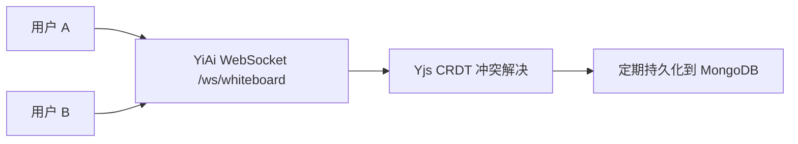

# YV-09-112: 协作白板 — Canvas + Yjs 实时多人协同 + 导出 — 开发方案

> 来源 PRD：[52-prd-协作白板.md](../prds/2026-09/52-prd-协作白板.md)

> **文档职责**：本文档定义**怎么做、为什么这么做、实际做成什么样**（HOW），不含产品目标与测试用例。
> 需求编号：YV-09-112 · 优先级：P2 · 人天：1.0d · 状态：需求已编写

---

## 一、方案

SVG Canvas 渲染 + Yjs CRDT 协作冲突解决 + YiAi WebSocket 同步。多人同时编辑白板，操作实时同步。

### 技术选型: SVG (缩放不失真) + Yjs (CRDT 无冲突) + WebSocket (双向实时) + fabric.js (可选简化版)

### 工具集: 画笔、矩形、椭圆、文本、便签、连线、图片

---

## 二、实施步骤

| 步骤 | 验证 | 人天 |
|------|------|------|
| 1 | SVG Canvas + 工具交互 | 基础图形绘制 | 0.2 |
| 2 | Yjs 协作层 + WebSocket 同步 | 多用户实时同步 | 0.3 |
| 3 | 导出 PNG/SVG/PDF + 模板 + 测试 | 导出文件正确 | 0.5 |

**合计：1.0d**。

---

## 已知缺口与技术债

> 状态：需求已编写

### 功能缺口

| # | 缺口 | 影响 | 建议 |
|---|------|------|------|
| — | 待补充 | — | — |

### 技术债

| # | 技术债 | 优先级 | 预计人天 | 说明 | 状态 |
|---|--------|--------|---------|------|------|
| — | 待补充 | — | — | — | — |
