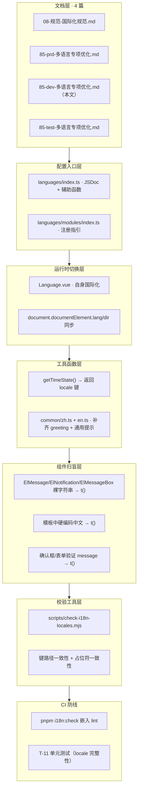
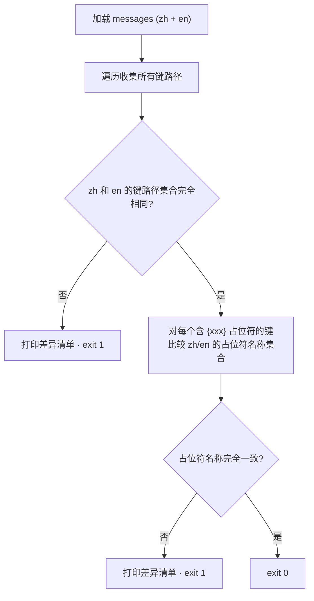
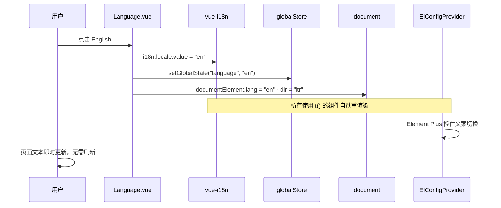
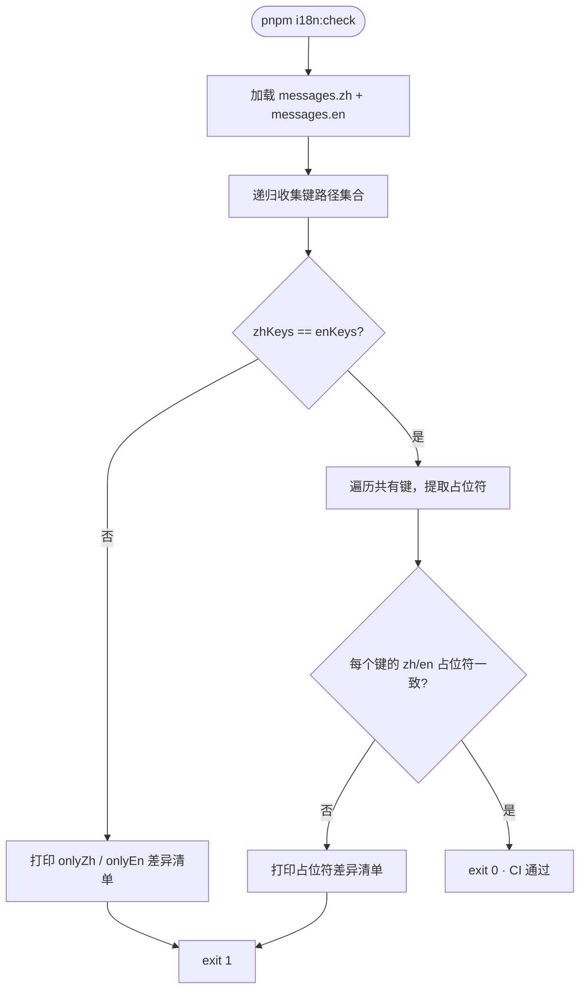

# YV-09-85: 多语言（i18n）专项优化与补充 — 开发方案

> 来源 PRD：[85-prd-多语言专项优化与补充.md](../../prds/2026-09/85-prd-多语言专项优化与补充.md)

> **文档职责**：本文档定义**怎么做、为什么这么做、实际做成什么样**（HOW），不含产品目标与测试用例。
> 需求编号：YV-09-85 · 优先级：P1 · 人天：1.5d
> 本文档定义**实现方案**——怎么做、改动哪些文件、如何验证。需求定义见 PRD，验证方式见[测试用例](../../tests/2026-09/85-test-多语言专项优化与补充.md)。

---


## 目录

- [一、方案概述](#sec-1)
- [二、文件清单](#sec-2)
- [三、模块设计](#sec-3)
- [四、接口与类型契约](#sec-4)
- [五、关键流程](#sec-5)
- [六、实施步骤与验证](#sec-6)
- [七、边缘场景处理](#sec-7)
- [八、已知约束与改进项](#sec-8)
- [九、风险与回滚](#sec-9)
- [十、完成定义（DoD）](#sec-10)

---

<a id="sec-1"></a>
## 一、方案概述

### 1.1 七层改造全景

国际化专项横跨文档、配置、运行时、工具、组件、校验六个层面，加上 CI 防线共七层：



### 1.2 关键设计决策

| # | 决策 | 理由 | 备选方案 |
|---|------|------|---------|
| D1 | `getTimeState` 返回 locale 键而非字符串 | 保持国际化入口唯一（`t()`），避免调用方重复判断语言 | 在 home 页写死切换逻辑 |
| D2 | Language.vue 下拉选项走 `t()` | 英文用户看到 "Simplified Chinese"，而非中文菜单 | 写死 `languageList` 常量 |
| D3 | `document.documentElement.lang` 在 `changeLanguage` 中同步 | 对 SEO / 屏幕阅读器友好，切换即时生效 | 仅在 App.vue `onMounted` 设一次 |
| D4 | 校验脚本走 Node CLI（`scripts/check-i18n-locales.mjs`）| CI 复用方便，`pnpm i18n:check` 本地也能跑 | Vite 插件实时报错 |
| D5 | 不引入第三个语言 | PRD Out of Scope，预留 `dir` 接口即可 | 一次加 ja-JP / zh-TW |
| D6 | 不按 locale 分包懒加载 | 模块数 < 25，打包体积可接受 | 动态 `import()` 按需加载 |

### 1.3 职责边界

| 层 | 职责 | 明确不做 |
|----|------|---------|
| `languages/index.ts` | 创建 i18n 实例、导出辅助函数、JSDoc 指引 | 不定义具体的 locale 消息 |
| `languages/modules/index.ts` | 汇总所有模块的 zh/en 消息、JSDoc 注册步骤 | 不写具体的翻译内容 |
| `Header/components/Language.vue` | 渲染语言下拉、切换 locale、同步 document 属性 | 不管理 Element Plus locale（已有 ElConfigProvider） |
| `utils/index.ts → getTimeState` | 返回时段对应的 locale 键 | 不直接返回中/英文字符串 |
| `scripts/check-i18n-locales.mjs` | 校验 zh/en 键路径和占位符一致性 | 不检查翻译语义正确性 |

---

<a id="sec-2"></a>
## 二、文件清单

| 文件 | 类型 | 职责 |
|------|------|------|
| `src/languages/index.ts` | 修改 | 新增 JSDoc 顶注 + `LocaleCode` 类型 + `AVAILABLE_LOCALES` + `normalizeLocale` + `isLocaleCode` |
| `src/languages/modules/index.ts` | 修改 | 新增 JSDoc 顶注 + `MessagesSchema` 类型导出 |
| `src/languages/modules/common/zh.ts` | 修改 | 补齐 `languageOptions`、`greeting`、通用操作提示键 |
| `src/languages/modules/common/en.ts` | 修改 | 同上（英文对应值） |
| `src/languages/modules/header/zh.ts` | 修改 | 补齐 `languageOptions: { zh, en }` |
| `src/languages/modules/header/en.ts` | 修改 | 同上（英文对应值） |
| `src/layouts/components/Header/components/Language.vue` | 修改 | 下拉选项走 `t()`、切换时同步 `document.documentElement.lang/dir` |
| `src/utils/index.ts` | 修改 | `getTimeState()` 返回 locale 键而非英文字符串 |
| `src/views/home/index.vue` | 修改 | 调用方改为 `t(getTimeState())` |
| `src/views/project/**/*.vue` | 修改 | 扫盲：ElMessage/ElNotification/ElMessageBox 硬编码文本 → `t()` |
| `src/views/proTable/**/*.vue` | 修改 | 同上 |
| `src/components/**/*.vue` | 修改 | 同上（Upload、ProTable 等） |
| `src/hooks/**/*.ts` | 修改 | 同上（useHandleData 等） |
| `scripts/check-i18n-locales.mjs` | 新增 | locale 键结构 + 占位符一致性校验脚本 |
| `tests/unit/i18n-locales.test.ts` | 新增 | Vitest 版 locale 完整性测试（T-11） |

---

<a id="sec-3"></a>
## 三、模块设计

### 3.1 配置入口 — `src/languages/index.ts`

四个新增导出，消费方各不相同：

| 导出 | 类型 | 消费方 |
|------|------|--------|
| `LocaleCode` | `"zh" \| "en"` | 全局语言值域约束 |
| `AVAILABLE_LOCALES` | `LocaleCode[]` | Language.vue 下拉选项 |
| `normalizeLocale(input)` | `(string) => LocaleCode` | 浏览器语言检测结果归一化 |
| `isLocaleCode(v)` | `(unknown) => v is LocaleCode` | 类型守卫，运行时校验 |

顶部 JSDoc 指向规范文档和 PRD，使开发者在 IDE 中即可跳转：

```typescript
/**
 * YiVad 多语言入口（vue-i18n 11.x，Composition API 模式）。
 *
 * 规范文档：YiKnowledge/projects/yivad/workflows/开发规范/08-规范-国际化规范.md
 * PRD：YiKnowledge/projects/yivad/prds/2026-09/85-prd-多语言专项优化与补充.md
 *
 * 新增键 → 编辑对应 modules/<name>/zh.ts + en.ts
 * 新增模块 → 编辑 modules/index.ts 注册两个文件
 */
```

### 3.2 模块注册入口 — `src/languages/modules/index.ts`

顶部 JSDoc 描述「新增模块」的 3 步标准流程。导出 `MessagesSchema` 类型供校验脚本/测试类型推断。

### 3.3 语言切换器 — `Header/components/Language.vue`

**改造前**：`languageList` 为硬编码常量数组，切英文后下拉仍显示中文「简体中文」。

**改造后**：

```typescript
const languageList = computed(() =>
  AVAILABLE_LOCALES.map(code => ({
    value: code,
    label: t(`header.languageOptions.${code}`)  // zh → "简体中文", en → "Simplified Chinese"
  }))
);
```

`changeLanguage()` 同步三步：

```typescript
function changeLanguage(lang: string) {
  const next = lang as LocaleCode;
  i18n.locale.value = next;                           // 1. vue-i18n 切换
  globalStore.setGlobalState("language", next);       // 2. 持久化状态
  document.documentElement.lang = next;               // 3. HTML 属性同步
  document.documentElement.dir = "ltr";
}
```

### 3.4 问候语 — `utils/index.ts → getTimeState`

**破坏性变更**（唯一一处）：返回类型从 `string`（英文字符串）变为 locale 键。

```typescript
/** 返回时段对应的 locale 键。调用方必须使用 t(getTimeState()) 渲染。 */
export function getTimeState(): string {
  const h = new Date().getHours();
  if (h >= 6 && h < 12) return "common.greeting.morning";
  if (h < 14) return "common.greeting.afternoon1";
  if (h < 18) return "common.greeting.afternoon2";
  if (h < 24) return "common.greeting.evening";
  return "common.greeting.night";
}
```

调用方（`views/home/index.vue`）同步改为：

```typescript
const greeting = computed(() => t(getTimeState()));
```

### 3.5 通用提示键 — `common/zh.ts` + `common/en.ts`

扫盲过程中发现的高频操作提示，统一收敛到 `common` 模块：

| 键 | zh | en |
|----|----|----|
| `common.createSuccess` | 创建成功 | Created successfully |
| `common.updateSuccess` | 更新成功 | Updated successfully |
| `common.deleteSuccess` | 删除成功 | Deleted successfully |
| `common.saveSuccess` | 保存成功 | Saved successfully |
| `common.operationSuccess` | 操作成功 | Operation successful |
| `common.operationFailed` | 操作失败 | Operation failed |
| `common.confirmDelete` | 确认删除？ | Confirm deletion? |
| `common.greeting.morning` | 早上好 | Good morning |
| `common.greeting.afternoon1` | 下午好 | Good afternoon |
| `common.greeting.afternoon2` | 下午好 | Good afternoon |
| `common.greeting.evening` | 晚上好 | Good evening |
| `common.greeting.night` | 夜深了 | Good night |
| `header.languageOptions.zh` | 简体中文 | Simplified Chinese |
| `header.languageOptions.en` | English | English |

### 3.6 组件扫盲 — 五步替换法

对每个硬编码位置执行：**定位 → 设计 locale 键 → 双写 zh/en → 替换 → 本地回归**。

**第 1 轮：面向用户的提示语（最高优先级）**

```bash
rg 'ElMessage\.(success|error|warning|info)\s*\(\s*"' src/
rg 'ElNotification\(' src/
rg 'ElMessageBox\.(alert|confirm|prompt)\(' src/
```

**高优先级文件清单**：

| 文件 | 硬编码位置 | 替换为 |
|------|-----------|--------|
| `views/proTable/treeProTable/index.vue` | `ElMessageBox` title = "温馨提示" | `t("common.tips")` |
| `components/Upload/FileUpload.vue` | ElNotification title/message 中文 | `t("upload.sizeExceeded")` / `t("upload.countExceeded")` |
| `hooks/useHandleData.ts` | 批量删除成功/失败中文提示 | `t("common.batchDeleteSuccess")` / `t("common.operationFailed")` |
| 散落 `views/**` 的 ElMessage.success("创建成功") | 20+ 处 | `t("common.createSuccess")` 等 |

**第 2 轮：模板文本**

```bash
rg '>\s*[\u4e00-\u9fa5]' src/**/*.vue
rg ':label="[\u4e00-\u9fa5]' src/**/*.vue
rg ':placeholder="[\u4e00-\u9fa5]' src/**/*.vue
```

**第 3 轮：对象属性（表单验证 message 等）**

```bash
rg 'message:\s*"[\u4e00-\u9fa5]' src/
```

每修改 10 处 → 切换语言验证 → 继续。

### 3.7 结构校验脚本 — `scripts/check-i18n-locales.mjs`

三步校验逻辑：



关键实现约束：
- 用 `tsx` 或 `esbuild` 加载 TS 模块（`languages/modules/index.ts`）
- 递归遍历对象收集键路径（`.` 分隔）
- 正则 `/\{([a-zA-Z_][a-zA-Z0-9_]*)\}/g` 提取占位符

`package.json` 集成：

```json
{
  "scripts": {
    "i18n:check": "node scripts/check-i18n-locales.mjs",
    "lint": "... && pnpm i18n:check"
  }
}
```

---

<a id="sec-4"></a>
## 四、接口与类型契约

### 4.1 Locale 键命名规范

| 规则 | 示例 |
|------|------|
| 模块前缀 = 目录名 | `project.*`、`common.*`、`header.*` |
| 层级用 `.` 分隔 | `project.detail.tabs.overview` |
| 动作/状态用 camelCase | `createSuccess`、`operationFailed` |
| 占位符用 `{name}` | `common.deleteConfirm: "确认删除 {name}？"` |
| 禁止硬编码字符串 | 禁止 `v-auth="'add'"` 式的裸字符串 |

### 4.2 TypeScript 类型导出

```typescript
// languages/index.ts
export type LocaleCode = "zh" | "en";
export const AVAILABLE_LOCALES: LocaleCode[] = ["zh", "en"];
export function normalizeLocale(input: string): LocaleCode;
export function isLocaleCode(v: unknown): v is LocaleCode;

// languages/modules/index.ts
export type MessagesSchema = typeof messages;
```

### 4.3 破坏性变更

| 变更 | 影响范围 | 迁移方式 |
|------|---------|---------|
| `getTimeState()` 返回类型从 `string` → locale 键 | 仅 `views/home/index.vue` 一处调用 | 改为 `t(getTimeState())`，同一 commit 修复 |

---

<a id="sec-5"></a>
## 五、关键流程

### 5.1 语言切换全链路



### 5.2 i18n:check 校验流程



### 5.3 新增模块 locale 标准流程

```
1. mkdir src/languages/modules/<name>/
2. 创建 zh.ts → export default { <name>: { ... } }
3. 创建 en.ts → export default { <name>: { ... } }
4. 在 modules/index.ts 中 import 并展开到 messages.zh / messages.en
```

---

<a id="sec-6"></a>
## 六、实施步骤与验证

| 步骤 | 内容 | 涉及文件 | 验证方式 | 人天 |
|------|------|---------|---------|------|
| 1 | 补齐 4 篇文档 + README 引用 | YiKnowledge 4 篇 + YiVad README | 文档存在且链接可点击 | 0.25 |
| 2 | 配置入口 JSDoc + 辅助函数 | `languages/index.ts`、`languages/modules/index.ts` | IDE 中可见 JSDoc 链接；`LocaleCode` 类型推导正确 | 0.15 |
| 3 | Language.vue 自身国际化 + document 同步 | `Language.vue`、`header/zh.ts`、`header/en.ts` | 切英文后下拉显示 "Simplified Chinese" | 0.15 |
| 4 | getTimeState 改为返回 locale 键 | `utils/index.ts`、`views/home/index.vue`、`common/zh.ts`、`common/en.ts` | 中英文首页欢迎语正确 | 0.15 |
| 5 | common 模块补齐通用提示键 | `common/zh.ts`、`common/en.ts` | 所有键在 zh/en 中均存在 | 0.1 |
| 6 | 组件扫盲第 1 轮（ElMessage 等） | `views/**`、`components/**`、`hooks/**` | `rg` 扫描中文结果 = 0（或仅剩 debug 日志） | 0.4 |
| 7 | 组件扫盲第 2-3 轮（模板、表单验证） | 同上 | 切中英文后关键页面无裸中文/英文 | 0.15 |
| 8 | 校验脚本 + CI 集成 | `scripts/check-i18n-locales.mjs`、`package.json` | 删一个 en 键 → `i18n:check` exit 1 | 0.1 |
| 9 | 单元测试 T-11（locale 完整性） | `tests/unit/i18n-locales.test.ts` | `pnpm test` 通过 | 0.05 |

**合计：1.5d**。

### 验证检查点

| 步骤 | 验证项 | 通过标准 |
|------|--------|---------|
| 2 | 类型导出 | `LocaleCode` 为字面量联合类型，拼错语言代码编译失败 |
| 3 | 下拉双语 | 切英文 → 打开语言下拉 → zh 选项显示 "Simplified Chinese" |
| 4 | 问候语 | 切中英文 → 首页欢迎语随语言和时段正确变化 |
| 6 | 扫盲 | `rg 'ElMessage\.(success\|error)\s*\(\s*"[\u4e00-\u9fa5]' src/` 返回空 |
| 8 | 校验脚本 | 人为制造差异（删键/改占位符）→ 脚本报错并列出差异 |

---

<a id="sec-7"></a>
## 七、边缘场景处理

| 场景 | 触发条件 | 处理策略 | 实现位置 |
|------|---------|---------|---------|
| 浏览器语言为非 zh/en | `navigator.language` 返回 `fr`/`ja` 等 | `normalizeLocale` 归一化为 `en`（默认） | `languages/index.ts` |
| locale 键缺失 | 代码使用了 `t("a.b.c")` 但键不存在 | vue-i18n `missingWarn`（dev 模式 console.warn） | `languages/index.ts` |
| Element Plus 组件内文案不切换 | ElConfigProvider locale 未同步 | 已通过 App.vue 顶层 `el-config-provider` 绑定 locale，切换时自动响应 | `App.vue` |
| demo 目录中文数据 | ViewsDemo.vue / TablesDemo.vue 静态数据 | 豁免（仅 dev 环境可见），代码加 `__DEMO__` 注释标记 | 各 demo 文件 |
| store 中调用 ElMessage | Pinia action 中直接写中文提示 | store 内 `useI18n()` 必须在每次 action 内调用，不可顶层解构 | `stores/modules/*.ts` |
| 用户浏览器禁用 JS | SPA 不可用 | 不适用（SPA 无 JS 不可渲染） | — |
| 切换语言时 SSE 连接活跃 | AI 对话进行中切语言 | 对话内容不受影响（消息已持久化），仅 UI 文案切换 | `stores/modules/aiChat.ts` |

---

<a id="sec-8"></a>
## 八、已知约束与改进项

### 约束 1（当前设计）：ElMessage 在 store 中使用需每次调用 useI18n

**现象**：Pinia setup store 顶层 `const { t } = useI18n()` 在 action 被调用时可能丢失上下文。

**处理**：每个 action 内独立调用 `const { t } = useI18n()`，不在顶层解构。

### 约束 2（Out of Scope）：后端返回文案翻译

**现象**：YiAi 后端返回的错误消息、枚举值为中文，前端无法通过 `t()` 翻译。

**处理**：PRD 明确列为 Out of Scope，后续独立 PRD 覆盖（前端枚举 lookup 方案）。

### 约束 3（待观察）：ElConfigProvider 切换后部分控件不刷新

**现象**：Element Plus 部分深层组件（如 DatePicker 内部面板）在语言切换后可能保留原文案。

**处理**：当前通过 `el-config-provider` 的 `locale` prop 绑定响应式值。若仍不生效，备选方案是在 App.vue 加 `:key="i18n.locale.value"` 强制重建。

---

<a id="sec-9"></a>
## 九、风险与回滚

### 风险

| 风险 | 概率 | 影响 | 缓解措施 |
|------|------|------|---------|
| 扫盲替换导致 locale 键不对、页面显示裸 key | 中 | 中 | PR 中必须包含「切中英双语截屏」；每 10 处修改 → 切语言验证 |
| `getTimeState` 改返回键后遗漏调用方 | 低 | 高 | 全仓搜索 `getTimeState` 确认仅 home 页面使用 |
| `i18n:check` 在 CI 误报阻塞发布 | 低 | 中 | 脚本加 `--fix` 模式或 EXCLUDE 白名单 |
| 新增模块未注册到 `modules/index.ts` | 中 | 低 | JSDoc 步骤指引 + Code Review checklist |

### 回滚

| 场景 | 回滚方式 | 影响范围 |
|------|---------|---------|
| 扫盲替换大面积出错 | `git revert` 整个 commit | 全部 i18n 改动 |
| getTimeState 导致首页崩溃 | `git revert` + 确认调用方 | home 页面 |
| i18n:check 阻塞 CI | 从 `lint` scripts 中临时移除 | CI 流水线 |

---

<a id="sec-10"></a>
## 十、完成定义（DoD）

- [ ] 4 篇文档 Front-matter 齐全、README 超链接可点击
- [ ] `languages/index.ts` 新增 4 个导出 + JSDoc 顶注
- [ ] Language.vue 下拉双语、切换时 `<html lang>` 同步更新
- [ ] `getTimeState` 调用方通过 `t(...)` 渲染，中英文都正确
- [ ] `common/zh.ts` + `common/en.ts` 补齐所有通用提示键
- [ ] 组件扫盲完成：`rg` 扫描 `ElMessage/ElNotification/ElMessageBox` 中文硬编码 = 0
- [ ] `scripts/check-i18n-locales.mjs` 可运行，人为删一个 en 键能正确报错
- [ ] `pnpm i18n:check` 嵌入 `lint`，对当前 locale 通过
- [ ] `pnpm type:check` 与 `pnpm lint:eslint` 通过
- [ ] 测试用例 T-01 ～ T-12 中 P0 用例全部通过
