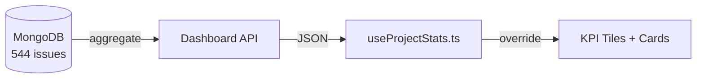

# YV-09-92: 项目数据看板聚合修复 — 开发方案

> 关联 PRD: [92-prd-项目数据看板聚合修复](../prds/2026-09/92-prd-项目数据看板聚合修复.md)
> 关联 Test: [92-prd-test-项目数据看板聚合修复](../tests/2026-09/92-prd-test-项目数据看板聚合修复.md)

---

## 1. 方案概述

`POST /analytics/dashboard` 是项目列表页和详情页 Analytics 标签的**唯一数据源**。前端 `useProjectStats.ts` 将服务端聚合结果视为权威数据，直接覆盖客户端本地计算（`serverStatsByKey → ensure(key) → 赋值`）。

该 API 的服务端聚合管道存在三个 Bug，导致 yivad 项目仅统计 9/544 条 Issue（1.7%）。本文档记录修复方案。

**数据流**：



## 2. 文件清单

| 操作 | 文件 | 行数变化 |
|------|------|---------|
| 修改 | `YiAi/src/services/analytics/project_dashboard.py` | +25 / -15 |

## 3. 模块设计

### 3.1 修复点 1：project_key 大小写匹配

**问题**：MongoDB `$match` 严格区分大小写。535 条 `project_key: "YiVad"` 和 9 条 `"yivad"`。

```diff
- match["project_key"] = project_key
+ match["$or"] = [
+     {"project_key": project_key},
+     {"project_key": "YiVad" if project_key == "yivad" else project_key},
+ ]
```

### 3.2 修复点 2：status 枚举扩展

**问题**：`$eq: ["$status", "done"]` 仅匹配小写，106 条 `"Done"` 被漏计。

```diff
+ CLOSED = ["done", "Done", "closed", "Closed", "resolved", "Resolved",
+           "completed", "Completed", "cancelled", "Cancelled"]
- "done": {"$sum": {"$cond": [{"$eq": ["$status", "done"]}, 1, 0]}},
+ "done": {"$sum": {"$cond": [{"$in": ["$status", CLOSED]}, 1, 0]}},
```

### 3.3 修复点 3：逾期判断门控

**问题**：缺失的 `due_date` 字段解析为 `null`，MongoDB 中 `null < "2026-09-23"` 为 `true`。

```diff
+ {"$gte": ["$due_date", "1970-01-01"]},
  {"$lt": ["$due_date", end.strftime("%Y-%m-%d")]},
- {"$ne": ["$due_date", None]},
```

`$gte: [null, "1970-01-01"]` → `false`（null 与 string 比较），有效阻止缺失字段被计为逾期。

### 3.4 修复点 4：合并大小写 key

**问题**：聚合产生 `YiVad`(535) 和 `yivad`(9) 两条记录。前端 `serverStatsByKey` 按 `yivad` 查找，仅匹配 9 条。

```python
nk = key.lower()
if nk in merged:
    m = merged[nk]
    m["issues"] += iss["issues"]
    m["done"] += iss["done"]
    # ... sum all fields
else:
    merged[nk] = {"project_key": nk, "issues": iss["issues"], ...}
```

## 4. 接口与数据契约

**请求**：`POST /analytics/dashboard {"project_key": "yivad"}`

**响应（修复后）**：

```json
{
  "basic": {
    "by_project": [{
      "project_key": "yivad",
      "issues": 544, "done": 206, "open": 338,
      "overdue": 0, "unassigned": 0,
      "bugs": 187, "modules": 4
    }],
    "completion_pct": 37.9
  }
}
```

## 5. 实施步骤

| 步骤 | 操作 | 验证 |
|------|------|------|
| 1 | 修改 `project_dashboard.py` 四个修复点 | 语法检查 |
| 2 | 清除 `__pycache__`，重启 uvicorn | 启动无错误 |
| 3 | `curl POST /analytics/dashboard` | issues=544, done=206, overdue=0 |
| 4 | 刷新前端 `/project/yivad` | KPI 磁贴数据正确 |

## 6. 边缘场景

| 场景 | 处理 |
|------|------|
| 无 `project_key` 参数 | `match` 为空 `{}`，返回全量数据（不受 `$or` 影响） |
| `project_key` 非 yivad | `$or` 中两个值相同（均为传入值），等同于直接匹配 |
| MongoDB 中 `due_date` 为 `""` 空字符串 | `$gte: ["", "1970-01-01"]` → `true`，仍需后续 `$lt` 判断 |

## 7. 风险与回滚

| 风险 | 缓解 | 回滚方式 |
|------|------|---------|
| `$or` 查询无法使用索引 | 数据量小（544 条），性能影响可忽略 | 还原为 `match["project_key"] = project_key` |
| 合并逻辑影响其他项目 | 仅 `key.lower()` 相同才合并（不同项目首字母不同） | 还原合并前的逐条 `append` 逻辑 |

## 8. 完成定义 (DoD)

- [x] `/analytics/dashboard` 返回 544 条 Issue
- [x] `done` = 206（106 "Done" + 92 "done" + 8 native）
- [x] `overdue` = 0
- [x] `unassigned` = 0
- [x] `by_project` 仅一条 `project_key=yivad`
- [x] 无 project_key 参数时返回全量数据正常
- [x] 前端页面 KPI 数据正确